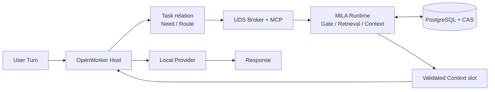
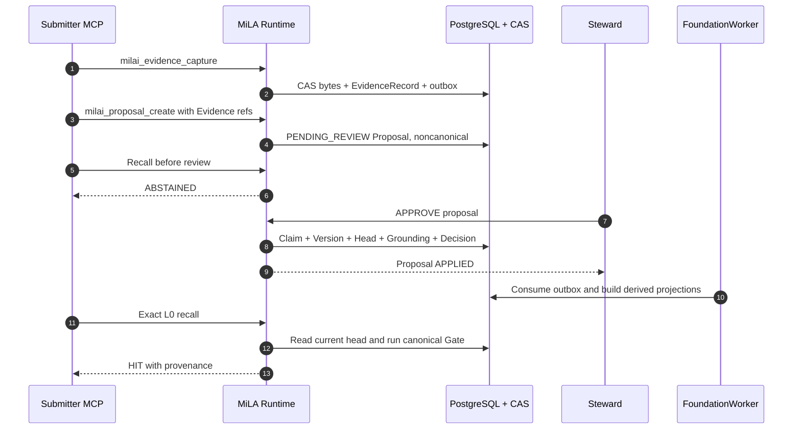
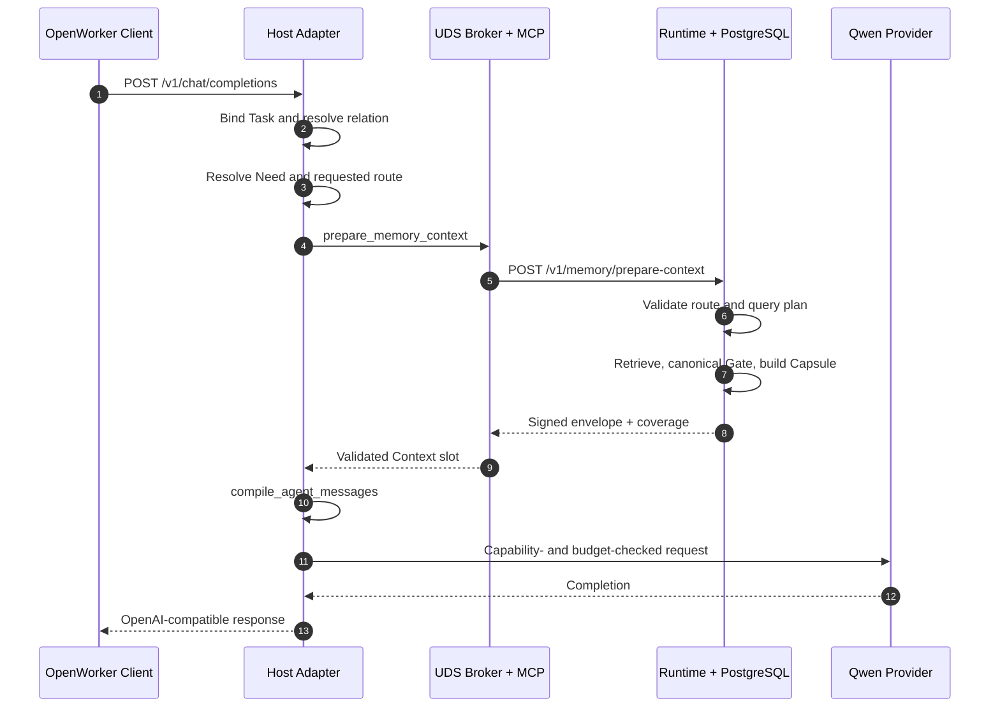
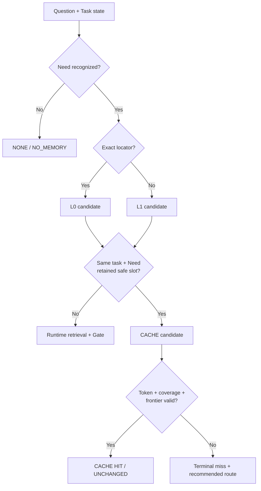

# MiLA 真实执行流程

_基于 2026-08-25 本地代码追踪、真实 Runtime 启动、受治理写入、OpenWorker 双 Turn 调用及全套回归验证_

---

## 🧭 一页结论

1. MiLA 当前不是一个自行运行的 Agent，而是一个受治理的本地 memory Runtime；OpenWorker Host 才拥有一次 Agent execution 的控制权。
2. 在线主链是 `User Turn → OpenWorker → Task relation → Need → Route → MCP/Runtime → validated Context → Provider → Answer`。
3. 写入链与回答链严格分开。一次普通回答不会自动形成记忆；成为 current truth 必须显式经过 `Evidence → Proposal → Steward review → Claim/ClaimVersion/ClaimHead`。
4. Evidence 是“发生或观察到什么”；当前 StateView 由 canonical Claim head、OpenIssue 和 Gate 动态解析；Context 是为本次 execution 临时构造的派生物。
5. Need、task relation、route candidate 和 CACHE candidate 均由 Host 侧确定性逻辑决定，不由 LLM 决定；Runtime 负责最终的 fail-closed validation。
6. CACHE 不是 Redis 或数据库对象，而是 Host 保留的 task-local Context slot 加 Runtime 签发的 validation token；命中仍需验证 Need、binding、版本、issue revision、canonical frontier 与 TTL。
7. 实测首 Turn 通过 L0 exact route 召回持久 Claim，第二 Turn 在同一 task、同一 Need 和同一 canonical position 下走 CACHE；两次真实 Qwen provider 都回答 `3.11`。
8. 正常 OpenWorker 回答后只追加 adapter trace 与 provider ledger，并更新进程内 slot；不会写 Runtime `ChatTurn`、Evidence 或 Claim。
9. FTS、vector、fragment/window projection 都是可重建索引，不是 truth source；L0 exact 直接读取 canonical head，不依赖向量检索。
10. 本次验证包括 isolated smoke 9/9、Runtime 251 passed、六个 integration package 共 186 passed，以及三 session Agent E2E 全部通过。

完整 repository 状态、数据模型、风险和 eval 体系见 [MiLA Current-State Architecture Report](MiLA_Current-State_Architecture_Report.md)。

## 🏗️ 当前运行拓扑与控制权

| Control point | 当前 owner | 实现性质 | 结果 |
|---|---|---|---|
| Task relation | OpenWorker Host | deterministic rules + process-local registry | `CONTINUE` / `SUBTASK` / `SWITCH` / `RETURN` / `AMBIGUOUS` |
| Memory Need | OpenWorker Host | English lexical heuristic | typed Need signature + initial L0/L1/NONE |
| CACHE candidate | OpenWorker Host | same task、same Need、retained slot、safe event | CACHE 或 resolver route |
| Route safety override | MiLA Runtime | deterministic policy | validated NONE/CACHE/L0/L1；L2 disabled |
| Retrieval and Gate | MiLA Runtime | deterministic query plan + canonical validation | accepted results、abstention 或 degradation |
| Prompt assembly | Python client/OpenWorker | governed compiler + token budget | provider messages |
| Answer generation | local provider | LLM | final content |
| Canonical mutation | Steward + PostgreSQL procedures | explicit governed transaction | Claim version/head、issue、decision、history |

主要控制入口：

- OpenWorker：`integrations/openworker-mcp/src/milai_openworker_mcp/host_adapter.py::OpenWorkerProviderAdapter.complete()`。
- Runtime API：`runtime/src/milai/api/app.py::create_app()`。
- Context orchestration：`runtime/src/milai/application/context_preparation.py::PrepareContextService.prepare()`。
- Projection/purge：`runtime/src/milai/workers/main.py::FoundationWorker`。

文档生成时，主 Runtime 仍运行于 `127.0.0.1:28080`：API PID `2739608`、worker PID `2739607`；data mode 为 `SYNTHETIC_ONLY`，readiness tier 为 `CANDIDATE`，数据库 migration head 为 `0028_dg11_window_projection`。

## ✍️ 真实写入与 canonical commit 流程

真实顺序如下：

1. `milai_evidence_capture` 调用 Runtime `POST /v1/evidence`。`EvidenceService.ingest()` 校验请求，先保存 content-addressed bytes，再由 TX-01 写入 `EvidenceRecord`、idempotency record、operational event 与 outbox。
2. `milai_proposal_create` 调用 `POST /v1/proposals`。调用者提交 candidate patch 和 Evidence references；`ProposalService` 只创建 `PENDING_REVIEW` proposal，`CommitPolicy` 为 `USER_REVIEW`。
3. 此时 Evidence 已持久化，但尚无 canonical Claim；实测 review 前 recall 返回 `ABSTAINED`。这证明 Evidence 本身不是系统 belief。
4. Steward 显式调用 `POST /v1/proposals/{proposal_id}/review`。数据库 procedure 通过 compare-and-swap 原子写入 Claim、ClaimVersion、ClaimHead、GroundingRelation、StewardDecision、history 和 outbox。
5. `FoundationWorker` 异步消费 outbox，更新 FTS/vector/fragments/windows 等派生 projection。L0 exact recall 直接读取 canonical head，因此不以 projection 为 truth。
6. 后续 retrieval 对候选执行 canonical Gate，再生成带 provenance pointer 的 Context；不会把 retrieval result 或 LLM output反向提升为 Claim。

本次真实持久写入使用纯合成数据：

| Object | ID / value | 最终状态 |
|---|---|---|
| Subject marker | `milai-live-e2e-b94ded16bbbe` | synthetic test identity |
| Evidence | `17242da3-8a72-4186-be66-ba2962251edc` | retained |
| Proposal | `4de9d9ab-de22-4835-af4f-d133c4ea93de` | `APPLIED` |
| Steward decision | `525d80cf-36b0-4720-a5eb-15505b44786c` | `APPROVE` |
| Claim | `59d4d436-7632-496d-8541-ce55c47409e8` | `EFFECTIVE` |
| ClaimVersion | `95d4ad4a-7801-403c-ae82-a893d6fd2f8e` | current head |
| Recorded payload | Python `3.11`；codename `CEDAR-B94DED16BBBE` | exact L0 recall verified |
| Lineage | Evidence `SUPPORTS` ClaimVersion | verified |

关键实现：

- MCP write tools：`integrations/mcp/src/milai_mcp/server.py::milai_evidence_capture()`、`milai_proposal_create()`。
- Evidence API/service：`runtime/src/milai/api/evidence_routes.py`、`runtime/src/milai/application/evidence.py::EvidenceService.ingest()`。
- Proposal/review：`runtime/src/milai/api/canonical_routes.py::review_proposal()`、`runtime/src/milai/application/proposals.py::ProposalService`。
- Canonical transaction：`runtime/src/milai/persistence/canonical_repository.py::CanonicalRepository.review_proposal()`。

## 🔍 真实读取、StateView 与 Context 流程

逐步 call path：

1. `host_adapter.py::Handler.do_POST()` 接收 OpenAI-compatible request，解析 messages、question 与 request-local ID。
2. `OpenWorkerProviderAdapter._bind_task_state()` 把 host payload 转成 `TaskMemoryState`，调用 `DeterministicTaskRelationResolver.resolve()`，再以 CAS revision 更新 `HostTaskRegistry`。
3. `DeterministicMemoryNeedResolver.resolve()` 根据当前问题和已知 claim/state-key/issue locator 生成 typed Need。
4. `_requested_memory_route()` 选择 `NONE`、`CACHE`、`L0` 或 `L1` candidate。
5. `TaskMemoryController.prepare_context()` 经 `McpUnixClient`、persistent UDS、broker 和每连接 MCP child 调用隐藏工具 `milai_prepare_context`。
6. Runtime `PrepareContextService.prepare()` 校验 identity、Need、route 和 token。L0/L1 时调用 `RetrievalService.retrieve()`；`QueryPlanner` 与 query operators 形成候选，再经过 canonical Gate。
7. 在 L0/L1 path 中，Runtime 持久化 `RetrievalTrace`，构建 `ContextCapsule` 和 pointers，并返回签名 validation token、coverage 与 canonical position。
8. Host 校验 envelope，`GovernedContextCompiler` 形成 task-local slot；`compile_agent_messages()` 把它组装进本 Turn prompt。
9. `ProviderExecutionGateway.execute()` 先检查 capability manifest 和累计 token budget，在 hash-chained ledger 中 reservation，再调用 loopback provider。
10. Host 返回 completion。正常 OpenWorker path 不调用 Evidence、Proposal 或 Runtime `/v1/chat`，因此没有自动 learning write。

Evidence、StateView、Context 的真实边界：

| Logical layer | 当前实现对象 | 持久性 | 是否 truth |
|---|---|---|---|
| Evidence | `EvidenceRecord`、`ContentBlob`、CAS bytes、source/time/provenance | durable | Evidence truth，不直接是 belief |
| StateView | `Claim`、`ClaimVersion`、`ClaimHead`、`OpenIssue` 经 ECS/Gate 解析出的当前有效状态 | durable canonical graph + derived view | canonical current truth |
| Context | `RetrievalTrace`、`ContextCapsule`、pointer、validation token、Host `PrefetchContext`/slot、compiled messages | mixed；Capsule/trace durable，Host slot process-local | derived，不可提升 truth |
| Execution output | Provider response、adapter JSONL、provider ledger | run-scoped trace | 非 canonical |

代码中没有一个统一命名为 `StateView` 的核心 class；该层是由 current Claim head、live OpenIssue、grounding/permission/retention 条件和 Gate 共同实现的可操作视图。

### 两种 OpenWorker memory 接入模式

| Mode | Host 行为 | Provider 何时执行 |
|---|---|---|
| `prefetch` | 通过隐藏 `milai_prepare_context` 在调用模型前准备完整 Context | Runtime 返回 validated Context 后执行 |
| `auto` visible tool | 首次返回 `milai_recall` tool call；外部 OpenWorker 执行 relay，并把 tool result 放回下一次 messages | 收到并编译可识别的 recall result 后执行 |

可见工具路径已独立验证：`stdio → milai-mcp-relay → UDS broker → MCP → Runtime`。`reader-lite` profile 对调用方只暴露 `milai_recall`；broker 持有 Runtime credential，relay 调用方不接触 bearer。该路径与上述隐藏 composite prefetch path 最终进入同一 Runtime authority boundary。

Observed exception：active adapter 会扫描 `tool` 和 `user` role 中的 nested JSON；形状满足 `status`、`items`、`open_issue_ids` 的 user payload 也可能被当成 recall result，并经 `prepare_prefetch()` 注入 Context，而不经过 MCP/Runtime Gate。该分支未用于本次 trusted live test，现有测试也没有对应的 user-spoof negative case。

### 独立 Runtime chat 不是同一条链

Repository 还暴露 `POST /v1/chat`：`ChatService.chat()` 固定发起 L1 retrieval，经 Gate 和 `ContextService.build()` 后使用确定性 renderer 生成回答；成功路径写 `RetrievalTrace`、`ContextCapsule` 和 `ChatTurn`，abstention 分支的写入组合不同。它不经过 Task relation、Need、CACHE 或 OpenWorker provider。本次双 Turn 真实模型测试没有使用这条接口。

## ⚙️ OpenWorker 双 Turn 实测

同一持久 Claim 被送入真实本地 provider `Qwen3.6-35B-A3B-FP8`，结果如下。时间仅代表这次单次现场运行，不是正式 benchmark。

| Signal | Turn 1 | Turn 2 |
|---|---|---|
| Task relation | `SWITCH` | `CONTINUE` |
| Need intent | `CURRENT_STATE` | 相同 typed Need |
| State locator | exact `known_claim_ids` + `StateKeyRef` | 同一 locator |
| Requested / validated / terminal route | `L0 / L0 / L0` | `CACHE / CACHE / CACHE` |
| Runtime state | `READY`、`current_state_status=HIT` | `UNCHANGED`、reason=`VALIDATED_TASK_SLOT_REUSE` |
| Context | 1 claim、0 issues、约 114 memory tokens | retained slot 经 Runtime revalidation |
| MCP/Runtime roundtrip | 约 `951.912 ms` | 约 `10.738 ms` |
| Provider latency | 约 `1451 ms` | 约 `360 ms` |
| Provider tokens | 323 prompt + 31 completion | 323 prompt + 31 completion |
| Provider answer | `{"answer":"3.11","memory_used":true,"status":"KNOWN"}` | 相同正确答案 |

Provider ledger 的六个事件形成并通过 hash-chain 验证：两轮各自按 `RESERVED → PROVIDER_TERMINAL → POST_PROVIDER_TERMINAL` 完成；累计 646 prompt tokens、62 completion tokens，两个 terminal 均为 `SUCCEEDED`，native request ID 唯一。

## ⚡ Need、Route 与 CACHE 的真实条件

### Need 使用的信号

`DeterministicMemoryNeedResolver` 使用 current question、scope、authority/consistency、known claim IDs、`StateKeyRef`、open issue IDs、canonical position 和 previous Need。它是英文 token/regex heuristic，不调用 LLM、embedding 或 retrieval。

### L0、L1 与 FastPath

- L0 要求 Claim ID 或完整 `(subject_id, predicate, claim_type)`，直接读取 current head 并执行 Gate。
- L1 使用 exact/FTS，必要时再进入 vector、recent/canonical fallback、fusion、Gate 和 operator/reranker。
- repository 没有名为 `FastPath` 的单一 runtime class；eval 把 `{NONE, CACHE, L0}` 统计为 fast routes。
- progressive L1 可以在 Gate 后提前停止后续检索，但不会绕过 canonical Gate。

### CACHE 成立条件

Host candidate gate 必须同时满足：

- relation 是完全相同 TaskIdentity 的 `CONTINUE`；
- typed Need signature 与上次一致；
- retained Context slot 存在；
- scope/profile compatible；
- event 不是 goal change、memory-affecting tool result、canonical-position change 或 action proposal。

Runtime 还会验证 HMAC、principal/session/agent/profile/task epoch/goal binding、Need coverage、claim head version、state-key head version、OpenIssue revision、global canonical outbox position、TTL、deadline 与 counters。CACHE hit 不重新做完整 retrieval，但也不是未经验证地复用旧 prompt。

重要例外：CACHE miss 会返回 recommended L0/L1 route，但当前 active Host 不会在同一 call 内自动 follow；它按 fail-closed 语义终止为 degraded/unknown。

## ⚠️ 实测的 fail-closed 与 fallback 分支

| 触发条件 | 真实行为 | 语义结果 |
|---|---|---|
| 问法 `What runtime Python version is recorded...` 未命中 lexical Need rule | intent `NONE`、route `NONE` | controlled `UNKNOWN`；不会假装召回 |
| 问法包含 `current` | Runtime planner 选择 `LATEST_VALID_STATE` | synthetic Claim 无 payload time slot，返回 `OPERATOR_TIME_UNCERTAIN` / `UNCERTAIN` |
| 改用 `configured` 且携带 exact locator | Need `CURRENT_STATE`、route L0 | canonical HIT，回答 `3.11` |
| 请求 CACHE 但没有 known claim/state-key locator | validation 拒绝 | `CACHE_NEED_UNDER_SPECIFIED` |
| 有 slot 但 task/Need/scope/version/frontier 不一致 | CACHE miss | 不使用 stale Context，返回 recommended route |
| MCP/Runtime unavailable 或 tool result 缺失 | Host fail closed | `UNKNOWN` / error result，不用旧 memory 猜答案 |
| L0 无 locator | Runtime route override | 升为 L1，而非伪 exact hit |
| canonical-changing/action event 请求 NONE/CACHE/L0 | Runtime safety override | 强制 L1 refresh |

第二行是 query operator 的时间语义，不表示已批准 Claim 无效；它说明“当前最新”问题还要求 payload 提供 operator 可解释的时间字段。第三行验证了 canonical current head 本身可以被 exact L0 正常读取。

## 💾 回答后的写操作与持久化边界

| Object / store | 生命周期 | 当前角色 |
|---|---|---|
| PostgreSQL canonical graph | long-lived、versioned、auditable | current truth 与 governance history |
| Tenant CAS bytes | long-lived，直到 governed revoke/purge | Evidence body source |
| FTS/pgvector/fragments/windows | asynchronous、rebuildable | derived index，不是 truth |
| RetrievalTrace / ContextCapsule | durable audit/derived Context | 解释一次 retrieval/context，不成为 Claim |
| Host task registry / retained slot / last Need | process lifetime | execution working state；restart 后丢失 |
| Validation token | bounded TTL、server 不单独保存 | signed proof，不是 cache store |
| Adapter JSONL / provider ledger | run-scoped append-only | execution trace 和 provider accounting |
| Provider answer | response lifetime + trace | 非 Evidence、非 StateView、非 automatic memory write |

正常 OpenWorker response 之后的实际动作只有：

1. Host 更新进程内 retained slot、last Need 和 task registry revision。
2. Adapter 追加 route/task/timing JSONL。
3. Provider gateway 追加 capability、budget、terminal 和 hash-chain ledger event。
4. 不调用 Runtime Evidence ingest、Proposal/review、Episode settlement 或 `/v1/chat`。

因此，模型“说了什么”不会天然成为下一轮的 canonical truth。要写入，调用方必须重新进入上一节的显式 governance chain。

`[UNKNOWN]`：repository 内没有 HostTaskRegistry 的 durable backend；外部 OpenWorker 是否在跨进程、跨 session 时持久化并重送完整 TaskIdentity/TaskMemoryBinding，无法仅由本 repository 确认。

## ✅ 本次运行与测试证据

| Verification | Result | 说明 |
|---|---|---|
| Runtime doctor | 17/17 PASS | FTS/vector/purge lag 均为 0；dead letter 为 0 |
| Isolated full-chain smoke | 9/9 PASS | ingest、review、projection、L0/L1、Context、revoke、deletion |
| Runtime full gate | 251 passed、1 skipped | fresh isolated DB；63.79 s；cleanup PASS |
| Integration packages | 186 passed | Python client 124、MCP 14、OpenWorker 32、AutoGen 6、LangGraph 4、hooks 6 |
| Three-session Agent E2E | PASS | restart continuity、isolation negatives、conflict、revocation、physical erasure、runtime disconnect |
| Persistent live write/read | PASS | pre-review abstention；post-review Claim EFFECTIVE；lineage 和 L0 recall verified |
| OpenWorker real provider | 2/2 PASS | first L0、second CACHE；answers correct；ledger chain verified |
| Credential-free relay | PASS | stdio → relay → UDS broker → MCP → Runtime |

保留的机器可读报告：

- [Isolated smoke report](runtime/var/reports/smoke-9bc43906d0764df7a8738103dabc656e.json)
- [Runtime full gate report](runtime/var/reports/runtime-full-gate-live-b94ded16bbbe.json)
- [Agent E2E report](runtime/var/reports/agent-e2e-live-b94ded16bbbe.json)

Runtime gate 的唯一 skip 是可选 `milai_client` 在该 Runtime-only test environment 中不可 import；不是 test failure。所有 test-specific adapter、broker、socket、capability、ledger 临时目录均已清理；主 Runtime 和上述 synthetic persistent memory 保留，便于继续调查。

## 🔗 关键实现索引

| Responsibility | File | Symbol |
|---|---|---|
| Runtime assembly | `runtime/src/milai/api/app.py` | `create_app()` |
| Runtime lifecycle | `runtime/src/milai/operations/local_runtime.py` | `milai-ops start/stop/doctor` |
| Evidence ingest | `runtime/src/milai/application/evidence.py` | `EvidenceService.ingest()` |
| Proposal | `runtime/src/milai/application/proposals.py` | `ProposalService` |
| Steward commit | `runtime/src/milai/api/canonical_routes.py` | `review_proposal()` |
| Canonical persistence | `runtime/src/milai/persistence/canonical_repository.py` | `CanonicalRepository.review_proposal()` |
| Composite Context | `runtime/src/milai/application/context_preparation.py` | `PrepareContextService.prepare()` |
| Retrieval | `runtime/src/milai/application/retrieval.py` | `RetrievalService.retrieve()` |
| Query planning | `runtime/src/milai/application/query_planner.py` | `QueryPlanner` |
| Query operator | `runtime/src/milai/application/query_operators.py` | `execute_query_operator()` |
| Need coverage | `runtime/src/milai/domain/context_validation.py` | `need_covered()` |
| Worker | `runtime/src/milai/workers/main.py` | `FoundationWorker` |
| MCP tools | `integrations/mcp/src/milai_mcp/server.py` | `milai_recall()` / hidden `milai_prepare_context()` |
| Task relation | `integrations/openworker-mcp/src/milai_openworker_mcp/task_binding.py` | `DeterministicTaskRelationResolver.resolve()` |
| Host task registry | 同上 | `HostTaskRegistry` |
| Need resolver | `integrations/python-client/src/milai_client/memory_need.py` | `DeterministicMemoryNeedResolver.resolve()` |
| Memory controller | `integrations/python-client/src/milai_client/task_memory.py` | `TaskMemoryController.prepare_context()` |
| Context compiler | `integrations/python-client/src/milai_client/context_policy.py` | `compile_agent_messages()` |
| UDS transport | `integrations/openworker-mcp/src/milai_openworker_mcp/transport.py` | `McpUnixClient` |
| Broker / relay | `integrations/openworker-mcp/src/milai_openworker_mcp/broker.py`、`relay.py` | `Broker` / `relay()` |
| OpenWorker controller | `integrations/openworker-mcp/src/milai_openworker_mcp/host_adapter.py` | `OpenWorkerProviderAdapter.complete()` |
| Provider execution | `integrations/openworker-mcp/src/milai_openworker_mcp/provider_execution.py` | `ProviderExecutionGateway.execute()` |

这份流程图描述的是本次实际跑通和代码 trace 得到的 current implementation，不把设计文档中的目标状态当作已实现事实。
