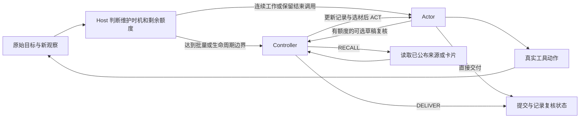

# 工作记忆方法使用说明

## Adaptive Memory v0.1（当前研究实现）

`milai-adaptive-memory-v0.1` / 终端适配器 `hiagent-method-adapter-v0.7` 已接入
`ADAPTIVE_MEMORY_SIMPLE` 和 `ADAPTIVE_MEMORY_CANDIDATE`。两者共用 Host、Actor、
来源、调度、容量、复核和读取合同，只更换维护政策。它们是 Lab 研究原型；产品默认仍为 A0。
旧 H_ONCE、OM、WORKSPACE_SIMPLE、MILAI_RWC 的方法与恢复合同继续独立使用。

首版核心开发已验收：147项邻近测试、4,628项全量测试通过（另1项可选SDK检查跳过），
公开SDK跨进程交接及静态/构建检查通过。真实使用结论见[执行结果](../studies/active/MILA_ADAPTIVE_MEMORY_DEVELOPMENT_RESULTS_20260915.md)
和[运行清单](../data/manifests/adaptive-memory-development-20260915.json)。功能检查通过不代表方法收益。

### 开始与继续

使用现有 `tools/run_workspace_native.py --task <原生任务目录> --root <新的证据目录>
--max-calls 32 --order ADAPTIVE_MEMORY_SIMPLE ADAPTIVE_MEMORY_CANDIDATE`。
Harbor 和任务运行环境沿既有外部安装提供；真实模型、tokenizer、隔离和账务由现有适配器检查。
`--max-calls` 是每臂所有角色合计上限。首次三臂比较在 order 首位加入 `OM_SYNC_PORT`。
证据目录必须新建，模型资源需按当前运行清单分配；命令本身不是新的实验额度。

在已有 `HiAgentTerminalSession` 内，选择上述 method，并通过 `control_options` 提供
`count_text`、`count_messages`、`model_profile` 与 `AdaptiveMemoryConfig`。
计数器必须与实际 Provider tokenizer 一致。调用 `session.host.step()` 推进一步；
`session.host.observe(text)` 追加真实外部新要求；`session.set_goal(text)` 切换用户目标，
清理旧 Frame/草稿并重置该目标的复核机会，累计调用额度保留。普通业务反馈由真实 dispatch 记录。

默认观察阈值 12,000 tokens、归并阈值 16,000 tokens、近期保留两个事件、页长 4,000 字符；
Actor 输出预留 4,096，所有维护模式共用 2,048，窗口按真实 Provider 验证。子目标改名只登记
工作段，不产生摘要或 Controller 调用。观察与归并由阈值/实际容量触发；显式请求和适用草稿
进入维护。需要同时归并与观察时先归并，再处理明确的原文批次。

### 工作视图、修订和读取

每次输入只装配一份 `MemoryView`：当前观察组、短 working_note、一个 Frame、相关卡片、
新反馈、原始页与有界目录。正文存在 `memory.materials`，其他位置按 ref/revision/start/length
引用它。每次使用当前版本；旧执行日志不会自动作为旧工作区正文重放。

观察组采用 `obs:N`；卡片采用 `card:N`。维护可以稀疏修订当前组、卡片及 Frame，退役卡片仍
保留返回入口，修订退役卡片可以重新采用。暂存不等于当前焦点，障碍消失只提供重新判断机会。
维护输出的 `source_refs` 是读取入口，来源范围是保守披露依赖，都不证明模型判断正确。

Actor `retrieve` 与 Controller `RECALL` 共用字符串列表及范围：

```json
{"action":"retrieve","arguments":{"refs":["card:2","H010"],"start":0,"length":4000}}
```

Controller 外壳是 `{"dispatch":{"kind":"RECALL","refs":["card:2","H010"],"start":0,"length":4000}}`。
支持卡片、观察组、`event:N`、不可变工具回执 Hxxx 以及 `catalog:sources`、`catalog:cards`、
`catalog:observations`。同次所有 refs 共用 start/length，最多 16,000 字符；目录范围以条目计，
每页最多 64 条。单回执业务动作 `read(ref,start,length)` 保留。当前文件/服务状态使用 exec 检查。
归并后的旧 obs 只返回 COMPACTED、替代组和原始范围元数据，不伪造原组正文。

Actor 可发 `{"action":"maintain","arguments":{"reason":"需要修订的原因","refs":["obs:3"]}}`。
该动作登记一个待维护请求；Actor 决策与后续维护分别计费。请求正文无法装入时保留请求，
不冒称已处理。Controller 回读后在下一已知边界继续 REVISE/REVIEW；新反馈仍等待 Actor 接收。

Actor 实际收到的页、成功观察覆盖的页、维护尝试身份独立保存。只有合法非空 OBSERVE 才移除
声明批次的 raw_tail 页。`{}`、卡片修订、空 observations 或拒绝均不推进覆盖。省略与部分读取
保留真实范围，不计作整页/全文已读。原始回执始终可以按范围恢复。

### 交付与显式交接

final 形成当前草稿。每目标默认一次可选复核（可设为 0），复核中的回读续接全部计费。
显式 DELIVER 接受或替换当前稿，记 REVIEWED；无变化或已结算的无效复核可交付 UNREVIEWED。
明确 ACT/RECALL 可以继续有用工作；新反馈使旧稿失效。最后一次生成留给 Actor，若仍要求业务
动作或内部维护，则不执行该请求，结束为 INCOMPLETE。这些标签不替代原生质量评价。

显式保存使用 `session.save_checkpoint(path, environment_id=...)`，恢复到同配置、同作用域和
同一保留业务环境的新 Session：`fresh.restore_checkpoint(path, environment_id=...)`。
公开路径使用现有 `WorkingStateCheckpoint`，调用 `save_public_checkpoint(port, ...,
operation_id=...)` 与 `restore_public_checkpoint(port, environment_id=...)`。传输仍为公开
HOST_WORKING + CAS，格式为新版 Host 载荷，未改产品 schema，也不迁移旧 OM/RWC 载荷。

保存包含当前观察组/卡片及修订号、原始页、独立范围、待请求/回读/草稿、维护尝试、调用与用量、
目标和结束状态；不存重复 MemoryView。恢复不重放业务动作，不重置总调用额度。调用者保留
原环境，并停止旧 Host；这是已知静止边界的交接，不是任意崩溃恢复或多写者租约。
未知 Provider 用量、未知副作用、来源授权失效时停止，不能靠降级 final 或 checkpoint 绕过。

---

## RWC v0.4 与历史方法使用合同

`milai-rwc-v0.4`（终端适配器 `v0.6`）是 Lab 中显式选择的研究方法。它继承已完成的
[可用性与创新 Goal](../studies/active/MILA_HOST_MEMORY_CONTROL_USABILITY_AND_INNOVATION_GOAL_v1.0_20260914.md)，
提供 `WORKSPACE_SIMPLE` 与 `MILAI_RWC` 两种政策；两者使用完全相同的 Host、Actor、来源、
工具、容量和交付机会。方法入口继续保留 `H_ONCE`、`CONTROL_0` 等历史方法，并新增独立同步方法 `OM_SYNC_PORT`。

架构开发已完成，v0.3 / OM v0.1 / 适配器 v0.5 已真实运行。v0.4 集中修改共享结束路径，
并加入可关闭的批量维护。2026-09-15 已完成 batch=3、每臂 32 次上限的真实三臂：
SIMPLE/OM 在多来源合并开发题上原生通过，RWC 未完成且冲突报告检查失败；两次局部政策诊断
未形成可推广候选，正式政策保持原样。见[真实开发与验证结果](../studies/active/MILA_RWC_V04_DEVELOPMENT_RESULTS_20260915.md)。
此前工程与回放仍见[交付与调度改进记录](../studies/active/MILA_HOST_MEMORY_CONTROL_DELIVERY_SCHEDULING_RESULTS_20260915.md)。

## 架构与记忆分工

Host 持有当前真实目标、工具合同、模型调用预算、事件记录和来源注册表。它显式选择一个方法：
H_ONCE 使用关闭段摘要与当前段原文；OM 使用观察日志、近期原文和阈值维护；RWC 使用
Controller、可修订工作区和 Frame。三者复用终端、Provider、来源及日志能力，维护频率各自独立。
SIMPLE 与 RWC 的区别只有普通/候选政策，使用同一套调度与结束规则。

| 对象 | 保存什么，怎样使用 |
| --- | --- |
| 原始回执与 Evidence 来源 | 实际动作/观察及来源；正文按范围回读，历史内容不自动代表当前世界。 |
| WorkspaceSnapshot | 可修订的短工作记录、卡片与当前 Frame；是模型工作判断，不是事实权威。 |
| MemoryCard | 依据、线索或返回点的自由文本及 source_refs；Host 管理编号、版本和归档。 |
| FocusFrame | 当前问题、工作意图和 selected_refs；影响下次材料装配，Actor 仍可依据新证据调整行动。 |
| Context 投影 | 当前目标、新反馈、选中材料和必要历史的有界输入；不等于记忆数据库。 |
| HOST_WORKING / checkpoint | 通过现有公开 Working State 接口保存来源、工作区及续接位置；不自动升级为 Canonical。 |

产品 Runtime 负责权限、作用域、版本、CAS 与机械存取；Lab 的 Controller 负责可错的判断和
工作安排。当前实现是方法研究原型，未把这些控制政策设为产品默认行为。

## 执行路径



Controller 可更新短记录，按条目增改或归档卡片，并设置 Frame 的问题、意图、选材引用。
卡片不依赖已经存在的 segment。Host 分配 `card:N`、维护 revision；未更新的卡片继续保留。
`seg:N` 是工作段索引，`H001` 等是不可变工具回执。Actor 可省略新 subgoal；首步缺省时，
Host 用 Frame 意图建立工作段。模型不能凭空指定尚未公布的卡片或来源。

每份来源正文按 `ref / revision / start / length` 在材料区展开一次，其他位置使用引用。
动作与观察仍有关联；相同字节来自两次不同执行时，不合并它们的事件身份。
Controller 与 Actor 分别维护“已看到哪里”的位置，因此 Controller 回读或复核不会吞掉
Actor 尚未接收的原始反馈。当前用户目标独立于旧记录，恢复后安排 Controller；
剩余额度只够一次生成时优先交给 Actor 结束答复。

`feedback_batch_size=1` 保留逐批工具反馈维护；设为 3 时，普通连续工作累计三个尚未维护的
工具反馈再调用 Controller。初始目标、恢复、新外部反馈、显式 retrieve/RECALL 返回、
工作段切换及可选草稿复核会提前触发。工作段边界来自已有 subgoal；没有新增语义触发器。
因此批量为3不保证每三个动作才维护一次；实际频率取决于轨迹中的提前触发。这是可配置的
批处理与生命周期触发，尚未证明最佳介入时机或开销必然下降。
跳过维护只推进 Actor 接收位置，Controller 覆盖位置保持，下一次维护接收全部待处理批次。
输入的 pending_maintenance_events 和日志 CONTROL_DEFERRED 表示记录可能滞后，不表示遗漏反馈。
一次 Controller 看到批次或接受空对象，不证明其正确吸收了内容。

默认每页 16,000 字符，正文区总计 64,000 字符，目录每页 64 条，活动卡片最多 64 张。
新反馈优先于可选旧正文；可选正文超限时保留可回读入口。受保护反馈本身超出容量时明确停止，
不会静默丢弃。目录提供分页；这些是字符容量，不是模型 token 容量承诺。
Provider 还按实际 tokenizer 和上下文容量做发送前检查。

一次调度最多两次 Controller 回读扩展；到限后携带明确反馈进入 Actor。
一次任务默认最多一次专门交付复核；回读不增加复核次数，修改草稿也不重置额度。
合法 DELIVER 可以接受或改写已有草稿，不能无草稿直接提交。
关闭工作段的摘要按原始输入、摘要政策及模型配置缓存，恢复时保留缓存身份。

摘要和 Controller 不能消耗最后一次生成。进入复核至少保留“复核＋必要的 Actor 修订”两次
机会；Controller 再回读时也保留后续 Controller 和结束 Actor 的机会。只有最后一次生成时，
Actor 的 call_budget.closing 为 true，要求基于当前记录给出结果或诚实说明未完成。
若它仍提出新的工具动作，Host 不执行该动作，提交明确未完成说明。预算规则不判定任务成功。

交付状态写入快照、DELIVERY_COMPLETED 事件及原生 terminal.json 的 metadata.delivery_status：

| 状态 | 运行含义 |
| --- | --- |
| REVIEWED | Controller 明确 DELIVER；只表示内部复核，不等于原生 verifier 通过。 |
| UNREVIEWED | Actor 当前草稿直接交付，或可选复核无修改/返回不可用；内容仍可能报告未完成。 |
| INCOMPLETE | 没有结束生成可用，或最后一次 Actor 仍提出工具动作时，Host 提交的固定未完成说明。 |

草稿之后收到的新反馈会使旧草稿失效，后续必须形成当前答复；
有未知 Provider 用量、未知业务副作用或来源权限失效时仍停止，不能用交付降级绕过。
可设 max_delivery_reviews=0 关闭内部复核，普通文本交付不再依赖唯一的 Controller 许可。
这些状态记录复核/结束路径；任务完成质量仍由真实产物和验证判断。

所有 Actor、Controller、摘要和复核调用共用生成总额。原生入口默认上限分别为
4096、2048、1024 输出 tokens，Controller 复核仍使用 Controller 上限。
两种政策使用相同模型配置。非法控制输出保留上一次工作区，并向 Actor 呈现拒绝原因；
格式合法不代表结论正确。未知 Provider 用量或业务执行超时会停止，不能保存可继续的检查点。

## 稀疏更新

Controller 只返回一个 JSON 对象。普通工作阶段的 `{}` 表示沿用工作区与当前目标 Frame，继续 Actor。
省略/null 的 workspace_update 或 frame 保持原值；Frame 可只更新 question、intent 或
selected_refs，空 selected_refs 明确清空，合法重复项按顺序去重。省略 working_note 保留
记录；put_cards/retire_cards 默认空数组。新卡片省略 handle 时由 Host 分配；已有卡片
省略 source_refs 保留原依赖，新卡片则默认无依赖。未知引用、同一提案选择尚未公布的新
卡片、无草稿 DELIVER 仍被拒绝。说明性额外字段忽略；不猜测模型本来想执行的动作。

```json
{"workspace_update":{"working_note":"新的实际反馈改变了这一点","put_cards":[{"text":"尚未核实的备用线索"}]},"frame":{"intent":"检查当前缺口"}}
```

省略 dispatch 缺省 ACT；已提供 dispatch 必须有合法 kind。ACT 不使用回读或交付字段。
RECALL 仍必须提供合法 refs，可省略 start/length；DELIVER 省略/null delivery 接受当前
草稿。一次规范化、一次校验后原子提交；拒绝保留原工作区并向 Actor 给出短反馈。
日志分别记录 DIRECT、NORMALIZED 与 CONTROL_REJECTED，接受不等于证据或任务通过。
内容无变化时不推进 workspace/card revision，未变化卡片复用；当前目标和真实反馈仍独立可见。

草稿复核阶段通过 delivery_review_active 显式标记。无显式 dispatch 且内容无变化时结束
可选复核，按 UNREVIEWED 提交仍适用的 Actor 原稿；这是交付降级，不是把 `{}` 解释为批准。
已结算但无法解析/接受的复核也按此规则处理；明确 ACT/RECALL 仍要求继续工作。
delivery_reviews_remaining 是后续复核余额，不决定当前复核能否 DELIVER。

默认卡片目录只显示未归档项。Actor 通过 `retrieve` 读取完整目录或未选卡片，
例如该动作的 `arguments={"refs":["catalog:cards"],"start":64,"length":64}` 翻页，
`{"refs":["card:1"]}` 回读卡片。目录偏移按条目，来源偏移按字符，不能把目录预览当原文。
Controller 则使用 `dispatch={"kind":"RECALL","refs":["catalog:cards"],"start":64,"length":64}`；
其余卡片/来源 refs 用法相同。Actor 旧 `{segments:[...]}` 回读形式继续可用。

## OM_SYNC_PORT

OM 使用自己的 Actor 前同步调度，不继承 RWC，不调用 Controller。未观察的实际事件按页
留在 raw_tail，默认累计 12,000 tokens 触发 Observer；最近两个完整事件和 Actor 未收到的
页保留原文。只有成功返回的准确页面退出默认原文区。Actor 接收页位置和 Observer 覆盖页
位置独立，未显示页不会被视为已消费。超出输入容量的页按连续范围明确列入 omitted_pages，
可用 receipt read 或 event:N retrieve 回读；第一页不代表完整长事件。

观察日志正文达到 16,000 tokens 时调用 Reflector，用成功的新日志替换旧日志。观察和归并
各在同一响应内返回 currentTask/suggestedResponse。Actor 接收当前真实目标、观察组、提示、
近期原文及真实回读。所有来源完整保留，组映射是 Host 精确页范围的粗粒度并集，不保证
摘要逐句被验证。重复装配不调用维护；恢复本身也不调用模型，后续仍按正常阈值调度。

三种角色共享总调用数。原生 Actor 输出上限 4096，Observer/Reflector 各 2048，真实
Qwen tokenizer 同时用于阈值和每角色上下文预留，并与 Provider /tokenize 核对。
原生维护请求使用同一请求的 JSON schema（`OM_OUTPUT_SCHEMA`），防止回写整个 raw_pages
耗尽输出；无额外 extractor、格式修复模型或自动重试。独立调用者可传同一 schema。
观察文本也接受字符串列表并合成正文；Actor 的无歧义顶层工具参数可本地移入 arguments，
随后仍经原工具校验。已结算的不可用观察保留 tail，归并失败保留旧日志；装得下则继续
Actor。未知 Provider 用量或未知业务效果停止，不能生成可继续 checkpoint。

OM 和 RWC 的历史策略不同，同题比较只共同固定真实目标、业务工具、模型和总预算。
H_ONCE 仍保留原有关闭段摘要缓存机制，不因新增 OM 改为反馈维护。

上游参照固定为 [Mastra b611980c](https://github.com/mastra-ai/mastra/tree/b611980c1a3fe3f74bd3c6538ce6a34f510954d0/packages/memory/src/processors/observational-memory)，
相关目录为 Apache-2.0；本地独立编写机制和短政策，不是完整 Mastra 或原政策复现。
主要来源为 observation-strategies/sync.ts、observation-turn/step.ts、observer-runner.ts、
reflector-runner.ts、built-in-extractors.ts、observation-groups.ts 和 tools/om-tools.ts。
本地差异：线程内纯文本，无异步/向量库/额外提取；12k/16k 阈值和 recent2 是本模型配置，
不是照搬上游窗口：上游默认异步保留20%，纯同步窗口可为0；不移植上游传输和维护重试；已结算失败
可沿原内容继续；来源并集、终端工具与 Lab checkpoint 是本地适配。原生维护使用受约束
JSON（观察文本最多3000字符、两项提示各512字符，仍可能触及token输出上限），
而非上游 XML/列表解析。当前长历史的来源元数据仍会增长，显式回读也可能与尚未
观察原页重复呈现；不宣称无限上下文容量或缓存费用收益。

## 本地调用与交接

从完整仓库检出运行，令 `PYTHONPATH` 包含 `src` 和 `tools`。wheel 只交付 Lab 核心包；
适配工具及本轮独立 pin 使用检出目录中的文件。调用者提供模型及隔离终端回调：

```python
from pathlib import Path
from hiagent_terminal_session import HiAgentTerminalSession

def new_workspace(goal):
    return HiAgentTerminalSession(
        instruction=goal,
        binding=trusted_task_binding,
        root=Path(run_owned_evidence_directory),
        terminal=isolated_terminal,      # (command, timeout_seconds) -> result dict
        generate=accounted_same_model,  # ModelCall -> str; count every kind
        method="WORKSPACE_SIMPLE",     # MILAI_RWC is an explicit research option
        max_calls=64,
        control_options={
            "model_profile": frozen_model_configuration,
            "feedback_batch_size": 3,   # 1 disables batching; default 1
            "max_delivery_reviews": 1,  # 0 disables optional review
        },
    )
session = new_workspace(current_user_goal)
session.host.step()
session.host.observe(new_real_user_message)
session.host.step()
session.save_checkpoint(checkpoint_path, environment_id=retained_environment_id)
# Stop the old Host and retain the same environment.
fresh = new_workspace(current_user_goal)
fresh.restore_checkpoint(checkpoint_path, environment_id=retained_environment_id)
fresh.host.step()
```

检查点保存工作区、卡片、段、原始回执、反馈位置、交付阶段和累计调用数。
导出的快照和恢复后的回执注册表使用独立副本，后续活动不会修改已经保存的检查点对象。
恢复要求新 Host、相同绑定、同一个保留的业务环境及相同方法合同。新的当前用户目标可以
取代旧目标，旧草稿随之失效；已结束任务换新目标时，Host 与工具层会同时恢复执行，旧交付
文本清空。不要让旧 Host 与新 Host 同时继续，也不要回到已经过时的检查点。
显式交接不是任意进程崩溃后的 exactly-once 执行协议。

OM 的开始、继续、保存和恢复使用同一个会话入口，显式传入实际 tokenizer：

```python
from milai_lab.methods.observational_memory import OMConfig, OM_OUTPUT_SCHEMA

om_options = {
    "model_profile": frozen_model_configuration,
    "count_text": tokenizer_count_text,
    "count_messages": tokenizer_count_wire_messages,
    "config": OMConfig(context_tokens=actual_provider_context),
}
def new_om(goal):
    return HiAgentTerminalSession(
        instruction=goal, binding=trusted_task_binding,
        root=Path(run_owned_evidence_directory), terminal=isolated_terminal,
        generate=accounted_same_model, method="OM_SYNC_PORT", max_calls=64,
        control_options=om_options,
    )
om = new_om(current_user_goal)
om.host.step()
om.host.observe(new_real_user_message)  # only trusted actual feedback
om.host.step()
om.save_checkpoint(checkpoint_path, environment_id=retained_environment_id)
# Stop the old Host and retain the same environment.
resumed_om = new_om(current_user_goal)
resumed_om.restore_checkpoint(checkpoint_path, environment_id=retained_environment_id)
resumed_om.host.step()
```

实际 generate 回调按 ModelCall.kind 为 actor/observer/reflector 选择输出预留，维护响应使用
OM_OUTPUT_SCHEMA，并结算每个请求。OM 快照保存配置/政策绑定、组、原事件/页、tail、
覆盖与接收位置、两项提示和全部角色账务。新目标恢复清除旧 final/hints，继续读取同一合法
原始来源；RWC 与 OM 按方法显式分派。可信旧 RWC v0.2/v0.3 archive 可迁移到 v0.4 政策；arm、
模型与容量等其余合同必须匹配，旧 archive 的反馈批量视为 1。新检查点也绑定反馈批量，
不在恢复时隐式切换调度；旧 payload 格式不被误读为 OM。

## 公开 Working State

公开适配器位于 `tools/workspace_checkpoint.py`，Lab 核心不导入产品包。
调用者使用经过 pin 验证的公开 Python SDK，并显式提供可信 binding：

```python
from contextlib import closing
from milai_client import MilaiClient
from workspace_checkpoint import WorkingStateCheckpoint

with closing(MilaiClient(base_url=base_url, token=agent_token, max_retries=0)) as client:
    port = WorkingStateCheckpoint(
        client,
        binding={
            "principal_binding_digest": trusted_principal_digest,
            "project_id": trusted_project_id,
            "scope_type": "TASK",
            "scope_ref": trusted_task_scope,
        },
        journal=run_owned_pending_journal,
        evidence_refs=current_public_evidence_dependencies,
    )
    session.save_public_checkpoint(
        port, environment_id=retained_environment_id, operation_id=new_operation_id,
    )
    # In a different process with the same retained environment and contract:
    fresh.restore_public_checkpoint(port, environment_id=retained_environment_id)
```

使用公开 `get_working_state` 与 `update_working_state`。RWC 或 OM 工作状态和完整回执以无损压缩的
自包含 archive 存入 `payload.milai_rwc`，同一次 CAS append 提交来源和 head，因此没有
先发布 head、再补临时文件的问题。其他顶层命名空间原样保留；再次保存也保留原有 Evidence
依赖。为兼容旧载荷，OM 仍使用同一 milai_rwc 传输命名空间，内部方法标识独立。依赖 ID 放在压缩区外，使 Runtime 的撤销和披露检查仍能生效。

完整 payload 必须符合现有 65,536 字节上限；解压后 archive 另有 8 MiB 上限。
超限在发送前失败；本版没有额外的大对象后端。Checkpoint 包含 Host 状态与回执，业务
环境仍由调用者保留。公开加载先检查 authority、scope、状态、TTL、withheld 和 warning；
被限制的 payload 不当作空白状态重写。它始终属于 `HOST_WORKING`，不会提升为 Canonical。

发送前持久化 UNKNOWN journal，UPDATE 不自动重试。当前固定版本没有 Working State
专用 operation 查询接口，不能借用 Note operation 接口。`port.reconcile()` 只能通过公开
head 中相同 operation ID 和 archive digest 确认已提交；若 head 不匹配或不可读，仍保持
UNKNOWN 并禁止新写入。这也不解决未知终端动作的执行结果。

本轮总锁与产品当前工作树不匹配，保留了原锁及失败结果。公开检查使用独立锁
`data/locks/workspace-rwc-repair-product.lock.json`，绑定实际接口和源码字节；产品源码变化后
必须重新验证，不能因为历史 PASS 而继续写入。

## 开发验证入口

公开接口验证需要本地产品的 Runtime 和 Python SDK 环境及 Docker。它创建独立实例，
执行一个无害文件动作，使用不同 OS 进程公开保存与恢复，最后停止自己创建的服务：

```bash
uv run milai-lab-verify-product \
  --lock data/locks/workspace-rwc-repair-product.lock.json \
  --product-root ../MiLAi-Product --json
uv run python tools/run_workspace_public_checkpoint.py \
  --method OM_SYNC_PORT --root /outside/git/new-owned-run
```

该 OM 命令使用固定模型回调和字符计数 fixture，模型 HTTP 次数为零；验证一次跨进程保存/恢复，
包括观察、提示、长来源回读和新目标，不重跑其他方法矩阵。省略 --method 时保留旧 RWC 检查。
旧 RWC 真实公开 HTTP 检查包含 CAS 冲突、
实际提交后的人工回执丢失、未知写入阻断、不同 scope、Evidence 撤销后的加载和覆盖拒绝。
TTL 过期和大容量拒绝由单元测试覆盖，没有等待真实 TASK TTL 到期。

原生模型运行使用已固定的外部 Harbor 0.23.0 环境，以及仓库 `src:tools` 的 PYTHONPATH：

```bash
PYTHONPATH=src:tools <harbor-python> tools/run_workspace_native.py \
  --task <native-task-directory> --root <new-evidence-directory> \
  --order MILAI_RWC WORKSPACE_SIMPLE OM_SYNC_PORT --max-calls 14 \
  --controller-output-tokens 2048 --summary-output-tokens 1024 \
  --control-feedback-batch-size 3 \
  --artifact <task-output-path>
```

该批量参数同时作用于 RWC/SIMPLE，不改变 OM/H_ONCE 的维护机制。工具不会在 import 时
请求模型。每次模型实验仍需要自身任务范围与有限额度；历史修复轮、可用性轮（56/64次）
和更早额度均已关闭，示例不重新开放额度。v0.4 本轮新增真实模型生成为 0。
原生历史结果见[已完成可用性轮](../studies/active/MILA_HOST_MEMORY_CONTROL_USABILITY_RESULTS_20260914.md)，
当前开发与回放见[交付和调度改进](../studies/active/MILA_HOST_MEMORY_CONTROL_DELIVERY_SCHEDULING_RESULTS_20260915.md)。
