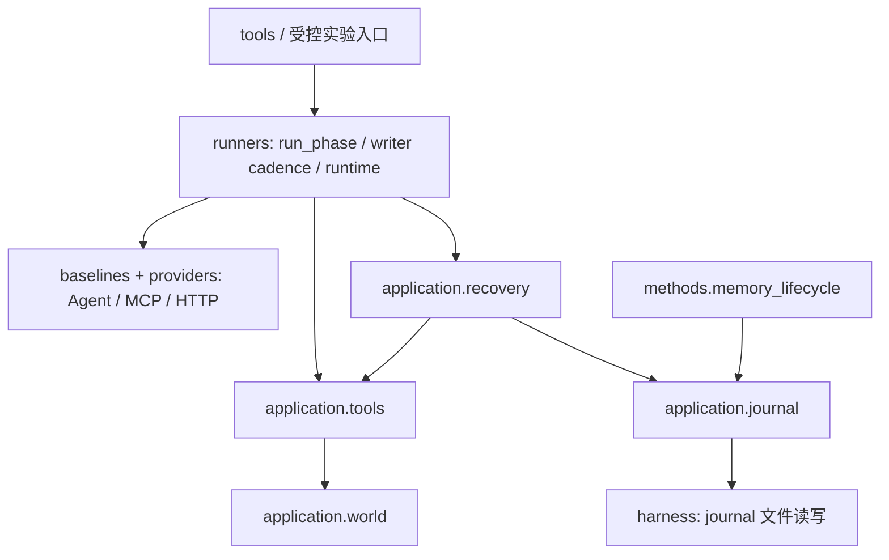

# MiLAi Lab 代码架构

更新日期：2026-09-29。Lab 是研究、实验与评测的唯一实现目录。
当前 v12 代码整理以 `cca2fd9` 为基线，阶段实施和验证见
[执行记录](CODE_ARCHITECTURE_V12_EXECUTION.md)。实验仍暂停；研究状态和效果见
[当前状态](LAB_CURRENT_STATUS.md)，而非从模块名称推导。

## 目录边界

[根 Source of Truth](../../SOURCE_OF_TRUTH.md)规定 Product、Lab、Archive 的唯一归属。
Product 不导入 Lab；Lab 不导入 Product Python 私有实现；Product-faithful 对照通过锁定的
公开 MCP/client/contract/testkit。Archive 仅保存历史身份和证据，不提供可导入运行时。

Lab 内部按职责组织：

| 模块 | 负责 | 不应承担 |
|---|---|---|
| `contracts/` | arm 权限、请求、记忆、操作、scope 等数据合同 | 模型调用、业务执行 |
| `datasets/` | benchmark 来源、合法输入和固定实例 | 使用 scorer 答案补输入 |
| `harness/` | 结果制品、trace、容量/费用等共享设施 | 改写任务以取得通过 |
| `providers/` | 实际 HTTP、模型协议和容量边界 | 判断业务事实正确性 |
| `baselines/` | Agent 配方、实际 baseline 与兼容入口 | 自动授予业务权限、成为通用能力的唯一 owner |
| `memory/` | 通用 MCP/Store、严格操作、版本和材料呈现 | Agent 配方、业务世界、scorer |
| `integrations/memory/` | Mem0/SimpleMem 原生 SDK、数据库与调用适配 | 任务顺序、scorer、方法策略 |
| `methods/` | 显式 recipe 的记忆/工作视图候选 | 持有第二套业务世界 |
| `application/` | 可复用业务 world、journal、工具与恢复能力 | CLI、实验分组、scorer、服务创建 |
| `runners/` | 组合方法、运行阶段、资源生命周期和结果交接 | 作为通用业务能力的唯一实现位置 |
| `scorers/`、`analysis/` | 运行后评价、成本和证据分析 | 将 gold/rubric 提供给运行时 |
| `tools/` | 薄 CLI 与阶段入口 | 复制包内逻辑或导入 Archive 运行 |

这是维护职责图，不宣称所有历史模块已经完成同样的分层。按阶段保留的方法、旧入口和
冻结文件仍存在；新工作应从[项目地图](PROJECT_MAP.md)定位当前链路。
详细维护规则见[代码职责](CODE_OWNERSHIP.md)和[依赖边界](DEPENDENCY_RULES.md)。
外部集成使用底层 `harness/artifact_io.py` 处理共享 JSON 制品；该模块只有标准库依赖，
不把研究编排带入集成层。原 harness 入口继续导出相同 IO 函数。

## 应用能力与实验编排

本次从 `runners/langmem_foundation.py` 和 `runners/langmem_application.py` 提取复用能力。
此前 `methods/memory_lifecycle.py` 为使用 journal 反向依赖 runner；只需 world 或工具 schema
的调用者也会加载 LangMem/LSA 阶段编排。拆分针对这些实际依赖，而非按文件行数划分。

`recovery` 还使用已有 Agent scope/observer 和 LangGraph ToolNode；它不是无依赖纯函数。
相反，`world` 只需要标准库，包入口保持轻量。`application` 不依赖 runner，避免形成
“可复用能力 → 编排器 → 可复用能力”的循环。源代码测试约束这一方向。

| 文件 | 单一实现 |
|---|---|
| `application/journal.py` | 原生 call 回执重交、pending、可选可信操作绑定、效果与恢复记录 |
| `application/world.py` | 本地 SQLite 合成业务世界、真实 owner 对象、业务状态提交 |
| `application/tools.py` | schema、原生工具适配和 owner 工具绑定 |
| `application/recovery.py` | 先查询真实状态，再交付明确 UNKNOWN 恢复观察 |
| `runners/langmem_application.py` | public message/phase 顺序、writer cadence、历史和运行结果编排 |
| `runners/langmem_application_runtime.py` | Host、Store、checkpoint、observer 的资源构造与关闭 |

旧 runner 路径保留显式 re-export，转向相同类、函数和常量对象。没有复制第二份实现，也没有
新增持久状态库、业务计划器、Reviewer 或对象平台。旧编排函数保留在原模块，避免无关的
调用入口及已有测试 patch 位置漂移。

## 行为与持久化兼容

此次是结构重构。原 journal 的 JSON 编码、call identity 哈希、typed 参数、SQL schema、
UUID、业务回执、默认开关、权限、MCP/Host 消息和每消息容量均保持。
重开既有数据无需迁移；默认保护仍关闭，R2 的显式应用保护也没有扩大语义承诺。
源码身份收集必须覆盖提取后的实现，不能只记录旧兼容外壳。

业务 world、journal、Store、checkpoint 和 trace 各有职责：world 记录业务事实，journal
记录实际提案/执行/回执，Store 保存模型形成的记忆，checkpoint 保存合法对话状态，trace
记录实际请求与观察。记忆被真实保存不证明其正文真实；journal complete 也不等于业务成功。
R2 的错误正文持久化仍作为失败证据保留。

兼容导入不保证跨源码版本的任意序列化 Python 对象都可反序列化。本项目冻结运行依赖的是
既有 JSON/SQLite/Store 合同；旧实验使用原方法/执行提交复现。现有冻结锁不因重构重写。

## 验证与工程证据

直接相关行为检查覆盖原生 journal、schema-only 工具目录、owner/typed 参数、部分/未知结果、
无副作用重试、后续新任务，以及真实子进程打开持久资源的 MockHTTP 链路。
静态检查约束依赖方向和验证矩阵；模块移动还需构建并核对安装后的 canonical/兼容导入。
这些检查不启动真实模型、embedding、PostgreSQL 或实验，也不改变连续成本账本。

检查归属见[验证矩阵](../configs/lab-verification-matrix.json)，本次实际命令和结果见
[架构整理记录](ARCHITECTURE_REFACTOR_20260929.md)。不得把“测试通过”升级成记忆效果或
行动可靠性结论。

## 数据和证据

公开目录只包含小型合成输入、配置、身份、精简结果和文档。原始私密轨迹、DSN、数据库、
虚拟环境、下载资产和构建输出仍在忽略目录。历史报告与其原分母保持不变。

旧版架构文档保留在[固定快照](https://github.com/minguselandy/MiLAi/blob/091dcbd48dc1800e5b8cc7f0ee3066dc00a76311/MiLAi-Lab/docs/LAB_ARCHITECTURE.md)。
