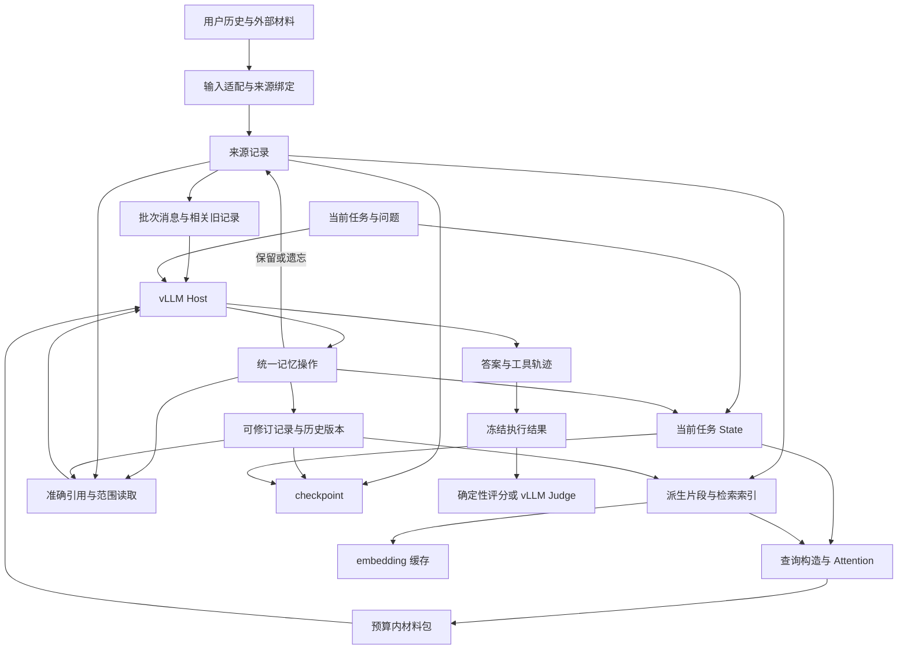
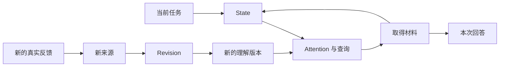

# MiLAi 整体架构、记忆机制与研究开发详细设计

本文以较新的 **MiLAi Lab 实现**为主要依据，完整说明项目定位、整体架构、记忆对象、运行流程、创新机制、实验设计和开发情况。正文直接展开必要信息，不依赖其他文档或代码地址。

MiLAi 的目标是让 Host 在长期使用中能够保留真实取得的材料、维护可更正的理解，并根据当前任务选择合适的记忆。**原始来源留得住，当前理解改得动，当前任务取得的信息有针对性且成本可控。**

当前 Lab 方法版本为 contextual-user-memory-v3，实验类型为研究原型。本文明确区分三种状态：

| 状态 | 本文中的含义 |
| --- | --- |
| 当前实现 | 本次阅读已确认存在的对象、操作和执行路径 |
| 目标设计 | 为完成当前 Lab 主线已明确的机制，尚未全部实现 |
| 已有验证 | 已实际运行的工程检查或模型实验，仅适用于对应版本与数据 |

Lab 在本轮研究能力上领先于 Product。Product 保留较早的产品实现和公开合同，不能反过来作为 Lab 当前设计的上限。本文以 Lab 的实际对象与执行链为主，不把较早 Product 的数据库结构、Canonical 提交或审核步骤套进每次记忆保存，也不安排后续迁移。

## 1. 项目定位与设计目标

### 1.1 MiLAi 要解决的问题

长对话记忆的困难不仅是存下历史，还包括以下问题：

- 某句话描述的是用户本人、第三方，还是某个临时任务。
- 一项要求适用于所有场景，还是只适用于这次客户汇报。
- 新信息是补充、例外、更正，还是与旧信息存在尚未解决的冲突。
- 当前摘要是否仍与其依据一致，依据被更正后是否还在使用旧理解。
- 检索结果中是否包含回答所需的条件，而不是只有相似主题。
- 为形成和使用记忆付出的模型调用、embedding 和上下文成本是否值得。

例如，用户说“这次给客户的汇报只保留结论”，系统需要保留原话与场景。它可以形成“本次客户汇报结论优先”的理解，但不能据此永久断言“用户不喜欢技术细节”。当用户随后说明“技术讨论仍然要展开”时，系统应修订适用范围，并在不同任务中采用相应表达。

### 1.2 总体目标

MiLAi 将记忆能力组织为三个互相配合的部分：

1. **来源保留：**记录实际取得过什么，保留出处、身份与原文。
2. **理解维护：**形成有用的条件性记录，并在新信息到来时更正。
3. **任务使用：**根据当前问题、场景和不确定性，在预算内取得必要材料。

系统既允许保存有依据的总结，也允许保存明确标注作者的独立想法、暂定解释和工作假设。缺少外部来源不应让普通记录无法保存，但这些记录不能伪装成已取得的用户原话。

### 1.3 当前范围

本轮完整开发覆盖统一记忆操作、来源与版本、用户情境、Revision、State 与 Attention、检索与材料组织、恢复与交接、原生数据集适配和效果评估。

当前不以通用 Agent 框架、多模态记忆、图数据库、后台多 Agent 反思、模型训练或 Product 迁移作为完成前置条件。结构优先采用直接函数、有限类型和单一运行入口；需要新增模块时，按实际职责拆分。

## 2. 以 Lab 为中心的整体架构

### 2.1 架构组成

当前系统由六个逻辑层组成。逻辑层表示职责划分，不要求部署为六个独立服务。

| 逻辑层 | 核心职责 | 当前实现形态 |
| --- | --- | --- |
| 输入适配层 | 解析消息、用户与历史边界，绑定真实角色和来源身份，分离评分字段 | 三类公开数据集适配器；可信来源由程序发布 |
| 记忆核心层 | 管理来源、当前记录、历史版本、依赖、持久化范围和遗忘 | 单用户记忆实例、Workspace 卡片、来源集合及版本操作 |
| 检索与材料层 | 生成候选、融合排序、处理来源范围、选择并展开材料 | 片段索引、向量与 lexical 融合、有界材料包 |
| 任务控制层 | 维护当前场景、关注引用和冲突，影响查询与材料选择 | TaskState、Attention 决策、覆盖绑定和有限扩展 |
| Host 执行层 | 调用 vLLM、约束工具参数、分派操作、回传结果和控制调用次数 | HTTP 模型驱动、JSON-action 或 native 工具循环 |
| 持久化与评估层 | 保存进度、恢复记忆、复用 embedding、冻结答案并独立评分 | 本地 checkpoint、SQLite 派生缓存、实验运行记录和 scorer |

当前记忆对象主要在进程内运行，由运行器保存可恢复快照。SQLite 在这条执行链中承担 embedding 缓存职责，并不是已经将全部记忆对象迁入关系型数据库。

### 2.2 总体架构图

下图表示当前 Lab 的逻辑结构。目标设计继续沿这些职责扩展，尚未完成的能力会在后文单独列出。



评分侧可以读取参考答案，但不能向 Host 或记忆核心回传 gold、评分解释或“应该怎样答”。Judge 位于任务结束后的离线评估路径，不承担在线记忆审核。

### 2.3 已复用的基础与独立职责

当前方法复用 Workspace 的卡片、焦点框架和稀疏更新，复用 Attention 的候选快照、覆盖判断和有界决策，也复用向量归一化等基础函数。

需要区分“借用了旧研究中的基础组件”和“运行了整套旧研究系统”。当前 contextual 方法自行管理来源、记录元数据、版本历史和向量，不等于同时启动了一套独立 ExperienceBank 服务，也不默认运行此前所有 Revision、Controller 或联合研究流程。

检索算法不负责决定作者是谁；模型传输层不负责决定长期记忆如何演化；运行器不重新实现版本语义。这样的边界使各部分能够分别修改，并减少同一规则在多个位置重复维护。

### 2.4 Host 与程序分别决定什么

| 事项 | Host 的职责 | 程序的职责 |
| --- | --- | --- |
| 保存内容 | 判断什么值得记住，表达内容和适用条件 | 执行保存，记录实际作者与持久化范围 |
| 来源身份 | 使用已返回的来源引用 | 从真实接入绑定角色、事件和制品，不信任正文自述 |
| 记录修订 | 根据新信息提出新的表达或范围 | 验证目标版本，保存历史，返回冲突或实际结果 |
| 当前情境 | 描述主体、任务背景、疑点和下一步取材需要 | 将有效状态接入查询和 Attention |
| 材料是否足够 | 对实际取得的内容作语义判断 | 将判断绑定到准确查询与材料，避免错用旧判断 |
| 记忆遗忘 | 理解用户明确的“不记住”等意图并发起操作 | 清理受影响对象、历史版本、索引及任务状态 |
| 最终回答 | 使用当前材料完成任务 | 记录真实调用、停止状态与成本，不替模型伪造答案 |

程序可以验证身份、版本和范围是否一致，不能仅凭引用存在或文本 hash 相等认证一段总结的语义正确性。

## 3. 核心记忆对象与关系

### 3.1 来源记录 Observation

来源记录表示“接入程序实际收到过的一项内容”，不是“这项内容已经被证实为真”。

当前来源包含：

| 字段或属性 | 含义 |
| --- | --- |
| event_id | 上游事件或消息的稳定身份 |
| content | 实际取得的原始正文 |
| role | 实际消息角色，如 user、assistant、system、tool |
| artifact | 所属输入制品或来源集合身份 |
| session_id | 上游可提供的会话身份 |
| date | 上游提供的时间信息，缺失时保持缺失 |
| supersedes | 取得错误被纠正时，新来源显式替代的旧来源 |
| source_ref | 程序生成的用户范围内引用 |
| retained | 是否已被明确保留到长期记忆 |

当前引用由用户范围和来源身份共同确定。同一来源身份再次取得相同观察可以复用；同一身份不能被悄悄替换成不同正文或角色。

来源身份与内容身份分开。两个真实事件即使正文相同，也不能仅凭文本相同就合并成一次观察；同一事件被摘要、摘录多次，也不能因此变成多份独立佐证。

目前来源有 session 和日期，但还没有专门保存供检索使用的稳定消息 ordinal。后续需要从合法输入顺序补齐该元数据，而不是猜测事件名称中的排序信息。

### 3.2 可修订理解 MemoryCard 与 Interpretation

MemoryCard 保存正文、稳定记录身份、修订号和来源引用。Interpretation 保存这份正文的作者、主体、场景、确定性、持久化范围与依赖。

| 属性 | 作用 | 不能据此推导的结论 |
| --- | --- | --- |
| author | 记录实际维护这份表达的 Host | 正文自称“用户说”不能将作者改成用户 |
| subject | 区分当前用户、第三方或其他主体 | 记录中提到某人，不代表他就是偏好的所有者 |
| context | 描述成立条件、场景和例外 | 一次局部要求不自动扩展到所有任务 |
| certainty | 表达 explicit、inferred、uncertain 等判断 | explicit 不等于服务端已验证为真 |
| persistence | 区分 durable 与 task | 临时高频使用不自动升级为长期属性 |
| source_refs | 指向原始观察 | 有来源不保证正文被来源完整支持 |
| dependencies | 指向实际读取过的记录版本 | 未声明的语义依赖不会被系统自动发现 |
| revision | 标识同一记录的版本 | 最新版本也可能语义错误，仍需要接受反馈 |

一条理解可以引用多个来源，也可以完全没有来源。无来源记录仍可作为独立想法使用，只是不能伪装成已经取得的外部事实。

修改记录时使用已经读到的准确版本。服务发现目标不是当前版本时返回版本冲突，Host 应先取得当前内容再提出修改，不能偷偷用最新版本号覆盖。

### 3.3 当前任务状态 TaskState

TaskState 描述“这次任务正在如何理解问题”，不承担完整用户画像的存储。

当前状态包括任务身份、场景正文、主体、不确定性、intentions、conflicts、recent_refs、unavailable_refs 和 coverage。

其中，intentions 与 conflicts 是准确引用列表，不是任意叙述文本。比如“接下来核对用户是否只在客户场景要求简短”应写入情境正文；引用列表只放已返回的材料引用。

当前实现中，不同字段作用不同：

- 主体、场景和不确定性会参与有效查询的构造。
- intentions 和 conflicts 被转换为 Attention 使用的来源选择信息。
- recent_refs 记录实际选择的近期材料。
- coverage 表示 Host 对某次具体材料选择的覆盖判断。
- unavailable_refs 用于表达恢复或引用不可用等状态，不代表自动完成语义修复。

不能因为 TaskState 存在某个字段，就宣称该字段已经接入所有检索决策。

### 3.4 Workspace、快照与历史

Workspace 是当前任务可操作的工作空间，包含卡片集合、问题框架和工作说明。更新采用稀疏 patch，允许只修改发生变化的部分。

checkpoint 保存可恢复的用户记忆，并可选择包含任务覆盖层。长期来源与记录、临时任务对象、历史版本、遗忘状态以及索引身份分别记录。历史版本保留当时正文和引用；读取时重新计算当前依赖状态，避免把“当时没有失效”误显示成“现在仍适用”。

### 3.5 派生索引与材料视图

片段、向量、排序结果和材料视图都是从来源或当前记录生成的派生物。它们用于提高发现和使用效率，可以失效和重建，不应成为另一份不可追溯的记忆正文。

同一来源可能有多个字符窗口，一份记录可能有多个检索入口。无论从哪个入口命中，最终都应回到真实来源或记录版本。

当前 v3 已保留片段范围和正文摘要信息，但还缺少完整的跨查询范围合并与分层呈现机制。

### 3.6 Evidence 与 Note 的关系

Evidence 和 Note 容易被误解成“事实”和“猜测”两类内容。更准确的关系是：

- 来源记录保存某个来源当时实际提供的内容。
- 可修订记录保存某个作者希望持续维护的理解。
- 某份材料是否支持当前判断，是使用关系，不由对象名称自动决定。

用户亲自写的笔记可以是一份来源；模型生成的内容也可以作为“模型当时写过什么”的来源。将模型摘要再保存一次，不能让其中的判断自动变成用户事实。

当前 Lab 已用来源引用、记录内容和目标引用承接这些操作。Host 不需要先判断正文“够不够真实”，再选 Evidence 或 Note。较早 Product 仍保留相关对象分支，这不改变本版本的设计方向。

## 4. 统一操作界面与执行语义

### 4.1 四个当前操作

| 操作 | 主要输入 | 当前行为 |
| --- | --- | --- |
| memory_save | 内容、可选来源、可选目标版本、主体／场景等元数据 | 创建理解、保留已发布来源、修改记录，或执行明确遗忘 |
| memory_search | query、数量限制、材料字节预算 | 统一发现来源与当前理解，返回正文材料及继续读取的引用 |
| memory_read | 准确 ref、是否展开来源、字符起点和长度 | 读取指定版本或范围，返回当前引用、分页和依赖状态 |
| memory_state | 场景、主体、不确定性、引用列表或 coverage | 更新当前任务理解，影响后续检索和选择 |

来源发布由可信适配器完成，不是让模型通过一个自由文本工具自行声明角色。纯工具接入只能处理实际传入的参数和已知来源，不能自动拥有外部 Host 的整段聊天记录。

### 4.2 保存的五种常见情况

| Host 意图 | 应如何表达 | 结果 |
| --- | --- | --- |
| 记下自己的理解 | 提交内容，可选依据引用 | 创建实际 Host 作者的记录 |
| 保留刚取得的原始材料 | 使用适配器返回的 source_ref | 保留准确内容和出处，不要求 Host 重写原文 |
| 更正已有理解 | 读取目标，提交 target_ref 和新内容／范围 | 在版本检查通过后更新，保留旧版本 |
| 同时保留原文与理解 | 来源引用加整理内容 | 来源与记录分别处理、分别回执 |
| 只有转述、没有原文 | 保存转述并保留实际作者和不确定性 | 允许保存，不冒称用户原话已取得 |

一份混合原话、解释和计划的记录默认仍是作者整理。有一段引用不意味着整份推论都是原始来源，也不要求首版强制给每句话建立复杂类型。

### 4.3 部分成功、冲突和重复

同一请求可能已经保留来源，但创建记录失败。系统必须保留这两个事实，不能把整次请求简化成“完全成功”或“什么都没发生”。

至少要区分：

| 结果 | 含义 | 后续处理 |
| --- | --- | --- |
| 已保存／已保留 | 对应对象实际发生了指定变化 | 复用返回引用 |
| 已复用 | 当前已有等价记录或来源 | 不新增重复对象 |
| 版本冲突 | 目标已变化，当前写入没有覆盖它 | 读取当前版本后重新表达修改 |
| 部分成功 | 多项操作中只有一部分完成 | 只处理未完成项，保留成功回执 |
| 参数或引用错误 | 请求无法按约定执行 | 修正具体输入，不用盲目重复掩盖问题 |
| 无进展／预算耗尽 | 当前工具循环没有正常完成任务 | 如实记录未完成，不补造有效答案 |

当前核心已经返回准确的版本冲突信息，但 Host 与摄取层主要按顶层 ERROR 统计失败，内层 VERSION_CONFLICT 可能仍被计作成功操作。这是现存的结果分类缺口。应区分“工具返回了结果”和“记录确实写入成功”，而不是取消版本保护或增加无限重试。

### 4.4 工具界面的目标增量

后续继续保留这四种主要操作，只增加必要的可选能力：搜索中的会话和时间范围、读取中的相邻消息、材料视图和预算状态。

这些字段服务于自然意图：“找上次会话”“看前后几条消息”“核对当时原文”。不新增一个 Evidence／Note 分类 Agent，也不要求 Host 手写来源身份、版本号或可信权限快照。

## 5. 记忆的完整生命周期

### 5.1 阶段一：输入取得与来源发布

输入适配器接收真实材料，并确定它属于哪个用户、哪份历史、哪个会话和事件。对于公开测试集，适配器还负责遵守原题给定的历史截止点，分离问题输入与评分信息。

随后发布不可变来源记录。发布使来源成为当前可用材料，不自动将其全部写入长期记忆。是否长期保留，由明确的保留操作或 durable 记录的来源关联决定。

只有可信接入实际取得相应消息，才可以记录对应角色。正文写着“用户说……”只说明作者在作转述，不能成为用户身份的依据。

### 5.2 阶段二：按合法历史顺序摄取

历史构建按原始顺序进行。每一批只发布当前合法前缀，后续批次中的内容不能提前参与相关记录检索或摘要形成。

当前以完整消息为切分单元，以 24,000 字符为批次目标。它避免在摄取入口任意切断一句话，但超长单条消息仍可能超过目标。字符长度也不能直接当作精确 token 数；超长消息的真实输入预算仍需完善。

系统从已有理解中查找相关记录，向 Host 提供正文、准确版本和来源信息。这样 Host 能在一次提案中决定复用、更新或新增，而不需要先对一串不透明 ID 逐条发起读取。

### 5.3 阶段三：一次有界提案形成记忆

当前每批摄取向同一 vLLM Host 发送一次结构化请求，要求返回操作数组。默认最多 16 项操作，相关旧记录预算为 12,000 字节。

这次调用允许以下结果：

- 没有值得新增的内容，返回空操作数组。
- 保留某份来源而暂不整理。
- 新建一份有条件和出处的理解。
- 根据本批新信息修订已经提供的旧记录。
- 按真实用户意图处理临时记忆或遗忘。

操作顺序执行，逐项生成实际回执。提案不能引用尚未创建、尚未返回真实身份的新记录。一项失败不回滚之前已成功的项，也不应把整批标记成所有对象都已保存。

当前“优先更新相关旧记录、保留条件和例外”等语义主要由 Host 执行。程序可以检查版本和来源是否有效，不能保证每一项整理都合理。

### 5.4 阶段四：保存并建立派生索引

成功操作更新来源保留状态、当前卡片、Interpretation 元数据和历史版本。记忆改变时，旧 coverage 绑定会失效，受影响向量被清理或在后续检索中重建。

运行器保存批次进度及对应 checkpoint，允许按既定批次恢复。长期快照只包含明确保留的来源和 durable 记录；任务覆盖层保存本次需要续接的临时内容。

索引可以在需要检索时按当前对象生成，不要求每一次写入都再增加一次模型推理。embedding 由可替换的回调提供，缓存身份与真实模型及窗口策略绑定。

### 5.5 阶段五：开始新任务

新任务建立自己的问题框架和 TaskState。一般情况下：

- durable 记录保留。
- task 记录退出。
- 没有长期保留的来源退出上一任务的活动集合。
- 旧的已读版本集合、扩展记录和覆盖判断清空。
- 显式 handoff 可以转交需要继续工作的临时内容，但不能自动继承“材料已经足够”的判断。

基准答题时，运行器还会为当前题目重新发布其全部合法原始历史。因此答题阶段既能检索整理，也能检索原文。这是方法能力的一部分，也是必须设置原文检索对照的原因。

### 5.6 阶段六：按问题取材并完成任务

Host 根据问题选择 memory_search。系统组合 query 与有效任务状态，执行多路候选排序，经过 Attention 选择后返回材料包。

Host 可采取以下动作：

1. 已有正文足够，直接回答。
2. 需要核对来源，按准确引用读取。
3. 当前取材方向不合适，更新 State 后重新查询。
4. 发现持续理解错误，先核对目标，再修订记录。
5. 材料仍不足或预算已到，保留限制并结束，而不是把未完成伪装成成功。

系统不要求固定执行“搜索一次、读三次、写一次”这样的模板。必要步骤由任务和实际材料决定。

### 5.7 阶段七：新反馈进入后续记忆

真实新反馈先作为新的来源进入系统。如果反馈改变的是当前任务安排，优先更新 State；如果改变的是可持续使用的理解，则修订相应记录。

这里有两个不同闭环：



第一个闭环解决本次如何取材，第二个闭环解决长期理解如何改变。临时不采用一份记录，不等于删除它；修改长期记录，也不等于改写当初收到的原话。

## 6. 检索、会话定位与材料组织

### 6.1 当前 v3 的索引

来源和当前理解均可被发现。对于超过窗口长度的来源，当前按 2,048 字符切分，相邻窗口重叠 256 字符；原始正文保持不变。

每个派生项至少能回到父来源，长来源片段还带字符范围。原文是否完整、取得了哪个范围，应随材料返回，不能把一个窗口显示成整份材料。

当前记录按当前版本进入发现索引，旧版本可以通过准确引用读取。已被来源替代关系标记的旧来源不作为普通当前候选继续参与同一路径。

### 6.2 当前混合排序

当前存在两路排序：

| 路线 | 已实现的方法 | 特点与限制 |
| --- | --- | --- |
| 向量路线 | 对候选和 query 求 embedding，归一化后按相似度排序 | 能发现字面不同的相关内容，但不能保证条件和否定关系被正确理解 |
| lexical 路线 | 提取 query 中的词项，按正文中的子串出现量计算分数 | 简单直接；没有 BM25 的 IDF 和长度归一化，不应称为完整 BM25 |

两路在来源引用层面使用 RRF 融合。当前参数为 60，可用下式理解：

```text
融合分数 = 各检索路线中 1 / (60 + 该路线排名) 的和
```

这个分数表达相对检索次序，不表达事实可信度。重复窗口不能直接被计成多份独立来源。

当前实现按来源聚合后主要保留一个呈现范围，因此同一长来源中多个不同位置的命中仍可能被压掉。后续候选结构需要保留这些范围，再交材料规划器决定如何合并和呈现。

### 6.3 两类分窗不能混为一谈

当前还存在 embedding 的 token 分窗：超过 embedding 模型输入长度的文本，按模型 tokenizer 分窗，并按原窗口 token 数加权汇总向量。

它与 2,048 字符的检索片段用途不同：

- 检索片段用于定位长来源内部的相关位置。
- embedding token 分窗用于适配模型输入长度，避免直接截去后半段。
- 汇总向量覆盖原输入，不等于每个细节都具有同样的可检索性。

因此，解决端点长度限制与改善细粒度召回是两项不同工作，不能用前者已实现来证明后者已经有效。

### 6.4 会话与时间定位的目标设计

后续补齐稳定消息序号，使来源能按“用户、历史、会话、消息顺序、来源引用”定位。消息顺序来自上游合法输入，不从 ID 字符串或模型推测。

时间设计至少区分：

| 时间概念 | 含义 |
| --- | --- |
| 来源时间 | 上游消息或事件所提供的发生时间 |
| 记录版本次序 | 系统先后维护了哪些表达 |
| 适用时间或情境 | 某项偏好／要求在什么条件下成立 |
| 查询时间 | 当前问题是在什么时点提出 |

当前已有来源日期和记录修订号，但没有完成独立的时间检索模型。不能把问题日期直接变成“只检索当天”，也不能根据一条来源发生时间，推导整条偏好仅在那天有效。

目标规则是：未指定筛选时发现全部合法历史；显式日期条件匹配已知时间，未知日期保留为未覆盖信息；非法输入在入口明确返回错误，不默默放行。关联整理若因依据日期命中，也要说明匹配的是依据时间。

### 6.5 同会话邻接的目标设计

命中一句话后，Host 经常需要看到前后文。后续邻接以同一会话内的原始消息数为单位，不以字符数代替“前后几条消息”。

展开必须同时遵守用户隔离、会话边界、合法历史截止点和该次调用的显式筛选。没有会话身份的来源保持独立，不能把所有未知会话拼成一段历史。

当前 GAP 只补其他排名来源，尚不是这种邻接机制。两个能力将继续区分：重新发现候选解决“可能还缺什么”，邻接读取解决“命中这句时上下文是什么”。

### 6.6 材料包的目标结构

材料包将当前理解和原文放在统一外壳中，每项说明真实对象、版本、来源、视图和实际读取范围。

| 视图 | 内容 | 使用条件 |
| --- | --- | --- |
| 入口 | 引用、版本、出处、可展开范围和必要状态 | 正文尚未取得，或剩余预算不足 |
| 紧凑视图 | 已有短记录，或原文准确摘录 | 初次回答通常先获得足够广的相关候选 |
| 展开视图 | 更完整的原文、完整记录或邻接消息 | 核对条件、消除冲突或补足当前缺口 |

紧凑视图不要求新增 LLM 摘要。已有理解可以直接使用；没有理解时可以取准确原文范围。作者整理与原文摘录必须区分，不能因为界面都叫“摘要”就混淆出处。

### 6.7 预算分配

目标材料规划器先为多个相关候选提供可用的紧凑视图，再把剩余预算用于关键项展开。单个长来源设合理上限，避免挤掉其余必要条件。

范围优先沿消息或段落边界组织。确实不能完整容纳时，明确表示摘录、遗漏范围或仅入口；不把截断后的内容声明为完整来源。

当前使用字节预算约束所返回的材料项，默认搜索材料预算为 16,000 字节。它不等于整个模型请求的 token 上限，工具外壳、State、提示和历史对话仍会占用窗口。后续如复用运行环境已有的 Host tokenizer，可进一步做精确 token 预算；缺少 tokenizer 时如实保留字节口径。

### 6.8 去重与呈现账本

目标去重单位是“同一来源版本的具体范围”，而不是整段会话或裸文本。

同源相交、相邻范围可以合并；不同事件即使正文相同仍保留身份。一份来源派生出的三份摘要不应算作三份独立支持。必要时可共享一份显示正文，但应列明它对应哪些真实观察。

呈现账本至少绑定任务、对象引用、版本、范围和视图，只登记实际交给 Host 的正文：

- 返回一个入口不算读过正文。
- 读到局部范围不意味着整份来源已读完。
- 新版本和此前未返回的范围必须仍可发现。
- 读过一个片段不排除整个会话。
- 新任务或没有恢复完整 Host 对话时，不能继承旧的呈现抑制。
- 若对话上下文被裁剪，已不在 Host 窗口中的材料应允许重新取得。

当前相同参数的只读缓存已经存在；这种跨不同 query 的版本／范围账本仍待实现。

## 7. State、Attention 与 Revision 的机制设计

### 7.1 State 如何改变检索

当前候选方法会把 State 的主体、场景正文和不确定性加入有效查询。这样，问题“怎么组织这次汇报”在“客户评审”与“技术内部讨论”场景下，可以产生不同的检索方向。

这不是改变记忆正文，也不是把所有状态字段都当成检索指令。引用型字段只表达已知材料之间的关注关系，主体和场景也不能扩大当前用户可见的来源范围。

### 7.2 Attention 如何选择材料

Attention 接收已取得的候选快照、基线排名、相关状态、覆盖判断和预算，决定本轮使用哪些材料，以及是否需要一次有界扩展。

当前模块只对已有候选作确定性决策，不在内部再启动一个语义 Agent。扩展由外层执行，取得结果后合并候选快照，再进行后续选择。

它必须同时保留相关限制：

- 当前有效的冲突侧不能因为不方便回答就被压掉。
- 没有实际取得的材料不能伪装成已读。
- 基于旧快照的覆盖判断不能认证新材料。
- 无法在预算内提供必要内容时，要保留不足状态。

### 7.3 Coverage 的准确含义

| 状态 | 含义 | 不能理解成 |
| --- | --- | --- |
| UNKNOWN | 尚未形成适用于这次材料的充分性判断 | 所有历史都已查过但没有答案 |
| GAP | Host 认为本次材料还缺必要信息 | 程序已经知道缺失事实是什么 |
| SUFFICIENT | Host 对这次特定材料作出了足够使用的判断 | 服务端认证结论正确或检索已经穷尽 |

coverage 绑定查询、状态和候选／选集身份。当前操作要求先看到搜索结果，再单独提交覆盖判断；不能同时改变场景并把旧材料判为充分。查询、来源、记录版本或任务改变后，旧绑定回到 UNKNOWN。

在 UNKNOWN 状态下，intentions 不保证压过基线材料选择；但场景依然可以通过有效查询影响召回。这避免把“Host 写了一个偏好引用”直接当成已经证明它最相关。

### 7.4 Revision 如何改变长期理解

Revision 的输入是新的真实信息、已读目标版本及拟议修改，输出是新的当前记录版本或明确冲突。

一次修订可以改变正文，也可以只改变主体、情境、确定性、持久化范围或依赖。元数据变化同样影响适用性，不能在有意义的变更后仍冒充原来同一版。

历史版本保持可追溯，当前读取显示它与最新版本的关系。若依赖的来源或记录已变化，应提示重新核对，而不是继续将旧表达当作当前结论。

### 7.5 当前状态与长期修订的协同

系统需要避免两个极端：

- 只改 State：这次绕开了错误记录，下一次任务仍会遭遇同一错误概括。
- 只改长期记录：本次临时要求被过度推广，其他任务受到影响。

推荐判断顺序是：新信息是否仅影响本次执行；是否改变同类场景的一般适用条件；是否更正了之前记录的主体或事实；是否仍有未解决冲突。Host 根据这些语义表达 State 更新或 Revision，程序执行对应范围。

当前已经具备两类操作与版本基础，真实模型能否稳定作出合适选择仍需要实验，不能从工具存在直接推断已形成有效策略。

## 8. 持久化、依赖、隔离与遗忘

### 8.1 四种不同的“记住”

| 层次 | 当前作用 | 生命周期 |
| --- | --- | --- |
| 已发布来源 | 本次合法输入可被查找 | 未保留时不自动进入长期快照 |
| 任务记忆 | 本次采用的临时理解和相关来源 | 随任务退出，或通过显式 handoff 转交 |
| 持久记忆 | 明确保留的来源与 durable 理解 | 在新任务继续可用，接受后续修订／遗忘 |
| 实验记录 | 输入身份、模型输出、回执、成本与失败证据 | 与记忆对象分开保存，不自动再次成为用户记忆 |

这四层不能混用。保存一份实验轨迹不意味着 Host 可以把其中所有内容再次摄取；拥有完整原始 benchmark 文件，也不等于方法已把全部内容长期保留。

### 8.2 版本与依赖检查

修改目标必须对应当前版本并满足已读要求；引用另一条理解作为依赖，也应使用实际读到的版本。

来源引用和记录依赖分开保存。来源替代使相关理解需要重新核对；依赖版本改变时，当前与历史视图均应显示新的依赖状态。程序只能跟踪声明过的关系，不能发现所有隐含语义依赖。

当前 Lab 的版本检查是在本地对象和快照上实现的，不等同于多进程数据库事务或分布式 CAS。当前研究不需要为了名字相同而提前引入整套数据库并发框架。

### 8.3 Checkpoint 恢复与索引身份

恢复至少核对用户、方法格式、embedding 模型、维度、实际模型身份和索引策略。方法格式不兼容时不能强行装载；索引身份不匹配时丢弃旧派生向量，重新建立。

embedding 缓存以实际模型配置、权重信息、窗口策略及精确输入文本形成键。改变模型空间后不能只看向量维度相同就混用。

历史构建缓存还绑定原始历史、合法截止点、方法与配置。不能先处理未来消息形成摘要，再通过过滤原文来假装没有使用未来信息。

### 8.4 用户隔离与交接

每个记忆实例有明确用户范围，记录引用带相应范围。跨用户引用或 handoff 不能直接复用；同一用户的新任务仍应拥有自己的状态。

显式交接携带必要的任务理解和准确引用，接收侧重新解析相关版本。coverage 不继承为充分；新任务问题也不能被旧状态覆盖。

这里是 Lab 运行器管理下的隔离。当前没有因此自动获得对任意不可信外部客户端的完整认证和多租户服务能力，本文不将其描述为已部署的远程安全系统。

### 8.5 遗忘传播与现有边界

当前遗忘会清理指定来源、相关来源替代关系、受影响的派生记录、历史版本、进程内向量以及可能复述这些内容的任务理解，并增加遗忘代数。旧 handoff 若早于当前遗忘代数会被拒绝。

仍需如实保留两个边界：

1. 当前核心清理不等于 SQLite 历史 embedding 缓存、实验输出和外部备份已经物理擦除。
2. 从一个独立的旧 checkpoint 重建实例，并没有自动取得外部最新遗忘状态；不能声称任意旧快照恢复都不会让已遗忘内容重新出现。

当前 benchmark 原文件按实验协议保持原样，用户记忆中的遗忘行为与原始测试制品的保存是不同职责。开发应验证记忆可见性与传播，不通过修改测试集“实现遗忘”，也不把未实现的平台级擦除说成已完成。

## 9. vLLM 执行、预算与失败处理

### 9.1 Host 驱动

Host 负责选择操作并解释返回材料。驱动负责模型请求、参数 schema、真实工具分派、回执配对、调用次数和 usage。

当前支持 native 工具调用与 JSON-action，开发配置使用 JSON-action。每轮输出必须是允许的工具及其参数，或最终回答；普通回合使用实际工具 schema。最后一次允许的模型调用只产生最终回答，不能再提出无法执行的工具操作。

结构约束能减少缺字段或格式错误，不能保证 ref 来自真实记录，也不能保证模型正确理解条件。

### 9.2 历史摄取与答题使用不同执行形态

历史摄取采用一次批量提案，因为它的任务是处理一批已知输入与相关旧记录。答题阶段采用有界工具循环，因为 Host 可能需要根据返回材料改变查询或核对来源。

二者共用实际记忆操作和版本规则，不另建两套存储语义。摄取阶段不提前暴露未来问题，答题阶段不把题目、选项、答案或 Judge 反馈写入其他题目的历史。

### 9.3 当前开发配置

| 项目 | 当前配置 | 说明 |
| --- | --- | --- |
| Host | Qwen3.6-35B-A3B-FP8，经 vLLM 调用 | 不代表本次已探测服务在线 |
| Host temperature | 0 | 固定配置不等于所有执行绝对确定 |
| 单次 Host 输出上限 | 4,096 tokens | 输入及多轮累计成本另计 |
| 答题模型调用上限 | 8 | 包括最终回答所需调用 |
| embedding | bge-m3，1,024 维 | 与 Host 独立配置和记录成本 |
| 历史分批目标 | 24,000 字符 | 完整单条消息可能超过该目标 |
| 每批提案上限 | 16 项操作 | 不等于 16 次模型调用 |
| 相关旧记录预算 | 12,000 字节 | 控制提案输入中的旧记录视图 |
| 开发并发 | 2 | 不等于开发 Agent 的并行槽位 |
| Judge | 同一 Qwen 模型，经 vLLM 调用 | 属于同模型自评 |
| Judge 输出上限 | 32 tokens | 用于固定的短评分输出 |
| Judge 尝试上限 | 2 | 未解决评分保留未决状态 |

### 9.4 无进展与异常

相同状态下重复的相同只读操作可以返回之前的回执入口，减少重复正文。写操作可能改变状态，因此不能按只读缓存随意去重。

连续无进展达到阈值时，当前循环以独立状态结束。新的 query 即使命中了旧内容，也不应自动被视为取得语义进展；跨查询的材料账本将补这一缺口。

处理原则是：外部输入在入口解析，来源和版本在实际操作边界校验，内部使用明确的数据类型。出现真实问题时补具体处理，不为假设中的全部故障组合增加多层兜底、无限重试或新的审核 Agent。

工具成功、材料新增、语义充分与回答正确分别记录。缺失 usage 保持未知，不用估造数字美化成本；失败或无进展的执行也进入报告。

## 10. 完整示例：条件性偏好如何形成、修订和使用

本节是解释机制的示例，不是新增测试集，也不计入 benchmark 成绩。

### 10.1 第一次输入

用户说：“这次给客户的汇报只保留结论。”

适配器发布来源 S1，保留用户角色、会话和原文。Host 可以形成理解 R1：

> 本次客户汇报采用结论优先的表达方式；目前没有依据将其推广为用户在所有技术交流中的长期偏好。

S1 说明用户当时提供了什么；R1 说明 Host 如何组织其意义。系统不需要先让 Host 判断哪份文本“更真实”。

### 10.2 出现错误概括

假设 Host 实际写成了“用户总是只要简短回答”。这是一项需要更正的理解，并不意味着应修改 S1，让原话变成从未发生过的表达。

版本机制只能防止错误地覆盖或混用版本，不能自动发现这种过度概括。语义问题仍需真实反馈或 Host 对来源的重新核对。

### 10.3 用户补充范围

用户又说：“只是客户要求，技术讨论仍要展开。”

适配器发布新来源 S2。Host 读到 R1 当前版本后，可以修订为 R2：

> 客户汇报按照本次要求结论优先；技术讨论保留必要展开。不能把客户交付约束推广为用户普遍排斥细节。

R2 关联 S1、S2，记录新的情境范围。R1 作为历史版本保留。这里增加的是理解版本，不是把旧用户原话覆盖成新用户原话。

### 10.4 新任务选择不同表达

| 当前任务 | State 描述 | 应优先采用的内容 |
| --- | --- | --- |
| 准备客户汇报 | 客户交付、结论优先、沿用该场景要求 | R2 中客户场景的条件性表达；必要时核对 S1 |
| 进行内部技术评审 | 技术讨论、需要解释依据 | R2 中技术讨论的适用条件；必要时核对 S2 |
| 与上述场景无关的新任务 | 适用性尚不明确 | 不自动套用其中任何一个局部要求 |

State 的改变不需要每次重写 R2；它只决定当前任务怎样使用这份记录。

### 10.5 来源更正与遗忘

如果 S1 是接入时取得错误，应发布新来源并明确替代关系，相关理解显示需要重新核对。若用户明确要求不再记住这次客户信息，则执行指定范围的遗忘，处理受影响记录。

有多个来源的记录可能同时包含其他仍有价值的信息。当前遗忘采用依赖传播清理，不能假装能够自动做完精确的语义拆分；需要继续保留的独立理解，应由 Host 根据仍合法可用的来源重新表达。

这个例子体现了四个独立动作：保存来源、维护表达、选择当前用途、执行生命周期。它们通过引用和版本联系，而不是压成一条不断覆盖的字符串。

## 11. 创新点设计与方法研究

### 11.1 创新设计的主线

MiLAi 当前研究重点可以表述为：

> 在有来源和版本约束的记忆上，用任务情境控制取材，用真实反馈修订持续理解，以尽量少的模型往返改善后续任务。

这是一组需要联合验证的机制。统一工具、版本管理、混合检索和摘要本身已有先例；有研究价值的是这些机制能否共同减少错误归属、场景误用、旧理解沿用和不必要成本。

### 11.2 机制一：按意图操作，由接入绑定来源

输入端让 Host 选择“保存什么、怎样整理、修改什么”，把实际角色、来源身份和事件位置交给程序绑定。

预期作用是减少模型做内部分类和抄写可信字段的负担，使混合内容也能自然保存。模型可以表达不确定的想法，程序同时保留它只是 Host 作者记录这一事实。

当前统一操作与程序来源发布已存在；普通 MCP 与可信 Host 适配器的能力差异仍需明确，不能假设服务能凭空取得原始会话。

### 11.3 机制二：条件化的用户记忆

用户画像由有主体、情境、来源和可修订版本的记录组成，而不是一组脱离适用范围的永久标签。

长期偏好、临时要求、第三方约束和隐式推断可以同时存在。当前问题决定需要哪部分；后续反馈改变其范围或确定性。

当前已具备相关字段和修订入口，语义质量主要取决于 Host 的实际处理。研究需要测量临时要求是否被永久概括、第三方偏好是否归到用户、来源不支持的推断是否仍被采用。

### 11.4 机制三：Revision 与 Attention 的双向配合

Attention 决定本次看什么，Revision 决定长期表达如何变化。

如果取材发现了更正，Revision 更新理解；如果新任务场景变化，State 调整取材而不必破坏长期记录。它们以来源和准确版本连接，避免“只检索不更新”或“每次场景变化都重写画像”。

当前闭环的操作基础已经接通，但是否形成稳定有效的 Host 策略仍未证明。自动添加一轮反思模型并不能代替这个实验问题。

### 11.5 机制四：对版本和范围敏感的上下文预算

目标材料规划不仅根据相似度排序，还考虑：

- 当前任务是否已经看过这份来源的这个范围。
- 记录是否有新版本。
- 摘要与原文是否共享出处。
- 哪些条件和冲突不能被压缩掉。
- 继续展开的成本是否比取得另一份材料更值得。

它的价值应体现在相同候选和预算下，减少重复呈现并保留必要信息。当前只读缓存和部分材料预算已有实现，跨查询范围账本、视图规划和邻接仍待完成。

### 11.6 机制五：少量模型提案与确定性执行

把模型调用用于语义工作：解释新输入、提出少量记忆操作、理解当前问题。将可确定的版本、范围、合并、缓存和执行结果交给程序。

当前一次历史批量提案体现了这个方向。下一步优先完善确定性检索与材料组织，不默认加入分类 Agent、逐命中 LLM 压缩、夜间多轮 Dream 或检索 Planner。

这种结构约束有望降低调用成本，但也可能因提案太少而漏掉重要条件。收益必须通过实际输出和总成本验证，不能只按模型调用次数推断。

### 11.7 与已有项目的机制关系

| 项目 | 可借鉴机制 | MiLAi 的取舍 |
| --- | --- | --- |
| LangMem | 简洁的内容创建、更新、删除接口 | 采用自然操作思路，保留自己的来源和版本要求 |
| Mem0 | 相关旧记忆检索、提炼与批处理，统一入口中的不同处理路径 | 借执行形态，不把普通字符串默认视为用户原话 |
| Memobase | 原始交互、画像与事件摘要的组合和预算分配 | 允许不同表达联合使用，摘要不冒充原文 |
| Graphiti | 派生内容追溯原始 episode、多路候选融合 | 采用出处和融合思路，不引入完整图系统 |
| ReFind | BM25、会话排名、邻接、anchor 排除和显式停止 | 补会话／时间／邻接；不用整会话排除隐藏未读内容，不额外叠加 Planner |
| ReMe | 增量整理、相关旧记录、范围读取；本地增强中的区间合并和去重 | 强化当前批量摄取与范围组织，不直接搬后台多 Agent 流程 |
| OpenViking | 先提供紧凑视图再按预算展开、按需读正文、实际呈现记录 | 采用材料规划机制，不要求引入虚拟文件系统、队列或训练链 |

外部实现也有具体边界。ReFind 的日期筛选和邻接处理不能直接替代 MiLAi 的合法历史边界；ReMe 的部分能力来自本地 fork，默认检索是否有向量取决于配置；OpenViking 的快速检索分支不执行完整目录递归，“abstract”也不必然是短文本。

所读 ReFind 为 MIT，ReMe 为 Apache-2.0，本地 ReMe 包版本为 0.4.1.6 且缺少 Git 身份；所读 OpenViking 为 AGPL-3.0。目前设计采用机制参照，未将这些项目作为新的必需运行依赖。

### 11.8 可证伪的研究假设

| 假设 | 比较方式 | 需要看到的结果 | 削弱或否定假设的结果 |
| --- | --- | --- | --- |
| H1：按意图操作更容易使用 | 同 Host、同材料、同底层能力，比较接口表达 | 少错字段和来源归属，任务质量不降低，成本减少 | 只让工具更易调用，但后续使用更差或出处更混乱 |
| H2：条件性 Revision 优于不断追加摘要 | 在相同合法历史下控制记录更新策略 | 新反馈后旧概括少被沿用，仍有效条件保留 | 新旧理解同时误用，或更正丢掉其他有效条件 |
| H3：State 对取材有独立贡献 | 同一历史快照、相同检索与预算，比较有无 State | 情境匹配和答案改善，新增调用有合理回报 | 收益来自额外预算或更强检索，State 本身放大误判 |
| H4：范围与视图规划提高材料效率 | 相同候选池和预算，比较材料组装方式 | 重复减少，条件覆盖与答案不下降 | tokens 减少却遗漏依据、否定或例外 |
| H5：有界摄取能改善总成本 | 同一合法历史与后续问题，比较摄取形态 | 总调用／tokens 更低且后续任务质量可接受 | 保存便宜但漏记严重，答题成本和错误大幅增加 |

这些比较不必一次全部运行。先解决当前实际问题，再选择最能区分解释的一项控制。工程贡献、方法贡献和泛化证据分别报告，不把“组合了多个组件”直接作为已成立的学术创新。

## 12. 实验设计与评估协议

### 12.1 评估目标

评估同时回答四类问题：

1. 系统能否完成原生任务。
2. 正确使用来源、主体、场景和新旧版本的能力是否改善。
3. 改善来自整理、State、检索还是材料呈现。
4. 将历史形成、embedding、答题和判分算在一起后，成本是否合理。

工程验证用于确认程序行为；公开数据集用于观察模型和方法效果。前者通过不能代替后者，后者答对也不能证明删除、版本或隔离全部正确。

### 12.2 数据集与原生任务

| 数据集 | 当前固定范围 | 检验重点 | 评分 |
| --- | --- | --- | --- |
| PersonaMem-v1 | 32k 制品，共 589 题 | 当前偏好、偏好演变、更新原因与情境响应 | 原生选项解析和正确答案匹配 |
| PersonaMem-v2 text | train 18,549；val 2,061；benchmark 5,000；使用原生 32k 历史 | 隐式偏好、主体、更新与“不记住”要求 | MCQ 为主；自由回答为另行声明的可选诊断 |
| LongMemEval-S cleaned | 官方固定 500 题 | 多会话回忆、时间、知识更新和拒答 | 官方题型 rubric，经 vLLM Judge 评分 |

这些数量表示制品和适配范围，不表示已经完整评分。

PersonaMem-v1 按每道题指定的排他截止点读取共享历史。PersonaMem-v2 保留原生 split，选择题候选按官方任务协议组装，固定同一排列供各臂使用；不能把正确答案反馈串成新用户轨迹。LongMemEval 保留 session、日期和问题时间，答案会话定位及拒答标签只在评分侧使用。

### 12.3 测试集保持原样

测试集正文、消息角色、顺序、时间、问题、选项、答案和标签不改动。开发小样本通过外置选择清单指定原题，不创建“适合 MiLAi”的改写数据。

全部合法历史向方法可用。窗口不足由方法顺序摄取、检索和组织材料解决，适配器不能先删除干扰会话或只保留正确答案所在片段。

主体标签、目标偏好、证据定位、题型诊断和正确性字段不进入 Host 或记忆形成。问题、选项和模型答案也不回写为其他题目的历史。

必要的工程 fixture 仅验证版本、顺序、预算等行为，不作为 benchmark 成绩，也不冒充原生数据覆盖的能力。

### 12.4 当前实验臂

| 实验臂 | 可用历史与操作 | 想辨认的贡献 |
| --- | --- | --- |
| QUERY_ONLY | 不提供用户历史与记忆工具；当前在 PersonaMem-v1 保留 | 题目与选项本身能做到什么 |
| RAW_RETRIEVAL | 可检索全部合法原文，提供 search/read；不形成持久理解，不提供 State | 原文检索的任务质量和成本 |
| BASELINE | 顺序形成理解，可 search/read/save，答题时也能查合法原文；无 memory_state | 整理与可维护记忆相对原文检索的价值 |
| CANDIDATE | 基础能力加 State／Attention 和相关使用策略 | 情境控制对取材与后续任务的价值 |

RAW_RETRIEVAL 仍会使用 embedding 和答题模型，不是零模型或纯 BM25 控制。若要研究纯 BM25，应实际关闭向量计算路径，而不只是改变实验臂名称。

### 12.5 控制变量与归因

各臂使用同一原题、合法历史、Host、embedding 配置及可比预算。共享检索改进应接到所有相关臂，不能只给候选更强的检索后把收益归为 State。

当前 BASELINE 和 CANDIDATE 分别构建历史，因此两者比较首先反映整个执行方法的差异。若要单独测 State，应从同一份历史快照创建独立副本，只切换 State 能力和相应使用策略。

BASELINE 已有修订能力，所以它与 CANDIDATE 的差异也不能直接解释为“Revision 的全部收益”。研究 Revision 需要另一项明确控制，但不默认把所有开关展开成全组合矩阵。

### 12.6 答案冻结与 vLLM Judge

运行过程先取得并保存答案，冻结请求集合及每项的完成、失败或缺失状态，再进行评分。冻结后的答案不能因为 Judge 不满意而重写；补答应形成新的明确运行身份。

MCQ 使用确定性评分，不消耗 Judge 调用。自由回答需要语义评分时统一通过 vLLM，不调用托管商业 Judge，也不由开发 Agent 人工挑选有利结论。

Judge 只看评分所需问题、参考答案或 rubric、待评回答，不看方法名称和期望胜负。当前 Host 和 Judge 使用同一模型，需明确标为同模型自评，不能宣称独立模型验证。

使用官方 rubric 加指定 vLLM Judge，不等同于复现官方榜单分数。解析失败、超时、未解决评分和正常判错分开保留，不从分母中静默移除难例。

### 12.7 结果与成本口径

| 类别 | 记录内容 |
| --- | --- |
| 任务质量 | 原生主分数、正确／错误／格式错误／未完成、原有类别分组 |
| 来源与版本 | 错误作者归属、旧版本误用、当前依赖变化、明确出处缺失 |
| 材料使用 | 新增正文、重复范围、未展开入口、关键条件取得情况 |
| 工具行为 | 调用次数、重复动作、版本冲突、部分成功、无进展退出 |
| 模型成本 | 历史摄取、修订、答题、重试、embedding、Judge 的实际调用与 tokens |
| 运行成本 | 可取得的耗时、缓存命中、实际共享花费；未知 GPU 时间保留未知 |

不同 tokenizer 下的 token 数不是相同单位的算力价格。可以报告原始总用量，但还应分列 Host、embedding 和 Judge，不能把一个混合 token 总数当成精确商业费用。

缓存跨臂共享时说明实际花费由谁触发；冷启动与复用场景分别解释。多题共享历史时报告聚合单位，不把相关题都当作互相独立样本来夸大置信度。

### 12.8 当前执行范围

当前只使用已经固定的四道开发原题进行轻量检查，正式大规模评估继续后置。旧正式批次已停止，不自动恢复，不用新源码续写旧运行身份。

下一次默认轻量比较为三主臂加 PersonaMem-v1 的 QUERY_ONLY；如全部执行，将有 13 个答题实例。历史已经完成的九个答案属于此前两主臂加 QUERY_ONLY 的配置，不能把新增原文臂当成已经有成绩。

## 13. 当前开发和实验情况

### 13.1 已有实现

| 能力 | 当前情况 |
| --- | --- |
| 统一操作 | search、read、save、state 已接通 |
| 来源与记录 | 来源身份由适配器绑定；理解记录作者、主体、场景、持久化及依赖 |
| 版本与修订 | 当前引用、已读要求、历史版本和来源替代关系已有实现 |
| State 与 Attention | 情境影响 query，引用影响选择；coverage 绑定和 GAP 接线已修复 |
| 摄取 | 一批输入加相关旧记录，形成一次有界操作提案 |
| 检索 | 2,048 字符窗口、256 重叠、向量与 lexical RRF 融合 |
| 模型驱动 | 普通回合 schema、真实工具回执、相同只读复用和无进展退出 |
| 恢复 | 用户与方法身份检查、任务覆盖层、embedding 身份及索引策略核对 |
| 原生适配 | 三类 loader、MCQ scorer、LongMemEval 官方 rubric 与 vLLM Judge 已有接线 |
| 运行协议 | RAW_RETRIEVAL、历史与 embedding 缓存、答案批次冻结及失败记录已有代码 |

这里的“已有”指已确认代码路径，不表示当前所有能力都已经完成真实 Host 效果验证。

### 13.2 已完成的确定性修复

前轮修复了四项实际程序问题：

1. State 与 Workspace 不再先后半提交；先计算合法变更，再一起更新。
2. coverage 不再跨 query、状态或材料版本错误复用。
3. GAP 取得的新材料合入候选快照，再进行决策，而不是只记录在旁路。
4. 历史记录读取时重新计算当前依赖状态，不沿用旧的“尚未失效”标志。

当时核心测试 18 项通过；合并相关 contextual、Workspace 和 Attention 切片共 127 项通过，边界、静态检查和构建通过。这些记录属于当时修复快照，不能直接作为后来 v3 全部接线的验证结果。

### 13.3 历史轻量结果

| 固定原题 | BASELINE | CANDIDATE | QUERY_ONLY |
| --- | --- | --- | --- |
| PersonaMem-v1，1 题 | 错 | 错 | 错 |
| PersonaMem-v2 train，1 题 | 错 | 错 | 未设 |
| PersonaMem-v2 val，1 题 | 错 | 错 | 未设 |
| LongMemEval-S，1 题 | 对 | 对 | 未设 |

九个答题实例均完成并解决评分。三道 PersonaMem 的错误属于正常选错，不是格式失败；小样本没有显示候选相对基线的正确率收益。LongMemEval 使用同模型 vLLM Judge，不能当成独立模型背书。

该历史过程的记忆摄取累计 6,713,570 tokens，答题累计 903,206 tokens，两者均含 embedding。答题中 Host 为 428,768、embedding 为 474,438；后续轻量判分新增两次 Judge 请求、256 tokens。

这些是旧版本实际发生的成本。当前 v3 的批量摄取和其他优化尚不能使用这组数字证明已经省钱或变准。

### 13.4 已观察到的限制

历史轨迹出现过重复查询、缺 ref 的读取、引用字段误填自然语言、没有展开必要条件，以及看到相关原文后仍答错。

因此，问题不能全归为检索失败，也不能全归为 Host 不会用工具。后续要区分：

- 没有找到材料。
- 找到但没有呈现必要范围。
- 呈现后丢失或误解条件。
- 正确理解了材料但最终决策错误。
- 操作执行或结果统计出了问题。

只有对应证据支持时，才能将某项改动与错题原因联系起来。

### 13.5 尚未完成的工作

| 未完成项 | 原因与目标 |
| --- | --- |
| 真正 BM25 | 替换简单子串计数，补 IDF 和长度归一化 |
| 稳定消息 ordinal | 为会话定位和邻接展开提供可靠顺序 |
| 时间／会话筛选 | 明确日期缺失、筛选范围与合法截止点 |
| 多范围命中 | 避免同一长来源只剩一个呈现窗口 |
| 材料规划器 | 先紧凑后展开，共享预算并保留必要条件 |
| 跨查询呈现账本 | 合并同源范围，保留新版本和未读内容 |
| 增量整理质量 | 在现有一次提案内更好复用旧记录、保留例外与主体 |
| 结果分类 | 将写入成功、版本冲突、部分成功和工具返回分开统计 |
| 真实输入预算 | 完整超长消息和累计工具对话不能仅靠字符阈值保证适配 |
| 新版本效果 | 按固定版本重新完成原题轻量对照，分解质量与成本 |
| 生命周期声明边界 | 明确当前记忆清理、外部产物保存和旧快照恢复各自保证的范围 |

完整 Lab 开发仍未收敛；当前没有正式全量效果、泛化收益或学术创新已经成立的结论。

## 14. 后续开发组织与完成判据

### 14.1 实现顺序

| 增量 | 核心交付 | 成本约束 |
| --- | --- | --- |
| 第一阶段：来源定位与检索 | 稳定 ordinal、BM25、多范围候选、时间与会话约束、邻接入口 | 沿用现有向量缓存，不增加生成式模型调用 |
| 第二阶段：材料组织 | 同源范围合并、紧凑／展开视图、单项与全局预算、任务呈现账本 | 优先已有记录和准确原文，不默认 LLM 压缩 |
| 并行增量：修订与回执 | 本批变化驱动相关旧记录输入、空提案、条件修订、准确结果分类 | 默认保持每批一次 Host 提案 |
| 集成与验证 | 接入当前任务控制、恢复和全部相关实验臂，更新方法与缓存身份 | 只运行受影响检查，再集中完成必要包检查 |
| 轻量评估 | 原四题、固定模型与预算、答案冻结后评分、实际成本报告 | 不恢复旧正式批次，不扩成全模型／全参数矩阵 |

会话排名可作为独立开关研究；不能直接照搬正分求和并假设长会话偏置已经解决。额外有界整理仅在一次提案无法处理实际重复或冲突时启用，并计入同一预算。

### 14.2 多 Agent 分工

常规开发以一名主 Agent 加两名执行 Agent 为组织上限；小任务用单 Agent。主 Agent 负责记忆核心、输入适配、摄取、运行装配与共同接口，执行 Agent 分别负责检索和材料组织。

同一实现单元只由一名 Agent 写入。先明确小型候选、范围和材料输入输出，再并行实现；交接只包含职责、接口、验证结果与剩余问题，不复制完整上下文，不让多个模型重复解决同一问题。

| 任务 | 模型与推理强度 |
| --- | --- |
| 常规实现、集成、方法与 Host 接线 | Sol xhigh |
| 明确范围的定位、fixture、格式与机械工作 | Luna max |
| 已定位的疑难问题或关键设计冲突 | Astra xhigh |
| 下载工作 | 按既定单独约定使用 Luna high |
| 被研究的 Host 与必要 Judge | 独立配置的 vLLM 模型 |

困难解决后回到常规档位。共享 vLLM 实验由主 Agent 统一调度；没有必要的独立切片时不扩队，不设置常驻 Reviewer、Tester 或多阶段审批链。

### 14.3 最小但有意义的验证

确定性检查集中验证真正改变的行为：

- 用户、历史截止点和会话邻接没有越界。
- 同源范围正确合并，不抹掉不同观察身份。
- 已读摘录不会遮住新版本或未读部分。
- 超预算时明确降级，原始正文和引用仍准确。
- 版本冲突不覆盖记录，统计也不把它算作写入成功。
- 修改理解不改写来源，声明依赖变化能在读取时看见。
- 新任务、handoff、恢复和遗忘维持各自已声明的边界。

必要模型联调继续使用原固定开发题。普通函数提取不增加镜像测试，实际失败补具体回归，不为假设中的所有错误排列建立大型测试平台。

### 14.4 完成条件

工程完成要求来源、记录、State、检索、材料、生命周期和运行协议形成实际闭环；规划中的独立能力不能仍是占位接口。完成后，应能说明每次返回了什么、为何仍可用、是否发生修订、有哪些未覆盖材料，以及真实执行是否成功。

效果评估要求同版本、同数据和可比预算下报告所有成功、失败与成本。负面结果可以成立：若原文检索已经相当或更好，昂贵整理应被削减；若 State 只增加调用而没有改善，应调整或收敛策略；若材料压缩丢失条件，应保留更完整的视图。

本轮采用 Lab 优先的开发范围。Product 的较早实现保留独立状态，不作为本文主流程的依据，也不增加迁移工作。本文扩写仅修改说明文本并进行结构检查；未执行方法或模型实验，未修改原始测试集、运行时实现或 Product 行为，未创建 commit、tag、推送或核对远端新提交。新设计、当前实现与已有验证继续分别记录。
