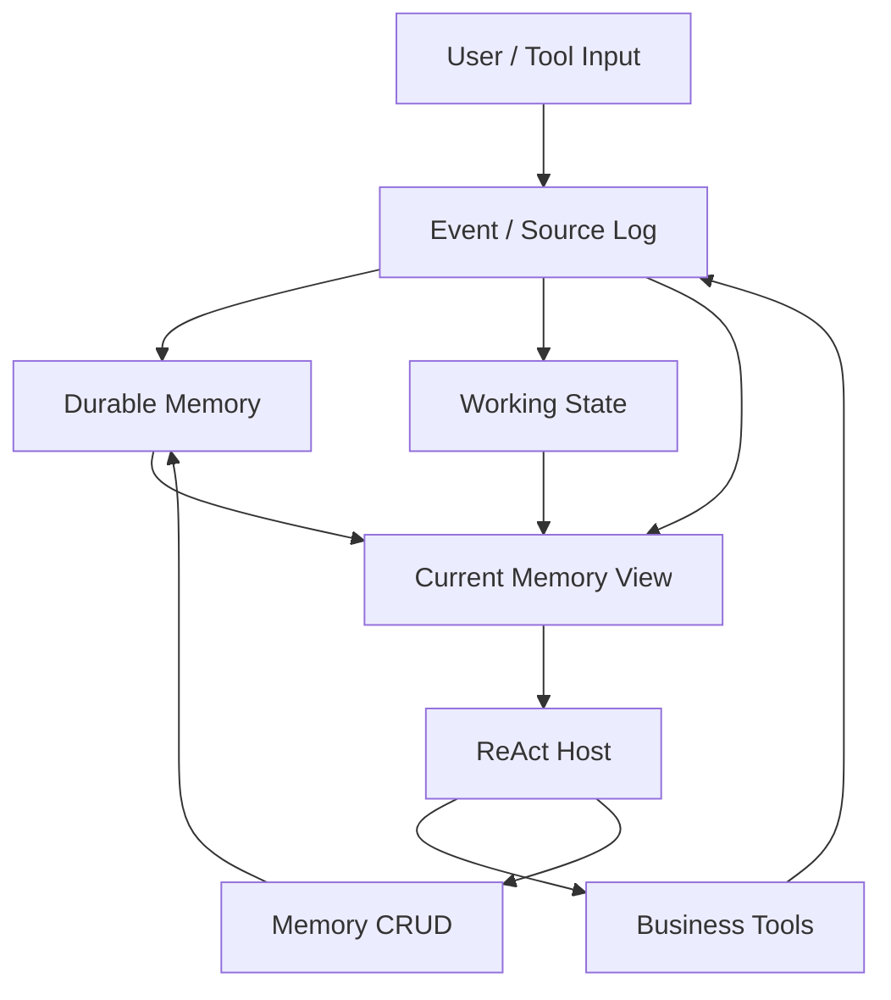

# MiLAi 后续开发规划 v4.0

## 0. 文档目的

本计划基于 MiLAi v3 执行收口后的真实结果制定。目标不是因为某个候选失败就继续换一个候选，也不是重新设计一个更复杂的 Agent Memory 系统，而是：

> **修复当前方法内部已经暴露出的职责混淆、状态副本、信息权威、写入责任和模型使用问题，使已有 Agent Memory 设计先成为稳定、简洁、可解释的系统，再判断 State–Attention 是否具有独立研究价值。**

本计划默认：

- 不自动恢复已关闭的 v3 Goal；
- 不自动启动模型实验；
- 不把 PR #66 合并状态视为本计划已执行；
- 不修改历史实验结果；
- 不用新方法名称掩盖当前失败；
- 不通过增加 Reviewer Agent、Memory Agent、后台反思、事件总线、图数据库等方式解决尚未定位的问题；
- 不通过针对暴露样本增加关键词规则、gold 路由或答案修正取得“通过”。

---

# 1. 当前事实基线

## 1.1 v3 已证明的内容

当前 v3 结果说明，在短 Retained-memory 场景中，普通 ReAct + ordinary memory 已经能够完成基本的持久记忆操作：

| 能力 | B0 / B1 当前证据 |
| --- | --- |
| 新事项形成 | 5/5 |
| 同事项修订并保留无关内容 | 1/1 |
| 后续独立 session 使用 | 7/7 |
| 四条持久正例完整链 | 4/4 |
| 引用／临时／只读信息不误持久化 | 3/3 |
| 六脚本全部通过（含当前格式） | 5/6 |

因此，后续开发不应继续假设：

> “模型根本不会维护长期记忆，所以必须再加一个专门维护器。”

当前更准确的判断是：

> **基础能力在简单、清晰、单一 ordinary-memory 路径上可以成立；复杂持续任务中的可靠性问题来自职责、状态、范围和消费方式的组合。**

## 1.2 C 候选给出的负面证据

C 增加：

- 更长的记忆责任说明；
- `memory_result` 结构；
- 当前 owner/turn receipt 检查；
- 一次 memory-only correction。

结果：

- 持久正例 2/4；
- 两次最终回答仍声称保存但 Store 为空；
- 一次实际写入后把 record UUID 当作 receipt ref；
- 生成 tokens 相对 B0 增加约 67.2%。

这说明：

> **让模型额外描述“我是否完成了记忆工作”，并不能保证模型真正执行记忆工作。**

程序能够核对执行事实，但不应要求模型手工重报程序已经知道的 ID 和执行状态。

## 1.3 v2 与更早实验仍然有效的失败

需要继续保留以下失败，不因 v3 B0 正例而抹除：

1. 正确 State 已形成，但 Host 仍沿旧 assistant answer 或错误普通 memory 行动。
2. 临时要求可能跨 turn 泄漏，即使没有写入长期 State。
3. 真实业务状态已经变化，但普通 memory 中仍保留 stale “当前状态”。
4. 一张记忆可能包含多个可独立变化事项，导致局部修改需要重写整张卡。
5. 模型可能在多个 ID 类型之间混淆 record ID、tool call ID、source ID、receipt ref。
6. 独立 A/U selector 在小 bank 上没有净收益，额外选择调用成本大于候选缩减收益。
7. 当前任务约束可能被记忆与工具管理负担淹没，例如一次性格式要求被忽略。

这些问题应分别修复，不再由一个新的“大机制”统一解释。

---

# 2. 当前 Agent Memory 的核心设计缺陷

## 2.1 缺陷 A：存在多份“当前真相”

同一事项可能同时存在于：

- 用户历史；
- assistant 历史回答；
- durable memory；
- Local State；
- business tool result；
- business journal；
- 当前模型临时推断。

如果这些材料都以近似“事实文本”的形式交给 Host，模型只能自己判断哪一个更可信。

这容易产生：

```text
Durable memory: quantity = 4
State: quantity = 4
Old assistant answer: quantity = 3
Wrong proposal: quantity = 5
```

最终 Host 可能执行 3 或 5。

### 根因

不是 State 不够强，而是：

> **不同信息对象的语义角色没有在模型视图中足够明确地区分。**

## 2.2 缺陷 B：Working State 复制了 Durable Memory

如果 State 重新保存 quantity、destination、packaging、当前偏好正文，那么 State 就不再是“任务状态”，而成为第二套长期记忆。

### 目标修复

State 只保留：

```text
Goal
Current-turn constraints
Active memory refs
Open questions
```

而不是复制 durable facts。

## 2.3 缺陷 C：外部世界当前状态被写成 Durable Memory 的当前真相

高变化性状态如当前是否预约、是否退款、服务是否在线，应由业务系统为权威。

Memory 可以保存长期计划、最后一次观察、已发生事件、以后仍有价值的业务背景，但不应默认把“Nothing is reserved”作为无时间限定的长期当前事实。

## 2.4 缺陷 D：模型承担太多程序已经知道的机械身份工作

模型可能需要处理 memory UUID、source ID、receipt ref、tool call ID、State ID 和 revision。大量信息本来是程序确定的，重复要求模型复制会增加 ID 类型混淆。

### 原则

> **程序负责“实际发生了什么”；模型负责“这意味着什么”。**

## 2.5 缺陷 E：provenance 与 semantic support 混在一起

程序可以自动记录“这次写入发生在 user message X / tool result Y 之后”；这是 provenance。

“source X 支持 conclusion Z”则是 semantic support，需要语义判断。

二者不应统一要求模型通过 `evidence_refs` 手工表达。

## 2.6 缺陷 F：记忆粒度仍可能退化成滚动摘要

粒度标准不是“一句话一条”，而是：

> **如果两部分可以在未来独立改变，应优先独立维护。**

## 2.7 缺陷 G：Attention 在没有选择问题时也付出了选择成本

固定 bank 实验已经观察到，小 bank 全读或普通 query 已经足够，独立 A/U selector 增加额外调用。因此 Attention 不应该是默认必经步骤。

---

# 3. 目标架构

## 3.1 四层语义模型



| 层 | 回答的问题 | 生命周期 |
| --- | --- | --- |
| Event / Source | 实际发生过什么？ | 不可变历史或受控删除 |
| Durable Memory | 未来还应继续记住什么？ | 跨 session，可修订 |
| Working State | 当前正在做什么？ | 当前任务／session |
| Business World | 外部世界当前是什么状态？ | 由真实业务工具负责 |

## 3.2 信息权威角色

模型输入中至少区分：

| 角色 | 语义 |
| --- | --- |
| CURRENT_USER_REQUEST | 当前用户意图和本轮要求 |
| USER_HISTORY | 用户过去实际表达 |
| TOOL_OBSERVATION | 工具或业务系统实际返回 |
| DURABLE_MEMORY | 系统当前维护的长期理解 |
| ASSISTANT_HISTORY | 模型过去说过什么，不等于事实 |
| WORKING_HYPOTHESIS | 当前工作推断，不等于事实 |

这不是“真值分类器”，而是信息来源角色。

---

# 4. 开发原则

1. 修当前职责边界，不重新命名方法。
2. 一次只改变一类失败原因。
3. 程序可确定的信息不要求模型重复表达。
4. 模型语义判断错误不能通过程序伪造正确结果修补。
5. 不从暴露样本构造关键词或 gold 规则。
6. B0 保留为当前简单基线。
7. C 保留为 opt-in 负面/诊断入口，不默认执行。
8. State–Attention 保留研究接口，但不作为每轮必经路径。
9. 完整 CRUD 保留，不因实验收缩而删除基本能力。
10. 失败必须定位到形成、检索、使用、执行或维护中的具体首断点。

---

# 5. 工作包总览

| 工作包 | 目标 | 类型 |
| --- | --- | --- |
| F0 | 冻结 v3 基线和失败语料 | 工程 |
| F1 | 移除模型自证执行的默认路径 | 行为修复 |
| F2 | 建立统一信息角色投影 | 接口修复 |
| F3 | 瘦身 Working State | 算法/表示修复 |
| F4 | 分离 Durable Memory 与 Business World | 语义修复 |
| F5 | 收敛记忆事项粒度和 CRUD 语义 | 记忆维护修复 |
| F6 | 分离 provenance 与 semantic support | 来源合同修复 |
| F7 | 按需启用 Attention | 控制算法修复 |
| F8 | 定向回归与最小新验证 | 验证 |
| F9 | 重新判断论文方法主张 | 研究门槛 |

---

# 6. F0：冻结当前基线与失败语料

## 目标

避免后续修复中丢失真实负面结果。

## 基线

```text
report commit: 44f9291bb0c7f3b6d5c9c71dadf76d1924a81eb2
PR: #66
```

## 必须保留的失败

1. C 零写入却声称 saved；
2. C record UUID / receipt ref 混淆；
3. B0/B1 当次 BRIEF 未消费；
4. v2 临时约束泄漏；
5. v2 stale ordinary memory；
6. 正确 State 后仍沿旧 assistant answer；
7. 精确对象 key 被 Host 自行改写；
8. 宽卡局部更新风险；
9. selector 在小 bank 上成本倒挂。

## 验收

- 每个失败有最小输入、实际输出、Store/Tool 状态和首断点。
- 不要求重新跑模型。
- 不改变旧 rubric 和旧分数。

---

# 7. F1：停止模型“自证执行”

## 7.1 目的

修复“模型填写 committed 但没有真正写入”以及“模型已写入，却需要自己抄 receipt ID 来证明写入”。

## 7.2 修改方向

默认路径中，Host 只通过真实工具完成：

```text
manage_memory(...)
```

程序直接记录：

```text
operation
record_id
tool_call_id
status
receipt
```

最终回答不再默认要求模型重新声明执行事实。

## 7.3 `methods/memory_result.py`

- 保留历史 C 复现。
- `RESULT_PROTOCOL` / correction 不进入默认路径。
- `verify_result()` 可保留为离线诊断。
- 不删除测试和历史方法身份。

## 7.4 `runners/persistent_memory.py`

- B0 作为当前简单基线。
- 默认关闭 correction entry。
- 如果 UI/trace 需要“是否保存”，由程序读取真实 ToolMessage 生成。
- 不新增 D/E 候选命名。

## 7.5 验收

- CREATE/UPDATE/DELETE/no_change/failed 都由程序真实回执决定。
- no tool call 不得被程序报告为 saved。
- 不要求模型输出 receipt ref。
- 已暴露脚本回归中 B0 的持久正例不得退化。
- 不新增额外 Host call。

---

# 8. F2：统一信息权威投影

## 8.1 目标

解决正确 State 与旧 assistant answer 竞争、ordinary memory 与 ToolResult 竞争、错误 proposal 被后续模型当成事实。

## 8.2 只改变模型视图标签

Checkpoint 原消息继续完整保存。

模型视图明确区分：

```text
[CURRENT USER REQUEST]
[USER HISTORY]
[TOOL OBSERVATION]
[DURABLE MEMORY]
[ASSISTANT HISTORY - prior model output]
[WORKING HYPOTHESIS]
```

## 8.3 `integration.py`

- 不删除原始 assistant/tool messages；
- 不修改消息 ID；
- 不根据 gold 选择“真值”；
- 只对当前输入视图增加来源角色。

## 8.4 验收

机械构造：

```text
assistant history = 3
durable memory = 4
tool result = 4
```

程序只验证角色投影。

实际模型检查若仍选择 3，归类为 Host 消费错误，不继续修改 Store。

---

# 9. F3：Working State 瘦身

## 9.1 新 State 合同

State 只保留：

```text
goal
turn_constraints
active_refs
open_questions
```

可选：

```text
last_action
pending_action
```

## 9.2 State 默认不复制

- 长期偏好全文；
- handling plan 数量/地点/包装；
- 当前业务世界状态；
- assistant 历史结论。

## 9.3 Current-turn anchor

当前用户消息作为独立 `CURRENT TASK` 在每次 ReAct 续接中保持可见。

不新增 LLM constraint extractor。

## 9.4 生命周期

- 新 session 清空 turn constraints；
- durable memory 不随 State 清空；
- active ref 在读取时解析当前 memory；
- memory 更新后不需要同步另一份 State 正文。

## 9.5 验收

- 临时格式当前 turn 生效；
- 下一 session 不泄漏；
- 不产生持久写入；
- State 本身不成为第二套 durable facts。

---

# 10. F4：Durable Memory 与 Business World 分离

## 10.1 原则

```text
Durable Memory != Authoritative World State
```

## 10.2 Durable Memory 适合保存

- 长期偏好；
- 持续计划；
- 稳定项目约定；
- 用户明确要求记住的信息；
- 以后有价值的已发生事件。

## 10.3 动态状态优先由业务工具查询

如：

- 是否已经预约；
- 是否已经退款；
- 当前服务状态；
- 当前标签状态。

## 10.4 如需保存

保存为带观察时间的历史观察：

> At T, tool X reported Y.

而不是无时间限定的“Y 当前成立”。

## 10.5 验收

- memory stale 时，实际动作不使用 stale memory 代替必要业务查询；
- 业务成功后漏更新 memory 不造成重复业务动作；
- 不通过重做业务动作修复 memory；
- memory 可保留历史观察，但不冒充实时权威。

---

# 11. F5：记忆事项粒度与 CRUD 语义

## 11.1 粒度原则

> **能独立变化的内容优先独立维护。**

不要按 token、句子或 embedding 相似度机械拆分。

## 11.2 第一阶段不新增复杂 ontology

仍使用 ordinary memory content。

旧记录交付时尽量清楚呈现：

```text
id
matter summary
current content
```

若真实目标选择问题仍然存在，再考虑持久化结构化 matter 字段。

## 11.3 CRUD

- CREATE：新的独立长期事项；
- UPDATE：同一事项发生变化；
- DELETE：明确不再保留持久事项；
- NO_CHANGE：新观察不改变 durable memory；
- READ：当前任务需要该事项。

## 11.4 明确区分

```text
not relevant now != delete
temporary override != global update
outdated world state != erase event history
```

## 11.5 验收

- 修改学习偏好不覆盖 film interest；
- handling plan 局部变化保留未改字段；
- temporary 不 UPDATE durable record；
- read-only 不写；
- 精确删除不影响其他事项。

---

# 12. F6：Provenance 与 Semantic Support 分离

## 12.1 程序自动记录 provenance

程序知道当前 user/tool events，因此可保存操作审计：

```text
created_from_event_ids
updated_from_event_ids
```

不要求模型复制这些 ID。

## 12.2 Semantic support 按需表达

真正要表达“来源 X 支持结论 Y”时，再使用语义关系。

自动 provenance 不能当作 semantic proof。

## 12.3 第一阶段实现

- 只增加程序侧 audit provenance；
- 不改变 B0 模型 visible CRUD schema；
- 不强迫模型填 evidence_refs；
- 不把 provenance 用于语义评分加分。

---

# 13. F7：将 Attention 改成按需启动

## 13.1 默认策略

```text
if candidate material fits budget:
    deliver all relevant candidates
elif ordinary retrieval fits:
    use ordinary retrieval
else:
    enable State-Attention
```

## 13.2 首版触发条件确定性

例如：

```text
candidate_count > N
or
candidate_tokens > B
```

N/B 在实验前冻结，不按题调整。

## 13.3 Attention 只解决

- 候选超预算；
- scope 冲突；
- 分阶段取材。

不承担：

- durable fact 形成；
- business truth 判断；
- assistant-history 纠错；
- 全库维护。

## 13.4 U selector

默认不恢复独立 U LLM selector。

先使用新事件 + ordinary retrieval 找相关旧事项。

只有真实观察到 all/update candidate 成本或质量瓶颈后，才重新研究 U。

---

# 14. F8：验证策略

## 14.1 阶段 A：零模型机械测试

覆盖：

1. 模型最终文本不能伪造 saved；
2. receipt ref 与 record ID 类型明确；
3. authority role 投影正确；
4. State 不复制 durable content；
5. session 切换清除 turn constraint；
6. business result 不自动成为 durable current truth；
7. strict CRUD target 继续正确；
8. provenance 不等于 semantic support。

## 14.2 阶段 B：暴露脚本回归

复用 v3 六脚本，只验证修复没有破坏已有能力。

必须保留：

- B0 四条持久正例；
- revision；
- independent note；
- quotation 不误存；
- temporary 不持久化；
- read-only 不写。

新增关注：

- 当前 turn constraint；
- 无模型自报 receipt；
- 不增加机械证明调用。

不将结果重新称为 unseen。

## 14.3 阶段 C：新的独立小样本

阶段 A/B 通过后才创建 8–12 个冻结脚本。

至少覆盖：

- 明确长期保存；
- 同事项更新；
- 独立事项；
- 临时约束；
- 引用内容；
- 动态业务状态；
- read-only；
- 删除；
- assistant-history conflict；
- 多记录 bank。

## 14.4 阶段 D：只有真实选择瓶颈才重启 Attention

比较：

```text
ordinary all/query
working-state query
lazy State-Attention
```

保持相同 bank、模型、历史、工具和总成本统计。

---

# 15. 指标

## 15.1 任务层

- task success；
- business action correctness；
- current-turn constraint correctness；
- completion / unfinished。

## 15.2 记忆层

- requested save success；
- requested update success；
- unrelated-memory preservation；
- false persistence；
- false save claim；
- stale world-state use；
- duplicate matter creation。

## 15.3 消费层

- correct current source used；
- assistant-history override error；
- memory vs tool-authority conflict；
- current constraint omission。

## 15.4 成本层

- generation calls；
- input/output tokens；
- embedding calls/tokens；
- memory operations；
- retrieval operations；
- control calls；
- correction/retry cost。

---

# 16. Go / Pivot / Stop

## GO

继续当前修复路线的条件：

- B0 基本形成/修订能力不退化；
- authority role 投影改善冲突型消费；
- Working State 不形成第二份 durable facts；
- 新样本中长期／临时／world-state 边界更稳定；
- 不需要增加常驻 LLM 控制调用。

## PIVOT

### persistent memory 正确、当前约束仍错

只处理 ReAct current-task anchor。

### world-state 仍冲突

只加强业务工具与 memory 角色边界。

### 大 bank 检索不足

重新启用 Attention。

### memory target selection 失败

研究事项表示，不先训练 selector。

## STOP

停止继续增加复杂控制机制，如果：

- B0 在新任务族持续优于复杂方案；
- Attention 成本在真实 bottleneck 下无法回收；
- State 必须复制大量 durable facts 才能工作；
- 新 schema 主要制造 ID/格式错误；
- 改善依赖样本特定 prompt 或特殊路由。

---

# 17. 文件级建议

## `methods/memory_result.py`

- 保留 C 的复现能力；
- 不作为默认运行路径；
- verifier 保留为离线诊断；
- 不继续追加 correction 层。

## `runners/persistent_memory.py`

- B0 保留简单基线；
- 默认 correction 关闭；
- 加入统一 Current Task / authority view 时，不改变 Store 和 CRUD 能力；
- 不新增 D/E 候选。

## `baselines/langmem_agent.py`

- 保留 strict CRUD 和 exact read；
- 程序 ToolMessage 继续作为执行真相；
- 公共输入视图增加角色区分；
- 不让模型重新证明程序 ToolMessage。

## `methods/local_state_attention/integration.py`

- 若启用 State，内容收敛为 goal / constraints / refs / open questions；
- 不复制 ordinary memory 正文；
- 不删除 checkpoint 中原始 assistant/tool messages；
- 只改变模型视图和按需材料。

## `baselines/langmem_strict_tools.py`

- strict create/update/delete/not_found/no_change 继续保留；
- 不实现语义事项分类；
- 不增加样本特定内容判断。

---

# 18. 明确不做

当前阶段不做：

- 多 Agent 审核；
- 学习型 memory policy；
- 图数据库；
- 全局依赖推理；
- 后台 Dream；
- 全量 benchmark；
- 第二模型家族；
- 自动事实分类器；
- 复杂 ontology；
- 完整 ATMS；
- 并发事务平台；
- Product 迁移；
- 暴露题特殊规则。

---

# 19. State–Attention 重新准入条件

必须先稳定：

```text
长期信息能形成
同事项能更新
临时约束不会持久化
业务世界状态不会被 stale memory 替代
旧 assistant answer 不会无条件覆盖当前有效信息
```

之后只有出现真实 retrieval bottleneck 才研究：

> State–Attention 是否能在超预算、多事项和 scope 冲突场景中，以更少总计算提供更好的工作视图？

届时 State–Attention 的对象应是：

> **按需构造工作视图。**

而不是：

> **再维护一份事实库。**

---

# 20. 最终完成判据

## 工程完成

系统能够清楚说明：

1. 一条信息来自哪里；
2. 它属于 Event、Durable Memory、Working State 还是外部 World；
3. 谁能修改它；
4. 它何时退出；
5. Host 当前实际看到了什么；
6. 工具执行结果由程序验证；
7. 模型不重复证明程序已经知道的执行事实。

## 方法稳定

在新的小规模未暴露场景上：

- 持久形成可靠；
- 局部更新可靠；
- 临时约束不泄漏；
- read-only 不写；
- stale memory 不替代 live world；
- 旧 assistant answer 不覆盖当前有效材料；
- 额外控制成本不明显高于简单基线。

## 研究继续

只有普通 all/retrieval 出现真实信息选择瓶颈后，才进入 State–Attention 效果实验。

---

# 21. 一句话开发原则

> **先让 Source、Durable Memory、Working State 和 World State 各自只承担一种职责；先让程序自己记录实际执行结果；先让简单 ReAct 正确使用这些对象。只有在这些基础稳定之后，才让 State–Attention 去解决真正的“选择”问题。**

这不是放弃原方法，而是把原方法从不断叠加机制的状态重新收敛到一个可解释、可维护、可证伪的 Agent Memory 系统。
