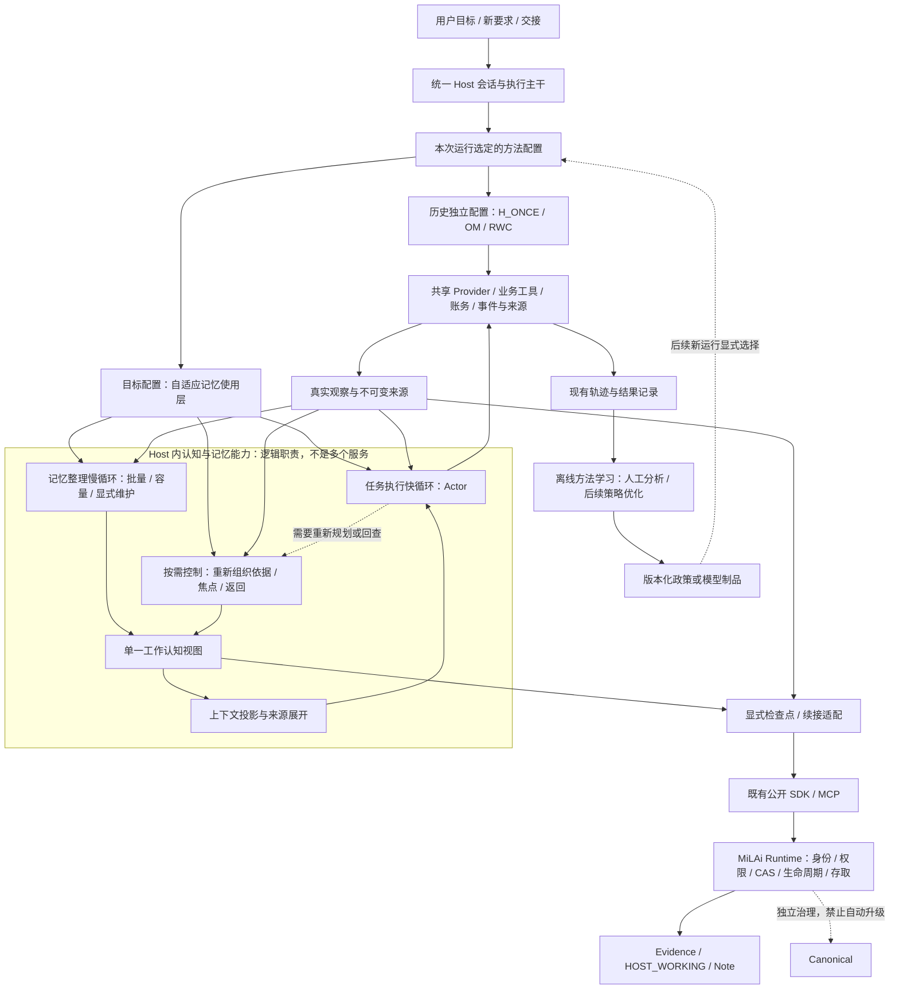

# MiLAi 自适应记忆调控：总目标、总体架构与开发研究路线

> 最新研究入口（2026-09-15）：[ReasoningBank 底座、经验修订与跨任务／多会话验证 Goal v1.0](../studies/active/MILA_REASONINGBANK_TRANSFER_AND_MULTISESSION_RESEARCH_GOAL_v1.0_20260915.md)。
> 下一阶段以完整 ReasoningBank 基础方法为新增参照，保留 OM 与原生 Agent／历史，
> 在已有 Adaptive 能力上研究经验使用中的适用范围修订。LifelongAgentBench DB／OS、
> MemoryArena 完整旅行组及第二模型列入必交研究范围，不以前题出现收益为条件。
> 固定库迁移、在线任务流和依赖多会话分开报告；merger 退回使用回归。
> 仍按“首版完整功能优先，随后优化”开发；本次更新文档，新研究分配／生成为 0。
> 用户给定 bge-m3／bge-reranker 样例请求各一次，均 HTTP 200；2 请求／36 报告 tokens，
> 文本生成 0 次，单列于新 Goal §4.5；未接入方法或启动 benchmark。
> 下方工程状态、98 次分配与 13 次生成均属于已关闭首版；旧规划中的条件性迁移安排
> 由新 Goal 的明确覆盖取代，历史结果、政策及余额保持不变。

> 最近已关闭首版：核心方法 v0.1 / 适配器 v0.7 已实现；147项邻近测试、公开 SDK 跨进程恢复通过。
> E1三臂原生均通过；E2一对固定输入无新增提示收益。13次真实生成、103,103 tokens全部结算，
> 已分配余量关闭；本工作点保留 OM。M0–M3工程验收完成：全量4,628通过/1跳过，静态与构建通过。
> 条件性迁移、正式创新确认及未来扩展未启动，不计作本次首版完成范围。
> [实际结果](../studies/active/MILA_ADAPTIVE_MEMORY_DEVELOPMENT_RESULTS_20260915.md)与运行清单为当前执行依据；
> 以下原始“仅文档/未实现/0调用”文字属于方案编写阶段。

> 执行前的本地入库核对（2026-09-15）：已阅读全文，核对当前状态、v0.4 最终结果、运行清单与
> 相关方法入口。本文仍为 PROPOSED_MASTER_DESIGN / DOCUMENT_ONLY，新模型分配与生成均为0。
> `ADAPTIVE_MEMORY_DEV` 与 `MemoryView` 仍是拟议设计，当前入口未实现该组合。
> §22 外部阅读记录属于原设计的调研，本次本地核对未重新查新或复现外部方法。

**设计定位：架构统一，方法可替换；借鉴成熟机制，增量实现创新；以真实任务结果和完整代价持续修正设计。**

**首版历史开发入口（2026-09-15）：[完整开发与贡献验证 Goal v1.0](../studies/active/MILA_ADAPTIVE_MEMORY_DEVELOPMENT_AND_CONTRIBUTION_GOAL_v1.0_20260915.md)。以下为当时的开发安排，后续研究以顶部新 Goal 为准。**
按用户最新要求，先完成观察／归并、工作区与 Frame、N1–N4 工作路径、Actor／Controller 回读、
ACT／RECALL／DELIVER、可选交付复核和公开保存恢复，再依据真实使用优化调度、成本和政策。
首版不为提前精简而删除上述能力，也不以先取得正面实验为功能开发条件。
Goal 状态为 READY_FOR_DEVELOPMENT / NOT_STARTED；本次仅更新文档，新分配和生成仍为 0。

本文件统领后续 Host 记忆方法的设计、开发、局部验证、跨任务评价和产品化准备。它不是下一批实验的槽位清单，也不是给已经关闭的实验续费。现有 Lab 架构已经完成；本文件在其基础上定义长期目标形态和明确的演进接口，不追认新能力已经实现，不要求推倒重写现有原型。

**核心目标不是证明 RWC 必须优于 OM，而是形成一种能可靠续接已有工作、按需调整记忆影响、在有限资源下完成任务的 Host 记忆方法。** 最终方法可以保留 RWC 的部分机制、采用 OM 的维护组织，或在开发中形成更简单的新组合。方法选择服从结果，研究问题不依赖某个版本名称存续。

---

## 阅读导航

- §1–3：当前事实、总目标、真实场景与架构原则。
- §4–6：参考方法、系统全景、现有实现到目标架构的映射。
- §7–11：数据模型、运行算法、创新候选、首个完整演进方案、正常使用示例。
- §12–15：效率、保存恢复、适配性、前瞻能力与安全边界。
- §16–20：开发路线、实验体系、创新判断、资源与交付。
- §21–22：架构决定、来源与本次文档边界。

文中标记：**已有事实**来自项目附件；**外部参照**来自本次核对的论文或官方说明；**目标设计／拟议增量**是本文建议。来源使用 `[S#]` 与 `[R#]` 编号，完整索引见 §22。

## 1. 当前实验状态：已经具备方法载体，但没有产生可推广的特殊政策

### 1.1 以最新状态顶部的终态为起点

最新 [LAB_CURRENT_STATUS.md](LAB_CURRENT_STATUS.md) 顶部明确记录：[S1]

```text
ARCHITECTURE_COMPLETE / V04_LIVE_OBSERVED / CLOSED_BOUNDED_DISCOVERY
KEEP_OM_AT_THIS_WORKPOINT / NO_NEW_RWC_POLICY_PROMOTED
```

当前实现保持 `milai-rwc-v0.4`、适配器 `v0.6`、`om-sync-port-v0.1`；正式政策没有因本轮局部诊断而改变。本轮在已暴露的 `multi-source-data-merger` 上获得：

| 方法 | 原生 reward | 全角色生成次数 | raw tokens | 本轮判断 |
| --- | ---: | ---: | ---: | --- |
| WORKSPACE_SIMPLE | 1 | 32 | 109,956 | 结束路径可用，完成了该任务，但开销较大 |
| MILAI_RWC | 0 | 32 | 152,266 | 结束为 INCOMPLETE；当前候选没有完成该任务 |
| OM_SYNC_PORT | 1 | 8 | 59,878 | 本工作点的质量与成本支持保留 OM |

这些是**一个任务来源上的三条方法轨迹**，不是三个独立任务，不是总体成功率，不证明 OM 对所有长期任务占优。RWC 没有完成，不能用它与 OM 的调用比宣称“成功效率相差四倍”。[S1]

本轮共 **80 次生成、358,729 tokens，全部结算**。W1 三臂使用、两个 W2 固定输入诊断、W4 收敛已关闭。128 个已分配位置中剩余 48 个关闭；未启动的 64 次完整配对预约也关闭；条件迁移和续接没有分配。改进版配对、迁移、续接未运行，不因“有界探索关闭”被改写成全部可选路线完成。[S1]

本轮工程检查为 **72 项邻近检查，以及 boundary、ruff、mypy、build 通过**；没有重跑全量回归和公开恢复。旧版 4578 passed / 1 skipped 是其所属版本的历史证据，不与这 72 项相加。[S1]

### 1.2 附件时间与当前仓库记录分开

原设计收到的状态附件名为 `LAB_CURRENT_STATUS(1).md`，对应仓库中的
`LAB_CURRENT_STATUS.md`。当前仓库使用说明也已更新为 v0.4 真实运行终态，
“尚无新模型效果结果”只属于此前文档快照。状态后文保留的旧日期属于历史段，
不能据此把顶部 v0.4 结果退回未开始。[S1][S2]

本地入库时已读取完整 v0.4 结果与运行 manifest，版本、三臂数字、80次总生成、
358,729 tokens 与关闭状态一致。[S8][S9] 本文采用最新终态描述实验，使用说明描述接口，
旧设计说明决策来源；该核对没有重新逐条审计 Provider 原始请求，也不新增方法效果结果。

### 1.3 五条已经足以影响总架构的证据

| 已有观察 | 可以据此作出的设计判断 | 仍不能推出什么 |
| --- | --- | --- |
| SIMPLE/RWC 都在 batch=3 下只延后控制一次，子目标边界提前触发维护和摘要 | “轨迹怎么分段”与“何时值得额外计算”需要成为两个不同的设计决定 | 没有同期 batch=1 对照，不能确认批量策略的净效果 |
| RWC 32 次仍未完成；OM 8 次成功 | 控制开销必须进入方法目标，不能把持续调用 Controller 当成能力本身 | 不能将全部失败归因于调度，不能否定所有调控方法 |
| OM 也产生了不准确观察 | 整理产物必须保持可错、可回查和可修订；高任务分不认证摘要真值 | 现有错误记录不证明某项拟议纠错规则已经能修复它 |
| D1 改变下一动作但没有建立记忆复用 | 动作变化与 State 的跨步因果价值需要分开 | 不足以推广新政策 |
| D2 的回读格式拒绝混杂了动作变化 | 需要在具体接口边界消除或标注混杂，而不是称作重新激活收益 | 不保证“补一个默认字段”就一定修复所有回读行为 |

这些判断来自最新状态摘要。[S1] 它们指向方法组织和认知更新，而不是重新建设存储、回执、Judge 或一整套准入链。

### 1.4 必须保留的历史结论

当前不是“所有机制尚未测试”。H_ONCE 的分段与缓存、独立维护、RWC 的控制循环都已经有真实运行证据；EVIDENCE_1 与普通增量维护的同条件比较没有任务或调用数优势，且多 215 tokens。[S3]

当前也不是“创新方向已经被否定”。最新结果覆盖有限任务、模型和配置，没有同一候选的可靠跨任务、跨会话净收益证据；未出现相关机会的能力不能填写虚构失败率。[S1]

**当前使用选择：在已测工作点保留 OM；当前研究选择：保留可替换方法载体，开发有具体操作差异的新候选。** 两者不改变 Product A0 默认，不自动打开保护数据，不重开任何历史额度。

## 2. 总目标与真实动机

### 2.1 总目标

在现有 MiLAi 治理与 Host 执行基础上，形成一层**面向持续问题求解的自适应记忆使用能力**：

> Agent 能保留已经获得的事实与判断依据，容纳未证实的替代方向，在新证据出现时调整记忆对当前工作的影响，并以合适的计算代价完成回答、实际行动和跨会话续接。

“自适应”指运行中根据任务与反馈形成不同的工作状态和处理选择，不是按 task ID 切换答案提示。“记忆调控”指记录形成、修订、工作集选择、重新检查和交付之间的联系，不是直接修改 Transformer attention 权重。

### 2.2 用户获得什么，而不是系统展示什么

| 真实场景 | 用户损失 | 方法应该改善的结果 |
| --- | --- | --- |
| 持续代码维护 | 重复试过的办法；修复一处却破坏已确认约束；临时限制永久固化 | 复用先前验证，正确处理适用范围，减少返工 |
| 多来源分析与工程排障 | 资料已经取得仍反复搜索；第一种解释占据后续工作；答案列出很多可能却缺少区分依据 | 更有效地使用已有证据，选择能推进判断的调查，形成有根据的答案 |
| 长期研究与项目协作 | 忘记为什么暂停；把执行失败写成方法失败；不断重开不服务目标的工作 | 保留决策理由与边界，在新证据下合理继续或停止 |
| 中断、交接与多阶段变化 | 只恢复摘要，不能恢复工作位置；旧计划压过新任务 | 从合适位置续接，及时吸收当前目标与新观察 |

这些是本文采用的目标应用，不表示所有场景已经有本地可运行任务或验证结果。

### 2.3 成功标准是质量—成本—连续性的共同改进

优先完成真实工作，并同时衡量：重要错误、无价值重建、用户纠正负担、延迟与全角色计算成本。不能通过更快认输降低成本，也不能通过无限复核提高局部正确性。

设计上可以写成一个约束目标，而不将其直接编成未校准的打分器：

\[
\max_{\pi}\;\mathbb{E}[Q(\text{task},\text{world},\text{delivery})]
\quad \text{s.t.}\quad
C_{\text{model}}+C_{\text{tools}}+C_{\text{memory}}\leq B,
\quad \text{authority and safety constraints hold}.
\]

实际评价保留质量与不同成本分列，比较 Pareto 取舍，不用一个权重任意的“创新总分”掩盖失败。任务完成后是否能继续利用经验，是另一项生命周期评价。

### 2.4 不属于必须保住的东西

不要求最后的方法名仍为 RWC；不要求 N1–N4 每项都有独立收益；不要求每个任务产生卡片、分支或 RECALL；不要求多模型、多 Agent、后台服务、图数据库或训练成为首版组成。

**借鉴来的模块可以成为正式可用方案。创新只在确实提出、实现并验证了差异的位置主张。** 架构也应允许把一个已证实有用的局部改进贡献回参考方法，而不是强行维护全套自有框架。

## 3. 统领性原则：哪些稳定，哪些开放

### 3.1 稳定的系统边界

1. **Host 作认知判断，Runtime 作治理。** 权限、作用域、来源披露、版本、CAS、幂等和生命周期继续属于 Runtime／可信适配；业务意义与记忆适用性属于模型使用政策。[S2]
2. **原始目标、真实反馈、未结业务操作独立于模型记忆。** 工作记录不是当前用户要求的唯一副本，也不能认证动作完成。
3. **记忆组织不等于调用调度。** 可以按子目标、时间或事件分块，但重命名一个子目标不应在目标方案里天然要求一次新的模型维护。
4. **一条方法只有一个当前工作认知视图。** 允许多个数据来源，不允许 Observer、Controller、旧摘要各维护一份相互竞争的“下一步权威”。
5. **一种任务运行只选择一个有版本的方法配置。** 历史 H_ONCE、OM、RWC 保持独立；新组合使用新标识，不在旧任务中无声切换。
6. **原始证据可回查，派生记录可错。** 保留引用只保证定位；模型摘要、卡片、工作安排不因此变成事实权威。
7. **认知控制不能剥夺结束机会。** 保留 v0.4 的收尾资源和草稿语义；安全停止与业务结果未知仍是独立边界。[S2]

这些是架构约束，不是一张要求模型逐项填写的表。

### 3.2 开放的研究空间

政策表达、记录粒度、何时合并维护、怎样保留替代路线、如何选择原文／摘要、是否需要一次专项重规划、怎样利用恢复记录，都可以增量改进。合理组合可以先作为整体实现，之后再拆解；不要求所有组件先各自胜出。

程序提供可操作结构，模型决定具体内容。程序不能通过“出现新版本”“失败两次”“写了 DONE”等文字机械决定真值、切换或成功。

### 3.3 三种更新不要混为一谈

- **运行中的记忆更新**：当前政策不变，State 根据新观察修订。
- **开发中的方法更新**：开发者修改政策、表示、调度或输入组织，形成新版本。
- **离线策略学习**：使用开发轨迹优化提示或训练模型，形成明确绑定的新策略制品。

三种更新都有价值，但只有第一种属于同一方法的运行适应。后两种的调试／训练成本与数据暴露必须单独记录。

## 4. 参考方法与借鉴策略

### 4.1 已有本地 baseline 不再重建

| 方法 | 当前地位 | 保留内容 | 比较用途 |
| --- | --- | --- | --- |
| `OM_SYNC_PORT v0.1` | 已实现，当前已测工作点保留 | 独立阈值维护、观察日志、近期原文、续接提示和回读 | 新方法的真实质量—成本对手 |
| `H_ONCE` | 已实现的方法参照 | 关闭段摘要与缓存、当前段细节、来源恢复 | 判断工作分层之外的增量 |
| `WORKSPACE_SIMPLE` | 已实现的同结构对照 | 与 RWC 相同能力、Actor、调度、交付和预算 | 解释特殊认知政策收益 |
| `MILAI_RWC v0.4` | 完整研究原型，当前不推广 | 卡片、Frame、修订、选材、回读与恢复 | 历史对照和可复用实现，不作为预设赢家 |

本地 OM 是机制移植，不是完整 Mastra 产品。使用说明记录上游参照为 `b611980c1a3fe3f74bd3c6538ce6a34f510954d0`，本地采用线程内文本、同步处理、自定义阈值和约束输出等差异。[S2] 本次读到的当前官方文档不自动覆盖这个历史 pin。

### 4.2 外部创新怎样用于本总设计

| 参考工作 | 本次核对的已有机制 | 设计中的借鉴 | MiLAi 仍须证明的差异 |
| --- | --- | --- | --- |
| HiAgent | 子目标组织历史、摘要过去段、恢复详细轨迹 [R1] | 保留工作层次和可恢复来源 | 更好的依据修订或更低维护成本，不是“也有子目标” |
| Mastra OM | Observer/Reflector、日志与近期消息、来源回读；API 含续接提示和 Observer 管理工作记忆 [R2][R3] | 低频整理、明确维护职责、一个可消费视图 | 对不准确或不再适用的派生记忆怎样有针对性地修订；不能把 currentTask/下一步提示称为新颖 |
| MemR³ | 证据—缺口状态驱动 retrieve/reflect/answer [R4] | 状态必须影响实际选择，查询应服务于缺口 | 面向可执行任务的局部修订、返回与成本组织；其检索并不等价于当前已知句柄 RECALL |
| ACE：Agentic Context Engineering | 反馈驱动的条目化上下文与增量维护 [R5] | 局部更新与跨任务经验整理 | 再次使用时的修订和任务内控制贡献；CRUD 或条目编号本身不新 |
| AgentFold | 训练多尺度上下文整理与行动联合输出 [R6] | 为后续融合／蒸馏保留输出操作空间 | 不能假定基础模型仅靠提示就可靠实现同调用管理 |
| GEPA | 利用执行反馈改进文本策略的外层搜索 [R7] | 后续政策发现工具，先人工、再有界自动化 | 搜索出的通用规则与迁移价值；优化器名称不属于 MiLAi 创新 |
| Learning to select computations | 有限计算下的元层决策与可计算近似 [R8] | 将控制成本作为问题本身 | MiLAi 上可用的低开销近似；精确计算价值不是首版前提 |

这些是方法事实与设计启发，不是把上游论文结果转记为 MiLAi 成绩。本文没有运行新的上游环境或全面核验每个仓库实现；代码复用时记录选定版本、实际调用结构和许可，不按 README 推定本地完整能力。

### 4.3 如何对借鉴方法出现的问题提出改进

采用“原机制 → 本地暴露问题 → 操作差异 → 可检验预期”的路径。

例如：OM 观察日志有用但出现不准确表述，不应立即增加一个每轮 Judge。可以提出“当旧观察确实参与当前决定且遇到不一致时，回查相关原始范围并修订该条”的候选；检查它是否减少错误继承，以及是否引入过多回读。

又如：子目标分段有用，但边界频繁引发维护成本，不必放弃分段。可以保留工作组织，改变摘要物化与控制调度的耦合关系。这个差异需要自己报告，不冒称未修改 HiAgent。

**借鉴是起点；问题定位决定改进位置；新颖性在实际有效操作上审查。** 不要求先证明所有参考方法普遍不足，也不以“做了移植”宣布新方法成立。

## 5. 目标总体架构

### 5.1 系统全景



**快速执行、慢速整理、按需控制共用一个 Host。** 首版继续单写者、同步调用；图中的多框是职责区分，不要求新增进程、队列、服务或多个常驻 Agent。已有原生任务适配和 Product 治理继续复用。

### 5.2 五层职责

| 层 | 稳定职责 | 不应承担 |
| --- | --- | --- |
| 应用与任务层 | 当前目标、交付要求、任务环境与用户交接 | 给候选预写正确记忆或下一动作 |
| Host 执行层 | 方法选择、预算、工具调用、反馈、结束与检查点 | 判定自然语言结论一定正确 |
| 记忆使用层 | 形成、修订、选择、回查与控制介入 | 修改身份、授权或 Canonical |
| 来源与投影层 | 版本定位、分页、读回、实际呈现、摘要/原文视图 | 将“来源存在”提升为语义验证 |
| Runtime 治理层 | 公开存取、scope、权限、撤销、CAS、生命周期 | 隐藏的相关性推理或 Agent 行动规划 |

离线研究与策略学习贯穿各层观察，但不进入正式评测的在线答案来源，不在运行中查看隐藏 verifier 结果替 Actor 修答案。

### 5.3 统一架构不等于统一所有方法的执行序列

H_ONCE、OM、RWC 各自维护时机和状态合同保留。共同入口只统一必要外部能力：事件、来源、Provider、业务工具、预算、交付和检查点宿主。

目标配置可复用其组件，但必须有独立版本。例如将 OM 维护与卡片修订结合，是**新组合方法**，不是在 OM v0.1 名下增加 RWC Controller 后继续比较。

工作开始后不按已知分数自动切换方法。未来确需运行中切换时，必须定义状态迁移、成本和因果边界；不能把多个方法各自的最好片段拼成一个成绩。

## 6. 已有架构到目标架构的映射

| 能力 | 现在 | 总设计中的安排 | 优先级 |
| --- | --- | --- | --- |
| 原生业务执行、真实反馈、用量 | 已有 | 直接继承，作为共同主干 | 保留 |
| RWC 工作记录、卡片、Frame、稀疏更新 | 已有 | 复用操作；是否每轮使用由方法决定 | 保留 |
| OM 观察、归并、原文与提示 | 已有 | 保留独立 baseline，并作为目标整理策略的来源 | 保留 |
| Controller/Actor 接收位置分离 | 已有 | 推广“消费位置与维护位置不同”的内部约定 | 小范围复用 |
| 分段边界与维护时机解耦 | v0.4 仍有提前触发耦合 [S1][S2] | 目标配置中拆开，不改旧配置语义 | 首批增量 |
| 单一认知视图与单一下一步建议 | 各独立方法内部已有；跨机制组合未被证明 | 新组合只发布一份当前视图，防止叠加指挥 | 首批增量 |
| 来源对照后的记忆修订 | 有回读和修订操作，未有稳定净收益 | 将其明确成可选算法路径并实际连接 | 核心探索 |
| 控制介入价值学习 | 没有证据表明已实现 | 先低成本规则与轨迹反馈，再离线学习 | 后续 |
| 跨任务经验演化 | 当前任务工作记忆不等于该能力 | 定义可审查的经验制品与迁移路径 | 前瞻 |
| 本地/公开显式交接 | 已有，存在容量与同环境限制 | 复用；新增语义内容只补受影响兼容检查 | 保留 |
| 通用崩溃恢复、外置大对象、多 Host 并写 | 无本轮完成证据 | 作为独立生命周期扩展，非当前研究入口 | 按需后续 |

“现有架构完成”和“目标方案仍有增量”并不矛盾：前者指已承诺的 v0.4 原型能力，后者指研究框架的演进，不追溯改写旧工程状态。

## 7. 信息模型：原始经历、工作认知、可迁移经验

### 7.1 三种记忆时间尺度

**原始经历层**保存实际事件、动作结果、来源与版本，是可回查材料。它并不自动给出正确解释。

**工作认知层**保存当前问题、依据、适用范围、未决项、候选与返回入口；这是可错、可修订的任务内视图。OM 日志与 RWC 工作区是不同实现形式，不要求立即物理合并。

**经验制品层**在后续研究中保存跨任务可复用的方法经验及适用边界。它必须有来源和开发/确认分区；不同于 Canonical，也不因为一次成功就升级为通用规则。

这三层是逻辑关系。首版沿已有事件、OM group、WorkspaceSnapshot 实现，不建设三种新数据库。

### 7.2 对象设计与最小技术结构

```text
TrustedSession                    # 已有 Host 所有
    goal / constraints / binding / budget / outstanding_operations
    event_registry / source_registry / delivery_state

MethodState                       # 按方法保存，不强制互转
    native_state                  # OM state 或 RWC workspace 等
    processed_event_ranges        # 维护过程实际处理过的来源范围
    actor_presented_ranges        # 实际发送给 Actor 的范围
    policy_and_model_binding

MemoryView                        # 拟议的轻量只读投影接口，不是新数据库
    brief                         # 当前紧凑记录，可为空
    entries                       # 选中的观察组/卡片及来源入口
    frame                         # 可选的单一当前问题/意图/材料选择
    pending_ranges                # 分别列出尚未整理、尚未呈现的范围，不合并覆盖位置
    source_index                  # 有界目录与合法读取入口
```

`MemoryView` 可先是现有装配器返回的轻量值，不要求为其开发通用插件框架。各 baseline 的原生对象保持不变，只在必要边界映射。

### 7.3 认知内容保持自由，来源元数据明确

模型可以用自然语言记录：“该检查仅覆盖版本 A 的正常路径”“这是尚未验证的线索”“回来先核对来源 H017”。不要求每条都填相同表格，不新增强制 TRUE/FALSE/SUSPENDED 状态机。

Host 管理 ID、revision、输入位置、来源范围和披露依赖。未来如加入条目间依赖索引，最多先作为“可能需要重查”的机械提示：某版本改变不自动证明过去结论为假，更不自动授权恢复动作。

注意力引用、支持来源、披露依赖分开：选中不等于相信；引用存在不等于蕴含成立；不再关注不等于可以删除权限依赖。[S2]

### 7.4 纠错不能只靠追加相反一句话

目标更新应允许替换当前有效表述、缩小适用范围、拆分混合判断，以及明确保留未知。旧版本仍可追溯，但不逐版重复回到默认输入。

例如从“全部检查通过”修订为“已执行的普通路径检查通过，另一要求未覆盖”，应当改变当前视图，而不是让新旧两种表述并排无限累积。该修订是否正确仍由来源与行为检验，程序不替模型认证。

### 7.5 暂存和删除的区别

不在当前工作集的候选保留轻量入口；真正被证明错误的当前结论被更正；隐私删除或权限撤销走原治理路径。三个行为不能由同一个“低权重”或 `retire` 标志代替。

来源已读不构成永久屏蔽；历史目录过长应分页。原文与摘要之间的转换改变呈现，不改变材料的事实地位或访问授权。

## 8. 多时间尺度运行算法

### 8.1 执行、整理、控制有各自的时机

| 过程 | 要完成什么 | 何时运行 | 不应默认发生 |
| --- | --- | --- | --- |
| 执行快循环 | 根据目标、当前反馈和可用记忆工作 | 正常每次行动决策 | 每次先调用独立认知 Controller |
| 整理慢循环 | 降低历史重复，保留续接内容 | 实际容量、累计新材料、显式交接等被选方法定义的边界 | 仅因子目标名字变化就重写所有记录 |
| 按需控制 | 重新组织当前判断、材料或路线 | 有明确需求、当前策略请求，或已配置的适用边界 | 对每次成功工具结果再作一次相同分析 |
| 离线演化 | 改进跨任务政策或经验 | 一个有界开发批次之后 | 在确认任务中根据隐藏成绩即时改答案 |

这些职责可以在一次维护调用内合并，例如整理新观察时顺便修订工作安排。**同一轮不应同时调用 Observer、Reflector、Controller、Curator 来重复解释同一批材料。** 确实需要多次处理时，说明各自新增的工作和真实成本。

### 8.2 调度的两级决定

**机械决定**：授权、剩余额度、上下文余量、是否存在未处理材料、已有请求是否完成、相同快照是否已整理。由 Host 直接处理。

**语义决定**：新结果是否改变当前判断，是否值得换方向，哪个缺口影响交付。由 Actor 或已有维护调用中的政策处理。

不新增一个模型仅判断“要不要再调用一个模型”。第一次可采用容量阈值、批量窗口和显式重新规划请求，参数可调；这些是工程近似，不预称为学习型最优调度。

保留强制容量与安全边界，但把普通分段信号与维护需求分开。在目标新配置中，`segment_closed` 首先是组织元数据；是否生成摘要取决于它是否会进入当前输入、是否已有有效摘要，以及当前配置的整理时机。旧 H_ONCE/RWC profile 的既有行为保持不变。

### 8.3 为什么这不是退回可选 State 不被使用

整理责任仍由 Host 的明确生命周期保证，不依赖 Actor 永远记得写 Note。只是短任务可由原文直接完成，长历史需要时才整理；专门控制是额外的按需介入，而不是每步必经关卡。

模型未主动请求重规划时，仍可以在实际触发的整理调用中修订工作记录。但如果没有发生相关机会，就不强迫任务制造分支；后续评价区分“机制未需要”“未采用”“采用无效”。

### 8.4 目标主循环伪代码

下列是设计接口，不是对现有函数签名的声明。

```text
开始运行：
    固定本次 method / policy / model / budget / source scope
    载入该方法自己的状态，独立保留当前用户目标

每次收到真实事件：
    追加原始事件及来源
    标记未整理范围与 Actor 尚未接收范围

下一步：
    若有未知副作用、未知用量或授权问题：走既有停止/核对路径
    若只剩结束机会：让 Actor 给出当前答复或明确未完成

    按选定方法检查是否需要整理，是否已有明确控制需求
    合并同一输入快照上的重复需求
    若本次需要维护且资源允许：
        用一次适用的维护操作处理目标范围
        接收稀疏更新，更新单一工作认知视图
        不把格式接受或覆盖游标称为理解正确

    从当前目标、新反馈、工作视图与可读来源装配 Actor 输入
    Actor 决定：普通业务动作 / 历史读取 / 当前世界查询 / 答复

    业务动作：执行原工具，接收真实结果，进入下一步
    历史读取：返回对应旧来源，不能冒充当前状态，进入下一步
    答复：沿可用结束路径交付；有明确价值和资源时才作可选复核

显式交接：
    保存该方法状态、来源定位、未处理反馈和业务环境绑定
    新 Host 在当前授权与目标下恢复同一方法合同
```

### 8.5 工作区修订与调用的原子性

保留现有一次规范化、一次校验、原子接收的方式。模型内部提议失败不产生半张卡片，不重放已成功业务动作。旧草稿遇到新反馈失效，结束余额不因修稿重置。[S2]

单写者下先用现有 revision 与输入快照定位。后续若并发整理，应只在依赖快照仍匹配时应用；过期结果可以保留为历史产物，不得覆盖当前目标。这个设计接口现在保留，异步实现不进入首个增量。

## 9. 创新候选：保持 N1–N4 连续，同时允许从参考方法的问题发现新贡献

### 9.1 核心研究命题

> 在有限计算下，把可修订的行动依据、可返回的探索入口与实际材料使用联系起来，是否能比普通观察整理和正常复核更好地续接工作，并减少错误沿用与无价值重建？

N1–N4 是该命题的四个可分离部分，不是四项必须证明的指标。

| 候选 | 目标操作差异 | 当前证据 | 最强替代解释 |
| --- | --- | --- | --- |
| N1 依据范围维护 | 新反馈修订受影响的当前表述，保留仍有依据的部分 | 已有真实维护，但没有净收益；OM 自身错误又提供可研究问题 [S1][S3] | 只是更好的摘要或一般推理提醒 |
| N2 联想—焦点—采信分离 | 候选可暂留，当前只展开有用材料，未经证实的内容不进入结论 | 相关架构已有，稳定行为收益未证实 [S1][S2] | 只是少放文本或多给提示 |
| N3 可逆重新判断 | 暂离不遗忘；相关变化时按需恢复依据并重新选择 | 不能用 D2 混杂诊断作收益证据 [S1] | 普通历史读取已经足够；回读只是额外计算 |
| N4 证据约束的行动与收敛 | 重要缺口改变下一步或承诺范围，依据充分时及时结束 | 共享结束路径已改进，特殊政策未获证明 [S1] | 更多计算／复核或共同预算修复 |

### 9.2 N1 的首个具体探索：使用时修订，而不只写入时摘要

拟议过程：旧条目参与当前判断 → 当前反馈使其可疑或范围不清 → 按需取得相关原文或当前状态 → 修订当前条目 → 改变后续工作安排。

改进重点是“修订落到当前有效视图，并再次被使用”，不是每次强制增加一次验证。必要依据已在输入中，可以直接修订；需要当前世界状态时，应查询当前世界而非只回读历史。

这可称为**决策相关的记忆再整理候选**，不是对神经再巩固机制的模拟声明。与 ACE 的反馈更新、OM 的整理和 MemR³ 的缺口控制存在近邻关系，差异需要在操作与行为上验证。[R2][R4][R5]

### 9.3 N2 的首个具体探索：保留入口，不持续重复猜想

维护调用可留下尚未验证的少量线索，但无需把所有卡片放进 Actor 全文。活动工作集、返回目录和结论依据有不同用途。

暂存低门槛，不要求线索先有证据；调查和采信另作决定。模型刚接触任务时可先理解接口和复现问题，不要求从第一步就形成完整竞争假设。

可能的收益是减少偏航与遗漏；可能的损失是把重要线索藏到目录里。评价必须同时看两者，不奖励输入越短或分支越多。

### 9.4 N3 的首个具体探索：恢复检查能力，而不是恢复采用权

规则保持不对称：必要条件失效就停止沿用；阻塞消失仅意味着值得再看；当前依据与用户目标共同决定最终采用。

暂挂的条件不构成封闭清单。未记录风险可触发修订，已错内容要更正。返回操作不回滚真实文件或其他副作用。

恢复效果按“是否作出当前合理的选择、是否减少重建”评价，而不是恢复旧路线的数量。旧方案重新可行但不再最优时，不采用可以是正确结果。

### 9.5 N4 的首个具体探索：调控应能退出

当前足够就交付；重要不确定性影响任务时才调查。停止有三种不同理由：任务已足够完成、用户或资源要求结束、系统因安全或未知状态停止。

内部复核是否发生、最终任务是否通过、回答是否诚实分别记录。保持当前 REVIEWED / UNREVIEWED / INCOMPLETE 的实际意义，不把它们重新定义为正确性等级。[S2]

### 9.6 横向候选：低成本控制介入

最新边界触发观察支持研究控制成本，但没有支持某个自适应算法已获收益。[S1] 第一项改动应是可解释的：**组织边界不再无条件启动额外模型；容量维护、语义重规划和正常行动分别安排。**

未来可学习“何时控制、控制多深、保留多少细节”。元推理研究已经把计算选择作为问题，不能把这一动机宣称为首创。[R8] MiLAi 的贡献若成立，应在一种便宜、可迁移的近似上，而不是“Controller 变少了”这一孤立事实。

### 9.7 开放新候选但不无限增加模块

如果开发发现主要问题不是 N1–N4，而是观察归并丢失否定条件、来源定位不够细、控制输出负担过大，可以在本总目标内提出对应增量。每项只需说明：参考机制、实际问题、修改操作、预期价值、反例与必要成本。

同一轮可以形成组合；之后寻找可删除部分。不得为了维护原始叙事而要求所有新发现都改名成“注意力创新”。

## 10. 首个完整演进方案：低频整理底座上的轻量工作区控制

### 10.1 方案选择

**建议首先实现一个新研究配置：采用本地 OM 的整理节奏，复用 RWC 的轻量条目修订与材料投影能力，但不在每次 Actor 前叠加 RWC Controller。**

本文暂用 `ADAPTIVE_MEMORY_DEV` 指代该目标配置，仅是设计标识，不表示新增版本已发布。保留 OM v0.1、RWC v0.4 和 H_ONCE 原入口，所有旧结果继续绑定旧方法。

选择它的理由是可行性与现有工作点，而不是 OM 已经被证明为普遍最优。组合方法也可能比独立 OM 更差；那时可以保留 OM、删除没有价值的新增政策，不必废弃所有可复用架构。

### 10.2 目标配置中的一份认知视图

整理产生的日志和工作区不再各自给一条相互竞争的“下一步”。新方法可让已有维护调用同时产出：紧凑观察、必要的条目修订、一个可选 Frame。Actor 消费的是统一投影。

不要求把 OM 所有 group 转成 RWC cards。可以保留原 group，卡片只承载需要独立修订或返回的内容；视图引用两者，但同一来源版本和范围去重。是否需要两种物理对象应由现有代码复用成本决定。

Mastra 当前 API 已支持 Observer 管理工作记忆与开关续接提示，因此“合并当前任务与工作记忆维护”属于可借鉴机制，不能单独作为新颖性主张。[R3]

### 10.3 两种普通／候选政策共享新配置

新配置内部保留：

- **普通更新政策**：正常总结进展、保留需要的来源与下一步。
- **候选更新政策**：增加依据范围修订、低门槛候选入口、按需重新判断和证据约束收敛。

两者共享维护时机、输出便利性、Actor、来源能力、预算与交付。不得让普通政策失去自然记录条件、纠错或回读的能力。

这对比较回答特殊政策是否值得。新配置整体对独立 OM 的比较回答新增工作区结构是否值得。两个问题在同一代码基础上进行，不要求每次运行全方法矩阵。

### 10.4 第一个可完整开发的增量，不是再写一份提醒

首个切片包含三个实际操作联系：

**分段不自动耗费维护调用。** 保留分段与缓存，摘要在实际投影需要且缺少有效缓存时产生；显式重新规划可以介入，但不是所有边界的同义词。

**已有维护可以修订当前工作状态。** 一次成功更新实际替换或修订当前视图，随后输入可检查；失败保留旧视图与未整理原文，不调用修格式模型循环。

**当前动作始终拿到真实新反馈。** 即便整理尚未触发或记录滞后，也不丢失 Actor 的事实输入；Controller/Observer 覆盖位置与 Actor 接收位置继续分开。

这些是可实现的处理差异。随后才用任务观察它们是否有帮助；不靠增加一段“请认真使用 State”代替连接。

### 10.5 不在本增量中加入的东西

不同时运行独立 OM 和完整 RWC 的全部维护；不加入每步置信度 Judge；不新建语义图谱；不把所有调用改成大 JSON；不自动跨方法迁移已开始的 checkpoint；不更换共享模型服务。

如果现有模块组合需要大范围重构，应优先在现有入口增加小策略函数或一个薄组合宿主。共享抽象只有在至少两个真实调用路径需要时才提取。

## 11. 正常使用中的完整过程

以下是设计走读，不是已完成实验。

### 11.1 小型独立任务

用户给出一个当前资料充分的小任务。Actor 使用原始输入完成，历史未达整理边界，不调用额外控制。该轨迹可以证明方法没有强迫所有任务维护，但不能证明创新机制的收益。

### 11.2 连续工程工作

用户要求修改一个模块。Actor 读取、实现、测试，收到每次真实结果。此前验证出的约束仍在近期原文或观察视图中。

积累到整理边界时，一次维护把已完成工作收缩为带范围的记录，并保留尚未覆盖的需求。下一次测试出现局部失败，Actor 可先依据新反馈处理；需要整理先前判断时，再更新受影响条目。不能因为“失败”二字就自动丢弃所有已验证部分。

若维护记录错误地将普通测试推广为整体完成，合法来源仍可读。通过实际测试或原文对照发现后，当前条目被修订；下一次输入不继续把旧错误摘要逐版回放。

### 11.3 多来源复杂分析

用户的问题需要对照多份材料。初期允许浏览与建立问题理解；形成候选后，按当前能改变判断的缺口选择材料。未采用解释保持简短入口，不必每步全文出现。

选择退出当前焦点不等于删除来源。若新观察让另一条解释更有意义，恢复其依据并重新判断。读过的资料可以在新问题下再读，但重复读取只有确有新增判断目的时才有价值。

### 11.4 暂停后继续

交接点保存当前工作位置、未处理反馈、来源和方法合同。新 Host 在相同保留业务环境中恢复；新用户要求优先于旧 Frame，旧 final 因新目标或新反馈失效。

先判断当前信息够不够续接；缺少历史细节才回读，需要当前世界状态则使用业务工具。恢复不是自动重放旧计划，也不保证任意崩溃后的 exactly-once 执行。

## 12. 效率和可用性设计

### 12.1 优先减少没有新职责的计算

重复装配不维护；相同闭合段的有效摘要复用；条目不变不重写；材料不逐版累积；需要整理与需要修订同时出现时，尽量合并为一次有明确职责的调用。

不以减少调用数为唯一目标。把三个短调用换成一个超长调用未必更便宜；压缩过度导致重读或误判也可能更贵。

### 12.2 上下文容量是硬约束，内部份额是配置

\[
B_{\text{goal/tools}}+B_{\text{new feedback}}+B_{\text{working view}}
+B_{\text{selected history}}+B_{\text{output reserve}}
\leq W_{\text{actual model}}.
\]

实际 tokenizer 与模型窗口继续由现有 Provider profile 确认。当前文档中的字符页长不冒充 token 保证；历史模型值不自动等于下一运行参数。[S2]

目标方案允许按需保留原文、摘要或入口，但受保护的新反馈不被旧焦点吞掉。不能放入本轮的页面显式保持未呈现范围，可在合法边界继续取得；未读不等于已经摘要吸收。

### 12.3 稀疏接口，而不是自由猜测

沿用现有默认值和稀疏更新，机械字段由 Host 管理。对 Actor retrieve 和 Controller RECALL 可以复用一个内部读取意图类型，再由角色适配成现有外壳，避免模型背两套近似但不同的范围规则。

这是拟议的接口简化。最新完整结果已定位 D2 使用对象列表形式的 refs，违反当时字符串句柄
列表合同；整项更新被拒绝，Actor 的动作变化受到拒绝反馈混杂。[S8] 已定位这个格式问题
不等于已验证统一接口或语义修订的收益。未知句柄、多个有歧义动作和损坏输出仍不猜测；
给短反馈并保留原记录。只修有实际依据的接口差异，不建设模糊匹配“意图修复器”。

### 12.4 缓存收益按实账判断

少改前缀、复用记录可以创造缓存条件，不保证 Provider 计费下降。报告 raw tokens、实际缓存 token、延迟和有依据的价格分开；没有费率不推算美元。

### 12.5 维护频率不能固定绑定小标题

目标实现把“子目标变了”变成可观察的工作组织信号，而不是必然模型调用。需要改变架构配置时采用新版本并与相同调度的普通政策比较；不以修改后的结果追认 batch=3 已经有效。

### 12.6 不强制复杂方法成为使用者负担

使用者只需选择明确的方法 profile、正常提交任务，必要时继续或交接。工作区管理界面可显示“当前在解决什么、哪些依据尚未确认”，不要求用户管理卡片 ID 或控制 JSON。

`adaptive` 目标 profile 在验证前保持显式 opt-in。当前工作点保留 OM 不等于设置全产品自动路由；暂不根据用户任务文本暗中挑选已知最有利的方法。

## 13. 保存、恢复与长期经验的生命周期

### 13.1 继承显式交接，不重新建设持久化底座

现有本地及公开 HOST_WORKING 保存了方法状态、完整回执、来源、反馈位置、交付状态和累计账务。公开载荷上限 65,536 字节，解压 archive 上限 8 MiB；业务环境需由调用者保留。[S2]

首个新配置若增加状态，更新本地序列化与方法绑定；涉及公开内容时补对应检查。仅修改语义政策不重复运行所有公开恢复与全库回归。

### 13.2 方法升级与旧检查点

同一方法合同才能透明恢复。新组合对旧 OM/RWC 的状态兼容必须显式设计，不能更改 method 字符串就继续。

可选路径是：保留旧方法恢复；或在新的独立任务中，按授权读取旧原始事件重新建立新状态，记录重建成本及转换损失。这是转换，不称为无差异续跑。不可读依赖不作为空记录覆写。

### 13.3 前瞻的大历史方案

长期历史超过当前自包含载荷时，未来可采用“小 head＋受治理来源对象”的结构。但这需要来源持久性、披露撤销、引用一致性与失败处理支持，现有 64 KiB 载荷不具备无限容量。

在有真实超限问题之前不新增大对象存储；即使未来扩展，也保持 Runtime 机械存取，不引入语义决策。不能简单把 archive 拆到未受权限控制的文件路径以规避限制。

### 13.4 经验进入跨任务使用的条件

将任务工作记录转成可复用经验时，应保留原问题条件、证据范围、已知反例和来源；剔除不应跨 scope 传播的内容。不将一个成功任务自动总结为全局规则。

经验制品是可错的 Host 知识，不自动 Canonical。开发集得到的经验不能进入本应独立确认的测试轨迹；确认结束后是否用于下一代训练，需要另列版本与分区。

## 14. 泛化、接口适配与前瞻能力

### 14.1 泛化的不只是任务数量

同一核心政策应能用于代码、数据与分析任务，State 内容可不同。用不同任务专用提示拼成的方法集合，不是单一政策泛化。

分开评价任务内适应、跨任务迁移、跨来源场景、跨模型能力和跨 Host 接口。一个维度的结果不能自动扩展到其他维度。

### 14.2 小型能力适配面

目标方法只要求几类外部能力：

```text
observe(real_event)                  # 接收真实用户/工具反馈
read(known_reference, range)          # 读取合法来源
execute(existing_tool_action)        # 原业务工具
project(method_view, budget)         # 组装实际模型输入
checkpoint / restore                 # 沿既有交接合同
report(usage, delivery, outcome)      # 原日志与评价接口
```

这不是要求按名称新增六个 API；可以映射到当前函数。终端、浏览器、文档和协作工具的适配改变数据传输与动作合同，不把任务答案写进认知政策。

### 14.3 多模态

保留来源类型、实际呈现状态和模型能力信息。模型没有实际看到的图像、音频不能被文本占位符升级为已理解。短记忆可以引用多模态来源，但查证时需由具备相应能力的合法路径取得材料。

多模态适配是未来接口能力，不强迫当前文本终端任务为了“架构完整”接入所有模态。

### 14.4 并行工作

不同任务可以并行；同任务的独立只读查询可以并行。当前工作区仍由一个协调 Host 写入。分支结果是带来源的工作产物，不能多个角色同时覆盖共享自由文本。

需要异步维护时，采用快照版本和适用性检查，过期产物不覆盖新目标；这属于后继实现，当前不启动后台服务。

### 14.5 策略优化与训练

当已有稳定运行轨迹、可解释反馈和开发/迁移分区时，可以引入 GEPA 类外层优化，搜索短政策、维护时机或投影策略；也可借 ACE 思路整理经验制品。[R5][R7]

若基础模型始终不能可靠联合产生控制与动作，允许保留分离调用；后续再借 AgentFold 的训练路线进行蒸馏或适配。[R6] 模型训练、数据准备和推理开销分别记账。训练型候选与提示型 baseline 比较时明确条件，不能把额外训练隐藏成同模型同条件。

## 15. 安全、失败与降级

| 风险 | 保留的架构处理 | 不应采取的捷径 |
| --- | --- | --- |
| 摘要错误或范围失真 | 原始来源可达，当前视图可修订，错误作为真实结果保留 | 把有引用的摘要认证为真；自动用 evaluator 修正 |
| 旧焦点屏蔽反证 | 当前用户要求、新反馈和未结操作独立呈现 | 由旧 State 决定新事实不能进入 |
| 维护失败或输出不合格 | 保留旧视图与未处理原文，原业务可安全继续时继续 | 自动修格式模型循环；从截断文本猜工具动作 |
| 交付复核耗尽预算 | 延续 v0.4 结束预留与可选复核语义 | 把空对象当作事实批准；为凑流程继续消耗 |
| 来源撤销/身份变化 | 沿公开读取和披露检查，限制内容不当空白覆盖 | 用缓存或压缩 archive 绕过权限 |
| 未知用量/未知副作用 | 保留真实未知并停止相关后续动作 | 记零、重发、换 operation ID 重试 |
| 记录把网页命令变成政策 | 记忆仍是数据，不能越过来源信任级别 | 将摘要插入高优先级系统指令执行 |
| 分支返回与环境变化 | 重新查询当前世界，保留过去动作的真实副作用 | 回到旧卡片就假设文件和服务自动回滚 |
| 优化过拟合或评测泄漏 | 数据用途与版本分开，确认政策冻结 | 逐题特修后汇总为泛化成绩 |

以上处理集中在现有边界与实际状态变化，不为每次语义失败新建一个治理层。必要安全检查不因开发优先而取消；完整全仓审计也不嵌入每次普通模型决策。

## 16. 总开发路线：设计一次统领，开发按纵向切片推进

### 16.1 路线总览

| 里程碑 | 核心交付 | 为什么现在做／以后做 | 是否要求先获效果优势 |
| --- | --- | --- | --- |
| M0 当前基线与接口映射 | 明确现有独立方法、当前终态、受影响文件与未具备能力 | 防止重建已有资产和误用旧结论；主要复用现有材料 | 否 |
| M1 多时间尺度运行增量 | 新配置中分段与维护解耦；共享结束规则；单一认知视图 | 直接回应 batch=3 仍频繁维护的现象 | 否，开发检查说明实际变化即可 |
| M2 完整候选切片 | 低频整理＋工作条目修订＋实际投影；普通/候选同架构 | 使创新有可运行方法，而不是几句提醒 | 否，边开发边作小范围效果检查 |
| M3 返回与纠错闭环 | 有需要时回查、对照、修订、再次使用；继承交接能力 | 检查错误观察和历史适用性，不只检查接口读取 | 否，不强制造返回机会 |
| M4 原生任务与迁移 | 一版候选在不同任务来源按相同政策工作 | 评价可用性和范围，不以一个合并题作为全局代表 | 系统比较允许失败；无需先证明各组件胜出 |
| M5 贡献收敛与独立确认 | 最小有效规则、最近方法对照、未调试来源的确认 | 支撑创新及产品建议，避免开发成绩被当确认 | 是针对主张的证据，不是普通开发的前置门 |
| M6 可选策略学习与产品候选 | 策略制品、跨 Host 适配、必要生命周期加固 | 在确有数据和使用需求时进入 | 按目标分别判断，不自动开启 |

M1–M3 可以交替推进，一个真实任务可同时验证多项能力。M4 迁移也可提前帮助设计。该表不是新 A–E Gate，不要求每次改动提交一份新 Goal。

### 16.2 当前最先实施的纵向切片

1. 只读核对最新原始 v0.4 轨迹中触发维护与摘要的实际原因，确认本次改动所需事实；不重新审计全部历史。
2. 在新配置中拆开分段事件与维护计划，复用原有成本、反馈位置和结束逻辑。
3. 复用 OM 整理与 RWC 轻量修订，形成一份真实进入下一次 Actor 的工作视图；普通政策与候选同时可运行。
4. 从已有原生入口开展一段正常工作和一个完整对照，检查真实行为；无需先补完所有远期多模态／并发能力。
5. 根据反馈决定下一处改动是记录粒度、调用时机、读取接口还是消费方式；没有新解释则暂停该配置，不循环加提醒。

本文件不执行这些步骤。本地已核对当前结果、方法标识与会话入口；实际开发仍需阅读
受影响函数和对应原始轨迹，不能将设计伪代码当作现成接口。

### 16.3 代码落点与保持最小改动

| 现有或文档记录的位置 | 预期责任 | 不要顺手扩展成什么 |
| --- | --- | --- |
| `src/milai_lab/methods/controlled_workspace.py` | 沿现有更新／路由操作分离调度策略，保持旧 profile | 通用认知状态机 |
| `src/milai_lab/methods/observational_memory.py` | 复用整理、覆盖和视图操作，允许新组合调用 | 对上游整个框架的重写 |
| `tools/hiagent_terminal_session.py` | 选择独立方法及新增目标配置 | 逐任务答案分发器 |
| `tools/run_workspace_native.py` 与既有 Provider | 参数、实际账务与原生执行 | 新 benchmark 平台 |
| `tools/workspace_checkpoint.py` | 只处理新配置实际影响的序列化和方法绑定 | 自动跨方法认知迁移服务 |
| 现有政策目录 | 普通和候选更新政策的真实差异与版本 | 每个 task id 一份专用解题提示 |

这些路径最初依据已提供文档。[S2][S4] 本地核对确认 RWC 与 OM 仍由会话入口独立分派，
新组合尚无实现；具体复用边界以实际源码为准。仅当组合宿主难以清楚放入现有结构时，
新增一个小型目标方法模块；不为统一而重构全部历史研究代码。

### 16.4 文档治理也应增量

本主文件保存总目标、边界、方法接口和路线。当前状态仍由一份状态文档维护；每次实际运行沿现有 manifest 和一份紧凑结果记录。局部提示或参数变化保留版本与理由，不复制一份几十页总 Goal。

只有改变 Runtime 权限、产品默认、方法族、数据用途或较大运行范围时，才需要单列设计决定。旧结果不覆盖，新设计不自动改变过去终态。

## 17. 实验体系：用于检验设计，不反过来把设计缩成机械动作

### 17.1 五类问题，按当前增量选择

| 研究问题 | 主要方法 | 合理证据 | 不足的证据 |
| --- | --- | --- | --- |
| RQ0 实现与使用是否真实发生 | 邻近检查＋短真实循环 | 新材料、维护结果、实际输入与动作链 | 只有 mock 或卡片数量 |
| RQ1 新方法是否有实用价值 | 候选对独立 OM，必要时 H_ONCE | 原生质量、交付、全生命周期成本 | 失败更快；只对弱 Note 赢一次 |
| RQ2 哪个创新操作有贡献 | 同架构普通政策＋定向拆解 | 形成、保留、选材或消费的差异 | 同时换模型、输入与预算后只归功一条规则 |
| RQ3 是否改善变化和续接 | 原生多阶段任务或明确派生续接 | 当前合理选择与重建成本 | 字节恢复；强制 RECALL；没有机会却填 0% |
| RQ4 是否泛化且可学习 | 跨任务/家族/Host；后续冻结确认 | 同一版本无逐题修订仍有用 | 已暴露小题反复调参后的最佳值 |

所有问题都应服务真实任务。执行有效性有问题时定位具体层，不自动回到旧的全链准入；方法效果不佳也不自动取消所有开发。

### 17.2 Benchmark 分层使用

**主开发载体：已有固定 Terminal-Bench 原生入口。** 它提供实际终端任务与外部 Agent 接口，可复用现有环境与 verifier。[R9][S2] `multi-source-data-merger` 保留为已暴露使用回归，不作为持续创新的唯一舞台。其他任务按已有清单和可运行性选择，不凭任务名断言具有记忆压力。

**持续工作载体：选择一个原生多阶段来源。** MemoryArena 的定义是相互依赖的多会话 Agent 任务；ClawMark 的定义包含多轮、多日与变化环境。[R10][R11] 当前资料不证明它们在本地已经完整可用。选择其中一个有价值且低接入负担的子范围，不同时部署两个平台；不以旧 QA 存取接线冒称多阶段执行。

**机制诊断：已有真实轨迹的固定输入或安全分叉。** 它可以检查具体记录怎样影响下一动作；没有执行相应动作就不能报告原生任务成功。当前世界复制不可靠时只做不执行的选择诊断，不能向新动作播放旧动作的返回。

**独立确认：未用于候选形成的新来源与分区。** 以 lineage、仓库或原始任务簇分组，不按改名样例制造独立样本。受保护旧池不因本主设计自动开放。

### 17.3 两层 baseline 与一个必要诊断

整套方法比较：独立 `OM_SYNC_PORT` 是当前主要参照，H_ONCE 按问题加入。普通原 Actor scaffold 可在怀疑共享外壳拖累时作少量系统参照，不要求每题都运行。

政策比较：新目标配置内部的普通政策和候选政策共享时机、Actor、信息权限、技术能力与资源。不能只比较更复杂方法对一个缺少正常读源能力的 baseline。

形成／消费诊断：共享记录可以隔离消费，但其生成成果和成本不能消失。候选记录给普通消费后打平，首先说明特殊消费无增量；形成价值需在相同消费条件下比较。

### 17.4 预算公平：主比较看完整资源，不只数 Host 步骤

所有 Actor、Controller、Observer、Reflector、摘要和失败请求计入。主比较固定相同可用模型、工具、来源和前瞻资源条件，报告实际 tokens、调用、时间、工具与 verifier 成本。

因为角色调用成本不同，单一“相同生成次数”不是唯一公平口径。可在后续受控研究中补充相同 token／时间预算的曲线；也可在相同 Actor 机会下比较，但必须额外报告所有维护开销，不能称维护免费。当前首个增量不必马上跑多预算网格。

任务成功、交付终态和记忆准确性分列。原生 verifier 也可能有局限；出现争议复核受影响项，保留原分与更正说明，不建设无界 Judge 体系。

### 17.5 机制拆解按需要做，不先造全因子矩阵

| 拆解 | 固定什么 | 改变什么 | 能回答什么 |
| --- | --- | --- | --- |
| 形成维护 | 相同前缀、来源和消费方式 | 普通／候选记录形成 | 记录内容与修订规则是否有用 |
| 跨步保留 | 政策与合法历史能力 | 继承记录／从历史重建 | 连续性是否值得维护成本 |
| 消费 | 同时点同一记录和材料 | 普通／特殊使用安排 | 是否需要特殊消费政策 |
| 选材 | 同一记录形成与能力 | 共同材料／实际工作集 | 选择材料是否产生增量 |
| 返回 | 实际存在的历史复用机会 | 普通记录／返回依据或入口 | 是否减少重建、改善重新判断 |
| 调度 | 同一更新政策与工具 | 不同明确时机规则 | 效率来自什么时候维护，而不是内容差异 |

共享前缀来自谁、是否含其既有记忆、生成费用归属，以及是否存在真实环境分叉都要说明。自适应轨迹不同是方法结果，不应伪造字节一致；固定输入比较则不借此主张完整在线生命周期。

### 17.6 创新新颖性的判断顺序

先描述已运行的操作差异，再查最近方法是否已有等价操作，最后判断差异是否必要并有独立效果。不以类脑命名、模型角色、自由文本或技术字段作为新颖性依据。

架构借鉴、一般工程改进、任务内算法贡献、跨任务策略学习与产品收益可以分别成立。提高格式可用性可以保留；若特殊调控无增量，不必把可用性成果硬包装成 Memory 创新。

## 18. 开放开发与正式研究如何并存

### 18.1 开发允许有理由地改变方法

每次修改保留一条简短记录：实际问题 → 操作变化 → 预期下一步差异 → 有可能反驳的结果。可以从参考方法中的问题出发，不必等某个经典 baseline 连续失败才允许探索。

不要求所有开发单变量；完整组合先可用，再做归因。修改越多，当前结果的主张范围越应保持为组合，不用长报告掩盖无法分解。

### 18.2 任务选择不能迎合候选

方法可能在历史依赖强的任务有用，在简单任务增加负担。开发同时保留这类边界，而不是不断加长输入直到普通方案失败。

不存在暂停或条件变化时不奖励“恢复表演”；候选没有写记录时仍保留其任务结果；机会不能由“候选是否产生一张好卡片”事后定义。

### 18.3 稳定后再作确认

确认前冻结候选、强 baseline、模型、预算、任务分区与评价。样本量由最小有用差异、任务变异和预算共同确定，不由本主文件拍定一个数字。

重复运行同一 root 用于波动估计，不增加独立任务数。按来源簇报告不确定性，不把一次温度零运行当成确定性证明。跨模型、跨 Host 结果分别说明接口和训练条件。

### 18.4 有益的负结果怎样进入设计

| 结果 | 合理设计动作 |
| --- | --- |
| 新配置正常但比 OM 更贵且无质量优势 | 缩减控制与额外表示，保留 OM 作为使用方案 |
| 候选形成记录有用，普通消费即可打平 | 保留更新算法，删除特殊消费限制 |
| 减少维护后质量下降 | 研究哪些反馈需要更及时维护，不退回每步全量控制 |
| 观察错误不影响短任务，但在续接中扩散 | 针对来源回查与当前视图更正研究，不用成功 reward 掩盖 |
| 改进只在一类任务有效 | 明确适用范围，检查是否能通过通用配置适配而非 task ID 特修 |
| 多次同条件无新解释 | 暂停该版本，不靠追加样本追求偶然优势 |

负结果的作用是缩小或改变设计，不是自动回到“架构还没完成”，也不是永远保住某个复杂组件。

## 19. 资源、工程验证与执行安排

### 19.1 本总文件不再分配一个巨大矩阵

当前旧额度全部按最新状态关闭。[S1] 本文件新增模型、实验和确认配额均为零。后续一次执行范围可以涵盖一个完整开发切片和伴随小比较，无需每改一条提示重新写 Goal；但不能从主路线推定无限请求。

每次实际工作包只前瞻填写：要实现的差异、所用方法和任务、模型与工具边界、最大实际生成和时间、追加条件与收口理由。规模依已见成本选择，既不要求所有任务恰好五步，也不把表格余额当必须消耗。

### 19.2 现有数据可先回答的问题不重跑

最新调度触发、D1/D2 原始返回、OM 错误观察可先从已有日志核对。没有原始材料时说明缺口，不造细节。新模型请求用于验证已实现的不同操作，或对仍有辨识价值的假设进行检查。

### 19.3 按影响验证代码

政策文字：检查共同合同并在必要时观察短行为。局部接收与调度：邻近测试和受影响静态检查。来源、checkpoint 或公开合同变化：对应生命周期检查。可交付代码版：按仓库规范集中完成适用检查。

不把耗时全仓回归嵌入每次政策迭代。未运行的全回归明示覆盖范围，不跨版本累计 PASS 数；不因文档生成重跑 Product 环境。

### 19.4 保留最少但足够的证据

继续现有请求、响应、真实动作结果、实际投影、状态更新与账务。需要解释新差异时补一个字段或事件，不重建全库哈希闭包、并行审计服务或评分平台。

研究账与开发者工具用量分开，原生环境准备与 verifier 也分列；没有数据的成本保持未知，不用失败未评分来删除投入。

## 20. 总目标完成口径与交付

### 20.1 架构设计完成

本文件应让开发者能回答：系统要解决什么问题；现有资产是什么；哪些能力共享、哪些方法独立；记录在哪里形成、使用和修订；何时额外计算；怎样收尾与恢复；创新在哪里；未来怎样扩展而不破坏边界。

这不要求已经实现所有前瞻功能。本文交付完成也不等于开发总目标完成。

### 20.2 一版目标方法开发完成

至少具有一条连贯可用的入口，能够在选定真实任务中完成普通执行、必要维护、实际投影、来源回查和相应结束；新状态影响交接时有对应验证。允许某些任务不需要全部能力。

普通／候选政策可替换，baseline 保留，所有新增调用计入。主要依赖拒绝降级的成功不能被称为完整认知方法使用成功。实际方法失败可以作为有界开发结果，但不得把未运行能力全部勾选。

### 20.3 研究贡献成立

有实际操作差异、强 baseline 比较、必要归因、跨任务证据和先行工作区别。证据支持哪一部分就保留哪一部分；不要求创新覆盖整张架构图。

### 20.4 产品候选成立

除了方法收益，还需真实使用可维护性、权限与生命周期、成本与延迟、可解释失败、模型与 Host 兼容性。Lab 某题胜出不自动切换 Product 默认。现有 A0、Schema 和部署边界继续保持。

### 20.5 后续交付物保持紧凑

- 一个主设计：本文件，按重要架构变化更新。
- 一份当前使用说明与方法配置：沿现有文档维护。
- 每个有界开发版一份简明结果：版本、实际行为、质量、成本、失败和下一决定。
- 原始证据继续由已有日志／manifest 管理，不复制到正文。

## 21. 总体架构决定清单

| ID | 总决定 | 当前实施方向 |
| --- | --- | --- |
| A01 | 不以 RWC 为必须保住的最终形态 | 保留独立 OM/H_ONCE/RWC，使用选择与研究选择分开 |
| A02 | 固定治理和来源边界，开放认知政策 | Host 判断；Runtime 不新增语义职责 |
| A03 | 执行、整理、控制采用不同时间尺度 | 新配置解除普通分段与额外维护的必然绑定 |
| A04 | 单写者发布单一当前工作认知视图 | 不叠加多份竞争的下一步建议 |
| A05 | 记忆始终可错，错误需要进入修订循环 | 来源可回查，修订替换当前视图，旧版可追溯 |
| A06 | 联想、当前投入、事实采信分开 | 保留小入口、按需展开，不按分支数量奖励 |
| A07 | 暂停与恢复采用不对称证据要求 | 回查按需，恢复检查不恢复行动权限 |
| A08 | 控制以任务推进与及时交付为目标 | 保留 v0.4 结束预留，可选复核不成为唯一许可 |
| A09 | 新组合从已有效方法的运行结构出发 | 首先探索 OM 式低频整理与轻量工作区修订 |
| A10 | 简化接口而不猜语义 | 默认值与角色适配可复用；未知引用不自动修补 |
| A11 | 迁移记忆方法必须显式 | 不在旧 checkpoint 或旧成绩名下替换算法 |
| A12 | 学习与确认分离 | 允许有界策略优化，禁止测试答案回流 |
| A13 | 一份总体设计统领增量开发 | 不为每个局部片段重新建设总 Goal 或门槛体系 |

**最终设计取向：以可靠执行为主干，以低负担记忆整理为底座，以可纠正、可返回的认知控制为可选增量，以完整任务和长期续接的真实价值决定最后保留的算法。**

架构具备前瞻性，意味着未来的多模态、长历史、异步整理、策略学习和跨 Host 使用有清楚的接入位置；不意味着今天一次实现全部。开发可以很小，但每个增量都应归属于这张清楚的大图。

## 22. 来源、阅读范围与文档交付边界

### 22.1 项目材料

- **[S1]** [LAB_CURRENT_STATUS.md](LAB_CURRENT_STATUS.md)（原附件名 `LAB_CURRENT_STATUS(1).md`）：顶部 v0.4 终态、三臂结果、D1/D2 限制、账务关闭和本轮工程范围。
- **[S2]** [HOST_REVERSIBLE_WORKSPACE.md](HOST_REVERSIBLE_WORKSPACE.md)：v0.4/v0.6 运行语义、对象、来源、OM 独立算法、公开恢复与容量；仓库当前版本已包含 v0.4 实跑结果。
- **[S3]** `MILA_HIAGENT_EVIDENCE_MAINTENANCE_DISCOVERY_RESULTS_20260914.md`：H_ONCE、EVIDENCE_1、INCREMENTAL 的实际运行和负结果。
- **[S4]** `MILA_BASELINE_DERIVED_HOST_MEMORY_DESIGN_v0.3_20260914.md`：此前基线选择、对象映射与设计来源；不以其中旧“未实现”描述覆盖 [S1]/[S2]。
- **[S5]** `MILA_HOST_MEMORY_CONTROL_ARCHITECTURE_v0.2_20260914.md` 与 `MILA_HOST_MEMORY_CONTROL_DEVELOPMENT_PLAN_v1.0_20260914.md`：原完整控制架构的设计历史。
- **[S6]** `MILA_HOST_COMPLEX_TASK_POLICY_DISCOVERY_SUMMARY_20260914.md`：可选工作区采用率、真实复杂任务与归因边界的历史。
- **[S7]** `MILA_RWC_v0.4_后续开发与创新验证规划_v1.0_20260915.md`：已执行范围的规划来源，未执行可选路线不得追认完成或重新打开。
- **[S8]** [v0.4 完整开发结果](../studies/active/MILA_RWC_V04_DEVELOPMENT_RESULTS_20260915.md)：原生交付、产物评分、D1/D2 解释限制与终态；本地入库时读取。
- **[S9]** [v0.4 运行清单](../data/manifests/rwc-v04-development-20260915.json)：实际版本、分配、使用与关闭位置、最终账务；本地入库时读取。

原设计附件阶段未单独提供完整结果与 manifest；本地入库核对补充了 [S8]/[S9] 及相关
入口源码读取。没有因此声称重新复核全部原始行为或完成目标新配置的实现验证。

### 22.2 外部主来源（核对日期：2026-09-15）

- **[R1] HiAgent**，方法 §3：`https://arxiv.org/html/2408.09559v1`；官方项目：`https://github.com/HiAgent2024/HiAgent`。核对范围：方法与项目入口，非本地复现。
- **[R2] Mastra Observational Memory**：`https://mastra.ai/docs/memory/observational-memory`。核对范围：观察／归并、同步模式、近期消息、来源回读、工作记忆管理。
- **[R3] Mastra OM API**：`https://mastra.ai/reference/memory/observational-memory`。核对范围：continuationHints、manageWorkingMemory、extractors 及额外结构化调用说明。当前文档不是本地历史 pin。
- **[R4] MemR³**：`https://arxiv.org/html/2512.20237v1`。核对范围：证据—缺口状态与检索／反思／回答控制；不把其对话检索成绩移植成终端执行成绩。
- **[R5] ACE / Agentic Context Engineering**：`https://arxiv.org/html/2510.04618v1`；项目：`https://github.com/ace-agent/ace`。核对范围：方法层条目化与增量更新，不对当前仓库每个 CRUD 路径作能力保证。
- **[R6] AgentFold**：`https://arxiv.org/html/2510.24699v1`。核对范围：多尺度整理与监督训练；不主张仅提示即可复现。
- **[R7] GEPA**：`https://arxiv.org/abs/2507.19457`；项目：`https://github.com/gepa-ai/gepa`。核对范围：反馈驱动文本策略优化和外层搜索，未安装或启动优化。
- **[R8] Learning to select computations**：`https://arxiv.org/abs/1711.06892`。核对范围：计算选择与元推理成本的研究动机，不移植其理论保证。
- **[R9] Terminal-Bench 与 Harbor**：`https://www.tbench.ai/`；`https://www.harborframework.com/docs/agents`。核对范围：原生终端工作与自定义 Agent 接入，不宣称新任务本地环境已就绪。
- **[R10] MemoryArena**：`https://arxiv.org/abs/2602.16313`。核对范围：相互依赖多会话任务的研究对象；本次没有部署。
- **[R11] ClawMark**：`https://arxiv.org/abs/2604.23781`。核对范围：多轮多日变化环境的研究对象；本次没有部署或评分。

本次外部核对服务于设计参照，不是全面新颖性排除。动态网页内容未作为新的冻结运行依赖；后续实际移植时沿用或明确更新选定版本和许可。

### 22.3 本次交付

原设计交付生成总目标与总体架构文档，检查结构、来源编号和关键数字。本地入库另核对
当前实现与终态，修正附件语境，并在现有状态和规划索引加入本文件入口。没有修改 MiLAi
源码、正式政策、Product、模型服务、实验配置或历史结果；没有执行模型实验、原生任务、
公开持久化或工程回归。规划导航的更新不改变已关闭实验的决定与额度。

**本文完成的是总设计，不是新方法已经实现或创新已经成立。当前实验决定继续保持 KEEP_OM_AT_THIS_WORKPOINT / NO_NEW_RWC_POLICY_PROMOTED。**
