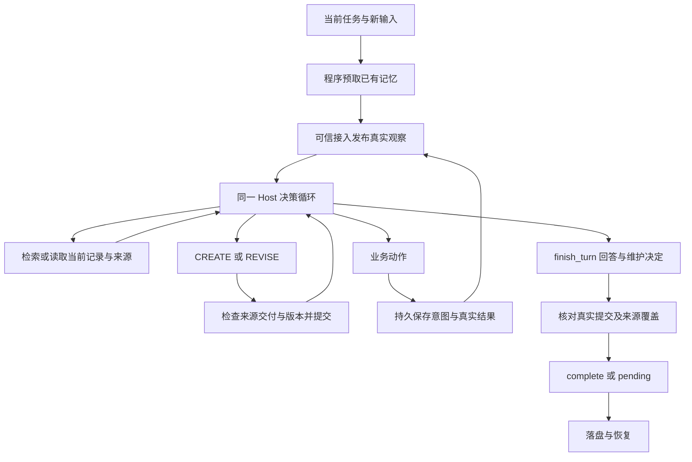

# MiLAi Lab v8 实验报告：持续记忆闭环、实际功能使用与剩余问题

日期：2026-09-25。对象：MiLAi Lab contextual user memory v8。

**结论：v8 已在限定场景中完成首次保存、原卡更正、业务执行后状态更新和持久恢复的分阶段验证。它证明了这些功能可以进入真实任务流程，但尚未证明最终版本连续运行的稳定性、复杂记忆相对简单方法的收益，或自由文本维护的普遍可靠性。**

本报告重新读取开发记录、当前实现、原始调用回执、世界状态、记忆快照和计费 trace，补充输入／输出成本分解及实际功能使用分析。本次只生成报告并更新导航，没有新增模型调用、运行测试、修改实现或重跑 benchmark。

## 1. 实验状态与结论范围

| 维度 | 已有证据 | 当前判断 |
| --- | --- | --- |
| 工程工作包 | A–E 已交付：维护闭环、持久入口、检索与中断修复、真实文档消费者、集成入口 | 限定工程目标完成 |
| 文档工作流 | 首次保存、更正、真实文件修改、完成状态保存、新进程读取均有实际记录 | 分阶段功能通过；不是同一最终源码连续四轮通过 |
| 首次 MERIT 回归 | 原生 5/5，依赖任务 2/2；同事项留下相互冲突的当前卡 | 业务评分通过，记忆语义维护失败 |
| 第二次 MERIT 回归 | 原生 5/5，依赖任务 2/2；末轮 Host 为 `no_progress`，维护为 `pending` | 业务已执行，整体任务未完成 |
| 最终 MERIT 末轮重放 | 原生 1/1，依赖 1/1；原卡由待处理修订为完成 | 最终源码下这一原题通过 |
| 当前记录一致性 | 最终 MERIT 快照三张当前卡分别对应三项已完成退款，旧待办残留为 0 | 仅对该快照成立 |
| 独立方法收益 | 无 RAW／简单更新／候选的同条件对照 | 未确立 |
| State 与其他候选 | 默认 `ordinary/off`；未进行本轮 State 效果比较 | 不能认领 State 或 H1–H6 收益 |
| 长期与生产能力 | 单写者本地原型，少量已暴露场景 | 未验证通用可靠性或 Product 可用性 |

**两次 5/5 和最终 1/1 来自同一个已暴露场景的不同阶段，不能合计成 11 道独立题，也不能写成“最终源码连续五轮全部通过”。**

## 2. 实验问题与方法配置

### 2.1 本轮实际回答的问题

本轮目标是把 v7 已能执行的记忆接口变成持续工作中的实际行为：

1. 首次长期约定是否真正保存，而不是仅在回答中声称记住？
2. 后续更正是否修改同一事项的当前记录，并保留仍有效的信息？
3. 外部动作成功后，当前记忆是否从“待处理”更新为“已完成”？
4. 新进程是否能取得当前要求和执行结果，避免重复业务动作？
5. 调用被拒或执行中断时，是否保留真实状态，并能区分恢复、重放与未完成？

本轮没有增加第七种候选，也没有尝试以更多题目证明已有机制有效。程序只核对可确定的来源、版本、提交与交付事实；记录是否准确概括事项，仍需看实际正文和业务结果。

### 2.2 实际运行配置

| 项目 | 配置与含义 |
| --- | --- |
| Host | vLLM 提供 `Qwen3.6-35B-A3B-FP8`，temperature 0，`json_action` |
| 推理模式 | 早期五个文档相位关闭；后续显式启用同一模型的 thinking，未更换权重 |
| 单请求输出 | 4096 tokens，同时容纳推理和动作；截断输出不执行 |
| 单工作流容量 | 最多 12 次调用；模型上下文 65536 tokens |
| Embedding | `bge-m3`，1024 维；费用与生成分列 |
| 默认方法 | `ordinary`，`state_policy=off`，普通入口能力为 read／maintain |
| 维护方式 | `maintenance_policy=required`，最终回答通过 `finish_turn` 提交维护决定 |
| 新轮次预取 | 使用原始问题，最多 4 项、6000 bytes；在发布新观察前执行 |
| 一般材料配置 | `material_bytes=16000`；与前置预取的 6000 bytes 是不同参数 |
| 状态存储 | 本地单写者 runtime store；所有者、配置、模型和协议身份绑定 |
| 累计限制 | 生成次数、生成 tokens、embedding tokens、复核次数不设硬停止；保留连续计账 |
| 评分 | MERIT 原生程序评分；本轮 LLM Judge 请求为 0 |

移除累计硬停止没有取消单工作流容量。`unknown=0` 指 Provider 用量没有未知项，不表示系统已普遍解决所有外部业务结果不确定的问题。

### 2.3 版本身份

最终协议为 method v13／write v12／ingestion v29／material view v8／operation v2／maintenance v2／runtime store v1。

| 证据阶段 | 源码映射 SHA-256 |
| --- | --- |
| 文档第四轮修订上下文复验、首次 MERIT | `85e900669bc4d66891c707b75f15b2dfe7e64bc74c1ee8259387cb3e14cdcf4c` |
| 直接记录关联与每轮预取后的 MERIT | `b3461930da69f248f323a4f0c07322e77efb1861fb2d11920297698992846015` |
| 最终来源展开与适配器修复、末轮重放 | `039dc573ff428272857ff82c6903023c152a8948868bcfc7ba9181ace7777d05` |

文档前三轮本身也经历过修复；表中的文档身份是第四轮复验身份，不覆盖整个四轮序列。最终冻结文件记录的是末轮运行前的 130 次累计请求，结束账本为 137 次，两者对应不同时间点。

本次重算最终 43 个源码文件、2 份配置和 1 个适配器的散列，均与冻结记录一致。该检查确认当前内容身份，不能代替在最终源码上重新执行完整流程。

## 3. 实际架构与记忆流程

### 3.1 原始来源与当前理解各司其职

来源记录保留用户消息或工具实际返回的内容；当前记录保存 Host 对事项的可修订理解。业务回执是新的工具来源，不是程序自动生成的完成卡。Host 需要读取、判断并提出实际写入。

原始约定从 503 cents 更正为 6595 cents 后，旧消息仍可作为历史来源存在；当前卡应表达更正后的金额。退款执行成功后，应更新其执行状态，而不是把旧历史删除，或另存一张完成卡却让旧待办继续作为当前状态参与检索。

### 3.2 终结合同保证提交事实，不保证语义正确

`finish_turn` 在同一 Host 循环中包含回答与维护决定，没有另起反思模型。`saved` 必须引用真实提交、仍为当前且持久的记录，并覆盖所声明的来源；`no_change` 允许零写入；未完成项保留为 `pending`。

这消除了“没有保存却声明 saved”的一类假完成，但模型仍能误判 `no_change`、选错事项、写错正文或生成冗余卡。首次 MERIT 在维护回执全部完成时仍留下错误当前卡，已经说明这一边界。

### 3.3 当前取材由程序与 Host 共同完成

新轮次按原问题预取已有材料，是程序固定执行的路径。Host 可以继续搜索和展开来源，但不能把预取也计为 Host 自主选择了记忆工具。

普通材料路径现已包含来源到直接引用它的当前解释，以及历史解释到当前修订的关联。这个公共路径修复有助于把已存在的正确卡交给模型，但意味着 v8 ordinary 的材料合同已经变化；与旧版 ordinary 的差异不能直接归因于某一个候选。

已给出的来源链接与已经交付的来源正文仍然不同。`memory_read(include_sources=true)` 现在必须把请求的来源正文真实投影到 Host 上下文，而不是只返回一个可点击或可解析的引用。

### 3.4 本地持久与外部动作恢复

运行状态保存当前记忆、真实 transcript、别名和可见范围；已完成同轮调用可复用结果。业务调用先落盘 intent，再执行；原始结果保存后才形成观察。只有 intent 或结果为 unknown 时，不自动重做同一业务动作；应用可用真实查询结果进行核对，并保留原不确定记录。

这是一套单写者本地恢复合同，不能单凭日志就承诺任意外部系统的 exactly-once 执行。末轮 MERIT 使用隔离世界重放，不是对被旧适配器丢失的原活动会话进行恢复。

## 4. 实验材料与评价口径

### 4.1 固定文档工作流：功能验证

四轮原始请求围绕同一个 Atlas 发布说明文件：

| 轮次 | 用户任务 | 需要观察的行为 |
| --- | --- | --- |
| 1 | 后续发布说明采用“概览、变更、参考”；今天只登记 | 创建持久要求，不编辑文件 |
| 2 | 第三章改为“限制”，保留前两章；今天只检查 | 修订原要求，检查真实草稿，不编辑 |
| 3 | 按已有约定补全文件，保留原内容，未核实内容注明 | 执行真实文件修改，保存完成状态 |
| 4 | 新进程继续工作，核实当前文件并简答，不重复编辑 | 取得当前约定和上次结果，真实读取而不再次写文件 |

这是固定自然语言请求、实际文件工具和持久目录组成的开发消费者样例，不是一个新建正式 benchmark。其通过条件按文件、记忆和会话事实核对，不加入准确率分母。

### 4.2 MERIT：固定原生场景

采用已暴露的 MERIT D1 hard `arc0-000`，上游提交为 `293933d96b1d1849e1f20d1bb324def5de9ed33f`。生成参数为 `n_arcs=1`、`episodes_per_arc=5`、`dep_ratio=0.5`、`base_seed=0`、`difficulty=hard`。

该场景共 5 个 episode、7 条公开用户消息，其中 2 个 episode 为历史依赖任务。使用原始消息、世界、业务工具与 checker；未改写题目、gold 或评分规则。

原生成功条件是：执行前尚未满足，执行后原 checker 成立。上游合并到同一 episode 的多条消息保留，但沿用首个 TaskSpec 计分，因此 7 条消息不能当作 7 个独立得分单元。

MiLAi 接管 Host 与记忆控制流程，上游 runner 的固定开始读取／结束写入流程没有原样照搬。因此这里是**在原生任务与评分器上评价 MiLAi 控制器**，不是完整复现上游所有实验条件。

跨 episode 保留业务世界和持久记忆，Host transcript 与任务 State 重置；同 episode 的多条消息延续真实上下文。gold、checker 参数和私有世界快照只用于评分与制品核对，不进入 Host 输入。

### 4.3 四种完成状态分别核对

| 状态 | 如何判断 | 无法单独证明什么 |
| --- | --- | --- |
| 业务完成 | 实际工具回执与世界状态、原生 checker | 记忆已经更新 |
| Host 完成 | 实际终结状态为 complete | 正文没有概括或目标错误 |
| 维护合同完成 | 来源覆盖与真实提交检查通过 | 当前卡不存在语义矛盾或重复 |
| 当前记忆正确 | 核对当前正文、来源、版本及相关业务状态 | 未来所有场景都会正确 |

其中 `memory_had_fact` 与 `memory_utilized` 是材料包含目标值、动作参数与目标值匹配的事后指标。它们支持使用链分析，但不能排除模型依赖同时交付的原始消息，而非当前卡本身。

## 5. 分阶段实验结果

### 5.1 文档任务的实际完成链

首次要求保存为 `card:1@1`；更正后为 `card:1@2`，正文保留完整三章“概览、变更、限制”，并说明参考不再是必需章节。第三轮实际修改文件，保留原概览内容，为未核实部分添加标记；执行结果保存到另一张记录。

第三轮曾因依据归组不完整而无法结束；修复后在同轮继续补齐真实依据，没有重复写文件。第四轮先出现存储异常，修复后又错误要求回到旧章节。正确要求当时已经在库中，但未进入前四项根材料；旧来源也没有带出当前修订。材料关联修复后，从真实第三轮完成库与文件出发，隔离重放同一第四轮请求，最终能只读核实当前要求。

Host 的核对来自实际 `document_read`；它没有调用名为 `document_check` 的工具。开发者另行只读确认章节齐全，该结果未回流 Host。原请求没有强制指定检查工具，因此不能把未调用 `document_check` 判为这一成功阶段的工具缺失，也不能冒称模型调用过它。

六项功能条件均有完成证据：首次提交、完整更正、真实文件更新、持久执行结果、新进程使用、无重复文件写入。此前失败、错误回答和错误卡均保留。

**仍有一项策略限制：第四轮创建了 `card:3@1`，内容是当前文件符合三章约定且仍有待核实项，与已有 `card:2@2` 的完成记录有明显重叠。**它可以被解释为新的核实观察，但当前实现没有清楚区分“新增有价值观察”和“重复总结同一状态”。无重复业务动作，不等于无冗余记忆写入。

### 5.2 MERIT 两次完整回归与最终单例

| 阶段 | 原生通过 | 依赖通过 | 维护与内容核对 | 结论 |
| --- | ---: | ---: | --- | --- |
| 首次完整回归 | 5/5 | 2/2 | 同一退款事项存在旧金额待办、新金额待办、已完成三张当前卡 | 语义维护失败 |
| 直接关联与每轮预取修复后 | 5/5 | 2/2 | 前四个 episode 完成；末轮退款成功，来源正文未展开导致维护卡住 | 整体未完成 |
| 最终源码，仅重放原末轮 | 1/1 | 1/1 | `card:2@2` 修订为 `card:2@3`，Host 与维护均 complete | 单例功能通过 |

第二阶段旧制品的顶层 `maintenance_pending=false` 与实际 Host `pending` 相矛盾，来自当时适配器的汇总错误。判断应以真实 Host 维护字段和保留的失败记录为准，不能沿用这个布尔值宣布没有未完成项。新适配器已修复非 complete 时继续推进、关闭会话及错误汇总的问题；旧制品不回写成新结果。

### 5.3 最终末轮的真实动作链

最终输入要求按照已有约定办理退款，未给出金额。预取实际交付了 `card:2@2` 及相关材料，当前约定金额为 6595 cents。

| 顺序 | Host 实际动作 | 结果 |
| --- | --- | --- |
| 1 | `get_order` | 取得真实订单状态 |
| 2 | `refund`，金额 6595 cents | 工具成功，隔离世界产生一次对应退款 |
| 3 | `REVISE` 原卡，使用 `content_patch` 修改执行状态 | 被拒：引用了尚未读正文的来源 |
| 4 | `memory_read` 展开所需来源 | 真实正文与相关当前理解交付 |
| 5 | 再次 `REVISE` 原卡 | 提交成功，保留事项与金额，待处理改为已完成 |
| 6 | `finish_turn` | 被拒：把未被当前记录引用的订单查询来源也归为 saved |
| 7 | 修正维护归组，再次 `finish_turn` | 退款与用户输入归为 saved；例行查询归为 no_change；完成 |

所以最终单例含**一次写入拒绝和一次终结拒绝**，不是零错误轨迹。成功来自后续读取及归组修正，不能把完整 7 次请求写成“5 次无错误完成”。

实际补丁只把“等待用户确认、暂不退款”的状态片段替换为“已成功处理”，未重写金额与事项。最终原卡版本为 `card:2@3`。另外两张当前卡分别记录已完成的 1774 cents 与 16100 cents 退款，相关旧待办当前卡为 0。

这条链证明 `content_patch`、来源读取、执行后原卡维护和 `no_change` 在真实 Host 运行中被使用，超出了仅有接口与窄测试的证据。

### 5.4 最终重放的边界

最终运行从第二阶段真实 episode 3 的完成快照，以及 episode 4 的执行前世界建立独立副本。本次核对确认该执行前世界也与 episode 3 的执行后世界相同。

未导入失败末轮的活动会话、退款后的世界或手工改写卡。前四个 episode 没有在最终源码上重跑；失败原会话此前已被旧适配器关闭，无法将这次新副本运行称为原会话恢复。

## 6. 设计功能是否真正被使用

| 功能 | v8 实际使用证据 | 仍需区分的边界 |
| --- | --- | --- |
| 首次持久创建 | 文档首次 CREATE；MERIT 约定登记 | 首次是否值得保存仍由 Host 判断 |
| 同事项修订 | 文档要求原卡更正；末轮退款原卡由待处理变完成 | 没有证明所有相似事项都能选对目标 |
| 精确片段修订 | 文档执行记录及最终退款卡实际使用 patch，后者提交成功 | 早期接口可用时模型仍选择完整改写并出错 |
| 真实业务消费记忆 | 当前约定进入文件操作、退款金额与后续核实 | 来源与卡同时可见，不能证明卡具有独立因果收益 |
| 执行后维护 | 最终退款成功后提交原卡状态变化 | `required` 终结合同明确要求维护决定，并非无约束的自主习得策略 |
| 来源到当前解释关联 | 文档第四轮与后续 MERIT 有真实材料交付 | 关联展开由程序执行，不能计为 Host 主动图遍历 |
| 每轮预取 | 真实 trace 有新轮次材料；最终末轮原卡在预取中出现 | 程序触发，可能产生 embedding 与输入成本 |
| 显式来源正文读取 | 最终末轮从写入拒绝进入实际读取再提交 | 仍有首次提交引用未读来源的行为成本 |
| 新进程使用与同轮恢复 | 文档第四轮独立进程；第三轮恢复未重复写文件 | 不代表任意外部动作中断都已真实演练 |
| unknown 动作核对 | 已有运行存储、核对入口及窄检查 | 最终 MERIT 业务工具成功，未检验真实远端不确定执行 |
| State／Attention | 可选入口及既有工程能力保留 | 本轮成功路径为 off，没有 State 效果证据 |
| 中文词法召回 | 增加单字与相邻双字词项；局部检查与中文文档实例 | 不是中文 benchmark 的准确率结论 |

**对“设计功能没有真正使用”的更新判断：核心创建—修订—执行—回写链已实际发生；部分控制由程序预取和终结合同促成。尚不能把这一闭环扩展为所有候选都被自然触发，更不能把被触发等同于有收益。**

## 7. 失败分析：观察事实、修复与残余风险

| 问题 | 已观察事实 | 已做修复 | 仍未证明 |
| --- | --- | --- | --- |
| 假保存终结 | 初期零写入，却用拟写正文填写终结回执并声称已记住 | 统一 `finish_turn`；只接受真实提交句柄 | no_change 的语义判断始终正确 |
| 局部更正丢信息 | 三章变两章、新值遗漏、枚举与计数矛盾 | 完整枚举与原语言合同；提供准确版本 patch | 自由文本改写普遍可靠 |
| 生成配置不一致 | 调用与容量代码曾硬编码关闭 thinking | 显式配置，实际请求与容量模板一致 | 改善完全由 thinking 导致 |
| 正确记忆未进入上下文 | 当前卡在库中，旧来源命中却不带当前解释 | 补齐直接引用及历史修订关联、每轮预取 | 小预算下任何当前事项都可发现 |
| 读取参数没有传到底 | 请求来源正文，投影仍返回无正文链接 | 单独传递 `include_sources`，错误指出缺失字段和句柄 | 不再出现任何无效首次提案 |
| 拒绝回执使落盘崩溃 | 无材料的错误回执被当作材料交付验证 | 控制回执与材料交付分开，保留原异常 | 完整异常组合均覆盖 |
| 未完成状态被适配器关闭 | 业务已成功但维护 pending，活动会话丢失 | 非 complete 停止推进，保留会话与未评分中断制品 | 旧丢失会话已被恢复 |
| 维护归组过宽 | 最终末轮把例行订单查询也声称写入卡中 | 拒绝具体指出来源不对应，Host 分开 saved／no_change | 第一次终结就能正确归组 |
| 重复状态卡 | 文档第四轮只读后又新建相近完成记录 | 保留为策略限制 | 长期库不会膨胀或出现相互竞争的摘要 |

开启 thinking 后仍经历来源、存储和材料路径修复，且多次使用同一组请求。现有证据不能独立估计 thinking、提示、预取、关联投影各自的贡献。早期翻译或语言切换可能影响了更正质量，但不是已证实的唯一根因。

两个不同失败尤其值得保留：**模型没有正确调用已经存在的能力，以及模型已正确提出需求但程序没有兑现接口。**前者见早期完整改写，后者见 `include_sources` 丢失。继续统一加提示或重试，会掩盖二者的区别。

## 8. 全阶段费用与效率分析

### 8.1 连续计账

本次逐条读取 10 份 Provider trace，对账结果为 **137 次生成请求、948575 generation tokens、41 次 embedding 请求、5432 embedding tokens**。生成与 embedding 未知用量均为 0，Judge 为 0。

generation tokens 按 Provider 返回的 input＋output 统计，不是仅最终答案 tokens。output 中包含本轮已计费的推理与动作输出；未另行推算推理占比。

| 阶段 | 生成请求 | 输入 tokens | 输出 tokens | 合计 tokens | Embedding tokens |
| --- | ---: | ---: | ---: | ---: | ---: |
| 早期五个文档相位 | 47 | 215987 | 6133 | 222120 | 612 |
| 启用推理的文档与恢复 | 25 | 149823 | 51867 | 201690 | 795 |
| 文档第四轮修订上下文复验 | 4 | 25110 | 8446 | 33556 | 533 |
| 首次 MERIT 完整回归 | 28 | 188779 | 37527 | 226306 | 1375 |
| 直接关联后的 MERIT 回归 | 26 | 173738 | 34627 | 208365 | 1690 |
| 最终原末轮隔离重放 | 7 | 49988 | 6550 | 56538 | 427 |
| **v8 合计** | **137** | **803425** | **145150** | **948575** | **5432** |

输入约占 **84.7%**，输出约占 **15.3%**。本轮 7 次 Provider 响应以 `length` 结束，均在启用推理的文档阶段：共消耗 73959 tokens，其中输出 28672，已包含在上表，不能再次加算。这些截断调用约占本轮生成用量的 7.8%。

这里统计的是整个开发与复验过程，包含失败和重复暴露题。不能以总用量除以最终成功题数，声称得到稳定部署的单题费用或模型准确率。

### 8.2 最终单例的请求成本位置

| 用途 | 请求次数 | 输入＋输出 tokens | 说明 |
| --- | ---: | ---: | --- |
| 订单查询与真实退款 | 2 | 12772 | 业务动作 |
| 两次原卡修订提案 | 2 | 17226 | 含一次来源正文未读的拒绝 |
| 补充来源读取 | 1 | 7377 | 正确执行修订所需的取材 |
| 两次终结回执与回答 | 2 | 19163 | 含一次维护归组拒绝 |
| **合计** | **7** | **56538** | 另有 427 embedding tokens |

退款完成后的五次请求占该例生成用量约 **77.4%**。其中包括必要的持久维护与最终回答，不能全部算成浪费；但来源可见性判断、归组表达和反复携带上下文是比压缩最终答复更直接的优化对象。

### 8.3 费用结论

本轮没有同条件简单基线，不能宣称节省成本。预取不增加一次 Host 生成，不等于没有 embedding、检索或后续输入开销。没有精确 GPU 成本与定价归属，故不把 tokens 换算成货币收益。

历史 v7 为 101 次生成／481877 generation tokens／1273 embedding tokens，历史 v6 为 243／969510／93390，均保留但不计作本轮新增。用户记录的 v8 Goal 用时约 2 小时 6 分钟，是开发用时，不是推理延迟；开发代理自身 tokens 也不与运行时 vLLM 用量混算。

## 9. 当前仍存在的问题与修改建议

以下为后续建议，不代表本次已启动新 Goal、扩题或修改实现。

### 9.1 优先处理的行为与代码问题

| 优先级 | 问题 | 建议的最小改动 | 合适的验证 |
| --- | --- | --- | --- |
| P1 | 记录要求、执行结果、核实结果之间仍可能重复创建 | 交付同事项当前记录及已有状态；明确区分新事实、状态更新、无实质变化，优先修订或 no_change。保留确有价值的新观察，不按正文相似度自动合并 | 复用已有文档第四轮，核对新增内容究竟带来什么；不要求零写入作为机械目标 |
| P1 | 来源已提供句柄，但首次写入仍误用未读正文 | 在共享材料与写入接口统一呈现可直接用于写入的来源、需展开来源和当前记录；复用现有可见范围，不再建立第二份可见性账本 | 已有末轮回执与短定向检查，关注第一次有效写入所需调用 |
| P1 | saved／no_change 来源归组负担仍偏高 | 继续利用程序已知的“哪些实际提交引用哪些观察”提示；Host 决定语义，不再让其猜提交事实。程序不能因已有引用就自动证明内容被正确吸收 | 已有最终末轮的两次 finish 作为固定诊断；保留真实来源覆盖 |
| P1 | 推理与动作共享 4096 输出时发生截断 | 先分解动作 schema、材料与推理容量；减少无关枚举和重复材料，保持计数与请求一致。确需改变输出容量时冻结为新配置 | 已保留 7 次截断定位；不截取半份 JSON 执行、不无条件提高重试 |
| P2 | 预取与关联材料的净收益不清楚 | 公共材料路径保持单一实现；记录实际交付与后续使用，先从现有 trace 找重复与无效范围，再考虑局部优化 | 同一对象与预算的离线投影比较；不能把删除必要限制算压缩成功 |
| P2 | 相邻模块存在重复状态解释风险 | 优先收敛 Host、维护模块、runtime store、适配器之间的完成／pending 与材料交付接口；不按文件行数大拆分 | 针对已发生的 pending 汇总、空材料回执错误做窄回归 |

本轮已经证明 patch 能实际使用，后续不应再把“新增 patch API”列为交付目标。应观察模型何时选用它、是否保留未改内容，以及它相对完整改写是否降低错误与成本。

### 9.2 验证缺口与后续实验顺序

1. **先区分修复诊断与最终版本回归。**已有阶段可证明各处修复有效，仍缺最终冻结源码下同一完整小场景的连续运行。若后续开展运行，先复用这一已暴露小单元，联合检查业务、维护、正文及恢复；无需扩大题量。
2. **再检验简单对照。**方法收益应比较相同合法历史、预算和公共材料格式下的原始材料检索、普通更新与至多一个机制。先修好的公共接口不能只给候选，也不能人为隐藏 baseline 可以取得的更正来源。
3. **新样本用于确认，而不是继续调同题提示。**当前场景经过反复修复，适合诊断；待协议稳定后再选择很小、未用于调试的原生子集，保持题目与评分不变。若任务确需 LLM Judge，继续通过 vLLM，单列费用。
4. **恢复验证只补实际缺口。**目前真实文件同轮恢复与新进程读取有证据；外部 unknown 的完整执行链主要是合同和窄检查，不应据此声称任意远端动作都不会重做。

不建议为这些问题引入新的审核 Agent、全局事件平台、并发事务系统、大规模 benchmark 或覆盖所有情况的防御性分支。优先减少现有接口要求模型重复表达的确定性信息，并保持代码路径统一。

## 10. 工程价值与研究判断

本轮最有价值的交付是把维护接入真实业务回合：新约定有记录、更正改变当前理解、执行产生新来源、原卡更新为完成，新进程能够继续工作。当前可研究的设计点包括：

| 设计点 | 本轮证据 | 还缺少的研究证据 |
| --- | --- | --- |
| 同一 Host 的回答与维护联合终结 | 真实 saved／no_change 与 pending 修正链 | 相对普通结束方式，是否减少漏维护且费用合理 |
| 来源到当前解释的公共交付 | 修复了已存正确卡未进入工作上下文的问题 | 相对强原文检索，是否具有独立质量收益 |
| 保留来源的局部正文修订 | 原卡片段更新实际发生 | 相对完整改写，错误率与成本是否改善 |
| 业务结果与维护完成分开保存 | 两次原生通过中的维护失败被识别并保留 | 更多真实中断下是否仍能可靠持续工作 |

这些首先是有实际价值的工程设计。当前没有足够对照支持把它们分别认定为新的方法贡献，不能将“有完整链”直接升级为“胜过现有 agent memory”。ordinary 继续作为默认，候选数量保持冻结。

## 11. 验证记录、制品与交接

### 11.1 已有开发检查

开发记录报告受影响写入、检索、维护、会话、存储、恢复和适配器窄检查通过。最近三组分别为直接关联 15 项、Host／会话／恢复 16 项、来源展开／缓存／中断 12 项，集合有重叠，不能相加为独立总数。

部署环境 vLLM 0.27.1／xgrammar 0.2.3 的 14 个 grammar 探针通过；后续修复未改变动作 wire schema。受影响 Ruff、运行源码 mypy 与包边界检查通过。测试文件全量 mypy 仍有既有 27 项动态导入或 stub 等错误，不能写成整个项目静态检查全部通过。

这些是开发阶段既有结果，本次没有重跑。全套测试、完整 benchmark 和 package build 均未作为本报告工作执行。

### 11.2 本次报告的只读核对

- 最终 43 个源码文件、2 份配置和 1 个适配器身份一致；源码映射重算一致。
- 10 份 trace 的散列与阶段账单一致；137 次生成和 41 次 embedding 的 Provider 用量逐条求和，与连续账本一致。
- 原生场景和初始世界散列一致；12 份已冻结上游源码／文档文件未变化。
- 最终重放计划的 7 项输入身份、语义核对记录的 4 项输入／输出身份一致；执行前世界与真实完成前缀一致。
- 核对当前卡、实际 patch、两种最终拒绝、Host／维护状态及文档末轮重叠卡，不仅采用原生分数。

原始场景 SHA-256：`32e50fc25c1ce473eccb5c0653e3867072d792c9aed80148236f9b0baff5d12f`。

初始世界 SHA-256：`221f4be1976ff8bc44ddc97b121dea6e15c22d79eff15dfe551a914342569b29`。

### 11.3 主要证据入口

| 制品 | 内容 |
| --- | --- |
| [最终冻结身份](../artifacts/contextual-user-memory/v8-development/freeze.json) | 源码、配置、协议与适配器身份 |
| [分阶段文档结果](../artifacts/contextual-user-memory/v8-development/document-results.json) | 四轮实际报告入口、功能条件与重放边界 |
| [文档第四轮实际结果](../artifacts/contextual-user-memory/v8-document-revision-context/runtime/turn-bc9bf9a443860ef1.json) | 当前要求使用、真实读取及新增重叠记录 |
| [首次 MERIT 维护失败](../artifacts/contextual-user-memory/v8-merit-regression/semantic-maintenance-failure.json) | 原生 5/5 下的冲突当前卡 |
| [第二次 MERIT 维护失败](../artifacts/contextual-user-memory/v8-merit-maintenance-repair/semantic-maintenance-failure.json) | 业务成功、维护 pending、活动会话丢失 |
| [最终末轮计划](../artifacts/contextual-user-memory/v8-merit-final-episode/plan.json) | 原题、真实前态、隔离副本与输入散列 |
| [最终末轮执行](../artifacts/contextual-user-memory/v8-merit-final-episode/episodes/episode-4.json) | 实际工具调用、世界、原卡修订与维护结果 |
| [最终当前卡核对](../artifacts/contextual-user-memory/v8-merit-final-episode/semantic-audit.json) | 三张已完成当前卡、一次目标退款、无旧待办 |
| [逐阶段费用对账](../artifacts/contextual-user-memory/v8-development/final-accounting.json) | 10 份 trace、实际费用与历史账目边界 |
| [连续账本](../artifacts/contextual-user-memory/v8-budget.json) | 累计用量及 null 费用上限 |

原始制品保留在本地受管目录，不复制整份 transcript 到报告。此次新增报告与导航不回写已冻结的开发文档散列、失败、分数或旧制品。未修改 Product，未迁移数据，未创建 commit/tag 或推送。
