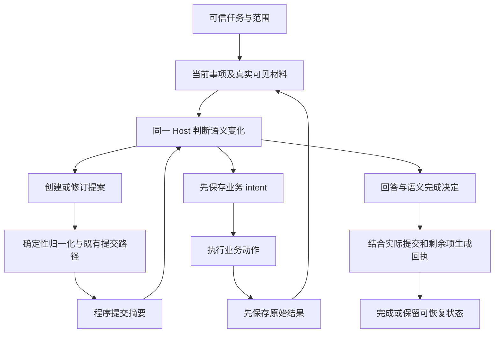

# MiLAi Lab v9 改造设计：语义决定与执行事实分工

日期：2026-09-25。状态：**已实现并完成限定连续验证与局部对照；整体成本收益未成立**。实际结果、首次失败与完整费用见[结果报告](CONTEXTUAL_USER_MEMORY_V9_RESULTS_20260925.md)。

执行顺序与验收见 [Goal v9](MILA_CONTEXTUAL_USER_MEMORY_DEVELOPMENT_GOAL_v9.0_20260925.md)。本设计以本地及远端一致的提交 `b64fc4c9b70c3a8a48cfd770a4b7eaa437f12162` 为基线；主要实现提交为 `290f8354bfe2ee45fcfa0c919049387e775cfd26`。起草阶段只核对静态源码和已有结果；随后实际开发与验证的证据以结果报告为准。

**核心分工：Host 判断本次改变了什么、是否值得保留、是否仍有未完成的理解；程序记录真实读到了什么、哪个版本提交成功、业务实际执行了什么。**

## 1. 源码核对与设计取舍

| 当前路径 | 已确认行为 | 本设计决定 |
| --- | --- | --- |
| `contextual_maintenance.pending_materials()` | 从本轮写入、当前持久版本与 source_refs 计算观察和提交关系 | 复用为程序提交摘要，不让 Host 重填同一映射 |
| `contextual_maintenance.finish()` | 每个新观察都需归组；非 pending 均要求来源从开头到结尾连续可见 | 新版区分语义完成、持久化选择与审阅范围；旧版含义不静默改变 |
| `ordinary_save_schema()` | patch REVISE 仍要求 about_ref、完整 source_refs、dependencies、certainty | 增加明确增量分支，完整替换继续可用 |
| Host `resolved_arguments()` | 写入引用必须有真实正文范围，patch 修改片段必须已交付 | 新增引用沿用检查；继承与撤回既有关系不伪装成本轮正文阅读 |
| `ContextualMemory.save()` | 核对准确目标版本、主体与来源、依赖独立性，最终提交并保存历史 | 保持提交主体，增量在入口先归一化，不再造存储实现 |
| `RuntimeStore` 与 Host 业务路径 | intent 在执行前落盘，原始结果在来源接入前落盘，unknown 不自动重放 | 保留；增加针对维护续接的实际边界验证 |
| `RuntimeIdentity.from_config()` | 完整配置散列参与恢复身份 | 本轮继续精确绑定，用新配置与新库解决环境差异，不关闭检查 |

两个新增问题需要区别：`no_change` 的全文要求是确定的代码约束，但尚未形成真实大文档失败结果；最终 patch 的来源搬运与终结归组成本已有真实轨迹。前者先用定向检查确认语义，后者优先用同一原例验证协议改动。

## 2. 保留的结构



保留一个 Host、现有工具入口、来源记录、可修订卡和本地 runtime store。不会将业务结果直接转换为完成卡，也不会将一条来源引用自动提升为事实真实性或完整理解的证明。

## 3. 合同一：终结时只表达语义决定和剩余事项

### 3.1 模型输入与输出

程序从现有会话状态生成简短提交摘要，内容只包含实际当前版本、实际变化和必要的来源提示。摘要随已有写入回执及终结工具上下文提供，不增加一次“获取维护摘要”的模型往返。

模型不再输出 `sources → record_refs` 的全表。新版提议字段如下；这是待实现合同，不是当前 API：

```json
{
  "answer": "本轮任务结果。",
  "maintenance": {
    "decision": "processed",
    "remaining": []
  }
}
```

| decision | Host 声明的含义 | 程序不能由此推导 |
| --- | --- | --- |
| `processed` | 当前任务要求处理的相关变化已写入，或现有理解已充分表达而无需新写入 | 所有来源全文均已阅读、所有正文语义正确 |
| `not_selected` | 本轮不选择形成新的持久理解，未声称全面审阅材料 | 未读材料中没有重要信息、已完成明确的保存要求 |
| `pending` | 仍有必须完成的语义维护 | 业务没有执行或可以重做 |

`remaining` 只在确有剩余工作时列出已有材料或事项引用及简短原因，不列所有已处理观察。Host 仍可以发生语义判断错误；新合同不宣称通过更小 schema 消除了这一问题。

### 3.2 程序回执

程序根据既有 `observed`、`writes`、`unsettled_operations`、准确版本和实际可见范围生成：

- `committed_changes`：真正发生的变化及版本；零写入就是空列表。
- `semantic_decision`：保留 Host 本次语义判断，不将其写成机器认证结论。
- `review_coverage`：来源准确版本、本轮实际交付范围和未审阅范围。
- `remaining`：尚未解决的语义项与未完成提交，分别标明。
- `business_outcomes`：实际业务结果，独立于记忆维护状态。
- `maintenance_status`：合同是否仍存在阻断项，不等同于对世界的真假判定。

完整对应关系保留在本地制品；Host 默认只看到简短可行动结果。没有新的长期“维护账本”，这些都是既有状态的投影与本轮决定。

### 3.3 终结求值顺序

1. 刷新真实 transcript 可见性，读取本轮实际提交及尚未完成操作。
2. 检查可信任务中要求的阅读范围是否交付；未满足时不能声称对应任务完成。
3. 验证 `remaining` 引用存在且已提供给 Host，不接受任意编造的新目标。
4. 合并程序已知未完成操作与 Host 明确剩余项。模型不能通过省略来源表清空程序的未完成项。
5. 生成真实提交摘要；`processed` 不会凭空产生 saved 记录。存在已知明确保存义务时，要检查实际提交或可解释的既有记录满足关系，不能只看一个终结词。
6. 回执区分业务结果与维护结果。维护未完成时保留会话；业务已经成功的事实仍对调用者可见，原任务不被改写为“确认保存”。

自然语言中的“是否已经充分表达”仍由 Host 判断，不能声称程序能识别所有隐含保存义务。若应用已有结构化的明确保存／审阅要求，沿可信输入传递；没有这项结构时，不增加关键词规则或分类模型伪造确定性。

`not_selected` 不是逃逸分支：它不能取消可信输入的必需处理要求，不能抹掉已知提交失败，也不能把已有真实写入从回执中删除。它与本轮实际写入冲突时，应提示具体冲突，而非静默改写决定。

### 3.4 旧合同兼容

新版维护协议独立版本化。v8 的 `saved/no_change/pending` 与全量来源表继续按其原合同解释；不把旧 no_change 回执迁移成“部分审阅后未选择持久化”。新旧回执不能在同一会话中混用，旧失败不通过格式转换变成完成。

## 4. 合同二：处理相关变化，不等于读完全部材料

### 4.1 阅读范围来自真实交付

当前已有的 `MaterialBinding.spans`、`visible_bindings` 和会话交付是唯一可见性来源。Host 使用已给出的短句柄，不手写字符偏移，也不自报“已读全部”。

未读范围通过来源长度与实际范围差集计算；它只能说明未交付内容，不能说明这些内容有无语义价值。

### 4.2 哪些缺口阻止完成

| 输入情况 | 结束合同 |
| --- | --- |
| 当前直接任务请求尚未完整交付 | 先完成任务输入读取；不能忽略未读请求后宣布完成 |
| 可信应用或明确任务合同要求审阅某个范围 | 必需范围未读则保留 pending；不能用 not_selected 取消 |
| 当前只要求检查长文档中的一个章节 | 核对合法章节范围；其他部分可保留为未审阅 |
| 例行大型查询结果只使用部分内容 | 可不形成长期理解；回执显示实际范围，不声称全文已审阅 |
| 来源内已经发现需更正的当前事项 | Host 处理或明确保留剩余事项；不能因其他部分未读而隐藏已知问题 |

实现首版只需在可信观察接入处保留一个必要的范围要求参数；当前任务消息默认必须交付，普通材料沿其合法范围处理。任务要求某附件全文审阅时，消费者传入要求；Host 可以提出需要进一步阅读，但不能下调已有要求。

纯自然语言中要求与长材料混在一个字符串、又无法可靠分开时，不让程序按关键词猜出范围。保留原请求边界，必要时 pending；有可信适配器时再明确拆分任务说明与附件。这是能力边界，不是新增用户审批流程。

### 4.3 对部分来源的最小检查

用确定性长文本与固定合法范围验证：局部任务能结束并保留未读范围；同样材料在明确全文要求下不能结束。另检查真实材料被移出 transcript 后，过去的完整可见标记不继续生效。无需为此购买大型文档 benchmark 或训练新的范围判断器。

## 5. 合同三：目标、可引用正文与既有谱系统一呈现

### 5.1 默认显示内容

一个可修订事项默认显示：主体、原业务标识、事项描述、当前理解、适用范围、准确版本；其旁边保留新取得的观察和可展开出处。复用现有引用体系，不新增第二套对象 ID。

材料应明确区分：

| 信息 | 可用于什么 |
| --- | --- |
| 已交付的当前目标正文 | 在所见版本和范围上提出修订 |
| 已交付的新来源正文 | 为本次变化提供新的引用，仍不证明语义支持 |
| 只有链接的来源 | 请求展开，不能声称已读 |
| 从目标元数据取得的既有依据 | 指定继承或撤回该关系，不代表本轮核验了其正文 |

不额外堆叠完整来源列表、历史正文与大量状态说明。普通返回只显示本次可行动信息；展开元数据沿既有 read 路径进行。

“可写”提示不是授权扩大，也不是未来提交保证。最终提交仍检查准确版本、实际可见范围、生命周期和既有权限；别名的绑定变化不得悄悄改变目标。

### 5.2 当前事项与重复确认

提示把 CREATE 用于新的可独立变更事项，REVISE 用于原事项的状态、理解或范围变化。已有状态再次被真实工具确认时，可以保留新观察，而不一定新建另一份竞争性摘要。

如果核实时间或新限制本身有价值，Host 可以明确更新它。程序不按相似度自动合卡，不要求同订单仅有一条记忆；订单号、文件身份等由真实工具提供的标识原样交付。

文档第四轮已有重叠卡作为开发诊断使用。验收关注新增内容是否产生可解释的新含义，不把卡数越少当成越正确。

## 6. 合同四：局部正文与增量依据一起表达

### 6.1 两条明确路径

现有完整 REVISE 保留：完整正文或 patch，加完整来源与依赖列表。新路径显式声明 `basis_mode=delta`，只接受正文 patch；省略该字段仍按原完整替换合同解释，不能靠缺少 source_refs 猜测继承意图。

实际 delta 调用形式如下：

```json
{
  "op": "REVISE",
  "basis_mode": "delta",
  "target_ref": "m6",
  "content_patch": [
    {"old": "等待确认，尚未执行。", "new": "已执行完成。"}
  ],
  "source_delta": {"add": ["m11"], "remove": []}
}
```

`dependency_delta` 可选，同样包含 add／remove；省略表示依赖不变。不是再加一个 patch 工具，也不是让模型提供完整旧来源的替代副本。

### 6.2 继承边界

首版 delta 要求目标卡正文与主体／范围元数据完整交付，以便 Host 评估局部变化；这通常是一张短卡，不要求展开全部历史出处。修改片段继续要求唯一匹配、互不重叠、处于已交付范围。

此路径不接受主体、事项标识、结构化条件、时间、certainty 或 persistence 的修改；这些变化走完整路径。作者、提交时间与版本由既有程序逻辑记录。

这项字段限制不能证明自由文本中没有全局变化。改变否定、总数、列表项或总体适用范围可能影响其他句子，Host 应选择完整重述；若仍选 delta 并出错，应作为语义失败记录，不能以字符串匹配通过认定正确，也不新增一套关键词检测来假装理解语义。

### 6.3 确定性计算

令旧准确版本的来源集合为 S，依赖为 D；本次新增、撤回集合分别为 A、R：

```text
S_new = (S_old - S_remove) ∪ S_add
D_new = (D_old - D_remove) ∪ D_add
text_new = apply_content_patch(text_old, patches)
```

计算时保持旧引用的稳定顺序，新增引用按确定顺序附加；引用集合规范化不改变有顺序意义的 patch 操作。归一化产生一次完整内部更新，再交给既有保存、历史、索引及回执路径。

1. 解析已交付准确目标并检查 CAS。不是当前版本则返回冲突，不自动替换目标版本。
2. 验证 patch 与允许的元数据范围，禁止完整字段和 delta 混合。
3. 新增来源和新增依赖按既有写入要求解析真实正文与准确版本；不因本次设计顺带增加全文阅读要求。
4. 撤回引用必须来自目标旧版本，使用已交付的关系元数据即可；不要求先阅读被撤回来源正文。
5. 继承项来自服务器保存的准确目标版本，不接收模型编造的“旧依据”。保留权限、生命周期和引用有效性检查。
6. 检查依赖独立性及现有循环／自身版本边界，不能通过继承绕过依赖规则。
7. 提交正文及有效完整关系，保存本次依据变化的审计元数据；提交失败不产生成功摘要。

若继承引用已经撤回、删除或不能合法使用，返回具体状态，让 Host 明确撤回或重建相关解释；不自动静默移除、不自动扩大披露，也不把旧引用标成新证据。

### 6.4 “继承”与“本轮看见”分别记录

版本回执及可恢复记录至少能重建：旧目标版本、继承关系、新增关系、撤回关系，以及新增或主动重读来源的实际范围。优先在现有版本历史／操作记录增加一个小的 `basis_change` 元数据，不建立单独数据库或全文逐句支持图。

旧来源可能只是历史谱系，不代表它仍支持更新后正文的每一句。v9 不提供逐句蕴含认证；如果来源已被明确否定，Host 应撤回相应支持或用完整路径重新组织。最终读视图不得把继承、新增以及旧历史简单累加成多份独立支持。

继承依赖不需要重新“变成已读”，但当前读取、权限和版本有效性继续按原依赖合同求值。旧版本变更影响适用性时必须显示对应状态，不能仅因 delta 保存成功就把依赖都视为有效。

### 6.5 低成本验证

优先验证一个冻结局部更新输入：同一当前目标、同一新工具结果、相同终结和材料格式，只切换完整依据与 delta。程序核对未改正文、来源差异、版本和无额外业务动作；模型运行观察首次合法提案、调用和 tokens。

完整分支和增量分支的检索权限、可展开内容完全相同；完整分支因协议需要额外读取属于待测成本，不得人为移除它本来能取得的材料。分支结果分别由相同前态的隔离副本生成，不相互继承答案或写入。

## 7. 业务成功与维护恢复

当前 intent／原始结果的落盘顺序不变。恢复首先读取原 session／turn 的日志与实际结果，只交付尚未交付的回执、恢复未完成维护，不重新发布用户请求，也不另建业务执行意图来代替恢复。

定向故障点放在“业务结果已保存”之后、“维护提交完成”之前。新进程恢复相同 session／turn，使用可控业务工具计数，要求业务执行总次数仍为 1，维护最终可以独立完成。

这项验证不能只观察运行器没有自动调用工具，还应覆盖恢复后 Host 再次提出相同已完成动作的情况。若当前代码不能区分维护续接和新业务需求，最小修复是在明确的维护恢复阶段限制新的副作用动作；不要全局按参数永久去重。原任务中新出现的合法操作和新用户请求有自己的操作身份。

unknown 情况仍查询真实业务结果后核对，不能当作安全重试。同名同参不是充分的业务身份；现有未决匹配规则也不能被报告成任意外部系统的 exactly-once 保证。

暂不设计跨会话暂停调度。旧维护 pending 时，调用者获得实际业务结果与可续接状态；不能换 ID 绕过，也不能把所有 pending 一概降级为成功。

## 8. 代码结构与版本变化

| 责任 | 实现原则 |
| --- | --- |
| 维护状态所有者 | `HostSession` 保存本轮事实与决定；维护模块计算视图和终结，不复制另一份可变对象库 |
| 材料可见性所有者 | 现有 session 交付与 `MaterialView`；写入提示和校验读取同一绑定 |
| 增量依据 | `write_contract` 定义 schema 与纯归一化；`ContextualMemory` 承担真实保存与历史 |
| Host | 解析模型意图、调用公共路径、展示真实回执；不再另算提交映射 |
| Runtime store | 持久事实、会话、依据变化与恢复，不推断业务语义 |
| 评估适配器 | 传递原题、保留实际世界、冻结状态与计费；不决定该记什么 |

Host 的参数解析需要区分“新增引用要求真实正文”和“旧关系撤回只需目标元数据”，但不能通过临时把继承引用加入 `seen` 来复用旧校验。归一化结果应明确区分引用来源，使保存路径能检查合法继承而不伪造模型阅读。

维护、写入、材料协议在行为改变时各自升级；method 身份覆盖最终组合。如果会话快照或历史新增字段改变持久格式，再升级对应格式。共享 ingestion schema 若受影响也要同步版本与窄检查，不能只修在线 Host 后留下离线写入合同不一致。

不提前宣称任何版本号已经上线，不把全部协议无差别升级。实现时在 freeze 中记录实际采用版本，旧 v8 库不通过删掉身份字段强行载入新协议。

## 9. 最小复现入口

提供环境模板和现有运行器的准备说明即可：

- 用户填写 Host／embedding 地址和本地模型、tokenizer 路径；准备工具生成身份 manifest 与完整执行配置。
- 保留模型文件与模板的身份验证，配置指向新受管输出目录与账本；换目录或地址形成新的运行身份。
- 以已固定上游提交及参数准备原始 MERIT 输入，复核原题和世界散列；不用手工更改任务或 checker。
- 分清仓库中的源码／模板／清单与 ignored 的模型、原始 trace、状态和历史制品。
- 分清无模型确定性样例、真实 vLLM 工作流、只查看历史结果三种入口。

现有固定配置与旧制品不覆盖。先解决“在另一台机器生成可解释的新运行配置”，不在本轮重构格式兼容身份与实验身份的完整分离。

## 10. 实验与验收安排

### 10.1 顺序

默认沿用同一 Qwen Host、thinking 开启、temperature 0、单次输出 4096 tokens、单工作流 12 次调用、原始 query 的 4 项／6000 bytes 预取以及既有材料预算。协议对照共享这些设置；若定位到真实容量问题需要调整，另存运行身份并给比较分支一致配置，不把容量变化的收益归因于增量依据。

| 阶段 | 工作 | 能作出的结论 |
| --- | --- | --- |
| v8 连续基线 | 已提交源码、独立初态，现有完整小场景 | 当前 v8 是否连续完成；失败照实保留 |
| 实现及窄检查 | 终结、范围、材料、增量依据、恢复 | 合同可执行，不能替代真实 Host 使用 |
| 最终连续运行 | 固定最终源码、配置和原始初态，从头完成 | 这一最终版本的限定连续执行证据 |
| 局部同条件对照 | 仅改变完整／增量依据表达 | 局部协议成本与错误差异，不是总体方法优越性 |

连续运行中改代码，就结束该运行身份并保留结果。后续新身份从原始初态开始，不能接上已完成前缀并称最终连续通过。文档四轮与原生 5 个 episode 分列，不混成统一准确率。

### 10.2 成功不是只有原生得分

同时核对业务世界、Host 完成、维护完成、当前正文、未审阅范围、依赖有效性、实际修订链与恢复后执行次数。原生 checker 不认识旧待办残留，因此维持少量内容核对；这不是修改原生评分。

若新终结更容易 complete，但漏存更多或错误继承增加，不能认领优化成功。若调用减少但信息不足或业务错误增加，保留负面结果，继续 ordinary，不叠加候选掩盖退化。

费用分列输入、输出、embedding、拒绝、截断和阶段归属。新来源沿用不应计算成新独立证据；程序预取不应计算成 Host 主动调用。所有运行计账但不设置累计调用、tokens 或复验次数硬停止。

### 10.3 研究边界

本轮比较接口表达与持续执行能力，不测试全部候选。若未来比较原文检索与语义记忆，二者必须共享业务日志、权限、恢复和基本工具；不能将执行日志带来的不重复业务误归因于记忆语义。

可检验的问题是：**在不牺牲当前理解和真实任务完成的条件下，减少执行事实的重复表达与历史依据搬运，能否降低维护成本和首次拒绝？**本次局部对照出现较低增量成本，但完整连续运行成本高于旧基线，不能认领总体收益。

## 11. 最终交付状态

本设计的终结、部分审阅、统一材料、增量依据、恢复与复现入口已在 Lab 接通。实际协议为 method v14／write v13／view v9／ingestion v30／maintenance v3／operation v2，runtime store v1。旧 maintenance v2 继续独立，不关闭配置或模型身份校验来加载旧库。

最终固定源码从原始初态完成同一 MERIT 5/5、dependent 2/2、7 条消息与文档四轮，局部完整／增量分支均完成且无新业务动作。首次失败、重复推理、拒绝与成本均见[报告](CONTEXTUAL_USER_MEMORY_V9_RESULTS_20260925.md)，复现见[说明](CONTEXTUAL_USER_MEMORY_V9_REPRODUCE.md)。本轮只改变 Lab 研究合同，没有 Product Schema 或权限迁移；不是一般可靠性、State 优势或总体成本改善的证明。
