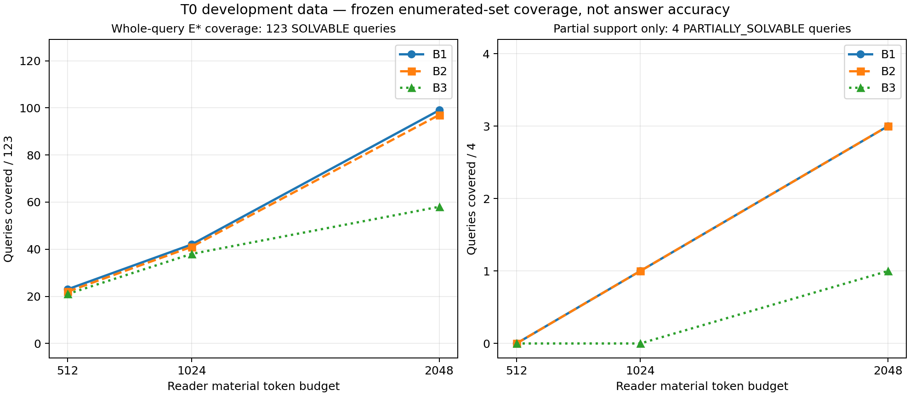

# v13.4 T0 结果与 Simplify 收口

2026-10-03（Asia/Shanghai）。**本轮按计划的条件退出路径收口：G1 未通过，决定 Simplify。** 已完成只读入口、共同基线、真实 query-free 形成、32个开发历史的128题/256次Reader、方法盲评分、断点分析及本地复核包。没有建立跨历史重复出现、需要复杂关系消歧选源器解决的机制，因此不准入T1、T2、T3。该决定不证明简单方法解决所有问题，也不否定其他来源上的H1。

执行分支为`feat/lab-correction-evidence-v13-4-20261003`，基点`2319401bc0c6f29142cdf139a09b22576c0da1c5`。完整517行原计划及原48项要求字节保留。原要求状态仍为**4限定通过／27部分／1未通过／16未验证**；原E0未通过、D4未准入、Product **NO_GO**。本地收口没有发布或合并远端。历史检查点中的零查询、未准入、评分进行中是当时状态；本报告和[最终结果](../data/manifests/v13-4-t0-final-results.json)给出本轮终态。

## 实际执行与验证

N1复用单一MemoryService、Source/版本守卫、统一账本和一次Reader，新增行为均为opt-in。正文按完整单元装包，实际HTTP消息、材料hash、读取回执和bank终态逐项核对。80项入口受影响测试通过；最终B1/B2/B3的136项受影响测试、35项独立工程窄测、7组真实tokenizer控制、ruff/mypy/依赖边界及七模块wheel/sdist字节核对通过。工程代理复核属于同一开发团队，不是独立语义Judge。

N1的R0/R1共8次构造诊断保留：R0核心4/4但观察日期误归因3/4；R1核心3/4、日期误归因1/4且引入范围泛化。R1未采用，T0固定共同R0 Reader，未围绕自然结果调提示。

自然问题出现前完成64次真实Writer形成：7份通过结构/逐字quote校验、55份quote不逐字、2份JSON无效，57份整份unknown。未修输出、未重试；通过结构不等于语义正确，失败率也不是T1预测信号结论。96份Source形成4,650个无损片段、60条公开结构关系及215个共同cue；另4条公开关系记录unknown。215个cue含160条原生日期和55条Writer线索，没有effective-date cue。公开错误节号、原文不一致、TBD均保留。

T0固定Q0、K32、seg384、Reader材料2048 tokens，B1/B2各128次；全部256槽HTTP 200、无重试、无新增unknown费用，32个bank的Source/fact摘要不变。另有128×3×3=1,152个离线选择组合，不能称为模型样本。B2有113/128次回退B1；B3仅离线曲线，B4仅有限世界EC²/HEC的210项精确算术控制，自然共享结果模型缺失。M、自然B4、FullArchive与近邻原生系统未运行。

评分在方法解盲前冻结：Root主读64条，同族代理主读64与128条，32条交叉utility初始一致；Root复核非满分及实质疑点并保存原评分和裁定。它是单人开发语义审查，不是独立标注者、独立Judge或第二模型家族。冻结后未改变方法、gold或效用评分。

## 分题型效用与相同输入

采用逐题预冻结的0／0.5／1语义效用。四类各32题/臂；不合成未经定义的总准确率。括号为满分／半分／零分的数量。

| 问题类型 | B1平均效用 | B2平均效用 | B2−B1 |
| --- | ---: | ---: | ---: |
| 当前要求 | 0.812500（25／2／5） | 0.812500（25／2／5） | 0 |
| 陈述历史 | 0.890625（28／1／3） | 0.890625（28／1／3） | 0 |
| 追溯适用 | 0.843750（24／6／2） | 0.859375（25／5／2） | +0.015625 |
| 跨范围 | 0.937500（29／2／1） | 0.890625（27／3／2） | −0.046875 |

128配对中123对实际消息及材料相同：24对答案字节相同，98对字节不同而utility相同，1对B2高0.5。另5对输入不同，3平、2对B2下降（RFC7970、RFC9204的跨范围题）。追溯题唯一正差来自相同输入，不能归因于selector。temperature=0仍出现输出差异；保留实际答案，不重试挑选。

全256条评分记录为211个1、22个0.5、23个0。无依据确定性的限定审查记录为true5／false212／unknown39；Reader过度拒答为true0／false244／unknown12。unknown包括附加日期/事实及拒答时实际充分性的未决判断，不能把true0写成“无过拒答”，也不能把这些旗标视为全面事实性审计。普通技术错误另记material_error；档案可解却未回答影响utility，但不自动证明Reader在其实际材料下无理由拒答。分可解性、题型的完整分母见最终JSON。

## 覆盖、预算与最早断点

123题SOLVABLE，4题PARTIALLY_SOLVABLE，1题ARCHIVE_INSUFFICIENT。123个可解题的K池均包含已枚举E*，且均有相同公开完整单元联合render后≤2048的见证（最小/中位/最大240／565／1723 tokens）。这是可行见证，不是贪心装包成功或穷尽所有子集的证明。五个非全可解题的全题覆盖N/A；四个部分可解题单独计部分支持。

| 选择器 | 512：全题／123 | 1024：全题／123 | 2048：全题／123 | 2048：部分支持／4 |
| --- | ---: | ---: | ---: | ---: |
| B1 Chain-RAG | 23 | 42 | 99 | 3 |
| B2 Temporal-RAG | 22 | 41 | 97 | 3 |
| B3 Slot-Retrieve（离线） | 21 | 38 | 58 | 1 |

E*为经语义审查的非穷尽集合族。未命中保留`NO_ENUMERATED_SET_COVERED`，不能自动称语义漏证。RFC8824等存在未枚举替代材料、RFC9562等可能通过普通位运算推理作答；这些仅在探索性备忘录讨论，不回填gold、不提高原覆盖数字。

按256个实际回答对应的最早已证明断点：189条未发现断点；50条为计划/装包层的已枚举集合未覆盖；7条为完整充分证据已送达后的Reader解释错误；10条对应档案部分可解或不足。不是256个独立历史，也不是四类失败率。50个装包病例覆盖26题/13历史：26病例出现整组自身超2048，24病例出现先前组占用后的估计成本超2048，2病例有部分交叠单元未覆盖剩余区间；机械类别可重叠。公开关系边缺失/unknown单列，不自动构成关系消歧机制。

7条Reader病例涉及4题/3历史：RFC9605的3条回答误解编码counter与原整数；RFC9115的2条回答额外提出错误反斜杠倍增；RFC8345的2条回答把SHOULD强化成无条件前提。Root已查看实际送达原文与答案。它们不能作为复杂选源器的价值证据。RFC7940的来源见证冲突没有足够档案证据恢复出版/修改时间线，不能凭猜测补成可解的潜在关系任务。

## G1与研究主张

[预注册](../data/manifests/v13-4-t0-analysis-preregistration.json)要求至少两种来源兼容关系解释导出不同答案约束，档案存在同K/同预算的消歧证据，并在不止一个可区别历史上保留明确机制。普通检索、原子组装包、公开边缺失、技术推理和Reader已获充分证据后的错误分别排除。当前审查没有建立满足全部条件的重复案例，故[G1决定](../data/manifests/v13-4-g1-decision.json)为`NOT_PASSED_SCOPED / SIMPLIFY`。

| 项目 | 本轮结论 |
| --- | --- |
| G0-Read | 本冻结入口限定通过；不是G0-Integrate或一般安全证明 |
| G1 / H1 | 本cohort不足以建立所需关系消歧机制；Simplify，不作全局H1否定 |
| G2 / H2 | T1未准入，真实/shuffle/oracle预测信号未检验 |
| G3 / H3 | 同信息自然B4/M交叉对照未运行，无独立算法贡献主张 |
| G4 | 正式未见来源、区间、非劣、独立评审及外部证据未齐；研究论文验收未通过 |
| N6 | 本轮统计、负结果、主张边界、本地复核及条件退出交付完成 |

保留opt-in只读入口和B1作为当前简单研究方案。已观察的改进方向限于公开出处、原子组大小/次序、普通Reader解释和形成quote可靠性；本轮不再据已曝光结果修改方法后复测。备选新反证维护仍只保留条件研究卡，不扩建平台。T1/T2/T3、Q1/预测器、shuffle/oracle/消融、第二家族、公开迁移的状态为未运行/未验证，条件退出不把这些要求变成通过。

## 来源依赖、许可与统计限制

先冻结39个元数据来源组再读正文，按预登记顺序替换4个浅层候选，104份原件及回执均保留；本轮实际32 RFC+64勘误。32个RFC不等于32个独立来源，四类问题各32也不等于“明确／单源／互补／不足各8历史”配额满足。本批只有规范/勘误工作流，不支持个人对话、独立工作流或自然关系歧义发生率结论。

结果前记录的JSON/CBOR/CDDL宽依赖族包含11历史。描述性敏感性分别给32历史等权、排除该11历史后的21历史等权、以及宽族一组加另21组等权。这三种具体权重方案在汇总时指定，不能冒称逐字预注册估计器，也不证明22组独立。排除宽族后追溯差+0.023810、跨范围差−0.071429；压成一组后分别+0.022727／−0.068182；当前和历史差均仍为0。完整逐史数据保留，没有按胜负选题。没有进行正式显著性、bootstrap区间或非劣检验。

原RFC许可notice、四份pre5378限制、勘误再发布许可NOT_VERIFIED继续保留；RFC9562特定勘误的PDF/HTML适用范围不扩张到TXT。完整原文、HTTP、SQLite与评分材料仅在本地ignored目录封存。当前Git交付的代码、协议、摘要和统计图不等于完整语料公开授权。

## 完整费用与复核

| 阶段 | 真实生成请求 | known及charged tokens |
| --- | ---: | ---: |
| N1构造诊断R0+R1 | 8 | 6,012 |
| N2 query-free形成 | 64 | 115,463 |
| T0 B1/B2 Reader | 256 | 563,934 |
| v13.4合计 | **328** | **685,409** |

本轮新增embedding为0、unknown usage为0。T0 prompt524,767、completion39,167；实际材料1583–2047 tokens，prompt1721–2208。连续账本累计9,726次生成、known27,692,286、charged27,722,673，历史unknown1及30,387保守费用保留；历史embedding964,645。账本未重置。

**2048仅是Reader材料预算，选择器共同metadata为额外信息并单独计量。** 索引cue输入428,234逻辑bytes／295,447序列化tokens，投影136,981 bytes／85,494序列化tokens；不是额外provider收费，也不能与其他阶段同一产物重复相加。BM25使用全文建索引，不宣称系统未接触原文。T0准备wall160.809秒/CPU160.801秒，真实运行wall402.547秒/CPU76.594秒；覆盖评估wall14.059秒/CPU16.738秒。Reader/选择/读取的分臂嵌套时序在封存`recorded-run-costs.json`，不能简单累加。物理I/O、形成准备CPU、价格和GPU小时等未知项不填零。

复核入口：[v13_4_verify_closeout.py](../scripts/v13_4_verify_closeout.py)。在MiLAi-Lab根目录运行`python3 scripts/v13_4_verify_closeout.py`检查Git携带的hash和计数；加`--local`核对本地封存inventory。脚本无provider调用、不操作账本。它验证证据完整性及统计一致性，不冒称独立语义复现。原driver、标注/评分冻结、聚合脚本、逐史/逐题CSV和失败均在`artifacts/v13-4/`；local inventory由[N6清单](../data/manifests/v13-4-n6-closeout.json)绑定。

离线聚合验证2015个输入文件、5160条hash连接，另有10项独立复算。初次聚合误把不同输入配对也当作带答案hash的postrun记录，机械失败保留于output-r0；修正后output-r1只使用实际答案绑定，不改科学输入。早期盲导出工具的失败终态/请求臂校验修正、metadata tuple/list误报等原失败也保留。复核本批证据无需重跑真实Reader，不覆盖冻结gold、答案或费用。
