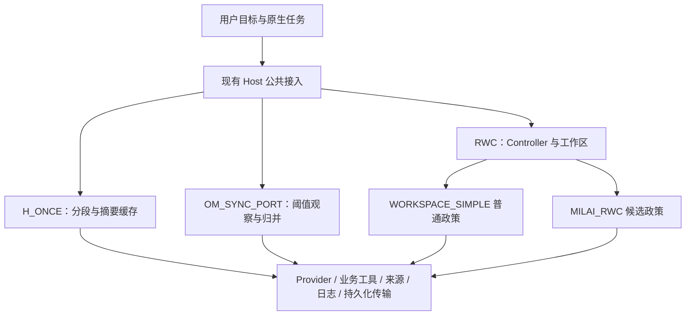
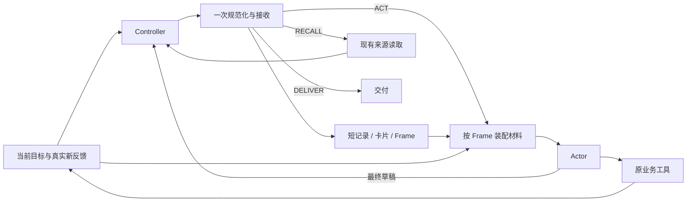

# MiLAi Host 记忆调控：可用性与创新开发 Goal v1.0（修订 2）

> 执行记录（2026-09-15，Asia/Shanghai）：用户后续明确授权执行本 Goal；开发、
> 公开 OM 交接、三臂有限比较和最终检查已完成，56/64次模型生成已结清，余量关闭。
> [执行结果](MILA_HOST_MEMORY_CONTROL_USABILITY_RESULTS_20260914.md)给出验收与局限。
> 下文仅生成提案、尚未开始等措辞保留原提案背景，不再代表当前执行状态。

本 Goal 将已完成的可恢复工作区原型推进为容易使用、能够持续完成任务的研究方法。本修订纳入 [基于参考方法的详细设计 v0.3][baseline-design]：保留 H_ONCE 作为已有方法底座，新增 Mastra Observational Memory 的同步移植版 OM_SYNC_PORT，以 WORKSPACE_SIMPLE 检验同结构下 RWC 的特殊政策增量。

开发重点是实现一个有明确算法的外部对照、降低 Controller 使用接口的负担，让依据修订实际影响选材、下一步动作和交付。MemR³、ACE 指导控制与更新设计，不接成新的运行系统。方法开发与少量行为检查相伴进行，工程测试围绕实际改动安排。

**优先级：任务可用性 → 主循环简单清楚 → 创新联系有效 → 必要验证 → 扩大实验。** 不以增加防御分支、测试数量、文档数量或调用次数作为进展。

本次仅交付这份详细 Goal。以下均为后续开发设计，未实施、未启动测试或模型实验。已有修复 Goal 保持完成状态，已关闭的实验额度不重新启用；本文提出的资源上限只是后续执行建议。

## 1. 起点：继承已完成能力，解决已观察到的问题

依据 [参考方法设计 v0.3][baseline-design]、[架构 v0.2][architecture]、[开发规划 v1.0][plan]、[修复结果][repair-results] 和 [当前使用说明][guide]。实现起点为 `milai-rwc-v0.2`，终端适配器为 `hiagent-method-adapter-v0.4.2`。

| 当前事实 | 本 Goal 的开发判断 |
| --- | --- |
| 独立卡片、Frame、ACT / RECALL / DELIVER、材料去重、本地与公开恢复已实现 | 继续现有方法，集中修改影响使用的路径，不重新搭建同类框架 |
| H_ONCE 已实际运行段摘要与缓存；EVIDENCE_1 与普通 INCREMENTAL 同原生结果、同调用数，多 215 tokens | 维护通道已有运行证据，特殊政策未显示额外价值；新开发必须说明更新怎样改变消费和行动，不能只换记录措辞 |
| 当前会话已有 H_ONCE、WORKSPACE_SIMPLE、MILAI_RWC 入口，尚无 OM_SYNC_PORT 分支 | 只新增一个外部方法，不将设计文档中的 OM 当作现有实现 |
| v0.2 的 16 次 Controller 返回有 9 次被拒绝；全部历史尝试为 17 次、10 次拒绝 | 首先降低输出合同负担，区分可机械兼容的格式问题与不能猜测的语义错误 |
| 四条原生尝试均未自然出现 RECALL 或分支返回 | 回读接线已有证据，模型自主利用及收益仍需观察；不能将未出现机会算作能力失败 |
| 数据合并任务的一次同版本配对双方 reward 1、均为 3/3；候选少 1 次生成、少 1,573 tokens | 只支持该次开发观察，尚不支持稳定净收益或默认启用候选 |
| 四条尝试合计 41 次生成、135,952 tokens；取消任务没有有效配对评分 | 后续减少无效控制和重复尝试，保留未评分、跨版本与真实失败的区别 |
| 公开恢复最终通过，但使用脚本模型回调，模型 HTTP 为 0 | 持久化接线可复用，不能据此声称真实模型已善用恢复记忆 |
| 最终回归 4573 通过、1 项可选依赖跳过；最长单测约 42 分钟，期间发生重复验证 | 长回归从开发反馈循环中移出，交付前集中运行；不在代码尚未稳定时反复启动 |

历史原生配对使用适配器 v0.4.0；最终 v0.4.2 的增量由恢复检查和邻近测试覆盖。引用历史成绩时保留这一版本区别，不把历史全部结果归到未来新版本。

H_ONCE 和 EVIDENCE 的历史判断见 [依据维护发现结果][evidence-results]。该结果不能替代新版本的同期方法比较。当前 `HiAgentTerminalSession.checkpoint_data()` 只接受 `WorkspaceControlHost` 类方法；“复用 checkpoint”是复用传输与接入能力，OM 的方法快照和会话分派仍需开发。

## 2. 目标与完成口径

### 2.1 使用者应获得的行为

使用者从现有入口选择 H_ONCE、OM_SYNC_PORT、WORKSPACE_SIMPLE 或 MILAI_RWC，给出任务和已有环境即可开始。Host 完成各方法需要的编号、反馈接续和调用记账；使用者无需维护协议字段、手工修补 Controller JSON 或准备“认知状态”才能推进任务。OM 的阈值及输出预留由配置提供可用默认值，不要求使用者为每项任务重新设计。

普通工具失败能够成为下一步工作的真实反馈；控制记录为空、没有值得保存的卡片、没有回读机会，都属于正常运行。遇到需要用户处理的实际问题时，说明发生了什么、任务保留在哪里、还能继续做什么。

### 2.2 开发完成与创新结论分开

开发完成要求：H_ONCE 保持可用，OM 同步移植具备完整维护、消费、回读和交接路径，RWC 四项创新接入同一方法，相关改动得到必要验证。留下 RWC 连续工作和 OM 实际维护的短片段，并按第 10 节完成方法层与政策层的有限比较。比较允许打平、失败或用尽额度；若出现明确的通用接线缺陷，应完成可行修复再交付，不能用“收益未证明”掩盖不可用实现。

创新结论按实际行为分别说明“已接入”“机械路径已验证”“真实使用已观察”“局部有帮助”“尚未观察到机会”或“当前不支持收益”。这些是报告用语，不新增运行时状态机。开发完成不要求四项创新分别胜出；工程全绿也不自动产生创新结论。

## 3. 范围与架构决策

### 3.1 方法对照与政策对照分别回答问题

| 定位 | 方法 | 保留的运行机制 | 本轮处理 |
| --- | --- | --- | --- |
| 已有方法底座 | H_ONCE，本地 HiAgent 移植加缓存 | 子目标分段、闭合段摘要、当前段详情、按需展开 | 保留现有实现与名称，核对接入差异，不重做移植 |
| 新增外部方法对照 | OM_SYNC_PORT，Mastra OM 同步机制移植 | 近期原文、观察日志、阈值维护、必要归并、续接提示、来源范围回读 | 新增一个独立方法；不导入完整 Mastra 服务栈 |
| 同结构简单对照 | WORKSPACE_SIMPLE | 与 RWC 相同的 Controller、卡片、Frame、回读与交付能力 | 与候选同步改进接口与效率，使用普通维护政策 |
| 完整候选 | MILAI_RWC | 依据修订、候选保留、可逆采用、工作安排与有界交付相联系 | 在现有对象和路由中实现 N1–N4 |

方法层比较 H_ONCE / OM_SYNC_PORT 与完整 RWC，回答整个方法是否值得；政策层比较 WORKSPACE_SIMPLE 与 MILAI_RWC，回答特殊规则是否有增量。外部方法的调度、输入组织和角色数可以不同，同结构政策对照必须相同。

HiAgent 的分段、摘要与轨迹回读是方法依据；本地缓存与适配变化继续写入差异说明，不将 H_ONCE 成绩称为原论文原样复现。[HiAgent 论文](https://arxiv.org/html/2408.09559v1)

Mastra 官方机制包含观察与归并、近期消息及来源回读；API 还提供 currentTask / suggestedResponse。因此“维护者提供续接建议”本身不作为 MiLAi 的创新主张。[Mastra OM 说明](https://mastra.ai/docs/memory/observational-memory)、[OM API](https://mastra.ai/reference/memory/observational-memory)

MemR³ 仅作为证据—缺口驱动路由的参考，其搜索型 retrieve 不等于读取已知句柄的 RECALL；不照搬禁止重读或到限即充分的解释。ACE 仅借鉴条目级维护和确定地应用增量，不引入整套 Generator / Reflector / Curator。AgentFold 保留为后续训练与融合参考，不假定普通提示已复现其训练能力。[MemR³](https://arxiv.org/html/2512.20237v1)、[ACE](https://arxiv.org/html/2510.04618v1)、[AgentFold](https://arxiv.org/html/2510.24699v1)

### 3.2 基础设施共享，方法调度独立

共用现有目标绑定、Provider、业务执行器、合法来源、日志、账本与持久化传输。按选择的方法进入对应维护和输入装配；每条轨迹只有一个活动方法。OM 不挂 RWC Controller，RWC 不额外串联 Observer、Reflector 或 Curator。



RWC 内部继续采用一个串行 Host，同一模型承担 Controller、Actor 和必要摘要。Host 是唯一工作区写入者；Controller 提议记忆与工作安排，Actor 执行业务动作，真实反馈进入下一轮。



| 组件 | 本轮承担的职责 | 代码落点 |
| --- | --- | --- |
| Host 主循环 | 生命周期、反馈位置、路由、预算、工作区更新 | `src/milai_lab/methods/controlled_workspace.py` |
| OM 方法 | 观察组、近期原文、阈值调度、归并及范围回读；独立于 RWC 调度 | 按需要新增 `src/milai_lab/methods/observational_memory_port.py` |
| 输入接收 | 在模型边界补默认值，再做一次必要校验；内部使用规范化结果 | 优先在同一文件中增加小函数，不先建通用解码框架 |
| 记忆与投影 | 短记录、独立卡片、Frame、唯一材料区、已有摘要缓存 | 继续现有数据结构与装配器 |
| 政策 | 普通政策与四项创新组合，共用接口和 Actor | `configs/policies/workspace_control/` |
| OM 政策 | Observer、Reflector 与 Actor 的记忆使用说明；不带 RWC 特殊规则 | 拟新增 `configs/policies/observational_memory/`，仅保留方法实际需要的文件 |
| 会话适配 | 一致的方法入口、首步、反馈和恢复接线 | `tools/hiagent_terminal_session.py` |
| Provider 与原生执行 | 同一模型配置、真实工具、全角色成本、已有 verifier | 现有 Provider、Harbor 适配器及 `tools/run_workspace_native.py` |
| 持久化 | 复用已完成的公开 Working State 适配 | `tools/workspace_checkpoint.py`，仅在新改动确实影响它时修改 |

`WORKSPACE_SIMPLE` 与 `MILAI_RWC` 必须共享 RWC 能力、默认参数和兼容处理。两者主要差异是 Controller 政策；不能通过削弱普通政策、禁止它回读或改变 Actor，制造候选优势。H_ONCE 与 OM 则保留本身的维护时机，不能为复用类而强迫每批反馈调用 Controller。

Evidence 记录观察和来源，HOST_WORKING 保存可错的工作认知，Canonical 仍走独立治理；Context 是有界投影。Runtime continuation 仅管理机械读取位置，不存语义结论或代模型决定重新采用路线。

本轮不增加图数据库、知识真值状态图、语义依赖 DSL、多 Agent 讨论、自动训练、提示搜索平台、独立 Judge、后台记忆服务或新的 benchmark runner。Lab 不接管 Runtime 语义，不直接写产品 canonical 表。

### 3.3 OM_SYNC_PORT 的最小状态与维护算法

以下是本地移植设计，沿用 v0.3 的同步、单任务、文本和无向量库范围；不宣称已完成 Mastra 产品复现。

```text
ObservationMemory
    groups                 当前观察日志及 Host 分配的入口
    raw_tail               尚未由成功观察替代的事件/消息范围
    continuation_hints     currentTask / suggestedResponse，可错的续接提示
    covered_ranges         已实际处理的范围，非“已理解”的语义标记

ObservationGroup
    text                   自由文本观察
    source_ranges          原始事件身份、版本及实际区间
    revision               Host 管理的内容版本
```

原始消息由现有来源注册表保存。模型不生成真实文件权限或自行扩张覆盖范围；Host 按实际发送给维护模型的完整消息组或页面建立映射。观察正文与程序管理的来源定位分开，避免增加一套必须由模型填满的元数据协议。

```text
接收真实目标变更、消息或工具结果：
    追加原始事件与 raw_tail；保留消息和动作结果之间的关系

下一次 Actor 前：
    按当前配置估算各输入区占用
    若 raw_tail 达观察阈值：
        选择可处理的较早完整消息组，保留近期窗口
        Observer(当前观察日志 + 本批实际消息)
        成功接收后保存新观察与来源范围，推进对应覆盖位置
        只有已覆盖旧正文退出自动展开
    若观察日志达归并阈值：
        Reflector(当前观察日志及本次必要的续接内容)
        成功后替换当前日志视图，保留来源回读入口
    组装当前任务 + 观察日志 + 续接提示 + 近期原文 + 实际回读结果
    Actor 沿原业务执行器推进任务或交付

Actor 请求历史细节：
    读取已公布且当前合法的来源范围
    真实结果回到普通上下文；不额外进入 RWC Controller
```

未到阈值时只有正常 Actor 工作，不强制生成观察；归并替换当前日志，不逐版追加 Reflector 的旧输出。反复装配同一批输入不重复观察，恢复后已覆盖范围不重新付费整理。

Observer 返回不可用时不推进覆盖、不删除 raw_tail；Reflector 失败保留旧日志。用量已知且输入容量允许时，沿原内容继续任务，不追加格式修复模型。输入确实放不下时使用现有分页与明确的未呈现标记；仍无法容纳必要输入时报告容量限制，不隐式删消息或循环重试维护。

归并后的观察需要保留原来源关系：能确定映射时按组保留；只有整批映射时保留参与归并范围的并集，并标明只能粗粒度回读。不能把模型未输出某条细节解释为对应来源可以删除，也不声称日志中的每句话已经得到来源验证。

### 3.4 OM 输入、续接提示与容量配置

独立 OM baseline 保留选定配置中的 currentTask 和 suggestedResponse，并让 Actor 实际看到。RWC 的当前工作安排仍只有 Frame，不同时注入一份 OM 响应建议。上游 API 明确提供关闭建议以避免控制流竞争的选项。[OM continuationHints](https://mastra.ai/reference/memory/observational-memory)

续接提示由本轮既有 Observer / Reflector 输出承载，首版不额外调用模型抽取提示。若实际选用的上游实现会产生额外抽取请求，明确移植差异或将这些请求如实记账，不隐藏成本。提示过期时不能覆盖新的真实用户目标。

阈值在选定模型配置下确定一次，并记录在运行清单中，不直接照搬上游数字、不逐题调到必然触发。至少满足：

```text
当前任务与工具合同 + 观察日志 + 近期原文 + 回读材料
    + 本次角色输出预留 <= 当前模型可发送容量
```

Observer 和 Reflector 自己的输入也须满足容量，不只核对 Actor。沿用已有 tokenizer/容量估算；来源字符偏移与 token 阈值分开，不能混用单位。阈值是触发点，大工具结果仍按完整交互组及必要分页处理。

近期窗口优先保留尚未呈现给 Actor 的真实新反馈及相关动作。观察覆盖位置与 Actor 实际接收位置分别记录；第一页不能代表整条事件已处理。短任务未触发观察或归并完全合法；定向触发的开发检查单独标识，不混入自然使用结论。

### 3.5 保存与恢复：共用传输，不套用 RWC 状态

OM 快照保存方法与政策配置、观察组、raw_tail、续接提示、覆盖及各接收方位置、来源定位和既有调用账务。采用与任务绑定的原始来源存储；恢复前不能只取得观察摘要而失去原文读取能力。

在会话层扩展明确的方法导出/恢复分派，复用 `tools/workspace_checkpoint.py` 的公开传输、CAS 和载体容量处理；OM 状态不伪装成 RWC cards / Frame，也不为通过现有类型检查继承 RWC 调度。公开载体包含明确方法标识，旧 RWC 载体继续可读，不修改产品公开 Schema。

恢复顺序为：当前目标与绑定 → 读取快照和合法来源 → 核对未结业务动作 → 恢复未处理范围 → 按该方法的生命周期继续。OM 仅因恢复不强制调用 Observer，RWC 保留既有恢复控制机会；两者都不能重放旧业务动作或沿用已结束目标的 final。

新增 OM 载体时做一次针对其状态的公开保存与恢复检查，复用现有入口和隔离环境，不重新建设服务测试框架。H_ONCE 的旧执行能力继续保留，本 Goal 不顺带重建其所有公开恢复路径；未验证的入口明确标注，不一概宣称四种方法均已支持相同 checkpoint。

## 4. P0：先让 Controller 接口容易使用

### 4.1 模型可以只表达有变化的部分

当前 `_accept` 要求多个对象字段集合完全相等，缺少未使用字段也可能拒绝整份提议。新接收方式保留已有 JSON 对象和路由名称，允许省略无变化、无用途的字段。旧的完整输出仍然可用。

以下是拟议的规范化规则，不是当前版本已支持的接口：

| 输入情况 | 明确处理 |
| --- | --- |
| `workspace_update` 缺省或为 `null` | 保留现有记录与卡片 |
| 更新对象省略 `working_note`、`put_cards`、`retire_cards` | 分别按“保留原记录”、空列表、空列表处理 |
| `frame` 缺省或为 `null` | 保留当前目标下的 Frame；新目标没有可用 Frame 时使用 Host 的初始工作安排 |
| Frame 只给出部分字段 | 未提供字段保留；空 `selected_refs` 明确表示清空选择 |
| `dispatch` 缺省 | 默认为 ACT；已提供 dispatch 却没有合法 kind 时，不猜测意图 |
| ACT 带有 refs、delivery 或读取范围 | 忽略不适用于 ACT 的附带字段，不执行读取、不采信交付文本 |
| RECALL 省略 start / length | 使用现有分页默认值；必须有已公布、可读的目标引用 |
| DELIVER 省略 delivery 或给出 `null` | 接受当前待复核草稿；没有草稿时仍拒绝 DELIVER |
| 新卡片省略 handle / source_refs | 分别按 Host 分配 ID、空来源引用处理；不据空引用声称有证据支持 |
| 选择列表重复同一合法引用 | 保持顺序去重，不视为新的语义错误 |
| 多出不参与合同的说明字段 | 不消费该字段，不把它映射为工具动作、权限或新状态 |

最小合法提议如下，表示保持现有内容并继续 ACT，不表示接受最终草稿：

```json
{}
```

只改变当前工作安排可以是：

```json
{"frame":{"intent":"根据刚收到的执行结果推进当前任务"}}
```

只更新一张新卡片可以是：

```json
{"workspace_update":{"put_cards":[{"text":"保留另一条路线的入口，当前先完成正在进行的工作"}]}}
```

示例只说明拟议接口的省略语义，不是向实际任务注入固定思维内容。新卡片由 Host 立即公布到下一次可见目录；不为了获得编号再增加一轮模型调用。

新卡片当轮不能通过模型自造的未公布 handle 被选择，可先引用已有来源。首版不增加响应内临时 ID 协议。关注引用与披露依赖分别管理，省略 source_refs 不消除已有派生内容的披露依赖。

### 4.2 不猜测引用，不靠额外模型修格式

模型边界只接收可确定解析的单个 JSON 对象。复用当前 Provider 的 JSON 输出能力；若已有能力支持约束输出，可在同一接口内使用，但不把建设 decoder 专项列为本 Goal 前置条件。

不从损坏、截断或混有多个候选的文本中猜测业务动作。不存在的 `card:N` 不自动当成新卡片，不按文字相似度寻找来源，不替模型编造有效引用。

规范化后，对类型、合法引用、必要容量、当前目标和路由条件做一次校验。实质性错误仍使整份工作区提议不提交；保留旧工作区和原始新反馈，沿现有 ACT 路径继续。首版不增加逐字段部分提交及其依赖排序。

不自动增加“请修复上一份 JSON”的模型请求。拒绝或规范化原因保留一个简短事件，下一输入只呈现有助于修正的问题，不反复回放异常堆栈和完整合同。

### 4.3 接收率改善需要区分原因

将真实返回分成“直接可用”“规范化后可用”“拒绝后继续”三类，并另看其是否实际更新记录、选材或调度。空提议和 ACT 降级不能统计为成功的创新使用。

先对历史返回离线检查一次：哪些拒绝能由确定的默认值消除，哪些仍是未知句柄或非法交付。验证引用时使用当时的已公布来源和卡片；无法复原完整状态时，只报告格式层结果。离线接收改善不冒称新模型已经学会输出。

## 5. P0/P1：让主循环简单、稳定地推进任务

### 5.1 保持一条明确的执行路径

本节针对 RWC，不把其生命周期套给 H_ONCE 或 OM。新目标、首次运行、真实新反馈、真实回读、恢复和最终草稿触发既有 Controller 生命周期。同一批事件仅维护一次；重复装配已有输入不调用模型。重复文字来自不同真实执行时，仍保留独立事件身份。

无新反馈、无新路由需求时复用当前工作安排。无内容变化不重写整份卡片集合，也不仅因接收一个空提议就推进内容 revision；维护事件编号、输入覆盖位置与内容 revision 各自沿用其用途。

Frame 表达下一步目的和要看的材料，不机械生成命令。Actor 可继续使用原有工具能力，原始新反馈始终可见。首步 subgoal 继续由 Host 在缺省时建立，Controller 或 Actor 不承担编号接线工作。

Controller 输入包含独立的当前目标、真实新反馈、当前记录、使用中的卡片、Frame 与有界来源目录。Controller 与 Actor 都保留浏览未选来源的入口，不能只读自己上次选中的内容；复用已接入的目录和读取能力，不为此新建检索平台。工作区作为可错数据进入上下文，Actor 可以依据真实材料否定其建议。

### 5.2 只压缩确实重复的维护工作

复用现有 H_ONCE 来源/政策身份与摘要缓存逻辑；源段没有变化时不重新摘要。Controller 返回无变化时，不制造摘要任务。先减少重复正文、重复维护和大段格式说明，再考虑缩小输出上限。RWC 不同时叠加 OM 观察链；长记录确需归并时，复用已有摘要并替代相同内容的重复维护。

保留“一批新反馈一次 Controller”的默认语义，不预先建设语义触发器或多种自动调度模式。若完整组合的实际账单显示某类调用长期没有贡献，再提出一个具体的合并或延迟方案，两种政策同时采用，并用一个局部片段检查。

### 5.3 容量问题以继续工作为目标

继续现有唯一材料区、受保护新反馈、可选旧正文和分页入口。卡片正文只在实际需要时展开；退出焦点不删除卡片或来源。普通目录优先呈现未归档条目，归档条目通过明确的历史入口可读，避免旧条目占满默认视图。

先处理真实输入暴露的容量阻塞，不为假设的大规模文档增加排队系统。若受保护反馈确实超出可发送容量，沿已有原始来源分页，并明确保留尚未呈现的位置；不能仅因发送了第一页就把全部反馈记为已读，也不能用摘要替代原始新反馈后宣称未丢失。此项扩展由实际复现触发，不提前重写正常装配路径。

### 5.4 业务失败与未知副作用分开

工具返回明确终态的非零退出、断言失败或其他业务错误，是可交给模型继续处理的反馈。若现有适配器把这类已知结果一律提升为 Host 终止，应在接入层修复。

超时是否可继续取决于工具的终态合同：已有可用接口明确确认进程结束及结果时，可以继续分析；不知道动作是否仍在执行、是否已经提交时，保留原有停止与核对路径。不能仅凭异常名称或输出文字推断可重试，也不重发未知写入。没有可靠核对接口时，清楚报告局部限制，不扩建通用恢复平台。

## 6. 减少防御性编程的具体约束

| 位置 | 保留的必要处理 | 本轮应合并、删除或避免新增的处理 |
| --- | --- | --- |
| 模型输出入口 | 一次规范化，一次引用与路由校验，明确降级 | 每个内部函数重复检查全部 JSON 字段；未使用字段缺省导致拒绝；修格式模型循环 |
| Host 内部对象 | 清楚的数据类型、局部不变量、单写者原子更新 | 反复 dict → JSON → dict；每层重算绑定与来源全集；用新状态枚举包装简单分支 |
| 工作区更新 | 校验完成后一次提交；错误不留下半张卡片 | 无变化也深拷贝整段历史；同一内容更新多套镜像；为简单替换开发通用事务语言 |
| 快照交接 | 在保存、恢复边界切断可变对象共享；校验外来快照 | 每个只读 getter 和每个内部调用都复制整份快照 |
| 来源读取与公开恢复 | 当前可披露性、任务绑定、必要 CAS 与未知提交处理 | 已验证的内部数据逐层重复证明；每次普通模型步重建产品环境或重新验 pin |
| 异常处理 | 外部错误在接入层解释；保留真实失败定位 | 大范围吞异常后标成功；同一异常被多层包装成不同错误码 |
| 开发证据 | 现有日志、实际版本、一个紧凑结果 | 为每次修改新建全仓哈希闭包、重复清单、证书文件或完整环境副本 |

减少防御性代码以可观察的冗余为依据，不按行数配额删除。尤其保留已修复的 checkpoint 副本隔离、新目标恢复时清除旧结束状态、未知业务动作不重放、全角色预算和来源披露边界。

这些处理集中在实际入口和状态转换处。来源权限可能变化，不能因为上一次读取成功就永远跳过之后的必要检查；内部结构重复校验与动态权限核对应分别处理。

## 7. 四项创新如何引入与测试

四项创新继续作为同一 `MILAI_RWC` 政策中的协作能力。先使组合可用，再对没有发生作用的联系做局部检查；不为每一项建立独立 Agent、运行框架或先胜出才能继续的关卡。

### 7.1 N1：依据范围维护与局部修订

**引入位置：** Controller 更新工作记录与卡片。使用简短自然语言保留“观察了什么、适用于哪个版本或条件、仍有什么不确定”，内容按任务需要选择，不要求每条记录填固定表格。

**动作联系：** 新反馈影响一部分判断时，优先修订该部分；基础前提被推翻时允许撤回或重建整份工作判断，不以“改得少”作为奖励。下一 Frame 指向实际受影响的问题。既有验证仍支持的工作继续保留，代码或条件已经改变的结论不得无条件沿用。

**小检查：** 从已有工程任务中选择一次真实局部修改或真实反证，观察接下来的动作与交付描述。检查它是否保留无关已完成工作、是否避免把局部测试扩大为整体结论，以及是否真的改变了需要调查的范围。

**判读：** 只在记录里出现“适用范围”不算收益；需要看到少做了无关重查、纠正了错误沿用，或准确收窄了交付。没有实际依赖变化时，不强造失败以触发修订。

### 7.2 N2：候选、当前焦点与采信分离

**引入位置：** 现有独立卡片和 Frame。替代线索可先保留，只有与当前问题有关的材料进入主要正文；选中材料表示需要阅读，不表示已确认正确。

**动作联系：** 尚未证明正确或有用的线索也可以暂存，保存不自动要求调查、展开或采信。Actor 继续当前最有用的工作。反证作为原始新反馈直接进入输入，不能因为没有被 Frame 选中而消失。

**小检查：** 真实任务出现线索或替代方向时，查看是否能保留入口并继续当前工作；不先要求两个方案均可行，也不强制生成多个方案。无需为所有线索建卡；检查的是后续是否少被无关旧材料牵引，以及有需要时是否还能找回依据。

**判读：** 卡片数、文本丰富度和输入字符下降分别只是结构或成本现象。没有行为改变时，缩短表达、修正投影联系或删掉低价值记录，不继续加栏目。

### 7.3 N3：可逆返回与恢复后的重新判断

**引入位置：** 卡片文本保留暂离原因、关键来源和下一步入口；复用 RECALL → Controller → Actor 以及现有 checkpoint 恢复。

**动作联系：** 相关条件改变后，先结合当前可见证据重新评估；必要历史细节缺失时才回读，需要知道当前世界时由 Actor 使用原业务工具核对。阻塞消失只意味着值得重新评估，不自动使旧结论或旧动作重新生效。

| 当前需要 | 应采取的操作 |
| --- | --- |
| 依据已可见，能够判断当前适用性 | 直接重新判断，不增加读取 |
| 只剩摘要，缺少过去的关键细节 | RECALL 合法原始来源及必要范围 |
| 需要知道进程、文件或环境现在的状态 | 使用已有业务工具查询，旧回执不能替代当前状态 |

历史回读、当前世界查询、重新采用路线分别记录，不把 RECALL 次数当作返回质量；旧路线重新可行也不意味着它是当前最佳选择。

**小检查：** 优先寻找真实轨迹已有的返回机会。必要时以已保存的合法任务检查点做一个短续接，观察怎样重新判断、是否确有缺失信息、必要时取回或查询了什么，以及是否减少重建。若只有使用者明确要求返回，标为“显式返回”；脚本指定 RECALL 标为机械接线；两者都不冒称自主发现。

**判读：** 看是否基于当时可得的证据重新判断，并影响后续动作或停止沿用；无需额外读取的合理返回同样有效。需要回读时再核实真实读取链路。没有自然返回机会时记为“未观察到机会”，不报 0% 成功率，也不无限换题搜寻有利样例。公开字节恢复继续引用对应方法的已完成验证；真实模型利用恢复的证据另列。

### 7.4 N4：不确定性进入工作安排与有界交付

**引入位置：** Frame 和现有最终草稿复核。让影响当前目标的重要缺口成为下一步工作的目的，或者明确成为交付范围中的限制。

**动作联系：** 根据现有证据选择一次有价值的行动、收窄结论或直接交付。默认每个目标版本最多一次专门交付复核，修改草稿不重置额度；不再添加独立 Judge。

**小检查：** 在真实任务的最终草稿处，检查实际交付是否区分已实现、已执行、已验证与未覆盖内容；已有检查足够且代码未变时，是否直接交付。必要的测试必须能说明会影响哪一个具体判断。

**判读：** 少一次无关测试、补一个直接影响目标的检查、或收窄一项无依据承诺，都可以是局部价值。反复列风险、重复全量测试或通过角色互相确认来延迟交付，视为需要删减的负担。

## 8. 开发顺序与可交付切片

所有工作包当前均为未开始。沿一条主线连续开发，已明确且局部可修复的问题直接处理，不为每个函数、提示修改和正常检查重新生成 Goal。

| 切片 | 具体工作 | 本包完成时应能看到 | 最小反馈方式 |
| --- | --- | --- | --- |
| A：继承与方法配置 | 核对既有 H_ONCE 接入、RWC 拒绝原因和 OM 参照配置；扩展显式方法选择 | 三类方法各自的维护方式与代码落点明确，旧入口保持可用 | 一次离线读取和受影响入口检查，不重跑历史模型轨迹 |
| B：OM 同步移植 | 实现第 3.3–3.4 节观察、归并、续接提示、范围回读和输入替换；接入全角色账本 | 一个不依赖 RWC Controller 的完整外部参照 | 少量机械用例，加一段真实 Observer → 投影 → Actor / 回读过程 |
| C：RWC 可用主循环 | 实现第 4 节稀疏更新与统一接收；检查首步、无变化和已知业务失败继续 | 无需手工补协议的 Controller → Actor → 真实反馈 → 后续动作或交付；至少一个有内容的有效更新 | 受影响邻近检查，加一个短真实片段，不能只测试 `{}` |
| D：创新组合接入 | 精简共同合同，将 N1–N4 接到实际记录、选材、重新判断和交付 | 四项能力在同一方法中可用；能说明一次依据变化如何影响下一步 | 复用已有机械路径；仅为尚未解释的问题做聚焦续接 |
| E：交接、有限比较与收敛 | 接通 OM 快照；保持 RWC 恢复；完成第 10 节两层比较；删重复处理并集中做交接检查 | 开始、继续、保存、恢复的实际用法；真实结果、完整成本和限制 | 一次受影响公开恢复检查，少量原生轨迹，最终代码稳定后集中检查 |

建议先做 A，再优先完成 C 的可用主循环，随后交替推进 B 和 D，最后在 E 收敛。B 的来源载体可与 E 逐步接通，不要求按字母顺序逐项结束后才进入下一项。

切片 A 只记录一个选定的 OM 上游版本或提交、用到的文件/文档、许可及关键本地差异；复用已有记录，不另建上游复现平台。正式实现时核对同步触发、输出接收、续接提示和来源映射，不必部署全部 Mastra。若仅按文档机制完成移植，明确标为机制移植，不写逐路径复现。

C 和 B 的真实片段不能推迟到全部测试、公开服务和报告准备完成后。D 不等待每项创新单独胜出，OM 也不必先赢 RWC 才允许集成。E 发现工程缺陷时回到相应文件修复；仅政策无收益时诚实记录并保留简单选择，不默认启动下一轮矩阵。

## 9. 测试策略：按影响范围，验证关键行为

### 9.1 不同改动采用不同检查

| 改动类型 | 开发过程中需要做 | 不需要随这类改动重复做 |
| --- | --- | --- |
| 文档、Goal、注释 | 人工核对内容、引用与真实状态 | pytest、mypy、build、模型调用 |
| Controller 文字政策 | 检查共同接口是否匹配；有行为疑问时用一个短模型片段 | 整仓回归、公开 API 生命周期、打包验证 |
| 新增 OM 维护与投影 | 检查未触发和一次触发、成功后替换原文、来源可回读及真实角色记账 | 所有阈值组合、大规模长历史矩阵、完整 Mastra 环境 |
| 接收默认值、小型内部重构 | 相关既有用例，必要时补一个真实回归问题；检查改动文件的 lint | 所有异常组合穷举、无关历史长测试 |
| 主循环、投影、反馈位置 | 涉及的成功路径和一个直接风险场景；核心类型变化时运行相关静态检查 | 为每个内部方法增加一组镜像测试 |
| 来源、checkpoint 或公开适配合同 | 运行受影响边界测试；实际公开行为变化时安排一次现有生命周期验证 | 为纯政策修改重复创建 API/PostgreSQL 环境 |
| 形成可交付代码版 | 集中执行仓库要求的 boundary、pytest、ruff、mypy、build | 通过后无新变化再跑同一批检查 |

当前 [AGENTS.md][agents] 要求代码交接前完成整仓检查，本 Goal 将其集中到 E 的最终代码版一次完成。开发过程中不把整仓通过设为每个切片的前置条件；纯文档和纯政策迭代采用上表对应检查。若终态代码仍未完成必需检查，明确说明实际覆盖范围，不写“完整回归通过”。

### 9.2 只围绕关键行为复用或补测

1. **普通任务能前进。** 最小或省略字段的提议能够进入 Actor；无卡片和无变化合法；首步标签不阻塞工具。
2. **规范化不会伪造语义。** 未知句柄、无草稿 DELIVER 等仍不会生效，失败提议不留下部分更新；旧工作区与新反馈可继续使用。
3. **记录与选材真的进入下一步。** 未触及卡片保留、材料不重复展开、原始反证直达 Actor；RECALL 回来后没有吞掉未呈现反馈。
4. **交付能结束。** 草稿可被接受或修订；继续工作不重置复核额度；没有为填满次数而追加测试。
5. **交接延续原任务。** 检查 OM 新快照保留日志、tail、范围与账务；相关 RWC 代码改变时重点复查快照独立性、未处理反馈和新目标清除旧 final。旧公开证据不替代新增 OM 载体验证。
6. **实际外部边界不被破坏。** 涉及相应路径时检查来源不可读、未知用量和未知动作不重放；普通已知业务失败仍可继续。
7. **OM 保持自己的算法。** 未到阈值不维护；一次观察成功后旧正文退出、近期交互仍在；一次归并后来源可读、提示可见。失败不推进覆盖；恢复不重复观察；全过程没有 RWC Controller 或额外未记账抽取器。

优先扩展 `tests/unit/test_controlled_workspace.py`、`test_hiagent_provider.py` 和必要的 `test_workspace_checkpoint.py` 中已有用例。OM 专属行为可集中在一个邻近测试文件，用少量完整场景覆盖，不按内部对象拆出多套测试。上述是行为分组，已有用例能覆盖时直接复用。

同结构两政策的能力一致性检查保留一处即可。H_ONCE、OM 和 RWC 的调度差异是应保留的行为，不测试成角色次数相等。不要为每个政策重复全部 Host 异常排列，不测试私有实现形状，不为没有实际损失路径的可逆小调整编造负面场景。

### 9.3 长回归的安排

先完成代码、政策及确有必要的打包配置修改，再启动最终长回归。依赖业务恢复路径的快检查应先完成，避免长测试运行后才发现普通接线错误。

已经通过的检查，其相关代码与配置没有变化时，保留结果；晚期局部修复重跑受影响集合。使用现有版本及运行记录说明覆盖关系，不为证明“没有变化”再建设全仓证据审计系统，也不把不同代码版本的数字直接相加。

约 42 分钟的历史长测试不进入日常修提示、改默认值的循环。若它发现历史固定依赖漂移，定位为相应兼容性问题；不要覆写历史 pin、弱化断言或重跑无关模型实验来凑通过。后续若确需调整默认测试集合，应同时说明测试覆盖和交接要求的变化，不能静默跳过后声称整仓通过。

### 9.4 不建设本轮用不到的测试设施

不新增随机模糊测试平台、完整故障注入矩阵、所有状态组合覆盖、提示词快照墙、自动裁判服务或全 benchmark 批调度。必要的新测试直接证明本次修复的可观察行为；不能只复述实现中的条件表达式。

## 10. 真实模型检查、两层比较与资源建议

### 10.1 先看到方法过程，再做有限整体比较

RWC 首次真实片段优先检查切片 C：Controller 输出能否直接使用，是否存在有内容的有效更新，Actor 是否执行正常业务动作，真实结果是否影响下一步。已完成的纯机械问题不再付费重跑。

OM 用一个短片段检查实际 Observer 输出、输入替换、续接提示和下一 Actor 的消费，必要时查看来源回读。Reflector 的接线可以先用可控响应验证；自然轨迹没有触发归并时如实标注。使用调低阈值或较长合法历史定向触发时，标为功能检查，不能当默认配置的自然收益。

创新聚焦续接只在具体联系仍不清楚时使用剩余片段额度，尽量从同一片段观察多个机制，不给 N1–N4 各分一轮实验。没有返回机会不自动加题；没有收益也不自动多采样直到成功。

整体比较先用一项环境已可用的原生任务。`multi-source-data-merger` 可作为已暴露的开发任务复用，不能称为独立确认集。`cancel-async-tasks` 只在既有终端问题已定位且确有新检查目的时再用；环境仍不通的任务不消耗模型额度反复试。短任务未达 OM 阈值时保留真实结果，不为产生观察而修改该次比较配置。

默认在同一冻结版本、同一任务起点运行 MILAI_RWC、WORKSPACE_SIMPLE、OM_SYNC_PORT 各一次。合格的同一条 RWC 轨迹同时用于两层对照，三条轨迹回答两个问题；两组比较共享候选样本，不能算两份独立任务证据。

H_ONCE 保留可选入口与历史结果，本轮不强制追加第四条同题轨迹。若当前问题必须由 H_ONCE 回答，才在剩余资源允许且理由明确时增加同期对照，或收缩其他尚未启动的诊断工作。没有同期合格运行就不声称新 RWC 已优于 H_ONCE；历史结果只作为背景。

不把新增跨任务迁移、四机制消融或六臂比较列为本 Goal 完成条件。不要求每个任务同时运行全部方法，也不要求各方法使用相同的维护频率或实际输入长度。

### 10.2 两层比较分别保持什么一致

| 比较层 | 对照 | 共同条件 | 允许不同的部分 | 可以支持的判断 |
| --- | --- | --- | --- | --- |
| 方法层 | OM_SYNC_PORT / H_ONCE 与完整 MILAI_RWC | 任务初态、模型能力、业务工具、合法来源范围、上下文容量及前瞻确定的整体资源限制 | 各方法的维护时机、输入组织、角色结构、记忆工具说明和真实开销 | 本地方法的端到端质量与成本差异 |
| 政策层 | WORKSPACE_SIMPLE 与 MILAI_RWC | 同一 Host 代码、Actor、触发时机、接口、默认值、窗口、卡片/回读/交付能力、Provider 和预算 | Controller 的普通政策与候选政策 | 同结构中的特殊认知规则增量 |

各轨迹使用独立业务环境，从相同任务状态开始，避免前一条的副作用帮助后一条。模型、阈值、角色输出上限、政策与代码在比较开始前固定；本地方法移植差异写清楚，不强求所有方法的 Actor 记忆协议逐字相同。修订版本后不能拼接成同版本胜出。

局部续接优先采用双方共有的任务事件前缀。若前缀含某一政策已生成的记忆，写明来源；这种比较只能说明该起点之后的消费差异，不能用于完整生命周期胜负。不得给任何一方放入未来反馈、标准答案或人工理想卡片。

只使用原生 verifier 评价原生结果。额外行为判断从实际请求、返回、工具动作和交付中阅读，不另花模型调用让 Judge 评价“是否体现创新”。

### 10.3 建议的有限调用上限

由于新增一个 OM 方法对照，原 Goal 的 48 次建议范围改为最多 64 次：增加的是一条 OM 整体轨迹，保留少量功能片段，不展开四方法全任务矩阵。执行时接入现有统一账本；这只是修订后的计划建议，本文不分配或开放额度。

| 用途 | 建议上限 |
| --- | ---: |
| RWC 连续工作及必要的聚焦检查 | 6 次生成 |
| OM 实际维护与消费片段 | 6 次生成 |
| 同一任务的 RWC / SIMPLE / OM 整体运行 | 每方法 16 次生成，共 48 次 |
| 已定位工程修复的短复查余量 | 4 次生成 |
| 合计 | 最多 64 次生成 |

总生成按唯一请求累计：Actor + Controller + Observer + Reflector / 摘要 + 其他实际生成；复核计入所属 Controller 请求一次，不重复记账。失败、重试、额外抽取或格式处理一旦实际调用模型都占用额度，不把一个 Host 步骤等同一次生成。允许在尚未执行的诊断用途之间调整剩余额度，不能给已运行到限的候选临时追加单边资源。

实际需要更少时立即结束，不为用完额度填满运行位置；可用同一已记录片段同时回答多个检查问题。既有 H_ONCE 不因“保留为基线”自动获得额外模型分配。仅剩少量额度时，不开启注定无法完成且没有局部检查价值的轨迹。

该配置针对短开发任务；若选定任务明显不适配，应在运行前改变任务或前瞻确定双方共同上限，不在候选耗尽后单独补额度。到限未完成按真实终态报告，不能伪造 reward。未知用量沿已有规则停止发新请求，旧修复 Goal 剩余的 215 次不承接到这里。

沿用当前可用模型与 Provider，同一模型承担各方法需要的角色，不为本 Goal 另换模型、调整共享 GPU 或部署第二服务。产品接口实验只在实际需要时复用隔离环境与既有 pin 验证；普通模型片段不依赖重新运行公开持久化验证。

## 11. 效果与效率如何判读

| 维度 | 需要记录的事实 | 不能据此推导的结论 |
| --- | --- | --- |
| 任务可用性 | 是否连续执行；卡在哪一步；是否需要人工修协议；是否交付或明确报告未完成 | 一次 ACT 降级不代表 Controller 已成功工作 |
| 接口可用性 | 直接可用 / 规范化后可用 / 拒绝继续，各自原因 | 接收率上升不自动说明记忆有效 |
| 方法实际运行 | H_ONCE 摘要时机；OM 观察/归并触发、正文替换、提示与回读；RWC 控制与消费过程 | 一份 OM 提示词或短任务没有触发，不能分别冒称完整移植或方法失败 |
| N1–N4 使用 | 原反馈 → 记录或 Frame 变化 → 读取或动作 → 结果 | 字段存在、卡片增多、自然语言自报不等于使用证据 |
| 任务效果 | 原生 reward、实际完成范围、未评分原因 | 子测试数不能当独立任务数；无评分不能填成 reward 0 |
| 运行成本 | 全角色调用、实际 tokens、工具耗时和任务墙钟时间 | 字符减少不能直接当 token 减少；少一步不能直接称统计显著 |
| 开发效率 | 本轮检查总耗时、最长等待、重复运行及其触发改动 | 测试数量多、清单更齐全不代表更有效率 |

可用性最低要求是一段真实连续工作不依赖人工补齐模型协议；历史能确定兼容的格式问题由新规则覆盖。若下一段真实输出仍主要因接口形式失败，优先缩短接口和提示，不继续叠加创新说明。

一次同版本配对只用于开发判断。候选若在同等完成度下增加了大量维护而没有动作价值，应缩短或关闭低价值政策；普通同结构方法继续可选。候选若局部有帮助，指出具体链路和代价，不分摊成四项创新都成立。

分段、摘要、原文回读、续接提示、证据缺口和条目级更新均有直接先行方法。本轮只检验“新反馈如何改变既有依据对当前选择的影响，并落实到工作集与下一步”的具体差异。OM 已足够时保留简单方法；若候选形成的记录有价值，而普通消费政策即可打平，优先保留有用的形成规则，删除无增量的消费规则。

稳定前缀和稀疏更新只创造缓存条件；只有真实 Provider 命中与计费信息才能报告缓存费用收益。输入字符、实际 tokens、缓存折扣和价格分别表述，没有费率不计算金额。

重复命令只有在没有条件变化、没有新增检查目的时才算无效重复。减少测试以保留任务正确性为前提；直接检查已改变的行为是必要工作，重复检查未变且已有有效证据的部分才是主要削减对象。

## 12. 开发效率约束与收缩规则

1. **一次只修一个明确的阻碍。** 开始时只核对本 Goal 涉及的文件与最新证据，不再全面考古已完成架构。
2. **正常路径先跑通。** 先让最小输入、一个真实动作、下一轮反馈能够工作，再处理实际暴露的边角问题。
3. **小改动集中做邻近检查。** 同一局部修改期间合并验证，检查通过后继续开发；不因修改了说明文字重跑耗时回归。
4. **每项新增复杂度说明用途。** 一个检查、配置、缓存或抽象必须对应已观察的问题或本 Goal 的实际数据流；没有具体用途就不加入。
5. **不给一般语义失败增加阻断流程。** 明确、局部、可逆的工程修复直接推进；一个无收益片段不使整个架构开发重新准入。
6. **同一失败没有新解释时停止采样。** 先用已有日志定位；只有代码、政策或输入条件发生有理由的变化，才运行下一次针对性检查。
7. **保留最少的交接材料。** 更新现有使用说明，写一个紧凑结果；不为每个阶段复制 Goal、创建重复导航或保存整份源码环境。

原生模型调用是实验成本，开发者阅读、实现与测试耗时是开发成本，两者分别记录。测试优化本身不扩张成新的大型工程项目。

## 13. 后续代码交付物与验收

后续实施新增一个小型 OM 方法模块及必要政策，继续修改 RWC Host、共同合同和候选政策，并接通既有会话、原生运行入口及 OM 快照。Provider 仅补真实新增角色的请求配置和记账；公开传输与测试配置只改受影响部分，不把目录表当全面重构要求。

代码交付包含：保留的 H_ONCE、可运行的 OM 同步移植、同结构两政策、实际入口及开始/继续/保存/恢复示例、受影响检查的真实结果、一份按两层对照说明原生结果与完整成本的紧凑总结。OM 采用的上游版本、许可和移植差异写在同一份说明中，不复制多份交接材料。原始模型与工具日志继续放在仓库外的现有 evidence 区，仓库内只保留必要摘要与引用。

本 Goal 后续完成条件：

- [x] H_ONCE 保持原有维护方式和可选入口；历史本地移植结果不冒称上游原样复现。
- [x] OM_SYNC_PORT 完成观察组、近期原文、阈值观察、归并、续接提示、范围回读及实际输入替换；没有挂接 RWC Controller。
- [x] OM 方法快照与会话分派已接通，通过其受影响的保存与恢复检查；未复查的方法能力不被一并宣称。
- [x] 可省略无变化字段，Controller 不再依赖冗长完整模板才能推进任务；未知引用和非法交付没有被猜测性修补。
- [x] 最小输入、无卡片、无变化、明确终态的业务失败均能按设计继续；当前目标和原始反馈不丢失。
- [x] N1–N4 接入同一方法，支持必要时整体重建、未证实线索暂存、先重新判断且按需回读、有界交付；分别说明真实观察和未出现的机会。
- [x] WORKSPACE_SIMPLE 与 MILAI_RWC 共享能力和使用便利性，候选不通过额外工具或额外额度获得优势。
- [x] RWC 与 OM 均有真实方法片段；完成一次方法层与一次政策层的有限比较，能复用的同一 RWC 轨迹不重复运行，保留失败、额度终态及共享样本限制。
- [x] 已删除或合并本轮发现的重复校验、重复维护或无效说明；必要的真实外部边界保持有效。
- [x] 按改动完成邻近检查和适用的最终交接检查，结果与最终版本对应，没有重复刷 PASS。
- [x] 使用说明足够开始、继续、保存和恢复任务；研究收益按实际证据表述，未证明收益不默认推广候选。

**当前执行状态：`COMPLETE`。以上完成项以执行结果中的真实检查为依据；N1–N4 的增量收益未证明，不将功能完成写成研究优势。其他 Goal 的历史终态保持原记录。**

## 14. 依据与阅读顺序

1. [基于参考方法的详细设计 v0.3][baseline-design]：本修订的基线选择、OM 算法、N1–N4 调整与两层比较依据。
2. [修复开发结果][repair-results] 与 [依据维护发现结果][evidence-results]：当前实现、原生失败、已有负结果和实际测试开销。
3. [当前使用说明][guide]：已存在入口、方法合同、容量和恢复限制。
4. [详细架构 v0.2][architecture] 与 [开发规划 v1.0][plan]：对象、来源、投影、交付及完整首版的原始设计。
5. [已完成修复 Goal][repair-goal]：本轮继承的工程工作及已关闭范围。

本次已读取仓库内完整 v0.3 设计，并核对当前会话方法选择与 checkpoint 接入。外部核对包含 Mastra OM 说明与 API、HiAgent 方法描述、MemR³ 路由约束及仓库说明、ACE 方法及其合并函数；没有完成上游版本冻结或本地复现。

Mastra 的同步配置可关闭异步缓冲，retrieval 支持不依赖向量库的浏览；实际移植的源码版本和完整性在切片 A 记录。[OM 文档](https://mastra.ai/docs/memory/observational-memory)、[OM API](https://mastra.ai/reference/memory/observational-memory)

MemR³ 原链接当前重定向到 `mbzuai-ai4bio/memr3`，README 同时列出 RAG 与 Zep。ACE 本次读取的 `apply_curator_operations()` 仍实现 ADD，UPDATE / MERGE / DELETE 等列为 TODO；这仅描述该函数，不据此否定整个 ACE 方法的修订能力。[MemR³ 仓库](https://github.com/mbzuai-ai4bio/memr3)、[ACE 合并函数](https://github.com/ace-agent/ace/blob/main/playbook_utils.py)

这些外部页面和 main 路径是本次阅读来源，不是已经固定的实验制品。本文不将 v0.3 设计中前次未取得的核心源码写成已经逐路径核验；只为后续采用的 OM 路径补必要阅读，不接入所有参考系统。

本修订新增 OM 范围与两层对照，修正 N1、N2、N3 的偏强约束，并将建议模型上限从 48 调整为 64。缺省字段合同、OM 实现和新的检查安排仍是下一版本提案；实际实现差异届时记录，历史结果不追溯改写。

[baseline-design]: MILA_BASELINE_DERIVED_HOST_MEMORY_DESIGN_v0.3_20260914.md
[evidence-results]: MILA_HIAGENT_EVIDENCE_MAINTENANCE_DISCOVERY_RESULTS_20260914.md
[architecture]: ../../docs/archive/MILA_HOST_MEMORY_CONTROL_ARCHITECTURE_v0.2_20260914.md
[plan]: ../../docs/archive/MILA_HOST_MEMORY_CONTROL_DEVELOPMENT_PLAN_v1.0_20260914.md
[repair-results]: MILA_HOST_MEMORY_CONTROL_REPAIR_RESULTS_20260914.md
[repair-goal]: MILA_HOST_MEMORY_CONTROL_REPAIR_GOAL_v1.0_20260914.md
[guide]: ../../docs/HOST_REVERSIBLE_WORKSPACE.md
[agents]: ../../AGENTS.md
