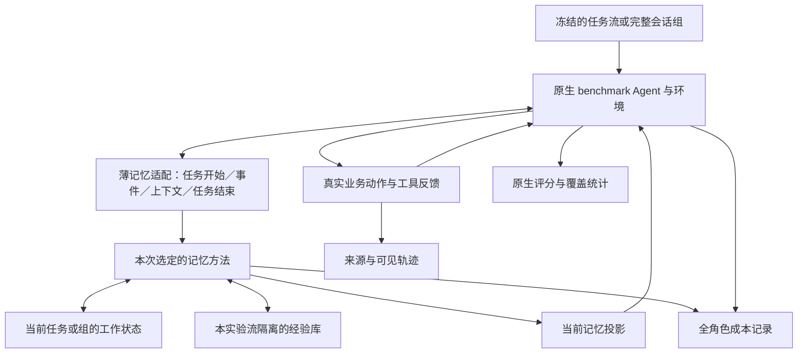

# MiLAi：ReasoningBank 底座、经验修订与跨任务／多会话验证 Goal v1.0

> **2026-09-16 用户暂停：** 已执行“暂停当前实验，生成实验开发总结报告，打包给我”。
> 驱动器、worker 与自动接续进程均停止。完整研究未完成；后续实验、SIGCONT、重启或恢复批次
> 必须等待用户新的明确恢复指令。见[暂停开发总结](MILA_EXPERIMENT_DEVELOPMENT_SUMMARY_PAUSED_20260916.md)。
> 本次仅做本地汇总与打包，无新增模型调用；下方原“继续执行”是暂停前的计划记录。

> 当前执行调整（2026-09-15）：用户明确要求“只使用这一个模型即可，先不要使用别的”。
> 本轮只使用已验证的 Qwen3.6-35B-A3B-FP8；第二求解模型的下载、部署和评价均暂缓，
> 不作为本轮验收条件，也不主张跨模型证据。原设计中的模型二设置保留为后续计划。
> DB F/O、OS F/O、旅行完整组 G、四主方法及必要贡献/资源比较继续执行。
> 当前已完成来源、数据、原生环境与四方法 DEV 接入，v0.3／v0.4 VALID 已完成并选定 v0.4；DB／OS 支持银行已形成，其正式评价与旅行支持流并行；
> [执行清单](../../data/manifests/reasoningbank-transfer-20260915.json)记录实际进度与用户范围调整。
> 实际冻结正确历史参考为 DB20／OS49（完整来源簇选择），共69项；原文20／20是目标规模。
> 2026-09-16 更新：[DB 主比较及正确历史参考](MILA_REASONINGBANK_DB_RESULTS_20260916.md)已结束，共820项原生记录；
> OS正式评价与旅行SUPPORT随后由用户暂停，完整研究尚未结束。
> 下文“尚未实施/仅文档”的原记录属于方案编写阶段。

**总目标：完整接入可核查的 ReasoningBank 基础方法，在真实连续工作中实现经验适用范围的修订，并用预先分离的任务集合、两个执行域、多会话任务组和第二模型判断方法价值。**

本 Goal 接续已经完成的 Adaptive Memory v0.1。首版功能优先的要求继续有效：保留已有能力，先完成参考方法和候选的完整运行链，再据实际代价优化。下一阶段主要研究对象改为经验形成、再次使用与纠正；`multi-source-data-merger` 退回使用回归。

**本文是新的完整工作方案，尚未实施。** 本次核对文档、相关源码与官方资料，更新项目入口，并按用户提供的样例核对 embedding／reranker 接口各一次；未修改方法代码，未安装 benchmark 环境、下载任务语料或启动任务实验。两次接口请求单独记录于 §4.5，新增文本生成为 0。建议规模不等于已分配额度，旧实验、旧结果和关闭余额不重新开启。

## 1. 事实起点与本次改变

### 1.1 继承已经完成的工程和已经结束的实验

依据[首版实验报告][report]、[开发结果][results]与[运行清单][old-manifest]：

| 层面 | 已确认事实 | 对新 Goal 的含义 |
| --- | --- | --- |
| 工程 | Adaptive Memory v0.1、适配器 v0.7；观察／归并、条目修订、Frame、回读、复核、公开保存恢复已实现 | 复用能力，不重建 Host 或记忆平台 |
| 工程验收 | 4,628 passed / 1 skipped；公开 SDK 跨进程检查、静态检查与构建通过 | 历史版本的验收，不抵扣未来改动的必要检查 |
| 真实使用 | OM／Adaptive SIMPLE／CANDIDATE 均 reward 1；3／4／4 次生成；15,421／35,629／30,083 tokens | 一个已暴露短任务的质量与成本观察 |
| 机制机会 | 三臂均未 OBSERVE、COMPACT、REVISE，未形成观察组；两次 Adaptive REVIEW 被拒绝后降级交付 | 没有测到经验形成与后续使用，也没有测到自然修订收益 |
| 局部诊断 | 原提示与附加提醒均合法 DELIVER，没有新增行为价值 | 不继续把 REVIEW 提示修订作为主要研究路线 |
| 账务 | 合计 13 次生成、103,103 tokens 已结算，余量关闭 | 不承接旧 98／192 等额度作为新研究预算 |

**OM 在上轮胜出的是该短任务的轻量运行路径。** 它没有在该轮通过观察、归并或长期经验使用取得已证实收益。工程完成、能够交付、记忆机制有机会运行、方法优于对手，分别报告。

### 1.2 对旧规划的明确修订

本文件接替[首版 Goal][old-goal]中尚未启动的后续研究安排，并细化[总设计][master]的跨任务部分。旧首版已经完成的范围及负结果保持不变。

| 旧安排中的限制 | 本 Goal 的决定 |
| --- | --- |
| 主要在一个短终端题中寻找局部信号 | 主研究改为 LifelongAgentBench DB／OS 与 MemoryArena 完整旅行组 |
| 主要比较内部 SIMPLE／CANDIDATE | 主表包含原生 Agent／历史、OM、ReasoningBank、MiLAi 增量 |
| 跨任务和第二来源等首题出现收益后启动 | 未调试 DB、OS、外部多会话与第二模型进入本轮必交范围 |
| 从空 State 做完任务即关闭 | 显式支持任务内工作状态、任务流经验库两种生命周期 |
| 少量诊断后即可关闭整个研究 | 可以关闭一个候选迭代；不能据此把未执行的研究覆盖标成完成 |

这些改变不要求重写已经工作的 RWC／Adaptive，也不要求把已有 N1–N4 能力删掉。既有 `H_ONCE`、RWC、Adaptive 两政策保留历史名称与入口；本次新增方法使用独立名称。

## 2. 必须回答的问题与最终交付

| 问题 | 主比较／证据 | 必须避免的替代指标 |
| --- | --- | --- |
| Q1：完整方法是否值得？ | 原生简单方法、OM、RB、MiLAi 在同一任务集合上的质量与全成本 | 更多 final、更多卡片、更多测试通过数 |
| Q2：经验能否帮助后续新任务？ | 支持集形成后冻结的经验库，对未参与形成的任务评价 | 将测试题继续写入银行后称为固定库泛化 |
| Q3：在线更新是否有效？ | 独立任务流中先完成当前任务，再更新，和同顺序对照比较 | 仅比较前半程与后半程分数 |
| Q4：历史工作能否支持依赖会话？ | MemoryArena 完整组，保留前序人员、计划与约束依赖 | 把各参与者当作独立样本，或独立重置每个会话 |
| Q5：新增修订操作是否必要？ | RB 对 MiLAi；正常修订对只追加；同一记忆的普通消费 | 单看某次动作变化或模型自称用了经验 |
| Q6：规则是否跨域、跨模型适用？ | 锁定核心政策后运行 OS 与第二模型 | 逐题改提示后汇总最好结果 |

最后交付四项：

1. **可信的参考实现**：官方来源、固定版本、原提示与必要差异可核对，完整基础 RB 运行链可用。
2. **具体的 MiLAi 增量**：经验在使用中形成当前依据；真实反馈能够修订其适用范围，修订实际进入后续输入。
3. **预先分离的研究集合**：开发、版本选择、支持集、未调试评价、独立任务流、完整会话组及第二模型配置。
4. **完整结果与贡献报告**：四类主方法的分域质量、配对差异、成本、失败覆盖、机制证据及适用边界。

允许最终结论为无收益、收益不足以抵偿成本，或仅保留一个修订规则。**研究完成由既定问题和覆盖是否得到结果决定，不由是否产生阳性决定。**

## 3. 官方资料与本次源码核对

### 3.1 已读取的依据

| 对象 | 本次阅读范围 | 本次固定状态／缺口 |
| --- | --- | --- |
| ReasoningBank | 论文 v1 方法、官方仓库 README、SWE-Bench `run.sh` | 官方完整 checkout 未成功；核心提取／检索源码尚未逐项固定和审阅，列入 W0；用户指定本地检索采用 bge-m3 |
| LifelongAgentBench | 论文 v3、官方 README、文件树、DB／OS task、`PreviousSampleUtilizationCallback` | 仓库 commit `d6f19b42eb358d9150379f0c68c2985c5a867520`；部分入口文件获取失败；未装环境或取得任务集 |
| MemoryArena | 论文 v1、README、setup、旅行 runner／Agent／环境／评分器，仓库内 ReasoningBank 适配 | commit `6cd9de14b71915e39ac742a20dc33785e14b6aab`；未下载航班文件与完整任务数据，未本地运行 |
| Mastra OM | 官方研究设置；对照本地 `OMConfig` 和现有实现入口 | 外部成绩与本地移植不同；未重新冻结完整 Mastra 源码 |
| Evo-Memory／ReMem | 论文 v2 的 Think／Act／Refine 方法及官方实现检索 | 尚未核实作者认可且可接入的官方实现；同名项目不能替代来源证明 |

本次仅取得仓库元数据和选择的源码，没有打开拟留作未调试评价的任务正文或答案。commit 固定不代表数据、依赖、模型或运行结果已经固定。临时下载路径不是正式研究产物；实施时将来源散列与必要差异写入版本清单，源码和大语料保留在 Git 外。

### 3.2 三个会直接影响实验解释的源码事实

**LifelongAgentBench 原生回放带有正确性筛选。** `PreviousSampleUtilizationCallback.on_task_complete()` 仅收集 `CORRECT` 且 `COMPLETED` 的 Session，再在新任务中回放有限数量历史。这是强简单方法，但其选择利用了评测结果；不能把它与无标签的 RB 自判混称为相同反馈条件。[官方回放源码][la-replay]

**MemoryArena 的 `none` 有前序计划。** `prepare_for_person()` 对无 memory system 路径启用 `include_previous_plans`，保留基础人员和累计计划。主对照必须保留这项能力。[旅行 runner][ma-run]、[旅行 Agent][ma-agent]

**传给函数的 reward 不等于写进记忆的 reward。** runner 把 reward 传给 `build_memory_entry()`；当前函数实际保存查询、轨迹、最终计划及可选 `judgement`，没有序列化 reward。`judgement_mode=hint/answer` 会引入答案相关提示；主设置显式使用 `none`，评分答案留在 evaluator 一侧。不能仅凭 runner 的实参断言标准 reward 已泄露给 RB。[旅行 Agent][ma-agent]、[旅行环境][ma-env]

另有一项计分注意：旅行 `evaluate()` 使用标准答案组与提交组的交集，并遍历已提交人员。因此需要按冻结清单核对完整覆盖，原始输出和补充覆盖统计一同保留；不能漏掉失败组后仍把结果称为完整样本成绩。[旅行评分源码][ma-eval]

## 4. 方法设置与基线可信度

### 4.1 四类主方法

| 方法标识（拟议） | 主职责 | 运行选择 |
| --- | --- | --- |
| `NATIVE_AGENT_OR_HISTORY` | 原生求解和原生普通历史 | DB／OS 使用 standard 原生 Agent；旅行使用 `none` 的前序计划路径 |
| `OM_SYNC_PORT` | 阈值观察、归并、近期原文、来源回读 | 复用现有独立算法，通过薄适配接到原生 Agent |
| `REASONINGBANK_BASE_PORT` | 检索经验、原生求解、自判、成功／失败提炼、追加经验 | 本轮唯一新增完整外部方法；bge-m3 本地检索配置，不含 MaTTS |
| `MILAI_EXPERIENCE_REVISION` | 在 RB 基础上维护当前采用范围并修订正在使用的旧经验 | 与 RB 共用检索、提炼底座及原生 Actor；新增调用全部计入 |

DB／OS 的官方正确轨迹回放另以 `NATIVE_REPLAY_VERIFIED` 保留和报告：至少在预定的 DB 20 项、OS 20 项未调试子集上运行，任务从主集合中事先选定。它是额外的强参考，不是新记忆系统。单列其评测结果筛选能力，禁止把跨反馈条件的差值解释为纯算法增量。

主四臂使用相同可见业务反馈，不接受隐藏正确答案或正确性筛选。若要研究有原生结果反馈的在线方法，另列 `NATIVE_RESULT_FEEDBACK` 协议，对所有臂开放相同反馈；不要悄悄替换主条件。上游回放算法不为本地比较而删掉能力。

### 4.2 ReasoningBank 以哪个实现为准

首选 Google 官方基础实现。将其 SWE-Bench／mini-swe-agent 路径作为可核查来源，保留模型调用与检索算法，在 DB／OS／旅行原生 Agent 上移植记忆过程；业务任务不再跑 SWE-Bench 来代替本 Goal 的评价。

MemoryArena 自带的 `reasoningbank.py` 已实现自判、两类抽取提示、向量检索和追加存储，可用于理解接入点。它不自动等于 Google 原版：所读文件有自身的 top-k、embedding 路径、文本分块与参数。W0 必须逐项对照后决定复用，不能仅凭同名把它标为忠实复现。[MemoryArena 内置适配][ma-rb]

来源核对表至少记录：

| 部分 | 需锁定的具体内容 |
| --- | --- |
| 查询与索引 | 检索编码对象是任务查询、整条轨迹还是条目；embedding 模型、截断、归一化、top-k、排序 |
| 消费 | 原提示、记忆插入位置、一次任务中的调用时点、token 预算与历史可见性 |
| 自判 | 输入中有哪些真实轨迹；输出标签与失败处理；是否看到原生评分 |
| 提炼 | 成功／失败提示、条目解析、每轨迹数量与输出设置 |
| 更新 | 基础版本追加行为、磁盘与索引保存方式、恢复后的查询结果 |
| 成本 | Actor、自判、提炼、embedding、失败与重试分别计入 |

模型服务、消息封装和数据持久化可以按本地接口适配，必须列入差异说明。用户已提供 bge-m3 服务，本版采用它作为本地 embedding，明确命名为基础算法的本地移植，不声称未经修改的官方复现。首版不能把向量检索换成一段 LLM 提示，或删掉自判／失败经验以省调用后仍叫基础 RB。[RB 论文][rb-paper]、[官方仓库][rb-repo]

### 4.3 OM 的本地差异说明

现有 `OMConfig` 默认为观察 12,000 tokens、归并 16,000、近期 2 个事件、4,000 字符分页、65,536 上下文；这是本地配置，不是 Mastra 默认值。现有同步过程、结构化接收、页范围覆盖、失败后保留原文和来源回读继续复用。

新增原生环境适配只改变消息／工具及生命周期映射。阈值随明确模型容量设置；不因任务太短而降低到每步触发。跨任务流保留观察与近期尾部是新的作用域配置，需另记适配版本，不能追认旧任务内 OM 已经验证跨任务学习。

Mastra 官方研究在 LongMemEval 使用其指定 Actor 与 Observer／Reflector 组合；本地终端／DB／OS／旅行结果不能继承该成绩。[官方研究设置][om-research]

### 4.4 近邻与创新边界

ReMem 的主动记忆整理与 Think／Act／Refine 是直接近邻。已有工作已经覆盖经验提炼、状态控制、记忆修订；本 Goal 仅提出相对于固定 RB 底座的可测差异。正式贡献报告比较更新对象、触发位置、反馈来源、后续消费和计算成本，不用“可修改 State”主张新颖。[Evo-Memory v2][remem-paper]

H_ONCE、WORKSPACE_SIMPLE、Adaptive 两政策留作开发和历史参考，不在所有任务上增加这些臂。暂不接入 MaTTS、第二套检索平台、额外 Judge 或多个新 memory 项目。

### 4.5 用户提供的 embedding／reranker 服务

以下为拟接入配置，已做样例请求，尚未接入方法代码：

```yaml
embedding:
  endpoint: http://36.140.33.19:7861/v1/embeddings
  model: bge-m3
  encoding_format: float
  observed_dimension: 1024
  similarity: cosine
reranker:
  endpoint: http://36.140.33.19:7961/v1/rerank
  model: bge-reranker
  enabled: false
```

2026-09-15 15:09 Asia/Shanghai，使用用户原样提供的中文短文本各请求一次，没有发送项目轨迹或 benchmark 数据：

| 接口 | HTTP | 样例结果 | 服务报告用量 |
| --- | ---: | --- | ---: |
| embeddings | 200 | 1 个 1,024 维浮点向量，数值有限；本样例 L2 范数约 1 | 7 prompt／total tokens，0 completion |
| rerank | 200 | 2 个结果，原文 index 为 0／1；分数约 0.991211／0.559082 | 29 total tokens |

[接口检查记录][endpoint-check]保留请求与响应位置。**2 次推理请求、36 个服务报告 tokens，文本生成 0 次**；这是新接口检查成本，不并入首版的 13 次生成／103,103 tokens，也不是检索质量或 benchmark 成绩。

实施要求：

- RB 与候选使用同一 bge-m3 服务、相同查询／经验编码规则、归一化与初始 top-k。索引保存模型名、维度、编码规则版本及银行版本；不得与旧模型向量混用。
- 保留官方被检索对象的含义，记录对原 embedding 指令／输入封装的必要变化；不能把 BGE 替换隐去后引用官方成绩。
- reranker 接口按 `query`、`documents` 发送；响应通过 `results[].index` 绑定原候选条目和 revision，`relevance_score` 仅作排序分数，不解释成正确概率。
- 初版默认仅使用 embedding 检索，reranker 保留为可用配置。若启用，在查看确认成绩前锁定候选池大小、送排文本和输出 top-k；RB 与候选同步启用，并将结果标成“加重排的本地配置”。不能仅给候选更强检索后把收益归于修订。
- 增加重排比较时使用既定小子集和独立开销列，不为证明两个服务都用过而展开全矩阵；不开额外 embedding／reranker 部署。
- 样例只确认上述请求合同。批量输入、长文本上限、吞吐／并发、权重部署版本尚未核实；W0 在实际接入需要时核对，记录真实设置，不把短请求成功当作容量验收。

用户提供的服务身份已经确定；W0 不再重新选型 embedding／reranker，只完成来源差异、输入规模和计量接入。它们不替代 §11.4 所要求的第二个实际求解模型。

## 5. 总体架构：原生执行，方法自己的记忆过程



统一的是 Provider 接入、来源定位、公开存取和账务；不统一方法维护频率，不把所有 Agent 改写成 RWC 调度。

原生 Actor 负责业务工具和 final。记忆方法只提供可错的上下文及必要修订；不会取得业务权限或成为交付许可来源。RB 的终任务经验提炼发生在任务产物已提交之后，不为了写完经验阻止用户收到当前结果。若没有资源完成末尾提炼，保留该任务成绩与成本，记录银行没有此次更新，后续任务按实际银行继续。

候选每次只发布一个当前工作视图。经验条目、任务内卡片和可选 Frame 可以同时存在，当前行动安排只有一份。不会在 RB 前再套完整 OM，并在每次 Actor 前再跑完整 RWC Controller。

## 6. 信息对象与生命周期

### 6.1 复用既有对象

| 对象 | 建议内容 | 生命周期／保存位置 |
| --- | --- | --- |
| 真实来源 | 用户要求、工具结果、公开执行记录、来源范围 | 原生任务／组／流的合法历史；原始数据在 Git 外 |
| 工作状态 | 当前问题、依据、未决项、选中经验入口、Frame | 当前任务；依赖会话以整个原生组为工作范围 |
| 经验条目 | RB 的 title／description／content，加 Host 管理的标识、来源和 revision | 一个隔离任务流或明确支持集形成的银行 |
| 使用关系 | 当前实际发送的条目标识／版本、当前采用范围、相关反馈引用 | 任务内工作记录，关联到实际输入日志 |
| 修订记录 | 被修订条目、前一版本、新文本、来源、提交时点 | 当前工作覆盖层；在线协议允许提交到银行 |
| 运行快照 | 方法与政策版本、银行版本、流位置、事件消费位置、账务位置 | 复用已有 checkpoint／公开 Working State 能力 |

采用范围、暂缓原因和修订理由用自然语言表达；不新增强制的置信度分数、枚举推理阶段或四套认知对象。编号、版本、来源权限和机械覆盖由程序负责。首版允许自由文本条目，不要求每轮填写完整对象。

经验属于可错的 `HOST_WORKING`／研究制品；提炼成功或某题得分正确都不使其自动进入 Canonical。跨任务经验不能夹带其他实验流的私有 State。

### 6.2 隔离与继承

银行命名至少包含：`experiment / method / model / protocol / split / stream`。同一方法、同一流内按协议继承；不同方法不共享各自产生的轨迹与经验。

固定银行评价为每个独立测试任务创建临时工作覆盖层，结束后丢弃；多会话评价为每个完整组创建覆盖层，组内继承，组间清空。在线流内允许提交经验修订，流间独立。重复 seed 使用独立输出目录和银行，不能通过历史缓存悄悄串用。

公共工具数据库可以共用只读内容；可写业务状态按原生任务隔离。DB／OS 新任务有新环境时，不恢复旧任务的业务 checkpoint，只继承经验银行。旅行组内保持原生顺序依赖，不用独立环境分叉模拟不存在的工具世界。

## 7. 参考方法完整算法

以下为拟议运行映射，精确默认值在 W0 按固定官方路径补齐，不凭本文示意替换源码。

```text
任务开始：
    按 RB 规则编码当前查询，检索已有经验
    按 RB 消费规则把检索结果加入原生 Agent 的输入

原生 Agent 工作：
    使用原生动作和真实工具结果，直到完成或原生终止
    记录可见查询、动作、结果和答复

任务结束：
    原生 evaluator 记录成绩，隐藏评测字段不送入无标签记忆路径
    RB 自判器用允许的轨迹判断成功／失败
    用对应抽取政策提炼经验条目
    在协议允许写入时追加并建立索引，供下一任务检索
```

支持集银行由模型形成；不由开发者写“理想经验”。失败轨迹和自判错误保留。原生得分和 RB 自判均记录，但不能用原生得分偷偷纠正自判标签。

索引顺序、检索身份、持久化后结果一致性属于机械实现。空库、没有检索结果、没有可用新条目是合法状态，Agent 仍能正常工作。解析不成功时记录该次维护失败，保持已有银行，不能用人工补写经验冒充模型形成。

从官方基线继承的局部错误处理与必要改动写入差异说明；不为每种可能格式加一条隐式补救分支。基础方法首先完整运行，优化自判与提炼合并、缓存或调度属于后续新版本。

## 8. MiLAi 首版算法增量：正在使用的经验可以被纠正

### 8.1 首版完整操作

候选使用与 RB 相同的检索入口和 top-k 初始条件，保留任务结束时的自判与经验提炼。在其上增加下列过程：

1. **采用。** 检索到经验时，在当前任务要求与可见事实下形成一份简短工作判断：哪部分可用、哪部分仅是待核对建议。首版允许一次明确的采用维护调用；空库不强制空转。该调用和上下文成本计入候选。
2. **工作。** 原生 Actor 同时读取真实新反馈、当前工作判断和选中经验。经验不是事实权威；Actor 可以否定建议，不需要先取得 Controller 许可才能继续正常工作。
3. **提出修订。** Actor 在实际使用经验发现不一致、适用条件不明或需要回查时，使用薄适配提供的记忆修订请求。请求绑定相关条目和已经可见的反馈；程序不靠失败次数、关键词或任务 ID 自动判定经验错误。
4. **回查与修订。** 复用既有按需来源读取和条目修订能力。当前材料足够就直接修订；缺少历史细节才回读；要知道当前世界则通过原生业务工具查询。保留仍有效部分，也允许基础假设被推翻后整体改写。
5. **消费当前版本。** 下一次原生 Agent 实际输入使用更新后的条目与当前采用范围。旧版本留作历史来源，不继续以当前有效建议重复注入。
6. **结束与继承。** 原生任务照常交付。任务结束提炼新经验时，同时处理本任务已经形成的修订；固定库仅保存在临时覆盖层，在线流才提交到下一任务可见的经验银行。

首版把这条链完整接通，不先限定成“每题只允许一次修订”或“只有特定失败才可请求”。共同资源上限和原生结束规则保持有界；具体维护限额在开发成本采样后统一配置，不能按测试题调节。

### 8.2 当前工作判断不再成为第二份强制计划

候选基于现有 `MemoryView`／工作记录映射当前采用依据。需要下一步安排时使用可选 Frame；不要求生成另一套固定子目标，也不把 RB 检索结果全部展开成一张张必须维护的卡片。

首次采用调用可以给出“不需要特别安排”；后续没有修订需要时，直接执行正常业务循环。维护没有新内容时不产生内容 revision，也不消耗反馈的未维护位置。已有消费位置和维护位置继续分开。

N2／N3 的暂存、返回和回读能力保持可用，但不要求每题都出现。N4 包括依据足够时及时结束。开发不能把“先完成功能”变成“每个任务都必须运行所有功能”。

### 8.3 修订如何提交

首版复用稀疏更新：未提供条目保持原样；有效修订才推进该条目版本；新经验由 Host 分配标识。引用不合法或版本不匹配时，拒绝该次不一致提交并保留真实反馈，不根据相似名称猜条目。

把修订应用于当前活动条目，同时保存旧版本来源。默认检索同一逻辑条目的当前版本，不把原经验和相反的新经验一直作为同等当前建议返回。历史轨迹中仍可能出现旧文字，投影明确其历史身份；不能通过简单删除当前插槽假装旧记忆已从所有输入消失。

索引处理服从固定 RB 参照：若按原任务查询编码，修改条目正文不必改变检索向量；若固定实现按内容编码，则只更新受影响项的索引。首轮不同时增加重排器或新的检索算法，否则会混淆修订与检索的贡献。

### 8.4 可以验证的差异

```text
旧经验及其版本
    → 当前任务实际检索并发送该经验
    → 当前采用范围
    → 实际动作与新反馈
    → 旧经验的修订及依据
    → 后续输入收到新版本
    → 后续动作、结果与额外成本
```

这条链用公开工作记录、输入和工具日志说明，不要求读取模型内部思维。只有时间上的先后还不能证明因果；端到端对照和 §13 的最少拆解承担贡献判断。

## 9. 两个 benchmark 的接入方案

### 9.1 LifelongAgentBench：DB 主域与 OS 迁移域

论文报告 DB 与 OS 各 500 项、KG 396 项；本轮使用前两域。任务侧已有技能标签、数据加载、环境执行和结果判定，适合研究顺序工作中的技能经验。它们是构造、筛选后的交互任务，不等同于未经加工的真实工单。[论文][la-paper]

采用官方单机入口与原生 Agent／环境。先核对 `src/run_experiment.py`、原生 callback、任务构造、模型 client 的确切签名，再接任务创建、允许轨迹读取、任务结束和持久化回调；不部署分布式控制器。DB 的查询结果／状态判定、OS 的脚本执行与最终判定继续使用原生 evaluator。[官方入口][la-repo]、[DB task][la-db]、[OS task][la-os]

适配要求：

- 原生 Agent 仍输出原生 SQL／bash／结束格式；不改为终端 RWC JSON。
- 记忆回调仅取得允许的查询、历史动作和工具结果；`answer_info`、验证 SQL／脚本、隐藏标准答案不进入方法输入。
- 原生 `CORRECT` 等结果保存在评分路径；主 RB 仍运行自身自判。
- 每个任务的环境按原生逻辑重置；经验流位置可以继续，业务文件和数据库不能越界继承。
- DB／OS 配置各自记录数据版本、镜像、动作与时限、评分版本；不把 DB 和 OS 成绩合成一个平均“能力分”。

OS 的少量接口开发题只验证工具与格式连接，不用于优化认知政策。锁定政策后在 OS 支持集形成新经验再评价，回答的是**方法跨域适用**；并不自动说明 DB 经验本身能直接解决 OS 任务。

### 9.2 MemoryArena：Group Travel Planning

使用完整任务组作为运行与统计单位，保持基础人员及后续人员的原生依赖。官方设置说明有 270 组，并要求单独取得航班 CSV；当前没有本地可运行证明。[设置说明][ma-setup]、[论文][ma-paper]

沿 `run_travel.py`、`TravelPlannerAgent.prepare_for_person()`、原生 ReAct 工具循环和记忆 add／wrap 接口接入。候选修订需要接入真实工具反馈后的记忆回调；`use_step_memory=true` 当前只会重新取记忆并附加上下文，不能把它本身当作反馈已写入或旧经验已修订。

默认协议：

| 项目 | 决定 |
| --- | --- |
| 评分反馈 | 显式 `judgement_mode=none`；隐藏 answers 不进入模型／记忆输入 |
| 原生简单对照 | `none` 保留 base person、已完成计划和原生历史 |
| 记忆臂 | 使用相同合法历史来源，按各方法选择／整理；不强制与 `none` 自动展开相同内容 |
| 原始计划 | 是后续会话所需的任务事实，不仅是可泛化策略；保留合法恢复入口 |
| 组内经验 | 各方法形成并在后续人员中使用，按原生组顺序更新 |
| 组间隔离 | 新组使用独立工作状态和银行副本，不继承上一测试组的答案 |
| 资源 | 原生每人员动作上限；总成本与终态按完整组报告 |

纯“通用经验提炼”可能丢掉旅行所需的人名、日期和既定计划。首版须忠实报告 RB 对这些事实的实际保留能力，不能悄悄替 RB 添一套新记忆而仍叫原方法。MiLAi 对必要原始计划的回读若超出固定 RB 接法，列为候选能力差异；局部修订消融时使两分支拥有相同合法回读能力。

评分保持原生 PS、SPS、SR 的定义，另附完整性统计。当前评分依据参考计划的槽位匹配，不能扩展解释为所有可能可行旅行方案的通用验证。冻结 50 组即登记全部 50 组及应运行人员；缺失组／人员不能因没有提交而退出主分析。优先生成清单中缺失项的明确失败占位供覆盖统计使用，并保留原生未经补充的分数；若对 evaluator 增加分母适配，独立记录补丁和“覆盖修正分”，不冒充未经修改的官方成绩。

### 9.3 有效性问题的处理

依赖安装、数据下载、模型接口、评分器错误与方法求解失败分开记录。先在开发区解决通用问题，再固定运行版本。单个数据损坏按预先规则给所有臂相同处置，不根据哪臂获胜决定更换。

真实环境不可用时，可以继续另一个已就绪工作包；该域保持未完成并写明阻塞条件，不能用 merger、模拟响应或问答题替代它后关闭整个 Goal。不会为绕过外部困难而虚构工具返回、修改环境标识或放宽旧 checkpoint 的恢复合同。

## 10. 从开始分开的任务集合

### 10.1 默认规划规模

以下是本版工作量目标；W0 用真实元数据核对聚类与可用数量，**在开发模型生成前**固定任务清单。当前尚未生成这份实际数据清单，不能把下表称为已冻结 split。

| 集合 | 默认规模 | 用途与允许变化 |
| --- | ---: | --- |
| DEV | 40 个任务／完整组：DB 24、OS 8、旅行 8 | DB／旅行可开发方法；OS 8 仅接口适配，均排除正式未调试集合 |
| VALID | 20 个独立来源组：DB 12、旅行 8 | 选择版本和一般参数，不逐题修答案；最终按真实聚类计数 |
| SUPPORT | DB 40 项、OS 40 项、旅行 20 组 | 在选定政策下形成初始经验／观察制品；可复用部分 DEV 来源，但绝不与确认来源重叠 |
| TEST-DB | 约 100 项，按模板／表结构／来源聚类 | 核心政策固定，分别执行冻结库与在线流协议 |
| TEST-OS | 约 100 项，独立于接口开发与支持集 | 同一政策，分别执行冻结库与在线流协议 |
| TEST-TRAVEL | 约 50 个完整任务组 | 保持组内依赖，组间隔离；不按人员拆分 |
| MODEL-2 子集 | DB 30、OS 30、旅行 15 组 | 从上述未调试集合按来源预选；四主方法和同一核心政策 |
| 原生回放参考子集 | DB 20、OS 20 | 预选于 TEST；官方正确轨迹回放另列反馈条件 |

SUPPORT 的形成另计成本。政策锁定后重新生成正式支持库，不能把多次开发中最好的经验拼成确认银行。Native standard 不需要额外支持库；OM 和两类经验方法用各自允许的支持轨迹，存储内容与形成开销分别记录。

两种协议可以使用同一批 TEST-DB／OS 任务，但使用独立银行和运行目录，并在查看任何 TEST 成绩前同时锁定方法。它们是相同任务的两种使用条件，不是新增的独立任务多样性。

### 10.2 分组规则与暴露记录

1. 优先沿上游真实来源／模板关系分组；DB 考察结构与生成来源，OS 考察脚本模板／任务来源，旅行以完整组及共享生成来源分组。
2. 仅技能标签相同不自动说明近重复，技能不同也不保证独立；metadata 不足时保守合并可确定的近重复关系，报告剩余不确定性。
3. DEV、VALID、SUPPORT 与 TEST 不拆同一近重复来源簇。组大小使目标数量不能整齐满足时，选择完整簇并记录实际数量，不拆簇凑 100。
4. split 过程只输出 ID、来源分组、标签和数量给开发选择；答案仅 evaluator 使用。已公开浏览的示例、诊断题和所有被用来改政策的任务列为已暴露。
5. 方法开发失败、未触发维护、空记忆和未消费经验的任务均保留在其原集合，不能事后删掉。
6. 若评价结果导致政策修改，旧 TEST 对该新版本成为开发暴露，重新确认使用尚未开启的保留来源；不循环使用同一套题仍称“未调试”。

公开任务可能已进入底层模型训练数据。本研究所称未调试，是未用于本轮方法调试与经验形成，不是证明模型预训练从未见过。

## 11. 三种评价协议

### 11.1 F：固定经验库迁移

```text
选定政策与模型 → 在 SUPPORT 上形成各方法银行 → 冻结银行与索引
每个 TEST 任务 → 创建银行只读副本＋空任务工作层
                → 原生求解、任务内维护与按需修订
                → 评分、记录、丢弃任务覆盖层
下一 TEST 任务 → 从同一个冻结银行重新开始
```

固定的是跨测试共享的经验库，不是禁止测试任务内思考和修订。候选可以纠正本任务采用的条目，但该修订不会帮助下一道独立 TEST。任务结束提炼若基础方法合同仍调用，可以保留为不提交的诊断制品，其成本仍计入；关闭该步则必须对比两臂一致并标为冻结评价适配，不冒称在线完整算法。

首版默认保持 RB 与候选的终任务自判／提炼，输出隔离且不提交；避免通过省略 RB 的必要运行成本改变比较。OM 也使用自己的固定支持观察副本，测试期维护只改当前副本。

### 11.2 O：在线独立任务流

默认每域将约 100 项划为 **5 条互不串用经验的任务流，每条约 20 项**。优先保留原生提供的任务顺序；没有原生顺序时，按预先固定的来源分组和 seed 生成一次顺序。各方法看到完全相同的任务顺序。

```text
独立流从空经验库开始
任务 t → 执行并记分 → 自判与提炼／候选修订 → 允许的更新提交
任务 t+1 → 仅能访问此前已完成工作形成的记忆
```

主在线流不接入未来任务，也不把 evaluator 标签交给自判器。与从支持库开始的在线配置分开；本版默认空库，减少条件数。

“越做越好”以同顺序对照的任务差值和累计质量／成本分析。后半程任务更容易可能导致表面改善，不能直接把时间趋势归因于学习。五条流只提供有限独立重复，区间需体现流间相关性，不按 100 个独立银行计算。

### 11.3 G：原生依赖多会话

旅行组从给定基础计划及其任务事实开始，后续人员按原生顺序执行并产生组内记忆。各测试组从同一固定支持制品的独立副本开始；组内新记忆与工作状态可以被后续会话使用，组间不提交测试经验。

这里的经验形成包含**组内实际工作**，不是只向模型注入历史文本后做一道 QA。评分按完整组，同时报告会话位置、前序错误的传播及恢复成本。组内后续会话不是固定银行的独立测试题，结果只能归入 G。

### 11.4 模型与跨域解释

模型一可优先沿用现有 Qwen Provider，但需重新核对可用服务与容量；历史配置不能代表本次可用性。模型二须为不同实际模型身份，优先不同系列或训练来源，不把同一模型的另一个 seed 称为跨模型验证。

W0／开发阶段确定两个求解模型身份和可用接口；embedding／reranker 使用 §4.5 已给定服务并核对部署设置，在正式结果前固定。两模型使用同一核心政策，各自生成支持库，保持任务与 split 一致。接口、工具封装、上下文容量和输出限额的必要差异单列，不能按模型二测试答案改提示。

模型二至少运行预定 30／30／15 子集，包括 DB／OS 的 F 与 O 条件及旅行 G。若暂时只有一个模型，相关结果可以报告，但整个跨模型交付仍为未完成。使用模型一银行给模型二消费回答的是制品迁移，另列为可选问题，不与默认的政策迁移混报。

## 12. 资源公平与预算盘点

### 12.1 先固定实际工作条件，再比较成本

主结果使用相同原生任务动作限制、工具能力和每模型容量，允许方法自己的维护算法正常运行。所有生成和检索计算计费。共同“32 次全角色调用”不再作为唯一公平定义，避免把方法维护占用和实际业务机会混在一起。

仍需有限上限：每任务／组的 tokens、时间、所有角色生成，流级和阶段级总量在开发成本采样后写入运行配置。原生 Actor 的正常结束机会要保留；预算不足如实记录，不把任务 final 强制改成成功。

主评价之外，在预先选定的较小子集上使用两个共同总资源工作点，报告质量—成本关系。该比较至少含 RB 与候选，必要时含 OM；不展开“所有模型 × 所有阈值 × 所有方法”的全矩阵。

### 12.2 本版规模的算术

设四个主方法数量为 A=4，旅行第 g 组实际需要 Agent 执行的会话数为 Sg。

| 包 | 默认方法运行单位 | 说明 |
| --- | ---: | --- |
| 模型一 DB：F＋O | 100 × 2 × 4 = 800 | 100 个任务身份、两种协议，不是 200 个独立任务 |
| 模型一 OS：F＋O | 100 × 2 × 4 = 800 | 同上 |
| 模型一旅行 G | 50 × 4 = 200 组次 | 组内会话不能省略 |
| **模型一主评价** | **1,800 个任务／组方法单位** | 尚不包含支持库形成、开发和拆解 |
| 模型二 DB／OS：F＋O | (30＋30) × 2 × 4 = 480 | 独立输出与各方法银行 |
| 模型二旅行 G | 15 × 4 = 60 组次 | 固定子集 |
| **模型二主评价** | **540 个任务／组方法单位** | 支持库成本另列 |
| 原生正确轨迹回放参考 | 20＋20 = 40 | 一个参考方法、模型一、单一反馈条件 |

模型一主评价的真实 Agent 会话数为 `4 × (400 + Σ50组 Sg)`。若每组实际执行 5–9 个会话，约为 **2,600–3,400 会话次**。模型二同理为 `4 × (120 + Σ15组 Sg)`，约 **780–1,020 会话次**。已给定的 base person 不算额外 Actor 生成；实际 Sg 在数据清单中核对后替换估算。

开发 40、验证 20、支持库形成、额外版本试运行、索引、资源工作点及消融均在上述数字之外，单列账务。**一次任务／会话会产生多次 Actor、维护、自判、提炼与 embedding 请求，不能把 1,800 直接写成模型调用预算。**

### 12.3 预算如何落地而不重回十几次生成即关闭

W0 用 DEV 中已列入开发的少量完整轨迹记录分角色成本；这些生成是实际成本，不作为免费准备。按方法、域和角色计算计划值与余量：

```text
阶段预计 tokens = Σ(计划任务／会话数 × 对应开发观测的单位成本)
                + 支持集求解与提炼 + 索引构建／查询 + 必要重试与准备
总生成 = Actor + 采用／修订 + Observer／Reflector + 自判 + 提炼 + 其他实际生成
embedding／reranker 请求与报告 tokens、CPU／GPU 时长、环境准备与 verifier 成本另列
```

费用仅在有实际费率时计算；缓存仅在 Provider 返回命中与计费记录时计收益。失败与未评分成本全部保留，未知用量不能填 0。

正式执行前的预算配置必须覆盖主 DB、OS、旅行和模型二四个交付，分别预留，不允许把全部额度用于第一题调试。若资源无法覆盖目标规模，先在未看 TEST 结果时统一调整样本规模与主张范围；仍保留各来源覆盖，不按候选胜负决定删哪一域。

本文件没有发起研究批次分配或任务实验；用户给定服务的两次样例检查在 §4.5 单独结算。没有已知费率，不能据此推算费用或宣称免费。后续实施可以逐包运行，但预算关闭只关闭已执行批次，不能把未运行的必交项改记为整体完成。

## 13. 最少贡献拆解

端到端四方法结果是主证据。局部拆解可以与开发交替，不能替代主表。

| 拆解 | 固定条件 | 要改变的唯一操作 | 解释边界 |
| --- | --- | --- | --- |
| RB 对候选 | 原生 Actor、合法反馈、检索与基本抽取 | 采用范围形成与使用中修订组合 | 有收益先报告组合，不提前归功于某个字段 |
| 修订对只追加 | 相同采用／修订维护机会、可见来源、生成设置 | 对旧条目生效，或只追加新条目并保留旧活动项 | 检查旧经验纠正是否必要；所有重复条目成本保留 |
| 同一记忆普通消费 | 同一时点的同一已形成记忆及来源 | 普通原生消费，对比候选特定安排 | 打平限制特殊消费，不直接否定形成／修订价值 |

只追加分支不是把修订调用全部删掉的低成本对照；它保留相应生成机会，改变如何应用结果。否则需明确比较的是更新与计算的组合。

可在真实检查点诊断下一动作：固定合法输入，生成两种选择但不执行工具，只报告选择差异。要比较后续业务结果，则每分支必须有各自等价环境；不能把旧动作的回执播放给新动作。

默认从 DEV／VALID 预先划出的诊断机会开始，选一个最影响当前解释的问题。正式消融用预先列出的 TEST 子集且方法已锁定；不要根据候选是否触发维护挑出“合格样本”。有历史依赖但候选没使用历史仍是其表现。

当候选记录交给普通 Actor 即打平，应保留有用更新并删除没有价值的特殊消费。只在当前任务有效的修订不能声称跨任务继承收益；一条局部正例不能代表整个任务分布。

## 14. 评价、统计与报告模板

### 14.1 主表分域、分协议、分模型

| 模型／域／协议 | 方法 | 计划／有效／缺失任务或组 | 原生质量 | 完整生成／tokens | 其他计算与时间 | 主要限制 |
| --- | --- | --- | --- | --- | --- | --- |
| M1／DB／F | Native、OM、RB、MiLAi 分行 | 待运行 | 待运行 | 待运行 | 待运行 | 不填推测值 |
| M1／DB／O | 同上 | 待运行 | 待运行 | 待运行 | 待运行 | 流间独立 |
| M1／OS／F、O | 各协议独立表 | 待运行 | 待运行 | 待运行 | 待运行 | 同政策迁移 |
| M1／旅行／G | 四方法分行 | 待运行 | PS／SPS／SR | 待运行 | 待运行 | 完整组与覆盖修正 |
| M2／各域 | 同样结构 | 待运行 | 待运行 | 待运行 | 待运行 | 子集覆盖与容量差异 |

Native verified replay 独立加行并标注反馈条件。SQL 成功率、OS 正确率与旅行指标不任意平均。维护次数、检索次数、活动条目数只作为解释性日志。

### 14.2 主分析

主要效应先看同任务／同组下 MiLAi 对 RB 的配对差值，同时保留对 OM 与 Native 的完整方法比较。评价域不同则分别报告；质量相当时才讨论成本优势，失败得快不能自动叫高效。

默认报告按来源簇或完整组重采样的 95% 区间。在线协议以独立流为主要相关性单位，保留流内任务顺序；重复 seed 嵌套于任务／流，不增加独立来源数。样本簇很少时如实报告区间不稳定，不靠大量重复 seed 制造精确性。

在 VALID 结束、TEST 开始前写明最小有用差异与资源容忍范围。可用“质量至少改善若干百分点”或“质量差不超过预定范围且成本至少下降若干比例”，数值依据开发波动与使用目标确定。本文不把 100 题或 50 组宣称为已完成统计功效设计；若达不到所需精度，报告证据不足。

### 14.3 行为证据与失败覆盖

每条主张至少能追到一条使用中的经验及其版本、当前任务输入、新反馈、修订和后续动作。保留失败反例：错误经验被继续保护、无关修订带偏、过度检查、重复回读、修订没有进入下一输入。

运行失败分为原生任务未完成、方法维护失败但任务继续、基础设施不可评估三类，保存原因与全部成本。方法导致的失败留在主评价；外部不可评估项同时报告计划分母、可评估分母和保守覆盖结果，不悄悄删除。

结果图最多先做三类：分域质量—成本、在线累计配对差、旅行会话位置上的质量与成本。需要导出时用常规绘图生成独立文件，不新增评分平台或语义 Judge。

## 15. 代码落点与开发工作包

### 15.1 现有实现映射

| 现有位置 | 复用方向 | 改动边界 |
| --- | --- | --- |
| `src/milai_lab/methods/adaptive_memory.py` | MemoryView、工作状态、按需修订、投影与事件位置 | 提取确有复用需要的纯方法能力；不把完整 Host.step 强加给原生 Agent |
| `src/milai_lab/methods/observational_memory.py` | 独立 OM 观察、归并、原文范围 | 沿用算法，仅做原生消息与作用域适配 |
| `src/milai_lab/methods/controlled_workspace.py` | 已有条目／Frame 稀疏更新能力 | 首选复用，避免第二套 CRUD |
| `src/milai_lab/providers/` 与现有生成合同 | 生成配置、用量记录 | 给定的 embedding／reranker 作为额外计量类别接入，不混作免费工具 |
| `tools/hiagent_terminal_session.py`、`tools/workspace_checkpoint.py` | 历史终端入口与公开交接合同 | 保持旧方法行为；新 benchmark 不依赖终端动作外壳 |
| `configs/policies/` | 新方法固定提示与差异来源 | 新目录记录版本，不覆盖旧正式政策 |

可能新增 `methods/reasoning_bank.py`、`methods/experience_revision.py` 及两个薄 benchmark runner；文件名为设计建议，实际先按代码依赖决定。来源绑定、银行保存和成本日志能复用现有实现时不新建服务。

原生仓库代码在其独立环境运行；Lab 核心不导入上游名为 `src` 的实现或私有产品模块。薄回调可调用 Lab 的纯方法包，必要时用已有进程／消息接口隔离依赖。不修改 archive 的导入路径，也不把大语料、vendor 虚拟环境或 raw Provider 日志放进 Git。[Lab 边界][agents]

### 15.2 工作包与验收

| 包 | 具体工作 | 可审阅交付 | 依赖 |
| --- | --- | --- | --- |
| W0：来源与研究配置 | 完成 RB 核心路径阅读；固定版本／BGE 差异；取得数据元信息；划分集合；确认两求解模型与成本类别 | 来源清单、split／stream 清单、反馈可见表、资源估算 | 不读取 TEST 答案来设计方法 |
| W1：可信 RB 接入 | 完整检索、自判、成功／失败提炼、追加、银行持久化；接原生 Agent | 能从前任务形成经验并在后任务检索的真实开发轨迹 | W0 的必要来源与接口 |
| W2：候选完整功能 | 当前采用范围、真实事件修订、回读、当前版本投影、在线提交、冻结覆盖层 | 一条从采用到修订再使用的完整功能过程；保留未触发情况 | 不以 W1 赢过 Native 为条件 |
| W3：两个执行域适配 | DB／OS 环境、工具、生命周期、隔离、原生评分；保留正确轨迹回放参考 | 两域均可运行的 native／OM／RB／候选入口 | 与 W1／W2 交替 |
| W4：旅行组适配 | 数据与航班文件；基础人员、连续会话、来源读取、组内更新、完整覆盖评分 | 原生完整组执行与四方法接入；不是单人答复 | 与前包交替，不等待 DB 阳性 |
| W5：开发与版本选择 | 使用 DEV／VALID 完成功能修复及有限优化；锁定候选与所有对照 | 明确版本、改变的通用操作、支持库生成设置 | 功能先完成，再收缩成本 |
| W6：主评价 | DB F／O、OS F／O、旅行 G，原生回放参考 | 所有预定域的完整主表与全部失败 | 只要求可执行与版本固定，不要求首题胜出 |
| W7：模型二与最少拆解 | 固定子集、同政策；围绕一个必要贡献问题拆解 | 跨模型结果、最小有效部分、开销归因 | 预先保留资源，不由模型一胜负触发 |
| W8：汇总与收口 | 核对全部成本和覆盖；明确保留、删除或暂停部分 | 方法结果报告、实现使用说明、终态 manifest | 未完成项如实保留 |

W0–W4 是首版功能完整性的组成部分，不只做一个 DB demo 就叫实现全部完成。W6／W7 是本轮研究交付，不是可无限推迟的“有信号以后再说”。工作包可以交替推进；遇到一个案例失败，先修通用问题或记录案例失败，继续其余已就绪工作。

## 16. 开发效率与必要检查

用户要求“减少不必要测试、减少防御性编程、可用性优先”继续适用。检查集中于能导致结论错误或经验失效的接口：

- 检索／自判／提炼确实按参考方法运行；失败经验没有被无意过滤。
- Frozen 模式不会污染后续测试；Online 同流能继承而异流不串用。
- 旧条目修订实际进入下一输入，来源可回读；Actor 新反馈不被维护绕转吞掉。
- 原生环境和四方法记忆入口可组合；旅行人员／组缺失进入覆盖统计。
- embedding、自判、提炼、维护、失败都进入账务；保存恢复不会重复提交已完成更新。

用少量有代表性的机械检查验证这些合同，真实开发轨迹验证语义过程。不要为每个自然语言词写测试，不建立 N1–N4 独立评分器，不为所有稀疏字段做笛卡尔积，不重复跑未受影响的公开恢复和旧终端任务。

实现阶段遵守 [AGENTS.md][agents] 的最终检查要求：boundary、pytest、ruff、mypy、build。开发期运行相关邻近检查；源码收敛后组织一次完整回归，之后仅因新的改动、失败或未决风险补充。全回归时间属于工程成本，不计为创新证据。

本次文档验证核对内容、链接、规模算术和状态一致性；另按 §4.5 完成两次用户服务样例请求。没有新代码可供运行上述实现验收，也不把旧 4,628 项通过改报成本次测试结果。

## 17. 保存、恢复与正常失败路径

复用现有公开存取／checkpoint 传递能力，新增经验库作用域与版本只有确实改变快照合同才更新。首版至少检查一次完整方法的“已有经验 → 保存 → 新进程恢复 → 后任务检索”，它验证新增银行连接，不重复扩建旧恢复设施。

恢复前后的方法／政策、embedding 身份、银行 revision、流位置和输入历史必须一致。索引可以从明确银行版本重建，重建成本计入；不能将不同 embedding 的向量混用。终止后是否已提交经验由既有记录决定，不通过重跑模型猜测。

任务完成而末尾提炼失败时，任务成绩保留，银行没有该次更新，后续按真实状态继续。业务动作结果未知时沿原环境处理，不在另一个环境伪造续跑。普通记忆维护格式失败保持局部，不整批抹去已完成工作，也不无限自动重试。

不会为了实现跨任务经验而允许跨用户、跨实验或跨方法任意恢复私有状态。产品默认、公开 Schema 和 Canonical 治理保持原合同。

## 18. 何时可以宣布完成，何时应该收缩

### 18.1 完成层次

| 层次 | 完成条件 | 可以报告什么 |
| --- | --- | --- |
| 方案完成 | 本文件、来源差异和入口一致 | 方案已制定；不称实现完成 |
| 工程完成 | W0–W4 的完整参考方法／候选／两 benchmark 适配与必要验收完成 | 新首版功能可用；不称泛化通过 |
| 开发版本选定 | W5 完成并锁定政策、支持库规则、split 和资源配置 | 进入同版本评价；不声称效果稳定 |
| 研究完成 | W6／W7 既定跨域、协议、模型及最少贡献问题有完整结果，W8 成本结清 | 可以是正面、负面或不足以支持收益的完整研究结论 |
| 范围未完成 | 任一必交域／模型仍未运行或不可评估 | 明确剩余工作与原因，不能标整个 Goal 完成 |

单个候选没有收益可以停止对它追加调试，并以固定版本完成已承诺覆盖；不持续改提示寻找偶然阳性。如果确实要取消某域或模型，明确修改研究范围和主张，不能沿旧完成标签悄悄省略。

### 18.2 根据结果决定算法去留

| 实际结果 | 合理决定 |
| --- | --- |
| RB 明显优于原生／OM，候选无增量 | 保留 RB 底座，停止推广候选修订规则 |
| 候选仅在一个域有效 | 保留局部适用结论，完整报告其他域代价 |
| 候选与只追加打平 | 不主张修订旧条目必要；按成本选择简单实现 |
| 候选记忆交给普通消费即可打平 | 保留有效形成／修订，删除额外消费安排 |
| 只有最终成绩改善，无法追到经验使用 | 保留整体效果，机制解释暂不成立 |
| 只增加维护与回读、任务更差或更贵 | 收缩无效控制，完整功能可留作研究能力，不设为默认 |
| 同规则跨域跨模型有稳定收益，成本可接受 | 再按 ReMem 等近邻核对贡献，准备正式确认与更广泛使用 |

“保留 OM”也需要限定到本次实际工作点或分布，不把过去短题的轻量优势推广到尚未运行的多会话任务。

## 19. 本次文档终态与下一步执行清单

本次完成：核对首版报告和工程事实；阅读官方方法、两个 benchmark 的相关源码；形成新的完整 Goal；更新当前状态、Goal 索引与总设计入口；核对用户提供的 embedding／reranker 样例各一次。**新算法未实现，真实数据 split 未冻结，求解模型与 benchmark 环境未验证，新任务实验生成与分配均为 0；接口检查为 2 请求／36 个服务报告 tokens。**

实施顺序从以下具体工作开始，无需先重复 merger：

1. 完成 Google RB 核心源码的固定和逐项差异表，接入已核对样例的 bge-m3；bge-reranker 配置独立保留，确认其计量与候选绑定。
2. 从官方数据元信息形成按来源隔离的 DEV／VALID／SUPPORT／TEST 与流／组清单，并记录两模型及各域预留。
3. 在原生接口上完整运行参考方法，接通候选的采用、真实反馈修订和后续消费。
4. 同步完成 DB／OS 和旅行完整组适配；在开发集解决通用接口问题，保留所有失败。
5. 锁定方法后按 F／O／G、两个模型运行既定覆盖，再用最少拆解收缩算法。

**首版先完整，优化随后进行；未调试任务和第二执行域从开始就在范围内。** 这两条同时成立，不能用小预算烟雾检查取代功能完成，也不能用功能完成取代贡献与泛化证据。

## 20. 来源索引

以下官方链接支撑方法／实现事实；本文规模、拆解、候选规则与完成条件为新的设计决定。论文版本和仓库 commit 分开标记；本次未完成本地复现。

- 本地：[首版完整实验报告][report]、[开发结果][results]、[运行清单][old-manifest]、[使用说明][guide]、[首版 Goal][old-goal]、[总设计][master]、[当前状态][status]、[Lab AGENTS][agents]、[用户服务样例检查][endpoint-check]。
- ReasoningBank：[官方仓库][rb-repo]、[论文 v1][rb-paper]、[SWE-Bench 启动脚本][rb-run]。
- LifelongAgentBench：[官方仓库][la-repo]、[论文 v3][la-paper]、[固定回放源码][la-replay]、[固定 DB task][la-db]、[固定 OS task][la-os]。
- MemoryArena：[官方仓库][ma-repo]、[论文 v1][ma-paper]、[固定旅行 runner][ma-run]、[Agent][ma-agent]、[环境][ma-env]、[评分器][ma-eval]、[安装与数据说明][ma-setup]、[内置 RB 适配][ma-rb]。
- 近邻与边界：[Mastra OM 研究设置][om-research]、[Evo-Memory／ReMem v2][remem-paper]。

[report]: MILA_ADAPTIVE_MEMORY_EXPERIMENT_REPORT_v1.0_20260915.md
[results]: MILA_ADAPTIVE_MEMORY_DEVELOPMENT_RESULTS_20260915.md
[old-manifest]: ../../data/manifests/adaptive-memory-development-20260915.json
[guide]: ../../docs/HOST_REVERSIBLE_WORKSPACE.md
[old-goal]: MILA_ADAPTIVE_MEMORY_DEVELOPMENT_AND_CONTRIBUTION_GOAL_v1.0_20260915.md
[master]: ../../docs/MILA_ADAPTIVE_MEMORY_MASTER_DESIGN_AND_ROADMAP_v1.0_20260915.md
[status]: ../../docs/LAB_CURRENT_STATUS.md
[agents]: ../../AGENTS.md
[endpoint-check]: /cra/memory/mx_memory/evidence/reasoningbank-goal-endpoint-check-20260915/20260915T070928368471Z-summary.json
[rb-repo]: https://github.com/google-research/reasoning-bank
[rb-paper]: https://arxiv.org/html/2509.25140v1
[rb-run]: https://github.com/google-research/reasoning-bank/blob/main/SWE-Bench/run.sh
[la-repo]: https://github.com/caixd-220529/LifelongAgentBench
[la-paper]: https://arxiv.org/html/2505.11942v3
[la-replay]: https://github.com/caixd-220529/LifelongAgentBench/blob/d6f19b42eb358d9150379f0c68c2985c5a867520/src/callbacks/instance/previous_sample_utilization_callback.py
[la-db]: https://github.com/caixd-220529/LifelongAgentBench/blob/d6f19b42eb358d9150379f0c68c2985c5a867520/src/tasks/instance/db_bench/task.py
[la-os]: https://github.com/caixd-220529/LifelongAgentBench/blob/d6f19b42eb358d9150379f0c68c2985c5a867520/src/tasks/instance/os_interaction/task.py
[ma-repo]: https://github.com/ZexueHe/MemoryArena
[ma-paper]: https://arxiv.org/html/2602.16313v1
[ma-run]: https://github.com/ZexueHe/MemoryArena/blob/6cd9de14b71915e39ac742a20dc33785e14b6aab/run_travel.py
[ma-agent]: https://github.com/ZexueHe/MemoryArena/blob/6cd9de14b71915e39ac742a20dc33785e14b6aab/agent/travel_planner.py
[ma-env]: https://github.com/ZexueHe/MemoryArena/blob/6cd9de14b71915e39ac742a20dc33785e14b6aab/env/env_systems/travel_env.py
[ma-eval]: https://github.com/ZexueHe/MemoryArena/blob/6cd9de14b71915e39ac742a20dc33785e14b6aab/env/env_systems/travel_planner_env/eval.py
[ma-setup]: https://github.com/ZexueHe/MemoryArena/blob/6cd9de14b71915e39ac742a20dc33785e14b6aab/setup_travel.md
[ma-rb]: https://github.com/ZexueHe/MemoryArena/blob/6cd9de14b71915e39ac742a20dc33785e14b6aab/memory/memory_systems/reasoningbank.py
[om-research]: https://mastra.ai/research/observational-memory
[remem-paper]: https://arxiv.org/html/2511.20857v2
