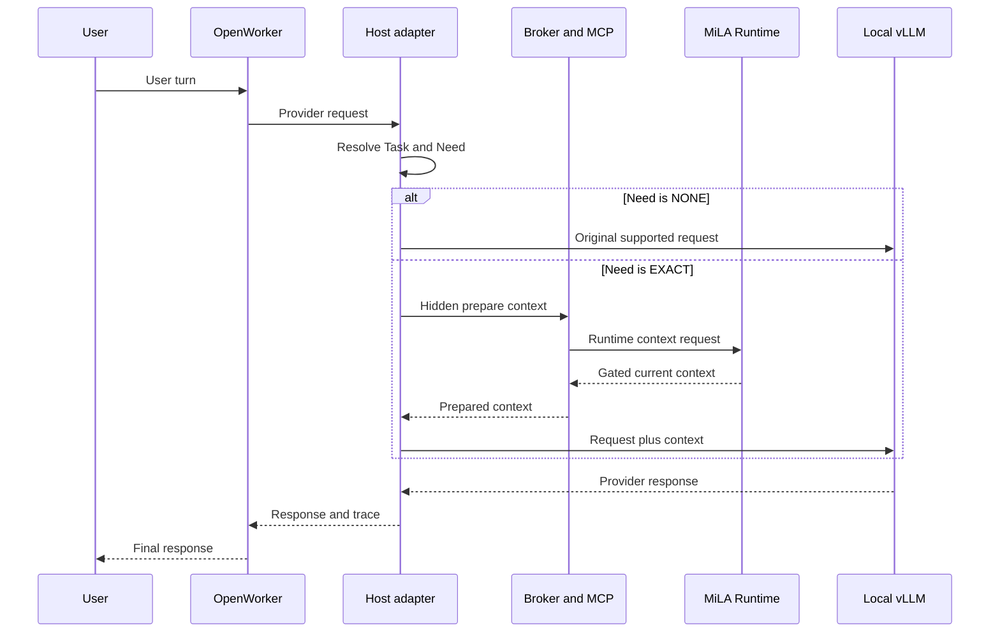

# MiLAi DG-13U：OpenWorker MCP 可用性开发 Goal 指令

_Goal ID：`DG-13U` · 版本：`0.1.0 EXECUTION INSTRUCTION / U0 READY / U1 ACTIVATION GATED` · 日期：`2026-08-25`（Asia/Shanghai） · 当前状态：`NOT STARTED / PRODUCT NOT YET USABLE` · Provider：本地 `vLLM`_

本文是 [`MiLAi_DG-13_MemoryAccessPlan与渐进检索_GOALS.md`](./MiLAi_DG-13_MemoryAccessPlan与渐进检索_GOALS.md) 的下位开发指令。上位 Goal 定义产品语义、范围和 release gate；本文只规定如何优先完成第一条可用产品链。若两者冲突，以上位 Goal、frozen architecture、[`MiLAi_Lean_V1_实施合同.md`](./MiLAi_Lean_V1_实施合同.md) 和 [`AGENTS.md`](./AGENTS.md) 为准。

本轮创建本文不表示代码已经修改、测试已经运行或 `DG13-U1` 已通过。

## 🎯 1. Goal、授权与停止边界

### 1.1 唯一目标

执行代理必须先完成：

> **让真实 OpenWorker 通过 Host-controlled MCP `prefetch`，在调用本地 vLLM 前自动获得经过 MiLA Canonical Gate 的 current-state Context，并以明确、可调试、可运维的方式完成回答或确定性降级。**

唯一发布标签为：

```text
DG13-U1 = LOCAL_OPENWORKER_MCP_CURRENT_STATE_USABLE
```

在该标签满足全部门禁前，不得把组件测试、历史 DG-10 artifact、direct shadow、mock provider 或 visible `milai_recall` tool-loop 写成产品可用。

### 1.2 执行授权

本 Goal 冻结后续开发的优先级、工作方式和验收条件。`U0` 可立即执行；在第一项 behavior-changing U1 patch 前，必须记录 [`ADR-024`](./docs/adr/ADR-024-host-native-memory-control-plane.md) 的 owner acceptance，并关闭上位 Goal 9.2 的九项决定：local label、三个 StateKey family/CN-EN fixture、strict failure action、same-process continuity、reader-lite read-only、MCP-only first transport、provider request subset，以及 task metadata/delayed-result 边界。独立 reviewer PASS 不能替代 owner acceptance。

激活后，本 Goal 授权开发代理完成 `U1-A/U1-B/U1-C` 所需的最小代码、测试、运行脚本、开发 fixture、trace schema 与操作文档。执行代理应持续推进到以下任一终态：

```text
PASS
  = U0 与 U1 全部门禁通过，独立审查 PASS

BLOCKED
  = 已完成最小失败复现与单项调试，且剩余阻断需要新的 owner authority、
    外部状态变化或超出本 Goal 的架构决定
```

不能以“已有设计”“组件大多通过”“需要后续集成”作为完成状态。

### 1.3 当前事实基线

| 事实 | 当前状态 | 代码或证据 |
| --- | --- | --- |
| Host-controlled prefetch | 已有 precursor | `host_adapter.py::OpenWorkerProviderAdapter.complete()` |
| Hidden MCP composite | 已实现组件路径 | `controller.py::McpPrepareContextClient.prepare_context()` |
| Current package real composition | `MISSING / NOT RUN` | 上位 Goal 2.2、8.1 |
| Provider middleware | F1-specific | `f1_contract.py::request_payload()` 重建固定请求 |
| Task metadata producer | 未接入真实 OpenWorker | 当前主要由 tests/shadow 注入 |
| CACHE miss fallback | 未闭合 | Runtime 返回 `next_route_recommended`，Host 同调用终止 |
| Provider | 本地 vLLM 可探测 | 生成本文时观测 `0.27.1`、`Qwen3.6-35B-A3B-FP8` |
| Runtime | 单独在线 | `milai-ops status` PASS；不等于 OpenWorker E2E |
| OpenWorker composition | 未接通 | 现存容器无 socket mount/provider env；broker/relay/adapter 未运行 |

关键实现入口：

| Stage | File | Symbol |
| --- | --- | --- |
| OpenWorker config | [`openworker/opencode.json`](./integrations/openworker-mcp/openworker/opencode.json) | `OPENWORKER_URL`、relay command |
| Provider interception | [`host_adapter.py`](./integrations/openworker-mcp/src/milai_openworker_mcp/host_adapter.py) | `OpenWorkerProviderAdapter.complete()` |
| Hidden MCP client | [`transport.py`](./integrations/openworker-mcp/src/milai_openworker_mcp/transport.py) | `McpUnixClient.prepare_memory_context()` |
| Broker | [`broker.py`](./integrations/openworker-mcp/src/milai_openworker_mcp/broker.py) | `Broker.run()` |
| MCP operation | [`server.py`](./integrations/mcp/src/milai_mcp/server.py) | `milai_prepare_context()` |
| Runtime client | [`client.py`](./integrations/python-client/src/milai_client/client.py) | `MilaiClient.prepare_context()` |
| Runtime route | [`context_routes.py`](./runtime/src/milai/api/context_routes.py) | `POST /v1/memory/prepare-context` |
| Runtime control | [`context_preparation.py`](./runtime/src/milai/application/context_preparation.py) | `PrepareContextService.prepare()` |
| Provider gateway | [`provider_execution.py`](./integrations/openworker-mcp/src/milai_openworker_mcp/provider_execution.py) | `ProviderExecutionGateway.execute()` |
| Historical harness | [`f1_openworker.py`](./evals/agent_integration/f1_openworker.py) | `OpenWorkerHarness`，仅诊断参考 |

### 1.4 明确不做

`DG-13U` 不授权：

- Direct/HTTP transport、push invalidation 或离线 snapshot 注入；
- U2 durable/portable lease、U3 general retrieval、U4 materialization；
- graph、DAG tag、reconstructive L2、learned Task Resolver；
- canonical write、Evidence capture、Proposal review 或 revoke capability 接入普通 OpenWorker；
- 训练、微调、替换 embedding、替换 vLLM 模型或改变现有 vLLM 生命周期；
- 访问正式 paper labels、运行 DG-12 formal experiment 或消费 untouched holdout；
- 大规模重构 OpenWorker、Runtime 或 Provider stack。

## 🏗️ 2. 必须闭合的产品链

### 2.1 目标调用顺序



这条 primary `prefetch` 链中，Runtime 不调用 vLLM；Host adapter 分别拥有 memory plane 和 model plane。`milai-mcp-relay` 是 Worker 内的 visible MCP capability transport，保留给 catalog/compatibility 验证，不是 hidden prefetch 的 provider-time 调用者。

规范顺序：

```text
OpenWorker request
→ parse declared provider semantics once
→ resolve Host-owned task metadata
→ resolve MemoryRequirement
→ NONE: skip MCP
→ EXACT: one hidden milai_prepare_context logical call
→ Runtime performs validation and same-call primary fallback when needed
→ compile minimal Context without changing canonical state
→ preserve supported provider request semantics
→ call local vLLM at most once
→ return OpenAI-compatible response plus joined AccessTrace
```

`prefetch` 中 provider/model 看不到也不决定 memory tool call。`auto` 仅为 compatibility regression，不得替代这条链。

### 2.2 Ownership 与不可改变的语义

| 决定或状态 | Owner | U1 规则 |
| --- | --- | --- |
| Task identity/relation | OpenWorker Host | 显式生产；LLM、retrieval 不建立 identity |
| Memory requirement | Host deterministic resolver | 与 MCP availability 解耦 |
| Route execution | MiLA Runtime | exact-first；CACHE miss 同调用继续 |
| Canonical validity | Existing ECS/Canonical Gate | cache、Context、vLLM 不得提升 authority |
| Provider execution | Host provider middleware | 仅在 outcome 允许时调用 vLLM |

`MemoryRequirement=NONE` 表示问题不需要 memory；它不能由 MCP timeout、Runtime down、parse exception 或缺失 task metadata 推导出来。

### 2.3 第一版一致性与生命周期

U1 固定：

```text
ConsistencyRequirement = STRICT_CURRENT
Current Runtime mapping = CANONICAL_REQUIRED
Availability            = FULL | UNAVAILABLE
Read profile            = reader-lite
Task continuity         = same adapter process only
```

Runtime/MCP 不可达且 memory required 时，必须返回 typed memory failure，并且不得调用 vLLM 回答该 memory-dependent question。进程重启后不得复用旧 slot，也不得宣称跨 session、portable lease 或 snapshot-current。

### 2.4 数据与权限边界

只允许 synthetic、public development split 或 independently sourced de-identified data。OpenWorker 只能获得 profile-scoped、只读的 socket capability；不得获得 MiLA token、Runtime URL、DSN、secret directory、Docker socket 或 canonical write capability。

继续执行 [`contracts/agent/v1/openworker-mcp-uds.md`](./contracts/agent/v1/openworker-mcp-uds.md) 和 [`docs/runbooks/provider-mcp-agent.md`](./docs/runbooks/provider-mcp-agent.md) 的 credential、socket inode、profile、mount、network 与 cleanup 约束。

## 🧭 3. 开发原则：少防御、强合同、失败可见

### 3.1 “减少防御性编程”的准确含义

本 Goal 要减少的是没有证据支持的复杂度，不是降低安全边界。实现必须：

- 只实现 U1 已声明的路径和输入子集；
- 在一个边界完成 parse/validation，内部传递 typed value，不重复猜测类型；
- 对不支持的 provider 字段明确拒绝，不静默丢弃、重写或猜默认值；
- 让内部 invariant violation 在开发测试中保留原始异常与 stack，而不是层层转成 `UNKNOWN`；
- 只有真实失败用例证明需要时才增加 guard、retry、fallback 或兼容分支；
- 优先修改最短真实链，不先建立通用 transport、plugin、registry 或 policy framework。

### 3.2 仍然必须保留的防线

以下不是“防御性冗余”，禁止为了简化而删除：

- tenant、scope、authority、permission、retention、revocation、GroundingBlock 与 OpenIssue Gate；
- reader-lite profile、socket identity/mode/peer UID、pinned executable 与 secret isolation；
- bounded deadline、frame/response size、token/request budget 和 provider ledger；
- canonical unavailable 时 fail closed；
- provider/model/search/Context 无 canonical write authority；
- cleanup、process ownership、broker socket inode 与 restart policy；
- trace 中的 requested、planned、attempted、terminal 与 fallback reason。

### 3.3 异常处理规则

允许 `except Exception` 的位置仅限顶层 process/harness terminal，用于：

```text
record bounded terminal
→ run deterministic cleanup
→ re-raise or return explicit FAILED
```

业务层不得 broad-catch 后返回通用 `UNKNOWN`。每个外部边界只做一次稳定映射：

```text
MCP/Runtime required but unavailable
→ MEMORY_REQUIRED_BUT_UNAVAILABLE

Provider unavailable after context ready
→ PROVIDER_UNAVAILABLE

Unsupported provider request
→ PROVIDER_REQUEST_UNSUPPORTED

Invalid Host task metadata
→ TASK_METADATA_INVALID
```

具体 code enum 可复用现有合同；不得仅为名称一致新增重复错误体系。

Provider barrier 只保留一个判定点：

```text
provider_execution = ALLOWED
iff execution_action = CONTINUE
and status in {NO_MEMORY_NEEDED, CONTEXT_READY_CURRENT}
```

其他组合一律 `PROHIBITED`。未知异常只能在最外层 containment 中终止请求、记录 reason/trace，并在 strict-memory path 禁止 provider；不得吞错后继续。

### 3.4 禁止的实现模式

- 为“以后可能有 Direct/HTTP”提前写三套 transport；
- cache miss 后要求用户再发一 Turn；
- MCP failure 后自动改走 no-memory provider answer；
- 自动重试 charge-bearing/provider 请求；
- 用 sleep、提高 timeout、扩大阈值或重复全量 suite 掩盖竞态；
- 在 eval harness 中拥有 MiLA 产品语义；
- 同一概念同时保存在 request、registry、Context 与 cache，且无单一 owner；
- 为通过测试而硬编码 fixture answer、case ID 或 vLLM 输出。

## 🔄 4. 执行工作包

### 4.1 U0 — 可重放真实基线

U0 先完成，不改变 memory 语义。

交付：

1. 冻结 current source tree、wheel、OpenWorker image/OpenCode、relay、broker、MCP executable、Runtime migration、vLLM/version/model/tokenizer/chat-template identity。
2. 当前 worktree 没有可用 commit identity，输入冻结必须使用内容 SHA/manifest；不得填写不存在的 Git commit。
3. 先解决运行前置：`/` 与 `/tmp` 当前无可用空间；所有新 tmp/cache/artifact 显式落在 `/cra`，UDS 可使用 `/dev/shm`，不得先清理未知文件。
4. 从模板生成与当前 Runtime port、exact MCP executable digest 一致的 `0600` run-local broker policy；模板中的 `18080` 和 `/opt/...` 不能直接冒充可运行配置。
5. 生成未过期且精确绑定当前 `127.0.0.1:7860`、model、request/token budget 和 synthetic boundary 的 provider capability；历史/`shadow-no-provider` manifest 不可复用。
6. 建立一个 operator-facing `start → readiness → smoke → report → cleanup` development entrypoint；禁止把历史 DG-10 runner 原样标为 DG-13 product runner。
7. 为 runner 增加单 case 选择能力，例如 `--case-id`；没有该能力不得进入 U1 大矩阵。
8. 从 OpenWorker request 到 task/Need、MCP request/receipt、Runtime trace、Context digest、vLLM native request ID 和 response 建立一个 join key。
9. 分段记录 OpenWorker、adapter、UDS、MCP child、Runtime、Gate、compile、vLLM 的 latency 与调用计数。
10. 冻结声明支持的 OpenWorker/OpenAI request 子集；未声明字段显式拒绝。

每次 U0 run 的最小只读 preflight：

```bash
runtime/.venv/bin/milai-ops status --json --env-file runtime/.env
curl -fsS --max-time 3 http://127.0.0.1:7860/health
curl -fsS --max-time 3 http://127.0.0.1:7860/v1/models
ps -eo pid,lstart,args | rg '[m]ilai-(api|worker|mcp-broker|mcp-relay|openworker-adapter)'
df -h / /tmp /cra /dev/shm
nvidia-smi
docker ps --no-trunc
```

分别 ready 只能证明组件在线。只有同一 `run_id` 的 OpenWorker request、MCP session、Runtime trace、Context digest 与 vLLM native terminal 完成因果 join，才是 combined E2E。

U0 exit：同一输入可重放；每个预期 MCP/vLLM call 可对账；不存在未归属 call；失败可按 case ID 单独运行；当前 exact-wheel composition 的缺口被真实结果而非历史 artifact 表达。

### 4.2 U1-A — OpenWorker MCP product shell

目标是先让产品壳层真实可运行，不同时修改 retrieval semantics。

- 使用 current exact wheel 在 fresh local environment 启动 Runtime、broker、provider middleware、OpenWorker 和现有 vLLM；
- 启动顺序固定为 Runtime ready → broker/socket ready → adapter ready → 创建 OpenWorker → OpenWorker/MCP/provider readiness；
- 明确建立 OpenWorker container 到 Host adapter 的 provider network；不得假定 container 内 `127.0.0.1` 等于 host 或 vLLM；
- 把 F1-only request shaping 留在 evaluation-specific 层；产品 middleware 保留声明支持的原始 messages、system/assistant/tool messages、model、stream、tools/tool choice、tool results 与 generation fields；
- 建立真实 OpenWorker-side `milai_task_state`、relation、operation identity producer，不依赖 test-only private field 注入；
- 固定 `memory_mode=prefetch`；visible `milai_recall` event 必须为零；
- readiness 覆盖 Runtime、broker child/MCP catalog、adapter、OpenWorker 和 vLLM；
- broker restart 产生新 inode 后，按声明策略 recreate/remount Worker；adapter restart 后不复用旧 slot；
- 所有启动对象有明确 owner、PID/container ID、port/socket、shutdown 与 cleanup receipt。

U1-A exit：无 memory 的真实 OpenWorker request 能原样通过 middleware 调用 vLLM；memory path 能到达 hidden MCP；普通非 memory tool 语义未被 middleware 破坏。

### 4.3 U1-B — Current-state exact read

目标是闭合：

```text
CURRENT_STATE CN/EN query
→ EXACT requirement
→ StateKey/known Claim address
→ ClaimHead/EffectiveClaimState
→ Canonical Gate
→ minimal Context
→ vLLM
```

要求：

- 中文与英文 Need resolver 不得依赖仅英文 token/regex 才命中；
- first slice 可从一个 governed StateKey family 起步，但 release matrix 至少覆盖 U0 冻结的三个代表性 family；
- exact path 不调用 embedding、vector、FTS、reranker、reconstruct 或 auxiliary LLM；
- task/binding 输入不足时显式失败或进入声明的 deterministic relation，不从 retrieval 猜 task；
- Context 注入必须有 digest、Claim/OpenIssue refs、canonical position 与 trace pointer；
- vLLM 只看到 Context，不获得 MiLA authority，也不能触发 write；
- wrong task、wrong scope、alias collision、changed head、OpenIssue、revoke 和 canonical unavailable 都有负向用例。

U1-B exit：真实 OpenWorker 在 current exact wheel 上完成 CN/EN current-state answer；Context 可从 provider prompt sidecar 证明；每个 answer 可回到 Canonical Gate 结果。

### 4.4 U1-C — Same-call fallback 与 typed failure

目标是消除当前 terminal cache miss 和模糊 `UNKNOWN`。

- retained candidate/cache validation hit：复用 validated current Context；
- miss、coverage miss、stale、head/issue revision change：在同一个 `milai_prepare_context` logical call 内自动执行 primary `EXACT`；
- primary route 可用时，`TerminalLeaseMiss=0/N`；
- MCP/broker/Runtime unavailable：`MEMORY_REQUIRED_BUT_UNAVAILABLE`，memory-dependent provider calls 为零；
- vLLM unavailable：保留已完成 memory trace，返回独立 provider terminal；
- malformed MCP/provider response、deadline、capability/ledger failure 映射成稳定 terminal；
- `NONE` query 仍绕过 MCP 并只调用一次 vLLM；
- 所有 failure case cleanup 后无 orphan broker child、socket、container、test database、ledger lock 或端口占用。

CURRENT `runtime/tests/unit/test_context_preparation.py::test_cache_miss_and_none_are_terminal_without_hidden_retrieval()` 固定了旧 terminal-miss 行为。U1-C 必须在实现 same-call fallback 时同步把该 executable contract 改成新正例与 negative twin；不能只改代码、保留冲突测试，也不能删除用例来隐藏语义变化。

U1-C exit：cache miss 不再要求第二 Turn；availability 不改变 Need；失败原因、execution action 与 provider call cardinality 可单项验证。

## 🤖 5. vLLM Provider 合同

### 5.1 固定 provider 身份

U1 产品 Provider 只能是本地 vLLM，不得用外部 OpenAI-compatible API 替代。生成本文时只读观测为：

```text
endpoint       http://127.0.0.1:7860
vLLM version   0.27.1
model          Qwen3.6-35B-A3B-FP8
max model len  65536
serving GPUs   GPU 0/1
```

这些是当前观测，不是永久配置。每次 U0/U1 run 必须重新探测并写入 manifest。若 identity drift，停止该 run 并更新受控 manifest；不得自动启动、停止、重启、升级、重新分片或改配 vLLM。遵守 [`ADR-023`](./docs/adr/ADR-023-self-hosted-vllm-validation-lane.md)。

### 5.2 请求与响应语义

产品 middleware 必须采用“注入 Context 后透传声明字段”的最短实现。禁止继续把所有产品请求重建成 `f1_contract.py::request_payload()` 的固定 Qwen/F1 JSON schema。

U0 至少冻结并测试：

- multi-turn `messages` 与 system/assistant/tool roles；
- `model` 与 vLLM capability matching；
- `stream=false/true`；
- ordinary `tools`、`tool_choice` 和 tool result；
- `temperature`、`top_p`、`max_tokens`、`seed`、`response_format` 等声明支持字段；
- vLLM native request ID、usage、finish reason 与 terminal receipt。

不支持的字段必须在调用 vLLM 前返回 typed error；不能忽略或“尽力猜测”。

### 5.3 调用预算

结构性合同：

| Turn | Hidden MCP | vLLM | Auxiliary model |
| --- | ---: | ---: | ---: |
| `NONE` | `0` | `1` | `0` |
| `EXACT` success | `≤1` | `1` | `0` |
| `EXACT` memory unavailable | `≤1` | `0` | `0` |
| Cache miss then exact | 同一 composite 内 | `1` | `0` |
| Provider failure | 按 Need 执行 | `≤1`，不自动 retry | `0` |

Task relation、Need、route 和 current-state exact read 的 provider、embedding、vector、reranker calls 必须为零。vLLM 只负责最终 provider execution。

### 5.4 Provider 测试层级

Mock transport 只用于 unit/contract tests。U1 PASS 必须使用真实 vLLM、真实 OpenWorker container、current exact wheel、真实 broker/MCP child 和真实 Runtime。历史报告可作为诊断参考，不能进入当前 PASS denominator。

## ⚡ 6. 并行开发与计算资源计划

### 6.1 并行工作组织

执行代理必须充分使用当轮可用的 agent/concurrency slots，但只并行独立工作。推荐一个主集成者加三个有界 lane：

| Lane | 主要责任 | 优先文件 | 并行条件 |
| --- | --- | --- | --- |
| A | OpenWorker/provider 透传与 task metadata | `host_adapter.py`、provider tests | 不同时修改 Runtime |
| B | composite fallback 与 outcome | `controller.py`、`context_preparation.py` | 不同时修改 provider shell |
| C | launcher、readiness、E2E、trace | integration runner/tests/runbook | 产品行为不得放入 harness |
| Main | 接口冻结、冲突整合、gate | cross-lane review | 唯一 integration owner |

每个 lane 必须有明确文件 ownership、输入合同、输出合同和独立 test command。两个 agent 不得同时改同一文件；共享接口由主集成者先冻结最小 schema，再并行实现。

### 6.2 当前机器与调度上限

生成本文时只读观测：16 个物理核/32 逻辑 CPU、约 216 GiB available RAM、4×A100 40 GiB；既有生成 vLLM 占用 GPU0/1，embedding/reranker 进程跨卡占用，GPU2/3 不能视为独占空卡。根文件系统与 `/tmp` 为 `100%`、available bytes 为零；`/cra` 约有 593 GiB、`/dev/shm` 约有 125 GiB 可用。`pytest-xdist` 当前未安装。

每次执行前重新运行资源预检。建议调度：

- stateless unit/contract：4 个 package-level process shard；当前不假定 `pytest -n auto`；
- shared test-DB integration/concurrency/security：一次 1 个；建立 per-shard DB wrapper 后最多 2 个；
- isolated installed ProductRuntime functional job：最多 2 个，但 port/runtime startup 必须串行；
- real OpenWorker container E2E：全局一次 1 个，完成单 case 后才运行下一 case；
- vLLM correctness：一次 1 个 provider-consuming job，可与不访问 provider 的 CPU tests 并行；
- provider latency/throughput：全局独占窗口，不与 pytest、embedding/reranker、cold build 并行；
- 保留至少 4 个物理核给 PostgreSQL、Docker、broker、Runtime 与 vLLM gateway；
- 不因 GPU 空闲而提前启动 U3 检索、第二模型或无关实验。

普通开发窗口可以同时运行 4 个纯 CPU shard、1 个隔离 DB job 和 1 个串行 provider/OpenWorker job；若它们争用同一 DB、port、socket、ledger 或 provider performance window，则相应 token 降为 1。功能 shard 统一限制隐式 BLAS/tokenizer thread，避免 4 个进程各自再次占满 32 个逻辑核。

如果 profile 显示 CPU、DB、vLLM queue 或 I/O 已饱和，应降低对应 lane 并发，而不是扩大 timeout。

### 6.3 环境隔离

每个并行 stateful/E2E case 必须使用唯一：

```text
run_id
temporary root
database or schema
container/network name
broker capability directory and socket
listen port
provider ledger
adapter/access trace
cleanup receipt
```

durable artifact 使用 `/cra/memory/mx_memory/MiLAi/var/dg13/runs/<run-id>`，temp root 使用 `/cra/memory/mx_memory/MiLAi/var/dg13/tmp/<run-id>`；短路径 UDS 可使用 `/dev/shm/milai/<short-run-id>`。在 Python 启动前显式设置 `TMPDIR`，pytest 同时传入唯一 `--basetemp` 和 `cache_dir`。不得把 durable report 放入 `/dev/shm`。

不得共享可变 test database、socket inode、ledger 文件、output path 或 task registry。并发只改变物理调度，不得增加逻辑 provider/MCP attempt、自动 retry 或隐藏 denominator。现有 free-port probe 存在 bind-close-rebind race，因此 OpenWorker/ProductRuntime startup 必须串行，直到有受测的端口分配器。

### 6.4 实验顺序

执行顺序固定：

```text
single deterministic unit
→ containing unit module
→ parallel independent CPU package shards
→ owning contract/integration gate
→ one real OpenWorker + vLLM case at a time
→ complete serial E2E matrix
→ full U1 gate
→ independent review
```

并行资源用于缩短已知独立工作，不用于同时尝试多套架构。任何关键接口尚未冻结时，先由主集成者完成最小决策，再恢复并行。

共享 vLLM、embedding、reranker 与共驻进程未建立 exclusive reservation 时，latency/throughput 只能标记为 development characterization；不得因并行运行得到更快 wall time 就形成性能结论。

## 🧪 7. 失败后的单项调试协议

### 7.1 强制流程


一旦出现失败，失败 lane 必须停止 broad rerun，选择最小的一个 case/test node。其他与该接口无依赖的 lane 可以继续；依赖该接口的 lane 暂停。

### 7.2 单项复现规则

以下示例从 repository root 执行；runner 必须先建立对应 mode-`0700` 的 run-local temp root。优先使用精确 pytest node：

```bash
TMPDIR=/cra/memory/mx_memory/MiLAi/var/dg13/tmp/<run-id> \
  integrations/openworker-mcp/.venv/bin/python -m pytest \
  integrations/openworker-mcp/tests/test_controller.py::test_name -q -x \
  --basetemp /cra/memory/mx_memory/MiLAi/var/dg13/tmp/<run-id>/pytest \
  -o cache_dir=/cra/memory/mx_memory/MiLAi/var/dg13/tmp/<run-id>/pytest-cache
```

Runtime 示例：

```bash
TMPDIR=/cra/memory/mx_memory/MiLAi/var/dg13/tmp/<run-id> \
  runtime/.venv/bin/python -m pytest \
  runtime/tests/unit/test_context_preparation.py::test_name -q -x \
  --basetemp /cra/memory/mx_memory/MiLAi/var/dg13/tmp/<run-id>/pytest \
  -o cache_dir=/cra/memory/mx_memory/MiLAi/var/dg13/tmp/<run-id>/pytest-cache
```

E2E runner 必须支持：

```bash
runtime/.venv/bin/python scripts/<dg13-runner>.py --case-id <case-id>
```

若当前 runner 不支持单 case，先补最小 case selector，再调试具体失败。禁止反复运行完整 OpenWorker/vLLM matrix 来定位一个 case。

### 7.3 根因与修复证据

每个失败记录必须包含：

```text
case/test identity
exact command
input/fixture digest
code/package/provider identities
first failing boundary
typed outcome and original exception class
relevant trace IDs and bounded log digest
root-cause statement
minimal changed files
single-test result
containing-suite result
```

最小测试通过后，必须再运行一个保护同一 invariant 的 negative twin，例如 exact READY 对应 wrong-scope 或 canonical-unavailable。negative twin 通过后才进入 owning gate；owning gate 通过后才恢复 exact-current combined E2E。

不得通过自动 retry、忽略 exception、放宽 assertion、删除负向 case、延长 sleep/timeout 或把 failure 改写为 `UNKNOWN` 获得绿色结果。

### 7.4 vLLM 与并发失败

vLLM case 失败时，先区分：pre-call capability、request serialization、gateway/transport、vLLM native terminal、response parse、post-call ledger。一次失败不得自动再次调用 provider。只有确认第一次是否发起、native request ID 和 ledger 状态后，才能以新的显式 run/case ID 重试。

疑似 flaky/concurrency 问题先用一个 case 和一个 worker 复现，再逐级恢复 2/4 workers。重复运行用于测量 flake 时，所有 attempts 都进入 denominator，不能只保留 PASS。

## ✅ 8. U1 测试矩阵与可用性门禁

### 8.1 最小真实 E2E 矩阵

| 类别 | 必须覆盖 | PASS 事实 | 失败事实 |
| --- | --- | --- | --- |
| Fresh composition | current wheel + real OpenWorker + MCP + Runtime + vLLM | identity/readiness/cleanup 闭合 | 任一历史或 mixed identity 不计 |
| NONE | CN/EN non-memory turn | MCP=0，vLLM=1 | silent memory call=fail |
| EXACT | CN/EN current state | hidden MCP≤1，vLLM=1，Context in prompt | visible memory tool=fail |
| Task | continue/switch/return，concurrent sessions | no wrong-task reuse | ambiguous merge=fail |
| State change | head/issue revision change | stale candidate→same-call exact | stale current answer=fail |
| Scope/governance | wrong scope、alias collision、OpenIssue、revoke | Gate/abstention 正确 | unsafe acceptance=fail |
| Availability | broker/child/Runtime down/timeout/malformed | typed memory terminal，vLLM=0 | `Need=NONE`/stale fallback=fail |
| Provider | vLLM down/timeout/malformed | independent provider terminal | memory reason 被覆盖=fail |
| Lifecycle | broker inode/recreate、adapter restart | declared recovery policy | old slot/socket reuse=fail |

至少额外覆盖产品声明的 streaming 与 ordinary tool semantics。若 delayed/asynchronous tool result 不在 U1 支持范围，manifest 必须明确写 `UNSUPPORTED`；不能只靠单测暗示支持。

### 8.2 Correctness gate

所有 safety counters 必须以 `0/N` 报告且 `N>0`：

```text
WrongTaskAcceptance              = 0/N
WrongScopeAcceptance             = 0/N
StaleCurrentAcceptance           = 0/N
RevokedEvidenceReentry           = 0/N
UnauthorizedAuthorityEscalation  = 0/N
SilentMemoryNeedNone             = 0/N
TerminalCacheMiss                = 0/N when EXACT is available
ModelVisibleMemoryToolUse        = 0/N in prefetch
UnaccountedProviderOrMcpCall     = 0/N
```

`N=0`、未运行、无有效用例或只引用历史 artifact 均不能 PASS。

### 8.3 Functional 与 cost gate

U1 必须同时满足：

- fresh environment 的 current exact-wheel combined E2E PASS；
- OpenWorker-side task metadata producer 是真实产品接线；
- CN/EN Need recall 和 exact address resolution 达到 U0 冻结阈值；
- cache/retained miss 在同一个 MCP composite call 内进入 exact；
- exact path 的 FTS/vector/reranker/reconstruct/auxiliary model calls 均为零；
- provider request 声明子集不被静默丢弃或改写；
- vLLM native ID、usage、finish reason 与 adapter terminal 完整 join；
- p50/p95/p99、Context tokens、MCP calls、vLLM calls 与阶段 latency 全部报告；
- latency 阈值只在 U0 baseline 后冻结，不能为通过 U1 临时移动。

### 8.4 Operability 与证据 gate

必须提供：

1. 一个 operator-facing start/smoke/report/cleanup 命令；
2. 一个 `--case-id` 单项调试命令；
3. exact source/package/image/MCP/Runtime/vLLM/tokenizer manifest；
4. joined AccessTrace、MCP receipt、Runtime trace、provider ledger 和 cleanup receipt；
5. broker/runtime/vLLM failure injection 与 restart/recreate 报告；
6. secret、route、socket、mount 与 profile negative gate；
7. 全部 test commands、exit codes、case counts 与 duration；
8. 当前限制：local、reader-lite、same-process task continuity、synthetic/de-identified、STRICT_CURRENT。

完整证据只能支持 local scoped label，不能支持 Production、Beta、remote MCP、portable lease、general retrieval 或论文结论。

### 8.5 Release gate 聚合协议

| Gate | 范围 | PASS 的最小充分条件 | 非 PASS 证据 |
| --- | --- | --- | --- |
| `U1-G0` | Identity/readiness | current exact manifest 全匹配；全链 ready | historical/mixed identity、direct shadow |
| `U1-G1` | Canonical/security | 8.2 全部有效 `0/N`；Worker 无 secret/direct route | 任一错误接受、`N=0` |
| `U1-G2` | Real vertical behavior | NONE、EXACT、same-call fallback、strict failure 均真实 E2E | mock 或低层测试代替 E2E |
| `U1-G3` | Provider/task contract | 声明字段透传或显式拒绝；真实 task producer、无污染 | F1 隐式改写、猜 task |
| `U1-G4` | Failure/lifecycle/ops | typed failure、restart/remount、cleanup、单命令 smoke | catch-all 继续、retry、泄漏 |
| `U1-G5` | Reconciliation/cost | request→plan→terminal 和 MCP/vLLM ledger 完整对账 | unaccounted call、只报总 wall time |

每个 gate 的 release 状态只能是：

```text
PASS | FAIL | BLOCKED | NOT_RUN
```

`PARTIAL`、`HISTORICAL`、`FLAKY` 只能描述证据，不能转换为 PASS。六个 gate 必须全部 PASS；`BLOCKED` 或 `NOT_RUN` 仍是 `PRODUCT NOT USABLE`；后置绿色结果不能覆盖前置红色 gate。当前基线因 exact-current composition 为 `MISSING / NOT RUN`，总状态仍为 `NOT_RUN / PRODUCT NOT USABLE`。

## 🔎 9. 独立审查、完成定义与交接

### 9.1 独立审查调用

U1 全部门禁本地通过后，必须进行一次独立、只读的 candidate review。用户已允许本 Goal 在需要审查时采用 [`codex_sol_xhigh.md`](./codex_sol_xhigh.md) 指定的执行 profile：

```text
model            = gpt-5.6-sol
reasoning_effort = xhigh
role             = independent reviewer
```

`codex_sol_xhigh.md` 原始文本本身只针对 DG-10 candidate.4；**本 Goal 是把相同 profile 明确授权给 DG-13U U1 review 的新 owner 指令**。不得改写旧 DG-10 artifact，也不得把 review model 当作产品 Provider；产品 Provider 仍然只有本地 vLLM。

DG-13U review 必须使用新的 review identity、只读隔离 bundle、attempt root、JSON/Markdown output 和 input SHA；不得写入 DG-10 candidate.4 protected roots。若未建立 DG-13-specific protected authority/runner，该结果只能称为 independent development review，不能冒充 DG-10 accepted audit 或 formal paper audit。

### 9.2 Review bundle 与判定

Review bundle 必须冻结并哈希：

- parent Goal、本执行 Goal、相关 ADR/contract/runbook；
- exact diff/source tree 与 current wheel/image identities；
- U0 manifest、全部 U1 case manifest 与命令；
- unit/contract/integration/E2E/failure/security/cleanup 报告；
- AccessTrace、MCP/Runtime/provider reconciliation summary；
- 已知限制、未支持字段与所有未关闭问题。

Reviewer 不修改实现，只输出：

```text
PASS
REVISE
BLOCKED_BY_MISSING_EVIDENCE
```

`REVISE` 后，主执行代理按 finding 严重度逐项处理；每次只选一个 finding，先建或定位单项失败测试，修复后按第 7 节逐级扩大验证。不得把多个 finding 用一次大重构共同关闭。

### 9.3 Definition of Done

只有以下全部成立才可写 `DG13-U1 PASS`：

1. ADR-024 与上位 Goal 9.2 的 U1 owner decisions 已明确接受并绑定版本；
2. U0 identity、trace 与单 case runner 闭合；
3. U1-A product shell、task metadata、provider semantics 和 operations PASS；
4. U1-B CN/EN exact current-state path 与 Canonical Gate PASS；
5. U1-C same-call fallback、typed failure 与 cleanup PASS；
6. 所有 correctness counters 为有效的 `0/N`；
7. 真实 vLLM combined E2E 使用 current exact wheel PASS；
8. 结构性 call/cost contract PASS；
9. full tests 和 declared fresh-start smoke PASS；
10. independent `gpt-5.6-sol/xhigh` review 为 PASS；
11. `U1-G0`～`U1-G5` 全部 PASS；
12. 无 P0/P1 finding、无未解释 provider/MCP call、无 silent fallback。

### 9.4 最终输出与停止条件

完成后只提交一份 terminal report：

```text
status
supported scope
source/package/provider identities
commands and case counts
correctness/cost/latency summary
failure and cleanup summary
independent review identity/verdict
known limitations
artifact index and SHA-256
```

然后停止，不自动进入 U2/U3/U4。若被阻断，报告最小复现、已通过的最窄边界、缺失 authority/外部条件和下一条可执行命令；不得用计划状态伪装完成。
