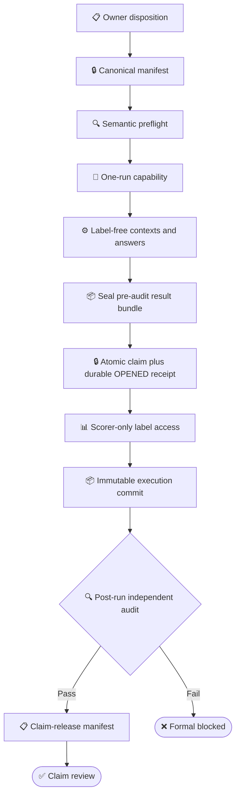

# MiLAi DG-13 Formal Evaluation Integrity

_Document：`DG-13-FORMAL-INTEGRITY` · 版本：`0.2.0 POLICY/GOVERNANCE STOP — NOT MACHINE ENFORCED / NOT BLOCKING U0-U1 PRODUCT DEVELOPMENT` · 日期：`2026-08-25`（Asia/Shanghai） · 本文只记录和设计 formal evaluation gate，不打开 label、不执行实验、不修改 DG12 state_

---

## 📋 1. Scope 与状态声明

### 1.1 本文阻断什么

本文在 governance/policy 层要求停止：

- DG12/DG13 formal label consumption
- formal context、answer、score 或 paper table 生成
- 以 hidden/holdout 结果选择 DG13 route、threshold、index 或 lease policy
- broad quality/speed/cost claim
- novelty confirmation 与 final paper claim
- 将现有 same-family audit 写成 independent accepted review

本文不阻断：

- [DG13 OpenWorker MCP Product Usability Goal](MiLAi_DG-13_MemoryAccessPlan与渐进检索_GOALS.md) 的 U0/U1
- synthetic 或 independently sourced deidentified current-state fixture
- public development benchmark regression
- read-only code、test、trace 与 identity audit
- local product smoke
- 不打开 formal labels 的 architecture development

### 1.2 Formal state 不等于 product state

```text
OpenWorker MCP product usability
    may advance on synthetic or independently sourced deidentified data

Formal paper experiment
    remains blocked until this integrity lane passes
```

两个 lane 的结果不能互相替代：

- U1 PASS 不代表 formal benchmark admissible
- formal preflight PASS 不代表 OpenWorker MCP product usable
- DG12 performance miss 不等于 formal integrity failure
- formal integrity audit FAIL 不等于方法实验 FAIL

### 1.3 当前 verdict

```text
Formal PE02 result status    = NOT STARTED / INCONCLUSIVE
Formal-start integrity audit = FAIL
Holdout admissibility        = BLOCKED_PENDING_OWNER_DISPOSITION
```

这三个状态只描述当前启动条件和证据边界，不自动修改 `var/dg12/current-state.json`。必须明确：

```text
CURRENT machine state:
  formal_execution_blocker.status = CLEARED_BY_V3_NO_LABEL_GATES
  require_formal_execution_ready() 仍可接受当前 authorization

THIS DOCUMENT:
  POLICY/GOVERNANCE STOP ONLY
  NOT MACHINE ENFORCED
```

因此，在任何 formal action 之前，owner 必须单独 supersede/revoke 现有 authorization/state，并使机器 gate 与本文的 integrity decision 一致。本文本身不能阻止 runner 启动。证据：`var/dg12/current-state.json:572-574`、`evals/paper/dg12_v3/freeze.py::require_formal_execution_ready()`、`runner.py:239-240,464-465`。

## 📍 2. CURRENT DG12 formal state

### 2.1 Machine state

截至 `2026-08-25`，当前机器状态为：

```text
phase = PAPER_PROTOCOL_V3_FROZEN_GATES_PASS_FORMAL_PE02_AUTHORIZED
DG12-PD02 = TERMINAL_TARGET_MISS
DG12-PE00V3 = PASS_PROTOCOL_V3_FROZEN
DG12-PE01V3 = PASS_NO_LABEL_GATE
DG12-PE02V3 = AUTHORIZED_FORMAL_RESOURCE_PREFLIGHT_PENDING
DG12-PE03..09 = BLOCKED_BY_PE02
DG12-PE10..12 = BLOCKED_BY_FORMAL_RESULTS
```

权威机器证据：

- `var/dg12/current-state.json`
- `var/dg12/formal-execution-authorization-v3.json`
- `var/dg12/runs/dg12-pe01v3-no-label-gate-20260825-001/preflight.json`
- `var/dg12/runs/dg12-pe02v3-preflight-20260825-001/preflight.json`
- `var/dg12/runs/dg12-pe02v3-preflight-20260825-001/resource-plan.json`

### 2.2 已经存在与尚未存在的 artifact

| **Artifact class** | Current count/status | 解释 |
| --- | --- | --- |
| Protocol/method matrix | frozen | 不是 method result |
| Planned cells | 100 cases × 11 methods = 1,100 | 不是 executed denominator |
| Formal label receipts | 0 | official receipt counter |
| Formal contexts | 0 | no formal method output |
| Formal answers | 0 | no provider answer |
| Formal scores | 0 | no judge/scorer result |
| Provider calls | 0 | no formal provider request |
| Judge calls | 0 | no formal judge request |
| Paper table | absent | cannot be inferred |

`formal-execution-authorization-v3.json` 记录的 **authorization-time snapshot** 明确：

```text
C-BOUNDARY-001              = UNSUPPORTED_CANNOT_BE_REVIVED
speed_claim_allowed         = false
broad_quality_claim_allowed = false
paper_labels_opened_at_authorization              = false
formal_method_outputs_generated_at_authorization  = false
formal_scores_opened_at_authorization              = false
```

这些 `_at_authorization` 字段不是对后续全局状态的永久保证。当前 official receipt/context/answer/score/provider/judge 仍为零，还由 current-state、no-label artifacts 和 formal result/receipt 缺失共同支持。

### 2.3 Documented 与 implemented 的边界

`PASS_NO_LABEL_GATE` 说明指定 preflight 在无 official label receipt 的情况下通过；它不证明 filesystem 上没有任何其他进程访问 label-bearing source。

`AUTHORIZED_FORMAL_RESOURCE_PREFLIGHT_PENDING` 说明可以进入资源前置检查；它不表示：

- label access capability 已安全签发
- formal orchestrator 已开始
- any method output 已产生
- PE02 已完成
- quality/latency/cost 可以比较

## ⚠️ 3. run02 incident 与 holdout disposition

### 3.1 Observed incident

较早的 same-family independent audit `run02` 为核对 provenance，在 V3 consumption API 外直接读取了 label-bearing LongMemEval source。

Observed：

```text
official formal label receipt = 0
untracked reviewer source access = OCCURRED
formal context/answer/score = 0
DG12 state mutation by audit = none observed
```

Audit trace：

- `.aris/traces/experiment-audit/2026-08-25_run02/`

后续 `run03` 只读取 loader/runner 代码和无 label artifacts，没有再次读取 label source：

- `.aris/traces/experiment-audit/2026-08-25_run03/`

### 3.2 正确解释

不得写：

```text
paper_labels_opened=false
therefore nobody accessed a label-bearing source
```

应写：

```text
official receipt count = 0
but untracked source access occurred
therefore holdout admissibility requires owner disposition
```

该 incident 不等于：

- formal method看过 labels
- formal answer或score已生成
- DG12 experiment failed
- corpus一定永久不可用

但在 owner 处置前，也不能假定它仍是 untouched holdout。

### 3.3 Owner disposition options

Owner 必须选择并记录一种方案：

| **Option** | 处置 | Claim impact |
| --- | --- | --- |
| Retire | 将受影响 split 定为 development-only | 需新 independent holdout |
| Partition | 证明并隔离未暴露 subset | 只对未暴露 identity 建 formal claim |
| Reconstitute | 由独立数据 owner 重新生成/抽样 | 需新 manifest、hash、authorization |
| Accept limited use | 接受 exposure 并降级 claim | 不得称 untouched/blind confirmation |

本轮检查的 current-state、authorization 与 run02/run03 audit metadata 没有记录 owner disposition；因此在 **inspected evidence 范围内** 为 `[UNKNOWN]`，状态保持 `BLOCKED_PENDING_OWNER_DISPOSITION`。

## 🔍 4. Formal-start integrity gaps

### 4.1 Critical gaps

| **Gap** | CURRENT evidence | Consequence |
| --- | --- | --- |
| Authorization 未绑定唯一 run | `evals/paper/dg12_v3/freeze.py:114-156` | capability 可能被不同 run复用 |
| Terminal 只做 path/hash层验证 | `freeze.py:47-156` | status/gate/run identity可能漂移 |
| Label receipt 非 exclusive claim | `runner.py:46-54,413-449` | 并发/重放访问不受 CAS 约束 |
| Label loader 依赖调用约定 | `evals/paper/datasets/longmemeval.py:137-145` | 无不可绕过 capability boundary |
| 无单一 formal orchestrator | `evals/paper/dg12_v3/__init__.py:9-31` | producer→score→commit不闭合 |
| Holdout incident 未处置 | `run02` trace | admissibility unknown |

### 4.2 Major gaps

| **Gap** | CURRENT evidence | Required closure |
| --- | --- | --- |
| Manifest 可替换传入 | `freeze.py` caller surface | canonical manifest pin |
| Producer provenance 不完全闭合 | `runner.py:378-410,474-560` | case/method/context/ledger cross-check |
| Variable-depth NDCG identity | `evals/paper/scorers/longmemeval.py:63-86` | fixed `@k` or rename/refreeze |
| Provider token budget identity尚未闭合 | audit 记录过 registry/provider 不一致；本轮未在允许证据内绑定精确路径 | manifest + runner-enforced operating point |
| Final bundle bindings不足 | `runner.py:324-368,535-560` | immutable execution commit + claim-release manifest |
| State/ledger 因果顺序 | `[UNKNOWN / NEEDS REPLAY VALIDATION]`；当前 audit metadata 未给出具体 mismatch | replayable event ordering |
| Audit same-family only | run02/run03 | independent reviewer identity |

### 4.3 What a clean unit-test suite cannot prove

即使所有 tests PASS，也不能自动证明：

- exact dataset bytes used
- label bytes were inaccessible before capability claim
- every planned cell executed exactly once
- failures remained in denominator
- no hidden provider/judge request occurred
- prompt/model/scorer identity stayed constant
- final result bundle came from authorized inputs
- holdout was not seen by a human/reviewer
- archive is complete and replayable

Formal integrity 需要 capability、process、artifact 与 independent audit 同时闭合。

## 🔐 5. Target formal execution model

### 5.1 State machine



### 5.2 Canonical formal manifest

一个 formal manifest 至少绑定：

```yaml
formal_manifest:
  formal_goal_id: ""
  run_id: ""
  dataset:
    identity: ""
    split: ""
    content_sha256: ""
    label_sha256: ""
    admissibility_disposition: ""
  methods:
    - method_id: ""
      source_sha256: ""
      config_sha256: ""
      container_or_env_sha256: ""
  prompts:
    generation_sha256: ""
    judge_sha256: ""
  models:
    provider_identity: ""
    judge_identity: ""
    embedding_identity: ""
    reranker_identity: ""
  scorer:
    source_sha256: ""
    metric_contract_sha256: ""
  execution:
    cases: 0
    methods: 0
    expected_cells: 0
    shards: []
    seeds: []
    budgets: {}
    retry_policy: {}
    failure_denominator_policy: ""
  authorization:
    owner: ""
    issued_at: ""
    expires_at: ""
```

Manifest一旦签发，formal block 内任何 dataset、method、prompt、model、metric、budget 或 retry变化都必须停止并重新 freeze。

### 5.3 One-run capability

Formal capability 必须：

- 只绑定一个 `run_id`
- 绑定 canonical manifest digest
- 绑定 resource plan与preflight terminal digest
- 绑定 dataset/split/label identity
- 绑定 method set、cell denominator与shards
- 绑定 provider/judge limits、deadline与expiry
- exclusive claim后不可复用
- 未达到资源/health gate时不可打开 labels
- failure/timeout后进入 terminal state，不允许隐式 restart
- 不允许 caller提供替代 manifest path 绕过 pin

### 5.4 Atomic label access

目标顺序：

```text
validate manifest/auth/preflight
→ exclusive claim one-run capability
→ append durable immutable OPENED receipt
→ open and verify capability-scoped label handle
→ expose only scorer-needed labels to scorer process
→ append terminal CLOSED or FAILED receipt
→ revoke capability
```

`OPENED` receipt 必须在任何 label bytes 暴露前 durable；crash 后也不得出现“bytes 已读但 official receipt=0”。OPENED/terminal transition 必须与 exclusive capability state 可原子对账。

Query-time method、retriever、router、answer provider 与 developer不得获得：

- gold answer
- answer session/location
- correct/distractor letter
- rubric
- hidden category metadata
- holdout split selector

### 5.5 Formal orchestrator

唯一 orchestrator 必须闭合：

```text
preflight terminal
→ producer schedule
→ context archive
→ answer generation
→ seal label-free pre-audit result bundle
→ label claim
→ scoring
→ denominator check
→ usage ledger
→ failure retention
→ immutable execution commit
→ post-run independent result audit
→ claim-release manifest
```

每个 cell 都必须有一个且只有一个 terminal：

```text
SUCCESS
FAILED
TIMEOUT
ABSTAINED
CAPABILITY_BLOCKED
```

没有 output 的 cell 仍保留在 denominator，不能被 `continue` 或文件缺失静默删除。

**Immutable execution commit.**

Execution bundle 必须绑定：

- canonical formal manifest digest
- one-run capability digest
- resource plan/preflight digests
- exact context archives
- answer generation artifacts
- label receipt
- score artifacts
- provider/judge usage ledger
- case×method terminal matrix
- retry/failure log
- code/environment identities
- start/end timestamps
- final status

它在 post-run audit 之前 immutable，不包含尚未产生的 independent audit receipt。

**Claim-release manifest.**

Post-run independent audit 产生独立 attestation。只有同时引用 immutable execution commit 与 audit attestation 的 claim-release manifest，才能作为 paper table/claim review 的 input。这个分层避免为加入 audit receipt 而重写被审计对象。

## 🔄 6. Integrity work packages

### 6.1 F0 — Incident disposition

Exit：

- owner 对 `run02` exposure 作可审计决定
- affected dataset/split status 被明确为 retired、partitioned、reconstituted 或 limited
- future DG13 formal corpus identity确定
- decision不改写 official counter，也不隐瞒 untracked access

### 6.2 F1 — Canonical manifest and semantic terminal

Exit：

- 一个 canonical manifest path/digest
- caller不能替换
- verifier解析 schema、status、run ID、gate、zero-call/zero-label fields
- current-state、ledger、authorization与preflight因果顺序可重放
- mutation/adversarial tests覆盖 path/hash substitution

### 6.3 F2 — One-run capability and label boundary

Exit：

- exclusive single-use claim
- capability绑定 manifest/resource/dataset/method/denominator
- durable `OPENED` receipt 在 label handle/bytes 暴露前产生
- label handle仅在 claim + `OPENED` receipt后产生
- duplicate/concurrent/replay access被拒绝
- failed claim不暴露 label bytes
- `OPENED`→`CLOSED/FAILED` receipt 与 capability terminal闭合
- fault injection验证 crash boundaries

### 6.4 F3 — Formal orchestrator and denominator

Exit：

- 11 producers或后续 frozen method set由唯一orchestrator驱动
- all planned cells有 terminal
- shard union精确等于manifest denominator
- duplicate/missing/foreign cell fail closed
- retries有上限并保留原attempt
- Provider/Judge call ledger与artifacts一一对应
- failure不从 denominator消失
- label-free contexts/answers 在 claim 前封存
- immutable execution commit 不依赖后续 audit receipt

### 6.5 F4–F6 — Metrics, independent gates and claim release

**F4 — Metric and operating-point identity.**

Exit：

- NDCG fixed `@k` 或 variable-depth metric重新命名/refreeze
- prompt、reader、judge、token limits由runner强制
- latency/cost boundary明示包含与不包含的阶段
- cold/warm/restart分表
- safety metrics使用`0/N`与置信上界
- multiplicity、non-inferiority、seed/block/repeat plan冻结

**F5 — Independent preflight.**

Exit：

- reviewer未接收执行者结论作为事实
- reviewer不能直接访问 label-bearing source
- review能力只允许 code/manifest/no-label artifacts
- owner 在执行前分别冻结 pre-run reviewer 与 post-run result auditor 的 independence criterion
- pre-run reviewer identity、model family、organization/operator relation 被验证满足对应 criterion，不只是记录
- 当前 run02/run03 的 `same-family / provisional` 不能自动使 F5 PASS
- adversarial integrity suite PASS
- pre-run review verdict与证据hash写入receipt

**F6 — One-run authorization, post-run audit and claim release.**

只有 F0–F5 全部 PASS 后，owner 才能签发：

```text
AUTHORIZED_FOR_ONE_FORMAL_RUN
```

任何 `PRECHECK_PASS`、`RESOURCE_READY`、`NO_LABEL_GATE` 或 `PRODUCT_USABLE` 都不能替代该授权。执行后还必须有与 preflight 分离的 result audit；post-run auditor 必须满足执行前冻结的对应 independence criterion，并在 attestation 中绑定 auditor identity、model family、organization/operator relation、criterion digest 与验证结果。只有该 audit PASS 后才可签发 claim-release manifest。

## 🧪 7. Adversarial gates and claim controls

### 7.1 Required negative tests

| **Attack/fault** | Expected behavior | Evidence |
| --- | --- | --- |
| replace manifest path | reject | pinned digest mismatch |
| reuse capability | reject | terminal single-use state |
| concurrent label claim | one winner only | exclusive claim receipt |
| wrong split/dataset | reject | dataset identity mismatch |
| missing producer output | retain failed cell | denominator matrix |
| duplicate output | reject bundle | uniqueness gate |
| foreign method/case | reject | manifest membership |
| token budget drift | stop | enforced operating point |
| provider call without ledger | reject | call/artifact mismatch |
| score before label claim | reject | state transition violation |
| reviewer opens label source | incident + block | audit capability violation |
| crash after claim | terminal incomplete | no silent rerun |
| modified scorer | reject | source/metric digest mismatch |
| omitted failure rows | reject | denominator mismatch |

### 7.2 Formal claim gates

| **Claim class** | Minimum evidence |
| --- | --- |
| Product usability | U1 product gates；不需要 formal holdout |
| Development quality | public/synthetic results，明确 development |
| Retrieval mechanism | matched ablation + mediator |
| Broad quality | untouched/accepted holdout + formal integrity |
| Speed/cost | matched hardware/load + complete cost boundary |
| Safety | adversarial `0/N` + upper bound |
| Novelty | prior-art + formal confirmation + claim audit |

### 7.3 Forbidden claims before PASS

```text
DG13 beats prior memory systems
MiLA is production ready
formal quality improved
formal speedup achieved
holdout remained untouched
lease is safe under intermittent runtime
graph/reconstruction is necessary
paper claim is confirmed
```

## 🔗 8. Product separation, decisions and stop condition

### 8.1 Product lane may proceed with

- synthetic or independently sourced deidentified OpenWorker current-state fixtures
- public development benchmark data
- no-label fault injection
- MCP broker/transport/runtime/provider smoke
- CN/EN Need tests
- exact addressing、same-call fallback、typed unavailable
- same-process lease safety
- operational start/stop/cleanup tests

Product artifacts必须标记：

```text
DEVELOPMENT / PRODUCT REGRESSION
NOT FORMAL HOLDOUT RESULT
```

Product fixture 还必须通过 provenance allowlist：

```text
ALLOWED:
  synthetic
  independently sourced deidentified data

DISPUTED-HOLDOUT-DERIVED:
  contaminated development-only
  never used for selection/evaluation under a later formal identity
```

`deidentified` 只是隐私属性，不能单独证明与 disputed formal holdout 隔离。

### 8.2 Product lane must not

- use disputed DG12 holdout to choose StateKey family、regex、threshold或route
- 使用 disputed holdout 的 label、cache、index、summary 或其他派生物训练/选择与后续 formal identity 相关的产品机制
- inspect gold while debugging query-time code
- import public benchmark score as formal claim
- report U1 PASS as paper result
- modify DG12 authorization/current-state/ledger
- silently create new formal split
- invoke formal provider/judge capability

### 8.3 Owner decisions required

1. `run02` holdout disposition
2. future DG13 formal corpus owner
3. pre-run reviewer 与 post-run result auditor 的 independence criteria
4. exact one-run capability owner and storage
5. label service/process boundary
6. final metric identities
7. provider/judge budget and retry policy
8. paper claim classes that formal run may support

### 8.4 Key evidence

- `var/dg12/current-state.json`
- `var/dg12/ledger.jsonl`
- `var/dg12/formal-execution-authorization-v3.json`
- `var/dg12/runs/dg12-pe01v3-no-label-gate-20260825-001/`
- `var/dg12/runs/dg12-pe02v3-preflight-20260825-001/`
- `evals/paper/dg12_v3/freeze.py`
- `evals/paper/dg12_v3/runner.py`
- `evals/paper/datasets/longmemeval.py`
- `evals/paper/scorers/longmemeval.py`
- `tests/test_dg12_paper_v3.py`
- `.aris/traces/experiment-audit/2026-08-25_run02/`
- `.aris/traces/experiment-audit/2026-08-25_run03/`
- [Product Usability Goal](MiLAi_DG-13_MemoryAccessPlan与渐进检索_GOALS.md)
- [Research and Benchmark Plan](MiLAi_DG-13_Research_and_Benchmark_Plan.md)

### 8.5 Stop condition

```text
F0 owner disposition PASS
AND F1 canonical manifest PASS
AND F2 one-run capability PASS
AND F3 orchestrator/denominator PASS
AND F4 metric identity PASS
AND F5 independent preflight PASS
→ owner may issue one formal-run authorization

authorized execution complete
AND immutable execution commit sealed
AND post-run auditor satisfies frozen independence criterion
AND post-run independent result audit attestation PASS
→ owner may issue claim-release manifest

otherwise
→ POLICY/GOVERNANCE FORMAL STOP
→ NOT MACHINE ENFORCED until owner supersedes/revokes current authorization/state
→ product U0/U1 may continue within its provenance boundary
```

本文完成后停止，不执行 formal run。

---

_Last updated：2026-08-25 · This document does not alter any DG12 machine state or authorization._
