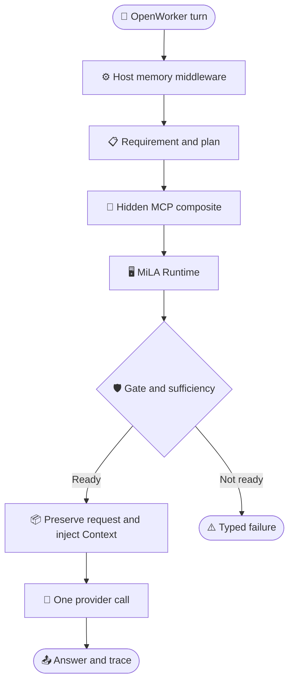

# MiLAi DG-13 Product Usability Goal：OpenWorker MCP 接入可用性

_Goal ID：`DG-13` · 文档版本：`0.5.0 CONDITIONAL ACCEPT / DOCUMENT REBASE COMPLETE / PRODUCT NOT YET USABLE` · 日期：`2026-08-25`（Asia/Shanghai） · Release object：OpenWorker 通过 Host-controlled MCP prefetch 稳定使用 MiLA governed memory · 本轮仅修订文档，不修改代码、Schema、Runtime、实验状态或 frozen architecture_

---

## 📋 1. 审查决定与文档边界

### 1.1 Product Goal 的唯一主目标

DG-13 的产品可用性目标正式收敛为：

> **完成 OpenWorker 的 MCP 接入使用，使 OpenWorker 在真实 provider execution 前，由 Host 自动、正确、稳定且有界成本地取得 MiLA Context。**

这意味着 `DG13-USABILITY` 的 release object 不是单独的检索器、合同集合或 benchmark 分数，而是以下真实纵向链：

```text
OpenWorker user turn
→ OpenWorker provider request
→ Host task / memory planning
→ hidden MCP milai_prepare_context
→ MiLA Runtime + Canonical Gate
→ governed Context injection
→ provider execution
→ answer + joined trace
```

`auto` 模式中 OpenWorker/agent/catalog-visible 的 `milai_recall` tool-loop 只保留为 compatibility lane；CURRENT tool call 由 adapter 在不调 provider 的首轮合成，不是 provider model 自主决定。它不是 DG-13 的首选可用性路径，也不作为 U1 PASS 的替代证据。

### 1.2 当前审查状态

| **项目** | 状态 | 含义 |
| --- | --- | --- |
| DG-13 文档 | `CONDITIONAL ACCEPT` | 核心方向接受，必须 usability-first |
| Document rebase | `COMPLETE` | 产品、研究、formal integrity 已拆 lane |
| Review direction | `CONDITIONALLY ACCEPTED` | usability-first 方向接受，产品尚未达标 |
| 实现授权 | `U0 READ-ONLY BASELINE NOT BLOCKED BY ADR；U1 REQUIRES ADR/OWNER` | 本文本身不授权改代码 |
| ADR-024 | `PROPOSED / NOT ACCEPTED` | 接受前不得宣称 vNext contract 已冻结 |
| DG12 candidate | `FROZEN` | 不改写、不补跑、不借 DG13 修正 |
| Frozen architecture | `architecture/v1.0` | 仍是最高优先级规范 |
| Runtime / Schema | `0.1.x EXPERIMENTAL / NO-GO` | DG-13 不改变此状态 |
| Product boundary | `LOCAL / SYNTHETIC OR INDEPENDENTLY-DEIDENTIFIED` | 不宣称 production、remote MCP 或真实个人数据可用 |

### 1.3 三条 lane

本次 rebase 将旧单体文档拆成三条相互引用但独立授权的 lane：

- 本文：`DG13 Product Usability Goal`，只负责 OpenWorker MCP 产品接入、U0–U4 与 release gates
- [DG13 Research and Benchmark Plan](MiLAi_DG-13_Research_and_Benchmark_Plan.md)：本地项目对照、benchmark、消融与研究候选
- [DG13 Formal Evaluation Integrity](MiLAi_DG-13_Formal_Evaluation_Integrity.md)：DG12 label incident、manifest、holdout 与 formal-run gate
- [DG13 v0.3.0 pre-rebase archive](docs/reports/MiLAi_DG-13_v0.3.0_pre_usability_rebase.md)：完整历史设计与证据账本；不是实现授权

Formal lane 在 policy/governance 层要求停止正式论文实验，但该 stop 尚未改写机器状态；它不阻断使用 synthetic、public development split 或 independently sourced deidentified trace 的 U0/U1 产品开发。

### 1.4 事实标签

本文使用以下标签：

- **Observed / CURRENT**：代码、测试或机器产物直接支持
- **Documented**：文档声明，但不能替代 executable evidence
- **Proposed / DG13**：本 Goal 的目标状态
- **Gap**：CURRENT 与 Proposed 之间的差异
- **[INFERENCE]**：多项迹象支持但没有明确 contract
- **[UNKNOWN]**：repository 不能确认

## 🔍 2. 当前 OpenWorker MCP 实现与真实缺口

### 2.1 CURRENT 主链

`host_adapter.py` 中的 `prefetch` 分支已实现 Host-controlled memory access：Task/Need 在 provider 前解析，再直接调用未向模型列出的 `milai_prepare_context`。下图是 **CURRENT code path**，不代表当前 package 已通过真实 OpenWorker 组合 E2E：


真实控制点如下：

| **职责** | CURRENT implementation | 观察 |
| --- | --- | --- |
| Provider interception | `integrations/openworker-mcp/src/milai_openworker_mcp/host_adapter.py::OpenWorkerProviderAdapter.complete()` | 在 provider 前执行 Task、Need 和 Context |
| Task binding | `host_adapter.py::_bind_task_state()`；`task_binding.py::HostTaskRegistry` | deterministic；registry 为进程内对象 |
| Need | `integrations/python-client/src/milai_client/memory_need.py::DeterministicMemoryNeedResolver.resolve()` | 英文 regex/token 为主 |
| MCP bridge | `controller.py::McpPrepareContextClient.prepare_context()` | 调用隐藏 `milai_prepare_context` |
| UDS transport | `transport.py::McpUnixClient.prepare_memory_context()` | 持久同步 MCP session；bounded deadline/frame |
| Broker | `broker.py::Broker` | profile-scoped socket；每连接一个固定 MCP child |
| Runtime orchestration | `runtime/src/milai/application/context_preparation.py::PrepareContextService.prepare()` | `NONE/CACHE/L0/L1` validation 与 retrieval |
| Host slot | `task_memory.py::TaskMemoryController.prepare_context()` | 保存 token、coverage 与 rendered Context |
| Context injection | `host_adapter.py:1205` `compile_agent_messages()` | 再调用 `ProviderExecutionGateway` |
| Failure | `host_adapter.py:944-977,1122-1135` | MCP/Context unavailable 返回 `UNKNOWN`，provider 不调用 |

这条代码路径有三个必须保留的 CURRENT 限定：

- `integrations/openworker-mcp/openworker/Dockerfile` 只复制 relay 和 OpenCode config；它没有把 adapter、broker、Runtime 和 provider 组合成一个产品启动单元。
- `host_adapter.py` 当前是 `MiLAiOpenWorkerF1Adapter/1`；`_question()` 只取最后一条 user text，`f1_contract.py::request_payload()` 重建固定 Qwen/F1 JSON 请求。它不是能保留原始 messages、model、tools、tool choice 和 generation parameters 的通用 Provider middleware。
- `milai_prepare_context` 是 `tools/list` 中的 hidden operation，但知道精确名称的 client 仍可直接调用。安全边界来自 server-side profile/policy/scope 重绑，不是“hidden”本身。

### 2.2 CURRENT 已证明什么

CURRENT 证据必须按代码身份与 E2E 深度分层：

| **Evidence layer** | CURRENT evidence | 状态 | 能证明与不能证明什么 |
| --- | --- | --- | --- |
| Current package surface | `pyproject.toml` 入口为 `broker:main`、`relay:main`、`host_adapter:main`；旧 `adapter.py` 被 wheel exclude | `OBSERVED` | 证明当前入口身份；不证明组合启动 |
| Components | `test_transport.py`、`test_controller.py`、`test_task_binding.py`、MCP profile tests | `COMPONENT EVIDENCE` | 覆盖 bounded transport、profile 重绑、task transitions；不是 OpenWorker E2E |
| Current direct control | `evals/agent_integration/fast_path_shadow.py`；DG12 frozen equivalence summary 报告 20 turns、task relation `20/20`、hidden provider calls `0` | `DIRECT SHADOW` | 证明当前 `host_adapter`/task-binding control plane；故意不调 provider，不证明 Context 注入后回答 |
| Historical real OpenWorker | DG10 auto/prefetch local candidate artifacts 与 `f1_openworker.py` harness | `HISTORICAL / MIXED IDENTITY` | 证明过去的 local synthetic chain 可组合；auto 使用旧/eval adapter，prefetch E2E 绑定的旧 wheel 不含当前 `host_adapter` |
| Current exact-wheel E2E | 未找到 current wheel + current `host_adapter` + real OpenWorker + provider + broker/MCP/Runtime 的同一 artifact | `MISSING` | 不能声称 OpenWorker MCP 已可用 |

因此 CURRENT 的最高可支持表述是：

> **OpenWorker MCP 安全受限本地候选已具备组件与历史链路证据；当前 usability-first host-prefetch 路径尚处于 exact-current E2E 与产品化接线未完成状态。**

### 2.3 当前关键缺口

**Gap A — 现有成功以 evaluation harness 为中心。**

`evals/agent_integration/f1_openworker.py` 和 DG10 runners 能搭建真实容器与 synthetic fixture，但当前 release 状态仍是 local candidate/review required。DG-13 必须把“可重放实验”收敛成“有明确支持范围、失败合同与操作入口的 OpenWorker MCP 产品 smoke”。

**Gap B — Need 对中文与自然表达覆盖不足。**

`memory_need.py:16-33` 使用 `[a-z0-9]+` 和英文 regex。未命中 current/history/conflict/explanation token 时，`resolve()` 在 `:201-205` 返回 `NONE / NO_TYPED_MEMORY_INTENT`。因此中文 memory-dependent question 可能被静默解释为不需要 memory。

**Gap C — CACHE miss 是 terminal。**

`PrepareContextService._cache_miss()` 在 `context_preparation.py:555-575` 返回 `DEGRADED/ABSTAIN` 与 `next_route_recommended`，但 `OpenWorkerProviderAdapter.complete()` 不在同一逻辑调用继续执行 L0/L1；随后 unavailable Context 被终止为 `UNKNOWN`。

**Gap D — Need、Availability 与 Outcome 仍混合。**

MCP socket、broker 或 Runtime 不可达时，`host_adapter.py:944-977` 返回 `HOST_MCP_PREFETCH_FAILED` 和通用 `UNKNOWN`。这能 fail closed，但不能区分：

```text
NO_MEMORY_NEEDED
MEMORY_REQUIRED_BUT_UNAVAILABLE
MEMORY_AVAILABLE_BUT_INSUFFICIENT
MEMORY_BLOCKED_BY_GOVERNANCE
```

**Gap E — Task/slot 只在当前 adapter process 内连续。**

`OpenWorkerProviderAdapter.__init__()` 创建 `HostTaskRegistry`、`_task_contexts` 与 `_last_need_by_task_key`。CURRENT 没有 durable registry owner。第一版不能据此宣称 restart、cross-session 或 portable lease。

**Gap F — 可见 MCP tool 与 Host prefetch 叙事仍并存。**

OpenWorker image 的 `opencode.json` 启用 `milai` MCP。CURRENT `_should_recall("auto")` 恒为 true；当 recall tool 被广告且尚无 result 时，adapter 在 provider 前直接合成 tool call。因此 `auto` 是 **adapter-forced visible recall round**，不是模型自主决定是否调 memory。`prefetch` 不产生 visible memory tool event。U1 必须冻结主路径身份，防止用历史 `auto` 成功替代 current host-prefetch 成功。

**Gap G — 当前 adapter 不保留通用 OpenAI/OpenWorker provider 语义。**

`host_adapter.py::_question()` 丢弃除最后 user text 以外的 conversation 语义；`f1_contract.py::request_payload()` 固定 model、temperature、token budget、JSON schema 和 non-streaming upstream request。OpenWorker 的其他 tools、tool results、system messages、model selection 和 generation options 没有被透传证明。

**Gap H — Host task metadata 的产品 producer 与延迟结果接线缺失。**

Task ID fallback 顺序是 incoming `user` → configured `task_session_id` → per-request generated ID。Repository 中未找到真实 OpenWorker 产品代码生产 `milai_task_state/relation/operation_id`；相关 payload 目前主要由 tests 和 `fast_path_shadow.py` 构造。`HostTaskRegistry.begin_operation()`、`bind_tool_result()` 和 action authorization 有实现/测试 precursor，但未连入当前 adapter 产品路径。

**Gap I — 组合启动、恢复、并发与失败语义未闭合。**

CURRENT 没有统一 launcher/supervisor 负责 Runtime、broker、adapter、OpenWorker 和 provider 的 readiness/shutdown。Broker restart 会产生新 socket inode，需显式重建/remount Worker capability。Adapter 内的 hidden MCP 调用受全局 lock 串行化；provider exception 与部分 capability/ledger failure 未统一映射为稳定 OpenAI-compatible terminal。

## 🎯 3. 可用性定义与 release boundary

### 3.1 正式定义

对 OpenWorker turn `t`：

```text
OpenWorkerMcpUsable(t) =
    Reachable(t)
    AND MemoryCorrect(t)
    AND ProviderInjected(t)
    AND BoundedCost(t)
    AND ExplicitDegradation(t)
    AND Traceable(t)
```

其中：

```text
MemoryCorrect(t) =
    AddressCorrect
    AND ScopeCorrect
    AND TimeValid
    AND AuthoritySatisfied
    AND CanonicalGatePass
    AND EvidenceSufficient
```

对每个声明支持的 query class，系统必须：

1. 返回当前、scope 匹配、authority 合法且通过 Canonical Gate 的 Context，并在 provider 前注入；或
2. 返回明确且分离的 memory status 与 execution action，例如 `status=MEMORY_REQUIRED_BUT_UNAVAILABLE` + `execution_action=RETRY|ASK_USER|ABSTAIN`。

以下行为一律不算可用：

- memory-dependent query 被静默路由为 `NONE`
- wrong task/scope Context 被复用
- snapshot 被标为 `CURRENT`
- MCP failure 被解释为 no-memory
- CACHE miss 终止，而 primary route 实际可用
- provider 使用了 memory，但 Host/Runtime trace 无法闭合
- `auto` tool-loop 成功被计为 `prefetch` 产品通过

### 3.2 第一版支持范围

| **维度** | U1 支持 | 非声明范围 |
| --- | --- | --- |
| Host | 一个本地 OpenWorker/OpenCode deployment | 多 Host federation |
| Transport | MCP over profile-scoped UDS | Direct、HTTP、remote MCP |
| Memory mode | Host-controlled `prefetch` | `auto` 仅 compatibility |
| Consistency | Proposed Host `STRICT_CURRENT`，映射到 CURRENT Runtime `CANONICAL_REQUIRED` | offline current、snapshot injection |
| Capability | `reader-lite` read | capture/proposal/review/revoke |
| Data | synthetic、public dev、independently sourced deidentified | real personal/production data |
| Task continuity | same adapter process；已验证的 Host task metadata producer | durable cross-process registry |
| Provider | local OpenWorker provider semantics 的声明支持子集 | arbitrary external provider、未声明 API extension |
| Query | 中英文 current-state exact；NONE；typed failure | general multi-hop/reconstructive |

### 3.3 Release boundaries

| **Boundary** | 产品含义 | 最低能力 |
| --- | --- | --- |
| `U1 — Usable OpenWorker Current-State Memory` | OpenWorker 通过 hidden MCP 正确完成 current-state read→Context→provider | fresh start、exact、CN/EN、same-call fallback、typed strict failure、joined trace |
| `U2 — Usable Bound Reuse` | 同一进程 task continuity 下安全复用并正确失效 | binding generation、validated lease、task/scope/head/issue changes |
| `U3 — Usable General Retrieval` | OpenWorker 可在有界成本下处理声明支持的一般 retrieval | temporal/FTS、filtered vector、conditional rerank、sufficiency stop |
| `U4 — Operable Materialization` | 写入与 projection 增量化，不阻塞 online correctness | delta outbox、watermark、projection degradation semantics |

U1 是第一个可发布的 scoped product milestone。U2/U3/U4 不能作为延迟 U1 的理由。

### 3.4 U1 user-visible acceptance story

```text
Given
    a fresh local OpenWorker deployment
    a reader-lite MCP socket capability
    a governed synthetic current-state fixture
    an explicit task identity produced by the OpenWorker Host integration

When
    the user sends a supported Chinese or English current-state request

Then
    Host resolves EXACT before provider execution
    one hidden MCP composite call obtains gated current Context
    the provider receives that Context without a visible memory tool turn
    the answer and AccessTrace share closed identities

And when
    MCP or Runtime is unavailable

Then
    the user receives a typed memory-unavailable outcome
    no stale/current claim is fabricated
    no memory-dependent provider answer is executed
```

U1 必须提供一个 operator-facing start→smoke→report→cleanup 入口。该入口的文件名、参数、fixture hash 与 report schema 在 U0 冻结；当前为 **[PROPOSED / NOT IMPLEMENTED]**。

## 🏗️ 4. U1 目标架构与 ownership

### 4.1 OpenWorker MCP 主路径



Normative U1 ordering：

```text
OpenWorker request
→ resolve explicit Task identity/relation
→ resolve MemoryRequirement
→ build MemoryAccessPlan
→ if NONE: skip MCP
→ otherwise: one hidden milai_prepare_context logical call
→ Runtime may try CACHE then EXACT in that same composite call
→ Canonical Gate
→ Sufficiency
→ ContextCapsule
→ inject into provider messages
→ exactly one provider answer call
→ AccessOutcome + AccessTrace
```

### 4.2 Ownership

| **Decision / state** | Owner | U1 rule |
| --- | --- | --- |
| Execution Task identity | OpenWorker Host | 必须有真实 metadata producer；retrieval/LLM 不得建立 identity |
| Task relation | Host deterministic resolver | ambiguous 不得复用旧 Context |
| MemoryRequirement | Host middleware | CN/EN current-state 必须覆盖 |
| Transport availability | MCP client/broker observation | 不改变 Requirement |
| Route execution | MiLA Runtime | CACHE miss 在 composite call 内 fallback |
| Canonical applicability | Runtime Canonical Gate | Context/graph/search 不得绕过 |
| Context assembly | Host controller + governed compiler | turn-local；不成为 truth |
| Provider execution | OpenWorker provider middleware | 仅在 outcome 允许时执行，并保留声明支持的 provider 语义 |
| Canonical write | Existing Evidence→Proposal→Steward path | U1 reader Host 无 write authority |
| Trace | Host + Runtime joined identity | payload-free control facts可审计 |

### 4.3 MCP 的定位

U1 采用：

```text
Memory semantics = MemoryRequirement + MemoryAccessPlan + Gate + Outcome
Transport        = MCP over UDS
```

因此：

- MCP 是 U1 唯一实现的 transport adapter
- `MemoryRuntimeClient` 可作为 transport-neutral internal interface 设计
- U1 不实现 Direct 或 HTTP
- U1 不要求三 transport golden parity
- 只有 matched profiling 证明 residual transport cost material，后续才评估 Direct
- OpenWorker/provider model 不决定是否调用 hidden memory operation

## ⚙️ 5. 最小合同与 first-release policy

### 5.1 首批五个公共合同

| **合同** | 回答的问题 | 首批必要字段 |
| --- | --- | --- |
| `MemoryRequirement` | 本 Turn 需要什么 | kind、intent、scope、state refs、authority、consistency |
| `MemoryAccessPlan` | Host 准备怎样访问 | requirement、stages、runtime/host capabilities、budgets、fallback policy |
| `MemoryLease` | retained Context 覆盖什么 | task/binding generation、coverage、dependencies、position、expiry |
| `AccessOutcome` | 最终发生了什么 | memory status、execution action、terminal stage、currentness |
| `AccessTrace` | 为什么这样执行 | requested/planned/attempted/terminal、fallback、call counts |

上述五项是 **Proposed public freeze set**，不是 CURRENT architecture contract；只有 ADR-024 和 owner 接受后才能冻结。第一阶段不把以下概念全部升级为独立、版本化 wire schema：

- `TaskIntentFrame`：resolver internal DTO
- `MemoryAvailability`：Plan/Outcome field
- `MemoryCapabilities`：MCP handshake/Plan field
- `ConsistencyRequirement`：Requirement/Plan field
- `ExecutionPolicy`：Plan field
- `SufficiencyDecision`：Runtime internal decision + Trace field

这保留语义分离，同时限制 serialization、migration、compatibility 与 public API surface。

### 5.2 MemoryRequirement v0.1

```yaml
MemoryRequirement:
  kind: NONE | EXACT | SEARCH | RECONSTRUCT
  intent: CURRENT_STATE | HISTORICAL_STATE | EXPLANATION | EVIDENCE_REQUEST
  scope: {}
  state_keys: []
  claim_ids: []
  issue_ids: []
  temporal_mode: CURRENT | HISTORICAL | RANGE | UNKNOWN
  evidence_depth: STATE_ONLY | SUPPORT_POINTERS | RAW_EVIDENCE
  required_authority: INFORMATIONAL | ACTION_SAFE | USER_CONFIRMED
  consistency: STRICT_CURRENT
```

U1 只实现 `NONE` 与 `EXACT / CURRENT_STATE / STRICT_CURRENT`。`SEARCH` 是 U3；`RECONSTRUCT` 默认禁用。

### 5.3 AccessOutcome v0.1

```yaml
AccessOutcome:
  status: NO_MEMORY_NEEDED | CONTEXT_READY_CURRENT | MEMORY_REQUIRED_BUT_UNAVAILABLE | MEMORY_INSUFFICIENT | GOVERNANCE_BLOCKED
  execution_action: CONTINUE | ABSTAIN | ASK_USER | RETRY
  provider_execution: ALLOWED | PROHIBITED
  terminal_stage: NONE | CACHE | EXACT | GATE | SUFFICIENCY | TRANSPORT
  context_digest: null
  canonical_position: null
  reason_code: null
  trace_id: null
```

U1 不提供 `CONTEXT_READY_SNAPSHOT`。Runtime/MCP 不可达且 Requirement 非 `NONE` 时，`STRICT_CURRENT` 必须保留 memory failure reason，再由独立 `execution_action` 决定 abstain/ask/retry；不能执行 memory-dependent answer。与 ADR-024 现有合并结果名的 compatibility mapping 为：`ASK_USER`→`ASK_USER`、`ABSTAINED`→`ABSTAIN`、`RETRY_REQUIRED`→`RETRY`；原始 memory reason 仍保留在 `status`。

### 5.4 MemoryLease v0.1 的阶段边界

`MemoryLease` 在 U1 只冻结最小 schema，不作为 U1 功能依赖；实际 bound reuse 在 U2 上线。

必要语义：

```yaml
MemoryLease:
  task_id: ""
  task_generation: 0
  binding_generation: 0
  scope_digest: ""
  requirement_coverage: {}
  dependency_frontier: {}
  canonical_position: 0
  context_digest: ""
  issued_at: ""
  expires_at: ""
  currentness: CURRENT_AT_VALIDATION | VALIDATED_SNAPSHOT | UNASSURED
```

硬规则：

- lease 不是 truth source
- TTL 未过只表示 locally unexpired，不证明仍 `CURRENT`
- U2 每次 reuse 仍在线验证 canonical frontier
- Runtime 不可达时，U1/U2 均不得用 lease 回答 `STRICT_CURRENT`
- offline snapshot body、revoke propagation、retention 与 user-visible timestamp 需要独立 ADR

### 5.5 Task 与 write policy

第一版明确选择：

- **Task continuity**：同一 `OpenWorkerProviderAdapter` 进程内；restart 后不复用旧 slot/lease
- **Task input**：U1 必须提供并验证 OpenWorker-side producer，每 Turn 传入 explicit `milai_task_state`、relation 和需要时的 operation identity；CURRENT 尚未找到该产品 producer
- **Durable owner**：`[UNKNOWN]`；未决定前不宣称 portable lease 或 cross-session continuity
- **Read authority**：普通 OpenWorker 使用 `reader-lite`
- **Write authority**：不随 U1 授权；Evidence capture、Proposal、review、revoke 保持独立 profile 与治理链
- **Fixture seeding**：U1 测试数据由受控 setup/steward path 写入，不由 reader Agent 写 canonical memory

## 🔄 6. Usability-first work packages

### 6.1 U0 — Current path baseline

目标：把 CURRENT OpenWorker MCP path 变成可重放、可归因的 development baseline，不改变 memory semantics。

交付物：

1. 冻结当前 package/image/MCP executable/Runtime migration/provider/tokenizer identities
2. 一条 synthetic 或 independently sourced deidentified replay manifest
3. 从 OpenWorker request 到 AccessTrace/Provider ledger 的 join key
4. 阶段 latency：OpenWorker、adapter、UDS、MCP handler、Runtime、Gate、compile、provider
5. 当前 `NONE/CACHE/L0/L1` compatibility mapping
6. 当前 failure outcome inventory
7. 一条无 formal label access 的 developer smoke
8. 明确现有 DG10 artifact 是 baseline evidence，不是 DG13 PASS

U0 exit：

```text
same input manifest
→ reproducible path identity
→ complete control trace
→ every expected Provider/MCP call joined and reconciled
→ no unaccounted Provider or MCP call
→ no formal holdout access
```

### 6.2 U1 — Usable OpenWorker Current-State Memory

U1 分三个连续、可单独诊断的 slice。

#### U1-A：OpenWorker MCP product shell

- 使用当前精确 wheel 在 fresh local environment 启动 Runtime、broker、OpenWorker、provider middleware 与 local provider
- OpenWorker 只获得 reader-lite socket capability，不获得 MiLA token/DSN
- MCP initialize/catalog/profile/scope/executable identity 可验证
- 冻结 OpenWorker task metadata producer contract，不依赖 test-only 私有字段注入
- 保留声明支持的 OpenAI/OpenWorker semantics：multi-turn messages、system messages、model、stream、tools/tool choice、tool results 和 generation parameters
- non-memory request 不因 recall tool catalog 或 `memory_mode=none` 而错误终止
- 一个命令完成 start→smoke→cleanup，并输出 bounded report
- `prefetch` path identity 固定；`auto` 结果不得混入
- readiness 覆盖 Runtime、broker child、adapter、OpenWorker 与 provider；broker restart/inode 变化有明确恢复策略
- failure/cleanup 后不遗留 broker child、socket capability 或 test database

#### U1-B：Exact read and provider injection

第一 memory-semantics behavior-changing unit：

```text
explicit Host task
+ Chinese or English CURRENT_STATE query
+ one governed StateKey family
→ MemoryRequirement EXACT
→ exact canonical address
→ ClaimHead / ClaimVersion
→ ECS / Canonical Gate
→ minimal ContextCapsule
→ provider injection
→ one answer call
→ joined AccessTrace
```

实现从一个 StateKey family 起步，但 U1 release gate 至少覆盖 U0 冻结的三个代表性 family，并包含 alias collision、wrong scope 与 OpenIssue negative cases。具体 family 名称在 ADR/U0 fixture manifest 中冻结；当前为 `[UNKNOWN]`。

#### U1-C：Same-call fallback and typed failure

- retained candidate miss/coverage miss/stale 时，在同一个 `milai_prepare_context` composite call 内执行 primary `EXACT`
- trace 明确 `attempted_stages=[CACHE, EXACT]` 与 fallback reason
- MCP/Runtime unavailable 返回 `MEMORY_REQUIRED_BUT_UNAVAILABLE`
- governance failure 返回 `status=GOVERNANCE_BLOCKED`，并单独设置 `execution_action=ABSTAIN|ASK_USER|RETRY`
- memory-dependent strict-current failure不调用 provider
- non-memory query 可绕过 MCP，并允许一次 provider call
- 不使用 `UNKNOWN` 同时表达 no-memory、transport failure 与 insufficient evidence
- broker/child/Runtime/provider timeout、malformed response 与 capability/ledger error 映射为稳定 OpenAI-compatible terminal

U1 的 product scope 仅为 reader/informational memory access，不授权 MiLA canonical write 或 action-safe execution。但 OpenWorker 的普通非 memory tool 语义不能被 middleware 破坏。如果声明支持 asynchronous/delayed tool result，必须将 `HostTaskRegistry.begin_operation()`/`bind_tool_result()` 接入产品路径；否则 U1 manifest 必须明确标为 unsupported，不得由单测推导为已支持。

U1 release label：

```text
DG13-U1 = LOCAL_OPENWORKER_MCP_CURRENT_STATE_USABLE
```

该 label 不等于 production-ready、remote-ready、formal benchmark pass 或 general retrieval ready。

### 6.3 U2 — Bound reuse and lifecycle

U2 只在 U1 PASS 后单独授权：

- 把现有 `TaskMemorySlot` 映射为 task/binding-bound `MemoryLease`
- 同 task、同 scope、同 profile、同 Need coverage 才能成为 reuse candidate
- 每次 reuse 在线检查 canonical position、Claim head versions 与 OpenIssue revisions
- head、issue、goal、scope、profile、generation 或 revoke 变化立即失效
- lease miss 自动回落到 exact，不终止 Turn
- wrong-task reuse、false reuse 与 stale-current acceptance 必须为 `0/N`
- 第一版仍为 same-process reuse；restart 后丢弃 lease
- durable Task/Binding registry 必须由后续 owner decision 明确

### 6.4 U3 — Bounded general retrieval

U3 在 U2 产品链稳定后增加：

```text
exact
→ temporal / scoped FTS
→ filtered vector
→ conditional small-set rerank
→ evidence recovery
→ explicit abstention
```

每个 stage 由 query type、candidate cap、latency/token budget 与 evidence sufficiency 控制。Graph、DAG tags、learned task resolver 和 reconstructive L2 不进入 U3 默认路径。

### 6.5 U4 — Incremental materialization

U4 独立处理 cold build：

- synchronous：raw Evidence、provenance、canonical commit、ClaimHead、必要 address projection、outbox position
- near-line async：FTS、embedding、entity/time projection、lexical enrichment
- low priority：clustering、graph/tag/summary candidate
- delta materialization，不因单个 update 重建全 history
- projection watermark 与 canonical position 分离
- projection unavailable 时 exact canonical 仍正确；search 可以 typed degrade，不能返回旧 truth

**Research lane.**

以下工作移出产品 critical path：

- external project native characterization
- LongMemEval/Memora/HorizonBench formal comparisons
- large factorial lease experiment
- novelty/prior-art workflow
- graph/reconstructive L2
- Direct/MCP matched transport experiment

详见 [Research and Benchmark Plan](MiLAi_DG-13_Research_and_Benchmark_Plan.md)。

## ⚡ 7. Structural Cost Contract

Latency threshold 在 U0 baseline 后冻结；以下有界工作量现在即为规范性目标。

### 7.1 NONE

```text
MCP calls               = 0
memory LLM calls        = 0
embedding/vector/rerank = 0
provider calls          = 1 when request is otherwise valid
```

### 7.2 EXACT

```text
auxiliary LLM calls       = 0
embedding calls           = 0
vector search             = 0
reranker calls            = 0
broad canonical scan      = 0
OpenWorker→MCP logical call ≤ 1
provider answer calls      = 1 on CONTEXT_READY_CURRENT
```

路径固定为：

```text
optional retained-candidate validation
→ exact address
→ Canonical Gate
→ minimal hydrate
→ Context
```

如果 retained candidate miss，`CACHE→EXACT` 必须发生在同一 composite Runtime operation 中，而不是返回一次 degraded 后等待下一 Turn。

### 7.3 SEARCH

```text
temporal/scoped FTS first
filtered vector only when insufficient
reranker conditional only
candidate cap per stage
token and deadline enforced
stop immediately after sufficiency
```

### 7.4 RECONSTRUCT

```text
default disabled
fixed max rounds
fixed max retrieval calls
fixed max fanout
fixed token budget
no new evidence → stop
authority unavailable → abstain
```

### 7.5 MCP lifecycle

- one task-long persistent `McpUnixClient` session is preferred inside the adapter process
- broker maintains one MCP child per connection
- connect/request/frame/deadline bounds remain enforced
- no reconnect may select a broader profile, scope or transport
- provider call count and MCP call count必须从真实 ledgers 计算
- hidden prefetch must show zero model-visible memory tool events
- cleanup must close adapter session, broker child and socket

## 📊 8. Test matrix and Usability Gate

### 8.1 最小真实 E2E matrix

| **类别** | 真实用例 | CURRENT | U1 预期 | 必查事实 |
| --- | --- | --- | --- | --- |
| Exact-current composition | real OpenWorker→current `host_adapter(memory_mode=prefetch)`→broker/MCP→Runtime→provider injection/execution | `MISSING / NOT RUN`；仅有 components + current direct shadow + historical mixed-identity evidence | PASS | package/catalog/readiness identity 闭合 |
| Prefetch | `NONE`、READY、CACHE 三类 Turn | `PARTIAL`：旧 wheel E2E + current direct shadow | PASS | NONE=0 MCP；memory need≤1 hidden call；visible memory tool=0；Context 在 prompt |
| Auto compatibility | current exact chain 的 visible recall round | `PARTIAL / HISTORICAL` | compatibility regression | adapter-forced tool call；missing/malformed result 终止；不计 U1 prefetch PASS |
| Provider compatibility | multi-turn、model、stream、tools/tool choice、tool result、generation params | `FAIL` | declared subset PASS | memory middleware 不破坏非 memory 语义 |
| Task lifecycle | 并发 sessions；CONTINUE/SUBTASK/SWITCH/RETURN/AMBIGUOUS | `PARTIAL / DIRECT TEST ONLY` | PASS | 真实 metadata producer；ambiguous 不复用；无跨 task 污染 |
| Delayed result | tool invocation 后 switch/return，再绑定 result | `FAIL / UNWIRED` | PASS 或 manifest 明确 unsupported | result 回到 origin task；不授权 canonical action |
| Exact safety | CN/EN current、wrong scope/profile、alias collision、OpenIssue/revoke | `PARTIAL` | PASS | exact only；Gate；no stale/foreign/revoked Context |
| Same-call fallback | retained/coverage/head/issue miss | `FAIL` | PASS | 同一 composite 内 `CACHE→EXACT`；不 terminal miss |
| Failure | broker/child/Runtime/provider down、timeout、malformed、ledger/capability error | `PARTIAL/FAIL` | PASS | typed OpenAI-compatible terminal；strict memory need 时 provider=0；无 stale fallback |
| Restart/recovery | broker restart、socket inode 更换、adapter restart | `FAIL/PARTIAL` | PASS within declared policy | Worker capability remount/recreate；U1 restart 不复用 slot |
| Operations | one command start→health→smoke→stop→cleanup | `FAIL/PARTIAL` | PASS | 统一 launcher、readiness、shutdown、无 child/socket/DB leak |
| Security | Worker 无凭据；profile/scope/inode fail closed | `COMPONENT PASS` | current combined E2E PASS | DSN/token 不进 Worker；server policy 重绑；无 profile widening |
| Trace | 上述全部 cases | `PARTIAL` | PASS | requested→planned→attempted→terminal；Provider/MCP ledgers 对账 |

### 8.2 Correctness gate

所有 safety counters 必须报告 `0/N` 与单侧置信上界；`N=0` 不能 PASS：

```text
WrongTaskAcceptance              = 0 / N
WrongScopeAcceptance             = 0 / N
StaleCurrentAcceptance           = 0 / N
RevokedEvidenceReentry           = 0 / N
UnauthorizedAuthorityEscalation  = 0 / N
SilentMemoryNeedNone             = 0 / N
TerminalLeaseMiss                = 0 / N when EXACT is available
ModelVisibleMemoryToolUse        = 0 / N in prefetch U1
```

### 8.3 Functional gate

U1 必须同时满足：

- exact current wheel 可在 fresh environment 完成 real OpenWorker→middleware→broker/MCP→Runtime→provider 组合 E2E
- fresh OpenWorker can reach profile-scoped MCP，且 Runtime/broker/adapter/provider readiness 全部可查
- 声明支持的 multi-turn、stream、model、tools/tool result 与 generation parameters 得到透传或明确拒绝，不得被静默改写为 F1 request
- OpenWorker-side task metadata producer 通过 concurrent task/session 测试；delayed result 是端到端 PASS 或明确不在 U1 支持 manifest
- CN/EN current-state Need recall 达到 U0 冻结阈值
- at least three StateKey families 被正确 resolve
- exact answer Context 通过 scope/time/authority/Gate/sufficiency
- one hidden MCP composite call at most
- one provider call on success
- zero provider calls on strict memory unavailable
- no visible `milai_recall` event in prefetch
- cache miss same-call fallback
- broker/Runtime/provider 失败、broker inode 重启策略、adapter restart 限制和 typed terminal 可观测
- trace/ledger identities闭合
- one-command smoke and cleanup PASS

### 8.4 Efficiency and operability gate

必须分开报告：

| **Plane** | 核心指标 |
| --- | --- |
| OpenWorker control | Task/Need latency、MCP call rate、provider calls、tool events |
| MCP transport | connect、UDS roundtrip、handler overhead、session reuse |
| Runtime exact | address、Gate、hydrate、compile p50/p95/p99 |
| Retrieval | stage rate、candidate counts、escalation、context tokens |
| Lifecycle | reuse hit、coverage miss、invalidation、restart behavior |
| Operations | start/health/stop/cleanup、typed failure、trace completeness |

`U1 PASS` 不能只依赖 answer accuracy 或总 wall time；它要求 correctness、bounded cost、explicit degradation 与 traceability 同时成立。

### 8.5 Test ownership

- unit：Need resolver、Plan construction、Outcome mapping、Task transition
- contract：MCP request/response、five public contracts、compat mapping
- integration：middleware→broker→MCP child→Runtime
- E2E：current exact wheel 的 real OpenWorker→host prefetch→hidden MCP→Runtime→provider
- compatibility：multi-turn、stream、models、tools/tool choice、tool result、generation params
- fault injection：socket、broker、child、Runtime、provider、ledger/capability、stale slot、wrong scope
- regression：DG10 current local candidate scenarios
- formal benchmark：不属于 U1 product gate，受 Formal Integrity lane 管理

## 🔗 9. 决策清单、证据与停止条件

### 9.1 本次 conditionally accepted 的 Proposed 方向

- Host 在 provider 前自动控制 memory
- OpenWorker MCP prefetch 是第一产品 transport
- Requirement、Availability、Consistency 分离
- exact before search
- CACHE/lease 不是 semantic route 或 authority
- miss same-call fallback
- Canonical Gate before sufficiency
- Lease 不是 truth
- OpenWorker/agent/catalog-visible tool-loop 仅 compatibility；CURRENT 不得写成 provider model 自主决策
- P8/reconstructive L2 默认 parked

这些是 review direction，不是已冻结的 CURRENT architecture contract。Public contract freeze 与 behavior-changing implementation 仍等待 ADR-024 及 owner acceptance。

### 9.2 U1 前必须由 owner 接受的决定

1. 接受或修改 [ADR-024 Host-native Memory Control Plane](docs/adr/ADR-024-host-native-memory-control-plane.md)
2. 确认 U1 label 为 local/synthetic/independently-deidentified scoped usability
3. 冻结三个代表性 StateKey family 与 CN/EN fixture manifest
4. 冻结 strict failure 的 user-facing outcome：abstain、ask 或 retry 的映射
5. 确认第一版 same-process task continuity，不宣称 durable restart reuse
6. 确认 U1 仅 reader-lite read，不把 write capability纳入 release
7. 确认现有 MCP transport为唯一首发 transport
8. 冻结 U1 所声明支持的 OpenWorker/OpenAI provider request 子集
9. 确认 task metadata producer 所在与 delayed-result U1 支持边界

### 9.3 暂缓项

```text
Direct transport
HTTP transport
push invalidation
offline CURRENT
ALLOW_SNAPSHOT body injection
durable cross-process lease
full graph / DAG tags
reconstructive L2
learned Task resolver
full 2^4 lease experiment
formal paper benchmark
```

### 9.4 关键 repository evidence

- `integrations/openworker-mcp/src/milai_openworker_mcp/host_adapter.py::OpenWorkerProviderAdapter.complete()`
- `integrations/openworker-mcp/src/milai_openworker_mcp/f1_contract.py::request_payload()`
- `integrations/openworker-mcp/src/milai_openworker_mcp/controller.py::McpPrepareContextClient`
- `integrations/openworker-mcp/src/milai_openworker_mcp/transport.py::McpUnixClient`
- `integrations/openworker-mcp/src/milai_openworker_mcp/broker.py::Broker`
- `integrations/openworker-mcp/src/milai_openworker_mcp/task_binding.py::HostTaskRegistry`
- `integrations/python-client/src/milai_client/memory_need.py::DeterministicMemoryNeedResolver`
- `integrations/python-client/src/milai_client/task_memory.py::TaskMemoryController`
- `runtime/src/milai/application/context_preparation.py::PrepareContextService`
- `runtime/src/milai/domain/context_validation.py::need_covered()`
- `evals/agent_integration/f1_openworker.py::OpenWorkerHarness`
- `evals/agent_integration/fast_path_shadow.py`
- `integrations/openworker-mcp/openworker/Dockerfile`
- `integrations/openworker-mcp/openworker/opencode.json`
- `var/dg12/harness/freeze-cdf3d942aadeaa8e57743bf2691758303852c5f5047244a0acfe638f811bd16a/equivalence-summary.json`
- `contracts/agent/v1/openworker-mcp-uds.md`
- `docs/reports/DG-10-vllm-openworker-mcp-e2e-candidate.2.4-2026-08-20.json`
- `docs/reports/DG-10-openworker-mcp-host-gate-candidate.2-2026-08-20.json`

### 9.5 Stop condition

DG-13 产品 lane 在以下状态停止并交由 owner 决定下一授权：

```text
U0 evidence complete
AND ADR-024 accepted
AND U1-A/B/C gates PASS
AND independent review PASS
→ LOCAL_OPENWORKER_MCP_CURRENT_STATE_USABLE

otherwise
→ remain CONDITIONAL ACCEPT / NOT USABLE
```

U0 是只读 baseline characterization，不被 ADR-024 阻断；上述 stop condition 中的 ADR 是 U1 behavior change 的前置。U1 PASS 后才讨论 U2；U2 PASS 后才把 general retrieval 纳入 U3。Research 与 formal experiment 不得反向扩大 U1 的产品声明。

---

_Last updated：2026-08-25 · This Goal does not modify frozen DG12 state or architecture/v1.0._
