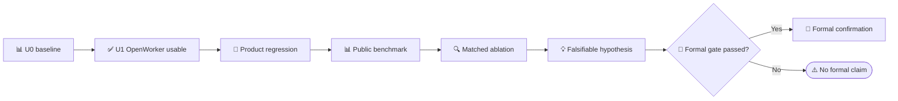

# MiLAi DG-13 Research and Benchmark Plan

_Document：`DG-13-R1` · 版本：`0.2.0 PLANNED / SEPARATE LANE / NOT IMPLEMENTATION AUTHORITY` · 日期：`2026-08-25`（Asia/Shanghai） · 前置条件：DG13 U1 产品链可用后才启动核心机制实验；formal claim 还需独立 integrity gate_

---

## 📋 1. Lane 定位与研究边界

### 1.1 本文负责什么

本文负责：

- 基于 DG12 当前 development evidence 恢复待解释的问题
- 审阅本地 OpenViking、Hindsight、Graphiti、Mem0 的真实机制
- 审阅本地 LongMemEval、LongMemEval-V2、Memora、HorizonBench 的可用范围
- 设计 matched benchmark、mechanism transplant、消融与 failure taxonomy
- 冻结研究指标和 claim ceiling
- 从可重复 mediator effect 中形成 research hypothesis

本文不负责：

- 阻断 [DG13 OpenWorker MCP Product Usability Goal](MiLAi_DG-13_MemoryAccessPlan与渐进检索_GOALS.md) 的 U0/U1
- 修改 DG12 frozen candidate
- 把外部 memory engine 接入 production route
- 把 benchmark 总分当作自动的 novelty claim
- 读取或使用尚未处置的 MiLA/DG12 formal holdout
- 授权 Provider spend、真实个人数据、remote MCP、Graph truth store 或 canonical write

### 1.2 顺序



Research 不得反向把下列内容塞回 U1 critical path：

```text
full graph
DAG tags
reconstructive agent
Direct + HTTP parity
large factorial lease study
formal benchmark orchestration
novelty search
```

### 1.3 研究优先级

```text
OpenWorker Task / Need / Access Planning
>
State Addressing and exact reachability
>
same-call fallback and validated reuse
>
query-aware FTS / temporal / scoped SQL
>
conditional reranker
>
filtered vector
>
graph / reconstructive retrieval
```

这个顺序来自当前代码与 profile，不是一般性的 memory system 排名。

## 📍 2. CURRENT 实验状态与待解释问题

### 2.1 Addressability 不等于 Reachability

DG12 retained evidence 显示：

- FP0：12 个 current-state needs 中 11 个有 initial canonical key，`StateAddressabilityRate=0.916667`
- FP0 machine artifact 同时写 `fast-path coverage NOT_FORMALLY_MEASURABLE`
- 历史 DG12 GOALS 摘要写 1/18，即 `0.055556`；这只能作为 documented diagnostic
- FP1：correct fast turns 为 2/18，`unsafe_cache_turns=2`
- later confirmation：route coverage 18/18，但 state-key resolution accuracy `0.733333`，门槛 `0.933333`，hard/non-inferiority gate FAIL

因此研究对象必须分成：

```text
Addressable(s)
    canonical state has a valid address

Reachable(s,t)
    current task and requirement produce a plan reaching that address

CorrectlyResolved(s,t)
    reached address is correct under task, scope, time, authority and issue constraints
```

对应证据：

- `var/dg12/runs/dg12-pd02-fp0-route-shadow-20260824-003/result.json`
- `var/dg12/runs/dg12-pd02-fp1-task-continuity-20260824-003/result.json`
- `var/dg12/performance/fast-path-profile.json`
- `var/dg12/harness/freeze-cdf3d942aadeaa8e57743bf2691758303852c5f5047244a0acfe638f811bd16a/equivalence-summary.json`

### 2.2 Deep retrieval 的 retained hotspot

一个 historical 10-case block 的 outer retrieval 为 `63.097s`；Runtime sibling stages 为 `51.584s`，adapter residual 为 `11.506s`。

| **Stage** | Total | Runtime query share | 解释边界 |
| --- | ---: | ---: | --- |
| `recent_canonical_ms` | `23.152s` | `44.9%` | 宽 current-head candidate construction |
| `reranker_ms` | `18.011s` | `34.9%` | retained block 的 CPU rerank |
| `fts_ms` | `9.352s` | `18.1%` | lexical candidate cost |
| `vector_ms` | `0.444s` | `0.9%` | 非该 block 主瓶颈 |
| `query_embedding_ms` | `0.299s` | `0.6%` | 非该 block 主瓶颈 |

前三项合计约 `97.9%` 的 Runtime query time。证据：
`var/dg12/runs/dg12-pd02-lb1-deep-readonly-20260825-001/deep-recovery-profile.json`。

这是 bounded development observation，不是 matched causal result。它支持先研究 candidate reduction 和 conditional reranking，不支持宣称 vector 永远不重要。

### 2.3 Cold materialization 是另一条成本轴

一次 frozen 10-case smoke 中：

```text
governed history build = 842.921s
first-phase share       = 92.376%
```

证据：`var/dg12/harness/product-vs-harness-ab.json` 与 `var/dg12/discovery/observations.jsonl`。

该 observation 只有一次 aggregate run，没有 variance、throughput scaling 或 causal attribution。Research 必须分三张表：

```text
Online OpenWorker Control
Deep Retrieval
Cold / Incremental Materialization
```

### 2.4 DG12 formal claim ceiling

截至本文日期：

| **Lane** | Machine status | 可用于 DG13 | 不可外推 |
| --- | --- | --- | --- |
| DG12-PD02 | `TERMINAL_TARGET_MISS` | current bottleneck diagnosis | broad speedup |
| DG12-ND02–05 | development signals | hypothesis generation | formal generalization |
| DG12-PE00V3 | `PASS_PROTOCOL_V3_FROZEN` | method matrix identity | method result |
| DG12-PE01V3 | `PASS_NO_LABEL_GATE` | no-label preflight | formal score |
| DG12-PE02V3 | `AUTHORIZED_FORMAL_RESOURCE_PREFLIGHT_PENDING` | planned denominator/resources | context/answer/score |
| DG12-PE03–09 | `BLOCKED_BY_PE02` | none | quality/retrieval/cost claim |

Official V3 counters remain：

```text
formal labels read = 0
formal contexts    = 0
formal answers     = 0
formal scores      = 0
provider calls     = 0
judge calls        = 0
```

Earlier same-family `run02` review nevertheless read a label-bearing source outside the receipt API。它没有生成 formal output，但造成 holdout admissibility incident。正式处置详见 [Formal Evaluation Integrity](MiLAi_DG-13_Formal_Evaluation_Integrity.md)。

该 integrity stop 目前是 policy/governance decision，不是已改写的 machine gate；CURRENT `formal_execution_blocker` 仍为 `CLEARED_BY_V3_NO_LABEL_GATES`。在 owner supersede/revoke 现有 authorization/state 前，不能依赖本文阻止 runner。

## 🔍 3. 本地 Memory 项目对照

### 3.1 Snapshot identity

本节按 executable code → tests/evals → docs 的优先级审阅；没有把任何项目接入 MiLA Runtime。

| **Project** | Snapshot | Worktree | DG13 用途 |
| --- | --- | --- | --- |
| OpenViking | `v0.4.16 / 499995f3ed2e` | detached clean | Host middleware、durable ingest、Context assembly |
| Hindsight | package `0.9.0` | 非独立 Git repo；commit `[UNKNOWN]` | temporal、provenance、watermark/no-clobber |
| Graphiti | `401c59a65bde / main` | clean | episodic refs、temporal candidate graph、bounded traversal |
| Mem0 | `001c235229be / main` | pre-existing modified `pyproject.toml` | scope serialization、batch、multi-signal ranking |

Workspace 没有名为 `memo` 的 repository；本文将用户所称“memo”映射为 `../mem0/`，标记为 **[INFERENCE]**。

### 3.2 Cross-system conclusion

| **System** | 最强可借鉴机制 | 默认检索特征 | Authority gap | DG13 decision |
| --- | --- | --- | --- | --- |
| OpenViking | provider 前 middleware、raw commit、quota Context | QUICK vector；THINKING hierarchy/rerank | LLM 可直接 upsert/delete memory | candidate transplant |
| Hindsight | multilingual temporal、source IDs、watermark | embedding+BM25+optional temporal/graph+rerank | observations/models 可变，无 Steward | candidate temporal/provenance |
| Graphiti | episode/entity/fact refs、bounded BFS | basic hybrid；advanced BFS/cross-encoder | LLM contradiction 原地失效 edge | shadow/L2 only |
| Mem0 | user/agent/run scope、batch write、score details | semantic+keyword+entity，optional rerank | vector record 为 primary memory | candidate adapters/diagnostics |

四者都能生产 candidate、projection、retrieval 或 Context；没有一个同时提供 MiLA 的：

```text
Task-conditioned access
Canonical ClaimVersion / ClaimHead
OpenIssue
Steward authority
revoke-aware Canonical Gate
validated task-bound lease
read/write capability separation
```

因此不会选择一个 engine 替换 MiLA。

## 📚 4. 可移植机制与拒绝边界

### 4.1 OpenViking

Observed：

1. `OpenVikingContextMiddleware.wrap_model_call()/awrap_model_call()` 在 provider 前自动 recall：
   `../OpenViking/integrations/langchain/src/langchain_openviking/middleware.py:75,189-251`
2. `Session.commit_async()` 先归档 raw messages、写 phase marker 与 durable queue，再恢复 projection：
   `../OpenViking/openviking/session/session.py:1794-2145,2197-2736`
3. `assemble_context()` 分开 quota、candidate、lazy read、detail tier、token plan 与 rewrite：
   `../OpenViking/openviking/retrieve/context_assembler/pipeline.py:52`
4. exact URI、directory scope、FTS local verification：
   `../OpenViking/openviking/retrieve/hierarchical_retriever.py:101-565`；
   `../OpenViking/openviking/storage/viking_fs/_grep.py:25-230`

DG13 的 matched-evaluation candidates：

- Host middleware pattern
- raw-first + durable projection queue
- exact locator / deterministic scope key
- quota、tier、lazy body Context compilation

DG13 拒绝：

- `MemoryUpdater.apply_operations()` 的 LLM direct upsert/delete：
  `../OpenViking/openviking/session/memory/memory_updater.py:748-1334`
- MCP remember/write/forget 直接成为 current truth：
  `../OpenViking/openviking/server/mcp_endpoint.py:235-1146`
- wrapper health failure时将 memory-required turn静默等同 no-memory

### 4.2 Hindsight

Observed recall：

```text
query embedding
→ semantic + BM25
→ temporal when constrained
→ graph expansion
→ RRF/interleave
→ usually cross-encoder
→ recency/temporal/proof boosts
```

证据：
`../hindsight/hindsight-api-slim/hindsight_api/engine/memory_engine.py:5741-6298`、
`../hindsight/hindsight-api-slim/hindsight_api/engine/search/retrieval.py:164-412,899-1031`。

DG13 的 matched-evaluation candidates：

- multilingual temporal parser：
  `../hindsight/hindsight-api-slim/tests/test_query_analyzer.py:450-826`
- source fact IDs、live-source filter 与 bounded links
- fixed cutoff、scoped watermark、delta provenance、failure no-clobber：
  `memory_engine.py:12464-13309`；
  `tests/test_mental_model_delta.py:312-1211`

DG13 限制：

- Observation/Mental Model 只能是 SearchProjection、Proposal candidate 或 Context
- `Bank` 是 namespace，不是 TaskIdentity
- `Reflect` 只可作为 bounded `RECONSTRUCT` research arm
- always-on embedding/rerank 只作 baseline，不进入 U1/U3 normative path

### 4.3 Graphiti

Observed：

- `EpisodicNode` 声明 raw content、valid time 与 edge refs；`episode_metadata` 当前没有在 save/query/parser 闭合：
  `../graphiti/graphiti_core/nodes.py:318-419`、
  `models/nodes/node_db_queries.py:30-121`、
  `driver/record_parsers.py:88-108`
- `EntityEdge` 保存 fact、episode UUID array、`valid_at/invalid_at/expired_at`：
  `../graphiti/graphiti_core/edges.py:263-370`
- basic `search()` 是 edge BM25+cosine+RRF；advanced `search_()` 使用 multi-scope BM25/cosine/BFS/cross-encoder：
  `../graphiti/graphiti_core/search/search_config_recipes.py:80-116`
- default search 不自动施加完整 current-only temporal applicability：
  `../graphiti/graphiti_core/graphiti.py:1527-1584`
- contradiction 可由 LLM 判断并原地改变旧 edge：
  `utils/maintenance/edge_operations.py:538-573,642-847`
- episode delete 在 endpoint 间不对称：
  `graphiti.py:1765-1793`；
  `server/graph_service/routers/ingest.py:99-102`
- current Neo4j path 是 `MATCH` 后 cosine/sort/limit；未观察到 ANN index：
  `driver/neo4j/operations/search_ops.py:284-343`、
  `graph_queries.py:28-163`

DG13 定位：

> 可重建、异步、带 source-episode references 和 temporal annotations 的 candidate graph；它不具备 MiLA 的 authority、revoke、OpenIssue 与审计语义。

它只允许：

```text
canonical outbox / Evidence refs
→ asynchronous graph projection
→ bounded candidate/BFS
→ MiLA Canonical Gate
→ Context
```

Graphiti 不得成为 ClaimHead、current-state resolver、write authority 或 U1/U3 default dependency。

### 4.4 Mem0

Observed V3 add：

```text
escaped user/agent/run scope
→ last 10 messages
→ top-10 vector dedup context
→ ADD-only LLM extraction
→ batch embedding
→ hash dedup
→ batch persist
→ best-effort entity links
```

证据：
`../mem0/mem0/memory/main.py:412,879-1070`、
`../mem0/mem0/configs/prompts.py:468,1016-1062`。

可借鉴：

- strict session scope serialization 与 collision tests：
  `../mem0/tests/memory/test_session_scope.py:26-71`
- batch embedding/persist
- entity as separate projection
- semantic、keyword、entity 分数诊断
- provider/vector-store adapter ergonomics

限制：

- `score_and_rank()` 在融合 lexical/entity 前先用 semantic threshold 过滤，可能丢 lexical-only hit：
  `../mem0/mem0/utils/scoring.py:60-137`
- vector payload 是主 memory，update/delete 原地改变：
  `../mem0/mem0/memory/main.py:2032-2130`
- SQLite history 不等于 ClaimVersion ledger：
  `../mem0/mem0/memory/storage.py:11-245`
- local `evaluation` submodule 未初始化；不引用 README 平台分数

### 4.5 Mechanism ledger

| **Mechanism** | Source | DG13 destination | Decision |
| --- | --- | --- | --- |
| provider-before recall | OpenViking | OpenWorker middleware | candidate transplant |
| raw commit + durable queue | OpenViking | Evidence/projection outbox | proposed matched test |
| exact URI/scope serialization | OpenViking/Mem0 | StateAddress/Binding | proposed matched test |
| multilingual temporal parser | Hindsight | Requirement/temporal search | proposed matched test |
| source IDs/live-source filter | Hindsight | Evidence recovery | proposed matched test |
| cutoff/watermark/no-clobber | Hindsight | Lease/frontier experiment | proposed matched test |
| quota/tier/lazy body | OpenViking | Context compiler | proposed matched test |
| multi-signal diagnostics | Mem0 | retrieval telemetry | proposed matched test |
| temporal graph fields/BFS | Graphiti | shadow L2 | shadow only |
| LLM direct update/delete | all | none | reject as authority |
| always-on hybrid/rerank | Hindsight/Graphiti/Mem0 | comparison arm | baseline only |
| full graph truth store | Graphiti-style | none | defer/reject |

## 🧪 5. 本地 Benchmark suite

### 5.1 Snapshot and integrity status

| **Benchmark** | Snapshot | Worktree/data status | Default DG13 role |
| --- | --- | --- | --- |
| LongMemEval | `main@9e0b455f4e` | dirty runner/judge；public local files unpinned | development QA/retrieval slices |
| LongMemEval-V2 | `main@2cc8c540bd` | code near-clean；downloaded data separately checksummed | primary product regression |
| Memora | `main@a6493188ef` | dirty API/dependency/local-judge changes | update/delete/forgetting regression |
| HorizonBench | `main@4b5076b147` | tracked clean；`data/hf` untracked | preference evolution regression |

这些 benchmark 的公开 gold/annotations 对方法开发者可见，默认身份统一为：

```text
PUBLIC DEVELOPMENT / PRODUCT REGRESSION
NOT MILAI FORMAL HOLDOUT
```

若进入 formal claim，必须另行冻结 dataset revision/checksum、independent split、query-time label isolation、method identity 与完整 failure denominator。

**Capability matrix.**

| **Benchmark** | State evolution | Temporal/update | Abstention | 关键限制 |
| --- | --- | --- | --- | --- |
| LongMemEval | multi-session/update | yes | 30 abs subset | retrieval排除abs；update judge不严格惩罚旧值 |
| LongMemEval-V2 | ordered state/action trajectories | dynamic state | premise-awareness abs | 无公开 retrieval labels；latency范围有限 |
| Memora | chronological update/delete | strong forgetting | no | FAMA非canonical currentness |
| HorizonBench | evolved preference + old distractor | evolution | no | forced-choice；无标准 memory latency |

### 5.2 LongMemEval

Local release：

- 500 questions
- categories include knowledge-update、multi-session、preference、temporal、single-session
- 30 abstention cases 是其他类型的子集

Key implementation：

- QA LLM yes/no judge：
  `../benchmarks/LongMemEval/src/evaluation/evaluate_qa.py:25-135`
- retrieval RecallAny/RecallAll/binary NDCG：
  `../benchmarks/LongMemEval/src/retrieval/eval_utils.py:4-46`、
  `run_retrieval.py:289-328`

限制：

- QA runner 默认只遍历提交 hypothesis，DG13 wrapper 必须强制 full denominator、duplicate 与 source identity
- retrieval 明确排除 abstention
- knowledge-update rubric 允许答案同时包含旧值和新值，不能用作 `StaleCurrentAcceptance=0` gate
- temporal rubric允许 bounded off-by-one
- gold answer/answer-session metadata同 public package；不能假装 blind holdout
- current local dirty Qwen/local endpoint modifications 与 `print_qa_metrics.py` 的 GPT-4o assertion 不完全一致

用途：U1/U3 development regression、retrieval diagnostic；不直接继承为 strict-current formal scorer。

### 5.3 LongMemEval-V2

Local release：

- 451 curated questions、1,870 trajectories
- web + enterprise
- static、dynamic、procedure、gotchas、premise-awareness
- `Memory.insert(trajectory)` / `Memory.query(question,image)` interface：
  `../benchmarks/LongMemEval-V2/memory_modules/memory.py:25-54`
- query privacy tests：
  `../benchmarks/LongMemEval-V2/tests/test_query_privacy.py:50-193`
- per-question memory query/context/answer/score artifacts：
  `../benchmarks/LongMemEval-V2/evaluation/harness.py:552-606,953-1057,1380-1526`

它最适合作为 DG13 general product regression，但要注意：

- public release 没有 answer-location/url-pattern retrieval labels，不能计算 standard Recall/NDCG
- dynamic trajectory 不等于 MiLA ClaimVersion ledger
- LAFS 的 latency 只计 `memory.query`；不含 index build、reader 与 `post_query_hook`
- leaderboard 固定 reader/judge identity；替换本地模型只能称 internal regression
- downloaded dataset 由自身 `checksums.sha256` 标记，但不自动受 Git commit pin

### 5.4 Memora

Local release：

- 10 personas
- weekly/monthly/quarterly约 150/600/2000 sessions per persona
- 600 questions；Remembering/Reasoning/Recommending 各 200
- session 有 `memory_introduction`、`memory_update` 等
- FAMA：
  `max(0, MPA - lambda * (1 - FAA))`
- evidence：
  `../benchmarks/Memora/evals/model_eval/model_based_evaluator.py:92-112,1200-1266`

适用：update、delete、forgetting、obsolete-memory nonmention。

不适用：

- FAA 不等于 abstention
- FAMA 不验证 precise current version、valid-time、revoke、provenance
- Reasoning 的部分 cells 无 absence questions，FAMA 退化为 MPA
- Track1 可能受 200k context cap/truncation影响
- Track2 agent接口与云后处理异构，没有 matched latency/cost harness
- local single-judge smoke 不可与 upstream multi-judge Table 结果比较

### 5.5 HorizonBench

Local release：

- 4,245 public MCQ items
- 360 synthetic users
- evolved vs static preference
- old preference 作为 hard distractor
- standard evaluator是 five-option forced choice：
  `../benchmarks/HorizonBench/evaluate.py:58-74,117-283`

适用：preference state evolution、旧状态误用、evolved/static slice。

限制：

- 默认不是 memory interface；需要 DG13 adapter
- custom method 必须只获得 conversation+question/options，不能看到 correct/distractor metadata
- evaluator exception 默认 `continue`，DG13 必须把失败保留在 denominator
- bootstrap 没有按 user 聚类
- 无 abstention、standard retrieval metric 或 memory latency
- temporal-distance analysis依赖额外内部 artifacts，不能当基础 public harness能力

## 🔄 6. Benchmark stages and experiments

### 6.1 Stage 1 — Product regression

U1 前后都可使用 synthetic 或 independently sourced deidentified fixtures，但只回答产品正确性：

```text
current state
task continuation/switch/return
scope/profile collision
Claim head update
OpenIssue change
revoke
MCP/Runtime unavailable
CACHE miss
process restart boundary
```

这一步不寻找论文创新。

### 6.2 Stage 2 — Public core benchmark

推荐顺序：

1. LongMemEval-V2：统一 insert/query 与完整 artifacts，作为 primary product regression
2. LongMemEval：QA + retrieval diagnostic，使用 DG13 denominator wrapper
3. Memora：update/delete/forgetting stress
4. HorizonBench：preference evolution 与 old-state distractor

所有结果标记 `PUBLIC DEVELOPMENT`，直至 Formal Integrity lane 放行。

### 6.3 Stage 3 — Mechanism ablation

| **Experiment** | Focal change | Mediator | Primary outcome |
| --- | --- | --- | --- |
| E0 | CURRENT OpenWorker baseline | route/call identity | reproducibility |
| E1 | address off vs exact | correct address found | latency/current accuracy |
| E2 | binding hydration off/on | reachable state rate | wrong-task + reachability |
| E3 | same-call fallback off/on | terminal miss rate | usable-turn rate |
| E4 | lease off/on | validated reuse | calls/latency/safety |
| E5 | uniform hybrid vs query-aware | candidate universe | quality/cost |
| E6 | always vs conditional rerank | rerank rate/margin | quality/latency |
| E7 | full rebuild vs delta | affected projection rows | build/lag |
| E8 | reconstruct off/on | new evidence per round | hard-slice quality |

E8 默认 `PARKED_NOT_NEEDED`。只有 simple path 出现稳定、可复现、evidence-insufficient failure slice 才启动。

### 6.4 Required ablations

```text
address off → uniform search
binding hydration off
same-call fallback off
lease off
temporal partition off
query-aware router off
lexical/semantic key separation off
always-on reranker
full rebuild
reconstruct off
```

每个消融必须固定：

- raw evidence bytes/order
- task/scope/time fixture
- answer model/prompt
- context/candidate/token budget
- retry/failure retention
- Gate/authority/consistency
- hardware/load block
- seed/repeat plan

### 6.5 Native characterization vs shaped transplant

外部项目不能直接作为因果 arm，因为它们同时改变 storage、truth、ingest、retrieval 与 prompt。

```text
Native project arm
    own ingest / model / storage / retrieval
    → descriptive characterization only

DG13-shaped transplant
    same MiLA Evidence and Canonical fixture
    → replace one candidate or ranking mechanism
    → same Gate and Context budget
    → causal ablation candidate
```

Graphiti 必须明确拆：

- `Graphiti-native`：raw episode→LLM extraction/dedupe/invalidation→native search
- `Graphiti-shaped`：MiLA outbox→deterministic shadow projection→bounded BFS→MiLA Gate

Hindsight/OpenViking/Mem0 同样使用不同 method IDs，不能把 native result 当作 transplanted mechanism result。

## 📊 7. Protocol, metrics and data firewall

### 7.1 Matched protocol

```yaml
corpus:
  raw_evidence_bytes_and_order: identical
  task_scope_mapping: frozen
  valid_time: identical
  system_time: controlled_or_recorded
  revoke_issue_negative_controls: identical

query:
  text_and_reference_date: identical
  rewrite_policy: off_by_default
  answer_model_and_prompt: identical

retrieval:
  candidate_budget_by_stage: frozen
  final_context_budget: identical
  reranker_identity_and_cap: frozen
  projection_readiness_position: recorded

execution:
  cold_warm_same_process_restart: separate_blocks
  failures_and_retries: retained
  fallback: explicit_in_trace
  build_time_not_folded_into_online_latency: true
```

### 7.2 Product/control metrics

```text
TaskRelation precision/recall
false merge / false split
Need recall by language and intent
StateAddressabilityRate
StateAccessReachabilityRate
StateAddressResolutionAccuracy
RouteExecutionFidelity
SearchAvoidanceRate
MemoryRequiredButUnavailableRate
```

### 7.3 Retrieval and lease metrics

```text
route rate by EXACT/FTS/vector/rerank/reconstruct
per-stage p50/p95/p99
candidate universe by stage
Recall@K / NDCG@K when labels exist
Evidence Precision / Coverage
FTS→vector escalation
vector→reranker escalation
validated lease hit
coverage/dependency/policy miss
false reuse / wrong-task reuse
stale-current authorization
```

### 7.4 Canonical correctness

```text
Current-State Accuracy
Historical-State Accuracy
Stale Memory Misuse
Wrong-Scope Acceptance
Revoked Evidence Re-entry
OpenIssue Preservation
Unauthorized Authority Escalation
Abstention correctness
```

Safety metrics必须报告 `0/N` 和单侧置信上界；`N=0` 不可 PASS。

### 7.5 Materialization and end-to-end

```text
evidence ingest throughput
canonical commit latency
projection rows/sec and amplification
projection lag
embedding unique items/sec
duplicate ratio
cold/incremental/restart wall
quality per second
quality per 1K prompt tokens
context tokens per route
provider/MCP calls per task
ExpensiveMemoryRate
```

**Data firewall.**

1. 四个 benchmark 的公开 label-bearing files 是各自 public release，不是 MiLA/DG12 formal labels
2. Public gold 对开发者可见，默认只能用于 product regression
3. LongMemEval local data、LME-V2 downloaded root 与 Horizon `data/hf` 没有被各自 Git commit完整 pin
4. Formal use 必须另存 content hashes、dataset revision、adapter identity 与 split disposition
5. query-time component不得获得 gold、answer location、correct letter、distractor metadata 或 rubric
6. exception/timeout不得从 denominator消失
7. 不读取 DG12 disputed holdout，不用 PE02 尚未产生的结果选择 DG13 mechanism
8. external snapshot升级是 method identity change，formal block 中不可替换

## 💡 8. Research candidates and novelty workflow

### 8.1 Candidate A：Addressability vs Reachability

```text
Addressable(s) != Reachable(s,t) != CorrectlyResolved(s,t)
```

需证明：

- exact locator 本身存在
- Task/Binding/Requirement 改变可达率
- mediator 是 address hit 与 candidate reduction
- improvement 不来自不同 prompt、answer model 或更大 context
- wrong-task/scope/currentness不恶化

当前状态：`RESEARCH_CANDIDATE / NOT A NOVELTY CLAIM`。

### 8.2 Candidate B：Task-conditioned MemoryAccessPlan

```text
Plan* = argmin(
    Latency
    + TokenCost
    + ErrorRisk
)

subject to:
    EvidenceSufficient
    CanonicalApplicable
    AuthoritySatisfied
    ConsistencySatisfied
```

需与 fixed route、uniform hybrid、LLM router 和 heuristic router 做 matched comparison。

当前状态：`RESEARCH_CANDIDATE / NOT A NOVELTY CLAIM`。

### 8.3 Candidate C：Semantically Covered MemoryLease

传统 cache 判断输入相同；候选 Lease 判断：

```text
Need coverage
+ task/binding/policy identity
+ dependency frontier validity
+ consistency assurance
```

完整 `2^4` coverage/frontier/policy/validation factorial 研究暂缓到 U2 safety gate稳定后。U2 产品实现只需要 all-guards-on 与 no-reuse baseline；故意关闭 guard 的 cells 仅能在隔离 fault-injection harness 运行。

当前状态：`RESEARCH_CANDIDATE / NOT A NOVELTY CLAIM`。

### 8.4 Candidate D：Governed Progressive Retrieval

候选主张不是“又一个 hybrid retriever”，而是：

```text
query-type-specific stage
+ canonical applicability
+ evidence sufficiency
→ stop or escalate
```

需证明 quality mediator 来自候选域缩小、无谓 vector/rerank 避免和 evidence sufficiency，而不是更大预算。

当前状态：`RESEARCH_CANDIDATE / NOT A NOVELTY CLAIM`。

### 8.5 Novelty workflow

只有按以下顺序才能形成论文 claim：

```text
freeze observation
→ state focal and rival hypotheses
→ run cheapest discriminating experiment
→ verify mediator
→ independent prior-art search
→ preregister formal test
→ untouched holdout confirmation
→ claim audit
```

Benchmark 总分更高本身不构成创新。

## 🔗 9. Decisions, references and stop condition

### 9.1 当前 decisions

- LongMemEval-V2 优先作为 product regression，不自动称 formal benchmark
- LongMemEval 用于 QA/retrieval diagnostic，但需 denominator wrapper
- Memora 用于 update/delete/forgetting，不作为 abstention/canonical gate
- HorizonBench 用于 preference evolution，不作为 memory latency或abstention
- OpenViking/Hindsight/Mem0 提供 shaped mechanisms
- Graphiti 只允许 async shadow/L2 research
- external native 与 shaped transplant 必须不同 method IDs
- vector/embedding optimization 不是当前 P0
- graph/reconstructive/default learned router 暂缓
- all public benchmark results 与 DG12 formal lane隔离

### 9.2 Required owner decisions before R1

R1 的 start gate 已冻结为 Product U1 PASS；不再把 U1/U2 选择留作未决项。只有 lease reuse/factorial 实验需要额外等待 U2 safety gate。Owner 仍需决定：

1. public development split 与 future formal split identity
2. benchmark adapter 的 denominator/failure policy
3. answer reader/judge identity 与 allowable local substitutions
4. formal data ownership 与 independent holdout
5. lease factorial 是否需要完整 16-cell，或仅保留 all-guards-on product test
6. Graphiti/Hindsight native characterization 的资源上限

### 9.3 Key local references

- [Product Usability Goal](MiLAi_DG-13_MemoryAccessPlan与渐进检索_GOALS.md)
- [Formal Evaluation Integrity](MiLAi_DG-13_Formal_Evaluation_Integrity.md)
- [Archived DG13 v0.3.0](docs/reports/MiLAi_DG-13_v0.3.0_pre_usability_rebase.md)
- `../OpenViking/`
- `../hindsight/`
- `../graphiti/`
- `../mem0/`
- `../benchmarks/LongMemEval/`
- `../benchmarks/LongMemEval-V2/`
- `../benchmarks/Memora/`
- `../benchmarks/HorizonBench/`

### 9.4 Stop condition

```text
Product U1 PASS
+ public regression identity frozen
+ matched mechanism protocol frozen
+ no formal data access
→ R1 development experiments may start

reproducible mediator effect
+ rival hypothesis rejected
+ formal integrity PASS
→ owner may authorize formal confirmation

otherwise
→ remain DEVELOPMENT EVIDENCE / NO NOVELTY CLAIM
```

---

_Last updated：2026-08-25 · All local-project and benchmark observations are snapshot-specific._
