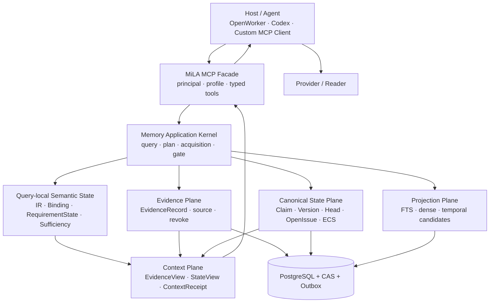
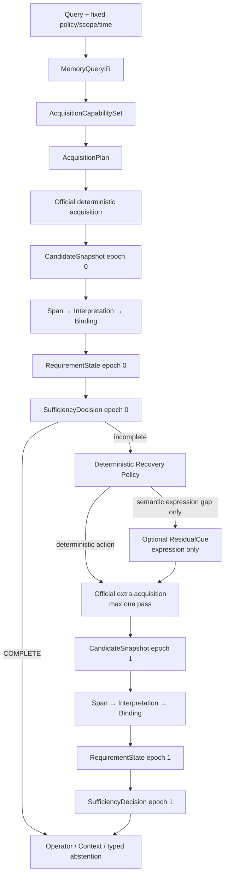

# MiLAi DG-20：RequirementState 对齐与 Capability 约束证据再查找 Goal

> Goal ID：`DG-20`  
> 方法名：`Capability-Constrained Requirement-State Refinding`  
> 文档版本：`0.1.0 DRAFT FOR OWNER APPROVAL`  
> 起草日期：`2026-08-28`（Asia/Shanghai）  
> 当前状态：`AUTHORIZED FOR CONTINUOUS S0–S6 EXECUTION WITH HARD GATES`  
> Owner 授权：`2026-08-28 用户明确要求详细阅读并执行本开发文档`  
> 前置终态：`DG-19 = PARKED_NO_MEDIATOR_GAIN`  
> 产品边界：`LOCAL MCP / SYNTHETIC OR DEIDENTIFIED OPENED-DEV ONLY`  
> Runtime / Schema：`CANDIDATE / EXPERIMENTAL / NO-GO FOR SCHEMA FREEZE`  
> 冻结基线：`architecture/v1.0/`，禁止原地修改  
> 禁止范围：`FORMAL HOLDOUT / DEFAULT MULTI-ROUND / PRODUCTION / REMOTE MCP / REAL PERSONAL DATA`

---

# 0. Goal 决定

DG-20 是 DG-19 的 successor lane，但不重开、不改写 DG-19，也不把 DG-19 的负结果扩大为
“ReFind-style acquisition 无效”。

DG-19 真正否定的对象固定为：

```text
archived / potentially stale missing_slots
→ one provider-selected action and cue
→ lexical-dominated extra retrieval in an eval-owned executor
→ Binding proxy
```

DG-20 要验证的对象是：

```text
current immutable candidate snapshot
→ current Binding
→ current RequirementState
→ current SufficiencyDecision
→ Runtime-derived feasible acquisition actions
→ official product acquisition executor
→ current Binding / RequirementState / SufficiencyDecision recomputation
→ optional model cue only for a measured expression gap
```

本 Goal 的主要问题不是：

```text
怎样让 LLM 多搜几次？
```

而是：

```text
Runtime 当前究竟缺什么？
Runtime 当前可以怎样搜？
上一轮为什么没有找到或没有形成完成证明？
```

只有上述三项在同一 query-local state epoch 内闭合后，Provider 才可能提供受限 cue。

## 0.1 Primary claim、supporting claim 与 anti-claim

| ID | Claim | Minimum convincing evidence |
| --- | --- | --- |
| C1 Primary | Fresh RequirementState、可执行 CapabilitySet 与正式 acquisition path 能消除 stale target、unsupported action 和 eval/product divergence | 状态/动作不一致均为 `0/N`；同一 official executor 产生可回放 channel/rank/binding/sufficiency trace；opened-dev mediator 不低于 DG19 baseline |
| C2 Supporting | 只有 deterministic policy 仍存在可定位 semantic-expression gap 时，受限 model cue 才可能提供增量价值 | matched deterministic-only vs deterministic+cue；cue 对原缺失 requirement 有新增 Binding/OperatorReady 增益；安全和成本门通过 |
| AC1 Anti-claim | 收益不能只是更多候选、更多 Top-k、更多轮次、oracle channel、Reader 改动或放松 Sufficiency | 固定 snapshot/IR/Reader/budget/scorer；候选级 requirement attribution；one call/one pass/zero retry；错误 COMPLETE 为 0 |

若 deterministic policy 已达到 mediator gate，Residual Provider 必须以：

```text
RESIDUAL_ASSIST = DISABLED_NOT_NEEDED
```

结束，而不是为了“完整架构”强行接入模型。

## 0.2 当前授权边界

本文件已由 owner 在 `2026-08-28` 明确授权按 S0–S6 和 hard gate 连续执行。
未被授权的范围仍包括：

```text
修改 Runtime 代码
修改 public MCP contract
新增或迁移 PostgreSQL schema
运行 Provider
运行 opened-dev treatment
打开 formal holdout
修改 architecture/v1.0
```

本次授权不放宽各 Work Package entry gate、立即停止条件或 Non-goals。

---

# 1. 权威事实基线

## 1.1 规范与证据优先级

发生冲突时按以下顺序解释：

1. `architecture/v1.0/` frozen bundle；
2. `MiLAi_Logical_Architecture_v1_设计文档.md` frozen MUST；
3. `MiLAi_Lean_V1_实施合同.md`；
4. executable Runtime code、真实 PostgreSQL tests 和 sealed receipts；
5. DG-13～DG-19 Goal 中未被后续终态覆盖的部分；
6. runbook、README、注释和命名。

事实标记：

- `Observed`：当前代码、测试或 sealed artifact 可直接证明；
- `Documented`：规范或 Goal 声明，但不等于已实现；
- `[INFERENCE]`：由多处实现和结果推导；
- `[UNKNOWN]`：当前 repository 不能证明。

## 1.2 绑定输入与身份

| Artifact | SHA-256 | 用途 |
| --- | --- | --- |
| `architecture/v1.0/architecture_manifest.json` | `ac16f3b7f9413a7b2d8373b6e7d306697df0bc7908572bb3b0344260d8a55d0e` | frozen architecture identity |
| `MiLAi_Lean_V1_实施合同.md` | `395a443da282f69a56ae5ea29f0dac07a65da12a697534e5c650c9893f8ae3ba` | Lean implementation contract |
| `docs/MiLAi_DG13-DG19_架构与方法迁移Prompt_2026-08-28.md` | `25d771f28a5a54115642c5bfdece85910f1550ab289b42d0abb7854469d6bc1f` | current migration baseline |
| DG19 terminal receipt | `6d6a621fc6a802d4e8390e6becb4e966f5964f4b7b11fbc826accc0f4895f7e0` | `PARKED_NO_MEDIATOR_GAIN` |
| DG19 opened-dev S4 score | `17950a87e868720684e24f145d1beebc21b1c23c251b6f340fbbf37926857975` | mediator denominator and failure evidence |

本 Goal 不覆盖或重新解释上述 sealed hashes。新执行必须使用新的 `run_id`、新的输出目录和新的
artifact identity。

## 1.3 DG19 terminal 解释冻结

```text
Delivery / schema                PASS
Provider execution               PASS
Retry discipline                 PASS
Safety / wrong COMPLETE          PASS
Correct-case non-regression      PASS

Requirement-state congruence     FAIL
Action capability realization    FAIL
Per-requirement observation      FAIL
Product-path execution fidelity  FAIL
Mediator gain                    MISS

Final                            PARKED_NO_MEDIATOR_GAIN
```

允许的研究表述：

> A stale-state, lexical-only residual shadow did not yield reliable mediator gain.

禁止的研究表述：

```text
ReFind-style residual acquisition failed
LLM refinding is generally ineffective
multi-round search cannot help
MiLA semantic memory quality is solved or disproven
```

---

# 2. MiLA 当前架构梳理

## 2.1 产品定位

MiLA 是 MCP-native、Evidence-first、Versioned-state、Governed-write 的 Agent Memory Service。
OpenWorker 是首要 Host/MCP client，不是 MiLA Core；Provider 负责最终回答，不拥有 memory truth。



## 2.2 Plane 与 owner

| Plane / object | Current owner | Authority boundary |
| --- | --- | --- |
| Agent planning、Task lifecycle、Provider invocation | Host / Agent | 不属于 MiLA truth |
| MCP profile、principal、typed transport | MCP facade | 只授予调用能力，不生成 memory authority |
| QueryIR、AcquisitionPlan、Binding、Sufficiency | Runtime | deterministic owner；模型只能提供 untrusted hint |
| EvidenceRecord、source bytes、revoke | Evidence Plane | Observation，不等于 Claim |
| ClaimVersion、ClaimHead、OpenIssue、ECS | Canonical State Plane + governed procedures | 唯一正式 state/authority owner |
| FTS、dense、temporal、neighbor、summary | Projection / acquisition | candidate-only；故障只能降低 recall |
| ContextCapsule、EvidenceView、receipt | Context Plane | bounded derived view，不是 truth |
| final answer | Provider / Agent | 不自动成为 Evidence 或 Claim |

## 2.3 当前读路径

```text
MCP query
→ Runtime Query interpretation / QueryPlan / MemoryQueryIR
→ AcquisitionPlan
→ Evidence and/or canonical candidate generation
→ scope / permission / time / revoke / authority Gate
→ EvidenceSpan
→ EvidenceInterpretationCandidate
→ RequirementBinding
→ SufficiencyDecision
→ deterministic operator or Context Compiler
→ MCP result
→ Host / Provider answer
```

必须保持：

```text
Evidence != Belief
Candidate != Accepted Evidence
Binding != Sufficiency
Context != Truth
Provider output != Completion authority
```

## 2.4 当前三条读取 Lane

| Lane | Query class | Completion owner |
| --- | --- | --- |
| Canonical State Lane | current、history、version、conflict、why changed | ECS、OpenIssue、authority/time/scope Gate |
| Episodic Evidence Lane | 说过什么、发生过什么、原始上下文 | answer-bearing span、source applicability、bounded retrieval policy |
| Evidence Composition Lane | count、distance、order、divide、join、set | required bindings + operator-specific completeness proof |

DG-20 只改变 Episodic/Composition Lane 的 query-local recovery control，不改变 canonical write、ECS、
Claim/OpenIssue identity 或 Steward procedure。

## 2.5 当前主要实现入口

| Responsibility | Current file / symbol |
| --- | --- |
| Query planning | `runtime/src/milai/application/query_planner.py::QueryPlanner` |
| Acquisition plan/fusion | `runtime/src/milai/application/acquisition.py` |
| Query-local acquisition state | `runtime/src/milai/domain/acquisition.py::AcquisitionState` |
| Acquisition transitions | `runtime/src/milai/application/acquisition_state.py` |
| Official retrieval execution | `runtime/src/milai/application/retrieval.py::RetrievalService.retrieve()` |
| Span / interpretation / binding | `runtime/src/milai/application/evidence_semantics.py` |
| Completion policy | `runtime/src/milai/application/sufficiency.py::decide_sufficiency()` |
| Residual contracts / validator | `runtime/src/milai/domain/residual_refinding.py` and application peer |
| Runtime Context compiler | `runtime/src/milai/application/memory_context.py` |
| DG19 shadow executor | `evals/dg18/residual_shadow.py` |

---

# 3. 当前开发问题与冲突

## 3.1 P0：Requirement state 没有单一 query-local owner

`Observed`：当前存在多种部分重叠的状态表达：

```text
SufficiencyDecision.covered_slots / missing_slots
AcquisitionState.missing_requirement_ids / satisfied_requirement_ids
RequirementAcquisitionCoverage
ResidualDeterministicState
archived opened-dev sufficiency.missing_slots
```

正式 Runtime 的 deterministic pass 会从当前 `SufficiencyDecision` 更新 `AcquisitionState`；但 DG19
shadow 在 `evals/dg18/residual_shadow.py::_shadow_plan_state()` 中把归档 `missing_slots` 写回新 state，
再把其他 requirement 推断为 satisfied。

后果：

- 两个双事件病例都把已满足 requirement 继续作为 missing；
- controller 两次都选中已满足 requirement；
- archived state 与 fresh Binding 被拼接为一个不存在的 execution epoch；
- stale state 没有稳定的拒绝码。

根因不是缺少又一个状态 DTO，而是缺少一个唯一的、由同一 snapshot 原子派生的
`RequirementStateResolver`。

## 3.2 P0：Requirement expressivity 不足

`missing_slots: list[str]` 只能表达命名 operand 缺失，不能完整表达：

```text
SET_MEMBERS under-covered
CARDINALITY under-covered
RANGE_COMPLETENESS proof missing
VERSION_CHAIN incomplete
CONFLICT_SIDE absent
PROVENANCE proof missing
```

DG19 的 10 个 case 只有 3 个因存在显式 `missing_slots` 被激活。至少两个 count/set case 已是
`UNSATISFIED`、Binding 未完成，却因为 `missing_slots=[]` 没有进入 treatment。

Activation 必须针对 requirement disposition，而不是仅针对字符串列表。

## 3.3 P0：声明的动作空间与可执行 Runtime 能力不一致

`Observed`：

- `AcquisitionChannel` 声明 `FTS_RAW / FTS_ENRICHED / EVIDENCE_DENSE / TEMPORAL_EVENT / CANONICAL_STATE`；
- `compile_acquisition_plan()` 默认只生成 Raw FTS，enriched/dense 均为 opt-in；
- `create_app()` 当前没有把 lexical enrichment 配置传给 `RetrievalService`；
- Evidence dense 默认关闭，且正式路径要求匹配 128d projection；
- event-occurrence projection 尚不可用，event-time dense/range scan fail closed；
- `ADJACENT_TURNS` 存在于类型与 Context hydration，但没有成为同一个 official residual acquisition action；
- `SAME_EPISODE` 不是已证明的正式 acquisition channel。

因此 provider 虽然可以输出 temporal/neighbor action，Runtime 对当前 plan 可能只能执行 lexical/no-op。
DG19 synthetic 与 opened-dev 全部坍缩为 `SEARCH_LEXICAL` 是该冲突的直接症状。

## 3.4 P0：`capabilities` 存在命名冲突

当前 `GET /v1/capabilities` 的 `capabilities` 指 principal permission：

```text
memory:read
proposal:submit
proposal:review
...
```

DG-20 需要的是 query-local acquisition capability，例如：

```text
FTS_RAW enabled
EVIDENCE_DENSE disabled by policy
TEMPORAL_EVENT unavailable because projection absent
ADJACENT_TURNS unavailable as acquisition action
```

两者不能复用同一对象或字段名。本文统一命名：

```text
PrincipalCapabilities          # authorization
AcquisitionCapabilitySet       # executable retrieval capability
```

默认不扩展 public `/v1/capabilities`；AcquisitionCapabilitySet 是内部、query-local、traceable 合同。

## 3.5 P1：Observation 丢失逐 requirement 诊断

当前 `AcquisitionObservation v0.1` 主要提供：

```text
missing requirements
candidate summaries
prior action digests
exhausted regions
remaining budget
```

缺失：

```text
accepted Binding per requirement
POSSIBLE / REJECTED count and reason per requirement
candidate→requirement attribution
attempted channel and disposition
available executable actions
same-region/session duplicate summary
completeness proof gap
```

时间病例中，所有候选因为 event-time applicability 无法证明而被过滤后，controller 只看到
`0 candidates`，无法区分：

```text
没有 lexical hit
vs
存在文本候选，但 event time unknown / projection unavailable
```

## 3.6 P1：Shadow executor 与产品路径不一致

DG19 的 `_simulate_hint()` / `_hint_ranking()` 自己实现 Raw BM25、observed-time 筛选、neighbor 和
episode expansion；它没有复用 `RetrievalService` 内的正式：

```text
AcquisitionPlan probes
repository search
per-slot quota and fusion
projection disposition
hydration / expansion
Gate
query operator
final SufficiencyDecision
```

因此 DG19 测量的是：

```text
provider hint + evaluator retrieval semantics
```

而不是：

```text
provider hint + MiLA product acquisition semantics
```

## 3.7 P1：S4 没有重跑完整 completion chain

DG19 shadow 在 extra pass 后重新投影 Span/Interpretation/Binding，但没有调用正式
`decide_sufficiency()`。`missing_slot_case_improved` 是 gold rank、Binding ready 或 all-gold-present 的 scorer
代理。

这不表示 safety gate 无效；错误 COMPLETE 仍为 0。它表示 S4 不能被描述为已完成正式
`Binding/Sufficiency recomputation`。

## 3.8 P1：指标把 manipulation check 与效果混合

`new_governed_candidate_count` 当前近似为：

```text
new refs - wrong-scope refs
```

它适合证明 additional pass 真正发生，不足以证明候选最终绑定到原缺失 requirement。DG19 的 10 个
新候选中有 9 个噪声；`1/10` 只能作为 useful-candidate proxy，尚无完整 candidate→requirement→binding
attribution。

## 3.9 P1：审计链缺少 cue 与 transitive code identity

DG19 sealed product 保存 cue digest/provenance，但未保存可授权读取的 exact cue；terminal receipt 绑定
runner 和主要 artifact，却未绑定全部 transitive Runtime modules。

因此当前无法完整回答：

```text
哪个 cue term
→ 哪个 channel/raw rank
→ 哪个 candidate
→ 哪个 requirement binding
→ 哪个 sufficiency effect
```

个人数据场景中不能把 exact cue 直接放入公开 receipt；应分离 restricted artifact 与 public digest。

## 3.10 P1/P0：全局产品架构风险与本 Goal 的关系

`MiLA_Current-State_Architecture_Report.md` 还记录了以下 product-wide 风险：

- user-role recall-shaped JSON 可能绕过 MCP/Runtime Gate 进入 Provider Context；
- primary OpenWorker composition 不是必跑 CI 门；
- durable Task continuity owner 未在 repository 内闭合；
- CACHE miss recommended route 当前 Host 不 follow；
- OpenIssue selection、TTL、projection purge/rebuild、action confirmation 和 trace ownership 存在边界冲突；
- Git/hosted CI/formal provider evidence provenance 不完整。

这些不由 DG-20 一并修复。边界如下：

```text
DG20 S0–S3 Runtime/eval work
  may proceed after separate authorization

OpenWorker/product release claim
  remains blocked by its own security/composition gates

DG20 PASS
  does not close global P0/P1 release risks
```

---

# 4. 目标架构

## 4.1 单一 query-local state pipeline



## 4.2 `RequirementState v0.1`

`RequirementState` 是 query-local derived state，不是 durable canonical state，不得与 `ClaimVersion`、
`EffectiveClaimState` 或 Host Task state 混用。

```yaml
RequirementState:
  schema_version: requirement-state-v0.1
  query_ir_digest:
  acquisition_plan_digest:
  acquisition_capability_digest:
  candidate_snapshot_digest:
  binding_digest:
  sufficiency_decision_digest:
  sufficiency_policy_version:
  state_epoch: 0
  lifetime: MEMORY_RESOLVE
  canonical: false
  canonical_mutation: false

  requirements:
    - requirement_id:
      kind:
        VALUE_SLOT
        EVENT_SLOT
        SET_MEMBERS
        CARDINALITY
        RANGE_COMPLETENESS
        VERSION_CHAIN
        CONFLICT_SIDE
        PROVENANCE

      status:
        SATISFIED
        MISSING
        UNDER_COVERED
        COMPLETENESS_PROOF_MISSING
        CONTESTED
        UNRESOLVED

      required_cardinality:
      observed_cardinality:
      proof_status:
      accepted_binding_refs: []
      possible_binding_refs: []
      rejected_binding_refs: []
      accepted_evidence_refs: []
      rejected_candidates: []
      rejection_summary: {}
```

约束：

1. `SATISFIED` 只能由 Runtime resolver 根据 accepted Binding 与 Sufficiency proof 派生；
2. `RequirementState` 不能独立把整体 query 标成 COMPLETE；最终 completion owner 仍是
   `SufficiencyDecision`；
3. `state_epoch` 每次 candidate snapshot 改变后递增；
4. 相同输入、policy 和 snapshot 必须生成相同 digest；
5. archived/current mismatch 是迁移审计指标，不自动等于运行错误；
6. controller/executor 使用的 state digest 与当前 epoch 不一致时返回：

```text
STALE_REQUIREMENT_STATE
```

## 4.3 现有状态对象的归一关系

禁止在现有对象旁边再增加一个互不校验的状态 owner。目标关系：

```text
SufficiencyDecision
  = overall stop / complete / abstain authority

RequirementState
  = per-requirement diagnosis derived from current Binding + Sufficiency proof

AcquisitionState
  = action history + seen regions + remaining budget
    + current RequirementState digest/epoch

ResidualDeterministicState
  = trace projection only; no independent decision authority

missing_slots / covered_slots compatibility fields
  = derived views; cannot be independently written
```

若兼容期保留 `AcquisitionState.missing_requirement_ids`，必须在 Pydantic validator 中证明它与绑定的
`RequirementState` 完全一致；不允许 evaluator 手工覆盖。

## 4.4 `AcquisitionCapabilitySet v0.1`

```yaml
AcquisitionCapabilitySet:
  schema_version: acquisition-capability-set-v0.1
  config_digest:
  projection_snapshot_digest:
  policy_digest:
  generated_at:

  channels:
    FTS_RAW:
      status: ENABLED
      reason: READY
      limits: {}

    FTS_ENRICHED:
      status: DISABLED
      reason: CONFIG_NOT_BOUND

    EVIDENCE_DENSE:
      status: DISABLED
      reason: POLICY_DISABLED
      requirements:
        projection_dimensions: 128

    SOURCE_OBSERVED_RANGE_SCAN:
      status: CONDITIONAL
      reason: BOUNDED_RANGE_REQUIRED

    TEMPORAL_EVENT:
      status: UNAVAILABLE
      reason: EVENT_PROJECTION_NOT_READY

  expansions:
    ADJACENT_TURNS:
      status: UNAVAILABLE_AS_ACQUISITION
      reason: CONTEXT_ONLY_IMPLEMENTATION

    SAME_EPISODE:
      status: UNAVAILABLE
      reason: NOT_IMPLEMENTED
```

实际状态必须从当前 Runtime settings、repository method、projection identity/watermark、policy 和 request
约束派生；上面只是当前 observed disposition 示例，不是静态常量。

## 4.5 FeasibleActions

```text
FeasibleActions
= AcquisitionCapabilitySet.ENABLED_OR_CONDITIONAL
∩ PolicyAllowedActions
∩ RequirementApplicableActions
∩ RemainingBudget
∩ CurrentScopeAndTimeConstraints
```

任何 action 在进入 controller prompt 或 executor 前必须具备：

```text
capability_id
capability_digest
target_requirement_id
requirement_state_digest
bounded cost
typed unavailable reason
```

Unsupported action proposal、execution 或 silent fallback 必须为 `0/N`。

## 4.6 Deterministic Recovery Policy v0.1

DG-20 v0.1 默认由 Runtime 选择 channel；Provider 不选择 channel。

| Requirement / first-loss | Deterministic disposition |
| --- | --- |
| lexical/predicate mismatch | compare enabled Raw/Enriched/Dense channels under fixed bounds |
| local operand missing with valid anchor | use official neighbor expansion only if acquisition capability is enabled |
| source-observed bounded range incomplete | bounded range scan if partition/watermark proof is available |
| event time unknown / event projection absent | typed unavailable；不得用 source time 冒充 event time |
| set/cardinality under-covered | bounded deterministic scan or explicit unresolved state；不默认调用 Provider |
| completeness proof missing | acquire proof through deterministic scan; cue expansion alone不能证明 completeness |
| semantic expression gap after deterministic channels | permit one bounded `ResidualCue` |

Deterministic policy 必须版本化，并允许 `NO_FEASIBLE_ACTION` 作为正常终态。

## 4.7 `AcquisitionObservation v0.2`

```yaml
AcquisitionObservation:
  schema_version: acquisition-observation-v0.2
  requirement_state_digest:
  requirement_state_epoch:
  acquisition_capability_digest:

  requirements:
    - requirement_id:
      kind:
      status:
      matched_evidence: []
      possible_evidence: []
      rejected_evidence: []
      rejection_summary: {}
      acquisition_history: []
      available_actions: []

  global:
    seen_region_digests: []
    exhausted_region_digests: []
    repeated_region_rate:
    remaining_budget: {}
```

要求：

- candidate summary 必须按 region/session 去重，不能让同一 session 多个 turn 淹没状态；
- 每个 rejected summary 保存 reason count；正文仍受 bounded snippet 与 privacy policy 约束；
- `EVENT_TIME_UNKNOWN`、`EVENT_TIME_OUT_OF_SCOPE` 和 `NO_LEXICAL_HIT` 必须分离；
- observation 不含 gold、answer、scorer label 或 formal-holdout identity；
- observation 只描述当前 state，不拥有 Binding/Sufficiency authority。

## 4.8 `ResidualCue v0.2`

Provider 只表达“搜什么”，不决定“怎样搜”：

```yaml
ResidualCue:
  schema_version: residual-cue-v0.2
  requirement_state_digest:
  target_requirement_id:
  aliases: []
  phrases: []
  morphological_variants: []
```

Runtime 已经确定：

```text
selected channel
scope
time bounds
source policy
candidate cap
expansion policy
completion policy
```

Provider 禁止输出：

```text
final answer
COMPLETE
Evidence accept/reject
scope or authority changes
new entity outside validated query state
channel not present in feasible action set
```

## 4.9 Official acquisition executor

下一版必须把当前 `RetrievalService.retrieve()` 中 Evidence acquisition 的正式语义提取或封装为单一
可复用产品服务。暂定逻辑名：

```text
EvidenceAcquisitionExecutor
```

它必须拥有或调用：

```text
AcquisitionPlan compilation
channel-specific repository calls
per-slot quota / fusion
candidate identity and deduplication
scope / permission / retention / revoke applicability
hydration / official structural expansion
Span / Interpretation / Binding
query operator
SufficiencyDecision
trace
```

允许执行模式：

```text
PRODUCT
SHADOW_NO_CONTEXT_MUTATION
```

两种模式必须共享相同检索和语义代码；shadow 只禁止把额外候选送入 Reader/Context 或改变产品响应。

Evaluation code 只允许：

```text
构造 case
选择 execution mode
收集 trace
密封 product view
密封后加载 scorer truth
```

禁止 evaluator 自己实现 BM25、fusion、neighbor、temporal filter、packing 或 Sufficiency。

## 4.10 完整 post-pass chain

每次合法 extra pass 后必须执行：

```text
new candidate refs
→ applicability / Evidence Gate
→ EvidenceSpan
→ EvidenceInterpretationCandidate
→ RequirementBinding
→ RequirementState epoch + 1
→ SufficiencyDecision
→ operator readiness
```

`Wrong COMPLETE = 0/N` 是不可降低的硬门；不得以提高 coverage 为由弱化完成证明。

---

# 5. Work Packages

## S0 — Architecture、State Contract 与 Fresh-State Audit

### 目标

零 Provider、零 Reader、零 public API/Schema 变更，先证明 current state 可以由同一 snapshot 重建。

### 交付候选

```text
runtime/src/milai/domain/requirement_state.py
runtime/src/milai/application/requirement_state.py
runtime/tests/unit/test_requirement_state.py
runtime/tests/unit/test_acquisition_state_alignment.py
evals/dg20/fresh_state_audit.py
scripts/run_dg20_s0_fresh_state_audit.py
var/dg20/s0/<run-id>/receipt.json
```

文件名为设计候选；实现前应核对相邻模块，避免无必要拆分。

### 必须回答

1. 相同 QueryIR、candidate snapshot、Binding 与 policy 是否生成相同 state digest？
2. archived/current mismatch 中哪些是 stale artifact，哪些是 policy migration 的预期变化？
3. 当前 Binding 已满足的 requirement 是否仍可能进入 target set？
4. COUNT/set/completeness failure 是否获得 typed activation disposition？
5. state epoch mismatch 是否在 provider/executor 前 fail closed？

### Hard gate

```text
ControllerStateEpochMismatch             = 0/N
ExecutionStateDigestMismatch             = 0/N
SatisfiedRequirementTargetRate           = 0/N
UnsupportedRequirementKindCollapse       = 0/N
Same-input state digest drift             = 0/N
COUNT/set under-coverage classification   = 100% on declared fixtures
canonical mutation                        = 0/N
provider calls                            = 0/N
Reader calls                              = 0/N
```

`ArchivedCurrentStateMismatchRate` 只报告，不作为全局必须为 0 的 gate；在相同 snapshot、相同 policy、
相同 resolver 的 matched cell 中才要求为 0。

S0 失败时终态：

```text
FAILED_REQUIREMENT_STATE_CONGRUENCE
```

不得进入 S1。

## S1 — Official Channel Oracle

### 目标

零 Provider、零 Reader。对每个 current unresolved requirement 使用正式产品 executor 分别执行可用 channel，
定位 gold/answer-bearing Evidence 的 first-loss stage。

### 比较 arms

仅对 capability set 中可证明可执行的 arm 运行：

```text
FTS_RAW
FTS_ENRICHED
EVIDENCE_DENSE
SOURCE_OBSERVED_RANGE_SCAN
TEMPORAL_EVENT
ADJACENT_TURNS
SAME_EPISODE
```

`UNAVAILABLE` arm 不伪造结果，只记录 reason。Strong dense、event projection、neighbor acquisition 不能因
类型存在就视为产品能力。

### 每个 requirement 必报

```text
channel capability status/reason
raw rank
fusion rank
cutoff survival
new region count
duplicate region count
accepted/rejected candidate reasons
new Binding
RequirementState delta
Sufficiency delta
operator-ready delta
latency and hydrated count
```

### Gate

S1 是诊断阶段；真实性 gate 必须全部通过：

```text
eval-owned ranking/filter/expansion              = 0
all runs use official executor                   = 100%
capability identity bound                         = 100%
candidate→requirement attribution                 = 100%
first-loss classification coverage                = 100%
wrong scope/permission/revoke/authority accepted  = 0/N
formal holdout consumed                           = false
```

进入 S2 的最低机制信号：

```text
at least 2 current opened-dev unresolved cases
have answer-bearing Evidence recovered by an executable,
policy-allowable official channel
```

若没有，终态：

```text
PARKED_NO_EXECUTABLE_CHANNEL_GAIN
```

不得通过增加 Top-k、隐藏 fallback 或调用 Provider 强行进入 S2。

## S2 — Deterministic Capability-Constrained Acquisition Policy

### 目标

根据 RequirementState、first-loss reason、CapabilitySet 和 budget 选择 deterministic action。

### 约束

- Provider calls = 0；
- 已满足 requirement 不进入 target；
- completeness proof gap 不转换成 lexical cue 问题；
- unavailable event-time channel 不回退成 source-time；
- action 必须绑定 state/capability/policy digest；
- extra pass 后完整重算 Binding/RequirementState/Sufficiency；
- deterministic COMPLETE 立即停止。

### 对照

```text
DG19 deterministic baseline
vs
fresh-state + deterministic capability policy
```

固定：

```text
opened-dev snapshot
QueryIR/compiler
candidate/global budget
scope/time/authority
Reader disabled
scorer contract
case order
```

### Gate

```text
SatisfiedRequirementTargetRate                  = 0/N
UnsupportedActionProposalRate                   = 0/N
UnsupportedActionExecutionRate                  = 0/N
StateDigestRejection correctness                = 100%
Wrong COMPLETE                                  = 0/N
Wrong scope/authority/revoke                    = 0/N
already-correct regression                      = 0/N
TargetRequirementCandidateRecall                non-decreasing
TargetRequirementBindingGain                    > 0 on declared recoverable slice
OperatorReady                                   non-decreasing
provider calls                                  = 0/N
automatic retries                               = 0/N
```

若 S2 达到 DG19 原 mediator threshold 或预冻结 successor threshold，Residual Provider 不再是必需项：

```text
RESIDUAL_ASSIST = DISABLED_NOT_NEEDED
```

可以直接进入 S4 的 deterministic-only product-faithful integration；S3 作为 non-blocking research
diagnostic，不能阻塞 core。

## S3 — Residual Cue Shadow

### Entry gate

只允许进入已由 S1/S2 证明的 semantic-expression gap：

```text
correct current target requirement exists
selected channel is executable
deterministic cue/channel still misses answer-bearing Evidence
remaining budget permits exactly one call and one pass
```

### Provider contract

Provider 只输出 `ResidualCue v0.2`，不输出 action/channel。每个 eligible case：

```text
logical provider calls       <= 1
automatic retry              = 0
additional acquisition pass <= 1
```

### Synthetic gate 分层

#### Delivery Gate

```text
provider called as planned
schema valid
Runtime accepted cue
zero retry
```

#### Semantic Manipulation Gate

```text
target_requirement_id is current unresolved requirement   = 100%
state/capability digest matches                            = 100%
forbidden control assertion accepted                      = 0/N
cue provenance attributable                               = 100%
action space collapse                                     = NOT_APPLICABLE
```

Provider 不再选择 action，因此不再用“是否覆盖多个 action family”评价 cue model。

#### Effect Gate

```text
TargetRequirementBindingGain > deterministic-only on at least 1 case
UsefulCandidateRate reported with exact denominator
OperatorReady non-decreasing
Wrong COMPLETE / scope / authority / revoke = 0/N
```

若没有 incremental gain：

```text
RESIDUAL_ASSIST = PARKED_NO_INCREMENTAL_GAIN
```

core deterministic lane 仍可继续；不得调 Prompt、Top-k 或多轮碰运气。

## S4 — One-pass Product-faithful Integration

### 目标

在 default-disabled policy 下，把 S2 通过的 deterministic recovery，以及条件通过的 S3 cue，接入同一
official Runtime acquisition service。

```text
deterministic pass
→ fresh RequirementState
→ feasible recovery action
→ optional one cue
→ official extra acquisition
→ full Binding / RequirementState / Sufficiency recompute
→ Context or typed abstention
```

### 执行模式

首先运行：

```text
SHADOW_NO_CONTEXT_MUTATION
```

只有 safety/equivalence 通过后，才允许在 opened-dev candidate flag 下运行：

```text
PRODUCT
```

### Gate

```text
deterministic COMPLETE auxiliary calls                  = 0/N
ineligible path product output change                   = 0/N
provider unavailable/invalid cue behavior               = deterministic-only
official executor identity                              = 100%
full SufficiencyDecision recomputed after extra pass    = 100%
Wrong COMPLETE                                          = 0/N
wrong scope/authority/revoke                            = 0/N
canonical mutation                                      = 0/N
automatic retries                                       = 0/N
extra acquisition passes                                <= 1/query
formal holdout consumed                                  = false
```

默认不新增 public MCP tool、DB table、Migration 或 frozen architecture 变更。若实现必须改变这些边界，
停止并请求 scope expansion。

## S5 — Matched Q6 Opened-dev Rerun

### Entry gate

S4 Runtime safety/equivalence 全部通过后才运行。固定：

```text
same opened-dev snapshot
same QueryIR/compiler except predeclared RequirementState change
same Reader/model
same Reader prompt and generation contract
same token budget
same scorer
same case order
same operator/sufficiency policy identity
zero formal holdout overlap
```

### Arms

至少比较：

```text
A. DG19/DG17 matched deterministic baseline
B. fresh-state deterministic capability policy
C. B + residual cue             # only if S3 incremental gate passed
```

### 主指标

#### State correctness

```text
ControllerStateEpochMismatch
ExecutionStateDigestMismatch
SatisfiedRequirementTargetRate
UnsupportedActionProposalRate
StateDigestRejectionRate
```

目标均为 `0/N`，其中 rejection rate 指错误接受 stale state 的比例；合法 stale negative 应 100% 拒绝。

#### Acquisition mediator

```text
TargetRequirementCandidateRecall
TargetRequirementBindingGain
RequiredEvidenceSetCoverageDelta
OperatorReadyDelta
GoldTurnRankDelta
```

#### Candidate efficiency

```text
UsefulCandidateRate
NewRegionRate
RepeatedRegionRate
NoisePerUsefulCandidate
```

严格定义：

```text
UsefulCandidateRate
= count(new candidates with accepted Binding to a requirement
        that was unresolved in RequirementState epoch 0)
  / count(all new candidates)
```

#### End-to-end quality

```text
EM / normalized F1
abstention correctness
correct-case regression
Reader-visible context stability
```

#### Safety and cost

```text
Wrong COMPLETE
wrong scope / authority / revoke
provider calls
additional acquisition calls
controller tokens / latency
retrieval latency
candidates hydrated
context tokens
```

### Decision rule

Core deterministic lane 的最低 gate：

```text
missing-requirement improved cases    >= 2 on the frozen current denominator
RequiredEvidenceSetCoverage           non-decreasing
OperatorReady                         non-decreasing
already-correct regression            = 0/N
Wrong COMPLETE / governance violation = 0/N
automatic retries                     = 0/N
```

Residual cue 只有在 matched arm C 相对 B 有独立 mediator/quality gain 且成本可接受时，才能保留为
default-disabled candidate。

## S6 — Terminal Disposition 与封存

所有执行均生成：

```text
var/dg20/<stage>/<run-id>/
├── plan.json
├── sealed-product-trace.json
├── score.json
├── receipt.json
├── acquisition-loss-ledger.json
└── failure-ledger.json          # only when needed
```

合法 core disposition：

```text
PASS_REQUIREMENT_STATE_ALIGNED_ACQUISITION
CHARACTERIZED_REQUIREMENT_STATE_ONLY
PARKED_NO_EXECUTABLE_CHANNEL_GAIN
FAILED_REQUIREMENT_STATE_CONGRUENCE
FAILED_PRODUCT_PATH_FIDELITY
FAILED_GOVERNANCE_INVARIANT
```

Residual lane 单独记录：

```text
DISABLED_NOT_NEEDED
VALIDATED_OPTIONAL_ONE_CALL_CUE
PARKED_NO_INCREMENTAL_GAIN
NOT_EVALUATED
```

禁止使用笼统 `PASS` 合并 core 与 residual 结论。

---

# 6. First-loss Ledger

每个 unresolved requirement 必须记录：

```text
QUERY_IR
REQUIREMENT_STATE
CAPABILITY
CUE
CHANNEL
RAW_RANK
FUSION
CUTOFF
EXPANSION
APPLICABILITY_GATE
INTERPRETATION
BINDING
COMPLETENESS_PROOF
SUFFICIENCY
CONTEXT_PACKING
READER
SCORER
```

同一 requirement 只能有一个 first-loss stage；后续 stage 可以记录 downstream consequence，但不能用多个
模糊标签掩盖第一个丢失点。

最小 schema：

```yaml
AcquisitionLossRecord:
  case_id:
  requirement_id:
  requirement_state_digest:
  capability_digest:
  first_loss_stage:
  reason_code:
  channel:
  raw_rank:
  fusion_rank:
  cutoff_rank:
  answer_bearing_candidate_present:
  binding_status:
  sufficiency_effect:
  scorer_truth_loaded_after_seal: true
```

---

# 7. Cue 与执行审计链

下一轮至少保存：

```yaml
ResidualCueAudit:
  state_epoch:
  requirement_state_digest:
  acquisition_capability_digest:
  target_requirement_id:
  selected_channel:
  action_capability_id:

  exact_cue_ref:
  cue_digest:
  normalized_terms: []
  phrase_terms: []

  term_provenance:
    query_derived: []
    observation_derived: []
    model_generated: []

  provider_request_hash:
  provider_response_hash:
  candidate_rank_before:
  candidate_rank_after:
  first_answer_bearing_rank:
```

隐私规则：

- exact cue 进入受限、加密、带 retention 的 artifact；
-公开 receipt 只保留 digest、计数和 reason；
-不得记录真实 Evidence 正文、未脱敏 Prompt、token 或 secret；
-无权访问 restricted artifact 时仍可验证 public digest chain。

Terminal receipt 必须绑定 direct runner 和以下 transitive source identities：

```text
RequirementState domain/resolver
AcquisitionCapability resolver
AcquisitionPlan compiler
official executor
repository retrieval implementation
Span/Interpretation/Binding
Sufficiency policy
evaluator/scorer
fixture/product-view manifest
```

---

# 8. Tests 与验证

## 8.1 Unit / property

- RequirementState deterministic digest；
- per-requirement status 与 accepted Binding/proof 一致；
- state epoch 单调且 stale action fail closed；
- `AcquisitionState` 与 RequirementState 不发生双写漂移；
- principal capability 与 acquisition capability 类型不可混用；
- feasible actions 只含 executable/policy-allowed channel；
- event/source time 不互相替代；
- under-covered/completeness-proof activation；
- exact deterministic COMPLETE 零 auxiliary work；
- cue 不含 final answer、completion、authority 或 scope override。

## 8.2 Integration

- 真实 PostgreSQL FTS/enriched/dense disposition；
- projection disabled/unready/dead-letter 的 typed capability；
- scope/permission/retention/revoke negative；
- official executor 的 PRODUCT/SHADOW 同 candidate identity；
- post-pass full Binding/RequirementState/Sufficiency recompute；
- bounded range scan 的 partition/watermark proof；
- neighbor/episode 只有 official capability 后才执行。

## 8.3 E2E

- deterministic recovered Evidence 正例；
- deterministic COMPLETE 零调用快路径；
- stale state 拒绝；
- event projection unavailable typed abstention；
- count/set under-coverage activation；
- Provider unavailable/invalid cue 回到 deterministic-only；
- wrong-scope/revoked candidate 永不进入 accepted Binding；
- generic MCP query 无 TaskIdentity 仍可运行。

## 8.4 文档与静态门

```bash
rg -n '^#{1,6} ' MiLAi_DG-20_*_GOALS.md
rg -n 'claim_evidence_edge|commit_decision' MiLAi_DG-20_*_GOALS.md
rg -n 'formal holdout|Production|Schema.*FROZEN' MiLAi_DG-20_*_GOALS.md
```

第二条只用于检查是否误引入旧术语；历史引用不得机械改写。

---

# 9. Non-goals

DG-20 不实现或授权：

```text
修改 architecture/v1.0
Schema freeze
Production / remote MCP release
real personal data
formal LongMemEval holdout
Reader prompt/model/fine-tuning changes
embedding fine-tuning
default strong dense
new vector database
case-specific regex / lexicon / magic boost
unbounded Top-k
default multi-round refinding
R5 autonomous loop
model-selected Evidence
model-declared Binding or Sufficiency
model-declared final answer inside Runtime
automatic retry or provider failover
canonical mutation from acquisition
OpenWorker Task durability redesign
CACHE semantics redesign
global OpenWorker security remediation
graph/DAG/summary as truth source
paper novelty or SOTA claim
```

若 S0–S5 证明“第一轮 observation 暴露了一个新的、在同轮不可合法消费的 cue”，才允许另起 Goal
讨论两轮 refinding。当前不预授权。

---

# 10. 开发与调试纪律

## 10.1 单因素顺序

```text
State congruence
→ Requirement expressivity
→ Capability realization
→ Observation fidelity
→ Official executor fidelity
→ Full sufficiency recomputation
→ Deterministic policy
→ Optional residual cue
→ Reader quality
```

不得同时修改 state、channel、Reader 和 scorer。

## 10.2 单项失败处理

失败后：

1. 固定一个 case、一个 requirement、一个 state epoch；
2. 记录 first-loss stage；
3. 只修复该 owner；
4. 运行最窄 unit/integration test；
5. 运行 matched slice；
6. 风险相称时才扩大到 stage gate。

禁止：

```text
反复全量重跑碰 seed
增大 cap 掩盖 raw-rank/channel 问题
用 Provider 补偿 unavailable capability
用 Reader 猜 missing Evidence
用 false COMPLETE 提高 F1
覆盖失败 receipt
```

## 10.3 工作树纪律

当前 worktree 很脏且包含用户已有修改。执行时：

- 不 reset、cleanup、checkout 或覆盖无关文件；
- 不修改 `scripts/dg13u_u1_review.py` 和 `tests/test_dg13u_u1_review.py` 的既有用户改动，除非新授权明确要求；
- 新 artifact 使用 fresh directory；
- sealed DG13–DG19 artifact 只读；
- Architecture frozen bundle 只读。

---

# 11. Deliverables

授权执行后，必须交付：

1. `RequirementState v0.1` domain contract、resolver 与 compatibility disposition；
2. `AcquisitionCapabilitySet v0.1` 与 typed unavailable reasons；
3. `AcquisitionState`/`ResidualDeterministicState` 单一 owner 对齐；
4. `AcquisitionObservation v0.2`；
5. deterministic recovery policy；
6. official reusable acquisition executor 或等价产品内封装；
7. PRODUCT/SHADOW execution-mode equivalence tests；
8. S0 Fresh-State Audit receipt；
9. S1 official Channel Oracle 与 100% first-loss ledger；
10. S2 deterministic policy report；
11. 条件执行的 S3 ResidualCue synthetic/opened-dev shadow；
12. S4 one-pass product-faithful integration receipt；
13. S5 matched Q6 quality/cost report；
14. cue restricted artifact/public digest contract；
15. source/artifact manifest 与 terminal receipt；
16. Runtime unit/contract/integration/strict mypy/Ruff receipts；
17. DG20 operator/runbook update；
18. terminal disposition，明确 core 与 residual 两条 lane。

若新增 projection 或持久 schema，必须另获授权，并补充 ADR、Migration、backfill/rebuild、watermark、purge、
rollback 和真实 PostgreSQL 测试；本文默认不授权。

---

# 12. 成功定义与停止条件

## 12.1 Core success

只有满足以下条件，才允许：

```text
DG20 CORE = PASS_REQUIREMENT_STATE_ALIGNED_ACQUISITION
```

条件：

- current RequirementState 来自同一 immutable snapshot；
- stale state/action 100% fail closed；
- satisfied requirement target 为 0/N；
- count/set/completeness 进入 typed activation；
- action 只来自 executable CapabilitySet；
- official executor 被 product 与 shadow 共用；
- extra pass 后完整重算 Binding、RequirementState、Sufficiency；
- current opened-dev missing-requirement improved cases 达到预冻结 hard gate；
- RequiredEvidenceSetCoverage 与 OperatorReady 不下降；
- correct-case regression、Wrong COMPLETE、scope/authority/revoke violation 均为 0/N；
- zero retry、bounded cost、formal holdout untouched；
- Runtime/Schema 仍明确是 Candidate/Experimental/NO-GO。

## 12.2 Residual success

只有 matched arm 证明相对 deterministic policy 的独立增量价值，才允许：

```text
RESIDUAL_ASSIST = VALIDATED_OPTIONAL_ONE_CALL_CUE
```

否则必须是：

```text
DISABLED_NOT_NEEDED
或
PARKED_NO_INCREMENTAL_GAIN
```

## 12.3 立即停止条件

出现以下任一情况，立即停止当前 case 并保留 typed failure：

```text
canonical mutation
scope/permission/authority/time widening
revoked Evidence accepted
model selects Evidence or declares COMPLETE
state/capability digest mismatch accepted
unsupported action executed
automatic retry > 0
provider/model identity drift
gold/scorer truth reaches product path
eval-owned ranking/filter/expansion reappears
formal holdout opened
frozen architecture modified
```

## 12.4 最终原则

> 先让 Runtime 知道当前究竟缺什么、可以怎样搜、刚才为什么没找到，再让模型提供线索。

在 RequirementState、CapabilitySet 与 official acquisition 没有闭合前，增加搜索轮数只会重复错误状态和
lexical 噪声，不构成真正的 stateful refinding。
