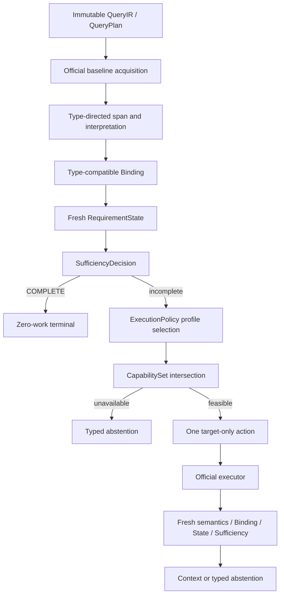

# MiLAi DG-21：类型定向证据获取效率与时间完备性修复 Goal

> Goal ID：`DG-21`  
> 方法名：`Type-Directed Capability-Grounded Acquisition`  
> 文档版本：`0.1.0 DRAFT FOR OWNER EXECUTION AUTHORIZATION`  
> 起草日期：`2026-08-28`（Asia/Shanghai）  
> 当前状态：`DOCUMENT READY / IMPLEMENTATION NOT STARTED`  
> 本次 Owner 授权：`生成新的 Goal 文档；不等于授权修改代码、Schema 或打开 formal holdout`  
> 前置终态：`DG-20 CORE = PASS_REQUIREMENT_STATE_ALIGNED_ACQUISITION`  
> Residual 基线：`DISABLED_NOT_NEEDED`  
> 产品边界：`LOCAL MCP / SYNTHETIC OR DEIDENTIFIED OPENED-DEV ONLY`  
> Runtime / Schema：`CANDIDATE / EXPERIMENTAL / NO-GO FOR SCHEMA FREEZE`  
> 冻结基线：`architecture/v1.0/`，禁止原地修改  
> 默认开关：`OFF`  
> 禁止范围：`FORMAL HOLDOUT / PROVIDER TUNING / READER CHANGE / MULTI-ROUND / PRODUCTION / REAL PERSONAL DATA`

---

# 0. Goal 决定

DG-21 是 DG-20 的效率与未覆盖失败类 successor。它不重开 DG-19，不否定 DG-20，也不把 DG-20 的
opened-development PASS 扩大成 Production 或完整 Q6 质量结论。

DG-20 已证明：

```text
Fresh RequirementState
+ executable CapabilitySet
+ official acquisition executor
+ full Binding / Sufficiency recomputation
```

可以在零 Provider、零自动重试、零 Wrong COMPLETE 的条件下产生 mediator gain。

DG-21 要解决的是 DG-20 之后暴露的四类剩余问题：

```text
1. 候选很少，但 interpretation/binding 笛卡尔组合产生大量无效 TYPE_INCOMPATIBLE；
2. recovery 仍使用固定通道顺序和统一 cap，未按 first-loss/requirement 类型分配成本；
3. SOURCE_TIME point、邻接上下文和 Preference 当前意图没有形成通用可执行合同；
4. EVENT_TIME filter/count 缺少可证明 complete 的正式 temporal acquisition channel。
```

本 Goal 的核心问题不是：

```text
怎样搜更多候选？
```

而是：

```text
怎样只执行当前 requirement 所需的语义投影、通道与证明工作，
并在 capability 不存在时更早、更加准确地停止？
```

## 0.1 Primary claim、supporting claim 与 anti-claim

| ID | Claim | Minimum convincing evidence |
| --- | --- | --- |
| C1 Primary | Typed requirement 驱动的 interpretation、binding 与 acquisition profile 可以在不降低 required-evidence coverage 的前提下显著减少无效计算 | matched baseline；BindingEvaluationCount、MaterializedTypeMismatch、hydration、latency/utility 指标；安全与正确病例非回归 |
| C2 Supporting | Source-time point bucket、target-only semantic recovery 与 bounded adjacency 可以修复一部分 channel/local-context loss，而不需要 Provider | official product path；content-free selectors；至少一个既有未改善 failure class 获得 Binding 或 OperatorReady gain |
| C3 Conditional | Event-time bounded scan 只有具备事件时间投影、watermark、partition closure 与去重证明后，才能合法改善 temporal filter/count | S5 oracle；必要时经显式授权的 projection implementation；完整 proof receipt |
| AC1 Anti-claim | 收益不能来自统一增大 Top-k、增加 Reader/Provider 调用、放宽 temporal applicability、使用 source time 冒充 event time 或降低 Sufficiency | 固定 Reader/Provider/scorer/snapshot；one extra pass；zero retry；Wrong COMPLETE=0；time-axis audit |

## 0.2 Successor 边界

DG-21 不修改以下 DG-20 终态：

```text
DG20 CORE                 PASS_REQUIREMENT_STATE_ALIGNED_ACQUISITION
DG20 RESIDUAL             DISABLED_NOT_NEEDED
candidate default         false
formal holdout consumed   false
production authorized     false
```

DG-21 不允许把 Residual Provider 重新纳入默认路径。只有一个新的、独立 Goal 在 deterministic lane
仍存在可证明 expression gap 时，才可以重新提出 Provider 实验。

## 0.3 当前授权矩阵

本文件生成后，只有 owner 明确要求“执行 DG-21 Goal”时，才授权进入 S0。

| 变更 | 本文预定义 | 执行时是否仍需额外授权 |
| --- | --- | --- |
| 内部 Runtime policy/domain/application 代码 | 是 | 执行 Goal 的授权即可 |
| 内部 QueryIR/RequirementState 兼容扩展 | 是 | 执行 Goal 的授权即可；不得改变 public MCP schema |
| unit/contract/真实 PostgreSQL test | 是 | 执行 Goal 的授权即可；仅 synthetic/deidentified ephemeral DB |
| Source-time point compilation、adjacency acquisition | 是 | 执行 Goal 的授权即可 |
| Provider、Reader、Prompt、模型变更 | 否 | 本 Goal 禁止 |
| public MCP schema 变更 | 否 | 需要另行授权并退出本 Goal |
| PostgreSQL persistent event-time projection / Migration | 条件定义 | 必须在 S5 后取得 `DG21_TEMPORAL_SCHEMA_AUTHORIZED` 明确授权 |
| formal holdout | 否 | 本 Goal 禁止 |
| production/default-on | 否 | 本 Goal 禁止 |

---

# 1. 权威事实基线

## 1.1 规范优先级

发生冲突时按以下顺序解释：

1. `architecture/v1.0/` frozen bundle；
2. `MiLAi_Logical_Architecture_v1_设计文档.md` frozen MUST；
3. `MiLAi_Lean_V1_实施合同.md`；
4. executable Runtime、真实 PostgreSQL tests 与 sealed receipts；
5. DG-20 terminal receipt、source manifest、S5 score/loss ledger；
6. 本 Goal；
7. runbook、README、注释和命名。

本文不能静默改变 G1–G9、I-01～I-12、单写者、Evidence/Canonical 分离、权限、撤销或删除语义。

## 1.2 绑定输入与 SHA-256

| Artifact | SHA-256 | 用途 |
| --- | --- | --- |
| `architecture/v1.0/architecture_manifest.json` | `ac16f3b7f9413a7b2d8373b6e7d306697df0bc7908572bb3b0344260d8a55d0e` | frozen architecture identity |
| `MiLAi_Lean_V1_实施合同.md` | `395a443da282f69a56ae5ea29f0dac07a65da12a697534e5c650c9893f8ae3ba` | Lean implementation contract |
| DG20 S6 terminal receipt | `8b006259d4c3d4ffbd9b2077f14a3681826d07d39731cd6c7e6d811352824929` | successor terminal baseline |
| DG20 source/artifact manifest | `24c025b7e5a7622fd4d454ccdd654504f07b7262b724ddb2c252092cc8bb7967` | 47 transitive identities |
| DG20 S5 receipt | `d3cb35524e7e41e95710ea57d3c08f676c881feefe7f20d360f2c34d67eeca5d` | matched gate baseline |
| DG20 S5 score | `1c0d74079344040d0edd97f59207c88b812eca40a821d31ade8d6632d22e9f07` | per-case quality baseline |
| DG20 S5 loss ledger | `e47a20cab747f10081ac6066273e53ab9a7cf41cdfebc3935d8917b6387f3cf0` | first-loss denominator |

上述 sealed artifact 只读。DG-21 必须使用新的 `run_id`、目录、manifest 和 receipt；失败 artifact
不得覆盖。

## 1.3 DG-20 matched baseline

2048-token arm：

```text
case count                               10
missing-requirement improved cases       3
RequiredEvidenceSetCoverage              0.173913043 → 0.347826087
OperatorReady                            0 → 2
Exact Match                              1 → 2
Normalized F1                            0.116666667 → 0.234848485
additional acquisition calls             8
candidates hydrated                      64
retrieval latency total                  10616.444602 ms
Provider/controller model calls          0
automatic retries                        0
Wrong COMPLETE                           0
governance/canonical mutation            0
```

512-token arm：

```text
RequiredEvidenceSetCoverage              0.173913043 → 0.304347826
OperatorReady                            0 → 2
Exact Match                              0 → 1
Normalized F1                            0.101714286 → 0.219896104
```

这些数值是 DG-21 的 regression floor，不是新的性能目标或 Production SLA。

## 1.4 未改善病例的权威分层

DG-20 的 7 个零增益 case 中，`a82c026e` 是 already-correct non-regression case；真正待优化的是 6 个。

| Case | Query class | Current fact | First loss / contract gap | DG-21 owner |
| --- | --- | --- | --- | --- |
| `2a1811e2` | TEMPORAL_DISTANCE | Dense extra pass 无 mediator gain | START_EVENT channel miss；END_EVENT turn present but exact atom not projected | target-only semantic acquisition + EVENT interpretation |
| `2e6d26dc` | COUNT_DISTINCT | observed=1；proof missing | answer turn present but atom not projected；event completeness channel unavailable | event interpretation + event-time bounded proof |
| `88432d0a` | COUNT_DISTINCT | observed=0；proof missing | channel miss；event completeness channel unavailable | event-time bounded proof |
| `9a707b82` | TEMPORAL_FILTER / SOURCE_TIME | point query 未恢复 | `POINT` 不能进入 closed-open source scan | precision-preserving point bucket |
| `gpt4_8279ba03` | TEMPORAL_FILTER / EVENT_TIME | no feasible action | TEMPORAL_EVENT unavailable；Dense event-time filter unavailable | temporal projection or fail-fast |
| `a89d7624` | PREFERENCE_RESOLVE | F1=0.1667；recall=0.5 | PREFERENCE_SIGNAL_SET satisfied，但 CURRENT_INTENT 未进入 runtime requirement | QueryIR expressivity + bounded adjacency |
| `a82c026e` | LOOKUP | EM/F1/Recall=1 | 无失败 | exact COMPLETE zero-work fast path |

此外 `0bb5a684` 虽有 requirement gain，但仍有一个 answer-bearing requirement channel miss；它是
target-only probe 与 seen-region exclusion 的诊断病例，不计入“零增益 6 case”分母。

## 1.5 Interpretation 计算浪费

6 个真实失败病例的 final RequirementState 共物化：

```text
all rejection bindings             2130
TYPE_INCOMPATIBLE                   1997
TYPE_INCOMPATIBLE share             93.8%
ENTITY_INCOMPATIBLE                 130
TEMPORAL_INCOMPATIBLE               3
```

该事实表明，统一增加 candidate cap 会放大 `requirements × interpretations` 的无效绑定与 artifact
序列化成本。DG-21 必须先修 type routing，再讨论扩大任何单一通道预算。

---

# 2. 当前实现问题与冲突登记

| ID | Observed conflict | Consequence | Required disposition |
| --- | --- | --- | --- |
| C21-01 | `interpret_evidence_spans` 生成多种 kind，`bind_requirements` 对所有 requirement × interpretation 物化 REJECTED | 93.8% rejection 为 TYPE_INCOMPATIBLE | type-directed projection/binding；保留 pruned audit count |
| C21-02 | Runtime Settings 只有 Dense/recovery 布尔开关，预算和路由主要是代码默认 | 不能按 requirement/first-loss 运营和回滚 | versioned `AcquisitionExecutionPolicy v0.2` |
| C21-03 | policy `max_candidates=64` 被 recovery plan `global_cap=8` 截断 | 配置表意与真实执行不一致 | action/profile budget 成为唯一 owner；receipt 记录 effective budget |
| C21-04 | deterministic policy 使用固定 channel order | interpretation loss 仍可能继续检索；capability reason 未决定 owner | reason-conditioned routing |
| C21-05 | target Dense action 同时选择 global 与 target-slot probe | 重复宽搜、重复 region、降低 useful candidate rate | `targeted_only=true`；默认排除 global probe |
| C21-06 | no missing requirement 直接命名为 `DETERMINISTIC_COMPLETE` | `a89d7624` overall Sufficiency 仍 PARTIAL，语义误导 | COMPLETE 与 NO_TARGETABLE_REQUIREMENT 分离 |
| C21-07 | `ADJACENT_TURNS` repository 能力只用于 context，不作为 acquisition enabled | anchor 已找到时仍做全局搜索或停止 | bounded adjacency acquisition capability |
| C21-08 | SOURCE_TIME POINT 不满足 closed-open range contract | `9a707b82` 无 feasible range action | 只有 precision/timezone 可证时转换为 bucket |
| C21-09 | TEMPORAL_EVENT repository method/projection 不存在 | EVENT_TIME filter/count 无法执行或证明 complete | S5 oracle；S6 条件 implementation |
| C21-10 | Preference 仅表示一个 SET_MEMBERS minimum=1 | 历史偏好满足后，CURRENT_INTENT 不可 target | internal QueryIR requirement decomposition |
| C21-11 | context budget 与 acquisition proof budget 混用 | COUNT scan 可能被 Reader token cap 截断，或提前 hydrate 大量正文 | scan/proof budget 与 context packing budget 分离 |
| C21-12 | unavailable capability case 仍完成宽 FTS/interpretation | 明知不可完成仍产生 202–785 rejection | strict capability preflight + typed early stop |

## 2.1 不视为 bug 的行为

以下行为保持：

```text
wrong/unknown time axis → abstain
completeness proof unavailable → not COMPLETE
satisfied requirement → not targetable
stale state/capability/policy digest → reject
Provider unavailable → deterministic-only, zero retry
candidate default off
```

## 2.2 不允许的“修复”

```text
所有查询统一 Top-k 8 → 32/64
重复运行相同 channel
让 Reader 从不完整证据猜 COUNT
用 source_observed_at 替代 event occurrence time
将 POINT 随意扩大为 ±N 天
把 PREFERENCE minimum 从 1 全局改成 2/3
在 eval 中自建 temporal ranking/range scan
用 case_id、gold span、expected answer 选择 profile
恢复 Residual Provider
```

---

# 3. 目标合同

## 3.1 唯一执行链



全链继续保持：

```text
Search result = candidate only
Evidence = observation only
RequirementState = query-local derived state only
SufficiencyDecision = completion authority
Reader/Provider = no memory truth authority
```

## 3.2 `AcquisitionExecutionPolicy v0.2`

建议合同：

```yaml
schema_version: acquisition-execution-policy-v0.2
policy_version: dg21-opened-dev-v0.1
policy_digest: sha256
default_enabled: false

global_guards:
  max_extra_passes: 1
  provider_calls: 0
  automatic_retries: 0
  stale_state: REJECT
  stale_capability: REJECT
  stale_policy: REJECT
  exclude_seen_regions: true
  formal_holdout_allowed: false

profiles:
  complete_fast_path:
    acquisition_passes: 0

  semantic_slot:
    baseline_candidate_cap: 8
    targeted_only: true
    include_global_probe: false
    dense_candidate_cap: 12
    adjacent_radius: 2
    adjacent_max_items: 4

  source_time_point:
    require_precision: DAY
    require_timezone: true
    compile_to_closed_open_bucket: true
    scan_max_items: 128

  event_time_point:
    required_capability: TEMPORAL_EVENT
    unavailable: EVENT_PROJECTION_UNAVAILABLE
    fail_fast: true
    page_size: 64
    max_items: 256

  event_range_enumeration:
    required_capability: TEMPORAL_EVENT
    page_size: 64
    max_items: 2000
    require_partition_closed: true
    require_projection_watermark: true
    require_deduplication_complete: true
    context_pack_after_proof: true
    context_evidence_cap: 8

  preference_local:
    require_runtime_requirements:
      - PREFERENCE_SIGNAL_SET
      - CURRENT_INTENT
    adjacent_radius: 2
    adjacent_max_items: 4

interpretation:
  allowed_kinds_from_requirements: true
  bind_type_compatible_only: true
  materialize_type_mismatch: false
  emit_pruned_count: true
  exact_source_span_required: true
```

上述数值是 opened-development 起始配置，不是冻结常量。`8/12/16` 等 sweep 只能在 S0 冻结的
development matrix 中执行；选定后必须固化 policy digest，S7 不再调整。

## 3.3 Profile selector 输入

selector 只允许读取：

```text
QueryIR query class/operator/requirements
RequirementState kind/status/proof/cardinality
AcquisitionObservation matched/rejected/history/new-region
CapabilitySet executable status and reason
remaining budget
time axis/boundary/precision/timezone
```

禁止读取：

```text
case_id
dataset split label
gold source ref/span/answer
Reader answer or score
post-seal scorer truth
```

## 3.4 Reason-conditioned routing

| State / observation | Preferred action | Forbidden fallback |
| --- | --- | --- |
| full Sufficiency COMPLETE | zero work | compile recovery plan |
| no missing requirement + Sufficiency incomplete | `NO_TARGETABLE_REQUIREMENT` | `DETERMINISTIC_COMPLETE` |
| lexical variants materially differ | target FTS_ENRICHED | broad global query |
| no temporal constraint + target missing + no local anchor | target EVIDENCE_DENSE | same FTS retry |
| valid anchor + local operand/current intent missing | ADJACENT_TURNS | global Dense first |
| SOURCE_TIME POINT + precision/timezone known | closed-open source bucket scan | arbitrary tolerance widening |
| EVENT_TIME constrained | TEMPORAL_EVENT | source time substitution |
| CARDINALITY/RANGE/SET completeness | bounded proof scan | lexical cue-only acquisition |
| answer candidate present but exact atom/typed interpretation absent | semantics owner | more retrieval by default |

## 3.5 Type-directed semantics

Runtime 必须从 current required requirements 推导 interpretation allowlist：

```text
EVENT_SLOT / CARDINALITY(event) → EVENT
PREFERENCE_SIGNAL_SET           → PREFERENCE_SIGNAL
QUANTITY slot                   → QUANTITY
VALUE/STATE slot                → STATE_OBSERVATION or exact typed owner
```

约束：

1. `EvidenceSpan` 仍必须精确指向原始 governed source bytes；
2. 不得通过裁剪或改写正文制造 gold-like span；
3. 不同 kind 的 interpretation 不进入 Binding 笛卡尔积；
4. 为审计保留 `TypePrunedBeforeBindingCount`，但不物化每一条 TYPE_INCOMPATIBLE binding；
5. MATCH/POSSIBLE/REJECTED 语义不放松；
6. type pruning 前后 RequirementState、Sufficiency 和 selected Evidence 必须可做等价回放；
7. COUNT event identities 仍需实体/事件去重，不能把 type pruning 当 completeness proof。

## 3.6 Source-time point bucket

`POINT → CLOSED_OPEN` 只有同时满足以下条件才合法：

```text
time_axis == SOURCE_OBSERVED_TIME
normalizer emits explicit precision
precision in {DAY, HOUR, MINUTE} and policy supports it
timezone is explicit and valid
bucket start/end can be deterministically reconstructed
no DST ambiguity or ambiguity has typed resolution
```

示例：

```text
DAY precision point
→ [local_day_start, next_local_day_start)
→ convert both boundaries to UTC
```

缺 precision、timezone 或存在 unresolved ambiguity 时：

```text
SOURCE_POINT_BUCKET_UNPROVEN
→ no scan
→ typed abstention
```

## 3.7 Adjacent-turn acquisition

邻接扩展只能作为 governed acquisition：

```text
valid accepted/possible anchor
+ same permitted scope/session
+ readable retention
+ not revoked/deleted
+ structured turn ordinal
+ radius <= policy
+ max items <= policy
```

默认：

```text
radius = 2
max anchors = 2
max items = 4
one action
```

邻接结果必须重新经过 Evidence Gate、Span、Interpretation、Binding、RequirementState 和 Sufficiency。

## 3.8 Preference requirement expressivity

当 query 同时包含当前计划/意图与历史偏好信号时，内部 QueryIR 应表达：

```yaml
requirements:
  - requirement_id: PREFERENCE_SIGNAL_SET
    kind: SET_MEMBERS
    minimum: 1

  - requirement_id: CURRENT_INTENT
    kind: VALUE_SLOT
    minimum: 1
```

只有一个历史 preference signal 不得自动把 `CURRENT_INTENT` 标记为 satisfied。该扩展是内部 QueryIR
兼容演进，不得改变 public MCP request/response schema。若 compiler 无法确定 current intent，必须保留
单 requirement 并返回 typed uncertainty，不得为了 benchmark 强制拆槽。

## 3.9 Event-time completeness contract

`TEMPORAL_EVENT` 必须具备：

```text
event occurrence interval
time basis / normalization provenance
projection version
source Evidence identity
scope/permission/retention/revoke linkage
outbox/watermark identity
bounded range predicate
partition closure or explicit partial status
deduplication key and proof
```

任何 persistent projection 都是 derived index，不获得 canonical authority。stale/revoked candidate 必须在
Evidence/Canonical Gate fail closed。

---

# 4. Work Packages

## DG21-WP00 — Baseline 与 first-loss freeze

交付：

- 绑定 DG20 S6/S5/S2/S1 artifact identity；
- 生成 10-case raw comparison table；
- 固化 6 个真实 failure、1 个 correct non-regression、`0bb5a684` residual gap；
- 验证 `1997/2130` TYPE_INCOMPATIBLE 统计；
- 固化所有 metric denominator；
- 记录当前 source identity manifest；
- formal holdout overlap `0/N`。

硬门：

```text
DG20 artifacts hash match                 = 100%
first-loss assignment                     = 100%
case classification mismatch              = 0/N
formal holdout consumed                    = false
```

## DG21-WP01 — ExecutionPolicy v0.2

交付：

- typed policy/domain contract；
- profile selector；
- effective budget owner；
- policy digest；
- config load/validation/fail-fast；
- safe summary 不泄露正文；
- default-disabled Runtime wiring；
- unknown profile/key fail closed；
- policy version rollback。

必须解决：

```text
declared max_candidates != effective global cap
```

receipt 同时保存：

```text
declared budget
effective budget
clamp owner/reason
selected profile
selector inputs digest
```

## DG21-WP02 — Type-directed semantics 与 terminal semantics

交付：

- requirement-driven interpretation kind allowlist；
- same-kind binding dispatch；
- `TypePrunedBeforeBindingCount`；
- exact span equivalence tests；
- pre/post RequirementState/Sufficiency equivalence tests；
- COMPLETE zero-work fast path；
- `NO_TARGETABLE_REQUIREMENT`；
- `CAPABILITY_REQUIRED_UNAVAILABLE`；
- removal of misleading `DETERMINISTIC_COMPLETE` when overall Sufficiency incomplete。

硬门：

```text
materialized TYPE_INCOMPATIBLE reduction   >= 80%
BindingEvaluationCount reduction           >= 70%
TargetRequirementBindingRecall regression  = 0/N
RequiredEvidenceSetCoverage regression      = 0
Wrong COMPLETE                              = 0/N
exact COMPLETE auxiliary work               = 0/N
```

若上述 reduction 无法达到，不得扩大 candidate budget 掩盖该 miss。

## DG21-WP03 — Target-only semantic recovery

交付：

- action target requirement 只选择 target probe；
- target action 默认排除 global probe；
- seen region exclusion；
- repeated-region telemetry；
- reason-conditioned FTS_ENRICHED/Dense/adjacency routing；
- candidate budget sweep `8/12/16`，只在 development matrix；
- 固定选定 policy digest；
- one pass / zero retry。

硬门：

```text
target requirement attribution             = 100%
global probe in target-only action          = 0/N
unsupported/repeated action accepted        = 0/N
additional acquisition pass                 <= 1/query
Provider/model call                         = 0/N
```

## DG21-WP04 — Source point、adjacency 与 Preference expressivity

交付：

- temporal precision/timezone internal contract；
- SOURCE_TIME point bucket compiler；
- invalid/ambiguous time negative tests；
- bounded adjacency acquisition enablement；
- scope/permission/revoke/retention negative tests；
- Preference `CURRENT_INTENT` internal requirement；
- already-correct lookup fast path；
- official executor integration。

硬门：

```text
time-axis substitution                      = 0/N
unproven point widening                     = 0/N
adjacency cross-scope/session                = 0/N
revoked/unreadable adjacent Evidence         = 0/N
CURRENT_INTENT false satisfied               = 0/N
a82c026e regression                          = 0
```

## DG21-WP05 — Event-time channel oracle 与 schema decision

S5 先以零 Provider、零 Reader、零 eval-owned retrieval 执行：

```text
A. existing text interpretation + targeted acquisition
B. query-time event normalization over governed candidates
C. repository-level event range API prototype in isolated product path
D. persistent event projection feasibility audit
```

每个 arm 报告：

```text
gold/answer-bearing turn reachability
event interval projection rate
time-basis correctness
range predicate correctness
dedupe correctness
partition/watermark proof availability
scan items / hydrated items
latency
operator-ready delta
```

S5 terminal decision 只能是：

```text
PASS_QUERY_TIME_TEMPORAL_CHANNEL_SUFFICIENT
NEEDS_PERSISTENT_EVENT_PROJECTION
PARKED_NO_SAFE_TEMPORAL_CHANNEL
```

若为 `NEEDS_PERSISTENT_EVENT_PROJECTION`，停止并请求 owner 明确授权：

```text
DG21_TEMPORAL_SCHEMA_AUTHORIZED
```

授权前不得创建 Migration、表、索引、backfill 或双写。

## DG21-WP06 — Conditional persistent event projection

Entry gate：

```text
WP05 = NEEDS_PERSISTENT_EVENT_PROJECTION
AND owner authorization = DG21_TEMPORAL_SCHEMA_AUTHORIZED
```

若未满足，WP06 状态必须为：

```text
NOT_ENTERED_SCHEMA_AUTH_REQUIRED
```

授权后必须交付：

- ADR；
- experimental Migration；
- upgrade/downgrade；
- projection version；
- backfill/rebuild plan；
- outbox event and worker handling；
- independent watermark/dead-letter handling；
- revoke/delete/purge propagation；
- RLS/role grants；
- range repository method；
- source/Event time provenance；
- dedupe and completeness proof；
- real PostgreSQL integration/concurrency/security tests；
- rollback receipt。

禁止：

```text
应用使用 migration owner
projection durable 前推进 watermark
跨 dead-letter gap
event projection 提高 authority
删除/revoke 后 stale projection 可进入 Binding
把 query-time inferred event time 静默写成 canonical fact
```

## DG21-WP07 — Product-faithful matched evaluation

固定：

```text
same public deidentified opened-dev cases
same snapshot
same QueryIR compiler identity except authorized internal v0.3 delta
same Reader/model/prompt/seed
same scorer
same case order
same token arms: 512 and 2048
formal holdout untouched
```

Matched arms：

```text
A DG20 terminal deterministic baseline
B A + type pruning + terminal fast paths
C B + target-only policy + source-point + adjacency + preference IR
D C + safe TEMPORAL_EVENT channel, only if WP05/WP06 permits
```

Reader 只在 product seal 后、matched context 确实变化时按冻结协议使用；不得增加 Reader call 为
acquisition 缺口兜底。

## DG21-WP08 — Quality、PostgreSQL 与 terminal seal

交付：

- Runtime unit/contract tests；
- DG21 evaluation tests；
- strict mypy；
- Ruff；
- real PostgreSQL integration/security；
- optional OpenWorker composition 按当前 scope 明确 disposition；
- source/artifact manifest；
- failure receipt index；
- runbook；
- terminal receipt。

如果 WP06 未进入，不得把“无 schema change”写成 temporal projection 已完成。

---

# 5. Stage 执行顺序

```text
S0 Baseline/Contract Freeze
→ S1 Policy + Synthetic Semantic Matrix
→ S2 Type-directed Semantics and Fast Stop
→ S3 Target-only / Source-point / Adjacency Integration
→ S4 Preference Requirement Expressivity
→ S5 Temporal Channel Oracle and Decision
→ S6 Conditional Temporal Projection
→ S7 Product-faithful Matched Evaluation
→ S8 Quality / PostgreSQL / Security
→ S9 Terminal Seal
```

## S0 — Baseline/Contract Freeze

零代码行为变更、零 Provider、零 Reader。

输出：

```text
var/dg21/s0/<run-id>/plan.json
var/dg21/s0/<run-id>/baseline.json
var/dg21/s0/<run-id>/first-loss-ledger.json
var/dg21/s0/<run-id>/receipt.json
```

S0 必须冻结：

- 10-case、6 failure、1 correct、3 DG20 improved 的分类；
- 7 unresolved requirement records；
- 4 CHANNEL / 3 INTERPRETATION first-loss 分布；
- 2130/1997 rejection 统计；
- DG20 regression floors；
- policy sweep matrix；
- formal holdout exclusion。

## S1 — Policy + Synthetic Semantic Matrix

构造 content-free synthetic matrix，至少交叉：

```text
Requirement kind:
  EVENT_SLOT / VALUE_SLOT / SET_MEMBERS / CARDINALITY / RANGE_COMPLETENESS

Temporal axis:
  NONE / SOURCE_OBSERVED_TIME / EVENT_TIME

Boundary:
  NONE / POINT / CLOSED_OPEN

Capability:
  ENABLED / CONDITIONAL / UNAVAILABLE / DISABLED

Observation:
  CHANNEL_MISS / CANDIDATE_PRESENT_NO_INTERPRETATION /
  LOCAL_OPERAND_MISSING / COMPLETENESS_PROOF_MISSING /
  NO_TARGETABLE_REQUIREMENT / COMPLETE
```

最低 synthetic cell 数：`36`。每个 profile/action 至少一个 positive 与一个 negative case。

S1 硬门：

```text
profile selector determinism                100%
case_id/gold dependency                     0/N
unsupported action                          0/N
action-space collapse                       0/N
stale digest acceptance                     0/N
time-axis widening                          0/N
```

## S2 — Type-directed Semantics and Fast Stop

只处理 WP02。先跑最窄 unit/equivalence，再跑完整 DG20 development replay。

S2 不允许实现 temporal projection、增大 Top-k 或修改 Reader。

## S3 — Target-only / Source-point / Adjacency

只处理 WP03/WP04 中不涉及 Preference IR 的部分。

Channel execution 必须复用 official executor。evaluation 只能构造 case、触发 flag 和收集 trace。

## S4 — Preference Requirement Expressivity

先使用 synthetic positive/negative compiler tests，再运行 `a89d7624` opened-dev diagnosis。

禁止按 case ID 特判。若通用 compiler pattern 无法稳定区分 current intent，S4 应 terminal 为：

```text
PARKED_REQUIREMENT_EXPRESSIVITY_NOT_GENERALIZED
```

不得为通过单 case 写 benchmark rule。

## S5 — Temporal Channel Oracle

严格执行 WP05。不得先创建 schema 再证明必要性。

## S6 — Conditional Temporal Projection

严格执行 WP06 entry gate。未授权时跳过实现，但保留 typed terminal，不把 Goal 标为 full PASS。

## S7 — Product-faithful Matched Evaluation

S7 前冻结所有 profile/budget/policy digest。S7 中不得继续调参。

## S8 — Quality / PostgreSQL / Security

运行风险相称的全量门禁。若改 Migration，必须在 fresh ephemeral PostgreSQL 上执行 upgrade、行为测试、
downgrade/rollback 或明确不可逆理由，并删除临时数据库。

## S9 — Terminal Seal

生成 source manifest、artifact manifest、failure index 和唯一 terminal disposition。

## 5.1 Claim-driven experiment blocks

| Block | Claim | Compared systems | Decisive evidence | Priority | Failure interpretation |
| --- | --- | --- | --- | --- | --- |
| B1 Type-directed semantics | C1 | DG20 binding vs type-pruned vs same-kind dispatch | BindingEvaluationCount、materialized mismatch、coverage equivalence | MUST-RUN | 若计算下降但 coverage 回归，type pruning 合同错误；不得进入 B2 |
| B2 Target-only policy | C1/C2 | fixed-order/global+slot vs reason-conditioned/target-only | useful candidate、repository probes、new region、Binding gain | MUST-RUN | 若只减少成本无 mediator gain，可保留 efficiency lane，但不能宣称 acquisition quality gain |
| B3 Source/local/Preference | C2 | current behavior vs source bucket vs adjacency vs internal CURRENT_INTENT | prior failure-class Binding/OperatorReady、scope/time negatives | MUST-RUN | 单 case gain 不能泛化到 synthetic matrix时，相关 lane PARK |
| B4 Temporal completeness | C3 | current unavailable vs query-time oracle vs conditional projection | event-time applicability、range proof、COUNT、cost | MUST-RUN decision block | 若没有安全 proof channel，temporal lane PARK；不得用 source time fallback |
| B5 Matched safety/effect | C1–C3/AC1 | A/B/C/conditional D at 512/2048 | DG20 floors、safety、coverage-per-cost、first-loss shift | MUST-RUN | 任一安全/正确病例回归使 overall FAIL |

本 Goal 不强行加入“frontier model necessity”实验：核心机制是 deterministic typed Runtime，Provider/LLM
不是贡献组成。以下项目明确 CUT，不得延迟 core terminal：

```text
Residual Provider cue
multi-round search
SAME_EPISODE 未实现扩展
formal holdout
multilingual/general Production claim
Reader/prompt/model sweep
```

NICE-TO-HAVE 仅限：在所有 MUST-RUN gate 已完成后，对 policy `8/12/16` 的 latency/utility 曲线做
附录式可视化；它不能改变已冻结的 S7 policy。

## 5.2 Run order、资源与重复测量预算

| Milestone | Runs | Logical budget | Go/stop gate | Main risk |
| --- | --- | --- | --- | --- |
| M0 / S0–S1 | baseline audit + 36+ synthetic cells | Provider/Reader=0；GPU=0 | selector/safety 100% | denominator 或 selector 泄露 |
| M1 / S2 | DG20 replay + equivalence | 一个 functional run/config；GPU=0 | ≥70% binding reduction、coverage non-regression | type pruning 丢失合法 interpretation |
| M2 / S3–S4 | target-only/source/adjacency/preference | cap sweep 只允许 `8/12/16`；S4 后冻结 | 至少一个 zero-gain failure class 改善 | 单 case 过拟合 |
| M3 / S5–S6 | temporal oracle/conditional projection | zero Provider/Reader；ephemeral PostgreSQL；GPU=0 | safe query-time channel 或 schema decision | completeness proof 不可建立 |
| M4 / S7–S9 | fixed matched + quality | 10 cases × 2 token arms × frozen eligible arms | all hard gates | Reader/context 或 source drift |

资源上限与纪律：

```text
Core S0–S6 GPU hours                    0
Provider/controller calls S0–S9        0
Reader calls S0–S6                     0
S7 Reader calls                        one fixed call per newly sealed eligible
                                        arm/case/token context; baseline reuse preferred
automatic retry                        0
functional seeds                       one frozen deterministic seed; no seed sweep
latency repeats                        5 physical repeats after correctness seal
formal holdout                         0 cases / 0 labels / 0 calls
```

Latency 的 5 次重复只用于报告 median/p95，不允许选择最快结果，不形成新的 logical answer attempt，也不能
触发调参。S7 实际 wall-time、CPU、PostgreSQL rows/statements、Reader calls 必须由 pre-run resource plan
预测并由 receipt 报告；超过 plan 时停止，不临时扩容或删减失败 denominator。

---

# 6. Metrics

## 6.1 状态与动作正确性

```text
RequirementStateMismatchRate
SatisfiedRequirementTargetRate
NoTargetableMisclassifiedCompleteRate
UnsupportedActionProposalRate
StateDigestRejectionRate
CapabilityDigestRejectionRate
PolicyDigestRejectionRate
TimeAxisSubstitutionRate
UnprovenPointWideningRate
```

除真实 stale-negative rejection rate 外，错误计数全部必须为 `0/N`。

## 6.2 语义计算效率

```text
ProjectedSpanCount
ProjectedInterpretationCountByKind
TypePrunedBeforeBindingCount
BindingEvaluationCount
MaterializedTypeMismatchCount
EvidenceSemanticsCpuMs
RequirementStateResolutionCpuMs
ArtifactBytesPerQuery
```

定义：

$$
\text{BindingEvaluationReduction}
= 1 - \frac{\text{DG21 Binding evaluations}}{\text{DG20 Binding evaluations}}
$$

## 6.3 Acquisition 效率

```text
AdditionalAcquisitionCalls
RepositoryProbeCalls
CandidatesScanned
CandidatesHydrated
NewRegionRate
RepeatedRegionRate
UsefulCandidateRate
NoisePerUsefulCandidate
AcquisitionLatency p50/p95
CoveragePerSecond
OperatorReadyPerAcquisitionCall
```

`AdditionalAcquisitionCalls` 不能掩盖一个 logical action 内重复执行 global+slot repository probes；因此
必须单独报告 `RepositoryProbeCalls`。

## 6.4 Mediator 与最终质量

```text
TargetRequirementCandidateRecall
TargetRequirementBindingGain
RequiredEvidenceSetCoverage
OperatorReady
Exact Match
Normalized F1
AbstentionCorrect
CorrectCaseRegression
Wrong COMPLETE
```

## 6.5 Temporal completeness

```text
EventIntervalProjectionRate
EventTimeBasisAccuracy
BoundedRangeExecutedRate
ProjectionWatermarkCoveredRate
SourcePartitionClosedRate
DeduplicationCompleteRate
TemporalApplicabilityRejectAccuracy
RangeCountCorrect
```

## 6.6 成本

```text
Provider calls
Reader calls
controller/model tokens
CPU time
database statements
rows scanned
bytes hydrated
wall latency
temporary database lifecycle
```

---

# 7. Hard Gates

## 7.1 不可降低的安全门

```text
Wrong COMPLETE                              = 0/N
wrong scope/tenant/permission               = 0/N
revoked/deleted Evidence accepted           = 0/N
authority escalation                        = 0/N
canonical mutation                          = 0/N
automatic retry                             = 0/N
Provider/controller model call              = 0/N
formal holdout consumed                      = false
frozen architecture changed                 = false
candidate default                           = false
```

## 7.2 DG20 regression floor

2048：

```text
RequiredEvidenceSetCoverage                 >= 0.347826087
OperatorReady                               >= 2
Exact Match                                 >= 2
Normalized F1                               >= 0.234848485
already-correct regression                  = 0
```

512：

```text
RequiredEvidenceSetCoverage                 >= 0.304347826
OperatorReady                               >= 2
Exact Match                                 >= 1
Normalized F1                               >= 0.219896104
```

这些 floor 只在 same scorer/snapshot/Reader identity 下比较。

## 7.3 效率门

```text
MaterializedTypeMismatch reduction          >= 80%
BindingEvaluationCount reduction             >= 70%
CandidatesHydrated on matched 10             <= 64
AdditionalAcquisitionCalls on matched 10     <= 8
target-only global probe executions          = 0/N
exact COMPLETE auxiliary calls               = 0/N
```

若新增 safe temporal scan，需要区分 `scanned rows` 与 `hydrated candidates`；不得因完整扫描自然需要更多
index rows 就伪造 candidate regression。Temporal arm 仍必须报告 latency/coverage-per-cost，并受独立预算约束。

## 7.4 通用性门

```text
synthetic matrix cells passed                = 100%
profile selector contains case_id/gold       = 0/N
all enabled action types have pos/neg tests  = 100%
opened-dev gain from hard-coded rule         = 0/N
```

## 7.5 Effect 门

Core efficiency PASS 最低要求：

```text
DG20 regression floors                       pass
semantic efficiency gates                    pass
safety gates                                 pass
at least one prior zero-gain failure class   gains Binding or OperatorReady
coverage-per-second                          improves or is non-inferior with documented proof gain
```

Full temporal PASS 额外要求：

```text
EVENT_TIME filter channel executable         true
COUNT/range completeness proof               valid
time-axis substitution                       0/N
gpt4_8279ba03 or equivalent event-point class improves
at least one COUNT/range class improves
```

不得把某个单 case 的 expected answer 写入 product gate；case-specific scorer 只在 seal 后使用。

---

# 8. Test Plan

## 8.1 Unit

```text
policy schema validation and digest
selector determinism
effective budget ownership
type allowlist derivation
same-kind binding dispatch
pruned count audit
exact span preservation
COMPLETE fast stop
NO_TARGETABLE_REQUIREMENT
target-only probe selection
seen-region exclusion
point precision/timezone bucket
adjacency radius/cap
preference current-intent compilation
temporal proof validation
```

## 8.2 Contract

```text
PRODUCT/SHADOW official executor equivalence
state/capability/policy stale rejection
public MCP schema unchanged
Reader/Provider contract unchanged
candidate default false
one action / one pass / zero retry
```

## 8.3 Real PostgreSQL integration/security

必须使用 owner/API/Steward/Worker/Audit 分离角色，并覆盖：

```text
source range scan scope/RLS
adjacency cross-tenant/scope denial
revoked Evidence rejection
statement timeout typed failure
projection watermark/dead-letter behavior when WP06 entered
event range RLS and purge when WP06 entered
upgrade/downgrade when Migration exists
connection context reset
```

## 8.4 Evaluation

```text
36+ synthetic selector matrix
DG20 matched 10 at 512/2048
per-case first-loss ledger
per-requirement candidate/binding/proof trace
failure-class summary
cost and latency report
```

## 8.5 Quality

```text
runtime unit
runtime contract
DG21 evaluation
strict mypy runtime
strict mypy eval/runner
Ruff runtime
Ruff eval/runner
real PostgreSQL integration/security
```

测试命令必须由 fresh receipt 保存实际 argv、cwd、exit code、summary、wall time 和 log hash；本文不凭空
冻结尚未实现的脚本名。

---

# 9. Failure Discipline

## 9.1 First-loss 枚举

```text
QUERY_IR
→ REQUIREMENT_EXPRESSIVITY
→ PROFILE_SELECTION
→ CAPABILITY
→ CHANNEL
→ RAW_RANK
→ FUSION
→ CUTOFF
→ EXPANSION
→ APPLICABILITY_GATE
→ SPAN
→ INTERPRETATION
→ BINDING
→ COMPLETENESS_PROOF
→ SUFFICIENCY
→ CONTEXT_PACKING
→ READER
→ SCORER
```

每个 unresolved requirement 只能分配一个 first loss；后续损失可记录 secondary reasons，但不得改变
first-loss denominator。

## 9.2 Fresh run 与失败保留

每次执行：

```text
fresh run_id
fresh artifact directory
immutable plan before labels/scores
receipt references exact source identity
failed receipt retained
failure ledger append-only
```

禁止覆盖：

```text
DG20 sealed artifacts
DG21 earlier failed artifacts
current user worktree changes
architecture/v1.0
```

## 9.3 立即停止条件

```text
canonical mutation
wrong COMPLETE
scope/permission/revoke fail-open
time-axis substitution
POINT arbitrary widening
unsupported or stale action accepted
Provider/Reader drift
automatic retry > 0
eval-owned retrieval/ranking/filter/expansion
case_id/gold in profile selector
formal holdout opened
frozen architecture changed
schema change without DG21_TEMPORAL_SCHEMA_AUTHORIZED
```

## 9.4 Diagnosis budget

失败后只允许：

```text
固定一个 case
固定一个 requirement
固定一个 first-loss owner
固定一个 state epoch/policy digest
最窄修复
最窄测试
fresh matched rerun
```

不得用反复全量 rerun、换 seed、增加 Top-k 或修改 scorer 寻找 PASS。

---

# 10. Rollback 与兼容

## 10.1 无 Schema lane

```text
default flag remains false
policy version/digest rollback
old deterministic policy remains callable for matched comparison
no public MCP change
no canonical data rewrite
no backfill
```

## 10.2 Internal QueryIR compatibility

若引入 v0.3 内部字段：

- v0.2 input 必须有确定性 compatibility adapter；
- missing precision/timezone 必须 fail closed；
-旧 sealed trace 只读，不重写；
- public MCP schema 不变；
- rollback 后旧 compiler/policy 可运行。

## 10.3 Conditional Schema lane

若 WP06 被授权：

- Migration 必须支持 downgrade，或给出经 owner 接受的不可逆理由；
- projection 可 rebuild，不成为 canonical fact source；
- dual projection/version transition 有明确窗口；
- Runtime flag off 时不依赖新 projection 启动；
- rollback receipt 证明旧读路径仍 fail closed；
-临时数据库全部清理并记录名称/digest，不记录凭据。

---

# 11. Deliverables

执行完成后必须交付：

1. `AcquisitionExecutionPolicy v0.2` 与 selector contract；
2. type-directed interpretation/binding implementation；
3. exact span/equivalence/pruned audit；
4. COMPLETE fast path 与 `NO_TARGETABLE_REQUIREMENT`；
5. target-only semantic recovery；
6. seen-region exclusion 与 repository probe telemetry；
7. Source-time point precision bucket；
8. bounded adjacency acquisition；
9. Preference `CURRENT_INTENT` internal requirement or typed parked disposition；
10. temporal channel oracle；
11. conditional event projection ADR/Migration/worker/repository/proof，或 `NOT_ENTERED_SCHEMA_AUTH_REQUIRED`；
12. synthetic selector matrix；
13. product-faithful matched 512/2048 report；
14. semantic/acquisition efficiency report；
15. real PostgreSQL integration/security receipt；
16. strict mypy/Ruff receipts；
17. operator runbook；
18. source/artifact manifest；
19. preserved failure index；
20. S9 terminal receipt。

---

# 12. Terminal Dispositions

## 12.1 Core lane

```text
PASS_TYPE_DIRECTED_ACQUISITION_EFFICIENCY
PARTIAL_EFFICIENCY_PASS_NO_NEW_MEDIATOR_GAIN
PARKED_NO_SAFE_GENERALIZED_POLICY
FAIL_SAFETY_OR_REGRESSION
```

`PASS_TYPE_DIRECTED_ACQUISITION_EFFICIENCY` 只有在 efficiency、effect、safety、generality 四类门同时通过
时才能使用。

## 12.2 Preference lane

```text
PASS_PREFERENCE_REQUIREMENT_EXPRESSIVITY
PARKED_REQUIREMENT_EXPRESSIVITY_NOT_GENERALIZED
NOT_ENTERED_CORE_FAILURE
```

## 12.3 Temporal lane

```text
PASS_QUERY_TIME_TEMPORAL_COMPLETENESS
PASS_PERSISTENT_TEMPORAL_COMPLETENESS
NOT_ENTERED_SCHEMA_AUTH_REQUIRED
PARKED_NO_SAFE_TEMPORAL_CHANNEL
FAIL_TEMPORAL_SAFETY_OR_PROOF
```

## 12.4 Overall terminal

Full success：

```text
DG21 = PASS_TYPED_ACQUISITION_EFFICIENCY_AND_TEMPORAL_COMPLETENESS
```

要求：

```text
Core lane        PASS_TYPE_DIRECTED_ACQUISITION_EFFICIENCY
Preference lane  PASS_PREFERENCE_REQUIREMENT_EXPRESSIVITY
Temporal lane    PASS_QUERY_TIME_TEMPORAL_COMPLETENESS
                 or PASS_PERSISTENT_TEMPORAL_COMPLETENESS
Safety           all zero violations
Formal holdout   untouched
Candidate        default false
```

若 Core PASS 但 temporal schema 尚未授权：

```text
DG21 = PARTIAL_CORE_PASS_TEMPORAL_SCHEMA_AUTH_REQUIRED
```

不得标记 full PASS。

若效率提高但没有任何新增 mediator gain：

```text
DG21 = PARTIAL_EFFICIENCY_PASS_NO_NEW_MEDIATOR_GAIN
```

如果出现 Wrong COMPLETE、治理违规、正确病例回归或 time-axis substitution：

```text
DG21 = FAIL_SAFETY_OR_REGRESSION
```

## 12.5 Claim boundary

即使 full PASS，也只允许表述：

> On the frozen synthetic and public deidentified opened-development protocol, a type-directed,
> capability-grounded acquisition policy reduced semantic/acquisition waste and improved at least
> the predeclared residual failure classes without weakening completion safety.

禁止表述：

```text
MiLA memory retrieval is solved
all temporal/count questions are complete
production latency improved
formal LongMemEval improved
Residual LLM search is unnecessary in general
Schema/Runtime is ready for freeze or Production
```

---

# 13. 执行检查表

开始前：

- [ ] Owner 明确授权执行 DG-21；
- [ ] worktree inventory 已保存；
- [ ] DG20 hashes 全部匹配；
- [ ] frozen architecture verify/lock 通过；
- [ ] formal holdout exclusion 通过；
- [ ] S0 plan 与 denominator 已 seal；
- [ ] no public MCP / Reader / Provider change 确认；
- [ ] candidate default false 确认。

每阶段：

- [ ] fresh run ID；
- [ ] entry gate 通过；
- [ ] source/policy/capability/state digests 保存；
- [ ] failure receipt 不覆盖；
- [ ] 最窄测试先通过；
- [ ] safety counters 为零；
- [ ] 未读取 scorer truth 的产品 seal 已建立。

进入 WP06 前：

- [ ] WP05 明确为 `NEEDS_PERSISTENT_EVENT_PROJECTION`；
- [ ] Owner 明确给出 `DG21_TEMPORAL_SCHEMA_AUTHORIZED`；
- [ ] ADR/Migration/backfill/rebuild/purge/rollback plan 已审查；
- [ ] fresh PostgreSQL 角色和测试库计划已确认。

结束前：

- [ ] 512/2048 matched arms 完成；
- [ ] all safety/generality/efficiency/effect gates 逐项记录；
- [ ] quality、mypy、Ruff、PostgreSQL receipts 完成；
- [ ] temporary databases 清理状态进入 receipt；
- [ ] source/artifact manifest 绑定当前 transitive identities；
- [ ] failures/ledgers preserved；
- [ ] candidate default false；
- [ ] formal holdout untouched；
- [ ] S9 terminal disposition 与 claim boundary 一致。

---

# 14. 最终原则

> 先按 requirement 类型减少不可能成立的语义工作，再把预算投向当前 first-loss owner；只有可执行、
> 可证明 complete 的 temporal channel 才能处理 event-time COUNT。

DG-21 的成功不取决于“搜索更多”，而取决于：

```text
Type-directed semantics
+ reason-conditioned profile
+ target-only acquisition
+ precision-preserving time compilation
+ explicit completeness proof
+ fail-closed terminal semantics
```

在这条链上，效率提升与安全完成证明必须同时成立。
