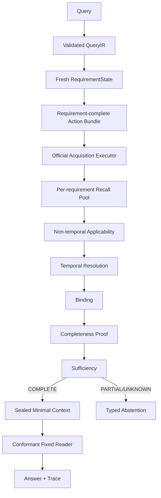

# MiLAi DG-22：证据召回准确性与答案正确性闭环 Goal

> Goal ID：`DG-22`  
> 方法名：`Requirement-Complete Precision Recall`  
> 文档版本：`0.1.0 DRAFT FOR OWNER EXECUTION AUTHORIZATION`  
> 起草日期：`2026-08-29`（Asia/Shanghai）  
> 当前状态：`DOCUMENT READY / IMPLEMENTATION NOT STARTED`  
> 本次 Owner 授权：`生成 Goal 文档；不等于授权执行代码、调用 Reader、打开 formal holdout 或发布 Candidate`  
> 前置终态：`DG-21 = PARKED_NO_SAFE_GENERALIZED_POLICY`  
> 产品边界：`LOCAL MCP / SYNTHETIC OR PUBLIC DEIDENTIFIED OPENED-DEV ONLY`  
> Runtime / Schema：`CANDIDATE / EXPERIMENTAL / NO-GO FOR SCHEMA FREEZE`  
> 冻结基线：`architecture/v1.0/`，禁止原地修改  
> Candidate 默认：`OFF`  
> Formal holdout：`UNTOUCHED / NOT AUTHORIZED`  
> 默认禁止：`CASE-ID RULE / GOLD-AWARE ROUTING / TOP-K INFLATION / MULTI-ROUND LLM SEARCH / AUTO RETRY / SAFETY RELAXATION`

---

# 0. Goal 决定

DG-22 是 DG-21 的准确性 successor。它接受并保持 DG-21 的负终态，不重跑、覆盖或改判 DG-21。

DG-21 已经证明：

```text
Type-directed semantics                 PASS
Preference requirement expressivity     PASS
Query-time temporal channel safety      PASS within stated boundary
Binding computation reduction           93.7481%
Hydration ceiling                       43 <= 64
```

但它没有完成准确性闭环：

```text
Matched Reader strict JSON               FAILED on one frozen identity twice
Matched correctness/effect               UNSCORED
Additional acquisition calls             10 > 8
Opened COUNT cases                        2 remain PARTIAL / EVENT_TIME_UNRESOLVED
All temporal questions complete           false
Safe generalized Core policy              not established
```

因此，DG-22 的目标不是继续证明“组件能够运行”，而是建立并验证：

> **对当前未满足 requirement，Runtime 能否以通用、可审计、预算受限的方式找回真正 answer-bearing Evidence，正确区分相关、可能相关与不相关候选，完成合法 Binding/Sufficiency，并让固定 Reader 稳定消费已封存 Context。**

## 0.1 本 Goal 中“准确性”的定义

本 Goal 禁止用一个最终 F1 混合所有损失。准确性分为五层：

```text
Query accuracy
  = QueryIR、requirement、time axis、operator 与 source role 正确

Recall accuracy
  = answer-bearing / required Evidence 进入候选集

Candidate precision
  = 新候选确实对目标 requirement 有用，而非 topic-similar 噪声

Decision correctness
  = Binding、completeness proof、Sufficiency、operator 与 abstention 正确

Answer correctness
  = 固定 Reader 在合法 Context 上稳定返回有效 JSON 和正确答案
```

其中：

```text
搜索命中 != Binding 正确
Binding 正确 != Evidence set complete
Evidence set complete != Reader contract valid
Reader contract valid != answer correct
```

## 0.2 Primary claims、supporting claims 与 anti-claims

| ID | Claim | Minimum convincing evidence |
| --- | --- | --- |
| C1 Primary | Requirement-complete acquisition、非时间 applicability 与 requirement-local fusion 可以同时提高 required-evidence recall 和 useful-candidate precision | product-faithful mediator；safe-oracle-normalized recall；UsefulCandidateRate；Binding precision；零正确病例回归 |
| C2 Primary | 将 `type/entity/predicate/source/role` applicability 与 temporal resolution 分离，可以减少错误接受与错误阻断，并安全改善 temporal COUNT/多事件组合 | synthetic mutation matrix；两个 opened COUNT failure 的 first-loss shift；Wrong COMPLETE=0；unresolved blocker audit |
| C3 Supporting | 多 requirement 可以在一次官方 acquisition pass 中形成 content-free action bundle，而不需要每个 query 无条件执行额外调用 | batch plan identity；10-case additional calls `<=8`；每个 probe 可追到 requirement；无 hidden second pass |
| C4 Measurement | Reader 错误必须先被准确分类并通过独立 conformance gate，之后才允许执行 matched answer scoring | label-free conformance matrix 100%；invalid JSON 不修补、不重试；固定 Reader contract identity |
| AC1 Anti-claim | 增益不能来自扩大统一 Top-k、增加上下文、换 seed、重复 Reader、放宽 Binding/Sufficiency 或用 source time 冒充 event time | fixed controls；one pass；zero retry；time-axis audit；safety counters |
| AC2 Anti-claim | DG-22 不证明 MiLA 全部记忆问题已解决、Production ready、formal LongMemEval 提升或 Schema 可冻结 | claim boundary、holdout exclusion、candidate default off |

## 0.3 Successor 边界

以下 DG-21 事实保持不变：

```text
DG21 terminal                 PARKED_NO_SAFE_GENERALIZED_POLICY
Preference lane               PASS_PREFERENCE_REQUIREMENT_EXPRESSIVITY
Temporal lane                 PASS_QUERY_TIME_TEMPORAL_COMPLETENESS
                               within its explicit fail-closed boundary
DG21 matched correctness      UNSCORED
Candidate default             false
Formal holdout consumed       false
Production release            unauthorized
```

DG-22 可以修复新的产品内部逻辑和 evaluation Reader conformance，但不得回写 DG-21 receipt。

## 0.4 授权矩阵

只有 owner 明确要求“执行 DG-22 Goal”后，才进入 S0。

| 变更 | 本文预定义 | 执行 DG-22 后是否还需额外授权 |
| --- | --- | --- |
| 内部 QueryIR/Requirement/Binding/Application 兼容演进 | 是 | 否；public MCP schema 必须不变 |
| `AccuracyAcquisitionPolicy v0.3`、selector、action bundle | 是 | 否；默认必须关闭 |
| 官方 FTS/Enriched/Dense/Adjacent/Source/Query-time Event 执行逻辑 | 是 | 否；只允许已有 capability |
| Eval-only Reader conformance/error classification | 是 | 否；不得改变产品 public Reader/MCP contract |
| Reader bounded output ceiling change | 条件允许 | 仅在 S2 证明 `finish_reason=length` 后；上限与全部 matched arms 同时冻结 |
| Reader prompt/model/temperature/seed/scorer change | 否 | 本 Goal 禁止 |
| Provider/controller 加入 acquisition | 否 | 本 Goal 禁止 |
| public MCP request/response schema change | 否 | 需要退出本 Goal并另行授权 |
| PostgreSQL Migration / persistent event projection | 条件定义 | 必须取得 `DG22_EVENT_PROJECTION_AUTHORIZED` |
| formal holdout | 否 | 必须另行授权；本 Goal 默认 0 case |
| Candidate default-on / Production | 否 | 本 Goal 禁止 |

---

# 1. 权威事实基线

## 1.1 规范优先级

发生冲突时按以下顺序解释：

1. `architecture/v1.0/` frozen bundle；
2. `MiLAi_Logical_Architecture_v1_设计文档.md` frozen MUST；
3. `MiLAi_Lean_V1_实施合同.md`；
4. executable Runtime、真实 PostgreSQL tests；
5. DG-21 S9/S8/S7/S5 sealed receipts、traces 与 manifests；
6. DG-20 terminal/matched evidence；
7. 本 Goal；
8. runbook、README、注释与命名。

必须保留：

```text
G5 Candidate-Safe Retrieval
G7 Bounded Traceable Context
I-01 EvidenceRecord != ClaimVersion
I-07 EffectiveClaimState is the only current/authority decision source
I-08 projection/search/context/model cannot raise truth or authority
I-09 authority/confidence/freshness/scope/time remain orthogonal
I-10 revoke/permission/retention unknown fail closed
I-12 authority-bearing answer remains traceable
```

## 1.2 绑定输入与 SHA-256

| Artifact | SHA-256 | 用途 |
| --- | --- | --- |
| `architecture/v1.0/architecture_manifest.json` | `ac16f3b7f9413a7b2d8373b6e7d306697df0bc7908572bb3b0344260d8a55d0e` | frozen architecture identity |
| `MiLAi_Lean_V1_实施合同.md` | `395a443da282f69a56ae5ea29f0dac07a65da12a697534e5c650c9893f8ae3ba` | implementation contract |
| DG21 S9 terminal receipt | `1f880f13017762e9363fb10ebbd6a9a360b80f9ed537c4b0ae9d5c884ff49347` | predecessor terminal |
| DG21 matched report | `63b4bb95d66d41d97f016cff05db6bdb69cc14413fbdac0ed1d4eda1d8bdc626` | Reader/correctness boundary |
| DG21 efficiency report | `8e45d93d36e9f0df87d5cdecb767467fc5e2df9385defe2867ad84e7ee9d2506` | call/binding/hydration baseline |
| DG21 S5 temporal receipt | `ff7177aa4aebcc8a6151e4286571b0cf49343a1c2ffc7065420e9c316cf9ecca` | temporal boundary |
| DG21 S7 failure analysis | `8334ad10b17acfce769b55985fcc79b5a5116607515b879bece5508c0e2d654c` | repeated Reader failure |
| DG21 source manifest | `4e94629df8f7eb283415f2d4e9e3df94c18fbb57607e3456348d73a5c9dd2042` | 279 source identities |
| DG21 artifact manifest | `d60968d9037e4ef8b146c0b8ad7b34f5a859596f8a92a17acc3b5cf88302807c` | 41 artifact identities |

这些制品只读。DG-22 必须使用新的 `run_id`、目录、source manifest、artifact manifest、failure index 和 terminal receipt。

## 1.3 DG-21 机器事实

### Context 与 Reader

```text
arms                                      4
cases                                     10
token budgets                             512 / 2048
sealed context cells                      80 / 80
labels loaded during context seal         false
Reader progress successes                 5
next frozen Reader identity               strict JSON failed
same failed identity in fresh runs        2 consecutive
automatic retry                           0
correctness scored                        false
effect scored                             false
```

80/80 表示 Context 构造完成，不表示 80 个 Reader 答案完成。

### Label-free efficiency

```text
legacy binding evaluations                3311
current binding evaluations               207
reduction                                 93.7481124%
candidates hydrated                       43 <= 64
additional acquisition calls              10 > 8
materialized type mismatch                0
```

### Temporal boundary

```text
opened temporal cases                     3
event-point OperatorReady gain             1
opened COUNT cases remaining PARTIAL       2
remaining cases                            2e6d26dc / 88432d0a
reason                                     EVENT_TIME_UNRESOLVED
wrong COMPLETE                             0
```

其中一个 COUNT case 的完整 snapshot 审计观察到：

```text
source scan items                          494
event interpretations                     403
event interval projected                   83
projection rate                            20.5955%
target source turns scan-reachable         yes
operator ready                             no
```

这说明 first loss 已从“找不到源 turn”移动到“相关性、event-time applicability 和 completeness blocker 定义”。

## 1.4 DG-20 正确性 floor

2048-token：

```text
RequiredEvidenceSetCoverage                0.347826087 = 8/23
OperatorReady                              2
Exact Match                                2/10
Normalized F1                              0.234848485
additional acquisition calls               8
Wrong COMPLETE                             0
```

512-token：

```text
RequiredEvidenceSetCoverage                0.304347826 = 7/23
OperatorReady                              2
Exact Match                                1/10
Normalized F1                              0.219896104
```

这些是不可回归 floor，不是 DG-22 的成功目标。

## 1.5 当前代码级 Observed facts

| ID | Observed implementation | Consequence |
| --- | --- | --- |
| O22-01 | `select_acquisition_execution_profile()` 通过 `_target_requirement()` 只选择一个 missing requirement | 多缺口 query 不能形成同 pass 的 requirement-complete plan |
| O22-02 | `semantic_slot` 在无 anchor 时通常顺序落到 Dense/Raw；没有 expected-new-binding 或 no-gain guard | D arm 对 10/10 case 都执行 extra pass |
| O22-03 | `compile_acquisition_plan()` 同时存在 global 和 per-slot probes；RRF 发生在 semantic Binding 之前 | topic overlap 可能压过 requirement-local usefulness |
| O22-04 | `CandidateEnvelope.event_occurrence_interval` 在普通 fusion 中为 `None` | event applicability 只能在后续正文解释中恢复 |
| O22-05 | `BindingCompatibility` 只有 type/entity/unit/temporal/episode | predicate、source role、speaker/semantic role 没有独立判定轴 |
| O22-06 | EVENT entity compatibility 使用宽松词集合重叠；predicate_constraints 未成为独立 Binding gate | 宽泛事件可能被判为相关或可能相关 |
| O22-07 | EVENT_TIME 缺失时 `_temporal_compatibility()` 返回 `FAIL` | “未知”与“确定不在范围”混为一类 |
| O22-08 | Generic temporal COUNT 的 unresolved blocker 使用 entity `PASS/NOT_APPLICABLE`，不要求非时间 applicability 已成立 | 大量不相关、无日期 EVENT interpretation 可以阻断 completeness |
| O22-09 | Reader parser 在 `json.loads` 失败后只暴露 generic invalid JSON；失败 receipt 缺少可公开的 finish-reason classification | 无法区分 output-limit、grammar、transport 和 schema failure |
| O22-10 | policy version literal 为 `dg21-opened-dev-v0.1` | 当前配置身份不适合作为通用 Candidate policy |

---

# 2. 问题与冲突登记

| ID | Conflict | First-loss risk | Required disposition |
| --- | --- | --- | --- |
| C22-01 | Context 完整但 Reader contract 重复失败 | READER / MEASUREMENT | 独立 conformance lane；未通过前不得评分 |
| C22-02 | Reader invalid JSON 未保存足够 typed classification | PROVIDER RESPONSE | finish reason/token usage/error class receipt；正文仍不公开 |
| C22-03 | 每个 query 最多一个 target，不能覆盖多 requirement | PLAN / ACQUISITION | requirement-complete action bundle；一次官方 pass |
| C22-04 | D arm 对 10/10 case 执行 extra call | POLICY / COST | no-action eligibility、expected-gain、already-covered/no-targetable fast stop |
| C22-05 | global/slot/channel RRF 在 Binding 前混合 | FUSION / CUTOFF | requirement-local recall pool、channel-local normalization、post-applicability utility ordering |
| C22-06 | predicate/source/role 缺少 Binding 轴 | BINDING | `NonTemporalApplicability v0.1` 或 Binding v0.2 |
| C22-07 | unresolved temporal = FAIL | BINDING / OBSERVATION | `UNKNOWN` 与 `OUT_OF_RANGE` 分离 |
| C22-08 | COUNT unresolved blocker 过宽 | COMPLETENESS_PROOF | 只有 non-temporal MATCH/POSSIBLE 候选的未解析时间可以阻断 |
| C22-09 | event time 只看单 span，缺 bounded local anchor provenance | INTERPRETATION | 同 round/adjacent turn 的显式时间锚定，保留 anchor relation |
| C22-10 | query-time full snapshot event interpretation 噪声大 | PRECISION / COST | predicate-first filter、typed event family、hydrate/proof 分离 |
| C22-11 | `matched_slots` 表示 probe 命中，不表示真实 Binding | METRIC / RANKING | 分开 `probe_attribution` 与 `binding_attribution` |
| C22-12 | DG-21 accuracy/effect 未评分 | CLAIM | 新 Reader identity 和新 sealed product 后才允许评价 |
| C22-13 | current policy 名称、默认和配置绑定 opened-dev | GENERALITY | content-free `AccuracyAcquisitionPolicy v0.3`，默认关闭、可回滚 |

## 2.1 保持为正确行为

```text
unknown event time                         must not become in-range
unresolved relevant event time             may block COUNT completeness
wrong source/scope/role                     must be rejected
projection hit                              remains candidate only
candidate non-empty                         does not imply COMPLETE
no safe action                              returns typed abstention
invalid Reader JSON                         is unusable
Provider/controller unavailable             does not trigger hidden fallback
```

## 2.2 禁止的“准确性修复”

```text
统一 Top-k 8 → 32/64
所有 query 都启用 Dense
Reader 失败后自动再调用
截断 JSON 自动补括号或提取部分 answer
把 source_observed_at 当 event occurrence time
把 temporal UNKNOWN 当 PASS
减少 required requirement 或降低 cardinality
用 case_id、source ref、expected answer 选择 action
在 eval 层实现 ranking/filter/neighbor/temporal scan
修改 scorer、label 或 case order
打开 formal holdout 寻找成功配置
```

---

# 3. 目标架构合同

## 3.1 唯一准确性链



必须保持：

```text
Runtime chooses executable acquisition
Runtime validates applicability and Binding
Runtime owns Sufficiency and COMPLETE
Reader only consumes sealed Context
Scorer only opens labels after product seal
```

## 3.2 `AccuracyAcquisitionPolicy v0.3`

建议内部合同：

```yaml
schema_version: accuracy-acquisition-policy-v0.3
policy_version: dg22-candidate-v0.1
policy_digest: sha256
default_enabled: false

guards:
  max_extra_passes_per_query: 1
  provider_controller_calls: 0
  automatic_retries: 0
  allow_case_id: false
  allow_gold_inputs: false
  allow_time_axis_substitution: false
  stale_state: REJECT
  stale_capability: REJECT
  stale_policy: REJECT

planning:
  action_bundle_enabled: true
  max_target_requirements: 3
  merge_same_channel_probes: true
  include_only_unsatisfied_required: true
  skip_complete: true
  skip_no_targetable: true
  skip_semantics_owner: true
  skip_exhausted_channel: true
  one_official_execution_pass: true

recall_pool:
  raw_per_requirement: 8
  enriched_per_requirement: 8
  dense_per_requirement: 12
  development_caps: [8, 12, 16]
  global_probe_default: false
  preserve_channel_local_rank: true
  cross_channel_raw_score_comparison: false

admission:
  require_governance_gate: true
  distinguish_probe_and_binding_attribution: true
  non_temporal_axes:
    - TYPE
    - ENTITY
    - PREDICATE
    - SOURCE
    - ROLE
  temporal_axis_separate: true
  unknown_is_not_fail: true
  match_requires_all_required_axes_pass: true

fusion:
  first_reserve_per_missing_requirement: true
  then_order_by_binding_utility: true
  dedupe_by_evidence_region: true
  prefer_new_region: true
  repeated_region_penalty_without_magic_boost: true
  post_binding_context_cap: 8

temporal:
  source_time_substitution: false
  explicit_event_time: ACCEPT
  bounded_relative_event_time: ACCEPT_WITH_ANCHOR_PROVENANCE
  local_anchor_radius: 2
  unresolved_relevant_event: BLOCK_COMPLETENESS
  unresolved_irrelevant_event: DO_NOT_BLOCK
  arbitrary_tolerance_widening: false
```

所有数值是 development ceiling，不是 Production SLA。S1–S6 可以在预冻结的 `8/12/16` matrix 中选择一次；S7 之后不得调参。

## 3.3 Requirement-complete action bundle

当前单 target decision：

```text
missing requirements
→ choose one
→ one action
```

DG-22 改为：

```text
all required unsatisfied requirements
→ classify first loss
→ discard SEMANTICS_OWNER / NO_TARGETABLE / exhausted channel
→ group feasible actions by official channel
→ compile one bounded AcquisitionPlan
→ execute one extra pass
```

一个 bundle 可以包含多个 probe，但必须满足：

```text
each probe has target_requirement_id
same channel probes may batch
different channel repository operations remain separately counted
extra pass count <= 1/query
no observation-driven second round
no model-selected channel
```

若 required unsatisfied requirements 超过 `max_target_requirements`，未进入 bundle 的 requirement 必须保留为
`BUDGET_EXHAUSTED / PARTIAL`；禁止把 cap 截断解释为 requirement complete。`expected-gain` 只能由
RequirementState、first-loss、历史 channel execution、new-region 与 capability 状态确定，不得使用标签、答案或
learned case score。

## 3.4 Recall pool、applicability 与 Binding 分离

候选状态必须分层：

```text
RETRIEVED
→ GOVERNANCE_ELIGIBLE
→ NON_TEMPORAL_MATCH | NON_TEMPORAL_POSSIBLE | NON_TEMPORAL_REJECTED
→ TEMPORAL_MATCH | TEMPORAL_UNKNOWN | TEMPORAL_REJECTED
→ BINDING_MATCH | BINDING_POSSIBLE | BINDING_REJECTED
```

`NonTemporalApplicability` 最低字段：

```yaml
requirement_id:
interpretation_id:
type: PASS | FAIL | UNKNOWN | NOT_APPLICABLE
entity: PASS | FAIL | UNKNOWN | NOT_APPLICABLE
predicate: PASS | FAIL | UNKNOWN | NOT_APPLICABLE
source: PASS | FAIL | UNKNOWN | NOT_APPLICABLE
role: PASS | FAIL | UNKNOWN | NOT_APPLICABLE
status: MATCH | POSSIBLE | REJECTED
reason_code:
```

规则：

1. predicate 不得由“同为 EVENT”自动满足；
2. preferred speaker 只影响 ranking，allowed speaker 才是 hard gate；
3. semantic role 缺失时是 `UNKNOWN`，不是猜测；
4. `UNKNOWN` 不能变成 accepted Binding；
5. 非时间 `REJECTED` candidate 的 event time 未解析不阻断 temporal completeness；
6. 非时间 `MATCH/POSSIBLE` 且 event time 未解析时，必须保留为明确 blocker；
7. 所有判断保留 exact source span 与 reason code。

## 3.5 Event-time resolution contract

合法来源：

```text
same-span explicit absolute date/time
same-span bounded relative expression + source/round reference
same-round structured anchor + exact adjacency relation
adjacent turn explicit anchor within configured radius
existing typed event occurrence interval with provenance
```

禁止来源：

```text
message observed time silently substituted
arbitrary nearest date
different session topic-similar date
Reader/model guess
gold answer date
case-specific parser
```

每个 resolved event interval 必须保存：

```text
normalized interval
time basis
anchor evidence/span ID
relation to event span
normalizer version
timezone/precision
ambiguity disposition
```

## 3.6 COUNT completeness blocker

定义：

```text
RelevantUnresolvedEvent
= non_temporal_status in {MATCH, POSSIBLE}
 + event_status can affect operator
 + temporal_status == UNKNOWN
 + source is live/readable/permitted
```

只有 `RelevantUnresolvedEvent` 可以阻止 COMPLETE。以下对象不阻止：

```text
wrong entity
wrong predicate/event family
wrong allowed speaker/source role
revoked/unreadable/out-of-scope
planned/cancelled when operator excludes them
duplicate region already proven same event
```

但“不阻止”不等于删除：所有 rejected/ignored candidate 仍进入 audit count 和 reason summary。

## 3.7 Reader Conformance Contract v0.2

Reader lane 只解决可评分性，不作为 retrieval treatment。

必须记录：

```text
model identity
prompt contract digest
response schema digest
seed/logical request identity
prompt/completion token usage
finish reason
native request ID
content byte length/hash
parse failure class
```

错误分类：

```text
OUTPUT_LIMIT_TRUNCATED
STRUCTURED_DECODING_FAILED
TRANSPORT_ENVELOPE_INVALID
CONTENT_NOT_JSON
SCHEMA_VIOLATION
TOKEN_ACCOUNTING_MISMATCH
```

约束：

```text
invalid output is never repaired or scored
automatic retry = 0
same failed DG21 identity is not reissued
prompt/model/temperature/top_p remain frozen
output ceiling may change only after isolated evidence
all matched arms use the same new contract identity
```

---

# 4. Work Packages

## DG22-WP00 — Baseline、identity 与 denominator freeze

交付：

- 绑定 DG-21 S9/S7/S5/S2、DG-20 S5 artifacts；
- 验证 279 source 与 41 artifact identities；
- 冻结 10 opened-dev cases、23 required Evidence denominator；
- 冻结 6 prior zero-gain cases、2 opened COUNT cases、correct-case set；
- 冻结 Reader failure identity，只允许 quarantine；
- 建立当前 code/source manifest；
- formal holdout overlap `0/N`。

硬门：

```text
bound artifact hash match                  = 100%
denominator mismatch                       = 0/N
failed Reader identity reissued             = 0
formal holdout consumed                     = false
```

## DG22-WP01 — Accuracy oracle 与 first-loss ledger

零 Reader、零 Provider/controller。

对每个 required requirement 保存：

```text
QueryIR correctness
safe channel reachability
raw rank per channel
cutoff survival
governance eligibility
non-temporal applicability
temporal status
Binding status
completeness effect
operator readiness
```

Oracle 只允许已有 official acquisition channels，不能用 gold source 选择 product action。Gold 仅在 sealed product trace 后由 scorer 计算 reachability ceiling。

输出：

```text
safe-oracle-requirement-ledger.json
first-loss-ledger.json
channel-reachability-report.json
accuracy-baseline.json
```

## DG22-WP02 — Reader conformance 与 typed failure

S2 分为两个预声明阶段：

```text
S2A typed diagnosis       8 label-free identities under the current contract
S2B conformance          32 label-free identities under one frozen selected contract
maximum total calls      40
contract candidates       current or one evidence-authorized bounded successor
```

每个 identity 只调用一次。S2A 的失败保留在 diagnosis denominator；S2B 使用新的 contract/logical identity，
不属于自动重试，也不得重新发放 DG-21 已隔离 identity。

S2B 的 label-free synthetic/context-shape matrix 至少覆盖：

```text
token budgets             512 / 2048
answer shapes             lookup / count / date / list / UNKNOWN
context size              short / near budget
Unicode                   ASCII / CJK / punctuation-heavy
expected answer length    short / bounded-long
```

最低 `32` cells。每个 cell 只调用一次。

如果且仅如果观察到：

```text
finish_reason == length
AND completion_tokens == frozen ceiling
AND body is truncated JSON prefix
```

可以将 eval-only `MAX_OUTPUT_TOKENS` 从 256 提高到不超过 512；必须形成新 contract digest，并对全部 arms 一致。不得根据答案分数选择 ceiling。

硬门：

```text
valid strict JSON                          = 32/32
schema-valid answer envelope               = 32/32
automatic retry                            = 0
response salvage                           = 0
model/prompt/seed drift                     = 0
```

若失败：

```text
PARKED_READER_CONTRACT_UNRELIABLE
```

不进入 matched answer scoring，但 WP03–WP07 的 acquisition-only 工作可以继续。

## DG22-WP03 — Query/Requirement correctness

交付：

- QueryIR requirement exactness fixture；
- operator、time axis、boundary、speaker/source、cardinality annotation；
- paraphrase/negation/quoted-speech/multi-slot mutation matrix；
- internal compatibility adapter；
- ambiguous query typed fail-closed；
- no case-ID/source-ref dependency audit。

最低 synthetic/mutation cells：`60`。

硬门：

```text
required requirement precision             = 100%
required requirement recall                = 100%
operator/time-axis accuracy                 = 100%
unsupported COMPLETE                       = 0/N
case-id/gold dependency                     = 0/N
```

这些 100% 只适用于预声明的 bounded synthetic/opened-dev annotation，不是开放世界主张。

## DG22-WP04 — Non-temporal applicability 与 Binding v0.2

交付：

- type/entity/predicate/source/role 独立轴；
- temporal UNKNOWN 与 FAIL 分离；
- exact span preservation；
- `probe_attribution` / `binding_attribution` 分离；
- non-temporal MATCH/POSSIBLE/REJECTED receipt；
- old v0.1 sealed trace read adapter；
- RequirementState/Sufficiency non-regression replay。

硬门：

```text
annotated accepted Binding precision        = 100%
annotated required Binding recall           >= DG21
unresolved temporal mislabeled FAIL         = 0/N
non-temporal rejected event blocks COUNT    = 0/N
wrong COMPLETE                              = 0/N
```

## DG22-WP05 — Requirement-complete acquisition 与 precision fusion

交付：

- action bundle domain contract；
- all-missing requirement selection；
- same-channel probe batching；
- global probe default removal；
- channel-local score/rank normalization；
- per-requirement quota；
- new-region/dedup control；
- post-applicability binding-utility order；
- expected-gain/no-target/exhausted fast stop；
- effective budget/owner receipt；
- official executor integration。

硬门：

```text
extra passes per query                     <= 1
additional calls on matched 10             <= 8
all executed probes target a requirement   = 100%
unattributed global probe                   = 0/N
repeated accepted region                    = 0/N
Provider/controller calls                  = 0/N
automatic retries                          = 0/N
```

## DG22-WP06 — Temporal applicability 与 COUNT completeness

交付：

- bounded local time-anchor resolver；
- event span/anchor provenance relation；
- relevant-unresolved blocker；
- event status/predicate family applicability；
- dedupe identity proof；
- query-time snapshot proof复用；
- `2e6d26dc`、`88432d0a` 只作为 scorer cases，不进入 Runtime selector；
- positive/negative synthetic temporal matrix。

硬门：

```text
time-axis substitution                     = 0/N
unproven local anchor accepted             = 0/N
irrelevant unresolved event blocks count   = 0/N
relevant unresolved event ignored          = 0/N
dedupe collision/false merge               = 0/N
opened COUNT wrong COMPLETE                = 0/2
```

若两例仍因真实 event time representation 不足而 partial，允许 honest terminal：

```text
PARKED_EVENT_TIME_REPRESENTATION_AUTH_REQUIRED
```

不得写 case-specific date parser。

## DG22-WP07 — Product-faithful mediator seal

固定：

```text
same 10 opened-dev cases
same source snapshot
same case order
same scorer truth
same 512/2048 context budgets
candidate default false
formal holdout untouched
```

比较：

```text
A DG20 terminal baseline
B DG21 final policy/context identity
C DG22 query/binding correctness only
D C + requirement-complete acquisition/fusion
E D + safe temporal applicability/count
```

产品 trace 先 seal，之后 scorer 才能加载 answer-bearing labels。WP07 不调用 Reader。

## DG22-WP08 — Matched answer correctness

Entry gate：

```text
WP02 Reader conformance PASS
AND WP07 mediator hard gates PASS
AND policy/context/Reader/scorer identities frozen
```

只比较：

```text
frozen DG20 baseline answer/context reuse
vs
frozen DG22 final candidate
```

每个新 context identity 最多一次 Reader call；相同 context/contract/seed 可以 content-addressed reuse。失败 output 不能复用。

## DG22-WP09 — Quality、PostgreSQL、Security 与 rollback

交付：

- Runtime unit/contract/integration/security；
- DG22 evaluation tests；
- strict mypy；
- Ruff；
- fresh ephemeral PostgreSQL roles/RLS；
- reader conformance tests；
- source/artifact manifest；
- runbook/rollback；
- failure receipt index。

如果没有 Migration，明确记录：

```text
database_schema_changed_by_dg22 = false
```

不能把它写成 persistent event projection 已完成。

## DG22-WP10 — Terminal seal

生成唯一 S10 terminal receipt，逐项引用前置 receipt，不重新计算或覆盖失败证据。

---

# 5. Stage 执行顺序

```text
S0 Baseline and Identity Freeze
→ S1 Accuracy Oracle and First-loss Ledger
→ S2 Reader Conformance
→ S3 Query/Requirement Correctness
→ S4 Applicability and Binding v0.2
→ S5 Requirement-complete Acquisition/Fusion
→ S6 Temporal Applicability and COUNT
→ S7 Product-faithful Mediator Seal
→ S8 Matched Answer Correctness
→ S9 Quality/PostgreSQL/Security
→ S10 Terminal Seal
```

## S0 — Baseline and Identity Freeze

零行为修改、零 Reader、零 Provider。保存 worktree inventory、artifact hashes、denominator 和 forbidden identity。

## S1 — Accuracy Oracle

先回答：

> 每个 required requirement 在哪个正式 channel 可达？到达后首次在哪一层失去？

没有 safe oracle reachability 的 requirement 不进入 policy gain 分母，而进入 `CAPABILITY_OR_REPRESENTATION_UNAVAILABLE`。

## S2 — Reader Conformance

Reader conformance 与 retrieval 开发并行逻辑上独立，但执行时不允许通过换 model/prompt/seed寻找 PASS。

## S3 — Query/Requirement Correctness

S3 失败时不得进入 recall tuning，因为错误 requirement 的高召回没有意义。

## S4 — Applicability and Binding

S4 先修 false acceptance/false blocker，再允许改变 ranking。不能用 ranking 隐藏 Binding 缺陷。

## S5 — Acquisition/Fusion

只在 S4 frozen contract 上选择 policy。`8/12/16` 每个 config 一次 functional run；选定后冻结 digest。

## S6 — Temporal COUNT

先跑 synthetic positive/negative，再跑两例 opened scorer。若需要 persistent projection，停止并请求授权。

## S7 — Mediator Seal

S7 只回答 retrieval/Binding/completeness；不得因 Reader 不可用而阻塞或修改 product trace。

## S8 — Answer Correctness

Reader 只消费 S7 sealed Context。S8 期间不得调整 retrieval、packing、prompt、output budget 或 scorer。

## S9 — Quality

按实际改动风险运行全量门禁。临时数据库必须删除并记录 cleanup。

## S10 — Terminal

只有 S0–S9 权威 receipt 齐全时封存。任何 partial/parked 必须准确写入 terminal，不以文档目标替代结果。

---

# 6. Claim-driven experiment blocks

| Block | Claim | Compared systems | Decisive evidence | Priority | Failure interpretation |
| --- | --- | --- | --- | --- | --- |
| B1 Reader conformance | C4 | frozen DG21 contract vs typed/conditionally bounded DG22 eval contract | JSON/schema validity、finish reason、zero retry | MUST-RUN prereq | 失败则 answer effect 不评分；不否定 retrieval |
| B2 Query + applicability | C1/C2 | DG21 Binding vs non-temporal/temporal-separated Binding | precision/recall、UNKNOWN/FAIL、false blocker | MUST-RUN | precision下降立即停止 |
| B3 Requirement-complete recall | C1/C3 | single-target/RRF vs action-bundle/requirement-local fusion | safe-oracle recall、UsefulCandidateRate、calls | MUST-RUN | 只增加候选不增加 useful binding 为失败 |
| B4 Temporal COUNT | C2 | current query-time event vs relevant-blocker/local-anchor resolver | two COUNT cases、proof、wrong COMPLETE | MUST-RUN |  representation 不足则 typed PARK，不放宽时间 |
| B5 Matched correctness | C1–C4/AC1 | DG20 baseline vs frozen DG22 final at 512/2048 | coverage、OperatorReady、EM/F1、安全、成本 | MUST-RUN | Reader/accuracy/efficiency任一硬门失败均不能 Full PASS |

明确 CUT：

```text
Residual Provider cue
multi-round ReFind loop
model-selected channel
Reader prompt/model sweep
formal holdout
Production/default-on
new external vector database
case-specific temporal ontology
```

---

# 7. Metrics

## 7.1 Query 与 Requirement

```text
RequiredRequirementPrecision
RequiredRequirementRecall
OperatorClassificationAccuracy
TimeAxisAccuracy
BoundaryAccuracy
CardinalityContractAccuracy
Allowed/PreferredSourceAccuracy
AmbiguityFailClosedRate
```

## 7.2 Candidate recall

```text
GoldTurnCandidateRecall
AnswerBearingSpanCandidateRecall
TargetRequirementCandidateRecall
RequiredEvidenceCandidateRecall
SafeOracleReachableRequirementCount
SafeOracleNormalizedRecall
GoldTurnRank / MRR
CutoffSurvivalRate
```

定义：

$$
\text{SafeOracleNormalizedRecall}
=
\frac{\#\text{系统找回的 safe-oracle-reachable requirements}}
{\#\text{safe-oracle-reachable requirements}}
$$

## 7.3 Precision 与 Binding

```text
UsefulCandidateRate
NoisePerUsefulCandidate
NonTemporalApplicabilityPrecision
NonTemporalApplicabilityRecall
AcceptedBindingPrecision
RequiredBindingRecall
FalseTemporalRejectRate
FalseTemporalAcceptRate
IrrelevantUnresolvedBlockerRate
RelevantUnresolvedIgnoredRate
ProbeAttributionVsBindingAttributionMismatch
```

定义：

$$
\text{UsefulCandidateRate}
=
\frac{\#\text{new candidates finally MATCH-bound to the target requirement or used by a valid completeness proof}}
{\#\text{all new governed candidates}}
$$

`POSSIBLE` 单独报告，不能进入 UsefulCandidateRate 分子，避免通过扩大 UNKNOWN/POSSIBLE 获得虚假 precision。

## 7.4 Completeness 与最终正确性

```text
RequiredEvidenceSetCoverage
OperatorReady
Range/Partition/DedupeProofAccuracy
SufficiencyStatusAccuracy
AbstentionCorrect
Wrong COMPLETE
CorrectCaseRegression
Exact Match
Normalized F1
```

## 7.5 Reader

```text
StrictJsonValidityRate
SchemaValidityRate
OutputLimitTruncationRate
StructuredDecodingFailureRate
ProviderEnvelopeValidityRate
ReaderCallSuccessRate
CompletionTokens
```

## 7.6 成本

```text
AdditionalAcquisitionCalls
RepositoryProbeCalls
CandidatesScanned
CandidatesHydrated
BindingEvaluationCount
EventInterpretationCount
EventIntervalProjectionRate
CPU/wall latency
Reader calls/tokens
temporary database lifecycle
```

---

# 8. Hard Gates

## 8.1 不可降低的安全门

```text
Wrong COMPLETE                              = 0/N
wrong scope/tenant/permission               = 0/N
revoked/deleted/unreadable Evidence accepted = 0/N
authority escalation                        = 0/N
canonical mutation                          = 0/N
time-axis substitution                      = 0/N
automatic retry                             = 0/N
Provider/controller acquisition calls       = 0/N
case-id/gold-aware routing                   = 0/N
formal holdout consumed                      = false
frozen architecture changed                 = false
candidate default                           = false
```

## 8.2 Reader 门

```text
label-free conformance cells valid           = 100%
invalid JSON accepted/repaired               = 0/N
matched Reader contract failures             = 0/N
same failed DG21 identity reissued            = 0
```

Reader 门失败不允许宣称 answer effect，但 acquisition mediator 可以独立 terminal。

## 8.3 Recall/precision 门

```text
SafeOracleNormalizedRecall                   >= 0.80
RequiredEvidenceSetCoverage @2048             >= 12/23 = 0.521739130
RequiredEvidenceSetCoverage @512              >= 10/23 = 0.434782609
prior zero-gain cases with Binding/Operator gain >= 4/6
UsefulCandidateRate                          >= 0.30
AcceptedBindingPrecision                     = 100% on frozen annotation
CorrectCaseRegression                        = 0/N
```

上述 absolute coverage 相比 DG20 分别要求 `+4/23` 与 `+3/23`。如果 S1 safe oracle 证明上限低于阈值，必须在 S1 terminal 显式报告并请求 owner 修改 Goal；执行中不得事后降低门槛。

## 8.4 Completeness 门

```text
SufficiencyStatusAccuracy                    = 100% on frozen bounded matrix
opened temporal event-point non-regression   = 0/N
opened COUNT wrong COMPLETE                  = 0/2
opened COUNT mediator entry gate:
  at least one case gains applicable Binding
  or OperatorReady                           = true
opened COUNT Full temporal PASS:
  RangeCountCorrect / OperatorReady          = 2/2
unresolved blocker classification accuracy   = 100% on frozen matrix
```

若真实 event representation 不足，可以 fail closed，但不能获得 Full temporal 或 Overall PASS。

## 8.5 Answer 门

2048：

```text
Exact Match                                  >= 3/10
Normalized F1                               >= 0.30
```

512：

```text
Exact Match                                  >= 2/10
Normalized F1                               >= 0.27
```

两档同时要求：

```text
baseline-correct case regression             = 0
Wrong COMPLETE                               = 0
```

2048 门相对 DG20 至少要求 `+1` Exact Match 和约 `+0.06515` F1；512 门至少要求 `+1` Exact Match
和约 `+0.05010` F1。小分母结果只作为 opened-development engineering gate，不形成统计或论文主张。

## 8.6 效率门

```text
BindingEvaluationReduction vs legacy         >= 70%
CandidatesHydrated on matched 10 @2048        <= 64
AdditionalAcquisitionCalls matched 10 @2048   <= 8
extra passes per query                       <= 1
targetless/complete auxiliary calls           = 0/N
latency repeats                              only after correctness seal
```

准确性优先不等于取消预算。若达到准确性但 `calls>8`，terminal 必须是 partial，不能 Full PASS。

---

# 9. Test Plan

## 9.1 Unit

```text
policy v0.3 validation/digest/rollback
action bundle grouping and cap
complete/no-target/semantics-owner/exhausted fast stop
predicate/source/role applicability
temporal UNKNOWN vs FAIL
probe attribution vs binding attribution
channel-local normalization
per-requirement quota and dedupe
local time-anchor provenance
relevant unresolved blocker
COUNT dedupe/completeness
Reader finish-reason/error classification
```

## 9.2 Contract

```text
official executor only
one extra pass / zero retry
public MCP schema unchanged
product Reader/MCP contract unchanged
state/capability/policy digest rejection
legacy Binding trace read compatibility
candidate default false
formal holdout exclusion
```

## 9.3 Real PostgreSQL integration/security

```text
scope/RLS for FTS/Dense/source/event/adjacency
revoked/unreadable candidate rejection
same-channel batched probes preserve tenant context
statement timeout typed failure
watermark/dead-letter snapshot proof
connection context reset
temporary database cleanup
conditional event projection migration/rollback only when authorized
```

## 9.4 Evaluation

```text
60+ Query/Requirement mutation cells
32+ Reader conformance cells
non-temporal/temporal Binding matrix
10-case mediator at 512/2048
2 COUNT failure-class diagnosis
matched answer scoring only after gates
per-requirement first-loss ledger
```

## 9.5 Quality

```text
runtime unit
runtime contract
DG22 evaluation
strict mypy runtime
strict mypy eval/runner
Ruff runtime
Ruff eval/runner
real PostgreSQL integration/security
architecture validate/verify lock
```

每个实际命令必须保存 argv、cwd、exit code、summary、wall time、log hash。本文不虚构尚未实现的 runner 名称或测试数量。

---

# 10. Failure Discipline

## 10.1 First-loss 枚举

```text
QUERY_IR
→ REQUIREMENT
→ ACTION_BUNDLE
→ CAPABILITY
→ CHANNEL
→ RAW_RANK
→ FUSION
→ CUTOFF
→ GOVERNANCE_GATE
→ SPAN
→ NON_TEMPORAL_APPLICABILITY
→ TEMPORAL_RESOLUTION
→ BINDING
→ COMPLETENESS_PROOF
→ SUFFICIENCY
→ CONTEXT_PACKING
→ READER_CONFORMANCE
→ READER_UTILIZATION
→ SCORER
```

每个 required requirement 只能有一个 first loss；secondary loss 可以记录，不能重分母。

## 10.2 Fresh run 与失败保留

```text
fresh run_id
fresh artifact directory
immutable pre-run plan
source/policy/capability/Reader/scorer digests
failed receipt retained
failure ledger append-only
```

## 10.3 立即停止条件

```text
wrong COMPLETE
scope/permission/revoke fail-open
source time substituted as event time
case-id/gold-aware product logic
Reader output salvage or retry
model/prompt/seed/scorer drift
extra pass > 1/query
eval-owned acquisition/ranking/filter/expansion
formal holdout opened
frozen architecture modified
unauthorized Migration
```

## 10.4 Diagnosis budget

失败后只允许：

```text
one case
one requirement
one first-loss owner
one source/policy/contract identity
one narrow fix
one narrow test
one fresh bounded rerun
```

不得反复全量 rerun、换 seed、增加 Top-k、删除失败 denominator 或放宽 scorer。

---

# 11. Rollback 与兼容

## 11.1 无 Schema lane

```text
candidate flag remains false
AccuracyAcquisitionPolicy v0.3 can roll back by digest
DG21 v0.2 remains callable for comparison
legacy Binding v0.1 trace remains readable
no public MCP change
no canonical rewrite
no backfill
```

## 11.2 Reader lane

- Reader conformance contract是 evaluation identity，不修改 Memory truth；
- rollback 到旧 contract 后只允许复现旧 baseline，不允许重新发放 quarantined identity；
- prior successful Reader answers只有 exact context/model/contract/seed identity 全匹配才可复用；
- invalid/failed output永不进入 reuse index。

## 11.3 Conditional Schema lane

只有获得 `DG22_EVENT_PROJECTION_AUTHORIZED` 后才允许：

```text
ADR
Migration upgrade/downgrade
projection version/backfill/rebuild
outbox/watermark/dead-letter
revoke/delete/purge propagation
RLS/roles
real PostgreSQL rollback receipt
```

未经授权：

```text
schema lane = NOT_ENTERED_SCHEMA_AUTH_REQUIRED
```

---

# 12. Deliverables

执行完成后必须交付：

1. DG-22 baseline/identity receipt；
2. safe-oracle requirement ledger；
3. new first-loss ledger；
4. Reader Conformance Contract v0.2 与 32+ cell report；
5. Query/Requirement 60+ mutation matrix；
6. `NonTemporalApplicability` / Binding v0.2 compatible contract；
7. temporal UNKNOWN/FAIL separation；
8. `AccuracyAcquisitionPolicy v0.3`；
9. requirement-complete action bundle；
10. channel-local/requirement-local fusion；
11. probe/binding attribution split；
12. bounded local event-time anchor resolver；
13. relevant-unresolved COUNT blocker；
14. product-faithful mediator report；
15. matched 512/2048 answer report，或 Reader typed parked receipt；
16. recall/precision/Binding/completeness metrics；
17. cost/latency report；
18. Runtime unit/contract/evaluation receipts；
19. real PostgreSQL integration/security receipt；
20. strict mypy/Ruff receipts；
21. runbook/rollback；
22. source/artifact manifest；
23. append-only failure index；
24. S10 terminal receipt。

---

# 13. Terminal Dispositions

## 13.1 Reader lane

```text
PASS_READER_CONFORMANCE
PARKED_READER_CONTRACT_UNRELIABLE
NOT_ENTERED_PRECONDITION_FAILURE
```

## 13.2 Recall/Binding lane

```text
PASS_REQUIREMENT_COMPLETE_RECALL_PRECISION
PARTIAL_RECALL_GAIN_PRECISION_GATE_MISS
PARTIAL_PRECISION_PASS_NO_RECALL_GAIN
PARKED_NO_SAFE_GENERALIZED_ACCURACY_POLICY
FAIL_SAFETY_OR_REGRESSION
```

## 13.3 Temporal lane

```text
PASS_TEMPORAL_APPLICABILITY_AND_COUNT
PARTIAL_EVENT_POINT_ONLY_COUNT_UNRESOLVED
PARKED_EVENT_TIME_REPRESENTATION_AUTH_REQUIRED
FAIL_TEMPORAL_SAFETY_OR_PROOF
```

## 13.4 Answer lane

```text
PASS_MATCHED_ANSWER_CORRECTNESS
PARTIAL_MEDIATOR_PASS_ANSWER_GATE_MISS
NOT_SCORED_READER_CONFORMANCE_FAILED
FAIL_CORRECT_CASE_REGRESSION
```

## 13.5 Overall terminal

Full opened-development success：

```text
DG22 = PASS_OPENED_DEV_RECALL_AND_ANSWER_CORRECTNESS
```

要求：

```text
Reader lane        PASS_READER_CONFORMANCE
Recall/Binding     PASS_REQUIREMENT_COMPLETE_RECALL_PRECISION
Temporal lane      PASS_TEMPORAL_APPLICABILITY_AND_COUNT
Answer lane        PASS_MATCHED_ANSWER_CORRECTNESS
Safety             all zero violations
Efficiency         all ceilings pass
Formal holdout     untouched
Candidate          default false
```

如果 mediator PASS 但 Reader 仍失败：

```text
DG22 = PARTIAL_RECALL_CORRECTNESS_PASS_READER_UNSEALED
```

如果 Reader PASS 但 recall/precision/answer 没有过门：

```text
DG22 = PARKED_NO_SAFE_GENERALIZED_ACCURACY_POLICY
```

如果准确性达到但 calls `>8`：

```text
DG22 = PARTIAL_ACCURACY_PASS_EFFICIENCY_MISS
```

任何 Wrong COMPLETE、治理违规、time-axis substitution 或正确病例回归：

```text
DG22 = FAIL_SAFETY_OR_REGRESSION
```

## 13.6 Claim boundary

即使 Full PASS，也只允许表述：

> 在冻结的 synthetic 与 public deidentified opened-development protocol 上，requirement-complete、applicability-aware 的受限 acquisition policy 提高了 required-evidence recall、candidate usefulness 和 matched answer correctness，同时保持零 Wrong COMPLETE、治理边界和预声明成本上限。

禁止表述：

```text
MiLA retrieval accuracy is solved
all memory questions are correct
all temporal/count questions are complete
formal LongMemEval improved
Production quality/latency improved
Reader/provider is universally reliable
Schema/Runtime is ready for freeze
```

---

# 14. 执行检查表

开始前：

- [ ] Owner 明确授权执行 DG-22；
- [ ] worktree inventory 保存；
- [ ] DG-21/DG-20 artifact hashes 匹配；
- [ ] architecture external lock 验证通过；
- [ ] formal holdout exclusion 通过；
- [ ] 10 cases / 23 requirements / 6 zero-gain / 2 COUNT denominators sealed；
- [ ] failed Reader identity quarantined；
- [ ] candidate default false；
- [ ] public MCP/Schema/Production 非授权确认。

每阶段：

- [ ] fresh run ID；
- [ ] entry gate 通过；
- [ ] plan 在 label/score 前 seal；
- [ ] source/policy/capability/Reader/scorer digests 保存；
- [ ] first-loss 唯一；
- [ ] failure artifact 不覆盖；
- [ ] 最窄测试先执行；
- [ ] safety counters 为零；
- [ ] product/eval/scorer 边界明确。

进入 S8 前：

- [ ] Reader conformance 100%；
- [ ] mediator hard gates 全部通过；
- [ ] final policy digest frozen；
- [ ] contexts sealed；
- [ ] Reader contract/model/prompt/seed/output ceiling frozen；
- [ ] no tuning after labels 确认。

结束前：

- [ ] recall、precision、Binding、completeness、answer 指标分别报告；
- [ ] 512/2048 matched arms 完成或 typed not-scored；
- [ ] additional calls `<=8`；
- [ ] Wrong COMPLETE 与 safety 全部 `0/N`；
- [ ] quality/PostgreSQL/security 通过；
- [ ] 临时数据库 cleanup PASS；
- [ ] source/artifact manifest 绑定当前 transitive identities；
- [ ] failures/ledgers append-only preserved；
- [ ] candidate default false；
- [ ] formal holdout untouched；
- [ ] S10 terminal 与 claim boundary 一致。

---

# 15. 最终原则

> **先判断某个候选是否真的可能满足当前 requirement，再判断它的时间是否可解；先让一个 bounded action plan 覆盖所有可执行缺口，再让 Reader 消费完整且可追溯的 Evidence。**

DG-22 的成功不来自搜索更多，而来自：

```text
Correct Query/Requirement
+ Requirement-complete bounded acquisition
+ Requirement-local recall and precision
+ Non-temporal applicability before temporal blocking
+ UNKNOWN distinct from FAIL
+ Proof-correct Binding/Sufficiency
+ Conformant fixed Reader
```

只有这六层同时闭合，才能把“召回变多”升级为“召回更准确，并最终回答更正确”。
