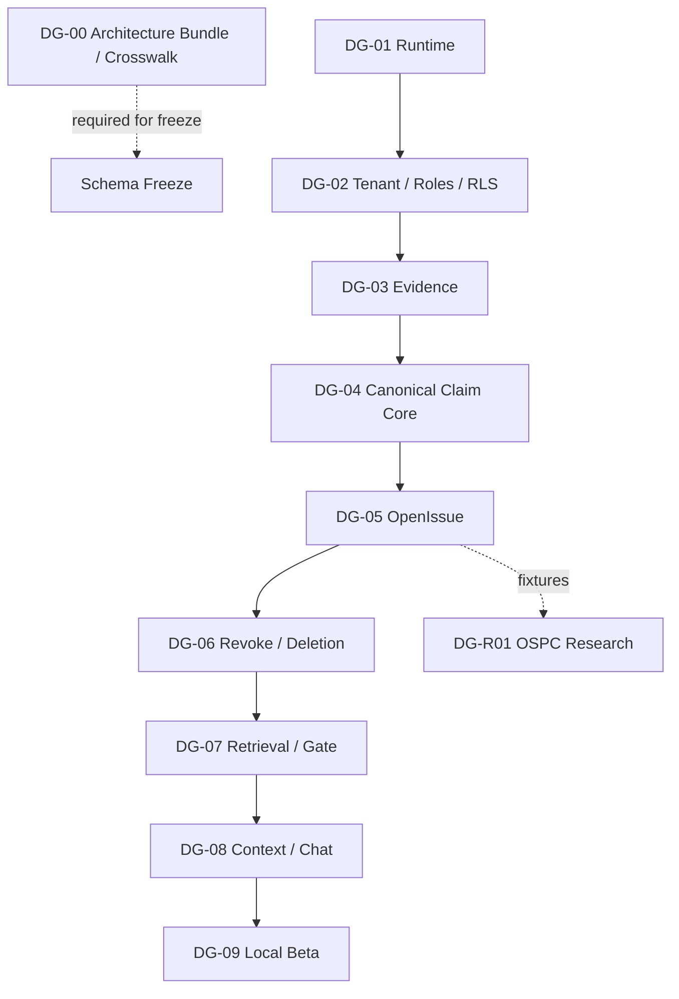

# MiLAi Lean V1 设计开发 Goals

> 文档版本：`v1.0`  
> 更新日期：`2026-08-17`（Asia/Shanghai）  
> 文档性质：开发目标、成功证据与执行优先级  
> Schema 状态：`0.1.x EXPERIMENTAL`  
> Implementation 状态：`CANDIDATE`  
> Logical Architecture：`1.0.0 FROZEN / AF-09 ACCEPTED`  
> Schema 冻结结论：`NO-GO FOR SCHEMA FREEZE`

---

# 0. 当前目标结论

MiLAi 已完成 DG-01～DG-09 的本地 synthetic experimental 实现与验收，包括 Runtime/CI、
Evidence/Canonical/OpenIssue、DeriveAndDiagnose/CommitPolicy、删除、持久化 QueryPlan 与 Gate
检索、Minimal Context、live confirmation Evidence、Traceable Chat、Episode/Settlement 和全表
一致性恢复。
DG-R01 隔离可证伪研究也已完成，并因强 typed-state 与简单永久保留 OpenIssue baseline
在等预算主指标上等价而决定放弃 OSPC novelty 主张。当前产品主线转入限制维护。

已完成的产品目标是：

```text
DG-01：建立可重复、可测试、默认安全的 Runtime 基础（ACHIEVED）
DG-02：建立 Tenant、角色与 RLS 安全边界（ACHIEVED）
DG-03：建立 Evidence Plane 与幂等摄取（ACHIEVED）
DG-04：建立版本化 Canonical Claim Core（ACHIEVED）
DG-05：建立冲突保留与 OpenIssue 治理（ACHIEVED）
DG-06：完成 Evidence 撤销、清理与备份删除对账（ACHIEVED）
DG-07：实现 Outbox、L0/L1、Canonical Gate 与 RetrievalTrace（ACHIEVED）
DG-08：实现 Minimal Context、Traceable Chat 与最小 UI（ACHIEVED）
DG-09：完成可恢复、可运维的 Local Beta（ACHIEVED）
```

已完成的研究目标与架构目标是：

```text
DG-R01：建立与产品隔离的 OSPC 可证伪研究基线（ACHIEVED；novelty ABANDONED）
DG-00：设计并实现 MiLAi Logical Architecture bundle（ACHIEVED；candidate.5 independently
       ACCEPTED；architecture/v1.0/ 作为独立 frozen release）
```

用户已明确：MiLAi Logical Architecture 不是待下载的外部原件，而是本项目需要基于现有资产
自行设计并实现的架构。`MiLAi_Logical_Architecture_v1_设计文档.md` 与
`architecture/v1.0-candidate/` 已形成可锁定候选包，machine crosswalk、validator、ADR、
threat/privacy review 和 candidate gate report 已形成。Candidate.1 独立 reviewer 发现十项 P1；
candidate.2 用 ADR-015/016、migrations 0015–0023 整改后，同一 reviewer 关闭 F03–F10，但以
populated 0014→head 反例保持 F01/F02 为 P1 OPEN。Candidate.3 以 ADR-017/0024 整改后，同一
reviewer 关闭 F02，却发现 rejected resolution grounding 仍在真实 Issue/Context（F01），并证明缺失
实际 DeletionRequest 时 migration 仍重建 APPROVE authority（F11）。Candidate.4 已加入 ADR-018、
corrected 0024、compatibility 0025、第二个 immutable ledger、真实 consumer 与逐腿 provenance
regressions。其精确 submission 被同一 reviewer 判定 `REVISE`：F01 关闭、F11 原反例修复，但
idempotency/OperationalEvent/revoke Outbox/purge Outbox 四个 `created_at` 未与原 TX-05 事务时间
严格关联，新增 F12。Candidate.5 以 ADR-019、corrected 0024/0025、proof-only 0026 和三代
compatibility 时间反例整改。外部 receipt 锚定的精确 candidate.5 已由同一 reviewer 全量复审并
`ACCEPT`，F01–F12 全部关闭；独立 `architecture/v1.0/` frozen release 另行发布。Logical
Architecture freeze 不改变 Schema
`0.1.x EXPERIMENTAL` 与 Runtime `CANDIDATE`。ReMe、hindsight、
graphiti、Mem0 和 benchmark 只作为隔离参考或离线评测资产。

---

# 1. 文档用途

本文件把《设计规划与开发路线》转化为可跟踪的开发 Goal。它负责定义：

- 现在最重要的结果是什么；
- 每个 Goal 的边界、依赖和成功证据是什么；
- 什么情况下可以标记完成；
- 什么情况下必须停止、降级或提交 ADR；
- 各 Goal 如何映射到 `LC-*` 任务与 `LG-*` 发布门禁。

当前规范优先级为：

1. 已发布的 `architecture/v1.0/` MiLAi Logical Architecture frozen 版本；
2. `MiLAi_Logical_Architecture_v1_设计文档.md` 中的 frozen MUST；
3. `MiLAi_Lean_V1_实施合同.md`；
4. `MiLAi_Lean_V1_产品底座与研究核心.md`；
5. 其他现有需求、路线和流程文档；
6. 本 Goal 文档与实验性实现。

设计文档中的 G1–G9 当前是 `FROZEN` normative goals；本文件继续使用 `DG-*`
表示 Development Goal。

---

# 2. North Star Goal

## DG-NS：可验证的个人记忆闭环

**目标陈述：**

构建一个本地优先、Evidence-first、版本化、冲突感知的个人记忆系统。系统能够从 Evidence 形成受治理的 Claim 或 OpenIssue，通过 canonical gate 安全读取，并在 Evidence 撤销后立即 fail closed；每个重要回答都可以回溯到版本、Evidence、问题状态和检索轨迹。

**North Star 成功证据：**

```text
Evidence Ingest
→ DeriveAndDiagnose
→ validated OperationProposal
→ CommitPolicy / User Review
→ Versioned Claim 或 OpenIssue
→ L0/L1 Retrieval
→ Canonical Gate
→ Minimal ContextCapsule
→ Answer with Trace
→ Evidence revoke
→ GroundingBlock and fail-closed cleanup
```

整条路径必须在真实 PostgreSQL、真实角色和确定性测试 adapter 下回放，并证明：

- Evidence 不等于 belief；
- ClaimVersion 不可变，ClaimHead 只通过 CAS 演化；
- 冲突不自动覆盖当前 Claim；
- canonical 写入只能通过受控 procedure；
- stale projection 不能绕过 revocation、权限、Scope 或 authority；
- canonical 不可用时系统明确 abstain；
- 外部 memory framework 不成为在线 canonical 依赖。

---

# 3. Goal 管理规则

## 3.1 状态

| 状态 | 含义 |
| --- | --- |
| `NOT_STARTED` | 依赖尚未满足或未进入当前工作集 |
| `READY` | 输入、边界和验收已明确，可以开始 |
| `IN_PROGRESS` | 已有实际实现或验证工作进行中 |
| `AT_RISK` | 可以继续，但存在可能影响完成或冻结的风险 |
| `BLOCKED` | 无法在当前授权和材料下继续取得有效进展 |
| `ACHIEVED` | 所有成功证据已生成，适用门禁已通过 |
| `ABANDONED` | 经 ADR/评审确认不再追求，并保存原因与替代方案 |

不能因代码已编写、happy path 可运行或文档声称完成，就把 Goal 标为 `ACHIEVED`。完成必须有机器可验证证据。

## 3.2 优先级

| 优先级 | 含义 |
| --- | --- |
| `P0 Safety` | tenant、canonical invariant、删除、权限和错误确定性 |
| `P1 Core` | Evidence、Claim、OpenIssue 和 L0 纵向闭环 |
| `P2 Capability` | projection、L1、Context 和 Chat |
| `P3 Research` | baseline、OSPC 和论文候选 |

P2 不能通过削弱 P0/P1 约束提前交付；P3 失败不能阻止产品 Goal。

## 3.3 WIP 规则

- 默认只有一个产品 Goal 作为主开发目标；
- `DG-00` LA-5/AF-09 independent review 与 release lock 是当前主开发目标；
- 紧急 P0 修复可以打断 P1/P2，但要留下恢复点；
- 不因等待模型、benchmark 或研究结果而阻塞 canonical core；
- 每次切换 Goal 都记录当前状态、剩余风险和下一可执行动作。

## 3.4 Goal 完成证据

每个 Goal 至少保存：

```text
goal_id and version
implemented task IDs
code and migration revision
test report and environment manifest
security/permission evidence when applicable
failure/degraded-path evidence
ADR decisions
known limitations
gate decision
artifact hashes
```

---

# 4. Goal 总览

| Goal | 结果 | 优先级 | 当前状态 | 对应任务 | 目标门禁 |
| --- | --- | --- | --- | --- | --- |
| `DG-00` | Logical Architecture Design & Implementation | P0 | `ACHIEVED` | LA-0～LA-5 | AF-00～AF-09 |
| `DG-01` | 可重复 Runtime 基础 | P0 | `ACHIEVED` | LC-002 | LG-01 |
| `DG-02` | Tenant、角色与 RLS 安全边界 | P0 | `ACHIEVED` | LC-003 | LG-01 / LG-02 |
| `DG-03` | Evidence Plane 与幂等摄取 | P1 | `ACHIEVED` | LC-004 | LG-02/03 |
| `DG-04` | 版本化 Canonical Claim Core | P0/P1 | `ACHIEVED` | LC-005、LC-006、LC-007、LC-008 | LG-02 |
| `DG-05` | 冲突保留与 OpenIssue 治理 | P0/P1 | `ACHIEVED` | LC-009 | LG-02/03 |
| `DG-06` | Evidence 撤销与删除 fail-closed | P0 | `ACHIEVED` | LC-010 | LG-03 / LG-06 |
| `DG-07` | Outbox、L0/L1 与 Canonical Gate | P1/P2 | `ACHIEVED` | LC-011、LC-012、LC-013、LC-014 | LG-04 / LG-06 |
| `DG-08` | Minimal Context 与 Traceable Chat | P2 | `ACHIEVED` | LC-015、LC-016、LC-017 | LG-05 |
| `DG-09` | 可恢复的 Local Beta | P0/P2 | `ACHIEVED` | LC-018 | LG-07 |
| `DG-R01` | OSPC 可证伪研究候选 | P3 | `ACHIEVED`（novelty `ABANDONED`） | RC-001～RC-008 | RG-00～RG-02 |

状态只描述当前仓库事实。`DG-01`～`DG-05`、`DG-07` 与 `DG-08` 分别由 `docs/reports/` 中对应验收报告
证明。`DG-06` 已通过同步 TX-05、stale projection Gate、worker purge、retry/dead-letter、
shared Blob 与 backup deletion reconciliation；`DG-09` 已通过 clean install、fault injection、
真实 backup/restore drill 与 privacy regression。

---

# 5. 产品 Goal 详细定义

## DG-00：Logical Architecture Design & Implementation

**目标：** 基于 MiLAi 当前实现、Lean 合同以及 ReMe、Hindsight、Graphiti、Mem0 和 benchmark
中的可复用模式，自主设计并实现 MiLAi Logical Architecture `1.0.0` bundle。

**当前状态：** `ACHIEVED / 1.0.0 FROZEN`。LA-0～LA-5 已完成：
`MiLAi_Logical_Architecture_v1_设计文档.md`、accepted `architecture/v1.0-candidate/`、独立
`architecture/v1.0/` release、machine-readable crosswalk、外部 manifest trust anchor、
validator/negative tests、ADR 与 threat/privacy review。AF-00～AF-08 为 `PASS_FROZEN`；
AF-09 为 `ACCEPTED_INDEPENDENT_REVIEW`。

历史上的“寻找外部原件”结论已被用户澄清为错误前提；检索报告仅保留为历史审计，不再是
DG-00 的阻塞依据。

**关键结果：**

1. 设计输入、外部资产版本/license、吸收与隔离边界可验证；
2. G1–G9、十二条 invariant、逻辑对象、角色、事务和故障语义完整；
3. 建立 accepted candidate 与独立 `architecture/v1.0/` 自包含 frozen bundle/manifest；
4. 建立 invariant→对象/Schema/procedure/API/test/report 的 machine-readable crosswalk；
5. `validate_bundle.py` 与 `verify_lock.py` 能拒绝缺文件、未映射 MUST 和 hash drift；
6. authority、grounding、OpenIssue、sequence、Blob key、L2/adapter 等决定有 ADR；
7. AF-00～AF-09 通过，独立评审接受后发布 `1.0.0 FROZEN`；
8. 架构 freeze 不移除 experimental Schema、candidate Runtime 与 Schema no-go banner。

**不在范围：** 把现有 Runtime 反向贴上 frozen 标签；复制任一外部项目作为 MiLAi 架构；
以文档存在代替机器验证。

**完成证据：** versioned bundle、manifest/hash、crosswalk、validator tests、ADR、AF-00～AF-09
报告和 freeze review。

**停止条件：** 任意 I-01～I-12 无法映射或出现 hard failure 时，暂停 freeze；先修复设计、
实现或测试，不静默删除 invariant。

**当前关键结果进度：**

| KR | 结果 | 状态 |
| --- | --- | --- |
| 1–2 | baseline、G/I、对象/角色/TX/故障语义 | DONE_FROZEN |
| 3 | self-contained bundle + external manifest trust anchor | DONE_FROZEN |
| 4 | machine crosswalk（direct positive/negative nodes） | DONE_FROZEN |
| 5 | bundle/lock validator + coordinated-tamper negatives | DONE_FROZEN |
| 6 | 架构决定 ADR-001～ADR-019 | DONE_FROZEN |
| 7 | AF-00～AF-08 | PASS_FROZEN |
| 7 | AF-09 independent freeze review | ACCEPTED_CANDIDATE.5 |
| 8 | architecture frozen + Schema/runtime boundary | ENFORCED |

---

## DG-01：可重复 Runtime 基础

**目标：** 从空目录建立最小、可重复、配置 fail-fast 的 Flask API、单 worker、PostgreSQL/pgvector 和 migration/test harness。

**依赖：** 可以与 DG-00 并行，但持续保持 Schema `0.1.x EXPERIMENTAL`。

**关键结果：**

1. `runtime/` 有明确 package、锁文件、API 和 worker 入口；
2. 本地 Compose 可启动 PostgreSQL/pgvector，不依赖外部 memory framework；
3. typed settings 对缺失、未知或不安全配置 fail fast；
4. migration 可以从空库重复执行；
5. 真实 PostgreSQL integration fixture 可创建专用临时数据库；
6. health/readiness 能区分进程存活与依赖可用；
7. lint、type、unit、integration 命令由 `pyproject.toml` 和 CI 定义；
8. 本地启动、停止和故障排查 runbook 可由干净环境复现。

**非目标：** 完整 Claim Schema、LLM 业务逻辑、向量质量调优、Chat UI。

**完成证据：** clean bootstrap log、锁文件 hash、health/readiness tests、config negative tests、LG-01 checklist。

**失败条件：** Runtime 启动需要 import ReMe、hindsight、graphiti、Mem0；secret 出现在样例或日志；开发命令依赖未记录的全局环境。

---

## DG-02：Tenant、角色与 RLS 安全边界

**目标：** 即使单用户部署，也通过真实 PostgreSQL role、tenant context 和 RLS 保证最小权限与跨 tenant 隔离。

**关键结果：**

1. Migration Owner、API Runtime、Steward Procedure Executor、Projection Worker、Audit Runner 权限分离；
2. 两个 tenant、两个真实 login connection 的 SELECT/write 负向测试通过；
3. connection pool 借还时 tenant context 不泄漏；
4. Steward 只能调用受控 procedure，不能直接 canonical DML；
5. worker 和 audit role 无 Claim/OpenIssue canonical 写权限；
6. `SECURITY DEFINER` 路径锁定 `search_path` 并显式校验 tenant；
7. 默认网络只监听 loopback。

**完成证据：** role/grant manifest、RLS policy tests、pool reuse tests、network/config tests。

**立即阻断：** 任意跨 tenant 暴露、应用可绕过 RLS、共享高权限 DSN。

---

## DG-03：Evidence Plane 与幂等摄取

**目标：** 安全摄取可回放 Evidence，使 observation identity、内容寻址 blob、权限快照、时间和来源完整可追踪。

**关键结果：**

1. `content_blob` 与 `evidence_record` 的 experimental migration 和约束存在；
2. 相同内容的不同观察创建不同 EvidenceRecord；
3. blob 只在同 tenant 内去重；
4. TX-01 与 outbox 在同一事务原子提交；
5. 相同幂等 key/fingerprint 返回首次结果；
6. 相同 key、不同 fingerprint 返回 `IDEMPOTENCY_CONFLICT`；
7. source、observed time、capture identity、content hash 不被覆盖；
8. GET/lineage API 不泄露其他 tenant 或被禁止正文。

**完成证据：** migration tests、hash/duplicate fixtures、idempotency replay/race、rollback test、API contract tests。

**非目标：** 自动把 Evidence 转为 Claim；在 TX-01 内调用 LLM。

---

## DG-04：版本化 Canonical Claim Core

**目标：** 建立只通过治理流程演化的 ClaimVersion、ClaimHead、grounding、proposal 和 decision 核心。

**关键结果：**

1. Claim identity、append-only ClaimVersion、exact-head ClaimHead 和 VersionTransition 正确实现；
2. `grounding_relation`、`grounding_block` 与唯一 EffectiveClaimState 入口存在；
3. OperationProposal 永远不自动成为 canonical；
4. StewardDecision append-only；
5. TX-02 使用 absence-CAS，TX-03 使用 exact-head CAS；
6. TX-04 不创建 ClaimVersion/Transition、不移动 Head；
7. TX-06 只以新 admissible Evidence、新版本和 APPROVE decision 恢复 grounding；
8. `SPLIT` 返回 `OPERATION_NOT_ENABLED`；
9. canonical transaction 不调用模型、embedding、向量或外部网络；
10. canonical writes、decision result 和 outbox 原子提交。

**完成证据：** 双连接 create/revision race、old-version byte immutability、direct-DML denial、rollback/outbox tests、procedure trace。

**候选决定：** authority 匹配见 ADR-008，grounding 逻辑/物理策略见 ADR-004；canonical/outbox
双 sequence 语义见 ADR-009，歧义 QueryPlan 字段已由 migration 0014 迁移。TX-01 是 Evidence
observation，使用 outbox sequence 而不伪造 canonical belief position。

**立即阻断：** 两个并发 revision 都移动 Head；无 decision 的 canonical version；旧版本被原地更新。

---

## DG-05：冲突保留与 OpenIssue 治理

**目标：** 保留未解决问题的身份、正反 Evidence、状态和 discharge rule，防止模型或压缩制造虚假解决。

**关键结果：**

1. `CONTRADICT` 形成产品 `CONFLICT`，当前 Head 默认不变；
2. OpenIssue 类型、状态与 revision CAS 受测；
3. SUPPORT/CONTRADICT/RESOLUTION_CANDIDATE branches 结构化保存；
4. issue transition append-only；
5. summary、retrieval omission、时间经过或模型判断不能关闭 issue；
6. resolution 必须满足 discharge rule、authority 和 Evidence 条件；
7. resolution Evidence revoke 后重开同一 issue ID；
8. E1→E2→E3 冲突与治理流程可完整回放。

**完成证据：** OpenIssue CAS race、非法状态迁移 tests、branch lineage tests、E2/E3 E2E trace。

**立即阻断：** 冲突自动覆盖 Head；issue identity 在 resolution/reopen 中丢失；自然语言描述替代结构化 branches。

---

## DG-06：Evidence 撤销与删除 Fail-Closed

**目标：** Evidence 一旦撤销，相关 Claim/Context 立即失去不再合法的可用性，异步副本随后可证明清理。

**关键结果：**

1. TX-05 原子写 revoke、GroundingBlock、Context invalidation 和 purge outbox；
2. revoke 提交后 ACTION_SAFE 读取立即被阻断；
3. stale FTS/vector/cache candidate 无法通过 Canonical Gate；
4. purge handler 幂等、可重试、可 dead-letter 和对账；
5. shared blob 有 live reference 时不提前物理删除；
6. unreadable permission/retention 状态 fail closed；
7. deletion request 可查询逻辑阻断和物理清理状态；
8. TX-06 不允许原地删除 GroundingBlock 恢复旧版本。

**完成证据：** revoke E2E、stale projection injection、shared blob test、purge retry、backup/deletion reconciliation。

**立即阻断：** 删除 fail-open；物理清理失败导致旧内容重新可见；共享 blob 被过早删除。

---

## DG-07：Outbox、L0/L1 与 Canonical Gate

**目标：** 提供不依赖向量的精确读取和受 canonical 约束的混合检索，使投影只影响召回，不改变 truth 或 authority。

**关键结果：**

1. outbox lease、retry、dead-letter、幂等 handler 可恢复；
2. 每个 projection 有独立 durable watermark，不能跨 gap 推进；
3. L0 exact/current 只依赖 canonical DB；
4. L1 完成 metadata/time/scope filter、FTS+pgvector、normalize/dedupe；
5. 所有候选按 canonical ID/version 进入统一 Canonical Gate；
6. Gate 检查 tenant、permission、retention、revocation、Head/version、block、Scope、time、OpenIssue、authority 和 lineage；
7. READ_YOUR_WRITES 在 projection 落后时回退 canonical；
8. CANONICAL_REQUIRED 在 DB 不可用时 abstain；
9. RetrievalTrace 记录 route、snapshot、watermark、reject 和 fallback；
10. typed QueryPlan 记录 intent、散列 entity、time/scope/authority/consistency/budget/routes，
    与 trace 一起持久化且不保存 query 明文；
11. 正式 API 使用 `/v1/memory/query` 和 `/v1/system/*`，L2 默认关闭。

**完成证据：** vector outage、dead-letter gap、stale index、wrong scope/tenant/version、fallback 和 abstention tests。

**立即阻断：** projection 自带有效标志替代 Gate；canonical 不可用但返回确定答案；watermark 跳过未解决 gap。

---

## DG-08：Minimal Context 与 Traceable Chat

**目标：** 在有限上下文预算内保护目标、约束、当前状态和 live OpenIssue，并生成可追溯、可拒绝的回答。

**关键结果：**

1. ContextCapsule 分为 ACTIVE GOAL、ACTIVE STATE、OPEN ISSUES、CONSTRAINTS、RETRIEVED EVIDENCE、TRACE POINTERS；
2. Goal、硬约束、ECS 和 live OpenIssue 是 protected items；
3. 每个 issue 保留 ID、target、status、branches 和 discharge rule；
4. pointer recovery 校验 ID、hash、permission、retention 和 revocation；
5. 最小保护表示超预算时返回 `CONTEXT_BUDGET_INFEASIBLE`；
6. Chat 只使用通过 Gate 的 capsule；
7. answer 返回 ClaimVersion/Evidence/OpenIssue/RetrievalTrace 关联；
8. action-sensitive 请求按 policy 完成 live confirmation 或 abstain；
9. 模型答案不能直接回写 Claim；
10. 最小 UI 支持 review、correct、confirm、trace、revoke 和 Episode capture/settle；
11. Episode/Settlement forced RLS、append-only/CAS，Settlement 不自动创建 ClaimVersion。

**完成证据：** recursive compression、pointer invalidation、budget infeasible、canonical outage、answer lineage E2E。

**立即阻断：** Context 压缩关闭 live issue；Chat 自回写 canonical state；证据不足时假装确定。

---

## DG-09：可恢复的 Local Beta

**目标：** 把通过核心门禁的系统变成可安全启动、停止、备份、恢复、纠正和删除的本地 Beta。

**关键结果：**

1. Chat、review、correct、confirm、trace 和 delete 用户路径完整；
2. PostgreSQL 与 blob store 使用 consistency manifest 备份；
3. catalog 枚举的所有 tenant-owned durable table 必须进入 inventory，否则 backup/restore
   fail closed；
4. restore 后 canonical IDs、hash、relations、blocks、Episode/Settlement 和 watermarks 可对账；
5. migration upgrade、完整 downgrade/upgrade round trip 与 forward repair 已演练；
6. DB、worker、embedding、blob 故障有明确 degraded/fail-closed 行为；
7. dead-letter、projection rebuild、purge reconciliation 有 runbook；
8. 日志和 trace 脱敏回归通过；
9. Local Beta report 记录适用门禁、限制、性能边界和恢复证据。

**完成证据：** clean install、backup/restore drill、fault injection、security/privacy regression、LG-07 report。

**立即阻断：** 不能从备份恢复；authority-bearing answer 无 trace；删除或 tenant 隔离仍存在未关闭 P0 缺陷。

---

# 6. 研究 Goal

## DG-R01：OSPC 可证伪研究候选

**状态：** `ACHIEVED`（研究执行完成；OSPC novelty candidate 为 `ABANDONED`）

**目标：** 在与产品隔离的环境中验证：相同总上下文预算下，保护 OpenIssue identity、正反 Evidence lineage 和合法 discharge 条件，是否减少 compression-induced false epistemic closure。

**关键结果：**

1. 30–50 个 pilot open-state fixtures、标注协议和 scorer 可复现；
2. naive、extractive、typed-state/structured eviction 强 baseline 在等预算运行；
3. OSPC protected subgraph、budget allocator、validator 和 infeasible handling 可运行；
4. 报告 identity recall、branch/evidence preservation、false closure、合法 resolution、成本和失败分布；
5. 完成 equal-budget ablation 与 prior-art/absorber audit；
6. 依据 hard falsifier 做 `GO / HOLD / ABANDON` 决策；
7. 研究代码、数据、角色和结果不进入在线 canonical 凭据域。

**必须放弃 novelty 主张的情况：**

- 简单保留 OpenIssue 字段达到同样结果；
- 最强 baseline 在等预算下等价；
- identity preservation 不改善后续任务或合法 resolution；
- 成本或不可行率抵消收益；
- prior art 已覆盖核心贡献。

**产品隔离：** DG-R01 失败不得阻止 DG-01～DG-09，也不得自动修改 production policy。

**完成证据：** 40 个 synthetic fixture、统一总预算 harness、强 baseline、四项消融、
本地 prior-art/absorber audit 与独立 scorer 已复现；因 typed-state/static OpenIssue baseline
在冻结主指标上与完整 OSPC 等价，hard falsifier 决策为 `ABANDON`。详见
`docs/reports/DG-R01-RC-001-008-ospc-2026-08-15.md`。

---

# 7. 已完成基础目标与当前执行面

DG-01 是首个主开发 Goal，已按以下工作包完成：

| 工作包 | 输出 | 验收重点 |
| --- | --- | --- |
| `DG-01.1` | Runtime package 与锁文件 | 干净环境安装、依赖/license 清单 |
| `DG-01.2` | Flask app factory 与 API entrypoint | import 无副作用、health 契约 |
| `DG-01.3` | Worker entrypoint | 可启动/停止、无 canonical DML 能力 |
| `DG-01.4` | Typed settings | 缺失、未知、不安全配置 fail fast |
| `DG-01.5` | PostgreSQL/pgvector Compose | loopback、health、专用 volume |
| `DG-01.6` | Migration/bootstrap harness | 空库重复迁移、版本可查询 |
| `DG-01.7` | Integration DB fixture | 专用临时库、真实连接、可靠清理 |
| `DG-01.8` | Quality commands 与 CI | lint/type/unit/integration 可重复 |
| `DG-01.9` | Runbook 与 ADR-001 | 新环境按文档复现 |
| `DG-01.10` | External dependency boundary test | Runtime 不 import 外部 memory 项目 |

## DG-01 完成检查单

```text
[x] Runtime 从干净环境安装成功
[x] API 与 worker 均可重复启动和停止
[x] PostgreSQL/pgvector readiness 可验证
[x] 缺配置与坏配置明确失败
[x] Migration 从空库重复执行
[x] Integration fixture 使用专用测试目标
[x] 日志未泄露 DSN、token 或正文
[x] Runtime 不依赖 ReMe/hindsight/graphiti/Mem0
[x] 锁文件、license 和运行文档齐全
[x] LG-01 证据已生成
[x] 未声称 LG-02 或 Schema frozen
```

DG-02 已在真实 login roles 上证明 transaction-scoped tenant/actor context、RLS、pool reset、
跨 tenant 隔离和 canonical direct-DML denial。DG-04/DG-05 已完成 proposal/review、六事务中
TX-01～TX-06 的当前 Lean 实现、CAS、immutable history、OpenIssue discharge/reopen 与 API
纵向回放。DG-06～DG-09 与 LG-07 已完成，但全链路证据仍只使用 synthetic 数据。candidate
crosswalk 已经完成；ADR-012 Blob envelope encryption/key recovery、source-specific real-data
mapping 和独立隐私评审尚未完成，因此继续不处理真实个人数据。

---

# 8. Goal 依赖与晋级规则



晋级规则：

- DG-01 未完成，不开始 canonical Schema 大规模实现；
- DG-02 未完成，不允许真实个人数据进入；
- DG-04 未完成，不把 proposal 或 model output 当记忆；
- DG-05 未完成，不启用自动冲突处理；
- DG-06 未完成，不发布处理真实个人数据的版本；
- DG-07 未完成，不默认启用 L1；
- DG-08 未完成，不把 Chat 标记为 memory-aware；
- DG-09 未完成，不标记 Local Beta；
- DG-00 未完成，无论其他 Goal 状态如何都不冻结 Schema。

---

# 9. 成功指标层级

## 9.1 第一层：不可妥协的正确性

以下指标只接受通过/失败：

```text
no canonical invariant violation
no cross-tenant exposure
no deletion fail-open
no duplicate canonical side effect on idempotent retry
no concurrent double Head movement
no untraceable authority-bearing answer
no live OpenIssue closed by compression
no canonical certainty when canonical state is unavailable
```

任一失败均阻止对应 Goal 和发布 Gate。

## 9.2 第二层：能力质量

- Evidence/Claim/OpenIssue lineage completeness；
- Canonical Gate rejection correctness；
- L0/L1 retrieval recall/precision；
- conflict detection 与合法 resolution；
- answer attribution 与正确 abstention；
- Context protected-state preservation；
- purge/rebuild/recovery correctness。

## 9.3 第三层：效率与体验

- API/worker latency；
- projection lag；
- model/embedding cost；
- Context token budget；
- backup/restore time；
- 本地资源占用和用户操作步骤。

性能数值只有在目标设备和真实 workload baseline 后才能冻结。效率指标不能覆盖第一层失败。

---

# 10. Goal Review 模板

每次 Goal review 使用以下记录：

```text
Goal ID / version:
Review date:
Owner:
Current status:

Outcome achieved:
Evidence links / artifact hashes:
Tasks completed:
Tests passed:
Negative/failure paths verified:
Security/delete impact:
ADR decisions:
Known risks:
Blocked by:
Next smallest executable action:
Gate decision:
Schema/Implementation status banner:
```

状态变化规则：

- `READY → IN_PROGRESS`：首个实际实现变更开始；
- `IN_PROGRESS → AT_RISK`：风险存在但仍可取得有效进展；
- `IN_PROGRESS/AT_RISK → BLOCKED`：关键外部条件使目标无法继续；
- `IN_PROGRESS → ACHIEVED`：所有关键结果和门禁证据齐全；
- 任意状态 → `ABANDONED`：必须有 ADR/评审和替代方案；
- 已完成 Goal 若发现 P0 事实错误，重新打开而不是修改历史报告。

---

# 11. Goal 变更控制

新增或修改 Goal 时必须说明：

1. 用户结果为什么发生变化；
2. 是否改变 canonical、权限、删除或 Scope 语义；
3. 与实施合同和 frozen architecture 的关系；
4. 新依赖是否进入 Runtime；
5. 对 LC/RG 任务和 LG/RG 门禁的影响；
6. migration、rollback 和兼容策略；
7. 新成功证据与 hard failure；
8. 哪个现有 Goal 被替代、延迟或取消。

以下变化不能只改 Goal 文档，必须提交 ADR：

- authority 比较关系；
- canonical object 或写入口变化；
- grounding/OpenIssue 物理模型；
- tenant/RLS/role 模型；
- delete/retention/backup 语义；
- consistency 默认值；
- 外部 memory framework 进入在线路径；
- OSPC 进入产品路径。

---

# 12. 2026-08-16 完成复核

本轮没有按“代码存在”判定完成，而是重新从 Goal 关键结果、源代码、migration、API contract、
真实角色测试、恢复 drill 和研究 hard falsifier 逐项反查。补齐了先前证据不足的：

- DG-01 的仓库 CI；
- DG-04 的 typed DeriveAndDiagnose、CommitPolicy 及持久化决策 trace；
- DG-07 的 typed/persisted QueryPlan、正式 API alias 和 E1→E2→E3→revoke RetrievalTrace；
- DG-08/LC-017 的 Episode/Settlement，以及基于 `USER_CONFIRMATION` Evidence 的 live confirm；
- DG-09 对全部 tenant-owned durable table 的 inventory coverage 与 Episode restore；
- DG-R01 的 full raw、recursive、extractive、hierarchical、structured eviction、typed/static、
  OSPC/ablation/oracle 等预算 benchmark，分别报告 representation/decision false closure、
  unsupported claim、wall/CPU/GPU/calls/failure distribution 和全局 Bmin infeasible。

当前统一机器证据为：

```text
architecture: validate/lock PASS; 14 positive/negative bundle tests PASS
runtime: ruff format/check PASS; mypy PASS (53 source files); pytest PASS (74 tests)
migration: empty database base → 0014 → base → 0014 PASS
recovery: real backup/revoke/purge/expire/restore full-inventory reconciliation PASS
package: uv frozen sync and sdist/wheel build/inspection PASS
research: format/lint/strict type PASS; 9 tests PASS; 40-fixture benchmark reproduced
```

逐 Goal 结论与 artifact hash 见
`docs/reports/GOALS-completion-audit-2026-08-16.md`。DG-01～DG-09 与 DG-R01 在其明确的
local/synthetic/experimental 边界内均已达到成功证据。随后用户明确 DG-00 应由本项目自行
设计与实现；LA-0～LA-4、bundle/crosswalk/validator/ADR/threat review 已完成 candidate
验收；当时 LA-5/AF-09 尚未完成。该历史缺口现已由 13.5 的 candidate.5 independent ACCEPT 与
`architecture/v1.0/` release 关闭。Schema freeze 仍继续 NO-GO。历史状态详见
`docs/reports/DG-00-architecture-candidate-2026-08-16.md`。

---

# 13. 下一步

## 13.1 2026-08-17 AF-09 candidate.2 整改

Candidate.1 独立 review 明确判定 `REVISE`，原 review/archive/receipt 保持不可变。F01–F10 已按
以下边界整改：proposal submission noncanonical、完整创建 history、规范状态映射、ECS-only 全轴
Gate、直接 crosswalk test nodes、governed TX-05、SQL-verified absence proof、exact runtime DB
roles、真实 causal token/wait，以及 bundle 外 manifest trust anchor。

当前整改实现证据：

```text
runtime: real-role PostgreSQL pytest PASS (92 tests)
migration: empty database base → 0023 PASS; candidate.1 → 0023 forward repair PASS
architecture: candidate.2 bundle tests 19; final hash/receipt validation pending
AF-09: same independent reviewer rereview PENDING
```

DG-R01 已按 hard falsifier 完成并停止 novelty 路线；DG-01～DG-09 保持 Local Beta 限制与
回归。当前主开发目标是 DG-00/LA-5：锁定 candidate.4、生成 bundle 外 submission receipt，由同一
独立 reviewer 重放 F01/F11、全部既有 closure 与完整 checklist。若接受，再发布独立 `1.0.0
FROZEN` bundle，不能改写 candidate.1–4 历史。真实数据仍受 ADR-012 硬门约束。无需继续下载新的
memory framework。
在 AF-09 通过前，所有实现保持：

```text
Schema 0.1.x EXPERIMENTAL
Implementation CANDIDATE
NO-GO FOR SCHEMA FREEZE
```

## 13.2 2026-08-17 AF-09 candidate.2 复审与 candidate.3 整改

13.1 是 candidate.2 提交前的作者快照。此后同一 independent reviewer 对外部 receipt 锚定的精确
manifest `17561675750fa1add9f32f4dbe20f9a7ba6668861e0af2beb41e391dc55329ae` 完成复审并决定
`REVISE`。不可变记录为
`docs/reviews/AF-09-independent-rereview-candidate.2-2026-08-17.md`（SHA-256
`50f341f2d460fbca59e12b3a1841894a49dbbeb13405804e007bbb1d53557515`）。F03–F10 关闭；F01/F02
因以下 deployed-state 反例保持 P1 OPEN：

- 既有 V1/OpenIssue creation history 在 0014→head 后仍为空，且治理约束未验证；
- candidate.1 resolution submission 已产生的 pre-Decision Issue mutation 与 NULL-Decision transition
  升级后仍存在，使新 review path 返回 `ISSUE_REVISION_CONFLICT`。

Candidate.3 的整改边界由 ADR-017 和 `0024_legacy_history_reconcile` 定义：先从实际
Proposal/Decision/actor/sequence/original Outbox 证明来源；无法证明即整体失败；精确非法旧行连同
SQL SHA-256 原子移入 forced-RLS/append-only quarantine；pending effect 只能由固定 non-user policy
actor `REJECT` 并 CAS reversal，禁止追认 approval。Legacy TX-05 还必须由 idempotency result、revoked
Evidence、OperationalEvent 与 Outbox 四方证明后才能重建治理链。

直接证据为：

```text
test_candidate1_populated_governance_state_is_reconciled_forward            PASS
test_candidate1_legacy_tx05_history_is_reconciled_from_four_way_proof       PASS
test_candidate1_unprovable_creation_history_fails_upgrade_closed            PASS
fresh empty database base → 0024                                            PASS
candidate.3 complete runtime/research/package/bundle gates                  PASS
AF-09 same independent reviewer candidate.3 rereview                        PENDING
```

当前 DG-00/LA-5 的执行顺序是：完成 candidate.3 全量门禁与 source lock，生成新的不可变 archive/外部
receipt，再交同一 reviewer 独立重放。不得修改 candidate.1/2 的 archive、receipt、review 或作者历史
报告；若 candidate.3 仍为 REVISE，只能发布下一 candidate。真实数据仍受 ADR-012 阻断，也无需下载
新的 memory framework。

## 13.3 2026-08-17 AF-09 candidate.3 复审与 candidate.4 整改

13.2 是 candidate.3 提交前的历史状态。其后同一 independent reviewer 对外部 receipt 锚定的精确
manifest `6a2f1574511f53614d558d663b0792c79b26c1b43a62ab746bfe10f367f15620`
完成全量复审，决定 `REVISE`。不可变记录为
`docs/reviews/AF-09-independent-rereview-candidate.3-2026-08-17.md`，SHA-256
`321883a7b9b695f4727aee99375fbeb3daf9919314c7562f6854d2a826012e9c`。F02 独立关闭，
F03–F10 保持关闭；开放 P1 是：

- AF09-F01：pending candidate.1 resolution 虽被 POLICY REJECT、Issue 恢复 OPEN，其
  `RESOLUTION_CANDIDATE` relation 仍留在 canonical grounding 并由真实 Issue/Context 返回；
- AF09-F11：删除实际 `milai.deletion_request` 后，candidate.3 0024 仍凭相互引用的 JSON/ID
  reconstruct `APPLIED REVOKE_EVIDENCE` Proposal 与 `STEWARD APPROVE` Decision。

Candidate.4 由 ADR-018 与两段 forward migration 定义。Candidate.3 从未被接受或冻结，原 0024
bytes 保存在其 immutable archive；live 0024 被修正，使 bad fresh 0014 input 在同一 transaction 内
回滚到 `0023_erasure_sha256_repair`。新 head `0025_legacy_provenance_guard` 兼容已经执行
candidate.3 0024 的开发库，有效 source 收敛到相同 schema，无效 source 保持 0024。

F01 修复先证明 Proposal distinct support set 与 Issue-owned resolution relation set 精确相等；REJECT
时把每条 relation 的全部原始字段、关联 transition/Decision 与 SQL 可重算 SHA-256 原子写入 forced-
RLS/append-only `legacy_grounding_relation_quarantine`，再从 canonical grounding 删除。真实 APPROVE
链才允许保留 relation；最终 postcondition 拒绝无完整 Proposal/Decision/Issue/support 链的 canonical
resolution grounding。真实 Issue API 与由 L0 trace 构造的 ContextCapsule 都验证 rejected branch
不可见。

F11 修复在任何 legacy governance reconstruction 前锁定并 join actual tenant-scoped
DeletionRequest，验证 Evidence/Blob、requester/creator、reason/time/status、idempotency result、
OperationalEvent、revoke Outbox 与 purge Outbox。任一腿缺失/冲突返回稳定
`AF09_UNPROVABLE_LEGACY_TX05`，且无本次 quarantine/Proposal/Decision/replacement/event/outbox
residue。直接证据包括九类独立破坏，以及 candidate.3 0024→0025 positive/negative compatibility。

当前已执行的实现门禁：

```text
runtime Ruff format/check + mypy                                  PASS
clean exact-role PostgreSQL runtime suite                         PASS (108 tests)
fresh populated resolution/TX-05 adversarial regressions          PASS
candidate.3-compatible 0024 → 0025 positive/negative              PASS
architecture/research/package/full lock/submission                 IN PROGRESS
same independent reviewer candidate.4 rereview                    PENDING
```

DG-00 仍未完成。必须先完成 candidate.4 全量门禁、manifest/source locks、不可变 archive 与 bundle
外 receipt，再由同一 reviewer 对精确 bytes 重跑；若仍 `REVISE`，只能创建新 candidate。只有
`ACCEPT` 后才能发布单独的 `architecture/v1.0/` frozen release，并完成最终 GOALS audit。

## 13.4 2026-08-17 AF-09 candidate.4 复审与 candidate.5 整改

13.3 是 candidate.4 提交前的历史状态。其后同一 independent reviewer 对外部 receipt 锚定的精确
manifest `13d0a948daa0b9907fd8fc6d7142c6565f8afd3672471c1da2ed5814a5af57eb` 完成全量复审，
决定 `REVISE`。不可变记录为
`docs/reviews/AF-09-independent-rereview-candidate.4-2026-08-17.md`，SHA-256
`ed7f4ff514f8b7c41eb345fe4c2d568b34f6df4260d74c1eaaa33341fe25ec21`。该复审确认：

- AF09-F01 已由 exact rejected-grounding quarantine 与真实 consumer absence 关闭；
- candidate.3 的 exact missing-DeletionRequest AF09-F11 反例已修复；
- 新 P1 AF09-F12：idempotency、OperationalEvent、revoke Outbox 或 purge Outbox 的
  `created_at` 任一偏移一秒，0024/0025 仍会重建 `APPLIED` Proposal 与 `STEWARD APPROVE`
  Decision，未证明它们来自同一 TX-05 transaction。

Candidate.5 由 ADR-019 定义。Corrected 0024/0025 以 `DeletionRequest.requested_at` 为持久时间锚，
要求 `EvidenceRecord.revoked_at` 和上述四个 `created_at` 全部精确相等；0024 的实际治理重建查询
重复同一谓词。新 proof-only head `0026_legacy_tx05_time_guard` 重新认证已到 candidate.4/0025 的
开发库，不创建任何表、Proposal、Decision、transition、event 或 Outbox。

直接 executable evidence 使用 candidate.1 公共过程构造 baseline：四个具名 fresh negative 分别
停在 0023；四个 candidate.3-compatible negative 停在 0024；四个 candidate.4-compatible negative
停在 0025；合法六时间腿控制前进到 0026。作者门禁实测结果：

```text
new timestamp/compatibility nodes                                  PASS (13 tests)
complete migration foundation regression                          PASS (33 tests)
fresh base -> 0026 exact-role runtime                              PASS (121 tests)
runtime Ruff / strict mypy                                        PASS (105 / 57 files)
backup/security/catalog                                           PASS (6; 32 / 31 tables)
research / deterministic fixtures                                 PASS (7 source / 9 / 40)
double package build / locked install                             PASS (63 / 120 entries)
CI YAML / Compose / Markdown links and fences                     PASS (79 files / 0 errors)
candidate.5 manifest/archive/external receipt                     FINAL LOCK NEXT
same independent reviewer candidate.5 rereview                    PENDING
```

DG-00 仍未完成。下一顺序是最终重锁 candidate.5，生成新的不可变 manifest/archive/外部 receipt，
再由同一 reviewer 独立重放 F12 与全部既有 closure。Candidate.4 的
archive、receipt、review、remediation 和 report 不得修改；只有 candidate.5 获得 `ACCEPT` 后，才可
发布单独的 `architecture/v1.0/` frozen release 并执行最终 GOALS audit。

## 13.5 2026-08-17 AF-09 ACCEPT 与 1.0.0 frozen promotion

13.4 是 candidate.5 提交前的不可变状态。其后同一 independent reviewer 对精确提交完成复审：

```text
candidate.5 manifest       ece90366e5e3e3647af729351d8ae80310c8f6c30db1cf85b5a74ccb4168ed64
candidate.5 archive        aa56033be8380eee9289baec11c7839cbaa9bde4d66f69c6757fd9fb651ff668
candidate.5 receipt        2f8189339b6ee5b45107cee93c67005c1051171810913014631b1bd8c9aed680
independent review         8ddf9e8a302b46404319ef2b27d99403f73b4d71127b4483c3b333d27230d1f3
decision                   ACCEPT
open findings              NONE (F01-F12 CLOSED)
```

独立复审核对 175 个 archive members 与 live bytes，运行 architecture 外部锚/19 tests、fresh
base→0026 exact-role 121 tests、foundation 33 tests、backup/security 6 tests、research/package/
Compose/docs，并另写 reviewer harness 重放 4 个 fresh、4 个 candidate.3-compatible、4 个
candidate.4-compatible 单时间腿冲突和 1 个合法 control。十二个 invalid case 分别保持
0023/0024/0025、稳定报错且无新 residue；合法 control 才进入 0026。Exact F11 missing-request、
F01 real Issue/Context absence 与 F02–F10 均无回归。

按 accepted `FREEZE_REVIEW` protocol，冻结版另行发布到 `architecture/v1.0/`，不会改写
candidate.5。Release manifest 精确绑定上述 review/candidate 四元组；AF-00～AF-08 为
`PASS_FROZEN`，AF-09 为 `ACCEPTED_INDEPENDENT_REVIEW`，并继续要求 bundle 外 release digest。
最终 release manifest/archive/receipt 与独立 release verification 在本 source-locked GOALS
之后生成，避免 manifest/receipt 自引用；最终 GOALS completion audit 单独记录这些摘要。

DG-00 因此达到 `ACHIEVED`。该结论只冻结 Logical Architecture。Runtime 仍为 `CANDIDATE`，
Schema 仍为 `0.1.x EXPERIMENTAL / NO-GO`，真实个人数据、remote/public、plaintext Blob 加密门和
target-device SLO 仍须各自独立批准。

Goal 完成顺序服务于同一个结果：先证明 MiLAi 的记忆是可治理、可追溯、可撤销的，再优化检索质量和交互体验。
