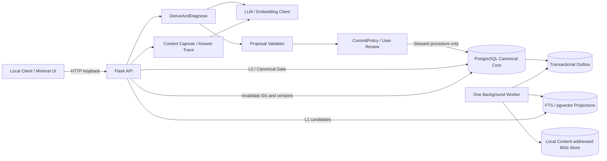
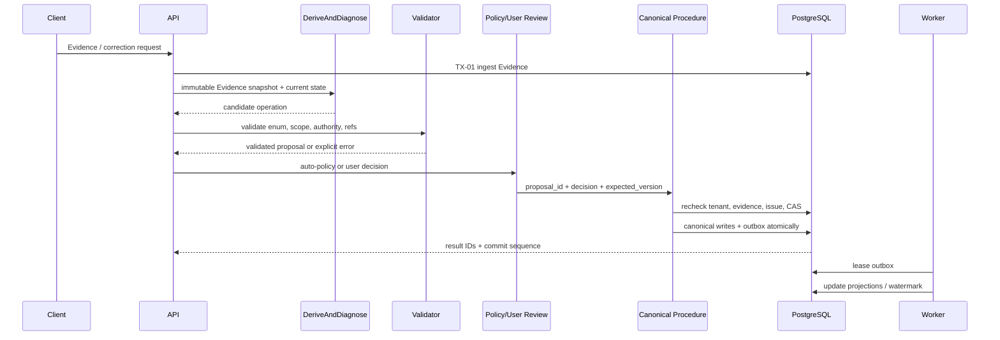
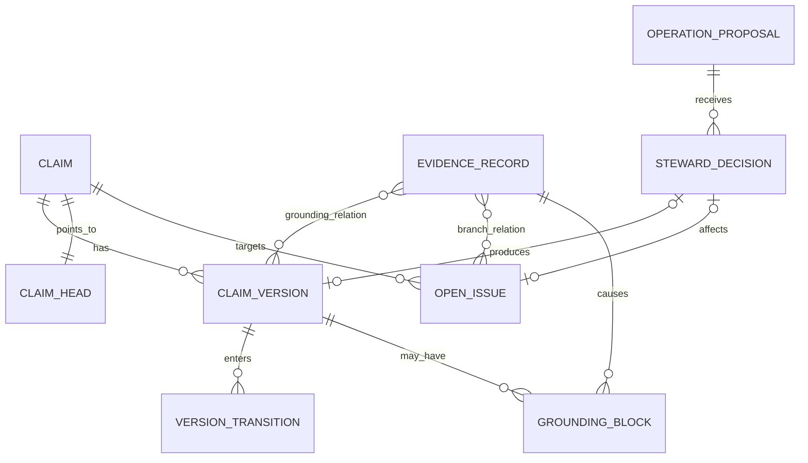
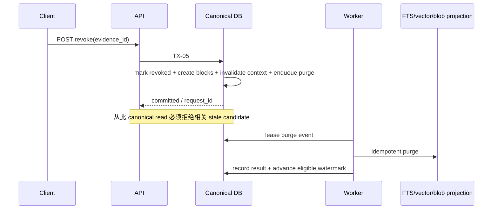
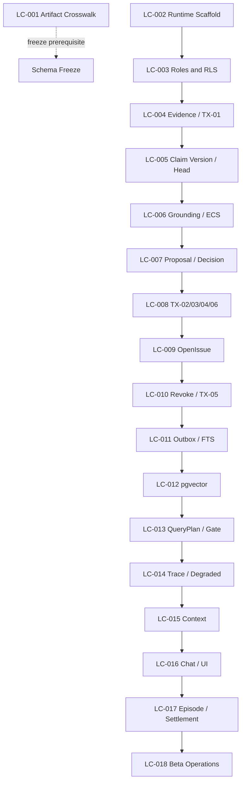

# MiLAi Lean V1 设计规划与开发路线

> **2026-08-16 架构更新：** 用户已明确 Logical Architecture 由 MiLAi 自行设计和实现，不再
> 寻找外部 frozen bundle。当前上位设计候选见
> `MiLAi_Logical_Architecture_v1_设计文档.md`。本文关于“Runtime 尚未创建”和“寻回外部
> bundle”的段落仅保留为历史规划背景。

> 文档版本：`v1.0`  
> 更新日期：`2026-08-15`（Asia/Shanghai）  
> 文档性质：从零开发的设计基线、执行路线与验收索引  
> Schema 状态：`0.1.x EXPERIMENTAL`  
> Implementation 状态：`CANDIDATE`  
> 冻结结论：`NO-GO FOR SCHEMA FREEZE`

---

# 0. 执行结论

MiLAi Lean V1 应从一个小而严格的纵向闭环开始：先把 Evidence、版本化 Claim、冲突保留、撤销阻断和可追溯读取做正确，再接入混合检索、上下文组装和 Chat。当前下载的项目足以作为设计参考与离线评测资产，启动产品开发前不需要再引入新的 memory framework。

在线产品的唯一 canonical core 是 PostgreSQL。ReMe、hindsight、graphiti、Mem0 以及各 benchmark 不进入 canonical 写路径，不获得生产数据库凭据，也不成为 Runtime 启动依赖。它们通过隔离 adapter 用于模式借鉴、回归对比和离线评测。

建议立即并行推进两件事：

1. 寻回 MiLAi Logical Architecture `1.0.0 FROZEN` bundle，完成 `LC-001` crosswalk；
2. 在不冻结 Schema 的前提下启动 `LC-002` 实验性 Runtime scaffold。

冻结架构缺失不阻止实验性实现，但阻止 Schema freeze、正式迁移承诺和“架构已一致”的结论。

---

# 1. 文档定位与规范边界

## 1.1 本文回答什么

本文负责回答：

- 从零开发 MiLAi 的目标架构是什么；
- 当前项目分别复用什么、隔离什么；
- 模块、数据、事务、权限和故障边界如何划分；
- 开发按什么依赖顺序推进；
- 每个里程碑用哪些测试和门禁验收；
- 哪些决定尚未冻结，何时必须用 ADR 关闭。

本文不替代字段级和状态机级合同。具体语义以 `MiLAi_Lean_V1_实施合同.md` 为准。

## 1.2 规范优先级

发生冲突时使用以下顺序：

1. MiLAi Logical Architecture `1.0.0 FROZEN`；
2. `MiLAi_Lean_V1_实施合同.md`；
3. `MiLAi_Lean_V1_产品底座与研究核心.md`；
4. `MiLAi技术升级需求说明_v2.md`；
5. `MiLAi开发实施与使用流程_v1.md` 中未暂停的部分；
6. 本文的工程建议、实验性 Schema、代码和注释。

本文是执行导航，不新增高于实施合同的语义事实。遇到冻结材料缺失或冲突时，保留为 Open Decision，不静默猜测。

## 1.3 当前事实与规划态

截至本文日期：

- `MiLAi/` 仍是文档仓库；
- Runtime、Migration、OpenAPI、容器编排和产品测试尚未创建；
- 冻结架构 bundle 尚未找到；
- 外部项目及主要 benchmark 已下载并完成各自环境准备，详见仓库根目录 `ENVIRONMENT_SETUP.md`；
- 本文所有模块、目录、接口和里程碑均为待实现设计，不代表已运行或已验收。

---

# 2. 产品目标、成功标准与非目标

## 2.1 产品目标

MiLAi Lean V1 是一个本地优先、Evidence-first、版本化、冲突感知的个人记忆系统。它应能回答：

- 这条记忆来自什么 Evidence；
- 当前为什么相信它，适用于什么 Scope 和时间；
- 哪些 Evidence 与它冲突；
- 谁以什么 policy 批准了变化；
- Evidence 被撤销后，哪些 Claim、索引和上下文必须立即失效；
- 本次回答使用了哪些版本、候选、拒绝原因和降级路径。

## 2.2 Lean V1 在线闭环

```text
Evidence Ingest
→ DeriveAndDiagnose
→ validated OperationProposal
→ CommitPolicy / User Review
→ Versioned Claim 或 OpenIssue
→ Exact / FTS / pgvector Retrieval
→ Canonical Gate
→ Minimal ContextCapsule
→ Answer with Trace
→ Evidence Revocation and Fail-Closed Cleanup
```

最先交付的纵向切片是：

```text
Evidence
→ ClaimVersion / OpenIssue
→ L0 exact retrieval
→ revoke Evidence
→ GroundingBlock
→ stale candidate rejected
```

## 2.3 成功标准

产品成功首先由正确性而不是召回率定义：

- Evidence 与 belief 严格分离；
- ClaimVersion append-only，ClaimHead 仅通过 exact-head CAS 移动；
- 冲突保留当前 Head，并创建或更新可追溯 OpenIssue；
- 所有 canonical 变化经过 Proposal、Validator、Decision 和受控 procedure；
- L0 不依赖向量索引，L1 候选必须经过统一 Canonical Gate；
- Evidence revoke 后同步 fail closed，异步副本最终可证明清理；
- canonical 不可用、权限不足、Scope 不匹配或预算不可行时明确拒绝或 abstain；
- 每个 authority-bearing answer 都能回到 Claim、Evidence、OpenIssue 与 RetrievalTrace。

## 2.4 明确非目标

Lean V1 不承诺：

- 自动把模型输出提升为 canonical truth；
- 把摘要或向量库作为权威记忆源；
- 在线使用 ReMe/OpenViking、hindsight 或 graphiti 作为 canonical backend；
- 自动 scope/profile promotion；
- 默认启用 L2 reconstructive retrieval；
- MemoryIntention、LoRA、复杂 agent mesh 或多服务平台化；
- 在真实 workload 测量前承诺性能 SLA；
- 在 frozen bundle 缺失时冻结 Schema。

---

# 3. 核心设计原则

## 3.1 Evidence 不是 Belief

EvidenceRecord 表示一次可追溯观察；ClaimVersion 表示经治理形成的系统状态。相同内容的两次观察是两个 EvidenceRecord，即使它们共享同一 content blob。模型、摘要、检索结果和外部 memory backend 只能生成候选，不能直接制造 ClaimHead。

## 3.2 单一 canonical 写入口

应用层不能直接对 Claim、ClaimVersion、ClaimHead、OpenIssue 做自由 DML。正式变化只能由 Steward 专用角色调用受控 Canonical Procedure；该 procedure 在一个数据库事务内完成 CAS、append-only 记录、decision result 和 outbox event。

## 3.3 不可变历史与显式当前态

- ClaimVersion、VersionTransition、StewardDecision 必须 append-only；
- ClaimHead 只保存当前指针，不承载历史；
- EffectiveClaimState 是唯一 current-state 判定入口；
- Scope、authority、grounding 或 epistemic 状态变化都创建新版本；
- 历史查询与当前查询必须显式区分。

## 3.4 冲突优先保留

内部 `CONTRADICT` 映射为产品结果 `CONFLICT`。冲突默认执行 TX-04：不创建 ClaimVersion、不移动 Head，同时维护 OpenIssue 和正反 Evidence branches。解决问题必须满足 discharge rule，并留下 revision CAS 与 append-only transition。

## 3.5 删除优先于可用性

TX-05 提交后，旧 FTS、向量或 cache 中即使仍有 stale bytes，也不得再形成可用 canonical result。同步层先阻断、失效 Context，再通过高优先级 outbox 完成物理清理。索引故障可以降低 recall，不能提高 authority。

## 3.6 外部智能不进入 canonical transaction

Canonical transaction 内禁止调用 LLM、embedding、reranker、向量搜索、外部 memory 服务或网络 API。所有不确定或高延迟计算在事务外完成，结果以带 fingerprint 的 proposal 输入事务，并在提交时重新验证 canonical preconditions。

## 3.7 本地优先不等于跳过隔离

即使 V1 只有一个用户，也必须携带 tenant context、使用真实 PostgreSQL login role、启用 RLS 并执行跨 tenant 负向测试。默认服务只监听 loopback；日志不记录 Evidence 正文、prompt 全文、密钥或未脱敏 payload。

---

# 4. 现有项目的复用与隔离策略

## 4.1 总体规则

外部项目分为三类：

1. 设计参考：阅读接口、数据流和实现模式；
2. 离线 baseline：用固定快照和统一评测协议运行；
3. 评测数据：只读加载、记录 license、版本和数据 hash。

任何外部项目都不得：

- 获得 MiLAi canonical 数据库的 Steward 凭据；
- 直接写 Claim、OpenIssue、GroundingBlock 或 ClaimHead；
- 成为 API/Worker 的 import-time 必需依赖；
- 用自己的 memory ID 替代 MiLAi canonical ID；
- 把其评测结果自动转成生产 policy。

## 4.2 资产矩阵

| 本地资产 | 主要借鉴 | 允许接入方式 | 明确隔离项 |
| --- | --- | --- | --- |
| `ReMe/` | 结构化 context、检索编排、benchmark adapter 模式 | 只读代码参考；独立进程离线 baseline | 不接管在线路由，不写 canonical state |
| `hindsight/` | retention、observability、评测和服务运维思路 | 固定快照的隔离 baseline | 不作为 Runtime 数据库或在线依赖 |
| `graphiti/` | temporal graph、provenance 和时间查询模式 | 派生数据导出后离线评测 | 不作为 canonical graph database，不回写结论 |
| `mem0/` | provider abstraction、本地 OpenAI-compatible adapter、baseline 接口 | `benchmarks/run_mem0_local.sh` 与隔离 Qdrant workspace | 不作为权威存储，不共享 canonical 凭据 |
| `benchmarks/BEAM/` | 长上下文/记忆能力评测、规模分层 | 固定数据版本与 scorer 的离线运行 | 不混入产品数据，不改变 canonical policy |
| `benchmarks/Memora/` | agent/model memory evaluation | 独立虚拟环境与结果目录 | 不成为产品模块，不将答案回写为事实 |
| `benchmarks/LongMemEval/` | 长期记忆问答与定位 | 只读 dataset adapter | 不把 benchmark schema 强加给产品 schema |
| `benchmarks/LongMemEval-V2/` | 多模态轨迹与完整截图回放 | 校验后只读使用 | 不复制到 Runtime blob store |
| `benchmarks/CUPID/` | 用户偏好与个性化评测参考 | 离线 fixture 转换 | 不启用自动 profile promotion |
| `benchmarks/HorizonBench/` | 长程任务与规划评测参考 | 离线 runner | 不扩大在线 agent 权限 |
| `benchmarks/PAHF/` | 事实一致性/幻觉相关评测参考 | 离线 scorer | 不把单一指标当发布结论 |
| 已有 LoCoMo 数据 | 多会话记忆 baseline | 统一 evaluation manifest | 不成为生产训练数据默认来源 |

## 4.3 版本与可复现性

每次 baseline run 必须生成 `run manifest`，至少记录：

```text
asset_name
upstream_version_or_commit
local_patch_hash
dataset_hash
license
environment_lock_hash
model_endpoint_and_model_id
prompt_or_template_version
scorer_version
seed
started_at / finished_at
result_artifact_hash
```

已有上游目录存在本地适配修改，不能只记录 Git commit。正式结果必须同时记录 dirty patch hash，或从干净 worktree 构建可复现快照。

## 4.4 是否还需下载项目

产品主线启动前没有新的开源项目硬依赖。当前真正缺失的是 MiLAi 自身的 frozen architecture bundle，而不是另一个 memory framework。只有在某个明确评测问题无法由现有资产覆盖，并写出新增成本、license、隔离策略和退出条件后，才评估新增下载。

---

# 5. 目标系统架构

## 5.1 运行拓扑

默认部署保持四个边界清晰的运行单元：



逻辑上可分层，物理上仍保持单 API、单 worker 和单 PostgreSQL 实例，避免过早微服务化。

## 5.2 信任边界

| 边界 | 可以信任什么 | 不能信任什么 |
| --- | --- | --- |
| API 输入 | 已认证 actor 的请求意图 | tenant_id、版本、权限声明和正文真实性 |
| LLM/Derive | 结构化候选与解释 | canonical truth、authority 和 commit eligibility |
| Projection | 候选 ID、排序信号、索引版本 | 当前有效性、权限、revocation 和 Head |
| Context | 当前请求的临时工作集 | 持久事实与 issue resolution |
| External baseline | 自身算法输出 | MiLAi 状态变化和生产策略 |
| PostgreSQL procedures | 在受控 role 下执行的约束与 CAS | 未经验证的外部 proposal 内容 |

## 5.3 模块划分

| 模块 | 责任 | 禁止责任 |
| --- | --- | --- |
| `api` | HTTP contract、认证、request ID、错误映射 | 内嵌 canonical DML、复制业务判断 |
| `domain` | 类型、状态机、policy 输入输出、纯函数规则 | I/O、网络、数据库 session |
| `application` | use case 编排、事务边界请求、review workflow | 绕过 repository/procedure |
| `persistence` | SQL、migration、RLS、procedure、repository | 调用模型或外部服务 |
| `adapters` | LLM、embedding、blob、benchmark/export adapter | 持有 Steward 凭据、直接 canonical write |
| `workers` | outbox lease、projection、purge、watermark | Claim/OpenIssue canonical DML |
| `observability` | structured event、metrics、trace correlation | 记录敏感正文或密钥 |
| `config` | typed settings、secret reference、fail-fast 校验 | 隐式 fallback 到不安全默认值 |

依赖方向固定为：

```text
api / workers / adapters
        ↓
application
        ↓
domain

persistence implements application ports
domain imports no infrastructure module
```

## 5.4 核心写入时序



DeriveAndDiagnose 与模型调用在 canonical transaction 之外。Procedure 不能相信之前读取的状态，提交时必须重新检查。

---

# 6. 数据架构

## 6.1 五个数据平面

| 数据平面 | 对象 | 权威性 |
| --- | --- | --- |
| Evidence Plane | `content_blob`, `evidence_record` | observation source，非 belief |
| Canonical State Plane | `claim`, `claim_version`, `claim_head`, `version_transition`, `grounding_relation`, `grounding_block`, `effective_claim_state` | 产品事实状态的唯一来源 |
| Control Plane | `operation_proposal`, `steward_decision`, `open_issue` 及 issue transition | 治理输入、决定和未解决状态 |
| Projection Plane | `outbox_event`, `index_watermark`, `search_document`, `search_embedding` | 可重建派生数据，不决定有效性 |
| Context/Trace Plane | 可选 TTL `context_capsule`, `retrieval_trace`, `operational_event` | 请求工作集和审计线索，非 canonical truth |

## 6.2 逻辑关系



该图表达逻辑语义，不冻结 `grounding_relation` 的物理拆表方式，也不决定 OpenIssue 独立 version 表方案。

## 6.3 通用数据规则

- 所有 tenant-owned 记录包含 `tenant_id`、对象 ID、创建时间和 actor；
- 可重试写入携带 `idempotency_key` 与 `request_fingerprint`；
- 同 tenant、operation family、key、相同 fingerprint 返回第一次结果；
- 同 key 不同 fingerprint 返回 `IDEMPOTENCY_CONFLICT`；
- ID 在 API 层不可暗示可访问性，所有读取仍执行 tenant/RLS 检查；
- timestamp 使用带时区 UTC 存储，API 明确序列化；
- JSON payload 需要版本字段和边界校验，不以无约束 JSON 逃避 Schema；
- 所有外键、唯一约束和 append-only guard 在 PostgreSQL 层有真实测试。

## 6.4 EffectiveClaimState

EffectiveClaimState 必须集中计算：

```text
ClaimHead / requested historical version
+ Evidence revocation state
+ live GroundingBlock
+ permission and retention
+ Scope match
+ valid time
+ epistemic/freshness
+ required authority
= EffectiveClaimState
```

API、Retrieval、Context 和 Steward 共享同一受测入口。早期实现可采用 SQL function/view 或 repository，但不得形成多套语义；物理形式在 ADR 中记录并允许 `0.1.x` 迭代。

## 6.5 Schema 演进纪律

- 每个 migration 只做一个可解释变化；
- migration 包含 upgrade、兼容性说明、数据回填策略和恢复方案；
- destructive migration 必须拆成 expand → migrate → verify → contract；
- procedure、RLS policy、role grant 与表结构一起版本化；
- downgrade 若会丢失 canonical history，必须禁止并提供 forward repair；
- CI 从空库和上一候选版本分别执行迁移；
- frozen bundle crosswalk 完成前版本只允许为 `0.1.x EXPERIMENTAL`。

---

# 7. 事务与治理设计

## 7.1 六个 canonical 事务

| 事务 | 输入前置条件 | 原子效果 | 关键拒绝条件 |
| --- | --- | --- | --- |
| TX-01 Evidence Ingest | tenant/actor、source、hash、permission snapshot、幂等信息 | EvidenceRecord、blob ref、event/outbox | tenant mismatch、fingerprint conflict、不可接受 payload |
| TX-02 Claim Create | approved CREATE proposal、admissible Evidence、absence-CAS | Claim、V1、relations、Head、decision result、issue effect、outbox | 已存在 identity、Evidence revoked、authority 不足 |
| TX-03 Claim Revision | approved 精确 UPDATE operation、expected Head | append-only Vn+1、transition、relations、Head CAS、issue effect、outbox | stale expected version、scope/authority/grounding 失败 |
| TX-04 No Change / Conflict Preserve | validated NO_CHANGE 或 CONTRADICT | decision、OpenIssue/relation/outbox；Head 不变 | 非法关闭 issue、试图创建版本或移动 Head |
| TX-05 Evidence Revoke | live Evidence、授权 reason、幂等信息 | revoke、GroundingBlock、Context invalidation、purge outbox | tenant/permission 失败；任何 fail-open 路径 |
| TX-06 Grounding Restore | 新 admissible Evidence、APPROVE decision、expected Head | 新 ClaimVersion、transition、新 grounding、受治理 block/issue effect | 复用 revoked Evidence、原地删 block、无新版本 |

## 7.2 Operation 映射

产品 `UPDATE` 必须在 proposal 中细化为：

```text
SUPPORT
WEAKEN
REVALIDATE
REGROUND
SUPERSEDE
CONTEXTUALIZE
```

`CONFLICT` 在内部使用 `CONTRADICT`，默认 TX-04。`SPLIT` 即使保留在接口 enum，也必须返回 `OPERATION_NOT_ENABLED`，不能偷偷选择近似操作。

## 7.3 提交顺序

每个 canonical procedure 遵循同一安全顺序：

1. 建立 tenant context 并验证调用角色；
2. 锁定或读取 proposal、decision 和目标 Head；
3. 校验幂等记录与 fingerprint；
4. 重新读取 Evidence revocation、permission、retention、Scope 和 authority；
5. 检查 expected version / issue revision CAS；
6. 执行 append-only 写入和最小可变指针更新；
7. 同事务写 decision result、operational lineage 与 outbox；
8. 提交后返回稳定 ID 和 commit sequence；
9. 事务外触发或等待 projection，不改变 canonical 成功语义。

任何步骤失败都必须整体回滚，不产生孤立版本、Head、decision 或 outbox。

## 7.4 OpenIssue 生命周期

类型：

```text
CONFLICT
MISSING_EVIDENCE
SCOPE_UNCERTAIN
AUTHORITY_UNCERTAIN
DEPENDENCY_INVALIDATED
```

状态：

```text
OPEN
WAITING_EVIDENCE
WAITING_USER
READY_FOR_REVIEW
RESOLVED
DISMISSED
```

约束：

- 每次状态变化使用 issue `revision` CAS；
- transition append-only；
- branch relations 结构化保存 SUPPORT/CONTRADICT/RESOLUTION_CANDIDATE；
- 摘要、压缩、检索遗漏、模型判断或时间经过不能关闭 issue；
- resolution Evidence 后续 revoke 时，重开同一 issue ID，不能创建一个失去 lineage 的替代 issue；
- discharge rule 的 authority 与 Evidence 条件必须在 procedure 内复验。

## 7.5 Authority 处理

Lean 枚举为：

```text
INFORMATIONAL
ACTION_SAFE
USER_CONFIRMED
```

在 frozen bundle 缺失时不得把它实现成简单全序。尤其 `USER_CONFIRMED` 不自动蕴含 `ACTION_SAFE`；某些动作仍需当前请求中的 live user confirmation。早期代码采用显式 policy matrix 和 deny-by-default，最终比较关系由 ADR 与 frozen crosswalk 决定。

---

# 8. 读取、检索与 Context 设计

## 8.1 路线选择

| 路线 | 用途 | 依赖 | 失败行为 |
| --- | --- | --- | --- |
| L0 Exact / Current | 精确实体、编号、当前状态、已确认事实 | PostgreSQL canonical tables/ECS | canonical 不可用则明确失败或 abstain |
| L1 Hybrid | 模糊语义查询与证据发现 | metadata/time/scope filter、FTS、pgvector、Canonical Gate | projection stale 时 canonical fallback 或降级 |
| L2 Reconstructive | 复杂重构 | 默认关闭 | 返回 `OPERATION_NOT_ENABLED` 或显式未启用状态 |

L1 固定顺序：

```text
metadata / time / scope prefilter
→ FTS + pgvector candidates
→ score normalization and dedupe
→ canonical ID/version resolution
→ Canonical Gate
→ Evidence bundle
```

## 8.2 Canonical Gate

每个进入 Context 的候选至少检查：

```text
tenant
subject
permission
retention
revocation
requested version / current Head
GroundingBlock
Scope
valid time
OpenIssue / conflict state
required authority
Evidence lineage
projection commit sequence / watermark
```

拒绝项写入 RetrievalTrace 的 reason code；不得只从结果列表静默消失。Canonical Gate 使用 canonical DB 重新判断，不能接受 projection 自带的 `is_valid=true` 作为结论。

## 8.3 一致性模式

规划支持：

- `EVENTUAL`：允许在明确 watermark 下使用投影；
- `READ_YOUR_WRITES`：若 watermark 落后，回退 canonical query；
- `CANONICAL_REQUIRED`：必须得到 canonical snapshot，否则 abstain。

具体 API 默认值在 OpenAPI ADR 中关闭。任何模式都不能绕过权限、revocation 或 GroundingBlock。

## 8.4 Minimal ContextCapsule

Context 固定分区：

```text
ACTIVE GOAL
ACTIVE STATE
OPEN ISSUES
CONSTRAINTS
RETRIEVED EVIDENCE
TRACE POINTERS
```

Goal、硬约束、当前 ECS 和 live OpenIssue 是 protected items。每个 live OpenIssue 至少保留 issue ID、target、status、branch refs 和 discharge rule。若最小保护表示已超过预算，返回 `CONTEXT_BUDGET_INFEASIBLE`，不能通过删除 issue 获得表面成功。

Pointer recovery 必须重新校验 canonical ID、content hash、permission、retention 和 revocation。ContextBackend 故障不能改变 Claim/OpenIssue 状态。

## 8.5 Answer with Trace

Chat 输出至少区分：

- answer text；
- confidence/authority presentation；
- conflict or unresolved issue notices；
- used ClaimVersion IDs；
- Evidence refs；
- RetrievalTrace ID；
- abstention/degraded reason；
- 对 action-sensitive 请求是否完成 live confirmation。

生成模型只能基于已通过 Canonical Gate 的 capsule 回答。答案中的新信息若要进入记忆，必须回到 Evidence/Proposal 流程，不能自回写。

---

# 9. Outbox、Projection 与删除设计

## 9.1 Outbox 状态机

```text
PENDING
→ PROCESSING (leased)
→ DELIVERED
  或 RETRY with backoff
  或 DEAD_LETTER
```

worker 规则：

- lease 有 owner 和 expiry，可从 worker crash 恢复；
- handler 以 event ID 和 projection version 幂等；
- 同一 aggregate 的顺序可验证；
- 每个 projection 使用独立 durable watermark；
- watermark 不能越过未处理 dead-letter gap；
- 删除/权限收紧事件优先于普通 upsert；
- worker role 无 Claim/OpenIssue canonical DML 权限；
- rebuild 从 canonical snapshot 开始，并经过相同 Canonical Gate 约束。

## 9.2 Evidence revoke 时序



物理清理失败不恢复逻辑可见性；它形成可监控、可重试、可审计的 deletion state。

## 9.3 Shared Blob

内容寻址 blob 只在同 tenant 内去重。撤销一个 EvidenceRecord 时：

- 先撤销该 observation 的可用性；
- 检查同 tenant 其他 live Evidence 引用；
- 仅在无合法引用且 retention 允许时物理删除；
- 无法确定权限、retention 或引用计数时 fail closed，不提前擦除共享数据；
- blob delete 与 DB tombstone/purge result 可重放并可对账。

---

# 10. API 设计边界

## 10.1 最小资源接口

规划中的 V1 API：

```text
POST /v1/evidence
GET  /v1/evidence/{id}
GET  /v1/evidence/{id}/lineage
POST /v1/evidence/{id}/revoke
GET  /v1/deletions/{request_id}

POST /v1/review/proposals
GET  /v1/review/proposals/{id}
POST /v1/review/proposals/{id}/decisions

GET  /v1/claims/{id}
GET  /v1/claims/{id}/versions
GET  /v1/open-issues
GET  /v1/open-issues/{id}

POST /v1/memory/query
GET  /v1/retrieval-traces/{id}
POST /v1/chat

GET  /v1/operations/watermarks
GET  /v1/operations/degraded
```

最终路径和 payload 由 versioned OpenAPI 文件定义；本文不冻结字段外观。

## 10.2 通用请求规则

- 认证上下文决定 tenant/actor，客户端 payload 不能覆盖；
- canonical 写必须提供 idempotency key；
- revision 类写必须提供 expected version/revision；
- request fingerprint 由规范化 payload、operation family 和稳定上下文计算；
- 所有响应携带 request ID；canonical 成功响应携带相关 object IDs 与 commit sequence；
- retry-safe 与非 retry-safe 行为在 OpenAPI 中明确；
- 不返回数据库内部异常、SQL 或 secret。

## 10.3 统一错误

```text
AUTHENTICATION_REQUIRED
AUTHORIZATION_DENIED
TENANT_MISMATCH
IDEMPOTENCY_CONFLICT
VERSION_CONFLICT
ISSUE_REVISION_CONFLICT
EVIDENCE_REVOKED
GROUNDING_BLOCKED
SCOPE_MISMATCH
SCOPE_TIME_CONFLICT
AUTHORITY_INSUFFICIENT
OPERATION_NOT_ENABLED
CANONICAL_UNAVAILABLE
CONTEXT_BUDGET_INFEASIBLE
PROJECTION_DEGRADED
```

错误 envelope 包含稳定 code、human-readable message、request ID、可选 retryability 和安全 details；不得用 HTTP 200 包装失败。

---

# 11. 安全与权限设计

## 11.1 数据库角色

| 角色 | 允许 | 禁止 |
| --- | --- | --- |
| Migration Owner | DDL、procedure/policy 管理 | 作为在线连接运行 |
| API Runtime | Evidence/use-case 所需读写、调用受控入口 | canonical 表自由 DML、绕过 RLS |
| Steward Procedure Executor | 调用批准的 canonical procedures | 直接表写、模型/网络调用 |
| Projection Worker | outbox lease、projection/purge 状态 | Claim/OpenIssue canonical DML |
| Audit Runner | 隔离只读快照和 audit 输出 | 在线写凭据、自动改变 production policy |

角色由真实 login connection 集成测试，不以 mock 权限代替。

## 11.2 应用安全

- 默认 bind `127.0.0.1`/`::1`，非 loopback 需显式配置；
- secret 只从环境变量或 secret reference 读取，禁止写进配置样例和日志；
- 启动时校验 DB URL、blob root、模型端点、维度和必要 feature flags；
- external URL、source_ref 和 blob path 做 allowlist/路径规范化；
- payload、附件大小和模型输出结构设硬上限；
- 所有 review/删除/权限变化留下不含敏感正文的 operational event；
- benchmark adapter 使用不同 DB role、不同 output root 和显式数据导出。

## 11.3 RLS 验收

至少使用两个 tenant、两个真实 login connection 验证：

- 猜中另一个 tenant 的 ID 仍无法 SELECT；
- INSERT/UPDATE/DELETE 不能伪造 tenant；
- procedure 内 `SECURITY DEFINER` 若使用，必须锁定 `search_path` 并显式校验 tenant；
- connection pool 每次借还都正确设置/清理 tenant context；
- worker/audit role 不因 RLS 配置遗漏获得超额权限。

---

# 12. 候选技术基线与仓库布局

## 12.1 技术基线

以下是 `Implementation CANDIDATE`，在 scaffold ADR 与 lockfile 中最终落地：

| 领域 | 候选选择 | 选择理由 |
| --- | --- | --- |
| Runtime | Python 3.11+、Flask application factory | 与现有本地评测环境协调，保持小型同步 API |
| Validation | Pydantic v2 风格 typed boundary | 对 LLM/HTTP/config 的不可信结构集中校验 |
| Database | PostgreSQL 16 系列、pgvector | canonical transaction、RLS、FTS 与向量同库管理 |
| Driver | psycopg 3；关键事务使用显式 SQL | 清晰控制 CAS、role、isolation 和 procedure |
| Migration | Alembic 或等价 migration harness | 版本化 DDL、procedure、policy 和可重复建库 |
| Blob | 本地 content-addressed filesystem adapter | V1 部署小、可审计、可替换 |
| Worker | 单进程数据库 outbox poller | 避免引入 message broker，保证最小运行面 |
| Quality | pytest、Ruff、类型检查、真实 PostgreSQL integration | 低成本覆盖事务、权限和接口契约 |
| Packaging | `pyproject.toml` + 锁文件 | 可重复环境与明确依赖来源 |
| Local deploy | Docker Compose + host 可选模型端点 | 可重复启动且不强绑 GPU/runtime |

不在本文写死第三方包 patch 版本；创建 Runtime 时解析兼容版本、生成锁文件、记录 license，并由 CI 验证锁定环境。

## 12.2 目标目录

```text
MiLAi/
├── AGENTS.md
├── docs/
│   ├── adr/
│   ├── architecture/
│   ├── api/
│   └── runbooks/
├── runtime/
│   ├── pyproject.toml
│   ├── lockfile
│   ├── compose.yaml
│   ├── .env.example
│   ├── migrations/
│   ├── src/milai/
│   │   ├── api/
│   │   ├── domain/
│   │   ├── application/
│   │   ├── persistence/
│   │   ├── adapters/
│   │   ├── workers/
│   │   ├── observability/
│   │   └── config/
│   ├── tests/
│   │   ├── unit/
│   │   ├── contract/
│   │   ├── integration/
│   │   ├── concurrency/
│   │   ├── security/
│   │   └── e2e/
│   └── scripts/
├── evals/
│   ├── adapters/
│   ├── fixtures/
│   ├── manifests/
│   ├── scorers/
│   └── reports/
└── artifacts/
    └── architecture/        # frozen bundle 到位后的受控副本/索引
```

这些目录尚未创建。实现时按纵向切片增量建立，避免一次性生成空壳模块。

## 12.3 配置分层

```text
checked-in defaults (non-secret)
→ environment-specific config
→ secret references / environment variables
→ startup validation
→ immutable runtime settings snapshot
```

关键配置包括数据库 DSN、role DSN、blob root、模型/embedding endpoint、embedding dimension、consistency default、feature flags、lease/backoff 和日志脱敏。未知配置项应在 CI/production mode fail fast，避免拼写错误被忽略。

---

# 13. 开发方法

## 13.1 纵向切片优先

每个切片同时包含 domain rule、migration/SQL、application use case、API、真实数据库测试、trace 和故障路径。不要先建一层完整“平台”再等待集成。

推荐顺序：

```text
合同/ADR
→ executable DB constraint
→ repository/procedure
→ application use case
→ HTTP contract
→ positive + negative + concurrency test
→ observability
→ runbook
```

## 13.2 关键路径先测

对 TX-01～TX-06、RLS、Canonical Gate、revocation 和 outbox gap 采用 test-first。LLM 输出使用 schema fixture 和 recorded adapter，不能让关键正确性测试依赖网络或随机模型响应。

## 13.3 简单实现优先

- 单体模块化 Runtime，不拆微服务；
- 一个 worker，不引入 broker；
- SQL 明确表达 CAS 与锁，不隐藏在通用 CRUD；
- L0 先于 L1，FTS 先于向量调优；
- policy matrix 先于复杂规则引擎；
- 本地 blob adapter 先于对象存储抽象扩张；
- 最小 UI 只覆盖 ingest、review、query、trace、correct、revoke。

## 13.4 变更纪律

每个 PR/变更集必须说明：

```text
affected invariant / transaction
data and migration impact
role / RLS impact
delete and rollback behavior
idempotency behavior
tests added
observability added
open decision or ADR
```

禁止把“后续再补”留在 canonical safety、tenant isolation、delete fail-closed 和 immutable history 上。

---

# 14. 分阶段开发路线

阶段以依赖和验收为准，不以虚构日期为准。规模 `S/M/L/XL` 仅表示相对工程量，真实排期在首轮实现数据后校准。

## Phase 0：Artifact 与决策基线

**范围：** `LC-001`，规模 `M`。

交付：

- frozen bundle 的获取记录或明确缺失证明；
- 文档/对象/事务/权限/invariant crosswalk；
- ADR 模板与 decision log；
- 术语表、错误表和 traceability matrix；
- Schema 状态 banner 自动检查。

验收：

- 若 frozen bundle 到位，完成 `LG-00`；
- 若仍缺失，记录 owner、来源和阻断范围，允许继续实验性实现但保持 NO-GO；
- 没有把未知 G1–G9/12 invariants 写成既成事实。

## Phase 1：可重复 Runtime 基础

**范围：** `LC-002`～`LC-003`，规模 `L`，目标 `LG-01`。

交付：

- Flask app/worker 两个入口与 typed config；
- PostgreSQL + pgvector 本地 Compose；
- migration/bootstrap harness；
- Migration/API/Steward/Worker/Audit roles；
- tenant context、基础 RLS、health/readiness；
- lint/type/unit/integration CI 骨架；
- `.env.example`、本地启动和故障排查 runbook。

验收：

- 空环境按文档可重复启动和销毁开发实例；
- 缺配置、错误维度、数据库不可达时 fail fast；
- 两个真实 tenant/role 的负向测试通过；
- Runtime 启动不需要 ReMe、hindsight、graphiti 或 Mem0。

## Phase 2：Evidence 与 Canonical 核心

**范围：** `LC-004`～`LC-008`，规模 `XL`，目标 `LG-02` 的核心部分。

交付：

- content blob、EvidenceRecord、TX-01；
- Claim、ClaimVersion、ClaimHead、VersionTransition；
- GroundingRelation、GroundingBlock、EffectiveClaimState；
- OperationProposal、validator、StewardDecision；
- TX-02/TX-03/TX-04/TX-06 procedures；
- absence/head CAS、append-only、幂等与 rollback tests。

验收：

- 两个并发 create 只有一个 Head；
- 两个并发 revision 只有一个 CAS 成功；
- NO_CHANGE/CONFLICT 不产生新版本；
- 非 Steward commit、Steward direct DML 均失败；
- canonical transaction 代码路径没有模型/向量/网络调用。

## Phase 3：OpenIssue、撤销与最小纵向闭环

**范围：** `LC-009`～`LC-010` 加 L0 最小查询，规模 `XL`，目标 `LG-02`、`LG-03` 与 `LG-06` 的同步部分。

交付：

- OpenIssue 状态机、branches、discharge rule、revision CAS；
- TX-05 revoke、同步 GroundingBlock 和 Context invalidation；
- deletion request/status；
- L0 exact/current query 与 Canonical Gate 初版；
- E1→E2→E3→revoke 纵向 fixture。

验收：

- 冲突保留 Head 和两个 Evidence branch；
- 合法 resolution 后，撤销 resolution Evidence 会重开同一 issue ID；
- stale ID 即使被直接传入也被 Canonical Gate 拒绝；
- 整条纵向用例可从 proposal、decision、version、issue、outbox、trace 回放。

## Phase 4：Projection 与混合检索

**范围：** `LC-011`～`LC-014`，规模 `XL`，目标 `LG-04` 和 `LG-06` 异步部分。

交付：

- outbox lease/retry/dead-letter；
- FTS projection、pgvector projection、embedding versioning；
- 独立 watermark 与 rebuild；
- QueryPlan、L0/L1、score normalize/dedupe；
- RetrievalTrace、degraded/fallback/abstention；
- purge handler 与 shared blob 对账。

验收：

- dead-letter gap 不被 watermark 跨越；
- handler retry 不重复 projection side effect；
- L0 在 vector 完全不可用时仍工作；
- READ_YOUR_WRITES 在落后时回退 canonical；
- 删除事件提交后 stale FTS/vector 永远不能通过 Gate。

## Phase 5：Context 与 Chat

**范围：** `LC-015`～`LC-017`，规模 `L`，目标 `LG-05`。

交付：

- LocalStructuredContextBackend；
- protected partitions、budget allocator、pointer recovery；
- Chat API 和 answer trace；
- 最小 review/correct/confirm/revoke UI；
- Episode capture 与不依赖 MemoryIntention 的最小 Settlement。

验收：

- recursive compaction 仍保留 OpenIssue identity、branches、discharge rule；
- pointer hash/permission/retention/revocation 复验通过；
- budget infeasible 明确返回错误；
- canonical unavailable 时 action-sensitive answer abstains；
- Chat 不能直接创建 canonical Claim。

## Phase 6：Local Beta 与运维闭环

**范围：** `LC-018`，规模 `L`，目标 `LG-07`。

交付：

- backup/restore 和 blob/DB consistency manifest；
- migration upgrade/restore rehearsal；
- deletion reconciliation、dead-letter 运维页；
- 安全、脱敏、容量和故障注入回归；
- Local Beta release report 与已知限制。

验收：

- 从备份恢复后 canonical IDs、hash、relations 和 watermarks 可对账；
- 日志扫描无 Evidence/prompt/secret 泄露；
- DB、worker、embedding、blob 故障均表现为规定的降级或 fail-closed；
- 所有 `LG-00`～`LG-07` 的适用条件有证据，未满足项不能被文字豁免。

## Phase R：OSPC 隔离研究线

**范围：** `RC-001`～`RC-008`，不阻塞 Phase 1～6。

```text
fixture schema / annotation
→ false-closure and discharge scorers
→ naive / extractive / typed-state strong baselines
→ protected subgraph prototype
→ budget allocator + infeasible handling
→ equal-budget ablation
→ prior-art / absorber audit
→ go / hold / abandon
```

只有 `RG-00`、`RG-01`、`RG-02` 依次通过，OSPC 才能成为论文候选；失败时保留可复现实验报告，不能影响产品发布，也不能改写在线 policy。

---

# 15. 任务依赖图与首个开发批次

## 15.1 主依赖图



`LC-001` 可以与实验性 scaffold 并行，但它始终是 Schema Freeze 的硬前置条件。

## 15.2 首个开发批次建议

文档确认后，第一个变更集只做 `LC-002` 的可验证骨架：

1. 创建 `runtime/pyproject.toml`、锁文件与最小 package；
2. 创建 Flask app factory、worker entrypoint 和 typed settings；
3. 创建本地 PostgreSQL/pgvector Compose 与 health checks；
4. 建立 migration/bootstrap 框架，不先定义完整 canonical schema；
5. 建立真实 PostgreSQL integration test fixture；
6. 加入 lint、type、unit、integration 命令；
7. 写 ADR-001 技术基线和本地运行 runbook；
8. 证明 API/worker 不 import 外部 memory 项目。

这个批次不实现 Claim 业务，不假装通过 `LG-02`，只以 `LG-01` 为目标。

---

# 16. 测试与质量策略

## 16.1 测试层次

| 层次 | 主要目标 | 环境 |
| --- | --- | --- |
| Unit | domain 状态机、policy matrix、fingerprint、budget 纯函数 | 无网络、无数据库 |
| Contract | HTTP/OpenAPI、adapter payload、错误 envelope | fake ports + schema fixtures |
| Integration | SQL、migration、procedure、RLS、repository、outbox | 真实 PostgreSQL、真实 roles |
| Concurrency | absence/head/issue CAS、lease、幂等 replay | 两个及以上独立连接 |
| Security | tenant escape、role grant、path/secret/log redaction | isolated test database/filesystem |
| E2E | Evidence→Claim/OpenIssue→query→revoke | API + worker + PostgreSQL + deterministic model adapter |
| Evaluation | 质量、成本、baseline 和 OSPC falsifier | 与产品环境和凭据隔离 |

## 16.2 必须冻结的正确性测试

数据库/事务：

```text
CREATE absence-CAS race
revision exact-head CAS race
OpenIssue revision CAS race
idempotency replay
idempotency fingerprint conflict
NO_CHANGE creates no version
CONFLICT preserves current head
SPLIT fails closed
old ClaimVersion byte immutability
non-Steward commit denied
Steward direct DML denied
cross-tenant SELECT/write denied
Outbox atomic rollback
dead-letter watermark gap
```

删除/权限：

```text
revoke immediately blocks ACTION_SAFE
stale FTS/vector candidate rejected
shared Blob not prematurely erased
unreadable retention fails closed
TX-06 requires new admissible Evidence
Context pointer invalidated
purge retry idempotent
```

检索/Context：

```text
L0 independent of vector index
unknown/cross-tenant/wrong-scope candidate rejected
READ_YOUR_WRITES canonical fallback
CANONICAL_REQUIRED abstains on DB failure
OpenIssue identity and branches survive recursive compression
pointer hash/permission/retention validation
budget infeasibility explicit
```

## 16.3 E2E 冲突用例

```text
E1: deployment Evidence says Python 3.11
→ M1 V1 ACTION_SAFE

E2: pyproject Evidence says >=3.12
→ CONTRADICT
→ OpenIssue with both branches
→ Head remains V1

E3: CI and production runtime both report 3.12
→ READY_FOR_REVIEW
→ APPROVE SUPERSEDE
→ M1 V2
→ governed OpenIssue resolution

revoke E3 runtime Evidence
→ GroundingBlock
→ same issue ID reopens
→ stale index cannot return action-safe 3.12
```

每一步断言 proposal、decision、version、Head、relations、issue transition、outbox 和 RetrievalTrace。

## 16.4 质量门禁

提交前至少满足：

- format/lint/type checks 通过；
- unit/contract tests 通过；
- 涉及数据库时真实 PostgreSQL integration tests 通过；
- 涉及事务时 concurrency 和 rollback tests 通过；
- migration 从空库与上一候选版本通过；
- 新错误码/OpenAPI/ADR/runbook 同步；
- dependency/secret/license scan 无阻断项；
- 测试覆盖率被报告，但不能用单一百分比替代关键 invariant 用例。

主分支和发布候选必须在干净、锁定依赖环境重跑，不使用开发者工作区中的隐式 editable package。

---

# 17. 发布门禁

| Gate | 必须证明 | 未通过时 |
| --- | --- | --- |
| `LG-00 Architecture Crosswalk` | frozen bundle、对象/权限/invariant 逐条映射 | 禁止 Schema freeze |
| `LG-01 Runtime` | API、worker、PostgreSQL 可重复启动，配置 fail-fast | 不进入 canonical 开发宣称 |
| `LG-02 Canonical Core` | TX-01～TX-06、CAS、immutability、roles、RLS | 不对外称 core complete |
| `LG-03 Vertical Slice` | Evidence→Claim/OpenIssue→L0 可回放 | 不进入 Alpha |
| `LG-04 Retrieval` | FTS+pgvector、Gate、watermark、fallback | 不启用 L1 默认路径 |
| `LG-05 Context` | capsule、pointer recovery、issue preservation | 不启用 Chat memory |
| `LG-06 Deletion` | fail-closed、purge、shared blob、backup state | 不发布任何真实数据版本 |
| `LG-07 Local Beta` | Chat、trace、纠正、删除、恢复、脱敏 | 不标记 Local Beta |

立即阻断发布的条件：

```text
canonical invariant violation
cross-tenant exposure
deletion fail-open
untraceable authority-bearing answer
outbox unrecoverable gap
adapter direct canonical write
compression closes live OpenIssue
idempotent retry duplicates canonical state
concurrent revisions both move Head
canonical unavailable but system pretends certainty
```

发布证据以机器可读 test report、migration manifest、artifact hash 和 runbook drill 为准，不以口头确认替代。

---

# 18. 可观测性与运维

## 18.1 关联字段

所有关键路径使用以下安全标识关联：

```text
request_id
tenant_id (日志中使用安全表示)
actor_type
operation_family
proposal_id
decision_id
claim_id / claim_version_id
issue_id / revision
canonical_commit_seq
outbox_event_id
projection_name / watermark
retrieval_trace_id
deletion_request_id
```

不得记录正文、完整 prompt、embedding、token、数据库 DSN 或 API key。

## 18.2 核心指标

- canonical transaction success/conflict/rollback；
- idempotency replay/conflict；
- CAS conflict by operation；
- live OpenIssue count/age/status；
- outbox pending age、retry、dead-letter、lease recovery；
- projection lag 与 watermark gap；
- Canonical Gate reject by reason；
- retrieval route/fallback/abstention；
- deletion logical block latency 与 physical purge completion；
- Context budget infeasible；
- model/embedding latency、failure、schema-invalid output；
- RLS/authorization denial，不包含敏感 payload。

## 18.3 Runbook 最小集合

```text
local bootstrap and shutdown
migration failure / forward repair
database unavailable
worker lease recovery
dead-letter inspection and replay
projection rebuild
embedding model/dimension change
evidence revoke and purge reconciliation
shared blob consistency repair
backup and restore drill
secret rotation
privacy-safe incident evidence collection
```

---

# 19. 评测与研究规划

## 19.1 产品评测

产品评测分开报告：

- correctness：canonical、conflict、revocation、permission；
- retrieval：recall、precision、rejection correctness、staleness；
- answer：evidence attribution、abstention、authority presentation；
- operations：latency、resource、projection lag、recovery；
- privacy：泄露与 tenant negative tests。

任何平均分都不能掩盖 deletion fail-open、cross-tenant exposure 或 false epistemic closure。

## 19.2 统一 baseline harness

在 `evals/adapters/` 为 ReMe、hindsight、graphiti、Mem0 和数据集实现窄接口：

```text
prepare(run_spec) -> immutable manifest
ingest(dataset_snapshot) -> baseline-local IDs
query(question_set) -> raw answers + traces
score(raw_results, scorer_version) -> metrics + failures
cleanup(run_id) -> isolated workspace cleanup report
```

输入只能是经允许的 snapshot/export；输出进入独立 artifact 目录。adapter 不链接 Runtime repository，也不接收 canonical database DSN。

## 19.3 OSPC hard falsifier

研究问题是：在相同总上下文预算下，保护 OpenIssue identity、正反 Evidence lineage 和合法 discharge 条件，是否降低 compression-induced false epistemic closure，并改善后续任务。

以下任一结果都应停止 novelty 主张：

- 简单永久保留 OpenIssue 字段与完整 OSPC 等价；
- 最强 typed-state/structured eviction baseline 在等预算下达到相同结果；
- identity preservation 不改善后续任务或合法 resolution；
- 成本或预算不可行率抵消收益；
- prior art 已完整覆盖核心方法。

研究失败只影响论文候选，不影响已通过产品门禁的 Lean Core。

---

# 20. ADR 与未冻结决策

## 20.1 必须建立的 ADR

| ADR | 决策主题 | 最晚关闭点 |
| --- | --- | --- |
| ADR-001 | Python/Flask/PostgreSQL/driver/migration/lock 技术基线 | Phase 1 开始 |
| ADR-002 | tenant context、role grants 与 RLS 模式 | LC-003 合并前 |
| ADR-003 | ID、timestamp、JSON versioning 和 request fingerprint | LC-004 合并前 |
| ADR-004 | `grounding_relation` 物理拆分 | LC-006 合并前，仍可保持 experimental |
| ADR-005 | EffectiveClaimState 的唯一实现入口 | LC-006 合并前 |
| ADR-006 | OpenIssue version table 或 revision + transition | LC-009 合并前 |
| ADR-007 | outbox ordering、lease、watermark 和 gap 恢复 | LC-011 合并前 |
| ADR-008 | consistency modes 与 API 默认值 | LC-013 合并前 |
| ADR-009 | blob encryption/key/backup/retention | 真实个人数据进入前 |
| ADR-010 | embedding 模型、维度、versioning 与 rebuild | LC-012 合并前 |
| ADR-011 | Context budget 与 protected representation | LC-015 合并前 |
| ADR-012 | release artifact、backup compatibility 和 data migration | Local Beta 前 |

## 20.2 上位材料到位前保持开放

以下九项不得由实现者默认为已解决：

1. frozen architecture 中 authority 的精确定义与比较关系；
2. G1–G9 和 12 条 invariant 的正式内容及其与 `LG-*` 的映射；
3. `grounding_relation` 的最终物理表拆分；
4. OpenIssue 使用独立 version 表还是 revision + transition；
5. `canonical_commit_seq` 是否覆盖 Evidence ingest；
6. blob 加密、备份保留期和本地密钥方案；
7. 目标设备模型、embedding、reranker 和性能 SLA；
8. 真实 legacy memory 的迁移范围与无法恢复来源处理；
9. OSPC 数据规模、统计检验和 prior-art 结论。

关闭一项决策必须同时给出：背景、候选、选择、后果、migration 影响、rollback、测试和文档版本。

---

# 21. 风险登记

| 风险 | 影响 | 早期信号 | 缓解与退出条件 |
| --- | --- | --- | --- |
| frozen bundle 持续缺失 | 实现偏离上位 invariant | 相同术语出现多种解释 | 保持 experimental；crosswalk owner；禁止 freeze |
| 把 LLM 候选当事实 | 错误记忆和不可追溯写入 | 无 proposal/decision ID 的 Claim | DB privilege + procedure gate + E2E negative test |
| CAS/幂等实现不完整 | 双 Head、重复版本 | 并发测试偶现重复 | 真实多连接测试、唯一约束、事务重试规范 |
| RLS/session context 泄露 | 跨 tenant 数据暴露 | pool reuse 后 tenant 混淆 | connection hook、双 tenant fuzz/negative tests |
| stale projection fail-open | 已撤销信息继续回答 | revoke 后仍返回 action-safe | canonical gate、同步 block、删除优先级 |
| outbox gap 被跳过 | projection 状态不可证明 | watermark 超过 dead letter | per-projection gap invariant、replay runbook |
| 外部框架耦合 | canonical 边界失控、升级困难 | Runtime import 外部项目 | adapter boundary、dependency test、独立凭据 |
| 本地上游目录有 patch | baseline 不可复现 | commit 相同但结果不同 | patch hash、lock hash、run manifest |
| 模型/embedding 漂移 | proposal/检索结果不可比较 | 未记录 model/template/version | versioned adapters、projection rebuild |
| Context 压缩误关闭问题 | false epistemic closure | live issue 在 capsule 消失 | protected representation、infeasible error |
| scope creep | 核心长期无法闭环 | L0 未完成却建设平台能力 | LC 顺序、feature flag、门禁 review |
| 备份只覆盖数据库 | blob/DB 无法一致恢复 | restore 后 hash 缺失 | consistency manifest + restore drill |

---

# 22. Definition of Ready 与 Definition of Done

## 22.1 工作项 Ready

一个任务进入实现前必须有：

- 明确 use case 和不在范围内事项；
- 对应合同章节、事务和受影响 invariant；
- 输入/输出/error/idempotency 定义；
- tenant、role、permission 和敏感数据边界；
- migration 与 rollback/forward repair 判断；
- success、negative、concurrency 和 failure acceptance tests；
- 未冻结问题的 ADR 或显式保留方案；
- 不依赖暂停路线的证明。

## 22.2 变更完成

一个实现变更完成必须有：

- 代码和 migration 可从干净环境复现；
- 关键规则同时由应用校验和数据库约束保护；
- 适用的 unit/contract/integration/concurrency/security/E2E tests 通过；
- idempotency、rollback、delete 和 degraded behavior 已验证；
- OpenAPI、ADR、runbook 和 traceability 更新；
- 日志/trace 完成脱敏检查；
- 新依赖有版本、license 和必要性记录；
- 未宣称超过当前 gate 的成熟度；
- 仍显示 `Schema 0.1.x EXPERIMENTAL / Implementation CANDIDATE / NO-GO FOR SCHEMA FREEZE`，直到 `LG-00` 和正式决策允许改变。

## 22.3 Lean V1 产品完成

Lean V1 最终必须同时满足实施合同 Definition of Done，特别是：Evidence 可回放、ClaimVersion 不可变、冲突不覆盖、统一 Canonical Gate、revoke fail-closed、外部 backend 不制造 truth、真实 RLS 负向测试、关键回答可追溯、canonical 不可用时 abstain，以及 Runtime 不依赖外部 memory framework。

---

# 23. 需求到实现的追踪索引

| 核心要求 | 主要模块 | 主要任务 | 主要测试 | Gate |
| --- | --- | --- | --- | --- |
| Evidence 可回放 | evidence/blob persistence | LC-004 | ingest idempotency、hash、lineage | LG-02/03 |
| 版本化 Claim | canonical procedures | LC-005/008 | immutability、head CAS | LG-02 |
| 冲突保留 | domain/open issue | LC-009 | E2、CONFLICT preserves Head | LG-03 |
| 撤销 fail-closed | revoke/gate/worker | LC-010/011 | stale candidate、shared blob | LG-06 |
| L0/L1 retrieval | query/projection | LC-011～014 | vector outage、watermark fallback | LG-04 |
| 最小 Context | context backend | LC-015 | recursive issue preservation | LG-05 |
| Traceable Chat | chat/trace/UI | LC-016 | answer lineage、abstention | LG-07 |
| 本地安全 | config/RLS/roles | LC-002/003 | two-tenant real-role negatives | LG-01/02 |
| 可恢复运行 | backup/runbooks | LC-018 | clean restore/reconciliation | LG-07 |
| OSPC 候选 | isolated evals | RC-001～008 | equal-budget/hard falsifier | RG-00～02 |

---

# 24. 开发启动检查单

开始首个 Runtime 变更前确认：

```text
[ ] 已完整阅读 AGENTS.md 与实施合同
[ ] frozen bundle 状态已记录，Schema banner 明确
[ ] 本任务属于 LC-002/003，不提前实现暂停功能
[ ] 外部项目只作为参考/测试，不进入 Runtime dependency
[ ] 技术基线 ADR 已起草
[ ] 本地 PostgreSQL 端口、volume 和测试库不会覆盖现有数据
[ ] secret 只使用仓库根 .env 的显式变量或测试占位值
[ ] 所有 destructive test 目标均为专用临时数据库/目录
[ ] 真实 role/RLS 集成测试从第一批 migration 开始存在
[ ] 交付声明只对应实际通过的 gate
```

本文批准后的默认下一步是 `LC-002 Runtime scaffold`；`LC-001 frozen architecture 获取与 crosswalk` 同步推进。除非出现上位架构冲突，不再通过下载更多 memory framework 延迟产品核心开发。
