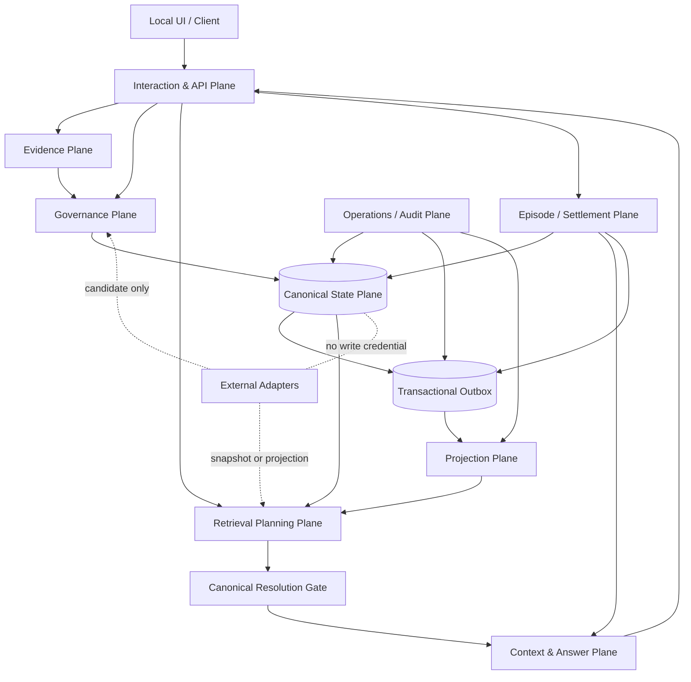
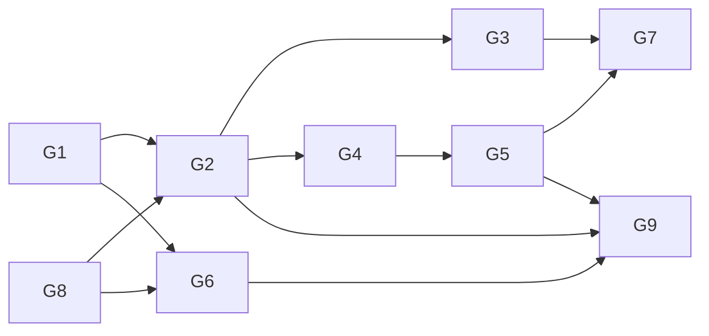
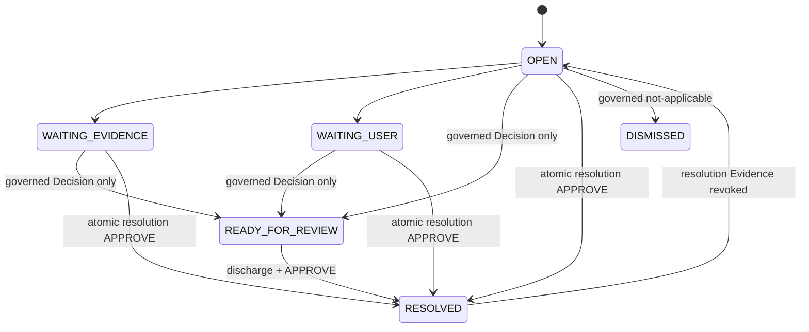
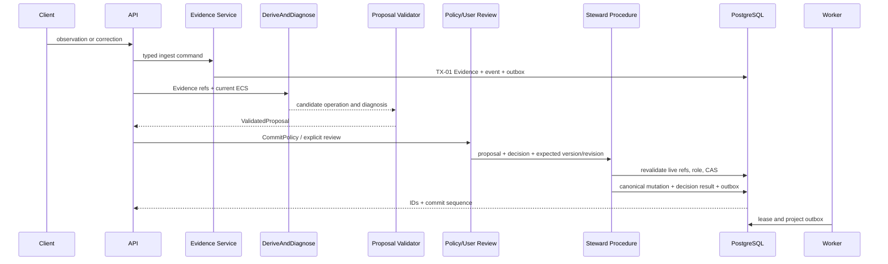

# MiLAi Logical Architecture v1 设计文档

> 文档版本：`1.0.0 FROZEN`  
> 目标架构版本：`MiLAi Logical Architecture 1.0.0`  
> 编制日期：`2026-08-17`（Asia/Shanghai）  
> 设计状态：`FROZEN / AF-09 INDEPENDENTLY ACCEPTED`  
> 当前实现：`0.1.x CANDIDATE`  
> Schema 状态：`0.1.x EXPERIMENTAL`  
> 冻结结论：`LOGICAL ARCHITECTURE FROZEN / NO-GO FOR SCHEMA FREEZE`

---

# 0. 架构决策摘要

MiLAi Logical Architecture 不再被视为等待外部下载的既有产物。本架构由 MiLAi 项目自身设计，
以当前代码、实施合同、已有外部项目和可复现测试为输入，目标是形成一套能够被实现、验证、
演进和最终冻结的上位逻辑架构。

MiLAi 的核心定位是：

> 一个本地优先、Evidence-first、版本化、冲突感知、可治理、可追溯且删除可传播的个人记忆系统。

它不是 ReMe、Hindsight、Graphiti 或 Mem0 的包装层，也不是多个 memory database 的拼装平台。
它们提供可借鉴的局部模式和离线 baseline；MiLAi 自己拥有对象身份、canonical 状态、治理规则、
权限、删除语义和发布门禁。

架构主决策如下：

1. PostgreSQL Canonical Core 是唯一权威状态源；
2. Evidence、belief、未解决问题和请求 Context 是不同对象；
3. 正式状态只能经 Proposal、Decision 和受控 Canonical Procedure 演化；
4. ClaimVersion 与治理历史不可变，当前指针只通过 CAS 移动；
5. 冲突必须保留为 OpenIssue，不能被覆盖、摘要或检索遗漏“解决”；
6. FTS、pgvector、图、外部 memory 和模型输出都只是 candidate；
7. Evidence revoke 先同步 fail closed，再异步清理派生副本与备份义务；
8. authority、confidence、freshness、Scope 和时间彼此正交；
9. 每个 authority-bearing answer 都必须带可回放 lineage 和 RetrievalTrace；
10. 默认物理部署保持模块化单体、单 API、单 worker、单 PostgreSQL 和本地 Blob；
11. 外部项目只能通过无 canonical 写权限的窄接口接入；
12. 本 `1.0.0 FROZEN` 的任何规范变化必须走新版本、兼容策略和独立 review。

Candidate.1 独立评审给出 `REVISE` 与 F01–F10；同一 reviewer 对精确 candidate.2/3/4 继续决定
`REVISE`。Candidate.4 已关闭 F01，并修复 F11 的 exact missing-DeletionRequest 反例，但 reviewer
证明 idempotency、OperationalEvent、revoke Outbox、purge Outbox 的 `created_at` 任一偏移一秒时，
0024/0025 仍重建 APPROVE authority（新 P1 F12）。本 candidate.5 以 ADR-019、corrected
0024/0025、proof-only 0026 与三代 compatibility 时间反例整改。同一 reviewer 对外部 receipt
锚定的精确 candidate.5 全量重放后决定 `ACCEPT`，F01–F12 全部关闭且没有 open P0/P1/P2。
Candidate.1–5 的 review/archive/receipt 均保持不可变；冻结版另行发布于 `architecture/v1.0/`。

## 0.1 “设计、实现、验证、冻结”是四种不同状态

| 状态 | 含义 | 当前结论 |
| --- | --- | --- |
| `DESIGNED` | 对象、边界、不变量、流程和门禁已形成可评审文档 | frozen bundle 已发布 |
| `IMPLEMENTED` | 对应语义在代码、Migration 和 procedure 中存在 | Lean 核心已实现；外部 route 关闭；真实数据 crypto gate 未实现 |
| `VERIFIED` | 正向、负向、并发、权限、故障、恢复测试通过 | AF-00～AF-08 与完整独立重放通过 |
| `FROZEN` | bundle 完整、hash 锁定、crosswalk/ADR 关闭、变更控制生效 | AF-09 ACCEPT；`architecture/v1.0/` |

架构冻结来自精确 candidate chain、机器锁和独立 ACCEPT，不是由 runtime 绿色或本文自我声明。
Runtime 与 Schema 仍分别是 `CANDIDATE` 和 `0.1.x EXPERIMENTAL`。

---

# 1. 设计输入与已有项目

## 1.1 当前 MiLAi 实现基线

```text
Runtime: Flask modular monolith + one worker
Database: PostgreSQL 16 + pgvector
Blob: local content-addressed store
Migration head: 0026_legacy_tx05_time_guard
Durable tables: 32 total / 31 tenant-owned
Runtime typed source checked by mypy: 57 files
Runtime tests: candidate.5 fresh exact-role suite 121 passed; migration foundation 33 passed
Architecture bundle tests: 19 passed
Research tests: 9 passed
```

当前实现已覆盖 Evidence、Claim/Version/Head、Grounding、OpenIssue、Proposal/Decision、
Outbox/Projection、QueryPlan/RetrievalTrace、Context/Chat、Episode/Settlement、删除和备份恢复。
本文以这些实现为可验证候选，不把偶然的表结构或代码组织自动提升为永恒架构。

## 1.2 本地外部资产事实

| 资产 | 本地事实 | 借鉴能力 | 不采纳为 MiLAi 权威语义 |
| --- | --- | --- | --- |
| ReMe | `0.4.1.6`，Apache-2.0，本地快照无 Git 元数据 | memory-as-file、可读 Markdown、渐进 BM25/embedding/wikilink、Component/Job/Step | Auto Memory/Dream 不直接成为 Claim；文件路径不替代 canonical ID |
| Hindsight | MIT，本地多包快照无 Git 元数据 | bank/namespace、retain/recall/reflect、多路召回、RRF/rerank、observability | world/experience/mental model 不自动成为 belief；reflect 只产 candidate |
| Graphiti | `0.29.3`，commit `401c59a65bdeb22a44136901ff30231e6998a7fe`，Apache-2.0 | Episode provenance、实体/关系、双时间、增量构图、hybrid/graph retrieval | graph fact 不是 canonical truth；自动 invalidation 不直接 supersede Claim |
| Mem0 | `2.0.18`，commit `001c235229be8795e3834520467bd0d661ed8f34`，本地有适配修改，Apache-2.0 | provider abstraction、user/session/agent scope、简洁 add/search、本地 Qdrant baseline | memory.add 不能绕过 Proposal/Decision；vector store 不成为权威源 |
| BEAM | commit `3e12035532eb85768f1a7cd779832b650c4b2ef9` | 不同规模长期记忆评测 | benchmark schema 不进入产品 Schema |
| Memora | `1.0.0`，commit `a6493188efc836d6511ed5e4163fe3ba87da30ff` | agent/model memory 任务 | 答案不能回写为事实 |
| LongMemEval / V2 | 本地固定快照 | 长期问答、定位、多模态轨迹 | 数据不默认复制到生产 Blob |
| CUPID / HorizonBench / PAHF | 本地固定快照 | 偏好、长程任务、一致性与幻觉评测 | 单一指标不能决定发布 |

没有 Git 元数据的本地快照必须通过目录 hash、版本文件、license 和环境 lock 固定，不能伪造
upstream commit。

## 1.3 吸收原则

```text
pattern extraction
→ MiLAi-owned typed port
→ isolated adapter
→ read-only snapshot or outbox projection
→ candidate output
→ canonical ID resolution
→ Canonical Gate / governance
→ independent evaluation
```

禁止：

```text
external memory ID → MiLAi Claim ID
external model conclusion → canonical commit
external invalidation → direct ClaimHead movement
external score → authority escalation
external service outage → canonical state unavailable
```

---

# 2. 架构驱动因素

## 2.1 优先级

```text
correctness and safety
→ traceability and reversibility
→ recoverability
→ retrieval quality
→ latency and cost
→ feature breadth
```

平均召回率、模型评分或延迟改善不能抵消 invariant violation。

## 2.2 核心质量属性

| 属性 | 架构要求 | 验证方式 |
| --- | --- | --- |
| 正确性 | 单写者、CAS、append-only、fail closed | 真实 PostgreSQL 并发和负向测试 |
| 可追溯 | Claim/Answer 可回到 Evidence、Decision、Issue、Trace | E2E lineage replay |
| 冲突安全 | 冲突不覆盖，OpenIssue 不被压缩关闭 | conflict→resolve→revoke 用例 |
| 删除安全 | revoke 同步阻断，异步副本可对账 | stale index、purge、backup drill |
| 隔离 | tenant/RLS/role/credential 最小权限 | 真实 login role 测试 |
| 可恢复 | Migration、Outbox、projection、backup 可重放 | base/head round trip 和 restore |
| 可替换 | 模型、embedding、外部 memory 不在 canonical transaction | dependency boundary tests |
| 预算可知 | Context 不够时显式 infeasible/abstain | protected minimum tests |
| 可观测 | reason code、watermark、degraded route 可回放 | trace/operational event tests |

## 2.3 非目标

Logical Architecture v1 不以以下能力作为完成条件：

- 多租户 SaaS、家庭共享或公网远程访问；
- 自动敏感 Profile 推断；
- MemoryIntention scheduler 与自动 Scope Evolution；
- 默认 L2 reconstructive graph route；
- ReMe/Hindsight/Graphiti/Mem0 在线生产依赖；
- 多 autonomous agent 共同治理记忆；
- LoRA 个性化与多模态知识抽取；
- 在目标设备实测前冻结性能 SLA。

---

# 3. 逻辑架构总览



## 3.1 平面职责

| 平面 | 主要输出 | 禁止行为 |
| --- | --- | --- |
| Interaction/API | typed command/query、统一错误 | 信任 body tenant、直接 canonical DML |
| Evidence | EvidenceRecord、Blob、revoke state | 把观察直接当 belief |
| Governance | Proposal、Decision、OpenIssue effect | 模型直接提交 |
| Canonical State | ClaimVersion、Head、transition、grounding/block | 外部网络/模型调用、自由 UPDATE |
| Projection | FTS、vector、delivery、watermark | 决定 truth、authority 或 current |
| Retrieval Planning | QueryPlan、candidates、RetrievalTrace | 保存 query 明文到 durable trace |
| Context/Answer | Capsule、ChatTurn、Answer lineage | 制造 Evidence/Claim、关闭 issue |
| Episode/Settlement | Episode snapshot、governed Settlement | 自动提交 residual Proposal |
| Operations/Audit | recovery、backup、Audit result | Audit 自动修改 production policy |
| External Adapter | candidate、baseline metric | 持有 Steward 凭据 |

## 3.2 物理部署

```text
one Flask API process
one background worker process
one PostgreSQL/pgvector instance
one local content-addressed blob root
optional external LLM/embedding endpoint
isolated offline evaluation processes
```

只有当独立扩缩容、隔离或故障域有测量证据时才拆微服务。v1 不引入 Kafka、分布式事务或多个
在线 memory database。

---

# 4. G1–G9 架构目标

以下 G1–G9 是 MiLAi 项目新设计的 `CANDIDATE` 架构目标；完成第 19 节冻结流程后才能成为
`1.0.0 FROZEN` 目标。

| Gate | 架构目标 | 必须证明 |
| --- | --- | --- |
| G1 | Source Fidelity | 每个 belief 可回到 admissible Evidence；Evidence 身份与来源不被重写 |
| G2 | Governed Canonical Evolution | 所有 Claim/OpenIssue 变化经 Proposal、Decision、procedure、CAS 和 immutable history |
| G3 | Open-State Preservation | 冲突、缺证、Scope/authority 未决保持为有身份、有 branches、有 discharge rule 的 OpenIssue |
| G4 | Applicability Separation | lifecycle、epistemic、freshness、authority、confidence、Scope、valid/system time 正交 |
| G5 | Candidate-Safe Retrieval | 所有非 canonical 结果只是 candidate，必须经统一 ECS/Gate，故障只能降 recall |
| G6 | Revocation Propagation | Evidence revoke 同步阻断 authority，异步清理 projection/blob/backup 可证明 |
| G7 | Bounded Traceable Context | Context 保护 Goal/Constraint/ECS/OpenIssue；回答带 lineage 或 abstain |
| G8 | Least-Privilege Local Security | tenant、RLS、角色、loopback、secret/log privacy 和 remote gate 明确 |
| G9 | Replaceable and Recoverable System | 外部组件可移除；Migration、Outbox、projection、backup 和 audit 可重放 |



---

# 5. 十二条架构不变量

| ID | 不变量 | 违反时 |
| --- | --- | --- |
| I-01 | `EvidenceRecord != ClaimVersion`；观察不等于系统 belief | 阻止 canonical commit/release |
| I-02 | Evidence capture identity、source、observed time、content hash 不可覆盖；重试 key+fingerprint 幂等 | 回滚并报 conflict |
| I-03 | Claim/OpenIssue 正式变化只有 Steward procedure 可写；模型、adapter、API、worker 无 direct DML | 权限测试必须失败 |
| I-04 | ClaimVersion、VersionTransition、StewardDecision、IssueTransition append-only；fresh/populated 创建均有 source-linked sentinel；canonical Issue history 无 NULL governance；invalid legacy row 只进入 immutable non-authoritative quarantine | 原地修改、缺失/伪造 history、NULL governance 或可变 quarantine 阻断升级/发布 |
| I-05 | ClaimHead exact-head CAS，OpenIssue expected-revision CAS；并发只能一个胜者 | loser 全事务回滚 |
| I-06 | CONTRADICT 默认不移动 Head；保留 issue identity、两侧 branch 和 discharge rule | 禁止覆盖或静默关闭 |
| I-07 | EffectiveClaimState 是 current/authority 判定唯一入口 | 返回 abstention 或错误 |
| I-08 | FTS、vector、graph、cache、Context、Summary、LLM、外部 memory 不提升 truth/authority | candidate 必须 Gate |
| I-09 | authority、confidence、freshness、epistemic、Scope、valid/system time 不能互相推导 | 边界校验拒绝 |
| I-10 | revoke 提交即同步 GroundingBlock/Context invalidation；permission/retention unknown fail closed | stale bytes 不可使用 |
| I-11 | tenant-owned row 带 tenant_id；真实角色、RLS、session reset 和最小凭据不可绕过 | cross-tenant 为 P0 |
| I-12 | mutation、Decision、OperationalEvent、Outbox 原子；authority answer 可回放到 Claim/Evidence/Issue/Trace | 无 trace 则 abstain |

---

# 6. 逻辑对象与聚合

本架构不再以“六个对象”限制产品。v1 定义五个权威/治理聚合和四个非权威支持域。
`MemoryIntention` 不是 v1 核心对象，保持 PARKED。

## 6.1 Evidence Aggregate

| 对象 | Identity | 可变部分 | 语义 |
| --- | --- | --- | --- |
| ContentBlob | tenant + content hash + blob ID | physical delete state | 正文存储，不是观察 |
| EvidenceRecord | evidence ID | revoke/retention 生命周期 | 一次独立观察 |
| DeletionRequest | request ID | 分阶段进度 | revoke 与物理传播状态 |

相同内容可以共享同 tenant Blob，但不同观察必须有不同 Evidence ID。

## 6.2 Claim Aggregate

| 对象 | Mutability | 语义 |
| --- | --- | --- |
| Claim | identity immutable | 稳定记忆身份 |
| ClaimVersion | append-only | 一版经治理 belief |
| ClaimHead | exact-head CAS only | 当前版本指针 |
| VersionTransition | append-only | 版本演化原因 |
| GroundingRelation | append-only | Evidence/issue/dependency lineage |
| GroundingBlock | 不物理删除；由后续版本治理 | 使用阻断 |
| EffectiveClaimState | computed | 唯一有效性结果 |

## 6.3 OpenIssue Aggregate

| 对象 | 责任 |
| --- | --- |
| OpenIssue | 稳定 identity、target、type、status、revision、Scope、discharge rule |
| OpenIssueTransition | 每次状态变化的 actor/proposal/decision/evidence/policy 历史 |
| Branch GroundingRelation | SUPPORT、CONTRADICT、RESOLUTION_CANDIDATE Evidence 集 |
| LegacyIssueTransitionQuarantine | 精确保存 candidate.1 invalid row、SHA-256 与 reconciliation links；forced RLS/append-only；不参与 canonical replay/authority |

OpenIssue resolution/reopen 保留同一 issue ID。Populated upgrade 只有在真实
Proposal/Decision/actor/sequence/original Outbox 可证明时才可补 history；TX-05 还要求 immutable
idempotency/Evidence/OperationalEvent 四方链。无法证明即整次 migration 回滚，禁止猜测 authority。

## 6.4 Governance Aggregate

| 对象 | 责任 | 权威性 |
| --- | --- | --- |
| ValidatedProposal | application 内部 typed contract | 非持久 truth |
| OperationProposal | 可回放 mutation 建议与 observed snapshot | 非 canonical |
| CommitPolicyResult | 版本化 policy 判断 | 非正式决定 |
| StewardDecision | APPROVE/REJECT、actor、policy、理由和结果 | append-only governance fact |

## 6.5 Episode Aggregate

| 对象 | 责任 |
| --- | --- |
| Episode | 引用 Evidence/ChatTurn/ContextCapsule 的不可变边界快照 |
| EpisodeSettlement | Steward 批准的结束结论、live issue 和 residual proposal refs |
| EpisodeTransition | capture/settle 的 append-only 历史 |

Settlement 可以过期 Context 和保留 pending Proposal，但不能自动创建 ClaimVersion。

## 6.6 非权威支持域

| 域 | 对象 |
| --- | --- |
| Retrieval | QueryPlan、RetrievalTrace、SearchDocument、SearchEmbedding |
| Context/Answer | ContextCapsule、ContextPointer、ChatTurn |
| Async | OutboxEvent、ProjectionDelivery、IndexWatermark |
| Operations | OperationalEvent、BackupManifest、BackupDeletionObligation、IdempotencyRecord、AuditRecord |

---

# 7. 状态语义

## 7.1 ClaimVersion 正交轴

```text
lifecycle: ACTIVE | SUPERSEDED | ARCHIVED | DELETED
epistemic_status: PROVISIONAL | VERIFIED | CHALLENGED | UNPROVABLE
freshness: CURRENT | STALE
authority: INFORMATIONAL | ACTION_SAFE | USER_CONFIRMED
confidence: bounded support signal; never authority
```

`ACTIVE + CHALLENGED + STALE + INFORMATIONAL` 是合法组合。Head 指向某版本不代表它通过当前 ECS。
V1 创建必须追加 `VersionTransition(CREATE, old_version_id=NULL)`。旧有限状态只允许确定性前向映射：
`RETIRED→ARCHIVED`、`SUPPORTED→VERIFIED`、`WEAKENED→CHALLENGED`、
`UNCERTAIN→PROVISIONAL`、`UNKNOWN→STALE`；任何未知值使整个写事务回滚。

## 7.2 Authority 是匹配关系，不是简单总序

| 请求 | 可接受 Claim authority | 额外要求 |
| --- | --- | --- |
| INFORMATIONAL | 任一 live、可读、Scope/time 匹配 authority | 无 |
| USER_CONFIRMED | 明确 USER_CONFIRMED | live lineage |
| ACTION_SAFE | 明确 ACTION_SAFE | 无 live block/conflict |
| ACTION_SAFE + confirm | ACTION_SAFE | 新鲜 live USER_CONFIRMATION Evidence |

`USER_CONFIRMED` 不自动大于 `ACTION_SAFE`。

## 7.3 Scope 与时间

```yaml
scope_predicate:
  version: "1"
  scope_kind: CONTEXTUAL
  project_ids: []
  task_domains: []
  interaction_modes: []
  exclusions: []
valid_time:
  from: null
  to: null
system_time:
  recorded_at: database timestamp
```

Scope 决定“在哪些条件下适用”；valid time 决定“现实中何时有效”；system time 决定“何时被系统
记录”。三者不能折叠。

## 7.4 OpenIssue 状态机



每条边使用 expected revision CAS 并保存 transition。摘要、时间、向量相似度或 branch 未召回都
不是合法解决事件。Resolution proposal submission 始终 noncanonical：它不移动 Issue status/revision、
不写 grounding、不创建 ClaimVersion。只有 Steward review 的 APPROVE 事务可以原子写新版本、Head
CAS、grounding、`DISCHARGE_APPROVED` transition、Issue resolution、Decision、event 与 outbox；
REJECT 保持 Issue 原状态。Issue 初次创建必须写 `ISSUE_CREATED(NULL, revision 0→1)`。

## 7.5 删除状态

```text
logical_revocation
canonical_block_applied
context_invalidated
derived_purge_pending/running/completed/dead_letter
primary_bytes_retained/erased/shared_reference
backup_expiry_pending/completed
retention_or_legal_hold_blocked
```

`ERASED` 不是 worker 的布尔回报。它必须附 tenant/lease/URI/content hash 绑定的
`ERASED_AND_VERIFIED_ABSENT` 或 `VERIFIED_ALREADY_ABSENT` proof，并由 SQL 独立重算 SHA-256 后
才可完成。

---

# 8. 写入架构

## 8.1 唯一写路径



模型、embedding、外部 memory 和网络调用全部在 canonical transaction 外。

## 8.2 六个 canonical 事务族

| TX | Preconditions | 原子写入 | Fail closed |
| --- | --- | --- | --- |
| TX-01 Evidence Ingest | auth、typed input、idempotency | Blob/Evidence、event、outbox | key/fingerprint conflict |
| TX-02 Claim Create | absence-CAS、live Evidence、APPROVE | Claim、V1、Head、grounding、decision、outbox | identity/version conflict |
| TX-03 Claim Revision | exact expected Head、APPROVE | Vn+1、transition、grounding、Head CAS、outbox | VERSION_CONFLICT |
| TX-04 No Change/Conflict | validated diagnosis | no ClaimVersion；可维护 Issue/branches/decision | Head 不移动 |
| TX-05 Evidence Revoke | Steward auth、live Evidence、typed revoke intent | Proposal、revoke、block、Context invalidation、deletion、Decision、event、purge outbox，同 governance sequence | unknown/任一步失败整体回滚 |
| TX-06 Grounding Restore | 新 Evidence、block、APPROVE、expected Head | 新版本、transition、grounding、governed issue effect | 禁止删 block 复活旧版本 |

Episode 使用独立事务族：

| EP | 行为 |
| --- | --- |
| EP-01 Capture | 校验并冻结 Evidence/ChatTurn/Context refs，幂等写 Episode+transition+outbox |
| EP-02 Settlement | Steward-only、revision CAS、最多三个 residual Proposal、Context 过期、无 Claim 自动提交 |

## 8.3 DeriveAndDiagnose

输入：

```text
immutable Evidence refs
proposed subject/predicate/value
requested Scope/authority
current EffectiveClaimState
live OpenIssues
derivation policy/model/template versions
```

输出必须是 typed `ValidatedProposal`：

```text
relation = CREATE | UPDATE | CONFLICT | NO_CHANGE
precise operation
observed ClaimVersion ID
supporting/contradicting refs
diagnostic reason codes
normalized Scope/time
requested authority
immutable trace
```

它提出关系，不授权 commit。

## 8.4 CommitPolicy

v1 默认保守：

- ACTION_SAFE、敏感内容、冲突、issue discharge、Scope 扩大、authority 提升、删除均需 review；
- 自动提交只有在独立 policy release gate 通过后才可启用；
- 当前 candidate 实现可以固定 `USER_REVIEW`；
- legacy proposal 缺 policy trace 时必须进入 review，不能假定已授权。

---

# 9. 读取与检索架构

## 9.1 QueryPlan

QueryPlan 是版本化、typed、可回放但不含 query 明文的执行合同：

```yaml
planner_version: lean-query-plan-v2
intent: EXACT_CURRENT | HYBRID_SEARCH
entities: [hashed-or-typed-entity]
time_constraint:
  valid_as_of: "2026-08-17T00:00:00+08:00"
  system_as_of: "2026-08-17T00:00:00+08:00"
scope_predicate: {}
required_authority: INFORMATIONAL
required_lifecycle: ACTIVE
accepted_epistemic_statuses: [VERIFIED, PROVISIONAL]
required_freshness: CURRENT
minimum_confidence: 0.0
require_user_confirmation: false
complexity: L0
consistency_mode: EVENTUAL
minimum_outbox_sequence: null
context_budget: 8000
routes: [L0]
```

`time_constraint` 实际保存独立的 `valid_as_of` 和固定 `system_as_of`。可选模型只能解释 query；
最终计划必须经确定性 Schema/route validator，显式校验每个状态轴、confidence 与 bitemporal input。
失败时回退安全 L0/L1。

## 9.2 路线

| Route | 数据源 | 用途 | v1 |
| --- | --- | --- | --- |
| L0 Exact/Current | Claim identity、Head、ECS | 精确实体和当前状态 | 默认启用 |
| L1 Hybrid | metadata/time/scope + FTS + pgvector | 语义/关键词候选 | 默认启用 |
| L2 Reconstructive | version lineage、Episode、可选 graph/shadow | 复杂时间、多跳、冲突重建 | 默认关闭 |

L1 顺序固定：

```text
metadata/time/scope prefilter
→ FTS + pgvector
→ normalize/deduplicate
→ canonical ID/version resolution
→ Canonical Gate
→ Evidence Bundle
```

## 9.3 Canonical Gate

每个 candidate 必须检查：

```text
tenant and subject
permission and retention readability
Evidence revocation
Head or explicitly requested historical version
GroundingBlock
Scope predicate
valid_as_of and fixed system_as_of
required lifecycle
accepted epistemic set
required freshness
minimum confidence threshold
live OpenIssue/conflict
required authority
Evidence lineage
```

未知 ID、跨 tenant、无 lineage、stale version、已撤销或无法判断 retention 的 candidate 拒绝。
每个 decision fact 只来自 axis-complete ECS；Gate 与 Context revalidation 不能复制状态逻辑或绕开
ECS。Confidence 只通过显式阈值，不能补偿任何状态、Scope、time 或 authority mismatch。

## 9.4 一致性模式

| Mode | 行为 |
| --- | --- |
| EVENTUAL | 可用落后 projection；记录 watermark/degraded |
| READ_YOUR_WRITES | 校验服务器从真实 Outbox ID 签发的 tenant-bound token；bounded wait；timeout/dead-letter 走 canonical fallback并持久化 outcome/耗时 |
| CANONICAL_REQUIRED | 当前状态、权限、删除、action-safe 只依赖 canonical |

Canonical store 不可用时，必须返回 `CANONICAL_UNAVAILABLE` 或 abstain。

客户端不能自报 sequence。窄 causal endpoint 将本 tenant 的真实 Outbox IDs 解析为 position，再用独立
`MILAI_CAUSAL_TOKEN_SECRET` 签发 opaque HMAC token；该 secret 不得等于 API Bearer token，API
角色无 Outbox 原表读取权。伪造、错 key、跨 tenant、未来/未知 position 拒绝。等待后若 canonical
snapshot 前进，L1 合并 canonical candidates，同时保持请求最初 `system_as_of` 不变。

---

# 10. Context、Chat 与确认

## 10.1 ContextCapsule 固定分区

```text
[1] ACTIVE GOAL
[2] ACTIVE STATE
[3] OPEN ISSUES
[4] CONSTRAINTS
[5] RETRIEVED EVIDENCE
[6] TRACE POINTERS
```

Goal、硬约束、ECS 和所有 live OpenIssue 是 protected items。每个 issue 至少保留 ID、target、
status、branches 和 discharge rule。

## 10.2 预算规则

```text
B_min =
  Goal/constraints minimum
  + current ECS minimum
  + every live issue identity/branches/discharge
  + required pointers/envelope
```

budget 小于 Bmin 时返回 `CONTEXT_BUDGET_INFEASIBLE` 或 abstain，不得删除 OpenIssue。

## 10.3 Pointer recovery

恢复正文必须重验：

```text
object ID
content hash
tenant and permission
retention
revocation / GroundingBlock
Blob physical state
Capsule TTL/status
```

## 10.4 Traceable Chat

Chat 只能使用 Gate 后 Capsule。ChatTurn/answer 保存：

```text
ClaimVersion refs
Evidence refs
OpenIssue refs
RetrievalTrace ID
ContextCapsule ID
query fingerprint, not raw query
consistency/degraded/abstained status
```

action-sensitive Chat 必须引用五分钟内、新鲜、可读、未撤销且 source/ref/subject/content 匹配的
`USER_CONFIRMATION` Evidence。`CONFIRM_ACTION` 字符串本身没有 authority。

---

# 11. Outbox、Projection 与 Worker

## 11.1 Outbox 原则

Canonical mutation 与 OutboxEvent 必须同事务。Worker 状态机：

```text
PENDING
→ PROCESSING with lease
→ DELIVERED
→ PENDING with bounded retry
→ DEAD_LETTER
```

## 11.2 Watermark

- 每个 projection 有独立 delivery 和 contiguous watermark；
- durable projection 后才推进；
- dead-letter gap 未解决时不得跨越；
- duplicate delivery 使用 outbox ID 或确定性 downstream key 幂等；
- projection rebuild 只删除可重建派生状态，不修改 canonical；
- embedding model/dimension 变化产生新的 projection version。

## 11.3 优先级

```text
permission invalidation / purge
→ grounding-impacting repair
→ normal FTS update
→ normal embedding rebuild
```

Worker 不拥有 Claim/OpenIssue canonical DML 权限。

---

# 12. 删除、备份与恢复

## 12.1 同步与异步边界

TX-05 同步完成：

```text
create typed REVOKE_EVIDENCE Proposal
→
revoke Evidence
→ create GroundingBlock
→ invalidate active Context pointers
→ create deletion state
→ write StewardDecision/event
→ emit purge / re-ground outbox in the same transaction
```

Worker 异步完成 FTS/vector/Context/eligible Blob purge。共享 Blob 有 live Evidence 引用时保留。
eligible Blob 只有在 adapter 执行 lstat、regular-file/hash 验证、unlink、parent fsync 与 absence recheck，
且数据库验证 identity-bound proof 后才进入 `ERASED`；unlink 后 crash 的重试以
`VERIFIED_ALREADY_ABSENT` 完成。

## 12.2 一致性备份

备份要求：

- API/Steward/Worker quiescent；
- repeatable-read exported snapshot；
- PostgreSQL custom dump + 完整 Blob root；
- dump/blob/revision/hash manifest；
- catalog 枚举所有 tenant-owned durable table；
- inventory 配置与 catalog 不完全相等时 fail closed；
- 当前 31 张 tenant-owned 表逐表 count/hash，包括不参与 canonical replay/lineage 的两个 legacy
  quarantine ledger；
- 单 tenant 部署逐表验证；
- 旧备份中的 revoked Blob 通过 deletion obligation 追踪。

## 12.3 恢复

恢复只到新空数据库和空 Blob root。成功条件：

```text
dump and every Blob hash valid
same Alembic revision
same per-table count/hash inventory
same canonical IDs and relations
same GroundingBlock/OpenIssue
same Episode/Settlement
same projection watermark
```

篡改归档必须在恢复前失败。

---

# 13. 安全与信任边界

## 13.1 数据库角色

| Role | 能力 | 明确禁止 |
| --- | --- | --- |
| Migration Owner | DDL、role/grant、migration | 应用常驻使用 |
| API Runtime | Evidence/API 最小读写、允许的查询 | canonical direct DML |
| Steward Executor | EXECUTE 受控 canonical/settlement procedure | 表 ownership、自由 DML |
| Projection Worker | lease Outbox、写 projection/delivery/watermark | Claim/OpenIssue 写入 |
| Audit Runner | 只读 snapshot、backup/audit procedure | production commit |

在线 login 是架构合同，不是部署建议：API、Steward、Worker 分别只能使用 `milai_api`、
`milai_steward`、`milai_worker`。DSN 解析、pool open、ping 与每次借用连接都必须核验
`session_user=current_user=expected role`；superuser、BYPASSRLS、CREATEDB、CREATEROLE、INHERIT、
MiLAi object ownership、owner login 或角色互换全部 fail closed。API 只可执行窄 causal position
function，不能读取 Outbox 原表。

## 13.2 Tenant 与 RLS

- 所有 tenant-owned row 带 `tenant_id`；
- session transaction-scoped 设置 tenant/actor；
- connection pool 归还时清除上下文；
- forced RLS 和真实 login role 负向测试；
- body tenant 与认证 tenant 不同返回 `TENANT_MISMATCH`；
- ID 可猜测不代表可访问。

两个 Legacy quarantine ledger 同样 forced RLS；API/Worker 无权限，Steward/Audit 只读，Migration
Owner 只能在离线 0024/0025 事务 INSERT，UPDATE/DELETE 也由各自 append-only trigger 拒绝；
0026 只锁定并证明既有 source，不写 ledger 或 authority。

## 13.3 默认网络

```text
single local user
single configured tenant
API on loopback
PostgreSQL on loopback
no public Nginx/FRP route
```

公网或远程设备必须先通过 TLS、强认证、session/device revoke、CSRF/CORS/cookie、rate limit、
secret rotation、安全日志、备份和事故处理门禁。

## 13.4 日志隐私

默认只记录 ID、hash、reason code、状态、耗时和短 request fingerprint。禁止记录完整用户消息、
Evidence 正文、Prompt、password、token、cookie 或敏感 Profile 推断。

---

# 14. 故障与降级语义

| 故障 | 允许行为 | 禁止行为 |
| --- | --- | --- |
| Canonical DB unavailable | readiness 失败、authority query abstain/503 | 用 cache/shadow 假装 current |
| Vector unavailable | L0/FTS 继续，标记 degraded | 降低 Gate |
| FTS unavailable | L0/vector 可继续，标记 degraded | projection 结果自判有效 |
| Blob unavailable | identity/metadata 可留，正文/pointer 明确失败 | 返回旧缓存正文 |
| LLM unavailable | Evidence/API/canonical read 可用；proposal generation 延迟 | 空模型结果自动 commit |
| Worker crash | lease 超时重试，watermark 不越 gap | 丢事件或跳过 |
| External adapter unavailable | 移除该 candidate route | 使 Runtime 无法启动 |
| Context budget infeasible | 合法 minimum 或 abstain | 丢 live issue |
| Permission/retention unknown | fail closed | 推定可读 |
| Backup reconciliation failed | 保持 pending、报告 backup ID | 声称已物理删除 |
| Populated migration provenance unknown/conflicting | fresh 0024、candidate.3-compatible 0025 或 candidate.4-compatible 0026 整体回滚并保持各自 prior head，进入人工审计 | 伪造 Decision/sentinel、丢弃 legacy row、强推 revision 或带 NULL governance 继续服务 |

---

# 15. 外部项目接口设计

## 15.1 通用隔离合同

所有 external adapter 必须：

- 使用 MiLAi 生成的只读 export snapshot 或无敏感正文的 Outbox payload；
- 采用独立 namespace、数据目录、凭据和 watermark；
- 输出 typed candidate，包含 external ID、MiLAi source refs、score、adapter version；
- 不持有 Steward/Migration Owner 凭据；
- 不把 external delete/invalidate 直接映射为 canonical mutation；
- 支持 feature flag 完全关闭；
- 关闭后不影响 L0、revoke、backup 或 Runtime startup；
- 在固定 budget、模型、数据和 scorer 下与 PostgreSQL-only baseline 对比。

## 15.2 ContextBackend

```text
input:
  Goal + constraints + Gate-approved ECS/OpenIssues/Evidence + budget
output:
  typed ContextRepresentation + pointers + cost/failure trace
```

| Backend | 用法 |
| --- | --- |
| LocalStructuredContextBackend | v1 默认权威装配器 |
| ReMeContextBaseline | 离线比较 readable file、compaction、recovery、progressive retrieval |

ReMe Auto Memory/Auto Dream 输出只能作为 Proposal candidate 或离线结果。

## 15.3 ShadowMemoryBackend

```text
Episode/Evidence snapshot
→ retain/index
→ recall/reflect
→ RetrievalCandidate or ProposalCandidate
```

Hindsight 用于验证 multi-strategy recall、bank isolation、temporal/graph candidate 和 reflect；
Mem0 用作成熟 add/search provider baseline。两者均不能创建 ClaimHead。

## 15.4 TemporalGraphBackend

```text
ClaimVersion/VersionTransition/Episode export
→ temporal graph projection
→ source-linked candidate paths
→ canonical ID resolution and Gate
```

Graphiti 可用于时间、多跳和 provenance 专项。其自动 fact invalidation 只产生 proposal signal。
相对 PostgreSQL VersionTransition + L1 没有显著、可复现增益时保持关闭。

## 15.5 EvaluationAdapter

| 能力 | Baseline |
| --- | --- |
| 当前事实/冲突 | PostgreSQL L0/L1 |
| conventional memory | Mem0 |
| shadow multi-route | Hindsight |
| temporal multi-hop | VersionTransition vs Graphiti |
| context | raw vs LocalStructured vs ReMe |
| 长期记忆 | BEAM、LongMemEval |
| agent/model memory | Memora |
| 偏好/长程/一致性 | CUPID、HorizonBench、PAHF |

每次 run manifest 记录 snapshot/commit/hash、local patch hash、license、environment lock、模型、
prompt/scorer、seed、budget、cost、failure 和 result hash。

---

# 16. API 与边界合同

## 16.1 Commands

```text
POST /v1/evidence
POST /v1/evidence/{id}/revoke
POST /v1/proposals
POST /v1/proposals/{id}/review
POST /v1/context-capsules
POST /v1/chat
POST /v1/episodes
POST /v1/episodes/{id}/settle
```

## 16.2 Queries

```text
GET  /v1/evidence/{id}
GET  /v1/evidence/{id}/lineage
GET  /v1/claims/{id}
GET  /v1/claims/{id}/versions
GET  /v1/open-issues
GET  /v1/open-issues/{id}
POST /v1/memory/query
GET  /v1/retrieval-traces/{id}
GET  /v1/deletions/{id}
GET  /v1/system/watermarks
GET  /v1/system/degraded-routes
```

## 16.3 统一错误最小集

```text
AUTHENTICATION_REQUIRED
AUTHORIZATION_DENIED
TENANT_MISMATCH
IDEMPOTENCY_CONFLICT
VERSION_CONFLICT
ISSUE_REVISION_CONFLICT
EVIDENCE_REVOKED
GROUNDING_BLOCKED
SCOPE_MISMATCH
SCOPE_TIME_CONFLICT
AUTHORITY_INSUFFICIENT
OPERATION_NOT_ENABLED
CANONICAL_UNAVAILABLE
CONTEXT_BUDGET_INFEASIBLE
PROJECTION_DEGRADED
```

错误响应不得包含 secret、DSN、正文或跨 tenant 存在性信息。

---

# 17. 当前 Runtime 到逻辑架构的映射

## 17.1 模块映射

| Logical plane | 当前实现 |
| --- | --- |
| API | `runtime/src/milai/api/` |
| Domain contracts | `runtime/src/milai/domain/` |
| Governance/application | `application/derivation.py`、`proposals.py` |
| Evidence | `application/evidence.py`、`persistence/evidence_repository.py` |
| Canonical | `persistence/canonical_repository.py` + SQL procedures |
| Retrieval | `query_planner.py`、`retrieval.py`、`retrieval_repository.py` |
| Context/Chat | `context.py`、`chat.py`、`context_repository.py` |
| Episode | `episodes.py`、`episode_repository.py` |
| Projection/Worker | `projection_repository.py`、`workers/main.py` |
| Delete | `deletion.py`、`deletion_repository.py` |
| Operations | `operations/backup.py`、`observability/logging.py` |
| Adapters | `adapters/blob_store.py`、`adapters/embedding.py` |

## 17.2 Migration 映射

| Revision | Architecture capability |
| --- | --- |
| 0001 | Runtime foundation |
| 0002 | roles、tenant context、RLS |
| 0003 | Evidence Plane |
| 0004 | Canonical State Schema |
| 0005 | Canonical Procedures、TX-02/03/04/06 |
| 0006 | revoke、GroundingBlock、deletion |
| 0007 | Outbox、FTS/vector、delivery/watermark |
| 0008 | Retrieval Gate/Trace |
| 0009 | ContextCapsule、ChatTurn |
| 0010 | backup manifest/obligation |
| 0011 | Episode/Settlement |
| 0012 | persisted QueryPlan |
| 0013 | live confirmation Evidence and DB revalidation |
| 0014 | QueryPlan outbox-sequence semantics and historical trace migration |
| 0015 | noncanonical resolution proposal、atomic review、creation history、normative state mapping |
| 0016 | governed TX-05 Proposal/Decision/history/outbox chain |
| 0017 | authoritative axis-complete EffectiveClaimState and Gate |
| 0018 | persistent causal wait position/outcome/duration |
| 0019 | identity-bound Blob erasure proof contract |
| 0020 | narrow causal position API and role grants |
| 0021 | ECS-only Context consumer and erasure digest forward repair |
| 0022 | PostgreSQL built-in SHA-256 erasure verification |
| 0023 | complete deployed-database SHA-256 forward repair |
| 0024 | provenance-first populated governance-history reconciliation、exact legacy quarantine、validated continuous replay |
| 0025 | already-applied candidate.3 provenance guard、rejected grounding quarantine compatibility |
| 0026 | already-applied candidate.4 complete TX-05 transaction-time certification；proof-only compatibility head |

`0015+` 保存治理、删除和隔离证明，属于 forward-only audit evolution；fresh database 从 base 前向到
0026，已部署 candidate.1 也只做前向修复，不用 destructive downgrade 假装可逆。Corrected 0024
在任何写前证明全部 legacy shape、exact Proposal support/relation set 与 actual DeletionRequest 多腿
provenance；exact invalid transition/rejected relation 与 SQL SHA-256 原子移入各自 quarantine，pending
unauthorized effect 只能 POLICY REJECT + CAS reversal，unknown/conflicting fresh input 整体回滚到
0023。0025 对已经执行 candidate.3 0024 的开发库重复相同 proof；失败保持 0024。两者都以
DeletionRequest/Evidence 时间为锚，要求 idempotency、OperationalEvent 与两条 Outbox 的创建时间
完全相等。0026 对已经执行 candidate.4 0025 的开发库进行无写入认证；失败保持 0025。

## 17.3 当前实现状态

| Architecture area | 状态 |
| --- | --- |
| G1–G9 candidate semantics | 已在本文定义 |
| I-01～I-12 runtime coverage | 核心路径已有机器测试 |
| TX-01～TX-06 | Candidate implemented |
| L0/L1/Gate/Trace | Candidate implemented |
| Context/Chat/Episode | Candidate implemented |
| revoke/purge/backup | Candidate implemented |
| external adapters online | 未实现且默认关闭 |
| L2 | 明确禁用 |
| general LLM answer composer | 未实现；当前为 deterministic candidate |
| architecture bundle/validator | Candidate.5 remediation in progress；最终外部 digest lock 待提交 |
| threat/privacy review | Candidate synthetic scope completed |
| real personal data gate | ADR-012 implementation 未完成；DENIED |
| Schema freeze | NO-GO |

---

# 18. Logical Architecture 实现路线

## Phase LA-0 — 设计基线

交付：

- 本文；
- G1–G9、I-01～I-12；
- 对象、角色、事务、读写/删除/故障边界；
- 当前 runtime 和外部资产映射。

退出条件：用户/架构评审接受“MiLAi 自研架构，而不是外部 bundle”的前提。

## Phase LA-1 — 架构 Bundle

目标目录：

```text
architecture/v1.0-candidate/
├── README.md
├── BASELINE.md
├── OBJECTS.md
├── PERMISSIONS.md
├── INVARIANTS.md
├── TRANSACTIONS.md
├── RETRIEVAL_CONTEXT.md
├── DELETION_RECOVERY.md
├── THREAT_MODEL.md
├── FREEZE_REVIEW.md
├── CROSSWALK.md
├── crosswalk.json
├── architecture_manifest.json
├── scripts/
│   ├── validate_bundle.py
│   └── verify_lock.py
└── tests/
```

所有文件从本文拆分，不产生相互冲突的第二套语义。

## Phase LA-2 — Machine-readable Crosswalk

建立：

```text
G/I invariant
→ logical object/operation
→ migration/table/function/role
→ API contract
→ unit/integration/concurrency/security/recovery test
→ report/hash
```

任何 unmapped MUST 使 validator 失败。

## Phase LA-3 — 关闭架构决定

必须形成 ADR：

1. authority 匹配关系；
2. GroundingRelation 逻辑统一、物理拆分策略；
3. OpenIssue revision+transition；
4. canonical/outbox sequence 语义；
5. Blob encryption/key/retention；
6. model/embedding version 和设备 baseline；
7. legacy/real data migration；
8. L2 与 external adapter 的启用门。

## Phase LA-4 — Candidate Validation

要求：

- bundle hash/manifest 自校验；
- empty DB migration round trip；
- populated candidate.1 0014→head provenance/reconciliation and fail-closed migration；
- I-01～I-12 每项至少一条正向和负向证据；
- G1～G9 gate report；
- runtime format/lint/type/full tests；
- E1→E2→E3→revoke E2E；
- backup/revoke/purge/restore drill；
- external dependency/credential isolation；
- threat model 和隐私评审。

## Phase LA-5 — Freeze Review

```text
v1.0-candidate
→ release candidate lock
→ independent review
→ hash-stable bundle
→ MiLAi Logical Architecture 1.0.0 FROZEN
```

Freeze 后任何 G/I/object/permission/transaction 变化必须走新架构版本和 migration policy。

---

# 19. Architecture Freeze Gates

| Gate | 条件 | 当前 |
| --- | --- | --- |
| AF-00 Baseline | 设计输入、版本、license、当前代码事实固定 | PASS_FROZEN |
| AF-01 Objects | 对象身份、owner、mutability、authority 完整 | PASS_FROZEN |
| AF-02 Invariants | G1–G9/I-01～I-12 可机器映射 | PASS_FROZEN |
| AF-03 Permissions | role/grant/RLS/procedure crosswalk 完整 | PASS_FROZEN |
| AF-04 Transactions | TX/EP、CAS、rollback、outbox 原子证据 | PASS_FROZEN |
| AF-05 Retrieval/Context | QueryPlan/Gate/OpenIssue protection/trace | PASS_FROZEN |
| AF-06 Delete/Recovery | fail-closed、purge、backup obligation、restore | PASS_FROZEN |
| AF-07 Isolation | external adapter、model、audit 无 canonical credential | PASS_FROZEN |
| AF-08 Operations | manifest、runbooks、forward repair、privacy | PASS_FROZEN |
| AF-09 Lock Review | bundle validator、manifest hash、ADR closure、独立评审 | ACCEPTED_INDEPENDENT_REVIEW |

Candidate.1–4 的 AF-09 独立决定都是 `REVISE`。Candidate.4 关闭 F01，并确认 F11 的 exact
missing-DeletionRequest 反例已修复，但新增 F12：四个 durable `created_at` 未被证明来自同一 TX-05
事务。Candidate.5 以 ADR-019/corrected 0024–0025/proof-only 0026/直接测试整改；同一 reviewer
对新的外部 submission receipt 标识的精确 bytes 完成 121 项 runtime、三代 F12 对抗和完整门禁，
签署 `ACCEPT`。独立 review SHA-256 为
`8ddf9e8a302b46404319ef2b27d99403f73b4d71127b4483c3b333d27230d1f3`。
Sequence/causality 由 ADR-009/016 与 migrations 0014/0018/0020 关闭；真实个人数据另由 ADR-012
实现门阻断。这不是缺少外部架构文件。

---

# 20. 关键验收场景

## 20.1 Python 版本冲突纵向用例

```text
E1: deployment Evidence says Python 3.11
→ Proposal CREATE
→ review APPROVE
→ M1 V1 ACTION_SAFE
→ L0 accepted trace

E2: pyproject Evidence says >=3.12
→ CONTRADICT
→ same Head V1
→ OpenIssue with both branches
→ L0 rejected OPEN_ISSUE

E3: CI + runtime Evidence say 3.12
→ submit resolution Proposal (Issue remains unchanged/noncanonical)
→ Steward APPROVE with expected Issue revision
→ atomically SUPERSEDE + RESOLVE
→ M1 V2
→ governed resolution
→ L0 accepted trace

revoke E3 runtime Evidence
→ GroundingBlock
→ same issue ID reopens
→ stale projection rejected GROUNDING_BLOCKED
```

## 20.2 Architecture hard failures

```text
Evidence treated as accepted belief without decision
two concurrent revisions both move Head
ClaimVersion or Decision modified in place
conflict automatically overwrites current value
live OpenIssue disappears through compression
projection or external memory raises authority
revoked Evidence remains action-safe
cross-tenant read/write succeeds
canonical unavailable but answer claims certainty
authority-bearing answer has no lineage
outbox gap skipped
backup restore loses a durable tenant table
external adapter possesses Steward credentials
populated upgrade fabricates authority, loses an original row, or leaves NULL governance
legacy quarantine can be changed or used as canonical authority
rejected proposal grounding remains visible through Issue/Context
legacy TX-05 rebuild succeeds without the actual durable DeletionRequest
```

任一项出现即阻止 freeze/release。

---

# 21. 候选决定与实施门

| Decision | 当前候选 | 关闭证据 |
| --- | --- | --- |
| Authority | 非全序匹配矩阵 | ADR-008 + policy tests |
| Grounding physical model | 单逻辑 relation，v1 单表 XOR owner | ADR-004；未来拆分需 migration ADR |
| OpenIssue versioning | revision + append-only transition | ADR-006 + concurrency/history proof |
| Governance/history | submission noncanonical；fresh/populated V1/Issue sentinel；TX-05 governed；invalid transition/rejected grounding exact-hash quarantine；actual DeletionRequest multi-leg + six-timestamp proof；fresh/candidate.3/candidate.4 compat prior-head fail close | ADR-015/017/018/019 + migrations 0015/0016/0024/0025/0026 |
| ECS/Gate | axis-complete ECS 是 Gate/Context 唯一 decision-fact source | ADR-005/015 + migrations 0017/0021 |
| Commit/causal sequences | canonical + outbox 分离；真实 Outbox token + bounded wait | ADR-009/016 + migrations 0014/0018/0020 |
| Physical erasure | SQL-verified identity-bound durable-absence proof | ADR-007/016 + migrations 0019/0021–0023 |
| Runtime DB identity | exact API/Steward/Worker role per connection | ADR-016 + role negative tests |
| Bundle trust | review/release 使用 bundle 外 manifest digest | ADR-011/016 + coordinated-tamper test |
| Blob encryption | ADR-012 envelope/key design；当前 plaintext | implementation + key rotation/recovery drill |
| Model stack | deterministic core；模型只在 adapter | target-device eval |
| L2 | disabled | temporal/multi-hop benchmark gain |
| External memory | offline candidate/baseline | independent go/no-go |
| Real data | forbidden before review | privacy/migration/backup/delete audit |
| Remote access | disabled | independent Remote Access Gate |

---

# 22. Definition of Done

## 22.1 设计文档完成

本文完成意味着：

- Logical Architecture 已有自研 frozen release；
- 现有项目的吸收和隔离边界明确；
- G1–G9、I-01～I-12、对象、状态、事务、权限和门禁可实施；
- 当前 runtime 与目标架构有明确映射；
- bundle/validator/freeze/change-control 路径已执行并锁定。

它只说明设计文档交付；实际 `1.0.0 FROZEN` 另由下节全部门禁、外部 trust anchor 和独立
review 证明。

## 22.2 Logical Architecture 1.0.0 完成

以下条件已经全部成立：

1. accepted `architecture/v1.0-candidate` 与独立 `architecture/v1.0/` release bundle 完整；
2. manifest/hash/lock validator 通过；
3. review/release verification 使用 bundle 外 submission receipt 的 manifest SHA-256；
4. G1–G9 与 I-01～I-12 全部映射到 code/schema/test/report；
5. 对象、角色、procedure、API 无未解释冲突；
6. 架构 ADR 全部关闭或明确推迟且不影响 MUST；
7. fresh migration、并发、RLS、E2E、failure、backup/restore 全部通过；
8. external adapter 和 Audit 无 canonical 写凭据；
9. threat/privacy/delete review 通过；
10. 独立评审已接受变更控制且关闭 F01–F12；
11. bundle hash 锁定并发布为 `1.0.0 FROZEN`。

逻辑架构冻结后，尚未通过的实施与 Schema gates 仍保持：

```text
Schema 0.1.x EXPERIMENTAL
Implementation CANDIDATE
NO-GO FOR SCHEMA FREEZE
```

---

# 23. 下一步

```text
1. 保持 `architecture/v1.0/`、release manifest/archive/receipt 不可变
2. 任何 G/I/object/role/transaction 变化创建新架构版本并重新独立评审
3. Runtime 继续保持 CANDIDATE，直到相应产品 release gate 单独通过
4. Schema 继续保持 0.1.x EXPERIMENTAL，直到真实数据、加密、迁移和 Schema gate 独立通过
5. Remote/public、真实个人数据和外部 adapter 继续默认 DENIED/OFF
```

当前不需要下载新的 memory framework。后续工作应在冻结 G/I 边界内提升产品质量，不得通过扩大
依赖面、投影 authority 或绕过治理来改变已冻结语义。
