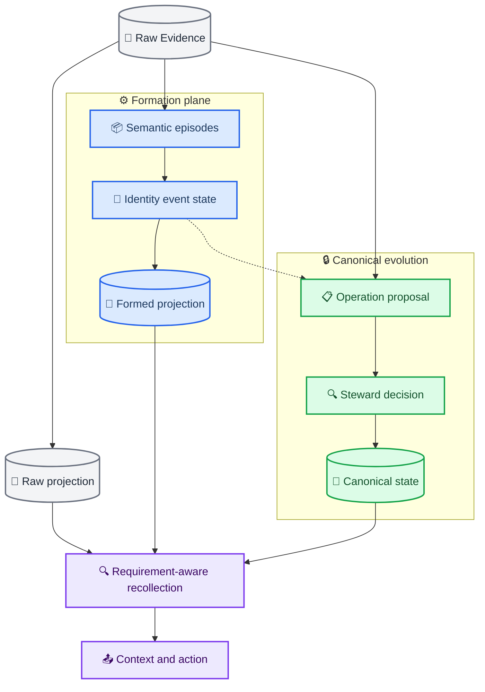
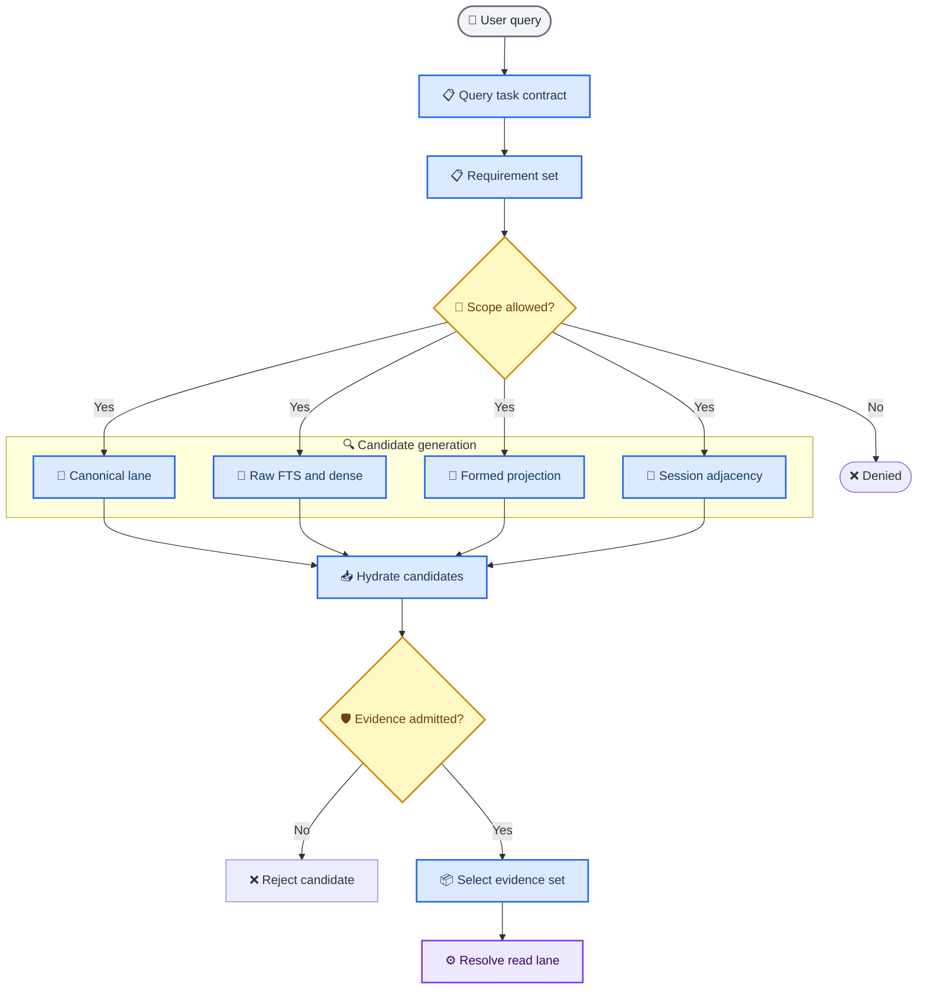
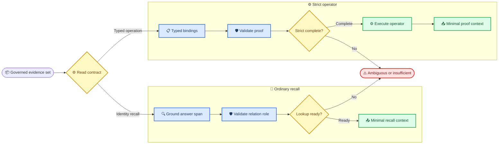
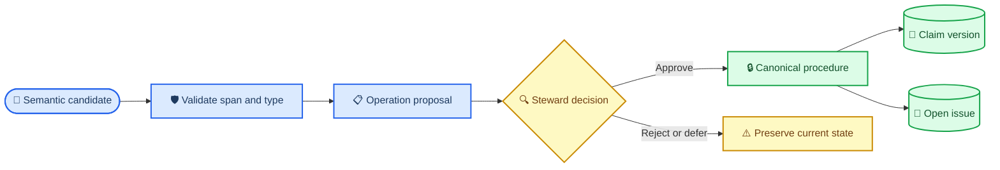
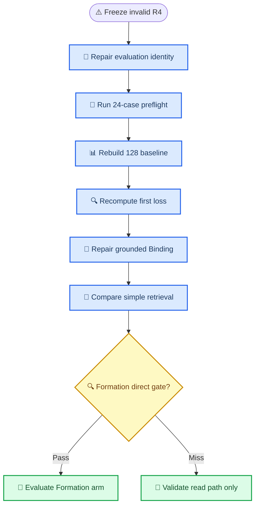

# MiLAi LongMemEval 全切片审计与 Memory 架构重构设计

_基于 2026-08-31 当前代码、LongMemEval 500-case 数据、历史 ML-CLOSURE、ML-R01 R4 与 ML-R02 制品形成的设计 rebase 输入。_

---

## 📋 文档定位与决策摘要

本文档将 LongMemEval 暴露的评测失真、Query IR 误路由、EvidenceSet 覆盖不足、Binding 语义缺口和 Formation 低暴露率，收敛为一套与当前 MiLAi 不变量兼容的目标设计。它冻结 failure model 与设计输入，不取代项目级架构 Master，也不授权任何实验或产品变更。

> 本文档的中心判断：MiLAi 的复杂性放错了位置。普通 recall 被过早的 Event/State 分类和词面规则限制，而真正需要严格的关系角色、EvidenceSet 覆盖、时间完备性和 Reader 可见证据尚未闭合。

立即应采纳的结论：

1. 当前 ML-R01 R4 仅对 pipeline diagnostics 有效，对 semantic QA/Judge 无效
2. `raw_retrieval_trace`、`admitted_evidence_trace` 和 `reader_visible_trace` 必须分离
3. LongMemEval 主体是跨 session 的 EvidenceSet 构造，不是单一 candidate 排序
4. 普通 recall 应使用轻类型但关系正确的 `GroundedAnswerSpanBinding`
5. 严格 operator 才承担 identity、unit、time、dedup 和 completeness proof
6. Formation 必须 query-independent、incremental、grounded、noncanonical 且 Raw-preserving
7. 任何 Query、Binding、hybrid retrieval 或 Formation treatment 前，都必须先恢复评测语义身份
8. 当前无需从零重写 Evidence、Canonical、QueryIR、Acquisition 或 DecisionEngine；应优先修正 identity 传播，并接通已存在但默认关闭的严格路径

文档关系：

| 文档 | 当前 authority | 与本文档的关系 |
| --- | --- | --- |
| `architecture/v1.0` | 冻结逻辑架构 | 不修改，继续最高优先级 |
| `MILA-ML-ARCH@1.0` | Program/Plane 基线 | 本文档提供 rebase 建议，不直接取代 |
| `MILA-ML-MASTER@1.9` | 唯一执行导航 | 需单独修订后才能改变执行顺序 |
| `MILA-ML-R02@0.2` | 当前 successor Goal | 其现有 R4 Answer/Judge 条款需被新基线取代 |
| 本文档 | 已封存的诊断与 rebase 输入 | 固化 failure model 与目标边界，不拥有执行权 |

## 🔍 当前机器事实与可信边界

### 身份锚点

| 对象 | 身份 |
| --- | --- |
| LongMemEval-S cleaned dataset | `d6f21ea9d60a0d56f34a05b609c79c88a451d2ae03597821ea3d5a9678c3a442` |
| Frozen inputs | `7c1c3a61cc81ddf523e8355a02ac2ba9ed4f517fc09cf9609cc7aeaa062fa412` |
| LongMemEval checkout | `9e0b455f4ef0e2ab8f2e582289761153549043fc`，clean |
| ML-R01 R4 context seal | `fa0f9faa3a8525589fc7e22828ccfda21fd57a9ef99156739f0a2e28a2460a3d` |
| ML-R02 Goal source | `7b1c9bcdd6221c8fdfa52b12323f54fce93ee5ff203fe53a76b1510502aca1c3` |
| ML-R02 attempt-004 results | `d6e89f01ce26bc784134368ba67b88a074f7c3815838096ae866d93fa7df4998` |
| Qwen tokenizer | `5f9e4d4901a92b997e463c1f46055088b6cca5ca61a6522d1b9f64c4bb81cb42` |
| Qwen chat template | `e84f32a23fdda27689f868aa4a1a5621f41133e51a48d7f3efcbea2839574259` |
| Reader/Judge backend | `Qwen3.6-35B-A3B-FP8` via local vLLM |
| Source commit anchor | `651099ba8cffc2675961bb9250ba44c158efccb5` |

当前 working tree 包含用户已有修改和未纳入 commit 的 Runtime/evaluation 文件，所以 commit 只是锚点，不是当前全部源码的完整 content identity。真正运行前必须在 run-lock 中封存被触及文件的内容身份。

本文使用三种证据等级：

| 等级 | 含义 |
| --- | --- |
| `SEALED_MACHINE_FACT` | 可由既有 run/artifact 或冻结 dataset 直接重算 |
| `REPRODUCED_AUDIT_OBSERVATION` | 已从源码/contexts 复现，但尚缺独立 analysis script 与 digest seal |
| `TARGET_DESIGN` | 后续目标，不是当前实现或实验结果 |

### LongMemEval 总体形状

| 类型 | 全部 cases | 可回答 | Hard negative |
| --- | ---: | ---: | ---: |
| Single-session user | 70 | 64 | 6 |
| Single-session assistant | 56 | 56 | 0 |
| Multi-session | 133 | 121 | 12 |
| Temporal reasoning | 133 | 127 | 6 |
| Knowledge update | 78 | 72 | 6 |
| Preference | 30 | 30 | 0 |
| 合计 | 500 | 470 | 30 |

470 个可回答 cases 中，300 个需要多个 gold sessions，占 `63.8%`。其中 229 个需要两个 session，71 个需要 3–6 个 session。以上为 `SEALED_MACHINE_FACT`。首尾 session 跨度等进一步后验统计不作为本文规范事实，直至分析脚本和输入身份单独封存。

这意味着系统不能只优化：

```text
query → one best candidate
```

必须优化：

```text
query
→ typed requirements / operands
→ evidence groups distributed across history
→ requirement-level EvidenceSet coverage
→ grounded composition or typed operator
```

### 历史 500-case 的解释限制

`ML-CLOSURE` 中 Raw 只有 15/500 contexts 成功，Candidate 只有 23/500 成功；Candidate Formation 实际应用为 0。Candidate/Raw 分别有 477/485 个 context 或 system failures，两臂各有 27 个 failure 被 Judge 计为 correct。因此历史总 Judge Accuracy `7.0%/6.8%` 不得作为规范分数；它不是 Raw/Formed 语义能力对比，也不能证明 `WrongCOMPLETE=0` 的产品安全能力。

权威制品：

- [ML-CLOSURE 摘要](./var/ml_closure/ml-closure-20260830-001/longmemeval-summary.json)
- [ML-CLOSURE 终态](./var/ml_closure/ml-closure-20260830-001/lifecycle-terminal.json)
- [ML-R01 R4 context seal](./var/ml_repair/ml-r01-20260831-001/checkpoints/r4/context-seal-8.json)

### 当前 R4 的语义无效性

当前 R4 应标记为：

```text
VALID_FOR_PIPELINE_DIAGNOSTICS
INVALID_FOR_SEMANTIC_QA_OR_JUDGE
```

原因是：

1. case-level `subject_id` 被同时写入 `source_context.session_id`
2. 不同原始 session 的 round/turn 编号重复
3. Context compiler 按错误 session identity 分组并配对 speaker neighbor
4. BM25/Dense trace 保留了 Reader 实际未看到的被截断文档
5. 8-case 前缀样本全部是 single-session-user，不代表 500-case 分布
6. R/F 全部走 Raw fallback，Formation 应用为 0/8

制品级复核进一步确认：5/8 product contexts 含跨真实 source session 的邻接污染；Dense 8/8 发生截断，6/8 的 rank-1 session 没有进入实际 context。这些是 `REPRODUCED_AUDIT_OBSERVATION`，仍需封存 analysis script/case manifest 后才能升级为规范机器事实；但源码 identity collapse 已足以否定这些 contexts 的语义比较资格。

### ML-R02 截止状态

截至 audit cutoff，`ml-r02-20260831-004` 已完成用户限定的 8 cases × 4 arms：32 个 Context、Answer 和 Qwen Judge cells 均完成，formal holdout 未打开，128/500 未启动。其机器终态是 `COMPLETE_USER_LIMIT_8X4`，方法判定仍是 `PILOT_ONLY_NO_FORMAL_CANDIDATE_DECISION`。

该 run 修复了 attempt-003 的一 token chat-template accounting mismatch，并复用了冻结 contexts；它没有修复仍可在当前源码中复现的 subject/session identity collapse、Runtime `CandidateEnvelope.session_id` 传播错误或 exact `reader_visible_trace` 缺失。因此其 arm 分数只能作为 delivery/pipeline 诊断，不能升级为新的语义 baseline 或架构效果结论。Formation 报告的 broad-treatment `applied=3/8` 同时记录 `formed_artifact_count=0`，也不能解释为 formed-memory 因果效应。

相关实现：

- [case-level session 折叠](./evals/ml_closure/longmemeval_contexts.py#L141)
- [subject/session 同值写入](./evals/dg15/milai_mcp_adapter.py#L514)
- [Context window 分组](./runtime/src/milai/application/memory_context.py#L1602)
- [speaker neighbor 配对](./runtime/src/milai/application/memory_context.py#L2210)
- [baseline 排序后前缀截断](./evals/paper/adapters/baselines.py#L329)

### 当前 HEAD 已发生但尚未得到新基线验证的变化

当前 [FormationProjectionStore](./runtime/src/milai/application/formation_projection.py#L138) 已从每次 ingest 同步全量 Formation 改为：

```text
observe ingest
→ append/update PendingPartition
→ first eligible query performs one build
→ reuse built partition until source watermark changes
```

这修复了 ML-R02 attempt-002 暴露的同步重建交付问题，但第一次 eligible query 仍对完整 source snapshot 构建 Formation，而不是真正的逐增量 artifact 更新。它仍是 default-off、process-local、noncanonical sidecar，也尚未在修复语义身份后的 untreated LongMemEval baseline 上验证。

### 当前实际生效的 Runtime profile

在没有额外环境覆盖时，当前 repo-local 配置实际执行：

```text
MemoryResolve
→ QueryPlanner / MemoryQueryIR v0.2
→ global + per-requirement Raw FTS
→ Canonical exact / FTS / vector lane
→ SQL 内联 Evidence governance + Canonical Gate
→ legacy-v0.1 Binding
→ 多数 operator 读取 raw candidates
→ DecisionEngine（ORDINARY_RECALL）
→ legacy MemoryContext packing
→ evaluation-owned Reader
```

以下能力已经存在代码，但当前默认路径没有启用：

| 能力 | 当前状态 |
| --- | --- |
| Formation projection | OFF；process-local candidate |
| Evidence Dense | OFF |
| deterministic recovery | OFF |
| type-directed semantic acquisition/Binding | OFF |
| DG-23 whole-unit budget-stable Context | OFF |
| progressive soft Context | OFF |
| MMR | OFF |
| lexical enrichment | `create_app` 未注入，等效 OFF |
| ONNX embedding / cross-encoder reranker | repo-local `.env` 已启用 |

因此，本文的目标设计不能被表述为当前产品行为。现阶段最重要的工程工作是修复 identity 和调用顺序，再以 feature-gated matched evaluation 判断候选路径是否值得启用。

产品 Runtime 当前也没有内置生成式 LLM Reader：`MemoryResolveService` 生成 `MemoryContext`，LongMemEval 由 evaluation harness 调用外部 Qwen Reader；产品 `ChatService` 仍是确定性组合。本文后续的 `Reader` 均指 Context/Reader 边界或评测 Reader，不能误写成已存在的产品内模型服务。

## 🎯 架构 rebase 原则

### 原则一：Raw Evidence 始终是信息底座

Formation、Dense、Summary、Context 和模型输出都只是 Raw Evidence 的派生视图或候选解释。它们可以改善可读性和检索效率，不能替代 Raw、提高 authority 或直接改变 Canonical State。

### 原则二：先理解任务，再生成候选

正确顺序是：

```text
QueryTaskContract
→ RequirementSet
→ scope/permission/capability envelope
→ per-requirement candidate generation
```

不能在 candidate union 之后才临时猜 requirement。

### 原则三：权限是前后两道门

```text
Pre-acquisition scope enforcement
  限制 tenant / project / subject / source partition

Post-hydration Evidence Governance Gate
  验证具体 Evidence 的 access / revocation / retention /
  version / provenance / time
```

前者防止跨 scope 检索、打分和缓存侧信道；后者防止二级索引中的 stale 或无权候选进入语义决策。

### 原则四：优化 EvidenceSet，不只优化单条分数

多 operand、多 session、状态更新与时间任务需要覆盖一组不同证据角色。排序分数只是 EvidenceSet selector 的一个特征。

### 原则五：轻类型 recall 与强类型 operator 分离

普通文本回忆不必建立完整 Event/State ontology，但仍必须有 grounded span、subject、relation 和 source-role 校验。COUNT、STATE_DIFF、ORDER 和范围完备性则使用强类型 Binding 和 proof。

### 原则六：Canonical State 是独立 authority lane

Raw Evidence、Formation artifacts 和 Canonical State 可以在 Recollection 中同时供应候选，但只有 Canonical Procedure 可以创建 `ClaimVersion` 或改变 `OpenIssue`。

### 原则七：模型可以理解，Runtime 必须治理

模型可以参与 query interpretation、证据语义判断和排序，但只能输出 proposal。Runtime 负责身份、权限、参数上限、grounding 验证、Binding、Sufficiency 和 Canonical commit。

### 原则八：少量强不变量，大范围可替换策略

不变量限于：

- 权限与 revocation 不可绕过
- Evidence/Canonical identity 不可伪造
- 模型输出不直接成为 Claim 或 COMPLETE
- Reader 必须只看到 trace 实际宣称的证据
- 新证据必须重新运行对应的语义决策

通道排序、语义抽取、候选融合和上下文组装都是可替换策略，不应通过大量 fail-closed 分支被固化为 domain invariant。

## 🏗️ 目标 Memory Lifecycle 架构

### Program 与 Plane

MiLAi 继续使用三个 Program：

| Program | 职责 | 权威边界 |
| --- | --- | --- |
| Memory Formation | 构造 episode、identity、event-time、state/change 候选 | noncanonical derivation |
| Memory Evolution | 治理更新、冲突、撤销、版本和回放 | sole canonical evolution |
| Memory Recollection | 按 query 获取、组合和使用记忆 | query-local read |

五个 Plane 仍为 Evidence、Formation、Canonical Evolution、Recollection 和 Context/Action。修正的完整 DAG 如下。



### 三个读取来源的 authority

| Lane | 内容 | 能做什么 | 不能做什么 |
| --- | --- | --- | --- |
| Raw | Evidence、turn、artifact source | 承载原始信息和回放 | 直接成为 belief |
| Formed | episode、entity/event/time/state candidate | 优化表示、聚合和候选发现 | 证明缺失或完备 |
| Canonical | ClaimHead、ClaimVersion、OpenIssue | 提供当前/as-of/versioned 状态 | 绕过 Evidence lineage |

## 📚 QueryTaskContract 与 Requirement 模型

### 组合式 Query 合同

当前 `MemoryQueryIR v0.2` 已经拆出 route、operator、answer shape、requirements、source role 和 temporal constraint；这部分应保留。目标合同是在其上补齐 `answer_intent`、`evidence_topology`、显式 `proof_obligations` 和顶层 `output_type`，而不是另起一套平行 IR。

完善后的 Query 表示不使用一个互相重叠的 task enum，而是使用正交轴组合：

```yaml
QueryTaskContract:
  contract_version:
  query_identity:
  reference_time:

  answer_intent:
    FACTUAL_RECALL
    MEMORY_CONDITIONED_RECOMMENDATION
    STATE_RESOLUTION
    STATE_CHANGE_EXPLANATION

  operator:
    IDENTITY
    COLLECT_SET
    COUNT
    SUM
    AVERAGE
    DIFFERENCE
    RATIO
    ARGMAX
    ORDER
    DURATION
    STATE_AS_OF
    STATE_DIFF

  source_roles:
    - USER
    - ASSISTANT
    - TOOL
    - ARTIFACT

  evidence_topology:
    SINGLE_ITEM
    MULTI_OPERAND
    SET_MEMBERS
    VERSION_CHAIN
    CONFLICT_SET

  temporal_contract:
    NONE
    POINT
    RANGE
    RELATION
    CURRENT
    AS_OF

  output_type:
    TEXT
    NUMBER
    DURATION
    DATE_TIME
    ENTITY
    ORDERED_SET
    RECOMMENDATION

  proof_obligations: []
  scope_contract:
  capability_envelope_digest:
```

`ASSISTANT_ANSWER_RECALL` 不再是 operator。它表示为：

```yaml
answer_intent: FACTUAL_RECALL
operator: IDENTITY
source_roles: [ASSISTANT]
evidence_topology: SINGLE_ITEM
output_type: TEXT
```

`ABSTENTION_CHECK` 不是 query task。Abstention 是经过 acquisition、Binding 和 readiness/sufficiency 之后的决策结果。

### RequirementSet

Compiler 把 QueryTaskContract 展开为 evidence-role 级别的 requirements：

```yaml
Requirement:
  requirement_id:
  role:
  required: true
  subject_constraints: []
  relation_constraints: []
  value_contract:
  source_roles: []
  temporal_contract:
  cardinality:
  distinct_identity_contract:
  compatibility_group:
  proof_obligations: []
```

代表性展开：

| Query 形状 | Requirement roles |
| --- | --- |
| Difference | left value、right value、unit/time compatibility |
| State change | old state、new state、transition evidence |
| Temporal order | each event、each occurrence time、ordering |
| Count distinct | event members、event identity、dedup、range closure |
| Recommendation | current preference/constraint、candidate fit、conflict |

### 解释器边界

当前 [MemoryQueryCompiler](./runtime/src/milai/application/memory_query.py#L396) 仍由 deterministic regex 语义分支主导。一次全量源码审计得到 121/500 直接编译为 `AMBIGUOUS`；该数字当前属于 `REPRODUCED_AUDIT_OBSERVATION`，在 analysis script seal 前不作为门禁。即使封存，它也只表示可执行失败下界，不包含已编译但 operator 语义错误的 cases。

目标边界为：

```text
deterministic exact recognizers
+ optional model semantic proposals
→ N-best QueryTaskContract candidates
→ Runtime type/scope validation
→ one executable contract or explicit unresolved state
```

模型不直接产生 SQL、channel call、COMPLETE 或 Canonical mutation。

## 🔍 Recollection、Binding 与决策路径

### Query-time 完整流程

当前代码已经做到 QueryIR 先于 acquisition，也已经在 Evidence SQL 与 Canonical lane 内实施 live governance。下图是对现有顺序的语义精化：把 scope enforcement 和 post-hydration admission 变成可审计边界，而不是声称当前完全没有 Gate。



### Candidate generation 与融合

首轮使用小而可解释的通道集：

```text
Canonical exact/as-of/version
Raw turn/local-window FTS
Dense retrieval
real session adjacency
eligible Formation projection
```

各通道保留独立 quota，再进行 rank-based fusion 和 identity dedup。不先使用单一 global score 剪掉某个 requirement 唯一的候选。

当前 Acquisition 已有 per-requirement probes、quota-preserving RRF、capability 约束和 identity dedup。真正缺少的是从“probe/slot 命中”升级为“operand/evidence-role 覆盖”的语义 EvidenceSet selector；因此不应重写 official executor。

`SAME_EPISODE` 在当前 [EvidenceAcquisitionExecutor](./runtime/src/milai/application/evidence_acquisition.py#L434) 中仍明确为未实现，不得把它写入当前可执行 CapabilitySet。

### 三级 trace

Evidence 搜索、邻接和 hydration 已在 SQL 中检查 tenant、as-of、revocation、retention 与 readability；Canonical lane 也有显式 Gate。当前缺口是这些判断没有形成统一、独立、可重放的 post-hydration Evidence admission trace。

```yaml
raw_retrieval_trace:
  occurrences:
    - channel:
      channel_rank:
      raw_score:
      evidence_identity:

admitted_evidence_trace:
  selector_identity:
  admitted_units:
    - evidence_identity:
      requirement_roles: []
      token_cost:

reader_visible_trace:
  tokenizer_identity:
  chat_template_digest:
  rendered_units:
    - evidence_identity:
      serialized_offset:
      token_start:
      token_end:
```

指标归属：

| Trace | 可计算指标 |
| --- | --- |
| Raw retrieval | ChannelRecall、FirstGoldRank、CandidatePoolCoverage |
| Admitted evidence | RequirementRoleCoverage、hydration/admission cost |
| Reader visible | GoldSpanCoverage、QA attribution、Reader regression |

### EvidenceSet 选择

选择目标不是得分最高的 `k` 条，而是在预算内覆盖 requirements：

```text
maximize
  required-role coverage
  + source/time compatibility
  + answer-bearing span likelihood
  + diversity/new-region value
  - redundancy
  - token/hydration cost
```

排序模型只提供相关性特征，不自动产生 Binding。

### 两条决策 lane



Ordinary lane 的最小绑定：

```yaml
GroundedAnswerSpanBinding:
  requirement_id:
  evidence_id:
  grounded_span:
  normalized_answer_value:
  subject:
  relation:
  role_bindings:
  source_role:
  temporal_applicability:
  ambiguity_reasons: []
```

状态分开：

```text
LookupReadiness:
  READY | AMBIGUOUS | INSUFFICIENT | DENIED

StrictSufficiency:
  COMPLETE | UNDER_COVERED | COMPLETENESS_PROOF_MISSING |
  CONTESTED | DENIED
```

`COMPLETE` 只属于 strict lane 的唯一决策所有者。Ordinary recall 使用 `LookupReadiness`，避免 Context、DecisionBoundary 和 DecisionEngine 同时维护不一致的完成状态。

当前 `DecisionEngine` 已经是唯一最终 `COMPLETE` owner，这一不变量应保留。缺口不是再建一个新的完成控制器，而是：所有产品调用仍使用 `ORDINARY_RECALL`，`STRICT_OPERATOR` 尚未真正接通；多数 operator 还在最终 decision 之前读取 raw candidates。目标实现应在同一个 `DecisionEngine` 下接入 lookup/strict 两种 profile，并要求 strict operator 只消费已验证 Binding。

### Binding 指标正名

| 指标 | 定义 |
| --- | --- |
| `AcceptedReferenceIntegrity` | ID、span、version、scope 和 provenance 真实合法 |
| `SemanticBindingPrecision` | subject/predicate/role/value/time 真正支持 requirement |
| `SemanticBindingRecall` | 所需 evidence roles 中已形成有效 Binding 的比例 |

当前 `AcceptedBindingV02` 只封存 candidate/evidence/requirement/interpretation/span 身份，见 [DecisionBoundary finalize](./runtime/src/milai/application/decision_boundary.py#L552)。它不能单独证明 dad/sister、uncle/niece 这类关系语义正确。

此外，当前默认 `type_directed_semantics=false`，普通路径走 `legacy-v0.1` profile，predicate/source/role compatibility 多为 `NOT_APPLICABLE`。v0.2 多轴 Binding scaffold 已存在，但尚不能被写成当前正式语义精度能力。

## 💾 Formation、Evolution 与 Canonical 边界

### Formation 的最小产品语义

Formation 是对 Raw Evidence 的可重建语义投影，不是第二个 Memory truth store。

```text
Raw Evidence append
→ asynchronous or lazy incremental formation
→ grounded semantic artifacts
→ per-projection watermark
→ query-time optional formed lane
→ Raw fallback when absent, partial or stale
```

最小 artifacts：

| Artifact | 用途 | 必要 lineage |
| --- | --- | --- |
| SemanticEpisode | 保留语义局部性和 session 边界 | source spans、session identity |
| EntityIdentityCandidate | alias/identity 发现 | mention spans、merge/split history |
| EventOccurrenceCandidate | 事件、参与者和 occurrence time | event spans、time uncertainty |
| StateAssertionCandidate | 主体属性/状态候选 | grounded value span |
| StateTransitionCandidate | correction/update/revoke/constraint | old/new support、valid time |

当前 [MemoryFormationBundleV01](./runtime/src/milai/domain/memory_formation.py#L67) 已实现 Raw coverage、lineage closure 和 rebuildable bundle；[FormationEngine](./runtime/src/milai/application/formation_engine.py#L29) 已统一 episode 与 generalized sidecar 构建入口。但当前 generalized semantics 仍主要依赖英文 pattern，且 product LongMemEval 中尚未形成足够 treatment exposure。

### Formation 暴露漏斗

正式评估必须记录：

```text
EvidenceEligible
→ ArtifactEmitted
→ SpanGrounded
→ QueryMatched
→ Selected
→ BindingContributed
→ AnswerOrOperatorContributed
```

`partition exists` 不等于 Formation eligible，`selected_sources > 0` 不等于已形成语义贡献。正式主效应以 intention-to-treat 报告，applied subset 仅作诊断。

### Evolution Bridge

Formation artifact 对 Canonical State 只能产生建议：



继续复用：

```text
OperationProposal
→ StewardDecision
→ Canonical Procedure
→ ClaimVersion / ClaimHead / OpenIssue
```

不引入平行 canonical store，不允许 retrieval success 或 Reader answer 自动 promotion。

## ⚡ 效率、预算与最小防御面

### Simple-first 路线

默认读路径保持小而稳定：

```text
typed query contract
→ canonical exact when applicable
→ one FTS/Dense/adjacency acquisition phase
→ per-channel small quotas
→ requirement-aware EvidenceSet
→ one Reader call or one typed operator
```

只有证明以下全部条件时，才考虑 observation-conditioned 第二轮：

```text
unresolved requirement
+ new observation provides a new semantic cue
+ unused admissible action exists
+ official oracle shows second-round opportunity
```

不用自由 Planner、多轮 ReAct 或 graph expansion 替代首轮基础覆盖。

### Token 预算

`1024` tokens 只作为低预算效率轨，不再作为唯一 LongMemEval 正确性预算。

正式容量轨使用：

```text
reader_model_context_limit
- system prompt tokens
- query tokens
- chat template overhead
- answer reserve
- safety reserve
= reader evidence-token ceiling
```

所有 arms 必须使用同一 exact Qwen tokenizer、chat template 和 Reader envelope。Context 按完整 evidence/local-window unit 接纳，不使用 UTF-8 bytes/3 作为正式计费或用前缀截断切断原子单元。

建议报告三个预算点：

| 轨道 | 用途 |
| --- | --- |
| 1024 | 紧凑效率压力轨 |
| 4096 | 中等实用轨 |
| Official-style capacity | 外部正确性轨 |

### 最小强不变量

为减少防御性编程，开发期只保留六个跨组件硬门：

```text
1. scope/session/source identity 真实
2. access/revocation 不泄漏
3. Reader-visible trace 与真实序列化内容一致
4. ordinary recall 有 grounded relation binding
5. strict COMPLETE 由唯一边界且 proof 闭合
6. 没有 retrieval/Reader/model 直接 Canonical mutation
```

其余检查优先放入观测性 trace、targeted unit test 或开发报告，不在每一层再造一个重复 fail-closed 状态机。

### 失败处理

```text
attempt failure
→ classify infrastructure / protocol / semantic / safety
→ minimal generalized repair
→ targeted fixtures
→ one representative context-only canary
→ repaired untreated baseline
→ matched treatment
```

单次 protocol 或 implementation 失败不终止整个 Program。只有实际 authority 泄漏、未授权 Evidence 损失、失控 Canonical mutation 或数据损坏才终止当次路线。

## 🧪 Evaluation architecture 与 successor rebase

### ML-EVAL-00：评测语义身份修复

任何新 effect 前需要一个独立的 evaluation-correctness successor：

```text
stable original session identity
+ session-scoped unique turn/round identity
+ whole-unit rank-first admission
+ exact reader-visible trace
+ exact tokenizer/template accounting
+ infrastructure failure separated from semantic abstention
```

最小完成条件：

| 指标 | 门禁 |
| --- | ---: |
| SessionIdentityIntegrity | 1.0 |
| CrossSourceSessionAdjacencyExpansion | 0 |
| ReaderVisibleTraceExactness | 1.0 |
| ContextSerializationReplayEquivalence | 1.0 |
| SystemFailureAsSemanticAbstention | 0 |
| ReaderCallsDuringContextPreflight | 0 |

当前 R4 artifacts 保留不覆盖。修复 session/packing/tokenizer 后必须使用新 run identity 重建 untreated baseline，旧 contexts 不得 resume。

Identity 修复不能只改 LongMemEval adapter。当前还存在两处 Runtime 传播错误：

- `CandidateEnvelope.session_id` 在 acquisition 路径中取了 `subject_id`
- `EvidenceReferenceNote` 错误要求 `source.subject_id == span.session_id`，异常随后被 retrieval 调用方吞掉

因此 ML-EVAL-00 的 P0 修复面应覆盖 adapter、CandidateEnvelope、reference-note 校验和 Context 分组，并以真实 source session identity 做端到端 replay。Evidence/PostgreSQL schema 本身已经正确分离 `subject_id`、`session_id`、`turn_id` 和 `round_id`，无需为此修改数据库。

### 评估楼梯



24-case preflight 准确命名为 `outcome-blind, metadata-stratified`，不称 label-free。可以使用 capability class、answerable flag、gold evidence count 和 session topology 建立覆盖矩阵，不能使用当前系统是否答对、treatment 是否恢复、gold lexical terms 或 treatment rank。

### Repaired baseline 后的最小对比

| Arm | 方法 | 作用 |
| --- | --- | --- |
| P | repaired current product route | 无 treatment 对照 |
| A | turn/local-window BM25 | sparse baseline |
| B | Dense | semantic baseline |
| C | BM25 + Dense quota union | simple multi-channel |
| D | C + governed adjacency | structural context |
| E | D + eligible Formation sidecar | lifecycle treatment |

P–D 的 matched ceilings：

```text
max raw candidates per channel
max fused candidates before hydration
max hydrated evidence units
max admitted units
Reader evidence-token ceiling
official retrieval call ceiling
same timeout and retry policy
```

报告每层实际数量：

```text
scanned
→ retrieval occurrences
→ unique evidence candidates
→ hydrated
→ admitted
→ reader visible
```

E arm 只在 direct Formation gate 通过后进入。`formation_applied > 0` 不是充分门禁；必须预注册最低 eligible case count、artifact recall/precision、span grounding、query-match funnel 和 E/D 实际差异。

### 两种 500-case 结论

| 运行 | 前置 | 允许结论 |
| --- | --- | --- |
| Read-path 500 | evaluation identity、Binding、P–D 通过 | `PASS_READ_PATH_VALIDATION` |
| Lifecycle A–E 500 | 额外通过 Formation fidelity/exposure/freshness | Formation substrate / representation×retrieval |

Reader 和 Judge 统一使用本地 vLLM Qwen。指标应命名为 `QwenJudgeAccuracy`，不声称 GPT-4o 或官方 leaderboard 等价。

## 📍 当前代码对齐与修改边界

### 代码映射

| 组件 | 当前实现状态 | 当前缺口 | 目标修改 |
| --- | --- | --- | --- |
| Evidence | schema 与受治理 ingest 已实现 | adapter/CandidateEnvelope/reference-note 消费 identity 错误 | 修传播与 replay，不改 schema |
| Canonical | Proposal、Steward、ClaimVersion/OpenIssue 与 read lane 已实现 | Formation bridge 仅 eval/test | 保持唯一写链，单独验证 bridge |
| Query compiler | MemoryQueryIR v0.2 部分正交、规则密集 | 全量审计发现大量 AMBIGUOUS；普通 lookup 过度 Event 化 | 渐进补齐组合式合同 |
| Acquisition | IR-first、official executor、per-requirement probes、quota/RRF 已实现 | Dense/严格路径默认 OFF；缺语义 EvidenceSet selector；`SAME_EPISODE` 未实现 | 复用 executor，补 role coverage selection |
| Governance Gate | Evidence SQL live checks 与 Canonical Gate 已实现 | 缺统一 post-hydration admission artifact/trace | 双阶段可审计合同 |
| Interpretation/Binding | exact span 和 v0.2 多轴 scaffold 已实现 | 默认 legacy profile，relation role 未闭合 | Grounded lookup + strict typed profiles |
| Decision/Operator | `DecisionEngine` 是唯一 COMPLETE owner | strict mode 无产品调用；多数 operator 先读 raw candidate | 同 owner 下接双 profile，strict 只读 Binding |
| Context | DG-23 whole-unit plan/render 已实现为候选 | 默认 legacy 字符截断；无 exact tokenizer/visible offsets | 启用前先修 identity 与精确 trace |
| Formation | Bundle、Engine、lazy process-local projection | default OFF；query 时全 snapshot 构建；英文 pattern 窄 | grounded、真正增量 sidecar |
| Evaluation | BM25/Dense/product arms 与部分 raw scaffold | selected refs 不等于 exact visible spans | ML-EVAL-00 + repaired baseline |

### 当前实现判定

| 判定 | 内容 |
| --- | --- |
| 已实现，应保留 | Evidence/Canonical 基础模型与事务；可分离的 subject/source-session schema；IR-before-acquisition；per-requirement plan 与 quota fusion；SQL live governance；Canonical read/write lane；唯一 DecisionEngine owner；exact span、DecisionSnapshot、atomic Reader-plan 合同主体 |
| 候选，默认未启用 | Formation projection；type-directed v0.2 Binding；deterministic recovery；Evidence Dense；SemanticHint；DG-23 atomic Context；Formation→Evolution bridge；binding-backed operator 子集 |
| 缺失或 P0 | identity 端到端传播；组合式 QueryTaskContract；relation-correct lookup Binding；两个 readiness profile 的真实调用；strict operator Binding-only 顺序；语义 EvidenceSet selector；真正增量 Formation；三层 trace；exact tokenizer/template envelope 与 visible offsets |

### 需在上位文档中显式采纳的修订

本文档不直接改写执行权威。若采纳本设计，需要单独修订：

| 文档 | 必要修订 |
| --- | --- |
| `MILA-ML-ARCH` | 增加 QueryTaskContract、双 Gate、Canonical read lane、ordinary/strict 分层 |
| `MILA-ML-MASTER` | 将当前 R4 标记为 semantic-invalid，将 ML-EVAL-00 置于任何 effect 之前 |
| `MILA-ML-R02` | 取消对旧 32 contexts 的 resume，禁止当前 Answer/Judge，拆分 read-path/lifecycle 500 gate |
| Program C | 将 reference integrity 与 semantic Binding precision 分开 |
| Program A | 增加 Formation exposure/funnel 和 query-independent entry gate |

### 非目标

本次 rebase 不授权：

- 修改 `architecture/v1.0` 冻结对象或事务
- 新建平行 Canonical store
- 让 Reader、retrieval 或 Formation 直接提交 Claim
- 启用自由 action planner 或无界 multi-round refinding
- 因一个 benchmark case 添加 case-ID/gold-aware 规则
- 把 1024-token 效率轨宣称为官方外部成绩
- 消费 formal holdout
- 修改 public MCP/PostgreSQL schema 或产品默认 flag

## 🔗 采纳条件与证据索引

### 采纳步骤

本文档已以 `PASS_LONGMEMEVAL_FAILURE_MODEL_LOCALIZED` 封存诊断结论，但只能在以下事实完成后被上位架构和执行文档分别采纳：

1. 确认它不改写 `architecture/v1.0` 的对象、事务、权限和删除不变量
2. 在 `MILA-ML-ARCH` 中只采纳稳定的架构边界
3. 在 `MILA-ML-MASTER` 中单独更新动态执行顺序
4. 以新 run identity 实施 ML-EVAL-00，不复用旧 contexts
5. 根据 repaired untreated baseline 重新决定 Query/Binding/Retrieval/Formation treatment

文档自身终态为：

```text
PASS_LONGMEMEVAL_FAILURE_MODEL_LOCALIZED
```

它表示 failure model 已定位，不表示 treatment 已实施、评测已修复或 Memory Lifecycle 已通过。

### 本地证据

- [LongMemEval-S cleaned dataset](../benchmarks/LongMemEval/data/longmemeval_s_cleaned.json)
- [Memory Lifecycle 项目架构](./MiLAi_Memory_Lifecycle_项目级架构与主程序_MASTER.md)
- [Memory Lifecycle 执行 Master](./MiLAi_Memory_Lifecycle_总_GOALS.md)
- [ML-R02 Goal](./MiLAi_ML-R02_统一MemoryLifecycle架构收敛与LongMemEval验证_GOALS.md)
- [LongMemEval frozen inputs](./var/dg11/paper/freeze/longmemeval-full-inputs.json)
- [LongMemEval historical results](./var/ml_closure/ml-closure-20260830-001/longmemeval-results.jsonl)
- [ML-R01 R4 capability seal](./var/ml_repair/ml-r01-20260831-001/checkpoints/r4/capability-identity-seal.json)
- [ML-R02 attempt-001 delivery failure](./var/ml_r02/ml-r02-20260831-001/repair-required.json)
- [ML-R02 attempt-002 delivery failure](./var/ml_r02/ml-r02-20260831-002/repair-required.json)
- [ML-R02 attempt-003 token-accounting failure](./var/ml_r02/ml-r02-20260831-003/repair-required.json)
- [ML-R02 attempt-004 pilot results](./var/ml_r02/ml-r02-20260831-004/results.json)
- [ML-R02 attempt-004 terminal](./var/ml_r02/ml-r02-20260831-004/terminal.json)
- [Query compiler](./runtime/src/milai/application/memory_query.py)
- [Evidence acquisition](./runtime/src/milai/application/evidence_acquisition.py)
- [Decision boundary](./runtime/src/milai/application/decision_boundary.py)
- [Decision engine](./runtime/src/milai/application/decision_engine.py)
- [Memory context compiler](./runtime/src/milai/application/memory_context.py)
- [Formation engine](./runtime/src/milai/application/formation_engine.py)
- [Formation projection](./runtime/src/milai/application/formation_projection.py)

### 文档质量检查

- [x] 仅有一个 H1
- [x] Mermaid 包含 `accTitle` 和 `accDescr`
- [x] 不使用 inline style 或 theme directive
- [x] 本地证据路径存在
- [x] 不宣称修改 frozen architecture
- [x] 不把诊断数字写成产品效果
- [x] 不把 current HEAD 候选修复写成已验证能力

---

_Maintained as an architecture rebase input. Execution authority remains with `MILA-ML-MASTER` until separately revised._
