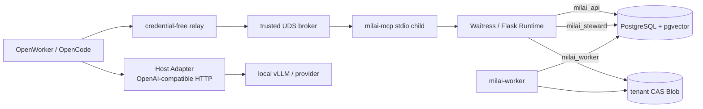
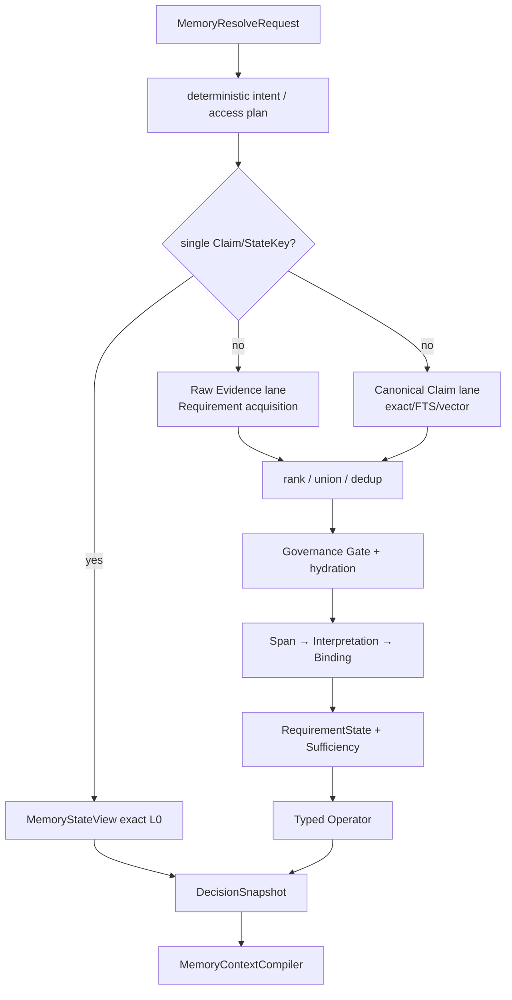

# MiLAi 全代码结构与 Memory Lifecycle 实现对齐报告

> 审计时间：2026-08-31 13:58:06 +08:00  
> 审计对象：`/cra/memory/mx_memory/MiLAi`  
> 审计性质：代码事实、运行制品和历史实验的只读对齐；本报告不修改产品行为  
> 当前逻辑架构：`architecture/v1.0` frozen  
> 当前实现/Schema：`0.1.x CANDIDATE / EXPERIMENTAL`，不是 production-ready  
> 活动实验快照：`ml-r01-20260831-001 = ACTIVE_R4`，R4 尚无结果

快照身份：

```text
ML-R01 terminal.json  3e6cc88167b95fc3172d5b6cd1e7ce0fb19aad693b8917f73e719fd42295e45c
ML-R01 results.json   ae88ca3b1ef0a7cd4ea5ec05dedade7da70fdf51a26cd8e35baea286a4ba327d
retrieval.py          eea125266ca5d6918fd2293b76bbcc50177eeaa0ada323055fa74653ce8f1bef
formation_projection  4b71d8a7a9207f0c3b309322e003c1ccbc8aea0da776084aab5483b807aaa957
formation_generalize  5d94e14260e6988b169db532edbe66ac1f7fbf90a7f6e8f0cc0dc1c0f6fa4282
```

活动 run 仍可能在本报告之后继续写入。因此所有“当前进度”均以以上时间和 digest 为界；架构代码结论不依赖 R4 的未来结果。

---

# 1. 审计范围与证据规则

本次不是按文档复述架构，而是从可执行入口反向恢复真实系统：

1. 穷举 `runtime`、`integrations`、`evals`、`scripts`、`tests` 和 migration 的 Python 文件；排除 `.venv`、wheelhouse、cache 与 `var` 生成物。
2. 对 `runtime/src/milai` 157 个模块建立静态 import 图，检查层间依赖和循环。
3. 深读 API、worker、MCP/OpenWorker、Evidence、Canonical、Retrieval、Formation、Context、revocation 的主调用链。
4. 交叉检查 DG20–DG30、MF01–MF06、MD01–MD02、EV01、ML-CLOSURE、ML-R01 的源码 caller 与机器终态。
5. 将实现分为四类：`默认产品路径`、`已接线但默认关闭`、`仅 eval/library`、`历史/未实现`。

证据优先级：

```text
当前 executable code
  > 当前机器制品
  > tests/evals
  > 当前 Goal / Master
  > 历史报告和命名
```

文中“已实现”不自动等于“已启用”，“测试通过”不自动等于“产品闭环成立”，“类存在”也不自动等于“有产品 caller”。

---

# 2. 总体结论

MiLAi 当前不是一套同等成熟的完整 Memory Lifecycle，而是三个成熟度明显不同的系统叠在一起：

```text
成熟度较高：
  Evidence capture
  PostgreSQL Canonical Core
  Proposal / Steward / ClaimVersion / OpenIssue
  Outbox projection 与治理式撤销
  RequirementState / Binding / Sufficiency 的基础内核

可运行但复杂：
  Raw Evidence + Canonical Claim 的双 lane Recollection
  Context compilation / Reader boundary
  OpenWorker / MCP 本地集成

仍属实验候选：
  Memory Formation
  Formation → Evolution 自动桥接
  progressive Reader evidence
  type-directed recovery / reranker / residual refinding
```

最准确的一句话是：

> **MiLAi 已经有一个可靠的 governed memory kernel，但“形成什么记忆、怎样简单读出它”仍由多代实验代码共同承担，尚未收敛成一个统一产品实现。**

当前真正的产品骨架其实很简单：

```text
一个 Runtime API
+ 一个 projection worker
+ PostgreSQL/pgvector
+ 本地 CAS Blob
+ 一个 MCP bridge
```

复杂度主要来自两个方向：

- `RetrievalService` 同时承担新旧检索、语义编译、实验策略、Sufficiency、Operator 和 trace；
- DG/MF/MD 多代实验对象和 runner 长期留在 `runtime`、`evals`、`scripts`，形成第二套“审计产品”。

---

# 3. 仓库代码地图

## 3.1 代码规模

下表只统计 Python 源码，排除了环境、wheelhouse 和 cache。

| 区域 | 文件数 | 行数 | 角色 |
| --- | ---: | ---: | --- |
| `runtime/src` | 157 | 57,153 | Runtime 产品与候选实现 |
| `runtime/tests` | 98 | 30,324 | unit/contract/integration/security/concurrency |
| `runtime/migrations/versions` | 48 | 17,264 | PostgreSQL Schema 与 procedure |
| `integrations/*` | 60 | 27,676 | Python client、MCP、OpenWorker、AutoGen、LangGraph、hooks |
| `evals` | 304 | 120,464 | DG/MF/MD/ML 与论文实验实现 |
| `scripts` | 341 | 133,704 | runner、builder、gate、receipt 生成器 |
| 根 `tests` | 206 | 46,923 | 历史实验、release 与 regression |
| `research` | 8 | 1,328 | 隔离研究代码 |

产品源码 `runtime/src + integrations` 约 84.8K 行；`evals + scripts + 根 tests + research` 约 302.4K 行，是前者的约 3.56 倍。当前导航和维护成本主要来自历史实验基础设施，而不是产品服务本身。

## 3.2 Runtime 内部结构

| 包 | 文件/行数 | 当前职责 | 主要问题 |
| --- | ---: | --- | --- |
| `domain` | 41 / 8,085 | Pydantic 合同、IR、Binding、proof、Formation artifact | 218 个 class、207 个 BaseModel；V01/V02/legacy 并存 |
| `application` | 59 / 32,848 | 所有用例、策略、Formation、Retrieval、Context | 职责过密，实验策略长期驻留 |
| `persistence` | 11 / 4,462 | role-scoped DB 与 repository | 与 SQL procedure 强耦合；少量反向 import application errors |
| `api` | 13 / 1,752 | Flask composition、auth、routes | service-locator 风格；同进程持有 API/Steward DSN |
| `adapters` | 9 / 2,986 | Blob、embedding、reranker、模型 adapter | 部分 adapter 反向依赖 application 类型 |
| `workers` | 3 / 984 | Outbox projection/purge worker | lease 已修；preflight/配置隔离仍有问题 |
| `operations` | 13 / 3,973 | init/start/doctor/backup/rebuild | 自建 supervisor 语义不完整 |
| `observability` | 5 / 1,712 | timer/log/audit | worker 指标多数仅进程内/日志可见 |

最大文件：

| 文件 | 行数 | 判断 |
| --- | ---: | --- |
| `application/retrieval.py` | 4,204 | 事实上的 Recollection god object |
| `application/memory_context.py` | 2,378 | Context plan、选择、预算、render 混合 |
| `application/query_operators.py` | 1,937 | typed operator 合集 |
| `application/evidence_acquisition.py` | 1,641 | 新 Requirement-aware acquisition |
| `application/evidence_semantics.py` | 1,554 | span/interpretation/binding 及规则 |
| `persistence/retrieval_repository.py` | 1,495 | Raw/Claim/trace/gate 多读取协议 |
| `application/memory_query.py` | 1,472 | 中英文 regex QueryIR compiler |

## 3.3 依赖方向

理想方向是：

```text
API / Worker / Ops
  → Application
    → Domain + ports
      ← Adapters / Persistence
```

当前实际方向仍有反向耦合：

- `application → persistence` 有 34 个 import；application service 直接持有具体 repository。
- `persistence → application` 主要为了引用 `application.errors`。
- `adapters → application` 用于 semantic hint 和 Formation 类型。
- `observability → application` 引用 acquisition 辅助函数。
- 静态图存在一个 4 模块强连通分量：`memory_access ↔ memory_resolve ↔ memory_state ↔ retrieval`。
- `application/__init__.py` eagerly 导出大量实验与产品符号；`api/app.py` 从包根导入，扩大了 import side effect 和可达范围。

这不是立即重写成“纯净架构”的理由，但说明当前模块名不能直接当作隔离边界。

---

# 4. 真实部署与进程拓扑



关键边界：

- OpenWorker reader path 不直接拿 Runtime token 或 DB DSN；relay 只转发 UDS bytes，broker 持有 profile credential。
- MCP 是本地 stdio server，再通过 typed Python client 调 loopback Runtime HTTP。
- API 和 Steward 是不同 PostgreSQL role，但在同一个 API 进程中持有两条 DSN；这是逻辑/数据库权限分离，不是进程隔离。
- worker 是单独进程，使用 `milai_worker` DSN。
- Compose 当前只容器化 PostgreSQL；API/worker 由 `milai-ops` 或外部进程管理器启动。
- Reviewer MCP profile 存在，但 OpenWorker broker profile allowlist 不包含 reviewer；它目前只能 direct stdio，不是 OpenWorker 产品路径。

产品入口：

```text
milai-api       → milai.api.cli:main
milai-worker    → milai.workers.main:main
milai-db-check  → milai.persistence.cli:main
milai-ops       → milai.operations.cli:main
milai-mcp       → local stdio MCP
```

---

# 5. 五个 Plane 在代码中的真实落点

## 5.1 Evidence Plane

主对象与服务：

```text
EvidenceIngestRequest
→ EvidenceService
→ LocalContentAddressedBlobStore
→ EvidenceRepository
→ tx01_ingest_evidence_with_context
→ EvidenceRecord + OutboxEvent
```

性质：

- Blob 先写本地 content-addressed store，DB 再以事务写 Evidence、idempotency 和 Outbox。
- Evidence 对“来源内容”有权威，但不会自动成为 Claim。
- user/assistant 普通对话不会隐式写入 Canonical State；调用方必须显式 capture。
- 当前有一个运维缺口：Blob 成功、DB 失败或进程崩溃可能留下不可达 orphan Blob，尚无稳定 reconciliation 命令。

## 5.2 Memory Formation Plane

当前有三组相关实现，但它们没有收敛为同一产品链。

### A. MD-01 / MF-02 bundle 路径

```text
MemoryFormationBundleService
  → SemanticEpisodeCandidateV01
  → build_formation_sidecar
  → build_state_change_sidecar
  → MemoryFormationBundleV01 + Receipt
```

该实现保留 user/assistant episode 上下文、Raw coverage、episode boundary 和 receipt；它被 MD-01、MF-02、MD-02 与 unit tests 调用，**没有被 `create_app()` 接入**。

### B. MD-02 V02 boundary shadow

```text
MemoryFormationBundleServiceV02
SemanticEpisodeShadowHook(enabled=False)
```

它是 observation-only/default-off library。MD-02 已拒绝当前 V02 boundary policy；app 未装配该 hook。

### C. 当前产品 canary 路径

```text
EvidenceService ingest observer
→ FormationProjectionStore (process-local)
→ build_generalized_formation
→ FormationRecollection
→ source Evidence IDs
→ live governance hydration
→ full semantic recomputation
→ SHADOW 或 CANARY fallback/apply
```

这才是当前 `memory_formation_mode != OFF` 时真正执行的代码。它：

- 明确 noncanonical、non-durable、process-local；重启即丢失，多 API 进程会各自分裂。
- 只接受一个 project、user speaker、READABLE、permission readable 的 Evidence。
- 每次 eligible ingest 都把 partition 的全部 source 重新 `build_generalized_formation`。
- partition 最多 512 source；一次最多选择 24 个 Evidence。
- 对 bounded range proof 不接管，避免破坏 temporal completeness。
- CANARY 只有在完整语义重算不回归时才采用，异常一律 Raw fallback。

但该 builder 不是通用 Formation 模型。其主要机制是英语正则模板：姓名、`attended`、workshop、move、allergy、correction、temporary stay、preference 等。因此 R2-B 中 128 个 eligible case 只 applied 6 次，与实现的稀疏覆盖一致。

**核心冲突：MD-01/MF-02 所证明的 Episode/Bundle，不是当前产品 canary 实际使用的 Formation。** 二者共享部分 domain object 和设计思想，但不能互相替代效果证据。

## 5.3 Canonical Evolution Plane

已实现且可信的主链是：

```text
ProposalCreateRequest
→ ProposalService / DeriveAndDiagnose
→ create_operation_proposal() [milai_api]
→ explicit review
→ review_operation_proposal() [milai_steward]
→ ClaimVersion append-only
→ ClaimHead exact-head CAS
→ Grounding / OpenIssue / transition history
```

Canonical 最终控制权在 PostgreSQL procedure，而不在 LLM、Retriever、Context 或 Python object。

`formation_evolution_bridge.py` 已能把 grounded state/change artifact 映射为 review-only `ProposalCreateRequest`，但它明确不 persist、不 approve；caller 只存在于 EV-01、ML-CLOSURE eval 和 tests。当前产品没有：

```text
Formation artifact
→ automatic product Evolution Bridge
→ Proposal queue
```

因此 Program B 的 Canonical Core 已实现，Program A 到 B 的自动产品闭环尚未实现。

## 5.4 Recollection Plane

真实读取不是一条单纯 RAG，而是两条 lane 在一个方法中汇合。



### Raw Evidence lane

DG20 形成的能力已经是产品语义内核：

```text
MemoryQueryIR
→ compile_acquisition_plan
→ live AcquisitionCapabilitySet
→ EvidenceAcquisitionExecutor(mode=PRODUCT)
→ evidence span / interpretation / binding
→ RequirementState / Sufficiency
```

该 lane 处理 informational Raw Evidence，支持 FTS、可选 enriched/dense、source/event range 和结构动作；默认高级能力仍关闭。

### Canonical Claim lane

旧的 claim-oriented 流仍继续执行：

```text
exact candidate
→ FTS
→ optional vector / recent / canonical fallback
→ rank/fusion
→ canonical gate_and_hydrate
```

Raw Evidence 结果随后与 Claim 结果合并，再执行 stage-specific Sufficiency、可能升级 vector/reranker，最后形成 Operator 和 trace。

### 当前问题

`RetrievalService.retrieve()` 同时拥有：

```text
query planning
capability resolution
raw evidence acquisition
deterministic recovery
Formation canary
legacy Claim retrieval
fusion/reranking
Gate orchestration
Sufficiency
Operator
DecisionSnapshot
matched replay
trace persistence
fallback/error mapping
```

这不是“规则严格”本身的问题，而是多个阶段和多代 treatment 被放进同一个控制器，导致每个新实验都要穿透已有状态机。

更具体地说，当前并非只有一次统一的最终判定：Raw Evidence acquisition 内部已经生成 RequirementState/Sufficiency，之后 legacy Claim lane 合并候选，又运行一次 generic Sufficiency，最后再按条件用 RequirementState reconcile。普通 lookup 的 legacy Sufficiency 仍可能把 query/content 词项交集作为 COMPLETE 信号。这正是此前 Wrong COMPLETE 反复出现的结构性来源，不能只靠在末端继续添加 guard 修复。

## 5.5 Context / Action Plane

```text
DecisionSnapshot
→ ReaderEvidencePlan
→ protected / conditional / omitted units
→ token envelope
→ MemoryContext + EvidenceReceipt
→ MCP/OpenWorker Provider
```

`MemoryContextCompiler` 保留完整 DecisionSnapshot proof，只把允许的证据单元呈现给 Reader。

ML-R01 R3 新增了一个更轻的 ordinary/strict 分离：

- 历史 uniform-strict 模式：Formation replay 后，只让 immutable accepted binding evidence 进入 Reader。
- progressive 模式：普通查询可让 governance-admitted、soft-ranked 的 conditional evidence 进入 Context；Binding/Sufficiency/Operator proof 不变。
- strict operator 仍只认 AcceptedBinding/DecisionSnapshot。

这比 DG27 的“模型解释器作为共同安全边界”更简单。它当前 default OFF，R3 仅有 7 个 fixture 证据。

---

# 6. 写入、读取、撤销的端到端调用链

## 6.1 Evidence 写入与投影

```text
POST /v1/evidence
→ auth capability: memory.capture
→ EvidenceService.ingest
→ Blob CAS write
→ TX-01 Evidence + idempotency + Outbox
→ HTTP committed response
→ optional process-local Formation observer

background worker
→ lease outbox batch
→ evidence / purge / fts / vector
→ complete delivery CAS
→ contiguous watermark reconcile
```

ML-R01 migration 0048 增加 current-owner lease renewal；heartbeat 以约 `lease/3` 周期续租。完成/失败阶段的 ownership lost 现在是非致命 disposition，不再杀 worker。R1 和 128-case R2-B 已证明旧的 lease-exit 故障得到修复。

## 6.2 Canonical 写入

```text
POST proposal
→ validate operation / evidence refs / expected version
→ milai.create_operation_proposal
→ status=PENDING

reviewer explicit decision
→ milai.review_operation_proposal using steward role
→ exact-head compare-and-swap
→ ClaimVersion / ClaimHead / OpenIssue / transitions / Outbox
```

Formation、Retrieval 或 Reader 不能直接写 Claim。

## 6.3 Memory resolve

```text
POST /v1/memory/resolve
→ MemoryQueryInterpreter (regex intent floor)
→ optional Context receipt reuse
→ exact StateAddress shortcut, or L1 access plan
→ RetrievalService
→ AccessOutcome
→ MemoryContextCompiler
→ Context receipt
→ MCP wire compaction if response > 65,536 bytes
```

MCP 在 ML-R01 R2-B 修复了一个 90,909-byte resolve：先去重 proof trace，再以 digest pointer 压缩 operator operand；57,979 bytes 后保留 proof identity，而不是整体截断。

## 6.4 撤销与清理

```text
Evidence revoke request
→ steward TX-05
→ synchronous logical revoke + canonical grounding block
→ immediate read fail-closed
→ purge Outbox
→ worker removes FTS/vector/derived projection and Blob
→ erasure proof / watermark
```

进程内 Formation 只做 best-effort invalidate；安全性仍由 request-time live Gate 保证。这个设计正确地把“立即不可读”和“最终物理删除”分开。

---

# 7. PostgreSQL 数据与权限框架

## 7.1 对象分组

| 分组 | 主要对象 |
| --- | --- |
| Evidence | `content_blob`, `evidence_record`, idempotency, source lineage |
| Canonical | `claim`, `claim_version`, `claim_head`, `grounding_relation`, `grounding_block` |
| Governance | `operation_proposal`, `steward_decision`, `open_issue`, issue/version transitions |
| Projection | Outbox/delivery、FTS、embedding、window、evidence dense、watermark |
| Context | retrieval trace、context capsule/pointer、chat turn |
| Deletion | namespace cleanup job/item、revoke/purge/erasure state |
| Ops | runtime metadata、operational event、backup/restore metadata |

当前 migration head 是 `0048_projection_lease_renewal`，不是 README 所写的 `0032`。

## 7.2 角色

```text
milai_owner     migration only
milai_api       Evidence/query/proposal create
milai_steward   review/revoke/governed transitions
milai_worker    Outbox lease/projection/purge
milai_audit     read-only audit
```

`Database.connection()` 每事务设置 tenant/actor context，并拒绝 superuser、BYPASSRLS 和对象 owner 角色。

## 7.3 当前权限缺口

DB 使用层按角色分开，但本地进程 secret isolation 没有成立：

1. `RuntimeSettings` 对 API 和 worker 共用，并把 `database_url`、`steward_database_url`、API/Agent token 都设为必填。
2. `milai-worker.main()` 先加载该统一 Settings，随后才只选择 `MILAI_WORKER_DATABASE_URL`。
3. `_safe_child_environment(worker=True)` 从父环境复制全部变量，只删除 owner/audit/test 类 secret，没有删除 API、Steward 和 Agent credential。

结果是 worker 正常只用 worker role，但被攻陷后能读取并使用其他 secret。正确修复不是继续添加 `pop()`，而是：

```text
CommonSettings
ApiSettings
WorkerSettings
+ per-process explicit environment allowlist
```

---

# 8. 产品、候选与实验代码分类

## 8.1 默认产品路径实际运行

| 能力 | 代码落点 |
| --- | --- |
| Evidence/Blob/Outbox | `evidence.py`, `evidence_repository.py`, TX-01 |
| Canonical Proposal/Review | `proposals.py`, `canonical_repository.py`, PostgreSQL procedures |
| Projection worker | `workers/main.py`, `projection_repository.py`, migration 0048 |
| Raw Evidence Requirement acquisition | DG20-derived acquisition/capability/RequirementState/Sufficiency |
| Canonical Claim L0/L1 | exact/FTS/vector + Gate |
| DecisionSnapshot | DG23-derived immutable decision proof |
| Context/MCP | MemoryContextCompiler、Python client、MCP server |
| Revocation | TX-05 + purge worker |

## 8.2 已接线但默认关闭

`RuntimeSettings` 默认关闭：

```text
MMR
Evidence dense
deterministic recovery
type-directed acquisition
budget-invariant context
Memory Formation (OFF / SHADOW / CANARY)
progressive context evidence
cross-encoder reranker (none)
```

因此“代码存在”不代表当前默认运行采用。

## 8.3 仅 eval/library，无产品 caller

```text
DG25 RequirementAcquisitionPlanCompiler / TypedAnswer / ProofV02 treatment
DG26 RankingStateView / state-aware reranker
DG27 semantic DecisionBoundary adapters
DG28/DG30 read-path runners
EV01 FormationEvolutionBridge product promotion
MD02 SemanticEpisodeShadowHook
MF06 factorial scorer
Residual refinding Provider shadow
```

## 8.4 未进入或没有实现

```text
DG29 active multi-round refinding
MF05 ConsolidatedMemoryView treatment
完整 Raw/Formed × Simple/Adaptive 2×2 generalized proof
durable asynchronous Formation product projection
automatic Formation → Canonical promotion
真正独立的 event-occurrence-time index
产品接线的 BoundedRangeScanProofV02 完备证明
默认可用的真实语义 dense 模型
```

当前 `TEMPORAL_EVENT` 仍主要是受治理 Raw partition 扫描后做 query-time 时间归一化；更完整的 `BoundedRangeScanProofV02` 仅有 domain/eval 对象，产品使用的是较弱的本地 proof。默认 embedding 又是 deterministic hash，适合测试路径，不应被描述为真实语义 dense。

---

# 9. 历史开发与当前代码对齐

| 主线 | 历史结论 | 当前代码状态 | 现在可以声称什么 |
| --- | --- | --- | --- |
| DG20 | fresh RequirementState + official acquisition PASS | acquisition/capability/RequirementState 已在 L1 产品路径 | requirement-aware acquisition 是当前基线内核 |
| DG21 | generalized policy PARKED | type-directed/recovery 有代码但 default OFF | 不能声称策略已发布 |
| DG22 | Recall/Binding PASS，Answer regression | Binding/evidence semantics 被复用 | 基础 Binding 可用；Answer closure 未由 DG22 解决 |
| DG23 | budget/context PASS，Reader semantic non-monotonicity PARKED | DecisionSnapshot 产品化；budget flag OFF | immutable decision proof 已落地；Reader 旧问题仍是历史事实 |
| DG24 | 23 groups 首损定位 | audit observer/probe 保留 | 是诊断事实，不是效果提升 |
| DG25 | precision 2/3、Wrong COMPLETE | treatment 仅 library/eval | 明确未采用 |
| DG26 | fixed-pool StateView 无独立增益且回归 | state-aware adapter eval-only | 不应把 vLLM reranker作为当前主解 |
| DG27 | semantic boundary Wrong COMPLETE/回归 | product 无 caller | 已否定该共同边界；R3 progressive 是另一个轻量方案 |
| DG28 | 7-group deterministic/formed dev closure | runner eval-only；思想被新 canary重新实现 | 开发集机会成立，不是产品证据 |
| DG29 | 未进入 | 无 eval/var active implementation | 不存在已完成多轮 refinding |
| DG30 | read-path integration PASS、release false | receipt replay | 只证明当时读路径组合，不是产品发布 |
| MF01 | 125 obligations first-loss localized | labels/diagnosis | Formation 问题地图可信 |
| MD01 | Bundle/episode 10-case PASS | bundle service unit/eval only | sidecar substrate 可重放；未产品接入 |
| MF02 | 24-case episode direct/read gain | 调用 MD01 builder | sealed non-holdout evidence；不等于当前 canary |
| MD02 | H1 MISS / H2 PASS | V02/shadow hook app 未接 | 保留 shadow contract，拒绝 V02 policy |
| MF03/MF04 | identity/time 与 state/change 小集 PASS | domain object 被 generalized builder 复用 | 概念进入 canary；具体旧 treatment 不是产品路径 |
| EV01 | governed replay PASS | bridge 仅 eval | Canonical Core 兼容，自动产品桥未实现 |
| MF06 | A/C 6/7→7/7，CI 不支持泛化 | 只读 DG28 receipts | ML-H1 未建立 |
| ML-CLOSURE | 500-case product run PARKED | lease/worker failure 主导 | 是 delivery failure，不是 Formation 负结论 |
| ML-R01 | R1/R2-B/R3 PASS，R4 active | lease 是默认产品修复；progressive default OFF | capacity 基本闭合；语义 effect 仍待 R4 |

## 9.1 当前最可信原始结果表

| 阶段 | Delivery | Formation | Correctness / effect | 解释 |
| --- | ---: | ---: | --- | --- |
| ML-CLOSURE 500 | Candidate 23/500；Raw 15/500 context success | 0 applied | Judge .070 vs .068；F1 delta CI 跨 0 | worker failure 主导，不能评价方法 |
| ML-R01 R2-A | 32/32 | 2/32 | 未开 label/answer/judge | 小规模送达修复 |
| ML-R01 R2-B | 128/128，0 worker/transport/readiness failure | 6/128，16 artifacts，13 hydrated | 未开 label/answer/judge | capacity 已修；apply rate 4.69% |
| ML-R01 R3 | 7 fixtures | N/A | ordinary Context recall .375→1；strict precision 1；Wrong COMPLETE 0 | 有前景，但样本极小 |
| ML-R01 R4 | 无 checkpoint | — | — | 已激活，尚无结果 |

R3 ordinary recall 的绝对增量是 `+0.625`；但不能外推为 LongMemEval 增益。R2-B profile 显示约 81% case 时间在 Evidence ingest，memory resolve 约 1.7%，Formation selection 约毫秒级。现在的效率首损已从 query retrieval 转到 ingest/harness 生命周期。

---

# 10. 当前主要问题与冲突

## P0：应立即修复或在 R4 后第一时间修复

### P0-1 进程配置与 secret 最小权限不成立

统一 `RuntimeSettings` 迫使 worker 解析 API/Steward/Agent secret；子进程环境又采用“复制后删少数字段”。应拆进程配置并改显式 allowlist。

### P0-2 Formation 产品实现未统一

MD01/MF02 的 `MemoryFormationBundle/SemanticEpisode` 与产品 `FormationProjectionStore/build_generalized_formation` 是两条并行路径。历史效果证据没有测当前产品实现，当前产品实现也没有复用被验证的 episode bundle。

### P0-3 运行状态文档漂移

机器制品已经 `ACTIVE_R4`，但：

```text
AGENTS.md                     仍写 R2-A
Memory Lifecycle 总 Goal      仍写 R2-B 未进入 / ACTIVE_R2
ML-R01 Goal                   仍写 ACTIVE_R2
results.json R2 顶层          仍残留 IN_PROGRESS_R2_B
```

唯一可信事实是 terminal 的 `terminal=false, status=ACTIVE_R4` 和 R4 无 checkpoint。应避免执行者重复 R2-B/R3。

### P0-4 发布物与源码不一致

`runtime/dist` wheel/tar 是 2026-08-18 构建，README 仍称 migration head 0032，当前源码已到 0048。旧 manifest 校验旧制品本身，不证明它对应当前源码。R4 完成后应统一更新 README、重建 package/BOM、执行 clean-install gate。

### P0-5 最终 Decision/Completion authority 尚未统一

Raw Evidence acquisition、legacy Claim retrieval 和最终 merge 各自存在 Sufficiency/complete 路径，再通过条件式 reconcile 拼合。目标应收敛为唯一一次：

```text
Candidate union
→ Governance Gate
→ Grounded Interpretation
→ Binding
→ RequirementState
→ Typed Operator
→ Sufficiency
```

ordinary Reader 可以看到更多 governance-admitted evidence，但任何 COMPLETE 只能来自这一条 strict decision chain。应删除 lookup 的词项交集 COMPLETE 和第二套 completion authority，而不是增加第三个 DecisionBoundary。

## P1：直接影响正确性、效率或可运维性

### P1-1 RetrievalService 是多代状态机的汇合点

新 Raw Evidence acquisition、旧 Claim FTS/vector、DG21 recovery、Formation、Sufficiency、Operator、trace 全在一个 4,204 行服务中。新增 treatment 很容易改变另一条 lane 的预算、顺序或 completion 语义。

### P1-2 Formation 是窄英文规则，不是通用记忆形成

当前 canary 对中文、自由 paraphrase、未预注册事件/状态表达没有通用机制。继续添加 regex 会重演 benchmark-shaped retrieval。R4 应先评价 specialist coverage 和经济性，再决定是否引入模型化 extractor。

### P1-3 Formation 在 ingest 同步全量重建

每个 eligible evidence 都重新构建整个 partition，和 R2-B 中 ingest 占 81% 的 profile 一致。正确方向是增量或现有 Outbox 上的异步 sidecar，不是继续优化 query retrieval。

### P1-4 readiness 看不到 worker 和 projection freshness

`/health/ready` 只查 API/Steward DB、Blob、embedding；worker 全死或 backlog 很大时仍可 200。至少需要 payload-free 的 worker heartbeat、oldest pending age、dead count、watermark lag。

### P1-5 `milai-worker --once` 名称与行为冲突

CLI help 声称“只验证依赖并退出”，实际调用 `run_once()` 并 lease/process 四个 projection lane。`milai-ops start` 又把它当 preflight；有 backlog 时会隐式写 projection，甚至因固定 timeout 令启动失败。应新增真正 `--check`，保留 `--once` 表示处理一个 cycle。

### P1-6 Formation → Evolution 仍未闭环

EV01 只证明 mapping 与 governed replay 可行；产品没有自动 proposal emission。当前架构可以诚实称为“Formation and Recollection over a governed Canonical Core”，不能称完整自动 Memory Evolution lifecycle。

### P1-7 Temporal proof 与 dense 能力被对象命名高估

`BoundedRangeScanProofV02`、event identity/dedup closure 和 state-aware reranker 都有 domain/library 实现，但产品 caller 不完整；默认 dense 又是关闭的 deterministic-hash 测试实现。capability/status 应在运行时明确返回 `UNAVAILABLE/UNVERIFIED`，不能因对象存在而计为产品能力。

### P1-8 主 OpenWorker integration 不在 CI matrix

CI 的 integration matrix 包含 python-client、mcp、langgraph、autogen、hooks，但缺少实际一方候选 `openworker-mcp`。其 2,700 行 host adapter 与 UDS broker 是最需要组合回归的部分。

## P2：降低开发效率的结构性问题

### P2-1 Domain contract 版本膨胀

旧/新 `MemoryQueryIR`、两套 range proof、旧/new residual cue、DG25/DG27 专用类型同时存在。显式合同本来有价值，但缺少“adopt / archive / delete”的生命周期。

### P2-2 实验审计已经成为第二套产品

相关 eval/script 中反复实现 `_identity`、`_sha256`、`_write_exclusive`、manifest、terminal builder。大量测试验证 receipt 自洽，不等于 memory correctness。

### P2-3 local supervisor 语义不完整

它不自动重启；`local_profile_running()` 可把任意占用端口的进程视为 running。生产进程生命周期应交给 systemd/Compose，`milai-ops` 只做 authenticated status 与 doctor。

### P2-4 Agent public schema 与内部 route inventory 混淆

Agent OpenAPI 只覆盖公共子集，但 contract test 名称暗示“全部 typed route”。应明确 `agent.v1 public surface`，另生成内部 ops route inventory，不要把所有内部接口塞给 Agent。

### P2-5 Episode 命名存在两种语义

持久 `Episode` 当前主要是 replay/settlement 单元；`SemanticEpisodeCandidate` 则是 Formation 语义片段。两者不应继续只靠上下文区分，建议将前者明确命名为 `SettlementEpisode` 或 `TaskEpisode`。

---

# 11. 建议的收敛后代码框架

不建议再增加新的 service plane。保留现有一个 API、一个 worker、一个 PG、一个 Blob、一个 MCP bridge，只重划代码责任。

```text
milai/
├── domain/
│   ├── evidence.py
│   ├── canonical.py
│   ├── formation.py          # 唯一 FormationBundle / Artifact 合同
│   ├── query.py              # 唯一 MemoryQueryIR
│   ├── decision.py           # Binding / RequirementState / Sufficiency
│   └── context.py
├── application/
│   ├── evidence_write.py
│   ├── canonical_evolution.py
│   ├── formation_pipeline.py # 一个 protocol，多实现可替换
│   ├── recollection/
│   │   ├── evidence_lane.py
│   │   ├── canonical_lane.py
│   │   ├── orchestrator.py
│   │   └── decision.py
│   └── context_compile.py
├── persistence/
├── workers/
└── api/
```

这不是要求立即移动全部文件，而是确定最终 ownership：

| 组件 | 只负责什么 | 不再负责什么 |
| --- | --- | --- |
| `EvidenceLane` | Raw Evidence discovery + governance admission | Claim search、Reader context |
| `CanonicalLane` | exact/current/versioned Claim read | Raw evidence interpretation |
| `FormationPipeline` | query-independent noncanonical artifacts | retrieval、Canonical commit |
| `DecisionEngine` | grounded Binding、RequirementState、strict Sufficiency | channel execution |
| `RecollectionOrchestrator` | 并行 lane、预算、一次汇合 | 具体 regex/SQL/proof 实现 |
| `ContextCompiler` | ordinary/strict Reader material | 重新决定 COMPLETE |

## 11.1 Ordinary 与 strict 明确分开

```text
ORDINARY_RECALL
  governance-admitted evidence
  soft ranking
  progressive Reader context

STRICT_OPERATOR
  accepted bindings only
  typed proof obligations
  deterministic sufficiency
```

两者共享 Gate 和 provenance，但不共享同一个“所有 evidence 都必须先变成 AcceptedBinding 才可呈现”的策略。R3 已给出该方向的小样本支持。

同时产品应直接生成一种当前 Query IR；保留旧 V01 fixture compatibility，但停止“先编译 V01、再翻译 V02”作为长期主路径。

## 11.2 Formation 只保留一个产品合同

建议形成：

```text
FormationEngine.build(snapshot_or_delta)
  → MemoryFormationBundle
      episodes?             optional
      entities/events/time
      state/change
      source watermark
      provenance closure
```

然后：

- deterministic specialist 与未来 vLLM extractor 都实现同一协议；
- 产品 canary、MD/MF eval 调同一 engine，不再各自重建一套；
- 使用现有 Outbox/PG projection 做 durable candidate，而不是新建第二个 memory store；
- Raw fallback 永远保留；Formation freshness 不承担 absence/completeness proof。

## 11.3 实验框架只保留一个 artifact toolkit

统一：

```text
RunIdentity
AtomicArtifactWriter
DigestManifest
Checkpoint
TerminalReceipt
FailureLedger
```

每个实验只实现 treatment 与 scorer。DG20–DG30 历史 runner 在 R4 后转只读，不再复制新 wrapper。

---

# 12. 推荐的实施优先级

## 现在：不干扰 ACTIVE_R4

1. 不修改 R4 算法、case、budget 或 active artifact。
2. 以 terminal 为当前唯一状态源，避免重复 R2-B/R3。
3. R4 输出必须分开报告 delivery、Formation applied、Binding/Context mediator、Reader/Judge，不把 Raw fallback 归因给 Formation。

## R4 后第一批：小而确定的工程修复

1. 拆 `ApiSettings` / `WorkerSettings` 与子进程 env allowlist。
2. 新增 `milai-worker --check`；修正 startup preflight。
3. readiness/status 增加 projection freshness 和 worker heartbeat。
4. 更新 migration head 文档并重建当前 release artifact。
5. 将 OpenWorker integration 加入 CI。

这些修复不改变 memory algorithm，也不需要新增审计层。

## 第二批：收敛 Formation

1. 选定唯一 `MemoryFormationBundle` 合同。
2. 让产品 canary 与 MF/MD eval 共享同一 builder。
3. 把同步全量 rebuild 改成 batch/incremental 或现有 Outbox 异步 projection。
4. 先把当前 regex builder定义为 specialist baseline；不要继续无界增加模板。
5. 只有 R4 显示稳定净增益，才设计 durable Formation ADR。

## 第三批：拆 RetrievalService

按 characterization test 渐进提取：

```text
EvidenceLane
CanonicalLane
DecisionEngine
RecollectionOrchestrator
```

保持相同候选、相同 Gate、相同 Binding、相同 Sufficiency 后再删除 legacy 分支。不要在拆分同时重新调算法。

## R4 的结果分流

| R4 结果 | 后续处置 |
| --- | --- |
| Formation 稀疏但有净增益 | 保留 specialist canary，优化 apply cost |
| Formation 无净增益 | Raw+Simple 为主，暂停 durable Formation |
| Formation 有稳定、可归因增益 | 批准 async/durable Formation 设计 |
| progressive ordinary context 有增益且 strict 不回归 | 单独 release gate，仍不改变 Canonical authority |
| Reader/Judge 失败但 mediator 正确 | 进入 Context/Reader，不继续改 retrieval |

---

# 13. 当前状态的准确表述

可以表述为：

> MiLAi 已实现 Raw Evidence、治理式 Canonical Core、Outbox projection、Requirement-aware Raw acquisition、Canonical Claim recollection、typed Binding/Sufficiency 和 Context 编译的候选产品纵向链。Projection lease/capacity 已在 ML-R01 R1/R2-B 修复；progressive ordinary/strict boundary 在 7 个 fixture 上通过并保持默认关闭。Memory Formation 目前仍是进程内、non-durable、英语规则驱动的稀疏 canary；MD-01/MF-02 的 Episode/Bundle 与产品 canary 尚未统一；Formation 到 Canonical Evolution 的自动产品桥也尚未接入。R4 才会首次在容量故障排除后测试真实端到端语义效果。

不应表述为：

```text
完整 Memory Lifecycle 已产品化
通用 Memory Formation 已实现
DG/MF 的所有 PASS 都已进入产品路径
LongMemEval 已证明 Formation 无效
R3 已足以默认开启 progressive context
当前发布 wheel 对应最新源码
```

---

# 14. 关键源码索引

| 主题 | 文件与定位 |
| --- | --- |
| Runtime composition | `runtime/src/milai/api/app.py:81-214` |
| 默认 feature flags | `runtime/src/milai/config/settings.py:47-74` |
| Evidence ingest | `runtime/src/milai/application/evidence.py:42-120` |
| Canonical repository | `runtime/src/milai/persistence/canonical_repository.py:59-127` |
| Recollection orchestrator | `runtime/src/milai/application/retrieval.py:325-2005` |
| Raw Evidence acquisition | `runtime/src/milai/application/evidence_acquisition.py` |
| Query compiler | `runtime/src/milai/application/memory_query.py` |
| Binding semantics | `runtime/src/milai/application/evidence_semantics.py` |
| Context compiler | `runtime/src/milai/application/memory_context.py:177-770` |
| Memory resolve adapter | `runtime/src/milai/application/memory_resolve.py:141-387,481-606` |
| Product Formation canary | `runtime/src/milai/application/formation_projection.py:126-415` |
| Current Formation builder | `runtime/src/milai/application/formation_generalization.py:32-213` |
| MD01 Formation bundle | `runtime/src/milai/application/memory_formation.py:94-144` |
| MD02 boundary V02 | `runtime/src/milai/application/semantic_episode_boundary_v02.py` |
| Formation → Proposal bridge | `runtime/src/milai/application/formation_evolution_bridge.py:32-129` |
| Worker heartbeat/loop | `runtime/src/milai/workers/main.py:47-220,447-646` |
| Lease renewal migration | `runtime/migrations/versions/0048_projection_lease_renewal.py` |
| Local process supervisor | `runtime/src/milai/operations/local_runtime.py:102-120,352-420` |
| MCP proof compaction | `integrations/mcp/src/milai_mcp/server.py:190-293` |
| OpenWorker UDS contract | `contracts/agent/v1/openworker-mcp-uds.md` |
| Current active terminal | `var/ml_repair/ml-r01-20260831-001/terminal.json` |
| Current accumulated results | `var/ml_repair/ml-r01-20260831-001/results.json` |

---

# 15. 最终判断

MiLAi 最值得保留的是少量强不变量：

```text
Raw Evidence 不被有损表示替代
Canonical 只经 Proposal/Steward/procedure 改变
权限、scope、revocation 在读取时重新验证
strict operator 只认 typed Binding 与 proof
模型/Formation/检索结果都不自动获得 authority
```

最应删减的不是这些不变量，而是：

```text
平行的 Formation 实现
同一服务里的多代 retrieval workflow
未被产品采用的版本化 domain 类型
每轮重复建设的 receipt/manifest/runner
把小样本实验 PASS 写成产品能力
```

因此，后续最优路线不是再增加一层 memory planner，也不是继续为每个病例扩展规则，而是：

> **先完成 R4 的真实效果判定；随后统一 Formation 合同、修复进程与运维边界、把 Recollection 拆成 Raw/Canonical/Decision 三个清晰职责，并让普通回忆与严格算子共享治理而不共享过度严格的呈现策略。**
