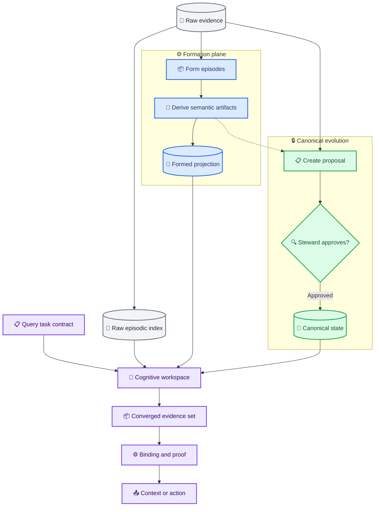
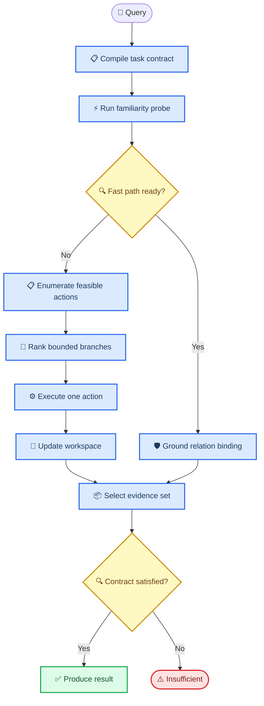

# MiLAi 受治理双过程 Memory 架构设计

_基于当前代码审计、LongMemEval failure model 与 Memory Lifecycle 基线形成的架构深化方案；它不取代冻结架构或执行 Master。_

---

## 📋 决策摘要

MiLAi 不需要推倒重写。Evidence、Canonical State、Proposal/Steward、版本、Scope、撤销和审计已经构成可靠治理骨架。当前主要问题是：

> 复杂性放错了位置。普通读取被词面规则、错误 identity 传播和过早类型化限制；真正需要严格控制的关系 Binding、EvidenceSet 覆盖、时间 proof 和 Reader-visible evidence 尚未闭合。

本设计将 MiLAi 收敛为：

> 受治理的双过程认知记忆系统：先用快速熟悉性识别解决简单读取，仅在真实缺口存在时进行受控联想重构；所有分支最终通过 EvidenceSet、Binding 和 proof 收敛，任何模型结果都不能直接改变 Canonical State。

核心执行原则：

```text
快记，不丢。
慢悟，不急着相信。
先认，再忆。
允许跳，但记录为何跳。
广泛联想，严格收敛。
降低可达性，不静默抹除。
回忆可以触发修正，但不能直接重写历史。
```

本设计只增加策略层和 query-local 对象，不新增第二套权威 Memory State，也不授权当前产品启用模型化路径。

## 🔍 当前基线与问题边界

当前事实以 [LongMemEval 全切片审计与架构 rebase 输入](./MiLAi_LongMemEval全切片审计与Memory架构重构设计_20260831.md) 为准。其终态为 `PASS_LONGMEMEVAL_FAILURE_MODEL_LOCALIZED`，含义是 failure model 已定位，不是修复完成。

### 当前真实 Runtime

默认路径仍大致是：

```text
MemoryResolve
→ MemoryQueryIR v0.2
→ Raw FTS + Canonical lanes
→ live governance
→ legacy-v0.1 Binding
→ ORDINARY_RECALL
→ legacy Context packing
→ evaluation-owned Reader
```

已有但默认关闭的候选能力包括 Formation、Evidence Dense、type-directed Binding、deterministic recovery、atomic Context 和 progressive Context。产品 Runtime 本身没有内置生成式 Reader。

### 需要保留与需要重构的边界

| 范围 | 决策 |
| --- | --- |
| Evidence / Canonical 对象和事务 | 保留 |
| `OperationProposal → StewardDecision → ClaimVersion/OpenIssue` | 保留为唯一写链 |
| valid-time / system-time / scope / permission / revocation | 保留 |
| append-only audit | 保留 |
| QueryIR 的正交轴 | 渐进补齐，不另建平行 IR |
| identity 传播 | P0 修复 |
| ordinary relation Binding | P0/P1 修复 |
| multi-requirement EvidenceSet | 新增选择策略 |
| temporal completeness | 独立 proof lane |
| Formation | 改为真正增量、Raw-preserving substrate |
| associative retrieval | 仅在简单路径存在已证明 residual 时启用 |

LongMemEval 的 470 个可回答 cases 中有 300 个需要多个 gold sessions。该数据形状决定主目标必须从“单条相关候选”升级为“多个 requirement role 的合法 EvidenceSet”。

### 六个硬不变量

跨组件只保留以下硬门：

```text
1. subject / session / source / turn identity 真实
2. access / revocation / scope 不泄漏
3. Reader-visible trace 等于真实序列化内容
4. ordinary recall 具有 grounded relation binding
5. strict COMPLETE 由唯一 DecisionEngine profile 产生且 proof 闭合
6. retrieval / model / Reader 不直接修改 Canonical State
```

通道排序、query interpretation、episode segmentation、cue generation、reranking、graph traversal、context selection 和 accessibility scoring 都是可替换策略，不应变成重复的 domain fail-closed 状态机。

## 🏗️ 最终架构

### 生命周期与三条读取 lane



三条读取 lane 的 authority 不同：

| Lane | 内容 | 用途 | 禁止事项 |
| --- | --- | --- | --- |
| Raw | 原始 Evidence、turn、artifact | 回放、grounding、细节恢复 | 自动变成 belief |
| Formed | episode、identity/event/time/state candidate、association | 组织、聚合、候选发现 | 证明不存在或范围完备 |
| Canonical | ClaimHead、ClaimVersion、OpenIssue | current/as-of/versioned state | 绕过 Evidence lineage |

### 四种状态

| 状态 | 生命周期 | Authority |
| --- | --- | --- |
| Canonical State | 持久、版本化 | 权威 |
| Formation Artifact | sidecar 或持久 projection、可重建 | 非权威 |
| CognitiveWorkspace | query-local、epoch-bound | 无长期 authority |
| ContextCapsule | 单次回答或任务局部 | 无写权限 |

最重要的新对象是 query-local 工作区，而不是新数据库：

```yaml
CognitiveWorkspaceV01:
  query_identity:
  state_epoch:

  query_task_contract:
  requirements: []
  proof_obligations: []

  accepted_anchors: []
  provisional_hypotheses: []
  associative_branches: []
  seen_regions: []
  feasible_actions: []

  remaining_budget:
  familiarity_state:
  readiness_state:
```

Workspace 可以被模型读取，也可以承载模型 proposal，但只有 Runtime 能更新其 identity、预算、可行动作和 accepted evidence；Workspace 的任何字段都不能直接提交为 Claim。

### 人类记忆类比的使用边界

本设计借鉴计算功能，不模拟脑区，也不声称软件对象具有生物对应关系。

| 计算类比 | MiLAi 机制 |
| --- | --- |
| 快速保存具体经历 | Raw Evidence 与 episodic index |
| 慢速学习可泛化结构 | Formation / consolidation |
| 区分相似经历 | session、episode、event identity |
| 由部分线索恢复事件 | multi-channel pattern completion |
| 当前工作记忆 | `CognitiveWorkspace` |
| 快速熟悉感 | exact/canonical/high-confidence lookup |
| 慢速重构 | controlled associative recollection |
| 执行控制 | requirements、budget、DecisionEngine |

互补学习系统的相关理论模型将快速保存具体经验与较慢的泛化学习视为互补过程，并预测只有在迁移有利于未来泛化时才应 consolidation；这在此仅作为工程启发，不作为已证实的脑机制。[^1] 海马研究中的 pattern separation 和 pattern completion 则提供了另一组计算类比：写入时避免相似经历错误合并，读取时允许从不完整 cue 恢复已存表示。[^2]

## 🧠 FDRC 双过程读取

内部工作算法命名为 `FDRC`：Familiarity–Divergence–Recollection–Convergence。



### Query 编译

保留 `MemoryQueryIR v0.2` 已有正交轴，补齐：

```yaml
QueryTaskContract:
  answer_intent:
  operator:
  source_roles: []
  evidence_topology:
  temporal_contract:
  output_type:
  proof_obligations: []
```

模型可返回 N-best semantic proposals；Runtime 负责 type、scope、identity 和 capability 校验。模型不能生成 SQL、任意工具名、`COMPLETE` 或 Canonical mutation。

### Familiarity probe

`Familiarity` 是校准后的系统状态，不是 embedding 均分，也不是模型自报 confidence：

$$
F = g(ExactMatch, ChannelAgreement, RoleCoverage, RankMargin, SourceConsistency)
 - h(Ambiguity, Conflict, ProofGap, RepeatedRegion)
$$

路由规则：

| 状态 | 路径 |
| --- | --- |
| Canonical exact 且无 proof obligation | Fast recognition |
| grounded relation span 已存在 | Ordinary recall |
| 多 operand / 多 session / 低 familiarity | Associative recollection |
| 仅 completeness proof 缺失 | Deterministic proof action |
| 新旧状态冲突 | Version/OpenIssue lane |
| 无合法 Evidence | Insufficient/abstain |

### Controlled Associative Divergence

Runtime 枚举合法 actions；模型只能对这些 actions 和 cue branches 提供语义偏好。

```yaml
AssociativeBranchV01:
  branch_id:
  parent_branch_id:
  trigger:
  target_requirement_role:
  proposed_cue:
  expected_information_gain:
  action_digest:
  observed_result:
  disposition:
```

分支效用：

$$
U(b)=
\mathbb{E}[\Delta RoleCoverage_b]
+\lambda NewRegion_b
+\mu SourceIndependence_b
+\nu ProofPotential_b
-\alpha Cost_b
-\beta Redundancy_b
-\gamma Risk_b
$$

v0.1 边界：

```text
max proposed branches = 3
max executed additional actions = 1
max model ranking calls = 1
no automatic retry
no arbitrary tool name
no cross-scope branch
```

模型估计语义效用；Runtime 计算权限、预算、重复、风险和可执行性。

### EvidenceSet convergence

最终目标不是单条 `Top-k`：

$$
S^*=\arg\max_S
\left[
\sum_{r\in R} w_r Cover(r,S)
+\eta Diversity(S)
+\theta Provenance(S)
-\lambda Cost(S)
-\rho Redundancy(S)
\right]
$$

约束：

```text
每条 Evidence 已通过 Gate
每个 required role 具有合法 Binding
atomic unit 不被截断
冲突 Evidence 不静默融合
proof obligation 不由相关性分数代替
```

普通 recall 进入 `GroundedAnswerSpanBinding + LookupReadiness`；COUNT、ORDER、STATE_DIFF 等进入 typed Binding、proof 和 `StrictSufficiency`。两者继续共享同一个最终 `DecisionEngine` owner。

## 💾 Formation、Evolution 与遗忘

### Raw-preserving Formation

同步 ingest 只执行低延迟、必须可靠的记录：

```text
Raw content
source/session/turn identity
actor and source time
scope/permission/retention
content hash and adjacency
tool/artifact lineage
```

异步 Formation 再执行：

```text
episode segmentation
entity/event mentions
identity hypotheses
occurrence-time grounding
state assertions/transitions
associative links
```

模型失败不能阻止 Evidence 落盘。Formation artifact 必须 query-independent、grounded、versioned、watermark-addressed、revocation-aware、rebuildable 和 noncanonical。

Formation 应拆为小模块，而不是一次性让一个生成模型输出完整世界模型：

```text
Episode Former
Entity/Event Mention Extractor
Identity Resolver
Temporal Grounder
State/Change Interpreter
Consolidator
```

Formation 结果只能通过以下 bridge 影响 Canonical State：

```text
Semantic candidate
→ grounded validation
→ OperationProposal
→ StewardDecision
→ Canonical Procedure
→ ClaimVersion / OpenIssue
```

### Consolidation admission

高层 pattern 至少应满足预注册的支持合同：

```text
多条独立 Evidence 支持
跨情境重复
存在未来任务价值
time/scope 稳定
无重大未解决冲突
用户许可相应 profile derivation
```

这不是自动 promotion 规则，而是生成 `OperationProposal` 的最低资格。一次抱怨不能自动变成人格特征；临时约束不能自动覆盖长期偏好；一次工具错误不能自动变成永久 workflow rule。

### Retention、Validity 与 Accessibility

三者必须解耦：

| 概念 | 问题 | 控制对象 |
| --- | --- | --- |
| Retention | 数据是否允许继续存在 | Evidence、derived artifacts、cache |
| Validity | 状态对当前 time/scope 是否有效 | ClaimVersion、valid-time、OpenIssue |
| Accessibility | 当前 query 下多容易被激活 | projection rank、prefetch、branch priority |

Accessibility score 只属于 projection：

$$
A_i(t)=w_rR_i+w_uU_i+w_sS_i+w_nN_i-w_dD_i-w_cC_i
$$

其中 usage feedback 可以强化 `cue → episode`、`entity → event` 或 `requirement → channel` 的访问路径，不能因为模型使用过某条 Claim 就提高该 Claim 的 authority。

```text
low accessibility
→ latent but recoverable

retention expiry / authorized delete
→ governed deletion + derivative invalidation

superseded state
→ historical but not current

revoked Evidence
→ cannot continue supporting derived state
```

## 👤 受控联想的产品体验

### 不建立 ADHD 模式

NIMH 将 ADHD 描述为会造成功能损害的持续性注意、活动或冲动调节困难，表现可因人和年龄而不同，诊断还要求跨场景症状和专业评估。由此可推得：话题跳转本身不足以支持诊断，系统不得由对话行为自动推断用户患有 ADHD。[^3]

一项非临床大学生研究发现，高自报 ADHD-inattention 特征组报告了更多 task-unrelated mind wandering；阅读时 mind wandering 与较低理解成绩相关，但持续注意任务本身没有出现相应绩效下降。[^4] 一篇对 31 项行为研究的综述也不支持“ADHD 普遍提高创造力”：非临床高特征样本常见较强 divergent thinking，临床诊断组没有一致优势，convergent thinking 也没有增加。[^5] 这些结果只能提示产品不要把联想发散简单等同于能力或诊断，不能用于用户分类。

因此工程名称是 `Controlled Associative Divergence`，面向所有需要模糊 cue、远距离关联、多线程思考或中断恢复的用户。

### AttentionThread 与 JumpLedger

```yaml
AttentionThreadV01:
  thread_id:
  title_candidate:
  supporting_evidence_ids: []
  last_anchor:
  unresolved_questions: []
  related_threads: []
  host_task_ref:
  status: ACTIVE | PARKED | RESUMABLE
  ttl:
```

它是可过期、非权威 projection，不是 Host Task Runtime。`JumpLedger` 记录：

```text
从哪个 thread 出发
因为什么 cue 跳转
补哪个 requirement role
到达哪个新 region
是否增加有效 Evidence coverage
```

恢复时展示可靠结构，而不是生成模糊总结：原始目标、已解决内容、未解决内容、跳转原因和最近可靠 anchor。

### 三种模式

| 模式 | 行为 |
| --- | --- |
| Focus | 当前 requirement、高精度 Evidence，产品默认 |
| Explore | 允许有界远距离 association，用户显式触发 |
| Resume | 围绕 thread、未解决问题和 interruption point 恢复 |

用户可以显式选择；系统可以提出建议，但不能据此形成医疗或人格 Claim。一项 2025 年研究报告，默认网络与执行控制网络在分离/整合配置之间的切换频率与 divergent-thinking 表现呈小幅正相关；其倒 U 结果针对两种状态的驻留平衡，而不是“切换太多会变差”。[^6] 本设计只借用“发散与控制需要协作”的工程启发，不把网络发现直接映射为软件模块。

## 🤖 模型与 Runtime 边界

vLLM 可以托管四类可替换函数：

```text
1. QueryTaskContract N-best proposer
2. Associative branch / residual cue generator
3. State-aware reranker
4. Grounded evidence interpretation proposer
```

模型不维护：

```text
Canonical State
RequirementState identity
CognitiveWorkspace epoch
BranchLedger authority
permission/revocation state
COMPLETE
```

所有模型输入均由 Runtime 构造 permission-trimmed view；digest、epoch、candidate/action identity 由可信 adapter 包装，不能要求模型生成或复制。

模型不可用时，以下路径仍须工作：

```text
canonical/exact
→ FTS + optional Dense union
→ grounded Binding
→ typed operator or abstain
```

因此 vLLM 是语义策略后端，不是 Memory State Store、retrieval authority 或 canonical writer。

## 🧪 开发与实验路线

### Stage 0：恢复评测真实性

第一个执行 successor 仍应是 `ML-EVAL-00`：

```text
original session identity
session-scoped turn identity
CandidateEnvelope identity
EvidenceReferenceNote validation
whole-unit rank-first admission
exact reader_visible_trace
exact tokenizer/chat-template accounting
system failure separation
```

完成后生成新的 untreated baseline，不 resume 旧 contexts。

### Stage 1：Grounded read boundary

```text
GroundedAnswerSpanBinding
subject/relation/source-role validation
LookupReadiness / StrictSufficiency profiles
single DecisionEngine owner
known false-COMPLETE replay
strict operator reads Binding only
```

### Stage 2：Simple multi-channel EvidenceSet

```text
Canonical exact/version
Raw FTS
Dense
real session adjacency
eligible Formation projection
→ small per-channel quotas
→ union/dedup/RRF
→ requirement-role EvidenceSet
```

不进入 planner、多轮 agent 或 global graph。

### Stage 3：Formation substrate

直接验证 episode、identity/event/time、state/change、watermark、revocation 和 Evolution bridge。比较 `formed + simple` 与 `raw + adaptive`，不能再次用几乎全 Raw fallback 的 arm 声称 Formation effect。

### Stage 4：Controlled Associative Divergence

只有同时满足以下 opportunity 才创建 `CR-01` effect：

```text
simple path 仍有 unresolved requirement
fresh observation 提供新 cue
仍有未执行的 admissible action
official oracle 显示额外 action 可恢复 role
```

实验顺序：

```text
SHADOW branches
→ oracle/action agreement
→ one official action
→ full Binding/Sufficiency recomputation
→ matched gain and cost
→ only then consider second round
```

### Stage 5：Accessibility 与长期演化

验证 accessibility decay、retrieval contribution feedback、projection rebuild、revocation propagation、state transition、conflict preservation 和 rollback replay。这一阶段才支持完整 Memory Lifecycle 主张。

## 📊 评测合同

### LongMemEval

LongMemEval 继续评估 recall、multi-session、temporal、knowledge update 和 abstention，但必须先通过 evaluation identity 与 Reader-visible trace gate。

主要 mediator：

```text
GoldEvidenceSpanRecall
ReaderVisibleGoldSpanCoverage
RequirementRoleCoverage
SemanticBindingPrecision / Recall
OperatorReadyRate
TemporalProofClosureRate
Wrong COMPLETE
```

### 真实使用场景

| Slice | 目标 |
| --- | --- |
| Topic Jump | 多次跳转后恢复正确 thread |
| Interrupted Work | 隔时恢复目标和 interruption point |
| Remote Cue | 不使用原词时恢复 Evidence |
| False Association | 抑制远距离但错误的关联 |
| Temporary Constraint | 不把短期限制写成永久偏好 |
| Evolving State | current/as-of/version 正确 |
| Deletion Cascade | Raw、projection、support 全链撤销 |
| Model Outage | deterministic fallback |
| Cross-scope Identity | 不跨 scope 错误 merge |
| No-memory-needed | 无需 Memory 时不引入噪声 |
| Jumpy Multi-thread | parked/resumed threads |
| Malicious Memory | prompt injection 不 promotion |

受控联想的核心指标：

```text
UsefulAssociativeJumpRate
FalseAssociationRate
JumpLoopRate
BranchNoveltyRate
RoleCoverageGainPerJump
CostPerUsefulBinding
```

`UsefulAssociativeJumpRate` 必须以新增合法 requirement-role coverage 为分子，不能以“生成了新 cue”或“返回了新候选”代替。

## 🎯 冻结建议与非目标

### 建议采纳的设计

```text
一个 Raw source of record
一个 Canonical writer
一个 query-local CognitiveWorkspace
一个 Evidence acceptance boundary
一个 COMPLETE owner
一份 exact Reader-visible trace

Familiarity fast path
+ bounded associative slow path
+ requirement-level EvidenceSet convergence
+ Raw-preserving Formation
+ non-authoritative accessibility projection
```

### 近期不做

```text
自由搜索 Agent
默认多轮 ReFind
全局知识图成为 truth store
自动 profile promotion
根据用户行为推断 ADHD
用访问频率改变事实 authority
用关键词生成代替 temporal proof
用更多 token 掩盖 Reader/context 错误
因 benchmark case 增加 synonym
```

### 架构采纳路径

本文件是 `ARCHITECTURE_REBASE_PROPOSAL`。正式采纳需要分别完成：

1. 将稳定边界吸收到 `MILA-ML-ARCH` 的新版本
2. 由 `MILA-ML-MASTER` 单独授权执行顺序
3. 为 `CognitiveWorkspace`、branch ledger 和 accessibility projection 先建立 query-local/sidecar contracts
4. 在任何持久化或 schema 变更前走 architecture-vNext ADR

在此之前，它不改变 frozen architecture、产品 feature flags 或当前 Goal authority。

### 参考资料

六项外部引用的 existence、metadata 与 context 已完成 fresh-reviewer 核对；详见 [Citation Audit](./docs/reports/MiLAi_GDPM_CITATION_AUDIT_20260831.md)。审计为 same-family provisional，认知科学结论均按工程类比收窄表述。

[^1]: Sun, W., Advani, M., Spruston, N., Saxe, A., & Fitzgerald, J. E. (2023). “Organizing memories for generalization in complementary learning systems.” _Nature Neuroscience_, 26, 1438–1448. https://doi.org/10.1038/s41593-023-01382-9

[^2]: Yassa, M. A., & Stark, C. E. L. (2011). “Pattern separation in the hippocampus.” _Trends in Neurosciences_, 34(10), 515–525. https://doi.org/10.1016/j.tins.2011.06.006

[^3]: National Institute of Mental Health. (2024). “Attention-Deficit/Hyperactivity Disorder: What You Need to Know.” NIH Publication No. 24-MH-8300. https://www.nimh.nih.gov/health/publications/attention-deficit-hyperactivity-disorder-what-you-need-to-know

[^4]: Jonkman, L. M., Markus, C. R., Franklin, M. S., & van Dalfsen, J. H. (2017). “Mind wandering during attention performance: Effects of ADHD-inattention symptomatology, negative mood, ruminative response style and working memory capacity.” _PLOS ONE_, 12(7), e0181213. https://doi.org/10.1371/journal.pone.0181213

[^5]: Hoogman, M., Stolte, M., Baas, M., & Kroesbergen, E. (2020). “Creativity and ADHD: A review of behavioral studies, the effect of psychostimulants and neural underpinnings.” _Neuroscience & Biobehavioral Reviews_, 119, 66–85. https://doi.org/10.1016/j.neubiorev.2020.09.029

[^6]: Chen, Q., Kenett, Y. N., Cui, Z., et al. (2025). “Dynamic switching between brain networks predicts creative ability.” _Communications Biology_, 8, Article 54. https://doi.org/10.1038/s42003-025-07470-9

---

_该文档以 Markdown 与 Mermaid 为源格式。所有认知科学映射均为工程类比，不是生物实现或临床推断。_
