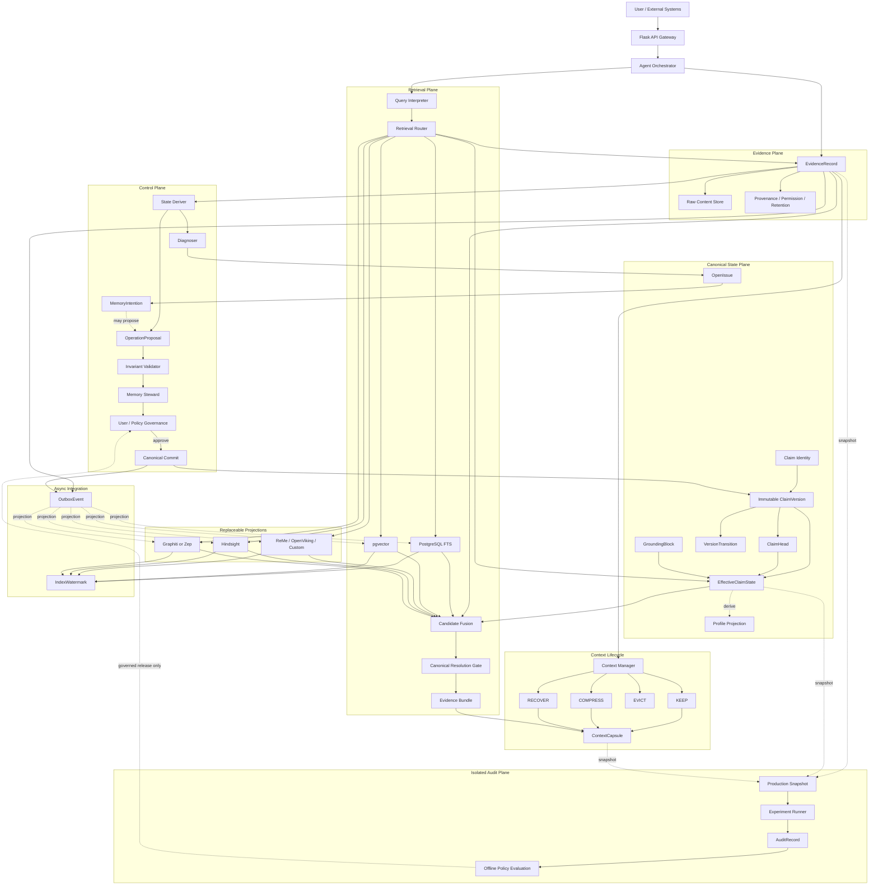

# MiLAi 技术升级需求说明 v2.0

> **2026-08-16 架构更新：** Logical Architecture 改为由 MiLAi 项目自行设计和实现；当前
> candidate 见 `MiLAi_Logical_Architecture_v1_设计文档.md`。本文保留为需求输入，不再假定
> 外部 `1.0.0 FROZEN` 原件已经存在。

> 文档状态：实施与合作需求稿，不是新的逻辑架构版本  
> 对齐基线：MiLAi Logical Architecture `1.0.0 FROZEN`  
> 数据 Schema：`0.1.x EXPERIMENTAL`  
> Production Policy：`UNFROZEN`  
> Implementation Contract：`CANDIDATE / NO-GO FOR DB FREEZE`  
> 修订日期：2026-08-11

本文件替代旧版“聊天 + 结构化 JSON + FAISS”的升级叙述，用于向合作研发团队说明 MiLAi 当前基础、目标架构、外部项目边界、实施顺序、验收门槛和回滚要求。旧系统仍是迁移起点，但不再代表目标数据模型。

配套的逐步开发、测试、上线和日常使用流程见 [`MiLAi开发实施与使用流程_v1.md`](./MiLAi开发实施与使用流程_v1.md)。本文件继续承担架构与需求边界，配套手册只展开实施顺序，不修改冻结语义。

当前近期实施范围已进一步收缩，见 [`MiLAi_Lean_V1_产品底座与研究核心.md`](./MiLAi_Lean_V1_产品底座与研究核心.md)。本文件保留为长期架构和能力地图；Lean V1 文件决定近期在线模块、暂停项和单一 Research Core。

本文件不得覆盖以下冻结规范：

```text
C:\Users\Mingx\Documents\mila\architecture\v1.0\README.md
C:\Users\Mingx\Documents\mila\architecture\v1.0\BASELINE.md
C:\Users\Mingx\Documents\mila\architecture\v1.0\OBJECTS.md
C:\Users\Mingx\Documents\mila\architecture\v1.0\PERMISSIONS.md
C:\Users\Mingx\Documents\mila\architecture\v1.0\INVARIANTS.md
C:\Users\Mingx\Documents\mila\architecture\v1.0\architecture_manifest.json
```

若本文与上述规范冲突，以冻结规范为准。

---

# 1. 升级结论

MiLAi 的目标不再定义为“给聊天机器人增加长期记忆”，而是：

> 建立一个本地优先、证据可追溯、状态可演化、权限可治理、删除可传播、检索可降级的个人与家庭 AI 认知基础设施。

目标系统采用一个 canonical core 和若干可替换投影：

```text
1 个 Canonical State Core
+ 1 个 Context Backend
+ 1 个 Semantic/Episodic Shadow
+ 0–1 个 Temporal Graph Shadow
+ 多组隔离的 Baseline / Audit 实验
```

核心数据流冻结为两条相互独立的路径：

```text
Raw Evidence ──> Context Lifecycle ──> ContextCapsule
      │
      └────────> State Derivation ───> OperationProposal
                                          │
                                          v
                                  Validator / Steward
                                          │
                                          v
                                      ClaimVersion
```

这意味着：

1. 原始对话、文件和工具结果属于 Evidence，不因摘要或提炼而消失；
2. Context compression 只解决下一步需要什么，不能制造长期 truth；
3. LLM、外部 memory engine 和检索系统只能提出候选，不能直接提交 canonical state；
4. 当前状态必须通过不可变版本和显式 lineage 演化；
5. 用户画像是 Claim 的派生投影，不是独立黑箱；
6. Production 与 Audit 隔离，研究结果不能自动修改线上策略。

---

# 2. 产品目标与非目标

## 2.1 产品目标

MiLAi 应在长期使用中支持：

1. 完整保存用户和 AI 的原始交互；
2. 保存文件、图片、音频、工具结果等原始证据及其内容身份；
3. 从证据中提出事实、偏好、观点、经历和当前状态候选；
4. 区分“观察到了什么”和“系统当前相信什么”；
5. 区分历史状态、当前状态、未解决冲突和待验证问题；
6. 根据 query 的时间、实体、scope、authority 和复杂度选择不同检索路线；
7. 让用户查看结论、来源、版本、修改历史、权限和删除状态；
8. 在索引或外部引擎故障时保留 canonical correctness；
9. 支持个人账号，后续扩展家庭共享和多 Agent 协作；
10. 在本地设备能力允许的范围内运行模型、存储和索引。

## 2.2 明确非目标

V1 不承诺：

- 自动把所有聊天写成长期记忆；
- 让摘要替代原始对话；
- 自动推断职业、健康、资产、关系等敏感画像；
- 自动 Scope Promotion；
- 自动将单次经验升级为长期规律；
- 自动关闭尚未解决的冲突；
- 让多个 memory backend 共同维护 canonical truth；
- 完整 Memory Agenda 或多 Agent canonical arbitration；
- 通过 LoRA 存储会变化的事实和当前状态；
- 把研究假设包装成已经验证的生产机制。

---

# 3. 当前基础与迁移原则

## 3.1 当前运行基础

```text
用户浏览器
  ↓
www.milai.me
  ↓
云服务器 Nginx
  ↓
FRP 隧道
  ↓
本机 Flask
  ↓
Ollama / SQLite / JSON / FAISS / 本地文件
```

| 模块 | 当前实现 | 升级定位 |
| --- | --- | --- |
| API | Python + Flask 单体 | 保留入口，逐步拆出服务边界 |
| 在线模型 | `qwen2.5:7b` | Online LLM 候选，型号由评测决定 |
| 离线模型 | `qwen2.5:14b` | State Deriver 候选，只有 proposal 权 |
| 原始聊天 | SQLite `chat_history.db` | 迁移为 Evidence source，不直接转成 truth |
| 待审核归档 | `pending_chat_archive.json` | 迁移为 Episode/Review Queue |
| 结构化记忆 | JSON | 迁移为 versioned Claim 数据 |
| 向量检索 | FAISS `IndexFlatIP` | 保留为迁移期 baseline |
| 精排 | BGE reranker | 继续作为候选精排组件 |
| 前端 | HTML/CSS/JS 多页面 | 增加证据、版本、问题和治理界面 |

## 3.2 迁移纪律

采用增量迁移，不一次性替换旧系统：

```text
旧 SQLite / JSON / FAISS
        │
        ├─ compatibility reader
        ├─ immutable migration snapshot
        └─ replayable migration jobs
                    ↓
             新 PostgreSQL Core
```

迁移要求：

1. 旧数据只读快照必须可校验、可重跑；
2. 每条迁移后的 Evidence 和 Claim 保留 legacy source reference；
3. 不能把旧 JSON memory 直接认定为已验证 Claim；
4. 无法恢复证据来源的旧 memory 默认只能是 `INFORMATIONAL`；
5. 新旧检索并行评测，未达到回归门槛前不切流；
6. 所有升级先在 `memory_test` 隔离环境运行。

---

# 4. 目标逻辑架构



---

# 5. 冻结对象与状态语义

## 5.1 六个核心对象

| 对象 | 责任 | 禁止承担的责任 |
| --- | --- | --- |
| `EvidenceRecord` | 记录实际观察、来源、内容身份、时间、权限和删除状态 | 不代表系统已接受该事实 |
| `ClaimVersion` | 表示一版 evidence-grounded canonical belief | 不允许原地覆盖旧版本 |
| `OpenIssue` | 表示冲突、缺证、待验证或 scope 未决 | 不能因压缩或引用消失而自动关闭 |
| `MemoryIntention` | 表示对 OpenIssue 的持续维护承诺 | 不能直接修改 state |
| `ContextCapsule` | 表示有限 token budget 下的当前工作集 | 不是 Evidence，也不是长期 truth |
| `AuditRecord` | 表示一次隔离测量、暴露或结果 | 不能直接改变 Production policy |

`OperationProposal` 是 write-path 接口，不是第七个 memory object。

## 5.2 正交状态轴

旧版 `active/pending/superseded/archived` 单状态字段不再足够。`ClaimVersion` 至少区分：

```text
lifecycle:
  CANDIDATE | ACTIVE | SUPERSEDED | ARCHIVED | DELETED

epistemic_status:
  PROVISIONAL | VERIFIED | CHALLENGED | UNPROVABLE

freshness:
  CURRENT | STALE

authority:
  INFORMATIONAL | ACTION_SAFE | USER_CONFIRMED
```

四个轴不能互相推导。例如：

```text
ACTIVE + CHALLENGED + STALE + INFORMATIONAL
```

是合法状态。`confidence=0.9` 也不能自动提升为 `ACTION_SAFE`。

## 5.3 Scope

Scope 是适用条件谓词，不是 `session < project < domain < user` 的单一等级：

```json
{
  "scope_kind": "CONTEXTUAL",
  "project_ids": ["milai"],
  "task_domains": ["research"],
  "interaction_modes": [],
  "valid_time": {"from": null, "to": null},
  "exclusions": [],
  "confidence": 0.78
}
```

Scope 自动演化保留为研究假设。V1 使用人工或受治理的静态/contextual scope。

## 5.4 旧 memory 类型的迁移

| 旧类型 | 新位置 |
| --- | --- |
| `conversation` | 原始内容进入 Evidence/Episode；只有明确结论才产生 Claim candidate |
| `fact` | `ClaimVersion.claim_type=FACT` |
| `preference` | `ClaimVersion.claim_type=PREFERENCE` + contextual scope |
| `belief` | `ClaimVersion.claim_type=BELIEF` + valid time |
| `experience` | Episode Evidence；可产生 Experience/Lesson candidate |
| `current_state` | versioned Claim + ClaimHead + CURRENT freshness |

旧类型迁移不能丢失原始对话引用。

---

# 6. Canonical 写路径

## 6.1 唯一写路径

```text
Evidence
→ State Derivation
→ Diagnosis
→ OperationProposal
→ Invariant Validator
→ Memory Steward
→ User/Policy Governance
→ Canonical Commit
→ new ClaimVersion
```

禁止：

```text
LLM                    → direct canonical UPDATE
ContextCapsule         → ClaimVersion mutation
MemoryIntention        → ClaimVersion mutation
Hindsight/Graphiti     → canonical commit
Compression result     → EvidenceRecord
Audit result           → automatic policy update
```

## 6.2 V1 事务族

| 事务 | 作用 |
| --- | --- |
| `TX-01 Evidence Ingest` | 幂等写入 Evidence、内容身份、OperationalEvent 和 Outbox |
| `TX-02 Claim Create` | absence-CAS 创建 Claim、V1 和 ClaimHead |
| `TX-03 Claim Revision` | exact-head CAS 创建不可变 Vn+1 和 VersionTransition |
| `TX-04 No Change` | 记录受治理判断，不产生版本或 head movement |
| `TX-05 Evidence Revoke` | 同步撤销证据并对依赖 Claim 建立 GroundingBlock |
| `TX-06 Grounding Restore` | 新证据重建 grounding，产生新版本并治理性解除 block |

普通事务中不得同步调用远程模型、向量库或外部 memory engine。所有二级投影通过同事务写入的 `OutboxEvent` 异步更新。

## 6.3 OperationProposal 最小要求

Proposal 必须包含：

- tenant 和 target identity；
- operation 类型；
- `expected_version_id`；
- supporting/contradicting Evidence refs；
- proposed patch；
- derivation policy/model/template/snapshot；
- idempotency key；
- proposer identity；
- `canonical_commit_authorized=false`。

V1 支持：

```text
CREATE
SUPPORT
CONTRADICT
WEAKEN
REVALIDATE
REGROUND
SUPERSEDE
CONTEXTUALIZE
NO_CHANGE
```

`SPLIT` 在接口中保留，但 V1 runtime 必须拒绝。

---

# 7. Episode Settlement

Episode 结束不能继续采用：

```text
session end → summarize → save
```

应改为：

```text
Episode End
  ├─ Archive raw Episode
  ├─ Expire transient working state
  ├─ Produce candidate Claims / residual lessons
  ├─ Diagnose conflicts and missing evidence
  ├─ Update or create OpenIssue proposals
  └─ Send all durable changes through Steward
```

Settlement 的 V1 目标不是自动学习复杂规律，而是：

1. 不让 temporary state 污染长期检索；
2. 原始 Episode 始终可回放；
3. candidate residual 最多 0–3 条；
4. 单次 residual 不自动升级为 Pattern；
5. profile candidate 必须带 context 和 Evidence；
6. 未解决冲突进入 OpenIssue，而不是被摘要成单一结论。

Boundary Utility、Residual validation 和 automatic promotion 保留在 Audit/Research Track。

---

# 8. 检索与 Context 装配

## 8.1 QueryPlan

Query Interpreter 至少输出：

```yaml
QueryPlan:
  intent: string
  entities: []
  time_constraint: object|null
  scope_predicate: object
  required_authority: INFORMATIONAL|ACTION_SAFE|USER_CONFIRMED
  complexity: L0|L1|L2
  consistency_mode: EVENTUAL|READ_YOUR_WRITES|CANONICAL_REQUIRED
  context_budget: integer
  routes: []
```

## 8.2 三层检索

### L0 — Exact / Current State

适用：

```text
当前项目状态
当前偏好
已确认账号信息
精确编号和日期
```

路径：

```text
subject/predicate exact
→ scope predicate
→ ClaimHead
→ EffectiveClaimState
→ authority/GroundingBlock gate
```

### L1 — Hybrid Retrieval

适用普通历史、主题和多 Session 查询：

```text
metadata filter
→ PostgreSQL FTS/BM25
+ pgvector semantic recall
+ optional Hindsight candidates
→ fusion/rerank
→ canonical resolution
```

### L2 — Reconstructive Retrieval

只用于复杂时间、关系、多跳、证据冲突和来源追踪：

```text
iterative retrieval
→ raw Evidence recovery
→ temporal/graph route
→ contradiction/support comparison
→ sufficiency check
```

L2 不能成为所有 query 的默认路线。

## 8.3 Consistency Mode

| Mode | 行为 |
| --- | --- |
| `EVENTUAL` | 可使用落后索引，但必须记录 watermark 和 degraded 状态 |
| `READ_YOUR_WRITES` | 等待目标 watermark；超时后由 canonical lane 补齐 |
| `CANONICAL_REQUIRED` | 当前状态、权限、删除、治理和 action-safe 查询必须读取 canonical ECS |

任何二级引擎返回的 candidate 都必须解析回 canonical ID，再经过：

```text
tenant
scope
valid time
current version
revocation
GroundingBlock
required authority
```

未知 ID、缺 lineage、跨 tenant 或已撤销 candidate 必须丢弃。

## 8.4 ContextCapsule

ContextCapsule 固定分区：

```text
[1] ACTIVE GOAL
[2] ACTIVE STATE
[3] OPEN ISSUES
[4] CONSTRAINTS
[5] RETRIEVED EVIDENCE
[6] TRACE POINTERS
```

Context policy：

- Goal、hard constraints、current canonical state：高保护；
- OpenIssue：identity-preserving keep；
- Evidence：按 query relevance 装配，并保留引用；
- tool logs：可恢复时优先 offload；
- summary：只优化表示，不产生 Evidence；
- recursive compression：不能静默丢失未解决 OpenIssue。

---

# 9. 外部项目的整体位置

外部项目统一放入五种可替换接口：

```text
ContextBackend
ShadowMemoryBackend
TemporalGraphBackend
RetrievalPolicy
EvaluationAdapter
```

## 9.1 ContextBackend

候选：

```text
自研 ContextCapsule Store
ReMe
OpenViking
```

分配：

| 项目 | 位置 | 可以做 | 不能做 |
| --- | --- | --- | --- |
| 自研 ContextCapsule | V1 默认 | Goal/State/OpenIssue/Evidence/Trace 装配 | canonical commit |
| ReMe | 首选外部 Context 候选 | readable Markdown、tool offload、context compaction、recoverable files | 自动产生 canonical user memory |
| OpenViking | hierarchical resource 实验 | `viking://`、L0/L1/L2、resource/session retrieval | 将 native session memory 当 MiLAi truth |

ReMe 与 OpenViking 不能同时成为生产 Context writer。每个 deployment 选择一个 backend adapter。

许可证截至本稿：ReMe 为 Apache-2.0；OpenViking 主项目为 AGPLv3。OpenViking 进入商业产品前必须完成许可证评估。

## 9.2 ShadowMemoryBackend

生产候选：Hindsight。

```text
Episode/Evidence/Current Claim projection
→ Hindsight retain
→ recall/observation/reflect
→ RetrievalCandidate 或 OperationProposal
```

要求：

- bank/namespace 按 tenant 和 subject 隔离；
- retain 使用稳定 document ID 和 outbox idempotency key；
- recall 使用严格 scope tag；
- observation 必须带 source facts；
- reflect 只用于离线 candidate generation；
- Hindsight 永远没有 canonical credentials。

替代/对照：

| 项目 | 角色 |
| --- | --- |
| Mem0 | 成熟 store/retrieve baseline |
| MemoryOS | short/mid/long hierarchy baseline |
| MemOS | 全栈 Memory OS 对照，不嵌入 MiLAi control plane |
| EverMemOS | episode→scene→profile consolidation baseline |
| True Memory | raw-first retrieval baseline |

这些系统必须消费同一份只读 Episode snapshot 独立评测，不能同时写 Production。

## 9.3 TemporalGraphBackend

候选：Graphiti 或 Zep，二选一。

```text
Canonical ClaimVersion / VersionTransition
→ Outbox
→ structured temporal episode
→ temporal/relationship candidates
→ canonical resolution
```

- Graphiti：开源、自托管、适合本地实验和自定义图结构；
- Zep：托管规模化方案，可作为 Graphiti 的 deployment alternative；
- Chronos/TSM：时间检索 baseline；
- Graphiti/Zep 的 fact invalidation 只能产生 proposal signal，不能直接 supersede Claim。

V1 默认不启用 TemporalGraphBackend。只有专门 temporal benchmark 证明其相对 PostgreSQL VersionTransition 和 Hindsight 的增益后才进入默认路线。

## 9.4 RetrievalPolicy

| 项目 | MiLAi 位置 |
| --- | --- |
| SelRoute | query-type routing baseline |
| RF-Mem | L1→L2 escalation policy |
| TA-Mem | L2 memory-tool selection |
| MRAgent | iterative reconstruction baseline |

这些是算法策略，不是新的 memory database。

## 9.5 EvaluationAdapter

| 类别 | 项目 |
| --- | --- |
| 长期记忆 | LongMemEval、LongMemEval-V2 |
| 偏好变化 | PAMU、HorizonBench、Memora |
| 冲突与旧记忆 | MemConflict |
| Context | ReMe、Beyond Compaction/CWL、Decision-Aware Memory Cards、DeMem |
| Write/Version | TOKI、ChronoMem、GEM |
| Profile | PersonaAgent、PPRO、PersonaTrail/PACMem、PersonaTree、User as Code |
| Audit/Security | MemAudit、Mi-Memory、SSGM |

EvaluationAdapter 只能读 snapshot、写 AuditRecord。

## 9.6 外部项目参考链接

- Hindsight：https://github.com/vectorize-io/hindsight
- ReMe：https://github.com/agentscope-ai/ReMe
- OpenViking：https://github.com/volcengine/OpenViking
- Graphiti：https://github.com/getzep/graphiti
- Zep：https://help.getzep.com/zep-vs-graphiti
- Mem0：https://github.com/mem0ai/mem0
- MemOS：https://github.com/MemTensor/MemOS
- MemoryOS：https://github.com/BAI-LAB/MemoryOS
- EverMemOS：https://github.com/EverMind-AI/EverOS

---

# 10. Outbox、Projection 与故障降级

Canonical transaction 与 `OutboxEvent` 必须原子提交。每个 index/shadow 维护独立 `IndexWatermark`。

建议将固定 `index_name` 枚举升级为受控的 projection registry，以容纳：

```text
fts
pgvector
profile
context_reme
context_openviking
hindsight
graphiti
zep
```

每个 adapter 保存：

```yaml
ProjectionMap:
  tenant_id: UUID
  engine: string
  canonical_object_type: string
  canonical_object_id: UUID
  canonical_version_id: UUID|null
  commit_seq: integer
  external_id: string
  payload_hash: string
  status: pending|ready|failed|purged
  last_error_ref: string|null
```

Worker 要求：

1. 使用 `outbox_id` 或确定性 downstream key 保证幂等；
2. 按 aggregate 保序；
3. durable write 后才能推进 watermark；
4. dead-letter gap 不能被 watermark 越过；
5. worker 只能更新自己的 delivery metadata 和 watermark；
6. 外部引擎不可访问 canonical credentials；
7. 引擎故障只允许降低 recall，不得降低 authority gate。

---

# 11. 删除、权限与本地安全

## 11.1 Evidence 删除

删除采用 fail-closed 流程：

```text
User delete / retention / permission withdrawal
→ revoke EvidenceRecord
→ synchronously create GroundingBlock
→ dependent Claims immediately lose action-safe usability
→ emit purge/re-ground OutboxEvents
→ asynchronous index/shadow/blob cleanup
```

外部索引即使暂时仍有 stale bytes，也不能重新取得 action authority。

## 11.2 账号和数据库隔离

P0 必须实现：

- 密码哈希与安全 session；
- 每行 `tenant_id`；
- PostgreSQL RLS；
- connection pool tenant/actor context reset；
- runtime credentials 与 migration owner 分离；
- Steward 只有存储过程 execute 权，没有直接表 DML；
- Production role 不能写 AuditRecord；
- Audit role 不能执行 canonical commit；
- 加密密钥不写入仓库、Prompt 或日志；
- 备份、恢复和删除传播测试。

在这些负向测试完成前，家庭成员真实功能保持关闭。

## 11.3 远程访问

保留 Nginx + FRP 不是长期安全结论。升级必须明确：

- TLS 终止位置；
- 服务鉴权和设备绑定；
- FRP 服务端/客户端密钥轮换；
- rate limit、CSRF、CORS 和 session cookie 策略；
- 管理中心的高风险操作二次确认；
- 操作和安全日志的本地保留期。

---

# 12. 用户画像、风格与 LoRA

## 12.1 用户画像

Profile 不是独立 truth store，而是当前有效 Claim 的可重建投影：

```text
Evidence
→ versioned Claim
→ EffectiveClaimState
→ Profile Projection
```

画像至少区分：

```text
Stable Profile
Contextual Profile
Current Session State
```

例如：

```text
research_analysis → high detail
coding            → action-first
simple_query      → concise
```

这不是矛盾，而是不同 scope 下的 Claim。

画像字段必须具备：

- Evidence refs；
- valid/system time；
- scope predicate；
- epistemic status；
- confidence；
- authority；
- user review/delete controls。

敏感画像默认禁止自动推断。

## 12.2 风格配置

职责边界：

| 信息 | 承载位置 |
| --- | --- |
| 本次“只说三句” | Current Session / ContextCapsule |
| 研究任务偏好详细机制 | Contextual Profile Claim |
| 稳定表达习惯 | Style config；满足门槛后才可成为 LoRA candidate |
| 当前项目状态 | Claim + RAG，禁止进入 LoRA |

## 12.3 LoRA

LoRA 保持 P1，必须依赖：

```text
raw sample
→ candidate
→ de-identification
→ evidence/source checks
→ user authorization
→ versioned dataset
→ train/evaluate
→ governed release/rollback
```

训练数据、基础模型、参数、产物和启用范围都必须版本化。事实准确性仍由 Memory/RAG 提供，LoRA 不能成为动态事实数据库。

---

# 13. 多模态记忆

多模态内容首先进入 Evidence Plane：

```text
Original File / Audio / Image
→ content hash + source + permission
→ OCR/ASR/parser outputs
→ page/time/speaker anchors
→ candidate Claims
→ Steward
```

要求：

1. 原文件保持独立 content identity；
2. OCR、描述、转写和摘要都是 derived artifacts，不替代原文件；
3. PDF 引用保留页码和原文 offset；
4. 音频引用保留时间戳和说话人不确定性；
5. 图片推断不能绕过敏感 profile policy；
6. 删除原文件必须传播到所有派生索引和 Claim grounding；
7. MIRIX、SensorPersona 等只作为未来 multimodal/profile baseline。

---

# 14. Multi-Agent 扩展边界

V1 不实现多 Agent canonical arbitration，但对象模型必须保留未来扩展空间：

```text
Distributed Evidence
→ OpenIssue
→ MemoryIntention
→ owner/contributors/eligible evidence
→ authority gate
→ delegated verification
→ Steward resolution
```

未来的 `MemoryIntention` 扩展可增加：

```text
owner
contributors
eligible_evidence
authority_required
trigger
completion_rule
```

StateFuse、Governed Collaborative Memory 等工作放在 Control/Multi-Agent Research Track，不作为 V1 backend。

---

# 15. 模型与本地资源调度

现有 7B/14B 分工保留为 baseline，但型号和量化不冻结。

## 15.1 队列

```text
Priority 0: interactive chat
Priority 1: exact/canonical retrieval
Priority 2: context recovery and rerank
Priority 3: state derivation / settlement
Priority 4: indexing / shadow projection
Priority 5: audit experiments / training
```

后台任务必须：

- 有幂等键；
- 可取消和重试；
- 不持有 canonical transaction 等待模型；
- 不丢失原始 Episode；
- 记录 model/version/template/token/time/resource；
- 避免 14B 后台任务挤占 7B 在线服务资源。

## 15.2 性能基线

至少测量：

- TTFT、tokens/s、总耗时；
- CPU、内存、GPU、显存；
- 不同上下文长度；
- 在线/离线并发影响；
- JSON/Schema 成功率；
- retrieval、rerank、context assembly 分阶段延迟；
- shadow ingestion lag 和 dead-letter rate；
- 本地硬件配置矩阵。

模型更换必须经过相同数据、相同 prompt/schema、相同硬件或明确归一化条件的对照实验。

---

# 16. 服务与权限边界

| 模块 | 可以做 | 不可以做 |
| --- | --- | --- |
| Evidence Ingestor | 创建 Evidence、内容引用和 OperationalEvent | 创建 ClaimVersion |
| State Deriver | 读取 Evidence/ECS，产生 Proposal | canonical DML |
| Diagnoser | 创建/更新 OpenIssue proposal | 关闭未满足规则的问题 |
| Intention Controller | 等待、触发 reconsideration、提出 Proposal | 直接修改 Claim |
| Context Manager | 创建 ContextCapsule | 把 summary 注册成 Evidence |
| Retrieval Service | 找候选并解析 ECS | 独立提高 authority |
| Shadow Adapter | 消费 Outbox、写自己的投影 | canonical/evidence/control write |
| Memory Steward | 执行受约束 commit procedure | 直接表 DML、DDL |
| Audit Runner | 读 snapshot、写 AuditRecord | 写 Production 或发布 policy |
| User Governance | 确认、纠正、删除、导出请求 | 无限制 canonical write |

Flask 单体可以暂时承载这些模块，但代码、数据库角色和事务边界必须按职责分离，不能因同一进程而共用所有权限。

---

# 17. 产品界面升级

## 17.1 我的记忆

增加：

- 当前与历史版本切换；
- Evidence 来源与原文回跳；
- scope、freshness、epistemic status、authority 展示；
- supporting/contradicting evidence；
- stale、challenged、grounding blocked 提示；
- 用户确认、纠正、删除、导出。

## 17.2 管理中心

增加：

- Episode review queue；
- OperationProposal review；
- OpenIssue 列表；
- MemoryIntention 状态；
- deletion/purge 状态；
- index/shadow lag；
- model、policy、schema 和 migration version；
- backup/restore 检查。

## 17.3 回答依据

关键回答至少能展示：

```text
当前结论
生效时间
authority
直接依据
原始来源
历史版本
开放冲突
检索降级状态
```

证据不足时使用明确 abstention，不把相似文本改写成确定事实。

---

# 18. 研发阶段

## Phase 0 — Legacy Baseline

交付：

- 冻结当前 SQLite/JSON/FAISS 行为；
- 建立真实但脱敏的 `memory_test` dataset；
- 建立普通 RAG、当前状态、时间、实体和冲突基线；
- 建立性能与资源基线；
- 为旧数据生成迁移 manifest 和 checksum。

## Phase 1 — PostgreSQL Canonical Core

交付：

- EvidenceRecord、ClaimVersion、ClaimHead、VersionTransition；
- OperationProposal、StewardDecision、OpenIssue；
- `TX-01` 至 `TX-06`；
- EffectiveClaimState；
- RLS、DB roles、CAS、idempotency；
- OperationalEvent、OutboxEvent；
- deletion fail-closed。

当前状态：在九个 implementation freeze gates 全部通过前，数据库冻结为 NO-GO。

## Phase 2 — L0/L1 Retrieval

交付：

- Query Interpreter；
- exact/current-state route；
- PostgreSQL FTS + pgvector；
- metadata/time/scope filter；
- fusion/rerank；
- canonical resolution；
- Evidence Bundle 和 RetrievalTrace。

## Phase 3 — ContextCapsule

交付：

- Goal/State/OpenIssue/Constraint/Evidence/Trace 分区；
- KEEP/COMPRESS/EVICT/RECOVER；
- tool output offload；
- recursive open-issue preservation tests；
- ReMe baseline；
- OpenViking 作为可选实验，不默认接入。

## Phase 4 — Hindsight Shadow

交付：

- outbox adapter；
- per-tenant bank/tag policy；
- idempotent retain；
- recall with source facts/trace；
- candidate-to-canonical resolution；
- shadow purge 和 watermark recovery。

## Phase 5 — Temporal Experiment

交付：

- Graphiti adapter；
- structured canonical transition episodes；
- temporal/relationship query set；
- 与 PostgreSQL lineage、Hindsight、Chronos/TSM 对比；
- 是否进入 Production 的 go/no-go 报告。

Zep 只作为 Graphiti 的托管替代方案，不并行部署。

## Phase 6 — Profile and Personalization

交付：

- Profile Projection；
- contextual preference；
- 用户审核和删除；
- style config；
- PAMU/HorizonBench/Memora 回归；
- LoRA 数据治理和小规模实验。

## Phase 7 — Multimodal and Family

交付：

- file/image/audio Evidence；
- page/time anchored retrieval；
- family RLS 和共享授权；
- 儿童最小化数据策略；
- 多设备备份恢复。

## Phase 8 — Research / Multi-Agent

隔离实验：

```text
Boundary Utility
Open-State-Preserving Compression
Scope Evolution
Memory Intention / Memory Agenda
Multi-Agent Maintenance Responsibility
```

任何研究 track 不得成为前序 Production phase 的隐式依赖。

---

# 19. 评测与验收

## 19.1 Baseline

必须保留：

```text
B0 No Memory / Full Context
B1 当前 FAISS RAG
B2 PostgreSQL FTS only
B3 FTS + pgvector hybrid
B4 Mem0
B5 Hindsight
B6 Graphiti temporal
C0 naive summary
C1 ReMe
C2 OpenViking
```

## 19.2 质量指标

- current-state accuracy；
- historical-version accuracy；
- stale/superseded misuse rate；
- unsupported assertion rate；
- abstention precision/recall；
- evidence citation completeness；
- source-to-answer trace correctness；
- entity and exact-number disambiguation；
- temporal reasoning；
- multi-session recall；
- context-compression task success；
- open-issue preservation；
- user correction success。

## 19.3 安全与一致性硬门槛

以下要求不是平均分指标，而是必须通过的门禁：

1. 非 Steward 无法执行 Claim/OpenIssue canonical commit；
2. Steward 无法直接 DML canonical tables；
3. 两个并发 revision 对同一 expected head 只能一个成功；
4. retry 不创建重复 Evidence、ClaimVersion 或 outbox projection；
5. 旧 ClaimVersion 在 revision 后 byte-immutable；
6. Evidence revoke 在同事务中使依赖 Claim fail-closed；
7. cross-tenant read/write 为零；
8. Production role 无法写 AuditRecord；
9. Audit role 无法修改 Production；
10. shadow engine 无法提高 authority 或清除 GroundingBlock；
11. dead-letter gap 不能被 watermark 跳过；
12. recursive compression 不能静默丢失 OpenIssue。

## 19.4 性能与运营指标

- p50/p95 TTFT 和总响应时间；
- query interpret、retrieval、rerank、context assembly 分段延迟；
- canonical DB latency；
- index lag；
- outbox retry/dead-letter rate；
- shadow availability 和 fallback rate；
- context token usage；
- model/embedding/rerank 成本；
- backup restore time；
- purge completion time。

性能 SLA 在 Phase 0 基线后冻结。不得在没有设备和 workload 数据时编造统一数字。

---

# 20. 第一阶段任务包

## A. Canonical Memory Core（P0）

交付：PostgreSQL schema candidate、事务存储过程、CAS/idempotency、ECS、Outbox、真实数据库负向测试和回滚脚本。

## B. Hybrid Retrieval（P0）

交付：QueryPlan、L0/L1 router、FTS + pgvector、metadata/time/scope、canonical gate、Evidence Bundle、评测报告。

## C. Security and Operations（P0）

交付：账号、密码哈希、RLS、角色权限、密钥、远程访问、备份恢复、删除传播和审计日志。

## D. Context Lifecycle（P0/P1）

交付：ContextCapsule、tool offload、open-issue preservation、ReMe adapter/baseline、token budget 评测。

## E. Shadow Memory（P1）

交付：Hindsight adapter、strict scope、source-fact trace、watermark、purge 和与 Mem0 的对照。

## F. Personalization（P1）

交付：Profile Projection、contextual preference、用户审核、style config、LoRA data governance。

## G. Temporal / Multimodal / Family（P2）

交付：Graphiti go/no-go、多模态 Evidence、家庭权限和多设备恢复。

---

# 21. 合作团队交付合同

每个模块必须提交：

1. 问题定义和不做什么；
2. 对齐的冻结 invariant 和对象边界；
3. ADR/技术方案；
4. Schema/API/transaction/interface；
5. migration 和 rollback；
6. unit/integration/concurrency/failure tests；
7. baseline、数据集、指标和原始结果；
8. 安全、权限、隐私和删除分析；
9. observability 和故障降级；
10. `memory_test` 的可重复运行说明；
11. 尚未解决的 gap；
12. go/no-go 结论。

不得只交概念图、Prompt 或未经验证的 benchmark 数字。

---

# 22. 文档与版本治理

1. `architecture/v1.0` 的冻结文件禁止静默修改；
2. 改变六对象语义、单写者、两条派生路径或 12 条 invariant，必须创建新的 logical architecture version；
3. 不改变冻结语义的字段优化可进入 Schema `0.1.x`；
4. implementation 文档保持 derived/non-normative，直至九个 freeze gates 有执行证据；
5. Production policy 每次发布都必须有版本、审核、回滚和生效时间；
6. 研究结果只能通过 offline evaluation 和 governed release 进入 Production；
7. 外部项目升级必须重新验证 API、许可证、迁移和删除语义。

---

# 23. 最终验收原则

1. Evidence 与 belief 可区分；
2. 当前与历史可区分；
3. confidence 与 authority 可区分；
4. freshness 与 epistemic truth 可区分；
5. Context 与 canonical state 可区分；
6. Proposal 与 commit 可区分；
7. OpenIssue 与 MemoryIntention 可区分；
8. 删除能传播到 derived state 和外部投影；
9. 所有关键回答能回到 Evidence；
10. 外部引擎故障不会改变 canonical truth；
11. 用户能审核、纠正、删除和导出；
12. 不确定时系统能够 abstain；
13. 不同账号、Agent 和家庭成员不会互相泄漏；
14. 新方案有 baseline、失败测试和回滚；
15. 研究假设不会未经治理进入生产。

满足这些条件后，MiLAi 才算从“聊天 + 向量检索”升级为可长期运行的 Memory Intelligence System。

---

# 附录 A：旧版方向与新版工作流映射

| 旧版方向 | 新版位置 |
| --- | --- |
| 模型推理优化 | Phase 0/15 资源调度与性能基线 |
| LoRA 个性化 | Phase 6，依赖数据治理和 Profile |
| 语气/人格/风格 | Style config + contextual Profile |
| 记忆检索优化 | Phase 2 L0/L1/L2 + canonical gate |
| 多模态记忆 | Phase 7 Evidence-first pipeline |
| 用户画像 | Profile Projection，不是独立 truth |
| 账号与安全 | Phase 1/11，P0 硬门槛 |

# 附录 B：当前明确 NO-GO 项

```text
直接冻结 PostgreSQL DDL
外部 memory engine 获得 canonical credentials
把 summary 注册为 Evidence
自动 Scope Promotion
自动 Pattern Promotion
自动 Multi-Agent arbitration
真实家庭账号在 RLS/权限测试前上线
把动态事实训练进 LoRA
同时部署 ReMe + OpenViking + MemOS + Graphiti + 多 autonomous agents
未经 baseline 的检索替换
```
