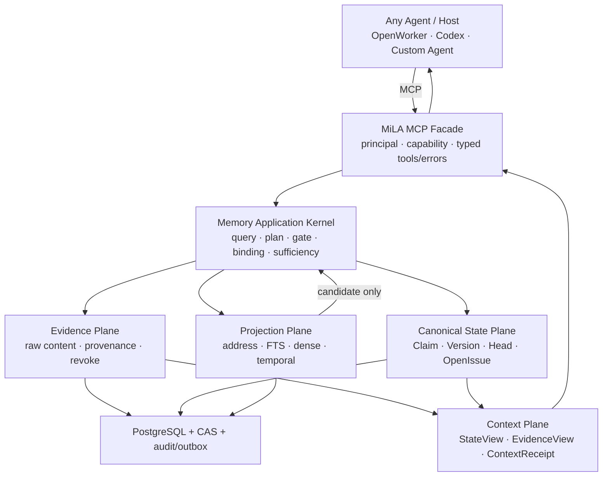
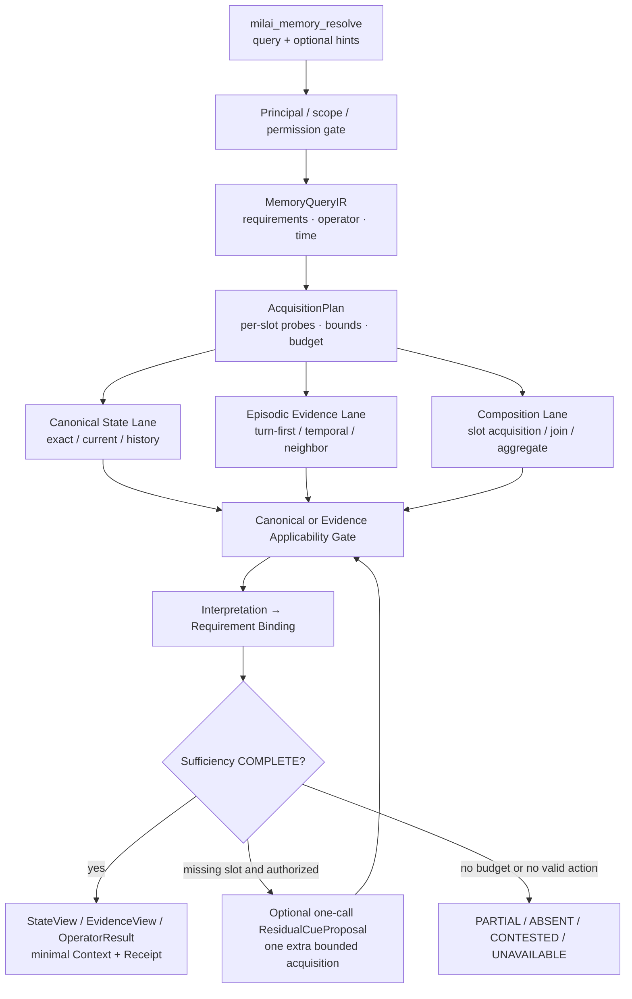

# MiLAi DG13–DG19 架构与方法迁移 Prompt

> 文档用途：将本轮长对话、当前 repository 证据和 DG13–DG19 的研发结论迁移给下一位工程或研究 Agent。  
> 截止时间：2026-08-28（Asia/Shanghai）。  
> 当前产品标签：`DG13 = LOCAL_MCP_GOVERNED_MEMORY_SERVICE_USABLE`。  
> 当前最新实验终态：`DG19 = PARKED_NO_MEDIATOR_GAIN`。  
> 发布边界：Runtime=`CANDIDATE`；Schema=`EXPERIMENTAL / NO-GO FOR FREEZE`；不是 Production、远程 MCP、真实个人数据或论文结论。  
> 事实优先级：Executable code → tests/evals → sealed receipts/traces → Goal/spec → README/comments → naming。  

## 🧭 1. 给接手 Agent 的首要指令

你正在接手 `/cra/memory/mx_memory/MiLAi`。先恢复 `CURRENT IMPLEMENTATION`，再讨论 `TARGET` 和 `GAP`。不要根据本迁移文档直接假定所有目标设计已经实现。

开始工作时必须遵守：

1. 完整阅读 [`AGENTS.md`](../AGENTS.md) 与 [`MiLAi_Lean_V1_实施合同.md`](../MiLAi_Lean_V1_实施合同.md)。
2. 将 [`architecture/v1.0/`](../architecture/v1.0/) 视为 frozen baseline；未经新的明确 Goal，不修改其内容。
3. 不重跑或改写已经封存的 DG13–DG19 receipt；新实验必须使用新 `run_id`，历史失败保留。
4. 当前 worktree 很脏且大量内容未跟随 Git；现有修改属于当前工作状态。禁止 reset、cleanup 或覆盖未知文件。
5. 默认先做只读因果审计。没有新 Goal 授权时，不进入产品实现、正式 holdout、R5 多轮 refinding、Production 或远程发布。
6. 结论必须区分 `Observed`、`Documented`、`[INFERENCE]`、`[UNKNOWN]`。
7. 不通过放松 Binding、Sufficiency、scope、permission、revoke 或 canonical authority 来换取 F1。
8. 不增加 case-specific regex、魔法 boost、隐藏 fallback、无上限 Top-k 或默认多轮模型循环。
9. 失败时先隔离单一 failing boundary，做最小复现，再运行与改动风险相称的测试；不要用重复全仓审计替代调试。
10. 若后续 Goal 明确授权并行开发，可并行处理互不写冲突的代码、测试、实验和独立审查，但必须绑定相同输入身份、provider、预算和 scorer contract。

当前 Git 上下文：

```text
branch: main
observed HEAD: 651099b
known modified files:
  scripts/dg13u_u1_review.py
  tests/test_dg13u_u1_review.py
repository condition:
  many MiLAi sources/artifacts are untracked;
  content digests and sealed receipts are more authoritative than HEAD alone.
```

## 📌 2. 当前终态摘要

以下是迁移时应当保留的最高可信结论：

| Area | Current state | Meaning |
| --- | --- | --- |
| MCP 产品边界 | `USABLE / LOCAL / SCOPED` | 普通 MCP client 与 OpenWorker 本地接入已形成可用受治理链路 |
| Evidence / provenance / revoke | `PASS within scoped release` | 原始证据、来源、权限和撤销边界基本成立 |
| Governed canonical write | `PASS within scoped release` | Evidence、Proposal、review、Claim commit 分离；修复同 actor 自批和越权查看 |
| Canonical State 对 LME 质量的贡献 | `NOT MATERIALLY EVALUATED` | 部分 LME run 的 `claim_count=0`；不能据此否定 Canonical State |
| Semantic Query Planning | `PARTIAL` | 已有 typed IR、requirements、temporal/operator precursor，但开放域语义仍不完整 |
| Candidate Acquisition | `PRIMARY BOTTLENECK` | 正确 answer-bearing turn/required slot 经常未进入候选集 |
| Binding / Sufficiency | `SAFE BUT STARVED` | 能拒绝不完整证据；上游召回不足时稳定返回 PARTIAL/UNKNOWN |
| Context packing | `DG18 PASS` | 512/2048 packing loss 为 0；但更多 token 没有增加 required evidence coverage |
| One-call residual cue | `SHADOW-ONLY / OPERATIONAL / PARKED` | DG19 treatment 已真实交付，但未进入产品 live path；opened-dev 只改善 1 个 missing-slot case，门槛为 2 |
| Multi-round ReFind-style loop | `NOT AUTHORIZED` | 尚未有足够 failure slice 支持 R5；不能从 ReFind 论文直接推断产品收益 |
| Lifecycle efficiency | `SEPARATE SYSTEMS LANE` | 在线 query 不是主要生命周期瓶颈；ingest/finalize/cleanup 需批量和增量化 |
| Formal holdout | `UNCONSUMED` | 不得打开、推断或将 opened-dev 结果表述为正式结论 |

DG19 是最新的可执行终态，不是 provider block：

```text
VALID_TREATMENT_DELIVERED
  provider schema valid        6/6 synthetic; 3/3 eligible opened-dev
  Runtime accepted             6/6 synthetic; 3/3 eligible opened-dev
  extra acquisition executed   6 synthetic; 3 opened-dev
  new governed candidates      4 synthetic; 10 opened-dev

MEDIATOR RESULT
  synthetic improved cases     3
  opened-dev missing-slot gain 1 case
  required threshold           2 cases
  terminal                     PARKED_NO_MEDIATOR_GAIN
```

## 🏛️ 3. 产品定位与架构所有权

MiLA 的产品本体不是 Agent Runtime，也不是 OpenWorker Task Controller。

> **MiLA 是一个 MCP 原生、Evidence-first、Versioned-state、Governed-write 的 Agent Memory Service。它在没有完整 TaskIdentity 时也能由 query 进入读取路径，并向授权 Agent 返回有 provenance 的最小 Memory Context。**

OpenWorker 是首要 MCP client 和集成宿主，不是 MiLA Core。Host 可以在 provider 调用前自动 prefetch，也可以让 Agent 显式调用 MCP；两种模式必须复用同一个 Memory 语义。



### Ownership table

| Responsibility | Owner | Boundary |
| --- | --- | --- |
| Agent planning、provider invocation、workflow | Host / Agent | 不属于 MiLA |
| Execution Task identity、plan node、tool lineage | Host | 只可作为可选 retrieval/authorization hint |
| MCP tool catalog、profile、typed result | MCP facade | 第一产品接口，不是 memory truth |
| Query interpretation、access planning | MiLA Runtime | Task 缺失不能关闭 query-based retrieval |
| Evidence applicability、Binding、Sufficiency | MiLA Runtime | 模型不能覆盖这些决定 |
| Canonical state、version、conflict、authority | MiLA Runtime / governed writer | 唯一规范状态所有者 |
| FTS/vector/temporal/graph/summary | Projection plane | 可重建、candidate-only |
| Final answer generation | Agent/provider | 只能消费 Runtime 返回的上下文；不能回写 truth |
| Remembered task status | Canonical Memory | 例如 `task:DG19/status=PARKED...`，不是 Host Task registry |

Task 的最终位置：

```text
Host Execution Task
  = optional scope/ranking/reuse/authorization hint

Remembered Task State
  = normal versioned Canonical Claim

Task omitted
  = no task-bound context reuse
  ≠ no memory
```

## 🔄 4. 真实读取与写入方法

### Query-first 读取主链



必须保留的顺序：

```text
Query semantics
→ per-requirement AcquisitionPlan
→ bounded candidate generation
→ source/scope/time/revoke Gate
→ span/interpretation
→ Requirement Binding
→ query-specific Sufficiency
→ operator or Context Compiler
```

不允许退化为：

```text
query → one global OR-FTS → any result means sufficient → fixed Top-k
```

### 三条读取 Lane

| Lane | 适用问题 | Primary output | Completion basis |
| --- | --- | --- | --- |
| Canonical State | current、historical、update、conflict、version diff | `MemoryStateView` | 合法 ClaimVersion、time、scope、authority、OpenIssue |
| Episodic Evidence | 说过什么、发生过什么、上次建议、原始上下文 | `EvidenceView` | answer-bearing turn/span 与来源邻接 |
| Evidence Composition | count、sum、divide、compare、temporal distance、multi-session join、why | `EvidenceSet` / operator result | required slots 全部满足及相应 completeness proof |

不是所有 Memory Query 都是 State query；不是所有 Evidence 都应升级为 Claim；不是所有问题都能由 Top-k 解决。

### Governed canonical write

```text
Observation / interaction / tool result
→ Evidence capture
→ candidate derivation
→ OperationProposal
→ invariant validation
→ independent Steward or user review
→ immutable ClaimVersion / ClaimHead / OpenIssue
→ audit + outbox
→ asynchronous projections
```

写入中的关键边界：

- Evidence capture 只证明“观察到了什么”，不直接证明“当前应该相信什么”。
- Proposal 不是 Commit；普通 submitter 不能自批，reviewer 不能越权查看其他 proposal。
- Search、summary、graph、vLLM output 只能产生 candidate。
- 冲突不能 last-write-wins；无法合法解决时保留 `OpenIssue` 或返回 `CONTESTED`。

## 🧩 5. 核心对象、代码入口与语义

| Object / service | Current code | Correct interpretation |
| --- | --- | --- |
| `EvidenceRecord` | [`evidence_repository.py`](../runtime/src/milai/persistence/evidence_repository.py) | durable raw Evidence metadata；正文可在 CAS；不是 Belief |
| `MemoryStateViewService` | [`memory_state.py`](../runtime/src/milai/application/memory_state.py) | query-time derived read model；不是第二套 truth store |
| `MemoryQueryIR` / `EvidenceRequirement` | [`memory_query_ir.py`](../runtime/src/milai/domain/memory_query_ir.py) | 表达 query、operator、time 和 required evidence；不能成为封闭业务 ontology |
| `MemoryQueryCompiler` | [`memory_query.py`](../runtime/src/milai/application/memory_query.py) | 当前 deterministic/双语编译入口；新增规则必须防止 benchmark wording 过拟合 |
| `AcquisitionPlan` / `CandidateEnvelope` | [`acquisition.py`](../runtime/src/milai/domain/acquisition.py) | per-slot probes、constraints、fusion、budget；不是一个 query string |
| Plan compiler/fusion | [`application/acquisition.py`](../runtime/src/milai/application/acquisition.py) | 执行 channel-specific acquisition 与 turn-first fusion |
| `EvidenceSpan` / interpretation / binding | [`semantic_query.py`](../runtime/src/milai/domain/semantic_query.py)、[`evidence_semantics.py`](../runtime/src/milai/application/evidence_semantics.py) | source span、语义解释和 requirement binding 必须分离 |
| `EvidenceAtom` | [`memory_query_ir.py`](../runtime/src/milai/domain/memory_query_ir.py)、[`evidence_atoms.py`](../runtime/src/milai/application/evidence_atoms.py) | 可重建的 evidence projection；不是必须覆盖开放世界的原子事实 ontology |
| `SufficiencyDecision` | [`domain/sufficiency.py`](../runtime/src/milai/domain/sufficiency.py)、[`application/sufficiency.py`](../runtime/src/milai/application/sufficiency.py) | operator-specific COMPLETE/PARTIAL 等；不能由“候选非空”决定 |
| `AcquisitionState` | [`domain/acquisition.py`](../runtime/src/milai/domain/acquisition.py)、[`acquisition_state.py`](../runtime/src/milai/application/acquisition_state.py) | query-local seen regions、notes、coverage、budget；不是持久 truth |
| `ResidualCueProposal` / `ResidualSearchHint` | [`residual_refinding.py`](../runtime/src/milai/domain/residual_refinding.py) | 小型受限 provider proposal；Runtime 规范化并验证 |
| Residual controller | [`application/residual_refinding.py`](../runtime/src/milai/application/residual_refinding.py) | provider call、schema、normalization、eligibility；无 final evidence/completion authority |
| `PrepareContextService` | [`context_preparation.py`](../runtime/src/milai/application/context_preparation.py) | OpenWorker hidden prefetch composite path；不是公共 Memory 的唯一入口 |
| MCP facade | [`server.py`](../integrations/mcp/src/milai_mcp/server.py) | `milai_memory_resolve`、`milai_memory_get`、capture/proposal/review 等 profile-scoped tools |
| OpenWorker controller | [`controller.py`](../integrations/openworker-mcp/src/milai_openworker_mcp/controller.py) | Host integration；自动调用 MCP 和注入 context，不拥有 Memory truth |

### Atom 与 IR 的防僵化原则

本轮已经明确否定“为 benchmark 示例建立封闭 Atom/regex 体系”的做法。

正确原则是：

```text
raw Evidence remains recoverable
typed IR expresses execution needs
derived atoms/spans are replaceable projections
unknown/ambiguous semantics remain explicit
model may propose a bounded cue
Runtime validates and executes
```

因此：

- `EvidenceAtom` 只是 query-time 或 projection-time 的解释单元，不是 Canonical Claim，也不是完整世界模型。
- `MemoryQueryIR` 应保留小型稳定核心和明确的 `UNKNOWN/AMBIGUOUS`，不为每个领域动作新增枚举或 regex。
- `role_expectation` 应按 requirement slot 生成，并使用结构化 `speaker` 字段；禁止通过 `content.startswith("user:")` 或 `buy/pay/cook/meet` 等动作猜 speaker。
- 不确定 source role 时使用 `BOTH/UNKNOWN` 和可标定 soft prior，不做 hard exclusion。
- lexical enrichment 与 dense text 分离；同义词扩展可以帮助 FTS，但不应污染 embedding 输入。

## 🛡️ 6. 不可破坏的架构不变量

```text
Evidence != Belief
Proposal != Commit
Context != Canonical State
Confidence != Authority
Projection hit != applicable truth
Task unavailable != MemoryRequirement.NONE
Cache miss != terminal failure when primary route is available
Locally unexpired receipt != CURRENT assurance
Any candidate != sufficient evidence set
```

模型或外部 engine 不得：

- 选择最终 Evidence；
- 创建最终 Binding；
- 宣布 `COMPLETE`；
- 改变 operator、principal、scope、authority 或 consistency；
- 重新接受 revoked/denied Evidence；
- 写入 Canonical State；
- 通过 hidden fallback 或自动 retry 改变产品结果。

`Need`、`Availability`、`Consistency`、`Capability` 必须是不同维度。早期讨论过 portable `MemoryLease`，后续产品边界收敛为更简单的 server-validated `previous_context_id` / `ContextReceipt`：

```text
reuse candidate
→ Runtime online validation
→ valid: reuse
→ miss: same-call primary route
→ Runtime unavailable: typed unavailable/abstain
```

离线 TTL 不能证明 `CURRENT`；portable offline lease、push invalidation 和 offline snapshot 注入均未获第一版授权。

## 🧠 7. Semantic Read 的完整失败模型

本轮最终使用的诊断模型是：

```text
Answer Success
≈ Access Reachability
× Candidate Recall
× Required-Evidence Completeness
× State Validity
× Reader Utilization
```

| Layer | 主要机制 | 当前判断 |
| --- | --- | --- |
| Access Reachability | Task/query/Need/route | DG12 暴露过高 addressability、低 reachability；DG13 将 query-first 收回 Runtime |
| Candidate Recall | FTS、dense、temporal、ranking | 当前主要瓶颈 |
| Evidence-set completeness | neighbor、per-slot join、range scan | 聚合、时间和 multi-session 的主要缺口 |
| State Validity | ClaimVersion、OpenIssue、Gate | 治理基础较强，但 LME 未充分使用 Canonical Lane |
| Reader Utilization | Context packing、prompt、answer form | 次要瓶颈；不能补回未检索的证据 |

关键诊断结论：

1. DG12 的 `StateAddressabilityRate≈91.67%` 与 `FastPathExecutionCoverage≈5.56%` 说明 addressability 和 reachability 必须分开测。
2. DG14 强制 `SEARCH` 后质量仍不优于或仅略优于 BM25-T，证明 Task/Need 不是唯一问题。
3. 原 flat-chunk 路径把物理 chunk 错当治理/状态单元，又以 session-level hit 代替 answer-bearing evidence coverage。
4. `COUNT_DISTINCT`、`DIVIDE_VALUES`、temporal range、multi-session join 需要完整性证明；固定 Top-k 只能证明相关性，不能证明 completeness。
5. Reader 在证据不足时返回 `UNKNOWN` 是正确行为；应修复 acquisition/composition，而不是诱导模型猜答案。
6. 2048 token 上下文不自动优于 512；DG18 中二者都保留 `11/23` required Evidence，说明 token budget 是上限，不是填满目标。

### 存储、治理、检索和组合单位必须分离

| Unit | Recommended meaning |
| --- | --- |
| Storage unit | 原始 message/turn，保真与 provenance |
| Governance unit | EvidenceRecord 或真正的 semantic State candidate |
| Retrieval unit | turn、episode、event、Claim；按 query 选择 |
| Composition unit | answer-bearing span、operand 或 requirement binding |
| Context unit | 满足当前 requirement 的最小 source window 集合 |

## 🔎 8. ReFind 的真实机制与 MiLA 吸收边界

本地参考：

- [`ReFind 论文与代码架构分析`](../../ReFind-paper/ReFind_论文与代码架构分析.md)
- [`arXiv 2608.12888v2 PDF`](../../ReFind-paper/arxiv-2608.12888v2.pdf)
- 本地代码：`/cra/memory/mx_memory/ReFind`，分析时 commit=`a80175ca0eeb52a938d7cab7a602bc780de8a577`

ReFind 的真实 search controller：

```text
question
→ search_chatrecord(keywords/date/exclusions)
→ observation with retrieved turns/local context
→ take_note(evidence)
→ reformulate next query from observation
→ repeat under budget
→ finish_search
→ separate answer stage
```

其有效机制是：

- 原始 turn/session/timestamp/adjacency 保留；
- turn-first lexical retrieval 与 session auxiliary fusion；
- anchor 周围 local context；
- 跨轮 seen/search state；
- observation-driven query reformulation；
- retrieval 与 answer 分离。

MiLA 的吸收方式不是整体移植，而是：

```text
deterministic acquisition
→ missing requirements
→ bounded residual cue
→ one extra acquisition
→ MiLA Gate / Binding / Sufficiency
```

拒绝移植：

- 每次请求重建 BM25；
- 文本 ReAct/regex parser；
- hidden direct-BM25 fallback；
- 模型拥有 `finish_search` 或 COMPLETE authority；
- 无权限、撤销、治理和 canonical state 的 raw-log service；
- 默认四轮 Agent loop 与数万 query-time tokens。

重要边界：DG19 只验证了 **one-call / one-extra-pass** residual policy。`PARKED_NO_MEDIATOR_GAIN` 不等价于“ReFind 的多轮 observation-driven refinding 已被证伪”；它只证明当前 one-call cue 在这批 opened-dev 上没有达到预设 mediator gate。R5 仍未获授权。

### Provider 与 vLLM 的当前角色

本轮曾讨论并实际验证三种语义介入位置：

| Role | Current state | Boundary |
| --- | --- | --- |
| Reader | 已在 LME answer path 使用 | 只能消费最终 Context；缺 Evidence 时不能回头检索 |
| `SemanticQueryHint` | DG17 shadow，未晋级 | 早期 25-case probe 中 deterministic planner=`25/25`、minimal vLLM hint=`17/25`，出现 wrong promotion；不得控制完整 IR/route |
| `ResidualCueProposal` | DG19 shadow treatment 已交付但 parked | 只为现有 missing requirement 提议有限搜索动作；Runtime 派生和校验其余字段 |

DG18 原始 R3 未产生可执行 hint 的直接根因是 provider contract，而不是已经证明模型不会 refind：

```text
original nested guided schema
  contains xgrammar-unsupported uniqueItems
  → non-streaming HTTP 500
  → streaming HTTP 200 + top-level SSE error event
  → old adapter ignored error event
  → misclassified as EMPTY_OUTPUT
```

环境身份：

```text
provider: local vLLM OpenAI-compatible
base URL: http://127.0.0.1:7860
model: Qwen3.6-35B-A3B-FP8
observed vLLM version: 0.27.1
```

随后将 wire contract 收敛为平坦的 `ResidualCueProposal v0.1`，由 Runtime 补充 provenance、rationale、source role 和 inherited temporal bounds；provider conformance 通过 6/6 transport cells，4/4 application proposals 通过 Pydantic 与 Runtime，SSE 顶层 error 也被改为 typed classification。DG19 因而能够真实交付 treatment。

必须保留的实验语义：

```text
TREATMENT_NOT_DELIVERED
!=
MEDIATOR_GAIN_NOT_OBSERVED_AFTER_VALID_TREATMENT
```

DG18 历史 R3 属于前者；DG19 S4 属于后者。历史 receipt 不追溯改写。

## 🧪 9. DG13–DG19 研发演化

| Goal | Main question | Key result | Current disposition |
| --- | --- | --- | --- |
| DG13 | MiLA 能否作为本地 MCP 受治理 Memory Service 使用？ | MCP/OpenWorker、query-first read、governed lifecycle、权限修复和 scoped release 通过 | `LOCAL_MCP_GOVERNED_MEMORY_SERVICE_USABLE` |
| DG14 | LME adapter 与 BM25 对比怎样？ | 首个 5-case smoke 与 BM25-T 持平；生命周期成本极高；flat chunk 问题暴露 | opened-dev characterization only |
| DG15 | 如何降低 ingest/finalize/cleanup 和 projection 成本？ | 形成 batch、persistent worker、incremental projection、watermark、namespace cleanup lane | Systems efficiency；不代表质量提升 |
| DG16 | flat chunk 如何升级为双通道与 evidence composition？ | 建立 Raw Evidence / Canonical State 分离及 focal count/divide operators；5-case 改善未泛化到新 10-case | semantic precursor / limited scope |
| DG17 | 如何实现 typed semantic read 与 evidence-set execution？ | IR、per-slot acquisition、structured speaker、temporal/dense ablation、Binding/Sufficiency 安全链形成；Q6 仍低分 | `CHARACTERIZED / PARTIAL` |
| DG18 | ReFind-style residual refinding 是否可行？ | R0–R2 通过，packing loss=0；原 R3 因 provider schema/streaming error 未真正交付 treatment | historical residual effect not evaluated |
| DG19 | 修复 provider contract 后，真实 residual treatment 有 mediator gain 吗？ | synthetic PASS；opened-dev +10 candidates，但仅 1 missing-slot case 改善 | `PARKED_NO_MEDIATOR_GAIN` |

### 关键质量数据

| Run | Scope | Result | Correct interpretation |
| --- | --- | --- | --- |
| DG14 matched | 5 opened-smoke cases | 2048 EM/F1=`3/5 / 0.60`，与 BM25-T 持平 | 分母小；不能外推 |
| DG16 independent public-dev | 10 cases | MiLA F1=`0.1194`@512、`0.2000`@2048；BM25-T=`0.0857` | MiLA 略优，但绝对质量很低 |
| DG17 Q6-003 | same 10-case opened-dev | 2048 EM=`2/10`、F1=`0.227338130`、required coverage=`7/23`、wrong COMPLETE=`0` | 安全链成立，acquisition 仍不足 |
| DG17 Q8 strong dense diagnostic | opened-dev diagnostic | coverage=`18/23`、F1=`0.277685951`，OperatorReady 增益不足且噪声高 | product default 未授权 |
| DG18 R1 | opened-dev contexts | acquired/retained=`11/23`，answer-bearing turns=`10/21`，packing loss=`0` | packing 修复；召回仍是瓶颈 |
| DG19 S4 | 3 eligible missing-slot cases | +10 governed candidates；coverage `+0.043478261`；candidate recall `+0.0625`；Binding `+0.071428571`；OperatorReady `+1`；只改善 1 case | valid treatment，无足够泛化 mediator gain |

这些结果都属于 synthetic/opened-development。Formal holdout overlap 为 0 且未消费；不得写成 paper result。

## ⚙️ 10. 实验与开发方法

### 正确的评价分层

不要只看最终 F1。先测 mediator：

```text
Query/IR accuracy
→ GoldTurnCandidateRecall
→ RequiredSlotCandidateRecall
→ AnswerBearingSpanRecall
→ RequirementBindingCoverage
→ RequiredEvidenceSetCoverage
→ OperatorReadyRate
→ Sufficiency correctness
→ Reader EM/F1
```

保留以下区分：

```text
Addressable
≠ Reachable
≠ CorrectlyResolved

Provider proposal valid
≠ Runtime accepted
≠ extra pass executed
≠ new candidate acquired
≠ missing slot improved
≠ end-to-end quality improved
```

### Oracle 分解

对 semantic failure 使用四臂诊断：

| Arm | Input | Isolates |
| --- | --- | --- |
| A | Gold IR + Gold Evidence | Reader/operator ceiling |
| B | Gold IR + Actual Evidence | Acquisition/composition failure |
| C | Predicted IR + Gold Evidence | Query planning failure |
| D | Predicted IR + Actual Evidence | End-to-end behavior |

### 单因素与安全实验

- Reader 之前先跑 acquisition-only mediator，避免 generation noise 掩盖 causal effect。
- 每次只改变一个机制：turn-first、fielded FTS、temporal filter、dense、reranker、neighbor expansion、residual cue。
- 固定 dataset identity、case order、IR、reader、prompt、token budget、provider 和 scorer。
- 自动 retry 必须为 0；invalid provider output 等价于 deterministic-only，不得触发隐式替代路径。
- Product fixture 与 scorer truth 物理隔离；先 seal product trace，再开放 scorer fixture。
- 安全指标必须报告 `0/N`，`N=0` 不算 PASS。
- 只有 mediator 改善后才运行 Reader；只有 opened-dev gate 通过后才考虑 untouched confirmation。

### 效率方法

在线查询与生命周期分开报告：

```text
Online Agent Control
Deep Retrieval
Cold / Incremental Materialization
```

结构性成本合同：

```text
EXACT:
  0 auxiliary LLM
  0 embedding/vector/reranker
  0 broad canonical scan
  1 logical MCP call

SEARCH:
  hard scope/time filter first
  bounded per-slot probes
  conditional dense/reranker
  hydrate after cutoff
  stop at query-specific sufficiency

RESIDUAL:
  model calls <= 1 under current evaluated policy
  extra passes <= 1
  retry = 0
  model cannot complete/bind/select final evidence
```

Lifecycle 的正确优化方向：

```text
batch Evidence ingest
→ persistent worker
→ micro-batch outbox/projection
→ projection watermark
→ finalize waits at barrier
→ benchmark namespace set-based cleanup
```

生产 revoke/delete 与 synthetic benchmark cleanup 必须分开；不能为删除临时 fixture 逐条执行完整生产撤销语义。

## 🧯 11. 已证伪、校正或停放的方向

| Earlier idea | Current disposition | Why |
| --- | --- | --- |
| 把 Host-native MemoryAccessPlan 作为 MiLA Core | `CORRECTED` | MiLA 是 MCP Memory Service；Host planner 只是客户端集成优化 |
| TaskIdentity 是 Memory prerequisite | `REJECTED` | query 本身必须可进入 Memory；Task 只增强 scope/ranking/reuse |
| MCP 只是多个同等 transport 之一 | `CORRECTED` | MCP 是第一产品接口；Direct/HTTP 仅未来内部优化 |
| `NONE/CACHE/L0/L1` 单一 route enum | `REJECTED AS SEMANTIC MIXING` | Requirement、availability、consistency、reuse 是不同维度 |
| portable offline MemoryLease v1 | `PARKED` | TTL 不证明 CURRENT；权限、revoke 和 offline body policy 未闭合 |
| 每个 1600-byte chunk 都治理成 ClaimVersion | `REJECTED` | 治理施加在错误语义边界，成本高且没有 state trajectory |
| Session hit 代表 Evidence complete | `REJECTED` | 正确 session 内仍可能缺 answer-bearing span/operand |
| 任意 Evidence 命中即 sufficient | `P0 CORRECTNESS DEFECT` | count/join/time/state 需要 operator-specific proof |
| 用 regex/action words 决定 source role | `REJECTED` | 语言、否定、引用、多 slot 无法泛化 |
| EvidenceAtom 是通用封闭 ontology | `REJECTED` | Atom 只能是可替换 projection/interpretation |
| 增大 Top-k 或 context tokens 自然提高质量 | `NOT SUPPORTED` | DG18 2048 token 没有增加 required coverage |
| 先换 embedding/vector DB | `DEPRIORITIZED` | 历史 profile 中主要热点与语义缺口不在 embedding 本身 |
| Reader prompt 先行修复低 F1 | `DEPRIORITIZED` | 当前主要失败发生在 candidate acquisition 与 evidence completeness |
| 一个有效 residual cue 就足以泛化 | `NOT SUPPORTED BY DG19` | treatment 交付后只改善 1 个 missing-slot case |
| 立即复制 ReFind 多轮 agent loop | `NOT AUTHORIZED` | 成本高，且当前尚未完成 one-call failure 的因果归因 |
| Graph/DAG/summary 成为 truth store | `FORBIDDEN` | 只能作为 candidate projection，经 Canonical Gate 使用 |

## 🧾 12. 当前权威证据与入口

### Product、架构和流程

- [`DG-13 MCP 原生受治理记忆服务 Goal`](../MiLAi_DG-13_MCP原生受治理记忆服务_GOALS.md)
- [`MiLA Current-State Architecture Report`](../MiLA_Current-State_Architecture_Report.md)
- [`MiLA Real Execution Flow`](../MiLA_Real_Execution_Flow.md)
- [`DG-18 Runtime 架构与运维手册`](dg18/runtime-architecture-and-operator-runbook.md)
- [`DG-17 Semantic Read Runbook`](runbooks/dg17-semantic-read.md)

### Goal 链

- [`DG-14 LongMemEval MCP 适配`](../MiLAi_DG-14_LongMemEval_MCP适配与对比实验_GOALS.md)
- [`DG-15 流水线与投影效率`](../MiLAi_DG-15_受治理记忆流水线与投影效率优化_GOALS.md)
- [`DG-16 双通道语义记忆`](../MiLAi_DG-16_双通道语义记忆与证据组合质量优化_GOALS.md)
- [`DG-17 语义读取与证据集执行`](../MiLAi_DG-17_语义记忆读取与证据集执行_GOALS.md)
- [`DG-18 受限残差再查找`](../MiLAi_DG-18_受限残差再查找与证据可达性优化_GOALS.md)
- [`DG-19 Treatment 交付与 Synthetic Shadow`](../MiLAi_DG-19_残差检索Treatment交付与Synthetic_Shadow验证_GOALS.md)

### DG19 sealed evidence

| Artifact | SHA-256 |
| --- | --- |
| [`DG13 scoped release disposition`](reports/DG-13-scoped-release-disposition-2026-08-26.json) | `16a4b8013a021cb2ae7dbf858d387e6e705db778a2d669909a46c353bd0d28aa` |
| [`DG18 provider conformance`](../var/dg18/provider-conformance/dg18-provider-conformance-20260828-002/receipt.json) | `2e7bc6f96baa0ba22479c7b952eb8864d6714836c0b13d7783d04d16c750f53e` |
| [`DG18 provider RCA calibration`](../var/dg18/final/dg18-provider-rca-calibration-20260828-002.json) | `406e4ee215af9821f4f31ea9b936d0867ab6fca21d0185d83576ad6ff9b18c21` |
| [`DG18 fresh PostgreSQL gate`](../var/dg18/final/dg18-runtime-full-gate-20260828-004.json) | `f04aadc443bde27ac8c57160be216dcd23f09884311b3ea099760a6f6bd892c2` |
| [`DG19 terminal receipt`](../var/dg19/terminal/dg19-terminal-20260828-001/receipt.json) | `6d6a621fc6a802d4e8390e6becb4e966f5964f4b7b11fbc826accc0f4895f7e0` |
| [`S3 synthetic treatment receipt`](../var/dg19/synthetic-treatment/dg19-synthetic-treatment-20260828-003/receipt.json) | `0586fd064ddbe2af68ee8e0c4268a0173877102faa6e961f014e219c5390b52a` |
| [`S4 opened-dev receipt`](../var/dg19/s4/dg19-s4-opened-dev-residual-20260828-003/receipt.json) | `d9bc5d2b76c5d988bbdf0505b495fd06211fa522e3bef2db0fe046c62409f6c8` |

`003` 是 synthetic 和 opened-dev 的权威执行链；`001/002` 保留为审计 lineage，不得覆盖。

## 🧪 13. 如何证明“真的是 MiLA 记住了”

OpenWorker session history 与 MiLA persistence 是两种不同机制：

```text
OpenWorker session memory
  = 当前 Host/Provider 的 retained conversation context
  = 可能只在同一 session 内存在

MiLA memory
  = 经 MCP 写入或治理后持久化的 Evidence/Canonical State
  = 可在 fresh Host/session 中由 MCP query 重新取得
```

一个可信的多轮/跨 session memory probe 必须：

1. 写入一个独特、不可由模型常识猜出的事实，并记录 Evidence/Claim/provenance ID。
2. 完成 projection/readiness 或 exact canonical commit barrier。
3. 启动 fresh OpenWorker session，或证明 `history_forwarded=0`、`retained_context=0`。
4. 让 Host 通过 `milai_memory_resolve` 或 `milai_memory_get` 调用 MCP。
5. 检查 AccessTrace、source Evidence ID、scope、currentness 和 ContextReceipt。
6. 再让 provider 回答；答案必须可追溯到 MCP 返回的 source，而不是旧 conversation history。
7. 做 wrong-scope、revoke 和 Runtime unavailable 对照；不得 silent fallback。

只在同一 OpenWorker session 连续提问，不能证明 MiLA 持久化。反过来，某个 Host runner 的 question-hash 或 observation binding 失败，也不能证明 MiLA 不支持多轮；必须确认第二次 MCP recall 是否实际执行。

## 🎯 14. 下一轮建议调查，但尚未授权开发

当前最有价值的下一步不是扩展模型轮次，而是解释：

> **为什么 DG19 S4 新增 10 个受治理候选，却只让 1 个 missing requirement 改善？**

建议按以下顺序开展新的只读/评估 Goal：

1. 为每个 missing requirement 建立完整 acquisition loss ledger：

   ```text
   Residual cue
   → selected channel
   → raw rank
   → fusion rank
   → candidate cutoff
   → structural expansion
   → interpretation
   → binding
   → sufficiency effect
   ```

2. 将新增候选分类为：answer-bearing、supporting、topic-similar、duplicate、wrong-role、wrong-time、wrong-entity。
3. 判断问题位于 cue、lexical/dense/temporal backend、fusion/cutoff、hydration/expansion，还是 interpretation/binding。
4. 在不运行 Reader 的 matched ablation 中比较：
   - turn-first fielded FTS；
   - per-slot probes/quota；
   - event-time versus source-time acquisition；
   - strong dense；
   - small conditional reranker；
   - same-round/neighbor/episode expansion。
5. 只有当 evidence 证明“第一轮 observation 暴露了新 cue，但 one-call policy 来不及利用”时，才起草 R5 两轮 refinding Goal。
6. Acquisition mediator 明显改善后，再运行固定 Reader 的 matched F1；不要同时修改 Reader prompt。

当前禁止：打开 formal holdout、默认启用 strong dense、把 residual 接入产品 live path、执行 R5、多 transport parity、schema freeze 或论文 novelty claim。

## 📋 15. 可直接复制给下一 Agent 的 Prompt

```text
你现在接手 MiLAi，workspace 为 /cra/memory/mx_memory/MiLAi。

首先完整阅读：
1. AGENTS.md
2. MiLAi_Lean_V1_实施合同.md
3. docs/MiLAi_DG13-DG19_架构与方法迁移Prompt_2026-08-28.md
4. MiLAi_DG-19_残差检索Treatment交付与Synthetic_Shadow验证_GOALS.md
5. var/dg19/terminal/dg19-terminal-20260828-001/receipt.json
6. var/dg19/s4/dg19-s4-opened-dev-residual-20260828-003/receipt.json

当前真实终态：
- DG13 local scoped MCP governed memory service usable；
- Runtime CANDIDATE，Schema EXPERIMENTAL / NO-GO FOR FREEZE；
- DG19 = PARKED_NO_MEDIATOR_GAIN；
- provider treatment 已真实交付，不是 provider block；
- S4 新增 10 个 governed candidates，但 only 1 missing-slot case improved；
- S5–S7、R5、formal holdout、Production/remote release 均未执行或未授权。

本轮默认只读。先恢复 current call path 和 S4 causal failure：
ResidualCueProposal
→ Runtime normalize/validate
→ extra acquisition
→ candidate ranking/cutoff
→ Evidence interpretation
→ Requirement Binding
→ Sufficiency。

对每个 missing requirement 给出 first-loss boundary，区分：
CUE / CHANNEL / RAW_RANK / FUSION / CUTOFF / EXPANSION /
INTERPRETATION / BINDING / SUFFICIENCY。

不要：
- 修改 architecture/v1.0；
- 覆盖 sealed receipt；
- 增加 case-specific regex 或 magic boost；
- 放松 scope、revoke、Binding 或 Sufficiency；
- 用更大 Top-k、更多 context 或更多 LLM 轮次代替因果诊断；
- 打开 formal holdout；
- 将 opened-dev 结果表述为 Production、formal benchmark 或论文结论。

MiLA 的产品定位必须保持：
MiLA 是 MCP-native governed Agent Memory Service；OpenWorker 是 MCP client；
TaskContext 是可选 hint；query 本身必须可达 Memory；projection 只产生 candidate；
Canonical Gate、Binding 和 Sufficiency 的最终控制权属于 Runtime。

如果得到新的实现授权，先提出一个最小 Goal，只改变一个 acquisition factor，
固定 dataset/provider/IR/Reader/budget/scorer，先测 mediator，再测 F1；
失败时做单项复现，测试和审计规模与改动风险相称。
```

## ✅ 16. 迁移完成判据

下一位 Agent 在开始任何新开发前，应能准确回答：

- MiLA 为什么是 MCP Memory Service，而不是 OpenWorker Runtime？
- Task、Evidence、Canonical State、Projection 和 Context 的 owner 分别是谁？
- 为什么 `Evidence != Belief`、`Context != Truth`？
- 为什么 query 必须在没有 TaskIdentity 时仍可进入 retrieval？
- 为什么 session hit、Top-k hit 和候选非空都不能证明 Evidence 完整？
- `EvidenceSpan → Interpretation → Binding → Sufficiency` 为什么必须分层？
- DG18 的 provider failure 与 DG19 的 no-mediator-gain 有何区别？
- 为什么 DG19 不授权 R5、多轮 Agent loop 或产品接入？
- 如何证明一次跨 session 回答确实来自 MiLA，而不是 Host session history？
- 下一轮为什么应先解释“10 个新候选只改善 1 个 missing slot”，而不是继续调 Reader 或加 regex？

如果其中任何一项不能用代码、测试或 receipt 回答，继续只读调查，不要开始实现。
