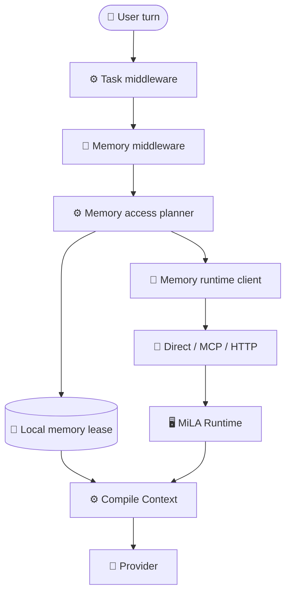
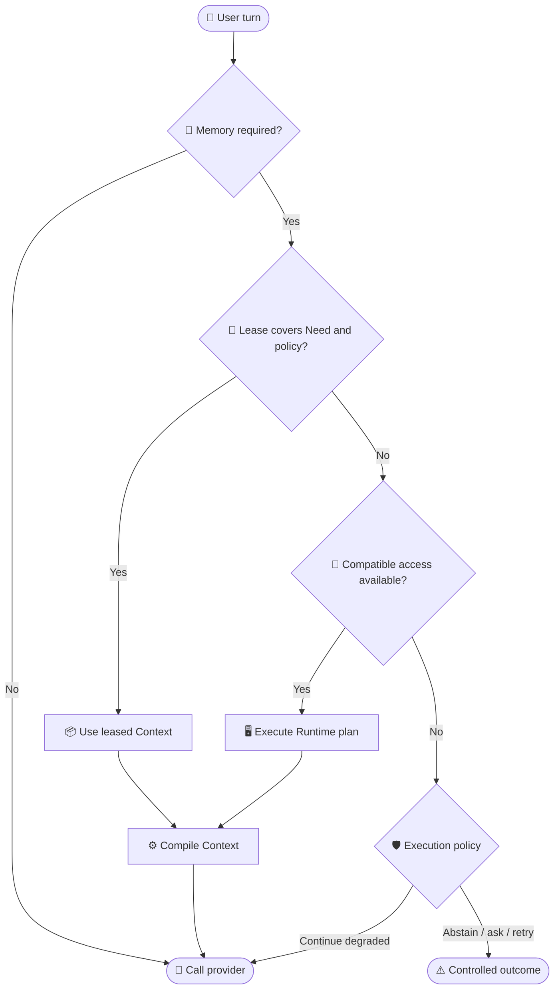
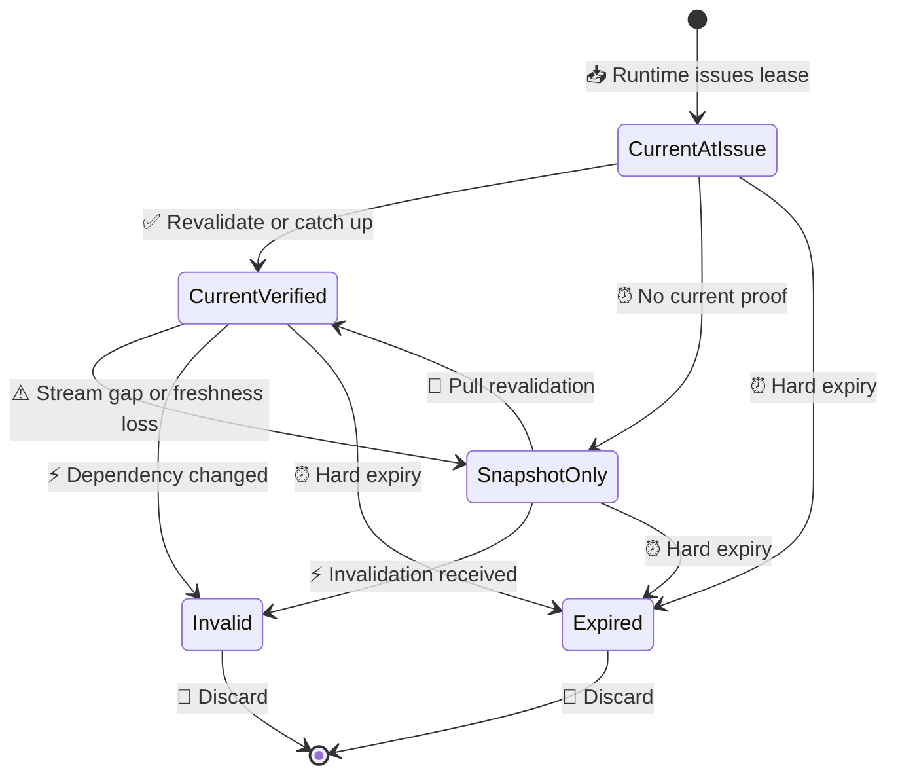
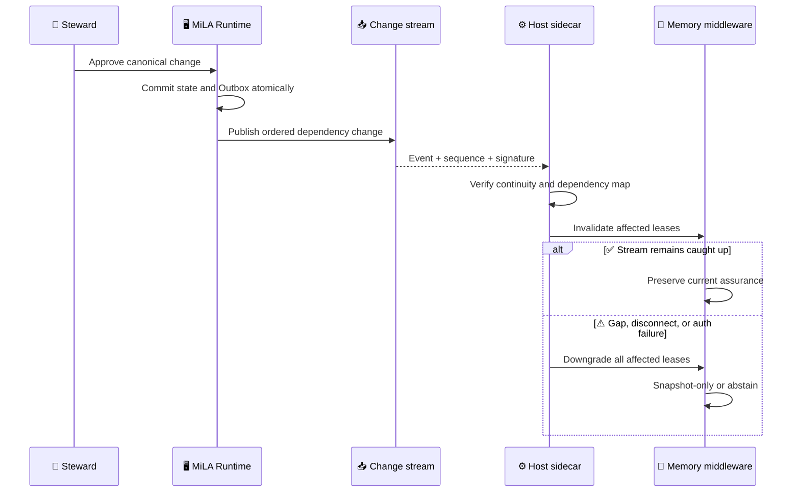

# ADR-024: Host-native Memory Control Plane

_MiLA architecture vNext proposal — transport-neutral access, host middleware, portable leases, capability negotiation, and explicit unavailability semantics_

---

| Field | Value |
|---|---|
| Status | `PROPOSED FOR ARCHITECTURE vNext / NOT IMPLEMENTED` |
| Date | `2026-08-25` |
| Decision owner | MiLA project owner |
| Scope | Agent Integration Plane、Memory Control Plane、Context reuse |
| Refines | ADR-020、ADR-021 |
| Frozen impact | 不修改 `architecture/v1.0/`；接受后必须发布新 architecture version |
| Runtime impact | 本 ADR 不实现代码、Schema、API 或部署变更 |

## 📋 Context and status

### Current implementation

当前主 OpenWorker integration 已经包含两种不同的 memory access：

1. `prefetch`：Host 在 provider 之前确定 Task relation、Memory Need 和 route，通过隐藏的 `milai_prepare_context` 获取 validated Context。模型不决定是否访问 memory。
2. `auto`：Host 暴露 `milai_recall`，由外部 Agent/model tool loop 完成 MCP 调用，再把 tool result 放回下一轮 messages。

真实主链见 [MiLA 真实执行流程](../../MiLA_Real_Execution_Flow.md)。关键实现为：

- `integrations/openworker-mcp/src/milai_openworker_mcp/host_adapter.py::OpenWorkerProviderAdapter.complete()`
- `integrations/python-client/src/milai_client/memory_need.py::DeterministicMemoryNeedResolver.resolve()`
- `integrations/python-client/src/milai_client/task_memory.py::TaskMemoryController.prepare_context()`
- `integrations/openworker-mcp/src/milai_openworker_mcp/controller.py::McpPrepareContextClient`
- `runtime/src/milai/application/context_preparation.py::PrepareContextService.prepare()`

Current Host slot 已保存 `validation_token`、typed coverage、claim/head versions、state-key versions、OpenIssue revisions、canonical position、Context digest 和 TTL。Runtime 的 CACHE route 每次仍需在线验证 token、binding、Need coverage 和 canonical frontier。

Current integration 还已经具备部分 capability negotiation：`GET /v1/capabilities` 返回 caller profile、capabilities、routes、consistency modes、features、limits 和 transport 描述；ADR-021 已把 read、capture、proposal、review 和 revoke capability 分开。

### Problem

当前产品叙事和 shipped OpenWorker composition 仍把 MCP 放在主路径中心：

```text
OpenWorker → UDS broker → milai-mcp → Runtime
```

即使 `prefetch` 已是 Host-controlled，`build_task_memory_controller()` 仍把 `TaskMemoryController` 绑定到 `McpPrepareContextClient`。当 MCP/broker/Runtime 不可用时，active Host 会 fail closed；它没有独立的 typed availability、lease assurance 或 fallback policy model。

如果把 memory 定义为“模型需要主动调用的工具”，则存在三个结构性问题：

- 增加 model/tool round trip
- 模型可能不调用、错误调用或以错误参数调用
- Host 缺少 MCP tool loop 时，memory semantics 整体消失

### Governing boundary

冻结 `architecture/v1.0/` 仍是当前最高优先级规范。本 ADR 是 vNext proposal，不原地修改 frozen bundle，也不把目标设计写成 current fact。

特别需要保留：

- I-08：cache、Context、LLM 和 adapter 不得提升 truth/authority
- I-10：Evidence revoke 必须同步阻断 Context 使用，unknown permission/retention fail closed
- I-12：authority answer 必须可回放到 canonical state 与 trace
- `RETRIEVAL_CONTEXT.md`：canonical store unavailable 时，旧 cache 不得冒充 current

## 🎯 Decision

MiLA vNext 采用以下定位：

> MiLA is a governed memory capability managed by the Host runtime. MCP is one transport and integration adapter, not a memory semantic primitive.

目标主链为：



Normative target：

1. Host MUST 在 provider call 之前确定 `TaskState`、`MemoryRequirement`、`MemoryAccessPlan` 和 fallback policy。
2. Provider MUST NOT 负责决定主 memory path 是否执行。
3. MCP MUST 作为可替换 transport/adapter，实现与 direct UDS/HTTP SDK 相同的 logical contract。
4. Model-visible `milai_recall` MAY 作为 tool-only compatibility mode 保留，但不得被宣称为等价的 native integration。
5. Need、availability 和 execution policy MUST 是三个正交输入；transport failure 不得改写 Need。
6. Read 与 write capability MUST 分离；normal answer path 不获得 review/direct canonical mutation authority。
7. Local lease MUST 是派生 Context proof，不是 Evidence、StateView 或新的 truth source。
8. 无法证明 current、permission、retention 或 revocation safety 时，Host MUST downgrade 或 abstain，不得以 TTL 代替 canonical assurance。

核心原则：

```text
Don't call if you can reuse.
Don't search if you can address.
Don't reconstruct if you can search.
Don't ask the model to invoke memory when the Host can manage it deterministically.
```

### Options considered

### Option A: Model-visible tool only

Provider 决定是否调用 `milai_recall`，Host 只执行 tool loop。这一模式保留为最低兼容层，不作为 MiLA 的主语义。

### Option B: Host-controlled prefetch over MCP only

这是当前 OpenWorker `prefetch` 的实际方向。它消除了 model routing，但仍把产品可用性绑定到 MCP/broker transport。

### Option C: Host-native transport-neutral control plane

Host middleware 生成 typed plan，通过统一 memory interface 选择 local lease、direct transport、MCP 或 HTTP/local SDK。本 ADR 选择该方案。

| Criterion | Tool only | MCP prefetch only | Host-native interface |
|---|---|---|---|
| Deterministic Need | weak | strong | strong |
| Extra model round trip | required | none | none |
| Host portability | broad but lossy | MCP-dependent | transport-neutral |
| Offline semantics | implicit failure | fail closed | explicit policy |
| Capability governance | tool schema | profile + tool schema | typed method matrix |
| Lease/invalidation path | absent | online CACHE | first-class |

## ⚙️ Semantic model

### Three orthogonal axes

`MemoryRequirement`：本次 execution 需要什么。

```text
NONE
EXACT
SEARCH
RECONSTRUCT
```

`EXACT` 通常映射 L0，`SEARCH` 通常映射 L1；`RECONSTRUCT` 只表达 Requirement，不表示 L2 已启用。Current Runtime 的 L2 仍 disabled，planner 必须返回 capability unsupported 或采用显式 fallback。

`MemoryAvailability`：Host 当前可以通过什么能力获得 memory。

```text
FULL
LOCAL_REUSE_ONLY
UNAVAILABLE
```

`ExecutionPolicy`：无法完全满足 Requirement 时允许什么。

```text
STRICT_CURRENT
ALLOW_SNAPSHOT
BEST_EFFORT
```

`NO_MEMORY` 不属于 availability。它只表示 `MemoryRequirement=NONE` 后的 execution outcome。建议的完整结果类型为：

```text
NO_MEMORY_NEEDED
CONTEXT_READY_CURRENT
CONTEXT_READY_BOUNDED_STALENESS
CONTEXT_READY_SNAPSHOT
MEMORY_REQUIRED_BUT_UNAVAILABLE
RETRY_REQUIRED
ASK_USER
ABSTAINED
```

### Combination semantics

| Requirement | Availability | Policy | Required result |
|---|---|---|---|
| `NONE` | any | any | `NO_MEMORY_NEEDED` |
| `EXACT` | `FULL` | `STRICT_CURRENT` | exact Runtime read + Gate |
| `SEARCH` | `FULL` | any | governed search + Gate |
| non-`NONE` | `LOCAL_REUSE_ONLY` | `STRICT_CURRENT` | reuse only with current assurance；otherwise abstain |
| non-`NONE` | `LOCAL_REUSE_ONLY` | `ALLOW_SNAPSHOT` | reuse only if lease covers Need and snapshot disclosure is authorized |
| non-`NONE` | `UNAVAILABLE` | `STRICT_CURRENT` | `MEMORY_REQUIRED_BUT_UNAVAILABLE` → abstain |
| non-`NONE` | `UNAVAILABLE` | `BEST_EFFORT` | provider MAY continue, but result remains explicitly memory-degraded |

Availability is a snapshot of reachable and authorized capabilities, not a static declaration that a binary or socket exists. `FULL` requires successful authentication/negotiation and a compatible operation for the current Requirement.

### Separation invariant

```text
transport unavailable
≠ MemoryRequirement.NONE
≠ no relevant memory exists
≠ permission to answer from model knowledge
```

Every trace and provider result MUST preserve the original Requirement and the availability/fallback reason separately.

## 🔗 Access interface and planner

### Logical client family

`MemoryRuntimeClient` is a logical interface family, not a single object that grants every caller every method.

```python
class MemoryReadClient(Protocol):
    def negotiate(...) -> MemoryCapabilities: ...
    def prepare_context(...) -> PreparedMemoryContext: ...
    def exact_state(...) -> ExactStateResult: ...
    def search(...) -> SearchResult: ...
    def recover_evidence(...) -> EvidenceRecoveryResult: ...

class MemorySubmissionClient(Protocol):
    def capture_evidence(...) -> EvidenceReceipt: ...
    def submit_proposal(...) -> ProposalReceipt: ...

class MemoryOperatorClient(Protocol):
    def revoke_evidence(...) -> RevocationReceipt: ...

class MemoryStewardClient(Protocol):
    def review_proposal(...) -> ReviewReceipt: ...
```

Concrete transports implement the same versioned request/response and failure semantics：

```text
DirectMemoryTransport
McpMemoryTransport
HttpMemoryTransport
```

Current UDS path is `UDS → broker → MCP child → HTTP Runtime`。Target `DirectMemoryTransport` means a transport-neutral Runtime RPC over trusted local transport; it is not a rename of the existing MCP-over-UDS path.

Transport adapters MUST NOT：

- change Requirement、Scope、authority、consistency or fallback policy
- transform a Runtime abstention into empty success
- omit OpenIssue、canonical position、coverage or trace semantics
- broaden read/write capability
- write canonical state directly

### MemoryAccessPlan

```text
MemoryAccessPlan = f(
    TaskState,
    TaskRelation,
    MemoryRequirement,
    TaskMemoryBinding,
    ContextCoverage,
    MemoryAvailability,
    HostCapabilities,
    ConsistencyRequirement,
    ExecutionPolicy
)
```

Minimum plan fields：

| Field | Meaning |
|---|---|
| `requirement` | `NONE/EXACT/SEARCH/RECONSTRUCT` |
| `need_signature_id` | typed Need identity |
| `task_identity_digest` | exact task identity binding |
| `task_binding_digest` | memory locator/binding state |
| `operation` | `NOOP/REUSE/EXACT_READ/SEARCH/RECONSTRUCT/RECOVER` |
| `transport_order` | permitted adapters in deterministic order |
| `consistency_requirement` | current/RYW/eventual requirement |
| `execution_policy` | strict/snapshot/best-effort |
| `lease_requirement` | required coverage and assurance |
| `fallback_action` | abstain/continue/ask/retry |
| `deadline_budget` | memory control time/call ceilings |



Planner decisions SHOULD remain deterministic and traceable. Learned classifiers MAY propose Task/Need interpretations in a future version, but their output must pass a typed validator and cannot select authority or capability.

## 💾 Portable Memory Lease

### Definition

Current `TaskMemorySlot` + `MemorySlotCoverage` + validation token is the implementation precursor. vNext formalizes it as a `MemoryLease`：

```yaml
lease_version: memory-lease-v1
lease_id: opaque-id
issuer_runtime_id: runtime-instance
issuer_key_id: signing-key-id

tenant_id: tenant
principal_profile: reader-lite
host_instance_id: bound-host
task_identity_digest: sha256
task_binding_digest: sha256

need_signature_id: need:sha256
coverage:
  claim_heads: []
  state_key_heads: []
  open_issue_revisions: []
  scope: {}
  authority: INFORMATIONAL
  consistency: CANONICAL_REQUIRED
  evidence_depth: SUPPORT_POINTERS

dependency_frontier:
  canonical_position: 42
  policy_identity: sha256
  invalidation_epoch: 7

context_capsule_id: opaque-id
context_digest: sha256
issued_at: timestamp
fresh_until: timestamp
expires_at: timestamp
assurance_at_issue: CURRENT_AT_ISSUE_TIME
offline_reuse_permitted: false
reuse_policy: STRICT_CURRENT
signature: detached-or-envelope-signature
```

“Portable”只表示它可跨 Turn、进程边界或 transport adapter 携带；它仍绑定 tenant、principal、Host、Task identity/binding 和 policy。它不是可转交给其他 Host/profile 的 bearer capability。

Lease token SHOULD 只包含 proof metadata 和 digest；Context bytes 单独保存并以 `context_digest` 绑定。Raw Evidence 恢复仍需 Runtime 重新校验 permission、retention、revocation 和 Blob state。

### Hard validity and soft freshness

两个时间概念必须分开：

| Axis | What it proves | What it does not prove |
|---|---|---|
| Hard validity | signature、binding、digest、format 和 absolute expiry 仍有效 | canonical state、permission 或 revocation 未变化 |
| Soft freshness | snapshot age 在 policy window 内 | 在没有 online/push assurance 时仍不能证明 `CURRENT` |

建议的 assurance states：

| State | Meaning |
|---|---|
| `CURRENT_AT_ISSUE_TIME` | Runtime 在 `issued_at` 对该 snapshot 做过 canonical Gate |
| `CURRENT_VERIFIED` | 本 Turn 在线 revalidation 成功，或 sidecar 已证明无间隙追平到记录的 frontier；保证绑定该 position/time |
| `BOUNDED_STALENESS` | snapshot age 在 policy window 内，但不声称 current |
| `SNAPSHOT_ONLY` | unexpired historical snapshot，可否披露由 policy 决定 |
| `INVALID` | dependency change、binding mismatch、stream gap policy 或 signature failure |
| `EXPIRED` | 超过 hard expiry |



Example `freshness_window=30s`、`hard_expiry=30m` 可以作为 deployment policy，但不是本 ADR 冻结的 SLA。时间经过本身只能 downgrade assurance，不能把 lease 升级为 current。

### Frozen-architecture compatibility

> ⚠️ `ALLOW_SNAPSHOT` 只允许语义上的 historical snapshot；它不自动允许 permission/revocation staleness。

在 current frozen I-10 下，如果 Runtime 不可达且没有 authenticated、ordered、gap-free invalidation assurance，Host 无法证明 Evidence 未撤销或 permission/retention 未变化。因此：

- `STRICT_CURRENT` 必须 abstain
- `ACTION_SAFE` 和 live confirmation path 必须 abstain
- Raw Evidence recovery 必须 abstain
- `ALLOW_SNAPSHOT` 默认也不能披露 MiLA canonical Context，除非新 architecture version 明确定义并审查 `offline_reuse_permitted` 的数据/权限边界

因此，TTL 不能单独解锁 offline reuse。Push invalidation 或新的、经 threat review 接受的 offline-disclosure contract 是必要前置条件。这是本 ADR 的 open architecture gate，而不是实现细节。

## 🔄 Invalidation and integration levels

### Push-enabled sidecar



Minimum change event：

```text
event_id
tenant_id
outbox_sequence
change_kind
dependency_kind / dependency_id
old_version_or_revision
new_version_or_revision
canonical_position
issued_at
signing_key_id / signature
```

Invalidation dependency 不能只包含 StateKey。至少需要覆盖 ClaimHead、OpenIssue revision、Evidence revoke/readability、GroundingBlock、Scope/authority policy、Context invalidation 和 global canonical frontier。

Stream correctness requirements：

- authenticated、tenant-bound、ordered and replayable
- checkpoint 不能跨 sequence gap
- disconnect 立即撤销 `CURRENT_VERIFIED`
- reconnect 必须从 last acknowledged position replay 或做 full pull reconciliation
- revocation/deletion event 优先于普通 projection event
- event body 不包含 Evidence/Context plaintext
- sidecar 只失效 lease，不创建 truth 或移动 ClaimHead

Outbox 已提供 durable ordered change source，但 current repository 没有 Host-facing push protocol。是否使用 UDS stream、SSE 或其他 local mechanism 留给后续 transport ADR；不得因此默认引入 Kafka。

### Integration levels

| Level | Control owner | Transport | Intended role |
|---|---|---|---|
| Level 1: Native Host | Host middleware | direct UDS/HTTP SDK；optional push | preferred |
| Level 2: MCP Host | Host middleware | MCP adapter | compatible |
| Level 3: Tool only | model/tool loop | visible MCP tool | lowest compatibility |

Level 3 如果由模型自行决定是否调用 memory，不能满足严格的 host-enforced `MemoryRequirement` contract。要满足 `STRICT_CURRENT`，Host 必须验证 required tool call 已发生、结果来自 authenticated adapter，且 failure 不被模型绕过。

### Deployment modes

| Mode | Revalidation | Reuse behavior |
|---|---|---|
| Push-enabled | continuous ordered stream | most turns local；gap immediately downgrades |
| Pull-only | Runtime call on insufficient/expired lease | simpler；unavailable 时按 policy fail closed |
| Tool-only | explicit compatibility loop | no native lease guarantee unless Host adds enforcement |

三种模式使用同一个 `MemoryAccessPlan` 和 outcome contract；transport 不得定义独立语义。

## 🔐 Capability and fallback contracts

### Capability negotiation

Current `GET /v1/capabilities` 是可复用基础，但 vNext negotiation 需要表达 planner 可消费的 method、transport、lease 和 invalidation capability。建议以新 contract major 发布，例如：

```json
{
  "contract_version": "memory.access.v1",
  "transports": {
    "direct_uds": true,
    "mcp": true,
    "http_local": true
  },
  "read": {
    "prepare_context": true,
    "exact_state": true,
    "search": true,
    "recover_evidence": false
  },
  "write": {
    "capture_evidence": false,
    "submit_proposal": false,
    "review_proposal": false,
    "revoke_evidence": false
  },
  "lease": {
    "issue": true,
    "offline_snapshot": false,
    "push_invalidation": false
  },
  "limits": {
    "max_context_tokens": 4000
  }
}
```

Capability document 是 authenticated Runtime 声明；Host request 或 model arguments 不能自行把 `false` 改为 `true`。Negotiation response 必须有 TTL/version，connection failure 后不能无限期当作仍然 available。

### Read/write separation

| Host profile | Read | Submit | Steward mutation |
|---|---|---|---|
| Ordinary OpenWorker | exact/search/context | optional and explicit | denied |
| Submitter Host | exact/search/context | Evidence + Proposal | denied |
| Operator | bounded read | revoke only | explicit governed path |
| Steward Host | review context | Proposal review | controlled procedure only |

这延续 ADR-021，而不是重新合并为一个全能力 token。所有 transport 必须得到相同 negative authorization result。

### Bounded fallback

Fallback policy 的 output 必须是 machine-readable outcome，而不是把空 Context 当正常 Context：

| Condition | `STRICT_CURRENT` | `ALLOW_SNAPSHOT` | `BEST_EFFORT` |
|---|---|---|---|
| Need `NONE` | provider without memory | same | same |
| Runtime unavailable, no lease | abstain | abstain | provider MAY run as memory-degraded |
| Lease snapshot, no revocation assurance | abstain | abstain under frozen v1 | provider MAY run without injecting lease |
| Lease snapshot, authorized assurance | current only if verified | inject with as-of metadata | inject or continue per policy |
| Capability lacks required operation | abstain | ask/retry/abstain | explicit degraded continuation |

Proposed stable reason codes：

```text
NO_MEMORY_NEEDED
MEMORY_REQUIRED_BUT_UNAVAILABLE
MEMORY_CAPABILITY_UNSUPPORTED
MEMORY_TRANSPORT_UNAVAILABLE
MEMORY_LEASE_UNDER_COVERED
MEMORY_LEASE_SNAPSHOT_ONLY
MEMORY_LEASE_INVALIDATED
MEMORY_LEASE_EXPIRED
MEMORY_INVALIDATION_GAP
MEMORY_CURRENT_ASSURANCE_REQUIRED
```

When provider execution is allowed, middleware supplies machine-readable metadata alongside Context：

```json
{
  "memory_status": "SNAPSHOT",
  "as_of_canonical_position": 42,
  "as_of_time": "2026-08-25T00:00:00Z",
  "current_guaranteed": false,
  "degraded_reason": "RUNTIME_UNAVAILABLE"
}
```

模型不需要知道 MiLA tool 的存在，但必须收到与 Context assurance 一致的约束，不能把 snapshot 语言重写成 current certainty。External response/trace 也应保留同一 machine-readable outcome。

## 📍 Current implementation, intended design, and gap

| Area | Current implementation | Intended design | Gap |
|---|---|---|---|
| Control owner | `prefetch` 已由 Host 决定 Task/Need/Route | all preferred modes Host-native | partial |
| Model-visible tool | `auto` 使用 `milai_recall` loop | compatibility only | positioning change |
| Runtime client | `TaskMemoryController` 接收 typed client shape | explicit transport-neutral client family | interface not formalized |
| Shipped OpenWorker transport | `McpPrepareContextClient` over UDS broker/MCP | direct/MCP/HTTP interchangeable | MCP hard-wired in composition |
| Need | deterministic typed resolver exists | independent Requirement input | implemented precursor |
| Availability | exceptions/UNKNOWN paths exist | typed `FULL/LOCAL_REUSE_ONLY/UNAVAILABLE` | missing contract |
| Execution policy | authority/consistency and fail-closed exist | strict/snapshot/best-effort axis | missing contract |
| Slot | process-local `TaskMemorySlot` + token | bound portable `MemoryLease` | partial precursor |
| Coverage | claims/state keys/issues/frontier/policy | dependency vector + assurance | partial precursor |
| Lifetime | one TTL；CACHE online validates each reuse | hard validity + soft freshness | missing separation |
| Offline reuse | Runtime unavailable discards/fails closed | policy-bounded lease outcome | blocked by revocation gate |
| Push invalidation | none | optional ordered sidecar stream | not implemented |
| Capabilities | `/v1/capabilities` + ADR-021 profiles | planner-consumable method/lease/transport matrix | partial |
| Read/write split | reader/submitter/operator/reviewer separated | preserved across all transports | largely implemented |
| Task continuity | Host registry and slots process-local | Host-owned durable handoff contract | durability unknown |
| Trace | Runtime trace + Host JSONL/provider ledger | unified Requirement/availability/plan/lease outcome | fragmented |

Documented mismatch：

```text
Documented current:
AGENTS.md declares MCP the primary product interface and OpenWorker/MCP the authoritative vertical path.

Implemented current:
OpenWorker prefetch already performs Host-side Task/Need/Route but reaches Runtime through hidden MCP.

Intended vNext:
The governed memory access interface is primary; MCP is one adapter.

Status:
Explicit architecture change required. Do not silently rewrite frozen v1.0 or current reports.
```

The following remain `[UNKNOWN]` until separate investigation：

- external OpenWorker durable TaskIdentity/TaskMemoryBinding ownership across restart
- acceptable offline snapshot disclosure policy under Evidence revocation requirements
- push transport and sidecar trust/deployment boundary
- whether direct UDS materially improves target workload after security and performance measurement

## ✅ Consequences, acceptance, and change control

### Positive consequences

- Memory control becomes deterministic Host infrastructure rather than optional model behavior
- Native Host avoids an unnecessary model/tool round trip
- Direct、MCP and HTTP integrations share one semantic contract
- Runtime unavailability is distinguishable from Need `NONE`
- Local reuse gains explicit coverage、assurance and downgrade semantics
- Read/write least privilege remains independent of transport

### Negative consequences

- Planner、capability、lease and fallback contracts add integration complexity
- Push-enabled mode adds a long-lived sidecar and reconnect/replay state
- Multiple transports require strict conformance tests to prevent semantic drift
- Offline reuse exposes a direct tension with immediate revocation and permission changes
- Portable leases expand replay/misbinding attack surface unless strongly bound and signed

### Proposed control-plane invariants

These `MC-*` identifiers are proposal-local and do not replace frozen G/I IDs：

| ID | Proposed invariant |
|---|---|
| `MC-01` | Host controls primary memory access before provider execution |
| `MC-02` | MCP/UDS/HTTP do not alter memory semantics |
| `MC-03` | Requirement、availability and execution policy remain orthogonal |
| `MC-04` | Need `NONE` and memory unavailable are never conflated |
| `MC-05` | Lease is derived Context proof, never canonical truth |
| `MC-06` | Freshness time alone never proves current state |
| `MC-07` | Stream gap immediately removes push-based current assurance |
| `MC-08` | Read/write capability is explicit and transport-independent |
| `MC-09` | Tool-only mode cannot silently satisfy a strict Host requirement |
| `MC-10` | Every execution records Requirement、plan、availability、lease assurance and fallback outcome |

### Acceptance gates

- [ ] Contract tests run the same plan fixtures through direct、MCP and HTTP transports with identical outcomes
- [ ] Exhaustive Requirement × Availability × Policy matrix has no implicit `NONE`
- [ ] Lease signature、digest、tenant/profile/Host/Task binding、coverage and expiry negative tests pass
- [ ] Strict-current offline path abstains without online or continuous-stream assurance
- [ ] Snapshot output always carries as-of position/time and `current_guaranteed=false`
- [ ] Revocation、permission、retention、GroundingBlock and OpenIssue changes invalidate all dependent leases
- [ ] Push reordering、duplicate、gap、disconnect、restart and replay tests fail closed
- [ ] Capability downgrade and transport fallback never broaden read/write authority
- [ ] Tool-only missing call/result cannot be reported as fulfilled memory Requirement
- [ ] Normal provider answer still creates no implicit Evidence/Proposal/Claim
- [ ] Current architecture bundle and runtime regression gates remain green during migration
- [ ] Security/threat review explicitly resolves offline snapshot disclosure before it is enabled

### Migration sequence

1. Freeze a transport-neutral `memory.access` contract and conformance fixtures without changing behavior.
2. Extract current MCP composition behind `McpMemoryTransport`; preserve current fail-closed semantics.
3. Add Native Host middleware and direct local/HTTP transport only after capability and security review.
4. Promote current slot/token into a versioned lease contract; initially keep offline reuse disabled.
5. Add explicit availability and execution-policy results, then migrate OpenWorker traces and responses.
6. Prototype push invalidation against ordered Outbox events in an isolated local sidecar.
7. Enable offline snapshot reuse only after revocation/privacy threat review and failure drills.
8. Retain model-visible MCP tool mode as compatibility, with documented lower guarantees.

### Architecture change control

This ADR alone does not supersede the frozen architecture. To become normative, the project must：

1. accept the ADR and choose the target contract major
2. create a new architecture bundle version rather than edit `architecture/v1.0/`
3. update the root logical design、objects/interfaces、permissions、invariants、retrieval/context protocol and threat model
4. update human and machine crosswalks、manifest locks and compatibility policy
5. reconcile `AGENTS.md` and runbooks that currently call MCP the primary interface
6. add implementation、failure、security、conformance and E2E evidence
7. obtain a new independent architecture review and external trust anchor

Until those steps complete：

```text
CURRENT IMPLEMENTATION:
Host-controlled prefetch over hidden MCP plus visible tool-only compatibility.

INTENDED DESIGN:
Host-native, transport-neutral Memory Control Plane with leased Context.

STATUS:
PROPOSED; not implemented, not frozen, no Schema/API compatibility claim.
```

### References

- [MiLA Current-State Architecture Report](../../MiLA_Current-State_Architecture_Report.md)
- [MiLA real execution flow](../../MiLA_Real_Execution_Flow.md)
- [ADR-020 Agent Integration Plane](ADR-020-agent-integration-plane.md)
- [ADR-021 Scoped Agent Capabilities](ADR-021-scoped-agent-capabilities.md)
- [Frozen invariants](../../architecture/v1.0/INVARIANTS.md)
- [Frozen retrieval and Context protocol](../../architecture/v1.0/RETRIEVAL_CONTEXT.md)
- [Agent integration runbook](../runbooks/agent-integration.md)
- [OpenWorker MCP UDS contract](../../contracts/agent/v1/openworker-mcp-uds.md)

_Last updated: 2026-08-25_
