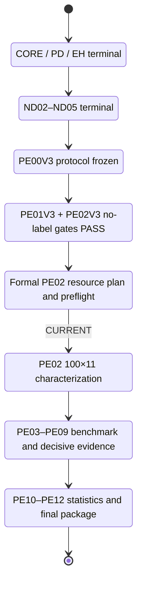
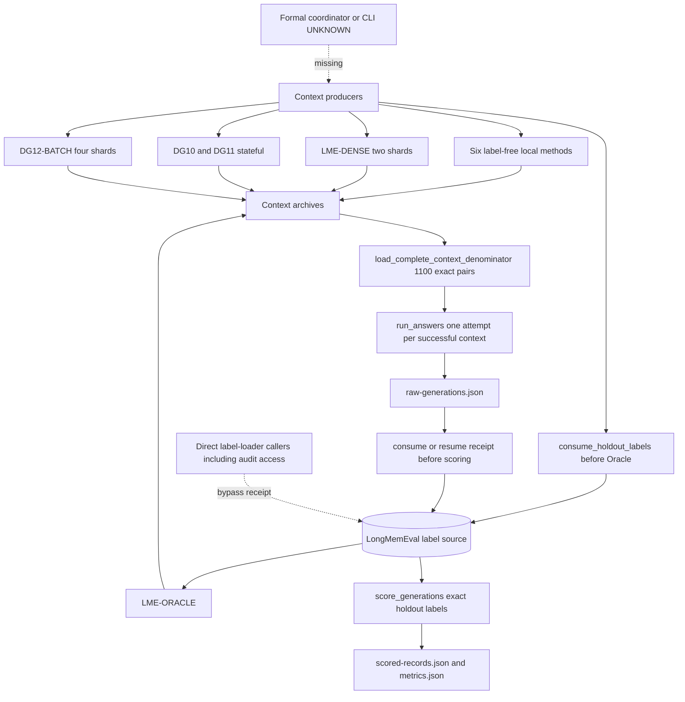
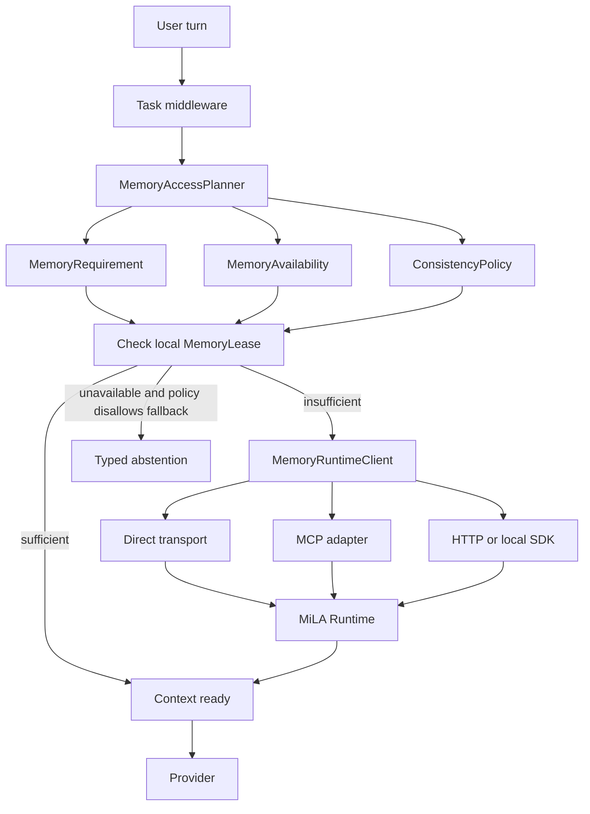

# MiLAi DG-12 当前开发状态与后续设计分析

> 审阅日期：2026-08-25（Asia/Shanghai）  
> 审阅对象：`MiLAi_DG-12高效Benchmark与论文实验_GOALS.md` v0.9.1 及其代码、测试、状态账本、冻结清单和现有产物  
> 审阅方式：主线程只读代码追踪与产物交叉核验；独立 reviewer 做第二遍只读审计；未运行正式方法、未修改产品代码或 DG-12 状态  
> 当前结论：`FAIL / BLOCKED_BEFORE_FORMAL_START`——这是实验完整性审计 verdict，不是实验效果 verdict；PE02 尚无结果，且正式启动条件尚不可信  
> 证据优先级：可执行代码 > 测试/机器产物 > 状态账本 > GOALS/ADR > 命名  
> 独立审阅状态：`FAIL`；fresh `gpt-5.6-sol / ultra` reviewer 已完成，因同模型家族仅作 `provisional` 验收；原始 trace 见 [experiment-audit run02](../../.aris/traces/experiment-audit/2026-08-25_run02/EXPERIMENT_AUDIT.md)  
> 完整性事件：reviewer 为核验 ground-truth provenance，绕过 v3 consumption API 直接读取了 label-bearing LongMemEval source；没有产生正式输出或 receipt，但“标签从未被任何进程读取”已不再成立，须由 owner 裁决

## 📋 1. Executive Summary

1. **DG-12 当前不在产品开发阶段，而在正式论文实验启动前的完整性阻断阶段。** `CORE00～02`、`PD00～02`、`EH00～04`、`ND00～05` 均已 terminal；机器状态是 `PAPER_PROTOCOL_V3_FROZEN_GATES_PASS_FORMAL_PE02_AUTHORIZED`，但 `DG12-PE02V3` 仍是 `AUTHORIZED_FORMAL_RESOURCE_PREFLIGHT_PENDING`。证据：`var/dg12/current-state.json:593,624-644`。
2. **正式 PE02 尚未执行，官方结果计数仍为 0。** consumption receipt、formal contexts、v3 generations、answer records、scored records 和 metrics 均不存在；1,100 cells 只是计划数。独立 reviewer 读取了底层 label source，因此必须区分“官方 PE02 consumption=0”与“标签字节从未被访问”；后者已不成立。
3. **v3 manifest 当前 56/56 字节匹配，但这不是可信执行根。** `require_paper_v3_ready()` 接受 caller 提供的 manifest，不钉住 canonical path/hash、精确 56-file inventory 或 mandatory owner files；现有 test 证明单文件替代 manifest 也能通过。证据：`evals/paper/dg12_v3/freeze.py:47-111`；`tests/test_dg12_paper_v3.py:235-323`。
4. **PE02 的真实角色已降为 11-method LongMemEval characterization。** 它不是 `C-BOUNDARY-001` 的确认实验，也不能从结果中复活该 claim；其计划规模为 100 cases × 11 methods = 1,100 cells。
5. **原选择性边界 claim 已在正式执行前失去支持。** 两个独立 annotation stream 都由同一模型 `gpt-5.6-sol/xhigh` 产生；raw agreement 为 0.992、κ 为 0.711，合格共识仅 LongMemEval 1、BEAM 0，低于每 partition 8 的阈值，因此 `C-BOUNDARY-001=UNSUPPORTED`。attestation 声明了隔离/盲法，但 repository 不能独立证明运行时隔离。
6. **`C-EMPIRICAL-001` 仍只是窄范围候选。** 当前证据允许 synthetic mechanism / governed Agent contract characterization，但 support 仍待 PE08 与 PE09 建立，不能宣称 broad quality、speed、safety、novelty 或 SOTA。
7. **PD02 已终局失败，不能重跑或补发性能主张。** online hard/non-inferiority gate 失败，deep/cold 没有建立所需 matched blocks；保留的是功能路径和负面瓶颈证据，不是 2×/5× speed claim。
8. **当前产品 `prefetch` 已经是 Host-controlled memory access，但 transport 仍硬绑定 MCP。** OpenWorker 在 provider 前完成 Task/Need/Route，调用隐藏 `milai_prepare_context`；`auto` 才是 model-visible tool loop。MCP/Runtime 不可达时 `prefetch` 返回 `UNKNOWN` 且不调用 provider。
9. **PE02 的 `DG12-BATCH` 并不走完整 OpenWorker 产品路径。** 冻结身份明确是 `evaluation adapter → MCP → Runtime`，且 `openworker_route=false`；实现还为每个 case 新建数据库、迁移、摄取、查询并清理。因此 PE02 不能证明 OpenWorker E2E，也不能承载产品速度 claim；该职责留给 PE08。
10. **当前最严重的 gate 问题不只是缺 resource preflight，而是 trust root 可由 caller 替换。** `require_formal_execution_ready()` 不固定 canonical manifest/auth，不解析 terminal schema/status，只校验 caller 指向文件的 hash；现有测试用 `{"status":"PASS"}` 的最小文件即可授权。正式 resource plan/preflight 也不在 guard 中。证据：`freeze.py:114-156`；`tests/test_dg12_paper_v3.py:235-323`。
11. **正式 artifact provenance chain 不闭合。** `run_answers()` 接受 caller 选择的 input、schedule、archives 与 budgets；context merge 丢失 producer/run/archive identity；generation 不绑定 freeze/auth/provider weights；score 可接受 provenance 不充分甚至手工构造的 1,100-pair payload；resume 也不验证 prompt/input/context drift。证据：`runner.py:73-98,171-196,224-375,464-560`。
12. **冻结 metric 与执行预算存在正式启动前必须解决的矛盾。** NDCG 的 IDCG depth 是 `min(|relevant|, |returned|)`，随预测返回数变化；registry 写 `completion_tokens_max=512`，provider 实际固定 `MAX_OUTPUT_TOKENS=256`，memory/prompt budgets 与 authorization 的 8/4/2 operating point 也未被 guard 精确绑定。证据：`scorers/longmemeval.py:67-83`；`producer-registry.json:22-35`；`provider.py:16-18,165-179,303-338`。
13. **v3 没有稳定的正式执行 CLI/coordinator。** producer registry 只列 Python function entrypoint，repository 中没有调用这些 v3 functions 的正式 orchestrator；因此 shard union、全局 4-process semaphore、GPU 绑定、service-window 顺序、resume 和 cleanup 尚未形成可复现命令图。
14. **下一步必须拆成两条不互相污染的 lane。** Lane A 只关闭当前 DG-12 PE02 的正式执行完整性；Lane B 在 successor architecture 中实现 Host-native、transport-neutral Memory Control Plane。不能用 Lane B 改动当前 frozen PE02 candidate。
15. **任何下一步之前先做 owner disposition。** owner 需要先裁决本次 untracked label access 是否使 holdout 失效、需要隔离/重抽样/显式 successor，或可以保留但必须披露；随后才可裁决 metric/budget 与 machine-enforced start seal。主线程不会替 owner 改写 `current-state.json`。

当前状态卡：

| 维度 | 真实状态 | 结论 |
| --- | --- | --- |
| Product candidate | EH04 refrozen；manifest `cdf3d942…` | 不重开、不调参 |
| PD02 | `TERMINAL_TARGET_MISS` | 功能 retained；无产品 speed claim |
| Paper protocol | v3 manifest frozen；56/56 hashes match | self-declared 字节集合一致；非独立 trust root |
| No-label gates | PE01V3 PASS；PE02V3 PASS | 只证明无标签计划/身份门通过 |
| Formal authorization | 已生成 `d67c8c82…` | caller-substitutable，且未验证 terminal 语义/正式资源门 |
| Formal PE02 | resource plan/preflight pending | owner 处理 label incident 前不得启动 |
| Formal outputs | 官方 consumption/context/generation/score/metrics 均为 0 | 无 paper result；底层 label source 已被 reviewer 非正式读取 |
| Boundary claim | unsupported before formal execution | 不可被 PE02 复活 |
| Empirical claim | pending PE08/PE09 | 仍是假设/待证 contract claim |
| Independent integrity review | `FAIL`，same-family provisional | 启动完整性不合格；不是 PE02 效果失败 |

## 📍 2. Evidence Baseline 与开发状态

### 2.1 当前状态以哪个文件为准

对“现在做到哪一步”的判断，应优先使用以下组合，而不是只读 GOALS 中某一段：

1. `var/dg12/current-state.json`：当前原子状态；更新时间 `2026-08-25T02:57:42Z`。
2. `var/dg12/ledger.jsonl`：各 work package 的 append-only artifact 记录。
3. `var/dg12/freeze-v3/paper-freeze-manifest.json`：v3 字节、方法、并发、claim 边界。
4. `var/dg12/formal-execution-authorization-v3.json`：两个 no-label gate 的授权收据。
5. `var/dg12/runs/*/terminal.json`：具体 gate 的 terminal。
6. GOALS：规定 intended process，但其中存在未同步段落。
7. `.aris/traces/experiment-audit/2026-08-25_run02/`：fresh reviewer 的原始 prompt、response 与 provisional `FAIL` verdict。

这里有一个不能被 machine state 覆盖的审计事实：`current-state.json` 与正式 consumption path 仍记录“未打开/0 receipt”，但 reviewer 已在该路径之外读取 label-bearing source。下图仍表示 **repository 的官方状态机**，不表示“无人接触过标签”。



### 2.2 Work package 恢复

| 范围 | 当前状态 | 代码/产物含义 |
| --- | --- | --- |
| `CORE00～02` | PASS | 产品 owner、package boundary、clean wheel 与基础 OpenWorker/MCP E2E 已建立 |
| `PD00～01` | PASS | 通用观测、batch embedding、长生命周期产品路径已 retained |
| `PD02` | `TERMINAL_TARGET_MISS` | FP2～FP5 功能路径 retained；FP6、deep、cold 目标失败，禁止重跑 |
| `EH00～04` | PASS | 薄 evaluation adapter 与最终 retained product/harness identity 已复验 |
| `ND02～05` | terminal signal/package | 有机制信号与 bounded novelty 结论，但不是 paper claim support |
| `PE00` v2 | PASS with gaps discovered | 历史协议保留；其 PE02 被执行缺口阻断 |
| `PE00V3` | `PASS_PROTOCOL_V3_FROZEN` | v3 successor manifest 已写入并通过 hash guard |
| `PE01V3` | `PASS_NO_LABEL_GATE` | v3 identity 无标签 reconfirmation PASS |
| `PE02V3` | `AUTHORIZED_FORMAL_RESOURCE_PREFLIGHT_PENDING` | 当前唯一 active work |
| `PE03～09` | blocked by PE02 | 正式 benchmark/E2E/ablation 未开始 |
| `PE10～12` | blocked by formal results | statistics、reflection、final package 未开始 |

### 2.3 文档、状态与代码之间的冲突

| 主题 | Documented | Implemented / machine state | Status |
| --- | --- | --- | --- |
| 当前动作 | GOALS header 与 §22：建立正式 PE02 resource plan，预检后才能开标签 | `current-state.json` 同样列出这两个 allowed actions | 一致 |
| PE00V3 状态 | GOALS §18.2 仍写 `IN_PROGRESS_AUTHORIZED_PRE_LABEL_SUCCESSOR` | `current-state.json` 写 `PASS_PROTOCOL_V3_FROZEN`；manifest status 为 frozen | **GOALS 段落陈旧** |
| PE02 状态 | GOALS §18.2 仍展示 v2 `BLOCKED_PRE_LABEL_PROTOCOL_AND_HARNESS_GAPS` | v2 状态仍保留，但 v3 已进入 formal resource preflight pending | **历史与当前未并列解释清楚** |
| “正式授权”语义 | GOALS/current-state：no-label auth 后仍须正式 resource preflight | `require_formal_execution_ready()`：现有 auth 已足够进入 producers/answers/scoring | **关键 mismatch** |
| Trust root | manifest/auth 被文档当作 canonical execution identity | guard 接受 caller 提供的 manifest/auth；terminal 只验 hash、不解析真实 schema/status | **可执行授权可被替代输入满足** |
| 当前协议指针 | `current-state.protocol.path` 仍指向 v2 `freeze/protocol.yaml` | 同一 state 另外绑定 v3 manifest、v3 terminals 和 v3 authorization | **ownership/命名歧义** |
| v3 protocol status | `protocol.yaml` 仍写 `READY_FOR_ONE_WAY_MANIFEST_SEAL` | v3 manifest 已是 `PAPER_PROTOCOL_V3_FROZEN` | **冻结后状态未回写/未用 successor 指针表达** |
| PE02 denominator | GOALS 同时定义 holdout-100 与 full-500 characterization | v3 protocol 只冻结 holdout 100 × 11 = 1,100 cells | **正式 scope 不唯一** |
| OpenWorker scope | GOALS 要求 later formal MiLAi arm 使用 OpenWorker/MCP | v3 明确 PE02 `DG12-BATCH` 不走 OpenWorker，full route 延后 PE08 | **需要显式 supersession/scope 决议** |
| 标签访问状态 | state/manifest/receipt 表示正式 labels 未打开 | independent reviewer 直接读取 label source，未走 v3 consumption API | **官方计数仍 0，但操作事实已偏离声明** |
| candidate modified | current-state 相对 DG11 写 `modified=true / EH04_REFROZEN` | v3 manifest 写 `candidate_modified=false` | 非直接冲突：后者指 freeze 后未再改；应补 scope 说明 |

### 2.4 Git 开发上下文

当前目录是 Git repository，但 `main` **没有任何 commit**，所有文件均显示为 untracked。因此：

- 可以恢复当前 workspace 字节状态；
- 无法通过 commit history 判断修改先后、作者、回滚点或“最近频繁变化”的模块；
- `[UNKNOWN]`：当前 workspace 是否对应某个外部 repository commit 或导入 snapshot。

## 🏗️ 3. 当前产品架构与控制权

### 3.1 CURRENT IMPLEMENTATION

当前 OpenWorker 有三种 memory mode：`none`、`prefetch`、`auto`。其中真正接近目标架构的是 `prefetch`：Host 在 provider 之前管理 memory，模型看不到隐藏的 `milai_prepare_context`。实际 console entrypoint 是 `milai-openworker-adapter = milai_openworker_mcp.host_adapter:main`；同目录的 `adapter.py` 是被 wheel 明确排除的 legacy source，不能把它误认为当前产品入口。证据：`integrations/openworker-mcp/pyproject.toml:15-28`。

```mermaid
flowchart LR
    accTitle: 当前 OpenWorker prefetch 产品路径
    accDescr: OpenWorker Host 在 provider 前解析 task 和 memory need，经 MCP over UDS 调用 Runtime，由 PostgreSQL canonical state 完成验证，再把编译后的 Context 注入 provider messages。

    user[User turn] --> adapter[OpenWorkerProviderAdapter.complete]
    adapter --> identity[Host task state and relation]
    identity --> need[Deterministic Need and requested route]
    need --> controller[TaskMemoryController]
    controller --> uds[McpUnixClient over profile UDS]
    uds --> hidden[Hidden milai_prepare_context]
    hidden --> runtime[Runtime PrepareContextService]
    runtime --> gate[Canonical and OpenIssue validation]
    gate --> postgres[(PostgreSQL canonical core)]
    gate --> envelope[Context envelope and validation token]
    envelope --> compiler[Host context compiler and local slot]
    compiler --> prompt[Compile agent messages]
    prompt --> provider[Provider execution]
```



真实调用点：

- `integrations/openworker-mcp/pyproject.toml`：当前 console entrypoint 指向 `host_adapter:main`，`15-18`；legacy `adapter.py` 被 wheel exclude，`26-28`。
- `integrations/openworker-mcp/src/milai_openworker_mcp/host_adapter.py::OpenWorkerProviderAdapter.complete()`：入口及 provider 前控制，`671-1262`。
- `host_adapter.py::_bind_task_state()`：解析 Host-owned `milai_task_state`，经 relation resolver、transition validator 和 registry CAS 绑定 task，`548-669`。
- `integrations/openworker-mcp/src/milai_openworker_mcp/task_binding.py::DeterministicTaskRelationResolver.resolve()`：CONTINUE/SUBTASK/SWITCH/RETURN/AMBIGUOUS，`89-219`。
- `integrations/openworker-mcp/src/milai_openworker_mcp/controller.py::build_task_memory_controller()`：把 controller 绑定到 MCP，`81-96`。
- `integrations/openworker-mcp/src/milai_openworker_mcp/transport.py::McpUnixClient.prepare_memory_context()`：隐藏 MCP composite call，`253-300`。
- `runtime/src/milai/api/context_routes.py::prepare_context()`：HTTP `/v1/memory/prepare-context`，`90-101`。
- `runtime/src/milai/application/context_preparation.py::PrepareContextService.prepare()`：Runtime control plane，`55-456`。

### 3.2 关键 decision ownership

| Decision | 当前 owner | 输入 | 输出 | 证据 |
| --- | --- | --- | --- | --- |
| Task identity/state | OpenWorker Host | explicit `milai_task_state`；缺失时用 request user/configured session/run-local ID 构造受限 fallback | `TaskIdentityState` + `TaskMemoryBinding` | `host_adapter.py:548-625`；`task_state.py:57-175,177-316` |
| Task relation/transition | OpenWorker Host | normalized relation、operation ID、registry snapshot、generation/revision | CONTINUE/SUBTASK/SWITCH/RETURN/AMBIGUOUS + CAS transition | `task_binding.py:89-315` |
| Active goal | OpenWorker Host payload | `active_goal_id/version/summary`；fallback 为固定“Continue…”摘要 | bound active goal | `task_state.py:177-208,263-298` |
| Task epoch | OpenWorker Host composition | `task_id + task_generation` | transport-facing `task_epoch` | `host_adapter.py:610-633` |
| Memory Need | deterministic client resolver | current question、Host state keys/claims/issues、previous Need | NONE/L0/L1 typed need | `host_adapter.py:717-786`；`memory_need.py:137-240` |
| Initial route | OpenWorker Host | Need、relation constraint、event、retained slot | NONE/CACHE/L0/L1 request | `host_adapter.py:102-127,735-943`；`task_memory.py:167-245` |
| Route safety override | Runtime | event、locator、authority | validated route | `context_preparation.py:838-851` |
| CACHE hit | Runtime | signed prior token、binding、Need coverage、canonical/OpenIssue snapshot | `UNCHANGED` + refreshed token | `context_preparation.py:458-553` |
| Retrieval | Runtime | validated L0/L1 request | governed retrieval envelope | `context_preparation.py:156-242` |
| Context construction | Runtime + client | canonical retrieval → capsule；capsule → model rendering | Context envelope/local slot | `context_preparation.py:245-335`；`task_memory.py:306-392` |
| Provider call | OpenWorker Host | compiled messages | answer | `host_adapter.py:1190-1262` |
| Memory-unavailable fallback | OpenWorker Host | MCP error or unavailable Context | `UNKNOWN`，provider_call=false | `host_adapter.py:944-977,1122-1135,1168-1189` |

### 3.3 Evidence → StateView → Context 的真实映射

| 逻辑层 | 当前实现 | Source of truth / lifecycle |
| --- | --- | --- |
| Evidence | `/v1/evidence`、Proposal、Review、worker projection；benchmark 也用同一治理写链 | Evidence 与 canonical Claim/OpenIssue 最终落 PostgreSQL；不是 Context cache |
| StateView | canonical claim head、OpenIssue、current-state envelope、state-key coverage | Runtime 在读取/prepare 时解析；由 canonical frontier 和 issue revision 约束 |
| Context | context capsule、compiled rendered context、`TaskMemorySlot` | execution-conditioned；Host process-local，可复用但每次 CACHE 仍须 Runtime validation |
| Runtime/control | Need、route validation、budget、cache proof、provider fail-closed | Host 和 Runtime 共同控制；模型不拥有 `prefetch` 决策 |

这里最重要的 current invariant 是：**local slot 和 Context 不是 truth source。** `PrepareContextService._validate_cached()` 在复用前检查 Need coverage、policy identity、canonical position 与 OpenIssue revision；canonical unavailable 或 frontier 变化时返回 miss/unavailable，而不是把 TTL 当作 CURRENT。

### 3.4 `prefetch` 与 `auto` 不是同一条路径

- `prefetch`：Host 直接调用隐藏 composite tool；provider 只看到编译后的 messages。
- `auto`：当 incoming tools 含 `milai_recall` 时，adapter 先返回 `tool_calls`，外部 Agent/MCP loop 再把 tool result 带回；这是 tool-mediated compatibility path。
- `none`：明确不请求 memory。
- MCP/Runtime 不可达目前没有 `REUSE_ONLY` 或 snapshot policy；`prefetch` 直接 fail closed 为 `UNKNOWN`。

因此，“Memory 已经完全 Host-native”是错误表述。准确说法是：

> Current：Host-controlled prefetch over hidden MCP。  
> Intended：Host-native、transport-neutral Memory Control Plane。  
> Gap：控制权已部分上移到 Host，但 transport、availability 和 lease semantics 尚未解耦。

## 🔄 4. DG-12 PE02 的真实执行链

### 4.1 冻结矩阵

| Lane | 方法 | 数量 | 当前 entrypoint | 备注 |
| --- | --- | ---: | --- | --- |
| Stateless/local | CTRL-NONE、CTRL-FULL、CTRL-TRUNC-FULL、CTRL-CUSTOM-LEX1、LME-BM25-S、LME-BM25-T | 6 | `controlled_contexts.prepare_contexts()` | 8 threads |
| Dense | LME-DENSE | 1 | `imported_contexts.run_dense()` | 2 processes，GPU2/3 |
| Legacy stateful | DG10-FROZEN、DG11-FULL | 2 | `imported_contexts.run_legacy_milai()` | 各 process 内 1 worker |
| Current DG12 | DG12-BATCH | 1 | `dg12_contexts.run()` | 最多 4 shards；不是 OpenWorker route |
| Label upper bound | LME-ORACLE | 1 | `controlled_contexts.prepare_contexts()` | intended v3 path 在读取前写 receipt；loader 本身可被绕过 |
| Answer/score | 全部成功 Context + retained failures | 1,100 cells | `runner.run_answers()` / `score_generations()` | 1 attempt，0 retry，8 answer workers |

7 个 native shared-context methods（Mem0、Hindsight、Graphiti、ReMe、3×OpenViking）被明确排除在 PE02 controlled matrix 之外；它们是 pre-label technical exclusion，不是依据分数做的 quality exclusion。

### 4.2 代码中可恢复的执行顺序



Observed call path：

1. `plan.build_lme_plan()` 读取 label-free holdout inputs 和 frozen schedule，按固定 sort + Latin row 生成 100×11 cells；`evals/paper/dg12_v3/plan.py:43-127`。
2. 各 producer 独立生成 context archive；不存在统一 v3 CLI，也没有 repository caller 调用这些 v3 entrypoints。
3. `runner.load_complete_context_denominator()` 要求每个 case/method pair 恰好一次，缺失或重复都会拒绝。
4. `runner.run_answers()` 对成功 Context 调用 frozen vLLM；Context terminal 不调用 provider，answer failure 保留；`runner.py:224-375`。
5. `controlled_contexts.prepare_contexts()` 的 **intended v3 Oracle path** 在读取 label fields 前调用 `consume_holdout_labels()`；但 label loader 本身不强制该 capability，其他 caller 可绕过；`controlled_contexts.py:126-145`；`datasets/longmemeval.py:137-145`。
6. `runner.score_generations()` 再次校验 frozen holdout、1,100 pairs，读取 dataset labels，计算 deterministic answer/retrieval metrics；`runner.py:452-561`。

### 4.3 `DG12-BATCH` 的真实产品路径

`DG12-BATCH` 不是 persistent OpenWorker task benchmark。真实实现为：

```text
dg12_contexts.run()
  → legacy._product_case()
  → legacy._runtime_context_with_embedding_accounting()
  → lme_product_smoke._runtime_context()
  → per-case create PostgreSQL database
  → Alembic migration
  → start Runtime API
  → Evidence → Proposal → Review for every session
  → worker projection
  → MCP milai_recall
  → compact Context
  → stop API + drop database
```

证据：`evals/paper/dg12_v3/dg12_contexts.py:145-205`；`evals/benchmark/lme_product_smoke.py:668-977`。这条路径正确使用 governed write/read semantics，但有三个边界：

- 它是 evaluation adapter，而非完整 OpenWorker provider middleware；
- 它每 case 建库/迁移/清理，不代表长期 Host runtime；
- 它 import legacy/private evaluation helpers，和 GOALS 中“eval adapter 不应拥有产品 lifecycle、不得 import 私有 helper”的目标仍存在 gap。

### 4.4 当前没有的正式结果

本次检查没有找到以下 v3 artifact schema：

- `milai.dg12.paper-longmemeval-generations.v3`：0 个；
- `milai.dg12.paper-longmemeval-metrics.v3`：0 个；
- `LABELS_OPENED_FOR_FORMAL_ORACLE_OR_SCORING` consumption：0 个。

因此任何 PE02 quality、latency、token、retrieval 或 answer 结果都属于 `[NOT AVAILABLE]`，不能从 smoke、preflight 或定义好的 metric function 推断。这里的“0”是 **official PE02 artifact/receipt count**；independent reviewer 已在 v3 API 之外读取底层标签源，不能再把 0 receipt 推导成 0 operational access。

| Artifact / denominator | Exact current count | Interpretation |
| --- | ---: | --- |
| Label source rows available | 500 | benchmark dataset rows；不是 prediction |
| Frozen formal holdout | 100 | planned cases |
| Planned method/case cells | 1,100 | 100 × 11；尚未 materialize |
| Official PE02 label rows consumed/read | 0 | 仅指 v3 formal path；不包含 reviewer bypass access |
| One-way consumption receipts | 0 | receipt absence不能证明没有其他 process access |
| PE02 formal Context records | 0 | 无 archive set |
| v3 generation archives / answer records | 0 / 0 | provider 未运行 |
| Formal scored records / metrics | 0 / 0 | scorer 未运行 |
| Preformal model annotations | 1,000 + 500 consensus | 两个同模型 stream × 500，加 consensus；不是 PE02 GT/result |
| Legacy PE01 smoke Contexts | 20 | development evidence；不计 formal denominator |

## 🧪 5. Claim、测试与实验完整性

### 5.1 Claim 状态

| Claim / conclusion | 当前证据 | 状态 | 可写范围 |
| --- | --- | --- | --- |
| `C-BOUNDARY-001` | 500-case blind annotation；eligible 1/0 < 8/partition | **Unsupported** | 只能报告低 prevalence 与 negative result；不可复活 |
| `C-EMPIRICAL-001` | synthetic mechanism controls + one natural characterization candidate | **Pending PE08/PE09** | 窄 contract characterization，不是广泛质量/性能结论 |
| PD02 product speed | online/deep/cold terminal miss | **Unsupported** | 报告真实瓶颈与负面结果 |
| PE02 LongMemEval | 尚无正式输出 | **Not evaluated** | 只能称为 preregistered 11-method characterization |
| Full OpenWorker E2E | PE02 route 明确不使用 OpenWorker | **Pending PE08** | PE02 不得替代 PE08 |
| Learned Task Resolver | deterministic resolver calls model/embedding/retrieval = 0；训练禁用 | **Not implemented / parked** | 只有未来 successor goal 可提出 |

### 5.2 当前 scorer

`evals/paper/scorers/longmemeval.py` 提供一套 MiLAi custom deterministic scorer：

- answer：exact match、normalized F1；
- retrieval：Hit@k、NDCG@k、relevant coverage@k；
- provider/context failure：在 primary denominator 中计 0，而不是 complete-case 删除。

answer normalization 是常规 NFKC、casefold、标点/冠词处理，EM/F1 对 dataset reference 取最大值；没有发现 answer score 除以模型自身 best score。**但 retrieval NDCG 的 IDCG 不是固定 `@k` denominator**：`scorers/longmemeval.py:67-83` 使用 `min(len(relevant), len(unique_ranked))` 作为 ideal depth，返回 1 个且命中时，即使有多个 relevant sessions 也可能得到 NDCG 1.0。`relevant_coverage_at_k` 另行暴露 recall，但当前 NDCG 仍是 prediction-count-conditioned metric，必须在正式 scoring 前明确保留、改名或 successor/refreeze。

ground truth 的 answer(s) 与 `answer_session_ids` 来自 frozen LongMemEval dataset，不是模型 prediction；然而当前 formal runner 调用的是上述 custom scorer，而 `benchmark-source-manifest.json:13-21` 记录的 official LongMemEval evaluator 并未进入 PE02 call path。PE02 尚无 metrics artifact，因此这里只能描述 metric implementation，不能声明 real-GT 实验结果。

### 5.3 v3 测试真实覆盖

`tests/test_dg12_paper_v3.py` 当前有 13 个 test function，覆盖：

| Area | 已覆盖 | 未覆盖 |
| --- | --- | --- |
| Schedule/plan | namespace drift、11 methods、1,100 pairs、native matrix 分离 | 正式 coordinator 的完整命令图；full-500/holdout-100 scope 决议 |
| Annotation | 500×2 denominator、one-sided eligibility 不晋级 | operational isolation；numeric occurrence 是否真实指向 `numeric_text`/unit |
| Context denominator | retained failure、missing pair rejection | 真实/合成 1,100-cell 多 archive merge；archive producer/run/input identity |
| Answer runner | failure retained、no retry、resume、8-way concurrency | wrong input/question/prompt/context、provider/weights identity、resume drift、精确 budgets |
| Sharding | DG12 4-shard、dense 2-shard union/intersection helper | 全局 stateful process semaphore 与 GPU exclusive lock |
| Freeze/auth | frozen byte hash、authorization absent、two gate hashes | canonical trust anchor；真实 terminal schema/status；resource plan/preflight/start seal |
| Label/scoring | 无 v3 end-to-end test | exclusive/concurrent first consumption、Oracle→score、fixed-k NDCG、custom-vs-official scorer contract |

本次是只读审阅，没有重新执行 test suite；“PASS”仅引用现有 terminal/fixture，而不是本轮新跑结果。

### 5.4 Architecture invariants 的执行程度

| Invariant | 证据 | 状态 |
| --- | --- | --- |
| Frozen files cannot drift | `require_paper_v3_ready()` 对 caller manifest 中的 hashes 校验 | Partial；本次 canonical manifest 56/56 match，但 guard 不钉住 canonical trust root |
| Every case/method remains in denominator | plan + denominator + scorer pair checks | Enforced |
| Failed answer gets no retry | `RetainingAnswerRunner` + frozen config | Enforced |
| Formal labels only on frozen holdout | intended Oracle/scorer consumption path | Partial/procedural；direct label readers存在，receipt first-write 可竞态，本次 reviewer 已绕过访问 |
| Formal methods wait for canonical authorization | producers/answer/scorer call v3 auth guard | Partial；caller 可替代 manifest/auth，terminal 内容未解析，且缺最终 resource start gate |
| Frozen metric and operating point are exact | protocol/registry/auth 声明 metric/budget/concurrency | Not enforced；NDCG depth 可变，512/256 冲突，memory/prompt 与 8/4/2 未完全绑定 |
| Every producer failure becomes terminal | DG12-BATCH catches all exceptions | Partial；controlled methods only catch CTRL-FULL limit exception |
| Result provenance binds all execution identities | manifest binds code before run | Partial；generation/result artifact chain 不完整 |
| Full OpenWorker path is separately tested | protocol assigns it to PE08 | Documented; not yet executed |

## 🚨 6. 当前问题、风险与语义歧义

以下排序只面向 correctness、实验完整性和架构边界，不包含 style 建议。

| ID | Priority | Observed issue | Evidence | Potential consequence |
| --- | --- | --- | --- | --- |
| R0 | **P0** | independent reviewer 绕过 v3 consumption path 读取 label-bearing source；official receipt/state 仍为 0 | run02 raw review；`runner.py:413-449` | holdout 的未见性/流程完整性已不再可由 receipt 证明；必须 owner disposition，不能由本报告假定仍可用 |
| R1 | **P0** | executable trust root 可被 caller 替换，且 gate terminal 只验 hash 不验语义；正式 resource gate 也缺失 | `freeze.py:47-156`；`tests/test_dg12_paper_v3.py:235-323` | substitute manifest + minimal PASS files 可获得授权，无法证明运行基于 canonical frozen contract |
| R2 | **P0** | metric/frozen operating point 不一致：NDCG ideal depth 依赖返回数，completion 512/256 冲突，memory/prompt 与 8/4/2 未精确绑定 | `scorers/longmemeval.py:67-83`；registry `22-35`；provider `16-18,165-179,303-338` | 方法间 metric 不可按固定 @k 解释，formal run 可在不同预算/并发上执行 |
| R3 | **P0** | provenance chain 未绑定 input/question、schedule、archive producer/hash、provider/weights、freeze/auth/start、scorer；resume 不拒绝 prompt drift | `runner.py:73-98,171-196,224-375,464-560` | wrong-source 或 handcrafted generation 可能被 scorer 接受，旧 terminal 可被错误复用 |
| R4 | **P0** | 无唯一正式 coordinator/CLI，global process/GPU/DB/service-window 约束没有单一 owner | v3 无 `main`/CLI；registry 仅 function strings | ad-hoc orchestration 可改变 shard、并发、resume、资源隔离和 cleanup |
| R5 | **P1** | label closure 只在 intended v3 caller 中按约定执行；存在 direct readers，first receipt 是 check-then-replace | `datasets/longmemeval.py:137-145`；`prepare_inputs.py:108-146`；`lme_product_smoke.py:432-482`；`runner.py:46-54,440-448` | 非正式 caller 可无 receipt 读标签；两个 first consumer 可能并发进入不同 run |
| R6 | **P1** | controlled producer 未兑现“所有 method/case failure retained” | `controlled_contexts.py:154-219` 只捕获特定 `ValueError` | 任意其他 exception 可中止整批而不是产生 denominator terminal |
| R7 | **P1** | PE02 arm 与主产品/GOALS OpenWorker scope 不同 | protocol `110-115`；manifest `51-54`；GOALS `214-257` | PE02 不能证明 OpenWorker E2E 或 product speed，且是否满足 GOALS formal arm 尚未裁决 |
| R8 | **P1** | 当前主 paper boundary claim 已失去 prevalence support | claim disposition + protocol `37-42` | PE02 成本不能转化为原定核心 claim；论文定位必须收窄 |
| R9 | **P1** | GOALS/v2-v3 active pointer、v3 pre-seal status、holdout-100/full-500 scope 均未同步 | GOALS `3047-3057,3680-3713`；current-state `594-603`；protocol `1-5,59-73` | operator 可能选择错误 protocol、denominator 或 gate |
| R10 | **P1** | eval path import private legacy helpers并拥有 per-case DB lifecycle | `dg12_contexts.py:145-153,202-205`；`lme_product_smoke.py:668-977` | 与 product-core-first ownership 目标存在 gap；冻结后又不能静默修正 |
| R11 | **P1** | 两个 annotation stream 都来自同一模型家族，隔离只由自述 attestation 证明 | manifest `56-68`；annotator attestations | annotation agreement 不能被描述为 human/cross-model independent GT |
| R12 | **P1** | Task identity 与 binding 已分离，但 Host registry、retained Context 和 last Need 是 process-local maps，identity 还有 request-derived fallback | `task_binding.py:259-268`；`host_adapter.py:519-529,548-575` | restart/跨进程 continuity 与 durable Host ownership 未证明 |
| R13 | **P1** | Need 与 availability 仍没有 typed separation | MCP error 直接 `UNKNOWN`：`host_adapter.py:944-977` | 无法表达 memory required-but-unavailable 与 `Need=NONE` 的差别 |
| R14 | **P2** | v3 仍保留旧 namespace/DG11 path；同包 legacy `adapter.py` 名称相近但不进 wheel | `schedule.py:14`；`runner.py:38-39`；`pyproject.toml:15-28` | 审阅和自动化容易恢复错误 identity/entrypoint |
| R15 | **P2** | Git 无 commit history，workspace 全 untracked | `git status` / `git log` | 无法由版本控制证明 lineage、review 或 recovery point |

R0–R4 都是正式启动 blocker，不是要求主线程立即修改 frozen runner。当前诚实动作是：**保持 formal execution 停止，先封存 label-access 事实并取得 owner disposition，再决定 successor/refreeze 或外部强制 launcher。**

## 🎯 7. 后续设计 A：关闭当前 DG-12 正式执行链

### 7.1 设计目标

本 lane 只解决一个问题：先确定 holdout 与 frozen contract 是否仍可用，再让“允许开始 PE02”成为可机读、可验证、可追溯且不可歧义的事实。第一项输入必须是对 R0 label-access incident 的 owner disposition。它不得：

- 修改 retained product candidate；
- 重跑 FP6 或重开 PD02；
- 静默改方法、样本、threshold、score、worker ceiling、attempt/retry；如决定修正 NDCG 或 512/256 等冲突，必须显式建立 successor/refreeze；
- 根据正式结果再改 protocol；
- 顺手实现 Host-native transport 或训练 resolver。

### 7.2 推荐增加 `FormalExecutionStartSeal`

建议在真正的 formal command graph 外层增加一个 start seal，至少绑定：

| Binding group | 必须字段 |
| --- | --- |
| Trust root | canonical manifest/auth absolute identity、expected manifest SHA、exact inventory/mandatory files、真实 gate terminal schema/status/hash |
| Protocol | v3 paper manifest SHA、no-label authorization SHA、claim-disposition SHA、label-access owner-disposition SHA |
| Resource decision | formal resource-plan SHA、resource-preflight terminal SHA、host snapshot time |
| Data | exact input path/SHA、schedule SHA、label source SHA（不读取内容）、tokenizer SHA |
| Metric/provider | scorer implementation/metric spec SHA、custom-vs-official decision、provider model/weights/tokenizer/prompt contract identity |
| Producers | producer-registry SHA、每个 source/config/wheel/product manifest SHA、archive producer/run identity |
| Execution | formal run ID、output root、method/cell count、exact memory/prompt/completion budgets、attempt/retry、8/4/2 operating point、service-window order |
| Isolation | vLLM GPU0/1、dense GPU2/3、4 physical CPU/32 GiB reserve、DB lease、port/process ownership |
| Recovery | checkpoint/resume policy、manual reconciliation condition、cleanup contract |
| Output chain | expected context archives、merged denominator、generation、score、metrics 的 identity schema |
| Authorization | `status=FORMAL_START_AUTHORIZED`、issued_at、owner decision、official formal consumption absent、prior audit exposure disclosed |

关键 invariant：

```text
label-access owner disposition permits continued use
AND canonical no-label authorization
AND formal resource plan PASS
AND resource preflight PASS
AND metric/budget contract is internally consistent
AND all bound identities match
→ formal start authorized
```

而不是：

```text
no-label authorization
→ formal start authorized
```

### 7.3 冻结边界带来的真实选择

`freeze.py`、`runner.py`、provider/scorer、producer files 和 test 都已经包含在 56-file manifest 中。owner 首先要决定本次非正式 label exposure 是否要求 quarantine/re-split；若仍允许使用该 holdout，再从下列两种 enforcement 方式中选择：

| 选择 | 做法 | Assurance | 代价 |
| --- | --- | --- | --- |
| **A. 窄范围 successor/refreeze（推荐）** | 在正式输出/receipt 仍为 0 时，由 owner 明确处理 exposure；修正并冻结 trust root、metric/budget、start seal、provenance 与 label API | Machine-enforced | 需要显式 protocol successor；若 holdout 失效还需重新定义 split |
| B. 外部 operational gate | 保留 frozen bytes；由独立 launcher 固定 canonical identities、metric interpretation、资源门和 label access 后才调用现有 functions | Procedural/external | runner 自身仍可绕过；512/256 与 NDCG 只能被如实接受/解释，不能静默修改 |

不能做的第三种选择是：静默修改 frozen files，并继续声称仍是同一 v3 identity。

### 7.4 正式产物应形成闭合 hash chain

建议的最小链：

```text
LabelAccessOwnerDisposition
  + CanonicalPaperFreezeManifest
  + NoLabelAuthorization
  + FormalResourcePlan
  + ResourcePreflightTerminal
  + FrozenMetricAndBudgetContract
        ↓
FormalExecutionStartSeal
        ↓
LabelFreeContextArchiveSet (1,000 cells)
        ↓
ExclusiveFormalLabelConsumptionRecord
        ↓
OracleContextArchive (100 cells)
        ↓
CompleteContextArchiveSetManifest (1,100 cells)
        ↓
GenerationArchive + UsageLedger
        ↓
ScoredRecords + Metrics
        ↓
PE02Terminal
```

具体补足点：

- start guard 必须固定 canonical manifest/auth/plan/preflight/disposition，并解析每个 terminal 的真实 schema/status；
- `run_answers()` 必须拒绝非 frozen holdout，而不只是 scorer 最后拒绝；
- Context archive set manifest 必须绑定每个 archive SHA、producer/run identity、input SHA、schedule、shard union/intersection；
- Generation archive 必须绑定 question/input bytes、context-set manifest、freeze/auth/start seal、provider/model/weights/tokenizer/prompt contract、exact budgets 和 usage-ledger root；
- Metrics 必须绑定 generation SHA、label dataset SHA、exclusive consumption record、scorer/metric-spec SHA，并声明 custom scorer 与 official evaluator 的关系；
- resume 只能在所有上游 identities 完全一致时发生。

### 7.5 推荐的正式执行顺序

1. **owner disposition R0**：记录 reviewer 访问范围，决定保留、隔离/重抽 split 或停止 PE02；不得把 0 receipt 当作“未暴露”的证明。
2. **冻结 metric/budget decision**：明确 variable-depth NDCG、custom-vs-official scorer、completion 512/256、memory/prompt budgets 与 8/4/2；任何变化走 successor/refreeze。
3. **无标签建立 formal resource plan**：写明唯一 coordinator/command graph、进程数、GPU、DB、ports、reserve、wall/storage、cleanup。
4. **运行真实 resource preflight**：验证当前服务、provider identity 和资源，不生成 Context/answer，不再读取 label；这不同于已 PASS 的 denominator/no-label gate。
5. **生成并校验 start seal**：official formal consumption/outputs 仍为 0，且 prior audit exposure 已绑定 disposition。
6. **先生成 10 个非 Oracle 方法的 1,000 个 Context cells**，合并前校验 archive identities 和 failure terminals。
7. **若 disposition 允许，独占创建 official consumption receipt，再生成 100 个 Oracle Context cells**；receipt 创建必须在 formal label-field read 之前且跨进程 race-safe。
8. **验证完整 1,100-cell denominator**，缺失/重复直接 terminal，不补方法、不缩 denominator。
9. **固定、已封存的 rolling window 跑 answer**；每个成功 Context 一次调用、失败不 retry；Context failure 不调用 provider。
10. **按冻结 metric contract scoring**；PE02 当前路径不需要 model judge，judge lane 不应被无故启动；随后封存 terminal/hash chain，结果只进入 characterization scope。

### 7.6 正式启动前最小测试增量

若 owner 选择 machine-enforced successor，应至少有：

- substitute/non-canonical manifest/auth、伪 `{"status":"PASS"}` terminal、缺 disposition/resource/start seal 时，所有 formal producer/answer/oracle/scorer 均 fail closed；
- `run_answers()` 对 wrong input/question/hash、wrong schedule、wrong archive producer/run、wrong context-set manifest 负测；
- generation/scorer 对 freeze/auth/start/provider/weights/tokenizer/scorer/context identity drift 与 handcrafted payload 负测；
- resume 对 prompt、input、question、method、context archive drift 必须拒绝；
- fixed metric math 测试覆盖 multi-relevant/fewer-returned NDCG；exact 512/256 resolution、memory/prompt budgets 与 8/4/2 operating point 均有负测；
- 1,100-cell synthetic/fake-provider E2E，不读正式 labels；
- controlled producer 任意 exception 都形成 typed terminal，不能中止 denominator；
- global stateful semaphore、dense GPU exclusivity、answer/judge window separation 测试；
- label consumption exclusive first-write、并发不同 run 冲突、same-run resume、Oracle→score transition、partial-output recovery 测试。

## 🧭 8. 后续设计 B：Host-native Memory Control Plane

### 8.1 这属于 successor，不属于当前 frozen PE02

`docs/adr/ADR-024-host-native-memory-control-plane.md` 已把该方向标为 `PROPOSED FOR ARCHITECTURE vNext / NOT IMPLEMENTED`。报告认可其方向，但必须保持三态分离：

| 维度 | CURRENT IMPLEMENTATION | INTENDED DESIGN | GAP |
| --- | --- | --- | --- |
| Control owner | `prefetch` 中 Host 决定 Task/Need/Route | 所有 preferred modes 由 Host middleware 决定 | 已有 precursor |
| Transport | `TaskMemoryController → McpPrepareContextClient → MCP/UDS` | `MemoryRuntimeClient` + Direct/MCP/HTTP transports | MCP composition hard-wired |
| Need | deterministic typed resolver | 独立 `MemoryRequirement` | 已实现一部分 |
| Availability | transport exception → UNKNOWN | FULL / LOCAL_REUSE_ONLY / UNAVAILABLE | 未建模 |
| Consistency | current request policy + online Runtime validation | STRICT_CURRENT / ALLOW_SNAPSHOT / BEST_EFFORT | 未独立建模 |
| Cache/slot | process-local `TaskMemorySlot` + validation token | portable, bound `MemoryLease` | 仅 precursor |
| Invalidation | 每 Turn pull validation | optional ordered push + pull fallback | Host-facing stream 未实现 |
| Capability | profile/socket 隐式能力 | authenticated capability negotiation；read/write 分开 | 未统一 |
| Tool-only | `auto` model/tool loop | Level 3 compatibility only | 当前仍容易被误写成主架构 |

### 8.2 目标结构



### 8.3 必须先冻结的 semantic contracts

1. `MemoryRequirement = NONE | EXACT | SEARCH | RECONSTRUCT`。
2. `MemoryAvailability = FULL | LOCAL_REUSE_ONLY | UNAVAILABLE`；`NO_MEMORY` 不是 availability。
3. `ConsistencyPolicy = STRICT_CURRENT | ALLOW_SNAPSHOT | BEST_EFFORT`。
4. `MemoryAccessPlan = f(TaskState, TaskRelation, Requirement, Binding, Coverage, Availability, Capabilities, Consistency)`。
5. `MemoryLease` 绑定 tenant/principal/Host/task/binding、Need coverage、state-key/claim/OpenIssue versions、canonical position、context digest、issued/expires、assurance 与 reuse policy。
6. 无 authenticated、ordered、gap-free invalidation assurance 时，offline TTL **不能**证明 `CURRENT`。
7. capability negotiation 把 exact/search/evidence recovery 与 capture/proposal/review 分开；普通 reader Host 不能因 transport 支持而获得 write authority。

### 8.4 推荐迁移顺序

1. 先抽象 transport-neutral request/response contract，不改变 Runtime semantic route。
2. 把现有 `McpPrepareContextClient` 包装为 `McpMemoryTransport`，保持当前 fail-closed 行为。
3. 引入 typed Requirement/Availability/Consistency 和统一 outcome；先完成 negative contract tests。
4. 把 `TaskMemorySlot` 演进为 bound lease，但仍要求 current assurance；不要先允许离线 CURRENT。
5. 再增加 Direct/HTTP transport，并用同一 fixtures 验证三种 transport 输出等价。
6. 最后考虑 push invalidation sidecar；stream gap/disconnect 必须立即丢失 CURRENT assurance。
7. 保留 `auto` tool-only 作为最低兼容模式，不把它写成 MiLA 的 memory semantic primitive。

### 8.5 与 DG-12 PE08 的关系

- 当前 DG-12 PE08 应按现有冻结 candidate 验证 **OpenWorker → MCP → Runtime**，不能中途替换成 Host-native direct path。
- successor benchmark 才比较 Level 1 Native Host、Level 2 MCP Host、Level 3 Tool-only；三者必须使用相同 memory semantics、Need cases 和 consistency policy。
- PE08/PE09 的现有结果如果尚未产生，不能作为立即修改当前 PE02 candidate 的理由。

## ✅ 9. 推荐执行路线与验收门

### 9.1 当前 DG-12 lane

| Gate | Action | PASS condition | Failure action |
| --- | --- | --- | --- |
| G-1 | label-access incident disposition | owner 签署 exposure 记录并明确 holdout retain/quarantine/re-split；选择有唯一 identity | 未裁决则 PE02 停止 |
| G0 | trust-root + metric/budget contract | canonical identities、真实 terminal schema、NDCG、custom/official scorer、512/256、memory/prompt、8/4/2 全部一致封存 | 建 successor/refreeze；不跑方法 |
| G1 | formal resource plan + coordinator | 所有 §19.2 字段、唯一 command graph、identity、resume、cleanup 完整 | 修 plan；不跑方法 |
| G2 | resource preflight | CPU/RAM/GPU/DB/ports/provider weights/venv/wheel reserve 实测 PASS | 整个 service window 不启动 |
| G3 | FormalExecutionStartSeal | 绑定 disposition/manifest/auth/plan/preflight/data/metric/provider/producers/run/output | fail closed |
| G4 | label-free contexts | 10 methods × 100 = 1,000 typed terminals，archive chain 完整 | terminal；不触发 official label read |
| G5 | official Oracle label access | exclusive receipt first-write；100 Oracle terminals；与 disposition 一致 | 停止并保留 one-way state |
| G6 | denominator + answers | 1,100 exact pairs；1 attempt；0 retry；frozen rolling window/budgets | failure retained，不调参 |
| G7 | score + PE02 terminal | metric identity、scored records、hash chain 闭合；claim scope unchanged | 诚实 terminal，不补跑 |
| G8 | PE03～09 | 每 benchmark 独立 freeze/resource plan；PE08/09 决定 contract claim | 不用 PE02 score 改 candidate |
| G9 | PE10～12 | statistics、limitations、reproduction、唯一 final package | quality mixed/not proven 也可结束 |

### 9.2 Successor architecture lane

只有当前 DG-12 结果链关闭或 owner 明确建立独立 successor goal 后，再进入：

```text
transport-neutral contract
→ MCP adapter equivalence
→ typed availability/policy outcomes
→ bound MemoryLease
→ Direct/HTTP transport
→ optional push invalidation
→ native-vs-MCP-vs-tool benchmark
```

不要在当前阶段启动 learned Task Resolver。GOALS 已明确：必须先有 PE08 E2E、至少一个完整 core memory benchmark，并证明 deterministic residual materially limiting，才可由 PE11 提出 successor training goal。

## ❓ 10. Unknowns、审计限制与证据索引

### 10.1 仅靠当前 repository 不能确认

- `[UNKNOWN]` 正式 PE02 的唯一 run ID、output directory 和完整 command graph。
- `[UNKNOWN]` 谁是 global stateful process semaphore、GPU lease 和 service-window coordinator 的 owner。
- `[UNKNOWN]` 当前时点 vLLM、PostgreSQL、Runtime、broker、GPU2/3 是否满足正式运行健康条件；本轮没有启动服务。
- `[UNKNOWN]` owner 将如何处置 reviewer 的非正式 label-source access，以及该 exposure 是否使当前 holdout 失去 admissibility。
- `[UNKNOWN]` formal resource preflight 应作为 v3 外部收据，还是触发一次显式 successor/refreeze；需要 owner 决定。
- `[UNKNOWN]` LongMemEval upstream answer/evidence references 是 human-authored、model-generated 还是 postprocessed；repository 只证明冻结字节。
- `[UNKNOWN]` 两个 annotation Agent 是否在运行时真正隔离；repository 只有各自 attestation。
- `[UNKNOWN]` future loopback vLLM 实际服务的 weights digest；当前 client 只限制 URL 和 model string。
- `[UNKNOWN]` 是否存在 repository 外的 launcher 或 OS/ACL，能固定 canonical trust root 或禁止其他进程读取 label；repository 内没有证据。
- `[UNKNOWN]` custom metric suite 是否被 owner 视为 official LongMemEval evaluator 的等价替代；当前 source manifest 记录 official evaluator，但 runner 未调用。
- `[UNKNOWN]` workspace 对应的上游 Git commit/branch lineage；当前 Git 无 commits。
- `[UNKNOWN]` Host task registry 在生产部署中的跨进程持久化方案；当前 OpenWorker adapter 中是 process-local maps。
- `[UNKNOWN]` PE03～07 在 boundary claim 失败后的最终 paper decision value；它们仍在 GOALS 中，但主 claim 贡献需重新映射。

### 10.2 本次审阅限制

- 主线程没有读取 label source；fresh reviewer 为验证 provenance 直接读取了 label-bearing source，并确认其 500-row reference fields/hash。该访问未走 v3 consumption API，也未创建 receipt；这是已披露的 integrity incident，不是“未发生”。
- 没有运行正式 Context、answer、judge 或 scorer。
- 没有重新运行 tests；只核验了 test source、terminal artifacts 和 frozen-file hashes。
- 第一轮三个并行 reviewer 因平台配额错误退出；第二轮 fresh reviewer 已完成并返回 `FAIL`。
- reviewer 与 executor 同属 `gpt-5.6-sol` 家族，因此语义 verdict 是 `same-family / provisional`，不是 cross-family accepted review。
- reviewer 与主线程均复核 canonical manifest，结果 56 listed / 56 present / 56 SHA-256 match；该 deterministic 结果只证明 self-declared inventory 未漂移。

### 10.3 核心证据入口

- [DG-12 GOALS](../../MiLAi_DG-12高效Benchmark与论文实验_GOALS.md)
- [DG-12 current state](../../var/dg12/current-state.json)
- [v3 paper freeze manifest](../../var/dg12/freeze-v3/paper-freeze-manifest.json)
- [v3 formal authorization](../../var/dg12/formal-execution-authorization-v3.json)
- [v3 protocol](../../var/dg12/freeze-v3/protocol.yaml)
- [producer registry](../../var/dg12/freeze-v3/producer-registry.json)
- [benchmark source manifest](../../var/dg12/freeze-v3/benchmark-source-manifest.json)
- [v3 freeze verifier](../../evals/paper/dg12_v3/freeze.py)
- [v3 formal runner](../../evals/paper/dg12_v3/runner.py)
- [LongMemEval label loader](../../evals/paper/datasets/longmemeval.py)
- [LongMemEval custom scorer](../../evals/paper/scorers/longmemeval.py)
- [frozen answer provider](../../evals/paper/provider.py)
- [controlled contexts](../../evals/paper/dg12_v3/controlled_contexts.py)
- [DG12 context producer](../../evals/paper/dg12_v3/dg12_contexts.py)
- [v3 tests](../../tests/test_dg12_paper_v3.py)
- [OpenWorker current Host adapter](../../integrations/openworker-mcp/src/milai_openworker_mcp/host_adapter.py)
- [OpenWorker task binding](../../integrations/openworker-mcp/src/milai_openworker_mcp/task_binding.py)
- [TaskMemoryController](../../integrations/python-client/src/milai_client/task_memory.py)
- [Runtime context preparation](../../runtime/src/milai/application/context_preparation.py)
- [ADR-024 Host-native Memory Control Plane](../adr/ADR-024-host-native-memory-control-plane.md)
- [independent experiment audit](../../.aris/traces/experiment-audit/2026-08-25_run02/EXPERIMENT_AUDIT.md)

最终判断：**当前不得启动 PE02。先由 owner 处置已发生的非正式 label-source access，再解决 canonical trust root、NDCG/custom-scorer 语义、512/256 与其他 budget 绑定、formal coordinator、resource preflight/start authorization 和端到端 provenance。只有 successor/refreeze 或等价强制 launcher 形成闭合证据链后，才可决定是否执行一次 100×11 characterization。Host-native Memory 仍是正确的下一代方向，但必须作为独立 successor lane，不得改写当前 DG-12 candidate 与实验语义。**
