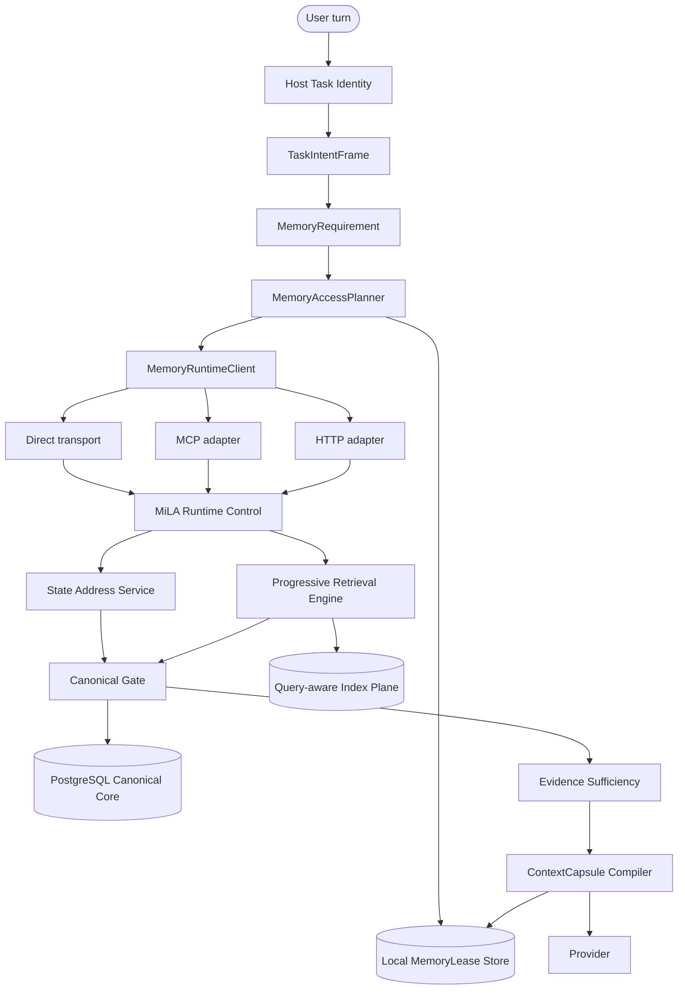
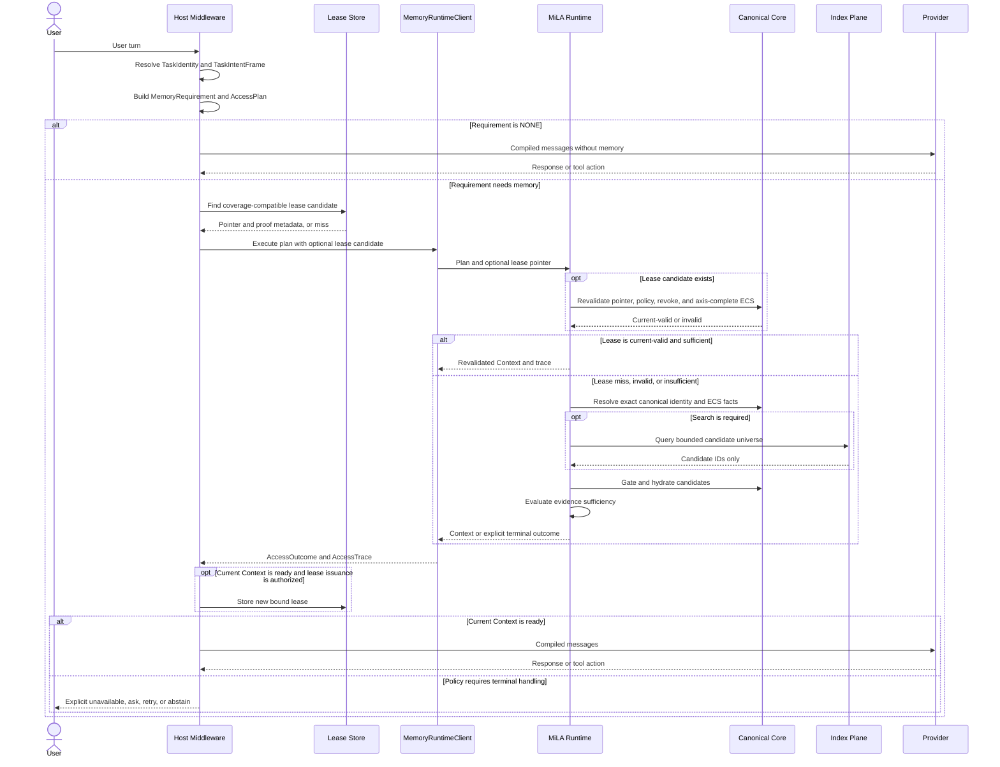
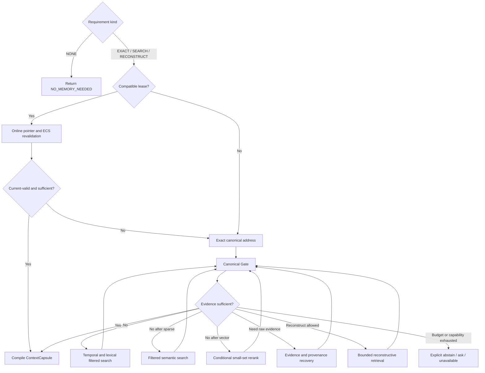

# MiLAi DG-13 v0.3.0 pre-usability rebase archive

_历史快照：原 `DG-13 0.3.0 DRAFT` · 归档日期：`2026-08-25`（Asia/Shanghai） · 状态：`SUPERSEDED BY USABILITY-FIRST REBASE / NOT IMPLEMENTATION AUTHORITY` · 内容保持为 rebase 前的完整设计与证据账本_

---

## 📋 1. Goal 决定与当前状态

### 1.1 决定

DG-13 提议把 MiLA 下一代 memory architecture 定位为：

> **Governed Canonical State + Host-native Memory Access Planner + Query-aware Progressive Retrieval + Validated Memory Lease**

核心问题不再定义为“找到一个更强的 Memory Engine”或“继续调 embedding”，而定义为：

1. Host 在 provider 执行前判断本轮需要什么 memory；
2. Task identity、memory requirement、runtime availability、capability 和 consistency 分开建模；
3. 能通过 canonical address 精确读取时，不进入宽范围搜索；
4. 需要搜索时，先按 task、scope、time、entity 和 query type 缩小候选域；
5. 只有证据充分性仍不满足时，才升级 vector、reranker、evidence recovery 或 reconstructive path；
6. 本地复用对象是带 coverage 和 canonical assurance 的 `MemoryLease`，不是新的 truth source；
7. MCP、direct local RPC 和 HTTP 只是同一 memory contract 的 transport adapters；
8. Evidence、ClaimVersion、ClaimHead、OpenIssue 及其治理写链继续由 PostgreSQL Canonical Core 拥有；
9. 外部检索器、graph、tag、summary、projection 和模型只产生 candidate；
10. 所有 fallback 都必须显式记录，且不能扩大 scope、authority 或 currentness。

四条设计原则为：

```text
Don't call if you can reuse.
Don't search if you can address.
Don't reconstruct if you can search.
Don't ask the model to invoke memory when the Host can manage it deterministically.
```

### 1.2 状态声明

| 项目 | 当前状态 |
| --- | --- |
| DG-13 | `DRAFT / NOT STARTED` |
| 实现授权 | **无**；本文不是代码、Schema 或部署变更授权 |
| DG12 candidate | 冻结；不得由 DG13 原地修改、补跑或改写结果 |
| Logical Architecture | `architecture/v1.0/` 仍是当前最高优先级 frozen contract |
| ADR | [ADR-024](docs/adr/ADR-024-host-native-memory-control-plane.md) 是本 Goal 的前置提案，不是 current implementation |
| Runtime / Schema | 仍为 `0.1.x EXPERIMENTAL / NO-GO FOR SCHEMA FREEZE` |
| 论文创新性 | `[UNKNOWN]`；本文只定义 research candidates，不建立 novelty claim |
| 外部论文数字 | 仅作机制参考；不同模型、硬件、数据与 harness 不做横向性能结论 |

本文严格使用以下标签：

- **Observed / CURRENT**：有代码、测试或机器产物直接支持；
- **Documented**：文档声明，但可能与代码或产物冲突；
- **Proposed / DG13**：本 Goal 要建立的 successor contract；
- **Gap**：CURRENT 与 Proposed 之间的差异；
- **[INFERENCE]**：由多个迹象推断，但没有冻结 contract；
- **[UNKNOWN]**：当前 repository 无法确认。

### 1.3 与 DG12 的隔离

DG-13 必须建立独立 lane：

```text
var/dg13/current-state.json        # Proposed; 尚不存在
var/dg13/ledger.jsonl              # Proposed; 尚不存在
var/dg13/runs/<run_id>/            # Proposed; 尚不存在
architecture/<vnext>-candidate/   # 版本号待 owner 决定；不得覆盖 v1.0
```

隔离规则：

1. 不修改 DG12 frozen package manifest、method identity、formal authorization、state 或 results；
2. 不用 DG13 开发结果补发 DG12 speed/quality claim；
3. 不消费 DG12 holdout labels 来设计、调参或选择 DG13 route；
4. DG13 开发只使用 synthetic、公开 development split、deidentified traces 和专门生成的 negative controls；
5. 任何新 architecture invariant 必须经 ADR、candidate bundle、crosswalk 和 tests 后才能晋级；
6. DG13 的成功或失败不改变 DG12 的 terminal verdict。

第 3 条是对后续 DG13 行为的 prospective firewall。DG12 `run02` 审计已发生的未登记
label-source access 及其对 holdout admissibility 的阻断状态，在 2.7、2.9、9.5.3 和 10.1
单独披露，不因本条而被改写为“从未读取”。

## 📍 2. CURRENT：证据基线与问题诊断

### 2.1 当前产品已经具备什么

CURRENT OpenWorker `prefetch` 已经不是“模型决定是否调用 memory tool”：

```text
OpenWorkerProviderAdapter.complete()
→ Host task binding
→ DeterministicMemoryNeedResolver.resolve()
→ requested NONE / CACHE / L0 / L1
→ hidden milai_prepare_context over MCP
→ Runtime PrepareContextService.prepare()
→ retrieval + Canonical Gate + Context
→ provider
```

关键证据：

- `integrations/openworker-mcp/src/milai_openworker_mcp/host_adapter.py::OpenWorkerProviderAdapter.complete()`；
- `integrations/python-client/src/milai_client/memory_need.py::DeterministicMemoryNeedResolver.resolve()`；
- `integrations/python-client/src/milai_client/task_memory.py::TaskMemoryController.prepare_context()`；
- `runtime/src/milai/application/context_preparation.py::PrepareContextService.prepare()`；
- `runtime/src/milai/application/retrieval.py::RetrievalService.retrieve()`；
- `runtime/src/milai/persistence/retrieval_repository.py::RetrievalRepository.gate_and_hydrate()`。

CURRENT 还已经显式分离了部分 Task identity 与 memory binding：

| Object | Current owner | 事实 |
| --- | --- | --- |
| `TaskIdentityState` | Host | task、generation、lane、goal 与 scope identity |
| `TaskMemoryBinding` | Host payload | known state keys、claim IDs、OpenIssue IDs、canonical position |
| `TaskMemoryState` | Host | identity 与 binding 的组合对象，不等于 Context |
| `MemoryNeedSignature` | Host resolver | intent、scope、authority、consistency、state/claim/issue refs |
| `TaskMemorySlot` | Host process | validation token、compiled slot、rendered context、coverage |
| `ContextValidationState` | Runtime token | canonical position、issue revisions、coverage 与调用预算 |

证据：`integrations/python-client/src/milai_client/task_state.py`、
`integrations/python-client/src/milai_client/memory_need.py`、
`integrations/python-client/src/milai_client/task_memory.py`。

因此，DG13 不是从零发明这些概念，而是把已有 precursor 补成一致的 control-plane contract。

### 2.2 指标必须先纠偏

`StateAddressabilityRate=0.916667` 与 `FastPathExecutionCoverage=0.055556` 经常被并列引用，但它们不能直接写成
“当前冻结 candidate 的两个正式指标”。真实证据链如下：

| 阶段 | 机器事实 | 可用结论 |
| --- | --- | --- |
| FP0 baseline | 11/12 current-state needs 有 initial canonical key；artifact 明确写 fast-path coverage `NOT_FORMALLY_MEASURABLE`；provisional expected-route membership 仅 1/20 | high addressability / poor initial reachability 是有效诊断；`5.56%` 不是正式 current KPI |
| DG12 GOALS 摘要 | 文档写 1/18，即 `0.055556` | **Documented** historical diagnostic；与 FP0 machine wording 不完全一致 |
| FP1 | correct fast turns 2/18，即 `0.111111`；`unsafe_cache_turns=2` | wiring 后仍低，但已不是 1/18 |
| later dev / confirmation | fast-path coverage 18/18；state-key resolution accuracy `0.733333`，门槛 `0.933333`；hard gate 与 non-inferiority gate FAIL | 当前 frozen candidate 已贯通 route coverage，但 locator correctness 和整体性能仍未通过 |

证据：

- `var/dg12/runs/dg12-pd02-fp0-route-shadow-20260824-003/result.json:820-882`；
- `var/dg12/runs/dg12-pd02-fp1-task-continuity-20260824-003/result.json:1065-1144`；
- `var/dg12/performance/fast-path-profile.json:7-27`；
- `var/dg12/harness/freeze-cdf3d942aadeaa8e57743bf2691758303852c5f5047244a0acfe638f811bd16a/equivalence-summary.json:12-21`。

DG13 保留的研究区分是：

```text
Addressable(state)
    canonical state has a valid address

Reachable(state, turn)
    current Task + Requirement + Binding produce a plan that actually reaches that address

CorrectlyResolved(state, turn)
    the reached address is the correct one under scope, time, authority and issue constraints
```

这三者必须分别测量，不能再由一个 FastPath 指标代替。

### 2.3 Deep retrieval 的真实热点

DG12 retained deep profile 是一个 **historical single block**，不是 current matched replicate，也不是 causal replacement
evidence。10-case block 的 outer retrieval 为 `63.097s`；其中 Runtime sibling stages 为 `51.584s`，
OpenWorker/MCP adapter residual 为 `11.506s`。

在 Runtime sibling stages 内：

| Stage | Total | Runtime-query share | 解释边界 |
| --- | ---: | ---: | --- |
| `recent_canonical_ms` | `23.152s` | `44.9%` | 当前 head 上按 query 动态构造 FTS 的宽扫描热点 |
| `reranker_ms` | `18.011s` | `34.9%` | 该 retained 10-case block 中被观测到的 CPU rerank 热点 |
| `fts_ms` | `9.352s` | `18.1%` | scope/history 增长后的 lexical 热点 |
| `vector_ms` | `0.444s` | `0.9%` | 不是该 block 的主瓶颈 |
| `query_embedding_ms` | `0.299s` | `0.6%` | 不是该 block 的主瓶颈 |

三项主热点合计约 `97.9%` 的 Runtime query time。证据：
`var/dg12/runs/dg12-pd02-lb1-deep-readonly-20260825-001/deep-recovery-profile.json:180-249`。
当前 `RetrievalService.retrieve()` 已有 exact/FTS sufficiency 后才升级 vector/recent/reranker 的 precursor，且
reranker 还受 route/limit 条件约束；所以上表是对该 historical profile 的成本归因，不是“所有当前
L1 调用都必然 rerank”的代码 contract。证据：
`runtime/src/milai/application/retrieval.py::RetrievalService.retrieve()`。

准确结论是：

> **Observed:** 在这一 bounded historical profile 中，优先优化 query universe、current-state addressing 和
> conditional reranking，比替换 embedding/ANN 更贴近已观测成本。
>
> **[UNKNOWN]:** 在新的 current matched blocks、不同 corpus scale 和不同 query mix 下，各 stage 占比是否保持。

### 2.4 Cold materialization 是独立问题

DG12 一次 frozen 10-case smoke 中：

```text
governed history build = 842.921s
first-phase share       = 92.376%
```

证据：`var/dg12/harness/product-vs-harness-ab.json:100-128` 和
`var/dg12/discovery/observations.jsonl`。该 observation 自身标记为 `EVIDENCE_BOUNDED`，只有一次 aggregate run，
没有 variance、confidence interval、throughput scaling 或 causal attribution。

因此 DG13 必须把性能拆成三张表：

```text
Online Agent Control
Deep Retrieval
Cold / Incremental Materialization
```

不能用一个总体 speedup 在三者之间互相抵扣。

### 2.5 当前语义缺口

| 问题 | Observed evidence | Consequence |
| --- | --- | --- |
| Need 的语言覆盖窄 | `integrations/python-client/src/milai_client/memory_need.py:16-33,137-240` 使用 `[a-z0-9]+` 与英文 regex；未匹配时返回 `NO_TYPED_MEMORY_INTENT/NONE` | 中文、混合语言和非模板表达可能被当成无需 memory |
| CACHE 是 semantic route | `ExecutionRoute = NONE/CACHE/L0/L1` | requirement 与 reuse optimization 混在同一枚举 |
| CACHE miss 同次调用不升级 | `_cache_miss()` 只返回 `next_route_recommended`，`TaskMemoryController` 对非 READY/UNCHANGED 直接终止 | 有 primary route 建议但本轮不执行，形成 degraded/abstain |
| Availability 没有 typed contract | MCP exception、Runtime unavailable 最终由 Host 返回 `UNKNOWN` | fail closed 正确，但“memory 不需要”和“memory 需要但不可用”缺少独立语义 |
| Transport 仍硬绑定 MCP | current composition 构造 `McpPrepareContextClient` | Host 已控制 Need/Route，但部署可用性仍依赖 MCP/broker |
| Binding hydration 不闭合 | state keys 主要来自 Host payload 与上轮本地 state | canonical address 已存在时，新的 Host/session 未必能恢复 locator |
| L1 虽已 progressive，但 query type 边界有限 | current FTS sufficiency 后再 vector/recent/reranker；current-state miss 仍可能进入宽扫描 | 停止条件尚未成为完整的 intent-specific contract |
| Lease assurance 仍是在线 CACHE validation | Runtime 每次检查 token、coverage、frontier 与 issue revision | 高安全性，但无法表达 intermittent availability 下的 snapshot/currentness 差异 |

### 2.6 问题优先级

```text
P0  Contract semantics and trace completeness
    Requirement / Availability / Capability / Consistency / Outcome

P1  Locator correctness and access reachability
    TaskIntentFrame / Binding hydration / exact state address

P1  Lease miss execution semantics
    same-call fallback; no terminal CACHE miss

P1  Query-aware candidate reduction
    temporal / lexical / entity / task / scope partitions

P1  Incremental materialization
    separate online reads from cold projection build

P2  Transport neutrality and optional invalidation stream

P2  Filtered vector and conditional reranker

P3  Bounded reconstructive L2
```

### 2.7 DG12 当前实验状态与 claim ceiling

DG13 的设计顺序必须以 DG12 **已经完成的机器产物**为输入，不得把“已授权执行”写成
“已完成正式实验”。截至 `2026-08-25`，真实状态是：

| Lane / Gate | Machine status | 已产生的证据 | 可支持的结论 | 不可支持的结论 |
| --- | --- | --- | --- | --- |
| DG12 product candidate | frozen | OpenWorker→MCP→Runtime→PostgreSQL 产品路径、functional/equivalence 产物 | 架构路径与开发性能诊断 | 广义 product speedup |
| `DG12-PD02` | `TERMINAL_TARGET_MISS` | fast-path / deep profile / confirmation blocks | 说明 state access wiring 与 deep path 成本的当前问题 | 不得宣称已达到 product performance target |
| `DG12-ND02/03/04/05` | development signals PASS | mechanism screening、discriminating ablation、boundary package | 用于生成后续 hypothesis 与 claim boundary | 不是 holdout 上的 formal quality result |
| `DG12-PE00V3` | `PASS_PROTOCOL_V3_FROZEN` | V3 freeze manifest、protocol、producer registry | 正式方法矩阵已冻结 | 不表示方法已运行 |
| `DG12-PE01V3` | `PASS_NO_LABEL_GATE` | 56-file verifier、11 methods、19 source identities、tests/regression | 无 label 环境与 producer closure 通过一次 preflight | 不是 formal score |
| `DG12-PE02V3` | `AUTHORIZED_FORMAL_RESOURCE_PREFLIGHT_PENDING` | 100 cases × 11 methods = 1,100 cells 的 label-free 完整计划 | 分母、shard 和资源方案可进入下一门 | 不存在 context、answer 或 score 结果 |
| `DG12-PE03…09` | `BLOCKED_BY_PE02` | none | none | quality、retrieval、cost 等 formal claim |
| `DG12-PE10…12` | `BLOCKED_BY_FORMAL_RESULTS` | none | none | paper table、claim audit 或最终发布结论 |

`var/dg12/formal-execution-authorization-v3.json` 只授权 `ELEVEN_METHOD_CHARACTERIZATION_ONLY`，并明确：

```text
C-BOUNDARY-001             = UNSUPPORTED_CANNOT_BE_REVIVED
speed_claim_allowed        = false
broad_quality_claim_allowed = false
paper labels opened        = false
formal method outputs      = false
formal scores              = false
```

PE01V3 与 PE02V3 机器产物的共同计数是：

```text
formal label rows read  = 0
formal contexts         = 0
formal answers          = 0
formal scores           = 0
provider / judge calls  = 0
```

上述是 **official v3 receipt / machine-counter state**，不是“从未有任何进程读过 label-bearing source”的
文件系统证明。一次较早的 same-family 独立审计（`run02`）为了核对 provenance，在 v3 consumption
API 之外直接读取了 label-bearing LongMemEval source。该行为没有创建 formal receipt、context、answer、score
或 state mutation，因此不会出现在上述 official counters 中，但它已是真实的 untracked source access。

```text
official formal label receipt = 0
untracked reviewer source access = OCCURRED
DG12 holdout admissibility = BLOCKED_PENDING_OWNER_DISPOSITION
```

后续 `run03` 审计只读取 loader/runner 代码和无 label 产物，没有再读取 label source。两次审计都是
`same-family / provisional`。在 owner 对 `run02` incident 做出正式处置前，本文不再把
`paper_labels_opened=false` 解释成完整的 capability isolation 证明，也不认定 DG12 holdout 仍可用。

证据：

- `var/dg12/current-state.json` 的 `phase`、`work_packages`、`formal_scores_opened`、`paper_labels_opened`；
- `var/dg12/formal-execution-authorization-v3.json`；
- `var/dg12/runs/dg12-pe01v3-no-label-gate-20260825-001/preflight.json`；
- `var/dg12/runs/dg12-pe02v3-preflight-20260825-001/preflight.json`；
- `var/dg12/runs/dg12-pe02v3-preflight-20260825-001/resource-plan.json`。

### 2.8 DG13 可以与不可以从 DG12 推导什么

| Evidence class | DG13 可以用它做什么 | 禁止外推 |
| --- | --- | --- |
| executable code + tests | 恢复 current control path、fallback、Gate 与 ownership | 不能从“有代码”推出“有实验收益” |
| PD02 / EH04 development runs | 定位 address reachability、locator correctness、deep-stage 成本 | 不能宣称 broad product speed |
| ND02–05 | 形成可证伪的 successor mechanism hypotheses | 不能作为 formal generalization |
| PE01V3/PE02V3 no-label gates | 确认冻结矩阵、资源与执行前置条件 | 不能比较 11 methods 的质量、速度或成本 |
| local external-project code | 借鉴可执行 mechanism、API 和测试 contract | 不能沿用 README 数字或假设其 authority model 与 MiLA 等价 |

因此，DG13 是对 **已观测 control/performance 缺口**的 successor design，不是对尚未产生的
formal PE02 结果做 post-hoc 调参。

### 2.9 独立 formal-start integrity review

为避免由本文执行者自己评价实验完整性，本任务保留了两次 same-family、只读、不接收执行者摘要的
independent review trace。`run02` 发现了 label isolation 问题，但审计者自身也产生了上述 untracked
source access；`run03` 在不读 label source 的情况下复核 GOALS、current-state、ledger、V3
freeze/authorization、PE01/PE02 artifacts、runner/scorer/provider 与 tests。因为两者与执行者同模型家族，
本文将其 verdict 标记为 `provisional`，不写成 cross-family accepted review。

```text
Formal PE02 result status    = NOT STARTED / INCONCLUSIVE
Formal-start integrity audit = FAIL
```

这两个结论不得合并为“PE02 实验失败”。前者表示没有 formal outputs；后者表示当前启动门和产物身份
还不足以支撑唯一、不可绕过、可重放的正式执行。

| Severity | Observed issue | Evidence | DG13 consequence |
| --- | --- | --- | --- |
| Critical | authorization 未绑定唯一 formal run ID、formal resource-plan hash 和 resource-preflight terminal；`run_answers` / `score_generations` 可在当前 verifier 通过后直接产生输出/读 label | `evals/paper/dg12_v3/freeze.py:114-156`；`evals/paper/dg12_v3/runner.py:224-254,452-503` | DG13 formal lane 必须先实现不可复用的正式 execution capability |
| Critical | verifier 对 PE01/PE02 terminal 只验 path/hash，不解析 schema/status/gate/run-id/zero-label/zero-call；调用方也可传入替代 manifest | `evals/paper/dg12_v3/freeze.py:47-156`；`tests/test_dg12_paper_v3.py:235-323` | manifest 必须 canonical pin；terminal 必须语义验证，不能只看 digest |
| Critical | label loader 只有调用约定隔离；receipt 是 `exists` 后 `os.replace`，不是 exclusive-create/CAS，且实际 label digest 在 receipt 后才验证 | `evals/paper/datasets/longmemeval.py:137-145`；`evals/paper/dg12_v3/runner.py:46-54,413-449` | formal label access 要改为 capability + atomic claim，并绑定 manifest/auth/plan/generation identities |
| Major | 当前没有一个 orchestrator 闭合 11 producers、shards、health gate、archive union、answer window、label consumption、scoring 和 final terminal | `var/dg12/freeze-v3/producer-registry.json:9-40`；`evals/paper/dg12_v3/__init__.py:9-31` | DG13 formal evaluation 需要单一有状态 orchestrator 与最终 commit manifest |
| Major | 100×11 完整 denominator 被 runner 强制，failure 也计入，但 generation 的产生来源、category/track 与 ledger/context archive 身份未被完整对照 | `evals/paper/dg12_v3/runner.py:378-410,474-560` | 保留 denominator contract；新增 frozen case/method/provenance 交叉验证 |
| Major | `ndcg_at_k` 的 ideal depth 是 `min(len(relevant), len(unique_ranked))`，会随预测返回数变化；这与 100×11 cell denominator 是两个不同问题 | `evals/paper/scorers/longmemeval.py:63-86` | 在 formal 前明确 metric identity：固定 `@k` 或将当前值改名为 variable-depth metric，然后 refreeze |
| Major | producer registry 声明 `completion_tokens_max=512`，Provider 实际固定 `256`；部分 token budgets 仍由调用方传入 | `var/dg12/freeze-v3/producer-registry.json:29-31`；`evals/paper/provider.py:16-18,317-323` | 预注册的 operating point 要在 runner 中强制，不只写在 registry |
| Major | generation/scoring 产物可复算分数，但没有完整绑定 manifest/auth/resource plan/schedule/context archives/usage ledger 和 final commit | `evals/paper/dg12_v3/runner.py:324-368,535-560` | DG13 的 result bundle 必须先可重放，才能进入 claim review |
| Major | `current-state` 已进入 V3 authorized phase，但 `protocol.path` 仍指向 V2；ledger 含回填/未来 snapshot digest 迹象 | `var/dg12/current-state.json:593-603,658`；`var/dg12/ledger.jsonl:66,69` | DG13 state/ledger 必须是可按事件顺序重放的因果快照 |

该 review 对 DG13 的直接门是：

```text
do not copy the DG12 formal runner as-is

successor freeze
→ canonical manifest and one-run capability pinning
→ semantic terminal validation
→ atomic label claim
→ formal orchestrator and final commit manifest
→ adversarial integrity tests
→ independent preflight PASS
→ only then open a DG13 formal lane
```

该 verdict 是本轮 independent audit 的审阅结论，不是 repository 已冻结的 DG12 terminal state；本文不因审阅
自动修改 DG12 任何 state、manifest 或 authorization。

## 🎯 3. DG13 Scope、本地项目对照与设计边界

### 3.1 对照方法与快照身份

本节不根据 README 做产品功能表，而是分别追踪本地代码的 ingest、storage、retrieval、context、
fallback、test 和 benchmark 路径。对照优先级为 executable code → tests/benchmarks → docs。
本次只做静态代码审阅，没有把任一项目导入 MiLA 数据库，也没有用它们打开 DG12 holdout。

| Local project | Reviewed snapshot | Working-tree note | 在本文的用途 |
| --- | --- | --- | --- |
| OpenViking | `v0.4.16` / `499995f3ed2e` | detached HEAD，clean | Host middleware、raw-first ingest、URI scope、ContextAssembler |
| Hindsight | package `0.9.0` | 目录不是独立 Git repo，commit `[UNKNOWN]` | temporal/multi-arm retrieval、provenance、watermark/no-clobber |
| Graphiti | `401c59a65bde` / `main` | clean | episodic pointers、bitemporal-annotated edge candidate、bounded graph traversal |
| Mem0 | `001c235229be` / `main` | 预存在 `pyproject.toml` 未提交修改；本轮未触碰 | scope filter、batch write、multi-signal ranking、SDK ergonomics |

用户所说的“`memo`”在 workspace 中没有同名 repository；本文将其映射为本地 `../mem0/`。该映射标记为
**[INFERENCE]**，不把两个名称当成经确认的同一项目。

### 3.2 四个项目的真实机制对照

| Dimension | OpenViking | Hindsight | Graphiti | Mem0 | MiLA DG13 结论 |
| --- | --- | --- | --- | --- | --- |
| Host integration | REST/MCP/LangChain middleware/hooks；可在 provider 前自动 recall | HTTP/MCP/多语言 SDK 包装同一 `MemoryEngine` | Python core、server、MCP | Python/TS/REST 与 provider plugins | 借鉴 adapter 分层；`MemoryAccessPlan` 不得绑定 MCP |
| Raw source | AGFS resource/session JSONL archive | document/chunk，可保留 original text | `EpisodicNode.content` 默认保留，但可配置清空 | 向量 payload + 最近 10 条 session messages | MiLA Evidence 必须 durable/immutable；外部 raw 只能作 ingest source |
| Address / scope | exact `viking://` URI、account/peer/directory | tenant schema + bank + tags/fact type | `group_id` retrieval partition、node/edge/episode UUID | user/agent/run filter + escaped session scope | 借鉴 deterministic locator/filter；不把 namespace/group 当 TaskIdentity 或 scope proof |
| Default retrieval | QUICK vector；THINKING hierarchy + rerank + recursion；FTS 为独立 grep | always embedding，semantic/BM25，optional temporal，graph，默认 rerank | basic `search`: edge BM25+cosine+RRF；advanced `search_`: multi-scope BM25/cosine/BFS+cross-encoder | semantic + keyword + entity boost，可选 rerank | 不复制 always-on hybrid；由 Requirement 产生逐级 AccessPlan |
| Temporal / provenance | session archive、URI/provenance sidecar | occurred/mentioned/updated、source fact IDs、links | LLM-derived edge `valid_at/invalid_at/expired_at` + weak episode pointers | history event + timestamps，lineage 较弱 | Hindsight/Graphiti 可作 temporal/provenance projection 参考，但都不是 ClaimVersion ledger |
| Derived memory | abstract/overview/current memory files | Observation + Mental Model | Entity summary + EntityEdge fact | LLM extracted additive memory + entity link | 全部为 candidate/projection，不得获得 canonical authority |
| Update/delete | LLM upsert 覆盖 current file，physical delete | Observation create/update/hard delete | LLM contradiction 判断后原地使 edge 失效；episode delete 在 endpoint 间不对称 | vector record 原地 update/delete + SQLite history | 与 ClaimVersion/OpenIssue/Steward 不兼容；只可产生 Proposal |
| Reuse/freshness | RecallLedger、capability/digest caches | Mental Model cutoff/watermark/no-clobber | 无 task-conditioned lease | session last messages / vector cache semantics | 借鉴 watermark/no-clobber；`MemoryLease` 必须另行证明 coverage/frontier/currentness |
| Context | quota、tier、lazy body read、rewrite fallback | Recall results + Reflect synthesis | SearchResults | result list / prompt injection by integration | OpenViking ContextAssembler 最接近 Context plane 工程参考 |
| Governance | 无 Steward/ClaimVersion/OpenIssue | 无 Steward/ClaimVersion/OpenIssue | 无 Steward/ClaimVersion/OpenIssue | 无 Steward/ClaimVersion/OpenIssue | 四者均不可代替 MiLA Canonical Core |

综合判断：四个项目都提供了很强的 **candidate production / projection / retrieval / integration** 机制，
但没有一个同时实现 MiLA 所需的 Task-conditioned access、canonical authority、OpenIssue、lease consistency 和
read/write governance。因此本文的结论是“移植机制”，不是“选一个 engine 替换 MiLA”。

### 3.3 OpenViking：借鉴 Host、durable ingest 与 Context plane

**Observed architecture**：OpenViking 是“AGFS 分层文件系统 + 异步语义投影 + Session memory extraction +
多入口检索”。其 `ContextLevel` L0/L1/L2 分别表示 abstract/overview/detail，不是 MiLA 的 exact/search
route。

最值得吸收的三组实现是：

1. **Host-native recall**：`OpenVikingContextMiddleware.wrap_model_call()/awrap_model_call()` 在 provider 前自动
   recall 并注入 system context，模型不需要主动调 MCP tool。证据：
   `../OpenViking/integrations/langchain/src/langchain_openviking/middleware.py:75,189-251`。
2. **raw-first recoverable commit**：`Session.commit_async()` 先在 path lock 下归档 raw messages、写 phase marker、
   持久化 queue，再由 `resume_queued_commit()` 恢复 summary/memory extraction 和后续 indexing。证据：
   `../OpenViking/openviking/session/session.py:1794-2145,2197-2736`；并发不丢失测试在
   `../OpenViking/tests/session/test_session_commit_race.py:14-54`。
3. **Context compilation**：`assemble_context()` 把 quota、query expansion、candidate gathering、lazy body read、
   detail tier、token planning、render/rewrite 分层；rewrite 失败时保留 deterministic context。证据：
   `../OpenViking/openviking/retrieve/context_assembler/pipeline.py:52`、
   `../OpenViking/openviking/retrieve/context_assembler/gather.py:201`、
   `../OpenViking/openviking/retrieve/context_assembler/budget.py:85`、
   `../OpenViking/tests/retrieve/test_context_assembler_pipeline.py:113-565`。

检索上可借鉴 exact URI、tenant/peer/directory scope、remote FTS candidate + local regex verification 和 bounded hierarchy；
但当前 QUICK 是全局 scoped vector，THINKING 是 directory vector + rerank + recursion，FTS 是另一个
`grep()` API。证据：`../OpenViking/openviking/retrieve/hierarchical_retriever.py:101-565`、
`../OpenViking/openviking/storage/viking_fs/_grep.py:25-230`。所以它的 API 不能原样作为 DG13 渐进 route。

**必须拒绝的语义**：`MemoryUpdater.apply_operations()` 将 LLM extraction 直接 upsert/delete 到当前 memory
文件，MCP 同时暴露 remember/write/forget。证据：
`../OpenViking/openviking/session/memory/memory_updater.py:748-1334`、
`../OpenViking/openviking/server/mcp_endpoint.py:235-1146`。已检查的若干 Host wrapper 在 Runtime/context
不可用时会继续而不注入 memory：LangChain context assembler 返回 `{}`，Codex auto-recall hook
在 health failure 时直接 `emit()`，shared recall 在无候选时返回 `null`。证据：
`../OpenViking/integrations/langchain/src/langchain_openviking/context.py:385-405`、
`../OpenViking/examples/codex-memory-plugin/scripts/auto-recall.mjs:590-595`、
`../OpenViking/examples/memory-plugin-shared/lib/recall-core.mjs:574-607`。这是对已检查 wrapper 的观测，
不外推为更普遍的 integration 行为。DG13 只吸收 middleware、ingest/index/context 机制，不吸收该
write authority 或将 memory-required request 默认当作 `NONE` 的 fail-open policy。

### 3.4 Hindsight：借鉴 temporal/provenance 与 delta no-clobber

**Observed architecture**：Hindsight 以 `Bank` 为 namespace，以 PostgreSQL/Oracle 为主存储，核心 API 是
`retain / recall / reflect`；HTTP、MCP 和 SDK 都包装同一 `MemoryEngine`。证据：
`../hindsight/hindsight-api-slim/hindsight_api/engine/memory_engine.py:4157,5311,10980`。

Recall 的真实路径是：

```text
always query embedding
→ semantic + BM25
→ temporal when a temporal constraint exists
→ graph expansion
→ RRF/interleave
→ usually cross-encoder rerank
→ recency/temporal/proof boosts
```

证据：`../hindsight/hindsight-api-slim/hindsight_api/engine/memory_engine.py:5741-6298`、
`../hindsight/hindsight-api-slim/hindsight_api/engine/search/retrieval.py:164-412,899-1031`。注意文档所说的“4-way parallel”与执行不一致：semantic/BM25
与 temporal 在一个 connection 上顺序执行，graph 随后才并发；semantic/BM25 timing 还是 50/50
近似分配。因此不能直接复制该 profile 口径。

值得 DG13 吸收：

- multilingual temporal parser 和 occurred/mentioned/updated range index；中文测试在
  `../hindsight/hindsight-api-slim/tests/test_query_analyzer.py:450-826`；
- per-fact-type HNSW/FTS partition、bounded entity/semantic/causal expansion、source fact ID 和 live-source filtering；
- candidate cap、RRF/interleave 和 cross-encoder 作为**条件性** stage；
- Mental Model refresh 的 fixed snapshot cutoff、scope watermark、delta provenance accumulation 和 failure no-clobber；证据：
  `../hindsight/hindsight-api-slim/hindsight_api/engine/memory_engine.py:12464-13309`、
  `../hindsight/hindsight-api-slim/tests/test_mental_model_delta.py:312-1211`。

**必须降级的对象**：Observation 的 LLM 可直接 create/update/delete，Mental Model 是持久化的派生综合文档；
两者都没有 Proposal→Validation→Steward→ClaimVersion。证据：
`../hindsight/hindsight-api-slim/hindsight_api/engine/consolidation/consolidator.py:666-713,1846-2473`。在 MiLA 中它们只能是
`SearchProjection` / `CandidateProposal` / `ContextCapsule` 参考。`Bank` 也是 namespace，不是 TaskIdentity。

Reflect 的 mental-model→observation→raw recall 层级很有价值，但后续 query/tool 由 LLM 决定；它只适合
DG13 `RECONSTRUCT` L2，且要限制 rounds/tools/tokens/fanout。证据：
`../hindsight/hindsight-api-slim/hindsight_api/engine/reflect/agent.py:686-1268`。

### 3.5 Graphiti：借鉴 episodic pointers 与 bitemporal-annotated shadow graph

**Observed data model**：

- `EpisodicNode` 保存 source、source description、raw `content`、`valid_at` 和 entity-edge refs；它虽声明
  `episode_metadata`，但当前 `save()`、DB query 和 record parser 不持久化/恢复该字段，不能将其当作可查
  provenance contract；
- `EntityNode` 保存可变 summary 与 attributes；
- `EntityEdge` 保存 fact、episode UUIDs、`valid_at`、`invalid_at`、`expired_at`、reference time。

证据：`../graphiti/graphiti_core/nodes.py:318-419,499-570`、`../graphiti/graphiti_core/edges.py:263-370`、
`../graphiti/graphiti_core/models/nodes/node_db_queries.py:30-121`、
`../graphiti/graphiti_core/driver/record_parsers.py:88-108`。

Graphiti 提供 Episode→Entity 的 `MENTIONS` edge，但 Fact↔Episode 主要是两端对象里的 UUID 数组，不是完整显式
provenance graph。`add_triplet()` 还可使用未持久化的 synthetic episode，direct namespace API 也可以绕过
episode extraction 保存 node/edge。证据：
`../graphiti/graphiti_core/utils/maintenance/edge_operations.py:52-96`、
`../graphiti/graphiti_core/graphiti.py:1645-1763`、`../graphiti/graphiti_core/namespaces/nodes.py:42-80`、
`../graphiti/graphiti_core/namespaces/edges.py:47-76`。

**[INFERENCE / research hypothesis]**：这些 weak pointers 可能帮助“为什么变了”或“哪个 episode 支持该边”类
L2 query，但 provenance completeness、delete consistency 和 source lineage 必须由 MiLA wrapper 和专门测试验证，
不能将该能力当作 Graphiti 已有 contract。

但它不是 governed current state：

- contradiction 由 LLM dedupe 结果决定，然后 `resolve_edge_contradictions()` 使旧 edge 失效，没有
  OpenIssue/Steward：`../graphiti/graphiti_core/utils/maintenance/edge_operations.py:538-573,642-847`；
- raw episode 是可选保存；delete 存在 endpoint-specific 且不完全对称的 cleanup：`remove_episode()` 在被删
  episode 是 `edge.episodes[0]` 时删整条 edge，否则可保留含已删 UUID 的 edge；REST path 又只执行
  `EpisodicNode.delete()`。证据：`../graphiti/graphiti_core/graphiti.py:146-214,1765-1793`、
  `../graphiti/server/graph_service/routers/ingest.py:99-102`、
  `../graphiti/server/graph_service/zep_graphiti.py:73-78`；
- `Graphiti.search()` docstring 说以 current datetime 作 temporal reference，但默认实现只构造
  `EDGE_HYBRID_SEARCH_RRF` 和空 `SearchFilters()`，不自动施加 `valid_at <= now`、
  `invalid_at is null or > now` 或 `expired_at` 等 applicability/currentness 条件：
  `../graphiti/graphiti_core/graphiti.py:1527-1584`。因此这是 documented/implemented mismatch；
- advanced `search_()` 默认对 edge/node/episode/community 使用 BM25/cosine/BFS 和 cross-encoder，不是
  query-aware progressive path：`../graphiti/graphiti_core/search/search_config_recipes.py:80-108`、
  `../graphiti/graphiti_core/search/search.py:98-240`。

本地 Neo4j 执行 path 是 `MATCH` 后计算 `vector.similarity.cosine`、sort 与 limit；index builder 只建 range
和 full-text index，未观测到 vector ANN index/procedure。证据：
`../graphiti/graphiti_core/driver/neo4j/operations/search_ops.py:284-343`、
`../graphiti/graphiti_core/graph_queries.py:28-163`、
`../graphiti/graphiti_core/driver/neo4j_driver.py:211-221`。这一结论只针对当前本地 Neo4j path，不外推到其他
driver 或部署。

Graphiti 的 native build 也不能进入 canonical commit path：每个 extracted edge 可为 endpoint-constrained
dedupe 和 group-wide invalidation 各做一次 hybrid search，两次都可重新生成 query embedding；bulk 默认
仍是 per-episode node/edge extraction，且批内 node dedupe 有 `O(n²)` 路径。证据：
`../graphiti/graphiti_core/utils/maintenance/edge_operations.py:392-418`、
`../graphiti/graphiti_core/search/search.py:120-150`、
`../graphiti/graphiti_core/utils/bulk_utils.py:263-420,489-541`。
整体 ingest 也不是统一原子事务：episode/node/edge 与 Saga/NEXT_EPISODE/HAS_EPISODE 分段写，bulk 路径可先保存
raw episode 再执行 extraction。证据：`../graphiti/graphiti_core/graphiti.py:726-779,1335-1408`。

DG13 中 Graphiti 只应实现为：

```text
canonical outbox / Evidence refs
→ asynchronous graph projection
→ bounded provenance or reconstruct candidate
→ canonical gate + evidence sufficiency
→ ContextCapsule
```

它不得成为 ClaimHead、current-state resolver 或 write authority；第一阶段也不应因为有本地 Graphiti 就引入
Neo4j。

### 3.6 Mem0：借鉴 scope、batch 与 multi-signal ranking

**Observed architecture**：`MemoryConfig` 组合 vector store、LLM、embedder、SQLite history 和 optional reranker；不存在
MiLA 意义上的 canonical store。证据：`../mem0/mem0/configs/base.py:29`、`../mem0/mem0/memory/main.py:760`。

当前 V3 add path 的实际特征是：

```text
escaped user/agent/run session scope
→ last 10 session messages
→ vector search top 10 for dedup context
→ one ADD-only LLM extraction
→ batch embedding
→ hash dedup
→ batch vector persist
→ best-effort entity linking
```

证据：`../mem0/mem0/memory/main.py:412,879-1070`、`../mem0/mem0/configs/prompts.py:468,1016-1062`。
`_build_session_scope()` 对 delimiter 做编码，并有 collision regression tests：
`../mem0/tests/memory/test_session_scope.py:26-71`。这对 DG13 task/tenant/principal/scope digest 的 deterministic serialization 有直接借鉴价值。

Search 路径是 semantic vector overfetch、keyword search、entity boost 后 `score_and_rank()`，调用方可选 rerank：
`../mem0/mem0/memory/main.py:1379-1735`、`../mem0/mem0/utils/scoring.py:60-137`。可借鉴：

- user/agent/run 的 strict filter 与 advanced filters；
- batch embedding / batch persist；
- entity 作独立 projection collection；
- semantic/BM25/entity 分数明细与 optional reranker；
- provider/vector-store 的 pluggable adapter。

但 `score_and_rank()` 在组合 BM25/entity 前会用 semantic threshold 先筛选，因此它不是真正对等的
query-aware route，也可能丢掉纯 lexical hit。这应成为 DG13 lexical-only ablation 的 negative control。

**必须拒绝的语义**：向量 payload 是主记忆，`_update_memory()` / `_delete_memory()` 原地修改或删除它，
SQLite 只追加变更 history；没有 ClaimVersion/OpenIssue/Steward/canonical Gate。证据：
`../mem0/mem0/memory/main.py:2032-2130`、`../mem0/mem0/memory/storage.py:11-245`。此外，local `evaluation` submodule 未初始化，
README 中的托管平台数字不能由当前 OSS checkout 复算；本文因此不引用 Mem0 性能数字。

### 3.7 机制移植决策

| Mechanism | Source evidence | DG13 destination | Decision | 必须新增的 MiLA guard |
| --- | --- | --- | --- | --- |
| provider 前自动 recall | OpenViking middleware | Host Memory Middleware | `ADOPT` | Requirement/Availability/Consistency 显式化 |
| raw-first + phase marker + durable queue | OpenViking Session commit | Evidence ingest / projection outbox | `ADOPT_PATTERN` | immutable Evidence、idempotency key、replay audit |
| exact URI / deterministic scope key | OpenViking + Mem0 | State Address / binding serialization | `ADOPT_PATTERN` | canonical payload 必须回源 ClaimHead/Version 并过 Gate |
| multilingual temporal parser | Hindsight | Temporal Requirement / filtered search | `ADOPT_PATTERN` | parser failure 不得静默扩大到全局 scope |
| LLM-derived temporal interval fields | Graphiti | Temporal SearchProjection candidate | `SHADOW_ONLY` | 保留 extraction provenance/confidence；不得写 canonical time |
| source fact IDs + live-source filter | Hindsight | Evidence recovery | `ADOPT_PATTERN` | Gate、revoke、OpenIssue 必须先于 context exposure |
| episode refs / bounded BFS | Graphiti | RECONSTRUCT | `SHADOW_ONLY` | fanout/round/token budget、Gate、provenance completeness/delete tests |
| fixed cutoff + scoped watermark + no-clobber | Hindsight Mental Model | Lease dependency/frontier experiments | `ADOPT_MECHANISM` | task/binding generation、policy identity、currentness assurance |
| quota/tier/lazy body read | OpenViking ContextAssembler | ContextCapsule compiler | `ADOPT_PATTERN` | selected provenance refs、no Context→truth feedback |
| multi-signal score details | Mem0 | candidate fusion diagnostics | `ADOPT_PATTERN` | lexical/semantic 独立 key、query-type-specific gate |
| LLM consolidation/upsert/delete | 四者都存在变体 | Proposal producer only | `REJECT_AS_AUTHORITY` | Proposal→Validation→Steward→Canonical Commit |
| default hybrid + cross-encoder | Hindsight/Graphiti/Mem0 | uniform-hybrid baseline | `BASELINE_ONLY` | 用 progressive plan 做 matched ablation |
| full graph truth store | Graphiti-style graph | none in P0–P7 | `DEFER/REJECT` | 只有 L2 profile 证明 relational projection 不足时重审 |
| URI cooling / prompt cache | OpenViking/Hindsight | local optimization | `DO_NOT_CALL_LEASE` | coverage + dependency + currentness 全部满足才可称 lease |

上表的 `ADOPT` 是 **设计决定候选**，不是实现完成状态。每个机制都必须在 DG13 的隔离 lane 中重新实现或包装，
并经 matched baseline、negative control 和 failure injection 验证；不建立对这四个 repository 的运行时硬依赖。

```mermaid
flowchart LR
    accTitle: Local mechanisms enter bounded MiLA planes
    accDescr: OpenViking, Hindsight, Graphiti, and Mem0 contribute integration, ingest, index, retrieval, and context mechanisms. Their outputs remain candidates and must pass the MiLA canonical gate; none can write canonical state directly.

    ov[OpenViking mechanisms] --> host[Host and ingest patterns]
    ov --> context[Context compilation patterns]
    hs[Hindsight mechanisms] --> search[Temporal and provenance search]
    gt[Graphiti mechanisms] --> graph[Shadow provenance graph]
    mem0[Mem0 mechanisms] --> index[Scope and ranking patterns]

    host --> planner[MiLA MemoryAccessPlanner]
    context --> compiler[MiLA ContextCapsule compiler]
    search --> candidates[Candidate set]
    graph --> candidates
    index --> candidates
    planner --> candidates

    canonical[(MiLA ClaimVersion and OpenIssue)] --> gate[Canonical Gate]
    candidates --> gate
    gate --> compiler

    evidence[(MiLA Evidence)] --> proposal[Proposal and Steward path]
    proposal --> canonical
```

### 3.8 目标

DG13 核心完成条件是建立并验证以下纵向能力：

```text
Host Task Identity
→ multilingual TaskIntentFrame
→ MemoryRequirement
→ TaskMemoryBinding hydration
→ MemoryAccessPlan
→ compatible MemoryLease candidate or exact StateAddress
→ Runtime pointer recovery / same-call progressive fallback
→ Canonical Gate
→ Evidence Sufficiency
→ ContextCapsule
→ Provider
→ AccessTrace
```

目标分为六类：

1. **Control**：Host owns primary memory access；Need 与 transport failure 解耦；
2. **Address**：current state 优先通过 canonical identity 精确寻址；
3. **Reuse**：跨 Turn 复用有 coverage、dependency 和 currentness 语义；
4. **Retrieval**：按 query type 和维度逐级升级，避免无条件 hybrid/rerank；
5. **Materialization**：canonical commit 与昂贵 search projection 分层；
6. **Evaluation**：correctness、safety、route fidelity、latency、token、build 分开测量。

### 3.9 非目标

DG13 不做：

- 不原地修改 `architecture/v1.0/`；
- 不修改 DG12 frozen candidate 或补发 DG12 claim；
- 不把 MCP 删除；MCP 保留为 Host adapter 与 tool-only compatibility；
- 不把 model-visible tool loop 作为 preferred memory path；
- 不把 learned classifier 用作 execution Task Identity authority；
- 不让 retrieval result 反向建立 task identity；
- 不把 cache/lease、FTS、vector、DAG tag、graph 或 summary 变成 truth store；
- 不以 extracted fact 或 summary 替代 raw Evidence；
- 不先更换 PostgreSQL、embedding model 或引入 Neo4j；
- 不默认启用 L2 reconstructive retrieval；
- 不让 answer path 获得 canonical write/review authority；
- 不把第三方论文报告的速度或准确率当成 MiLA 的预期收益；
- 不在阈值冻结前打开正式 holdout 来选择方案。

### 3.10 成功边界

DG13 的 core success 不要求所有研究扩展都上线。建议分为：

| Boundary | Required work |
| --- | --- |
| Core closure | contracts、trace、current-state vertical slice、binding/address、lease/fallback、transport conformance、query-aware L1、incremental materialization、tests/evals |
| Optional research | semantic ambiguity classifier、push invalidation、DAG tags、graph shadow、reconstructive L2 |
| Publication claim | 另行 preregistered protocol；本 Goal 完成不自动产生 novelty、SOTA 或 broad quality claim |

如果 simple exact/temporal/FTS/filtered-vector 路径已经满足质量和成本目标，P8 reconstructive L2 可以以
`PARKED_NOT_NEEDED` 结束，而不是为了架构完整强行上线。

## 🏗️ 4. Proposed：总体架构与 ownership

### 4.1 六个功能平面与审计横切面



### 4.2 Ownership 表

| Plane | Owner | Authoritative objects | Non-authoritative support |
| --- | --- | --- | --- |
| Evidence | MiLA Runtime / PostgreSQL | `EvidenceRecord`、source identity、provenance、revoke state | extracted keys、fragments |
| Canonical State | Steward procedures / PostgreSQL | `ClaimVersion`、`ClaimHead`、`OpenIssue`、Decision、transition | State locator projection |
| Task and Binding | Host；Runtime 提供 proof/hydration | `TaskIdentityState`；task relation/transition；binding generation | semantic continuity suggestion |
| Access Control | Host planner + authenticated Runtime capabilities | Requirement、Plan、Consistency、Outcome | heuristics、optional ambiguity classifier |
| Retrieval | Runtime | Canonical Gate decision | exact index、FTS、vector、temporal、reranker、graph shadow |
| Context | Runtime compiler + Host injection | 无 canonical authority | `ContextCapsule`、`MemoryLease`、rendered context |
| Audit | Host + Runtime append-only traces | access decision and provenance record | dashboards、aggregates |

### 4.3 State 分类

| Class | Proposed objects | 生命周期 | 关键禁止项 |
| --- | --- | --- | --- |
| E — Evidence | `EvidenceRecord`、raw content ref、provenance | durable | 不被 fact/summary 替代 |
| C — Canonical | `ClaimVersion`、`ClaimHead`、`OpenIssue` | durable/versioned | 非 Steward 不写 |
| T — Task | `TaskIdentityState`、task graph、goal version | Host-owned；可 durable | retrieval 不建立 identity |
| B — Binding | `TaskMemoryBinding`、StateKey/Claim/Issue refs、coverage | task-bound/versioned | 不与 Context 合并 |
| W — Working | `ContextCapsule`、`MemoryLease`、tool working state | bounded | 不成为 truth source |
| D — Decision | `MemoryAccessPlan`、`SufficiencyDecision`、`AccessTrace` | append-only/auditable | 不静默 fallback |

必须保持：

```text
TaskIdentityState != TaskMemoryBinding != ContextCapsule != MemoryLease
```

### 4.4 Task identity 与 semantic continuity

Execution Task Identity 只接受 Host authoritative anchors：

```text
task_id
parent_task_id
task_generation
binding_generation
execution_lane_id
goal_id / goal_version
scope / profile
invocation token
tool lineage
workspace / artifact identity
```

Semantic Task Continuity 只用于候选关系：

```text
Layer 0  explicit Host relation
Layer 1  deterministic structural and multilingual grammar
Layer 2  small semantic classifier for ambiguous cases only
```

Layer 2 最多输出：

```yaml
candidate_relation: CONTINUE | SUBTASK | SWITCH | RETURN | AMBIGUOUS
confidence: 0.0
reason_features: []
compatible_task_ids: []
```

它不能自行 merge task，也不能写 canonical memory。最终 transition 仍需 structural compatibility、scope/profile
safety 和 Host CAS。ACTION_SAFE 场景保持：

```text
false merge cost > false split cost
```

不确定时返回 `AMBIGUOUS` 或安全的新 subtask，不隐式当作 same task。

### 4.5 Read 与 write 的治理边界

DG13 只重构 memory access control，不改变 canonical write authority：

```text
Read path
Host Requirement → AccessPlan → Runtime read → Gate → Context

Write path
Observed event → Evidence capture → Proposal → invariant validation
→ Steward Decision → canonical transaction → Outbox
```

两条路径的边界：

- provider answer 不自动成为 Evidence 或 Claim；
- tool result 只有在 Host 明确拥有 `capture_evidence` capability 且满足 admission contract 时才可捕获；
- Evidence capture 不自动移动 ClaimHead 或关闭 OpenIssue；
- `submit_proposal` 不等于 `review_proposal`；
- normal reader Host 不持有 Steward credential；
- retrieval、Context、lease、summary、learned tag 和 reconstructive result 都不能直接写 canonical state；
- canonical commit 后由 Outbox 驱动 projection update、lease invalidation 与 audit，而不是由 Context 反写。

## ⚙️ 5. Proposed Contract Freeze Scope v0.1

DG13-P0 **拟冻结**的最小合同族为十一项：

```text
TaskIntentFrame
MemoryRequirement
MemoryAvailability
MemoryCapabilities
ConsistencyRequirement
ExecutionPolicy
MemoryAccessPlan
MemoryLease
SufficiencyDecision
AccessOutcome
AccessTrace
```

这些合同在实现前使用 `memory.access.v0.1` experimental namespace；字段语义冻结后才能开始 behavior-changing work。

### 5.1 TaskIntentFrame

`TaskIntentFrame` 是 resolver 输出，不是 truth 或 task identity：

```yaml
schema: milai.task-intent-frame.v0.1
operation: inspect | compare | update | explain | continue | plan | execute
object: project | preference | file | result | state | evidence | artifact
entities: []
temporal_expression:
  text: null
  normalized_range: null
current_question: ""
expected_output: answer | action | plan | evidence
scope: {}
action_risk: informational | action_safe
resolver:
  layer: explicit | deterministic | semantic_ambiguity
  confidence: 1.0
  reason_codes: []
```

它必须支持中文、英文和中英混合表达。无法解析时不能自动输出 `MemoryRequirement.kind=NONE`；应输出 unresolved
frame，再由 policy 决定 ask、safe search 或 abstain。

### 5.2 MemoryRequirement

```yaml
schema: milai.memory-requirement.v0.1
kind: NONE | EXACT | SEARCH | RECONSTRUCT
intent: CURRENT_STATE | HISTORICAL_STATE | TEMPORAL | KNOWLEDGE_UPDATE |
        PREFERENCE | PROJECT_STATE | EXPLANATION | EVIDENCE_REQUEST | MULTI_SESSION
state_keys: []
claim_ids: []
issue_ids: []
entities: []
scope: {}
temporal:
  mode: CURRENT | HISTORICAL | RANGE | UNKNOWN
  from: null
  to: null
evidence_depth: STATE_ONLY | SUPPORT_POINTERS | RAW_EVIDENCE | FULL_LINEAGE
required_authority: INFORMATIONAL | ACTION_SAFE | USER_CONFIRMED
confirmation_requirement: NONE | LIVE_USER_CONFIRMATION
resolution_status: RESOLVED | AMBIGUOUS | UNSUPPORTED
reason_codes: []
```

Normative semantics：

- `NONE` 只表示 execution 不依赖 memory；
- `EXACT` 表示已有稳定 address 或可 deterministic 合成 address；
- `SEARCH` 表示需要在有界候选域中发现地址/证据；
- `RECONSTRUCT` 表示 simple retrieval 不足，需要多步 evidence chain；
- `required_authority` 保留 frozen axis 的 `INFORMATIONAL / ACTION_SAFE / USER_CONFIRMED`；
- authority 与 live confirmation 保持正交：`USER_CONFIRMED` 是 frozen authority 值，
  `confirmation_requirement` 表示本次 execution 是否需要实时确认，两者不互相推导；
- Requirement 在执行期间不可因 transport failure 被改写为 `NONE`；
- `RECONSTRUCT` 不代表 L2 capability 已启用。

### 5.3 Availability、Capabilities、Consistency 与 Execution Policy

```yaml
MemoryAvailability:
  state: FULL | LOCAL_REUSE_ONLY | UNAVAILABLE
  checked_at: timestamp
  reason_codes: []

MemoryCapabilities:
  read:
    prepare_context: true
    exact_state: true
    search: true
    recover_evidence: false
    reconstruct: false
  write:
    capture_evidence: false
    submit_proposal: false
    review_proposal: false
    revoke_evidence: false
  transports:
    direct: false
    mcp: true
    http: false
  lease:
    local_reuse: true
    remote_validation: true
    push_invalidation: false

ConsistencyRequirement:
  retrieval_floor: EVENTUAL | READ_YOUR_WRITES | CANONICAL_REQUIRED
  causal_token_ref: null

ExecutionPolicy:
  currentness: STRICT_CURRENT | ALLOW_SNAPSHOT
  degradation: FAIL_CLOSED | BEST_EFFORT
  maximum_snapshot_age_seconds: null
  require_revocation_assurance: true
  fallback_action: ABSTAIN | ASK_USER | RETRY
  auxiliary_provider_action: NONE | OFFER_GENERIC_GUIDANCE
```

`FULL` 是相对当前 Requirement 的已认证可用能力，不是“socket 存在”。Read 与 write capability 必须独立；
transport 不得扩大 caller profile。

`ConsistencyRequirement` 保留 current contract 的 `EVENTUAL / READ_YOUR_WRITES / CANONICAL_REQUIRED`，回答
“Runtime read 至少需要哪种一致性”；`ExecutionPolicy` 回答“Runtime/lease 不足时允许怎样继续”。两者不得由
一个 `BEST_EFFORT` 枚举相互覆盖。常用 profile 可组合为：

```text
strict current  = currentness STRICT_CURRENT + degradation FAIL_CLOSED
allow snapshot  = currentness ALLOW_SNAPSHOT + degradation FAIL_CLOSED
best effort     = an explicit currentness choice + degradation BEST_EFFORT
```

在 frozen v1 的 I-10 下，如果 Runtime 不可达，Host 无法仅靠 TTL 或 invalidation stream 证明
revoke、permission、retention、GroundingBlock 和所有 ECS 轴在使用瞬间仍未变化。因此：

- `STRICT_CURRENT` 必须 abstain；
- `ALLOW_SNAPSHOT` 合同可以存在，但 snapshot body 在 v1 语义下默认不可注入；可返回
  `SNAPSHOT_AVAILABLE_NOT_AUTHORIZED` 供上层 ask/retry；
- 若 vNext 要允许离线 snapshot 注入，必须有单独 ADR、data classification、revocation threat model 和
  explicit policy authorization；
- `BEST_EFFORT` 不能把未满足的非 `NONE` Requirement 伪装成已满足；
- `ACTION_SAFE`、`CANONICAL_REQUIRED` 或仍需 current/canonical fact 的原问题必须 abstain、
  ask 或 retry，不存在“无 memory 但原请求成功”的 terminal outcome；
- 若 policy 允许 provider 给出通用知识建议，该结果必须明确声明“未回答原 memory-dependent
  question”，原 Requirement 仍记为 `MEMORY_REQUIRED_BUT_UNAVAILABLE` / `ABSTAINED`，不得注入
  memory body，也不得标记为 grounded 或 satisfied。

### 5.4 MemoryAccessPlan

```yaml
schema: milai.memory-access-plan.v0.1
plan_id: uuid
task_identity_ref: {}
task_binding_ref: {}
requirement_ref: {}
availability_ref: {}
capability_ref: {}
consistency_requirement_ref: {}
execution_policy_ref: {}
latency_budget_ms: null
token_budget: null
lease_strategy: TRY_COMPATIBLE_LEASE_FIRST | BYPASS
primary_stage: NONE | EXACT | TEMPORAL_FTS | FILTERED_VECTOR | RECONSTRUCT
allowed_escalations: []
transport_order: []
required_gate: CANONICAL_ECS
sufficiency_policy_id: ""
fallback_action: ABSTAIN | ASK_USER | RETRY
auxiliary_provider_action: NONE | OFFER_GENERIC_GUIDANCE
```

计划函数为：

```text
MemoryAccessPlan = f(
    TaskIdentityState,
    TaskIntentFrame,
    MemoryRequirement,
    TaskMemoryBinding,
    LeaseCoverage,
    MemoryAvailability,
    MemoryCapabilities,
    ConsistencyRequirement,
    ExecutionPolicy,
    LatencyBudget,
    TokenBudget
)
```

Planner 可以 deterministic 使用规则、budget 和 capability；模型最多帮助构造 ambiguous intent suggestion，
不能决定 scope、authority、canonical applicability 或 write permission。

### 5.5 MemoryLease

```yaml
schema: milai.memory-lease.v0.1
lease_id: uuid
tenant_id: uuid
principal_id: uuid
host_id: string

task_identity:
  task_id: string
  task_generation: integer
  binding_generation: integer
  goal_digest: sha256
  scope_digest: sha256

requirement_coverage:
  intents: []
  state_keys: []
  claim_ids_and_head_versions: []
  issue_ids_and_revisions: []
  temporal_coverage: null
  evidence_depth: SUPPORT_POINTERS

canonical_assurance:
  canonical_position: integer
  dependency_frontier: {}
  policy_identity: sha256
  issued_currentness: CURRENT_AT_ISSUE_TIME | VALIDATED_SNAPSHOT | UNASSURED
  invalidation_stream_position: null

context:
  context_digest: sha256
  local_body_ref: opaque
  provenance_refs: []

issued_at: timestamp
fresh_until: timestamp
expires_at: timestamp
reuse_policy: STRICT_CURRENT | ALLOW_SNAPSHOT
```

Lease 是 context proof，不是 bearer authority：

- 绑定 tenant、principal、Host、task generation、binding generation、goal、scope 和 policy；
- token 保存 proof metadata/digest，正文单独保存并由 digest 绑定；
- lease candidate 只表示 coverage 兼容，还需验证 assurance 满足 ConsistencyRequirement 与 ExecutionPolicy；
- `fresh_until` 是 soft freshness，`expires_at` 是 hard local validity；
- TTL 未过不能证明 `CURRENT`；
- 可复用 lease 不持久化一个跨 Turn 持续有效的 `CURRENT` 声明；`CURRENT_VERIFIED` 只是
  **本次 execution 内** Runtime 对 pointer/body 执行 axis-complete ECS/Gate 后的 validation result，
  写入 `AccessTrace.lease_validation.status`，不反写为 lease authority；
- push invalidation stream 只能提前 invalidate 或降级 lease，在 frozen v1 下不能单独产生
  `AccessTrace.lease_validation.status=CURRENT_VERIFIED`；
- 每次 memory-bearing lease 使用都重验 object/content hash、tenant/permission、retention/legal
  hold、Evidence revoke/GroundingBlock、Blob state、Capsule TTL/invalidation sequence，以及
  ClaimVersion 的 axis-complete ECS/Gate；
- revoke、permission、retention、scope、goal、binding 或 dependency frontier 变化会 invalidate；
- lease miss 不是 memory miss，更不是 terminal outcome。

### 5.6 SufficiencyDecision、Outcome 与 Trace

```yaml
SufficiencyDecision:
  sufficient: false
  policy_id: string
  requirement_ref: string
  stage: EXACT | TEMPORAL_FTS | FILTERED_VECTOR | RERANK | EVIDENCE | RECONSTRUCT
  accepted_canonical_refs: []
  required_facets: []
  covered_facets: []
  temporal_coverage: null
  authority_satisfied: false
  consistency_satisfied: false
  unresolved_issue_refs: []
  reason_codes: []

AccessOutcome:
  status: NO_MEMORY_NEEDED | CONTEXT_READY_CURRENT |
          CONTEXT_READY_SNAPSHOT | MEMORY_REQUIRED_BUT_UNAVAILABLE |
          SNAPSHOT_AVAILABLE_NOT_AUTHORIZED | CAPABILITY_UNSUPPORTED |
          ASK_USER | RETRY_REQUIRED | ABSTAINED
  context_ref: null
  degraded: false
  grounded: false
  auxiliary_provider_action: NONE | OFFER_GENERIC_GUIDANCE
  reason_codes: []

AccessTrace:
  requested_requirement: {}
  availability: {}
  capabilities_used: []
  planned_stages: []
  attempted_stages: []
  candidate_counts: {}
  gate_outcomes: {}
  sufficiency_decisions: []
  terminal_stage: null
  stop_reason: null
  fallback_reason: null
  lease_id: null
  lease_validation:
    attempted: false
    status: NOT_ATTEMPTED | CURRENT_VERIFIED | INVALID | UNAVAILABLE
    validated_at: null
    canonical_position: null
  canonical_position: null
  provider_called: false
```

`CONTEXT_READY_SNAPSHOT` 是为未来经 ADR 授权的 snapshot 注入预留的 wire value；在 frozen v1
与 DG13 core v0.1 中不可达，应返回 `SNAPSHOT_AVAILABLE_NOT_AUTHORIZED`。
`OFFER_GENERIC_GUIDANCE` 只能附着于 `MEMORY_REQUIRED_BUT_UNAVAILABLE` 或 `ABSTAINED`；若因此调用
provider，`AccessTrace.provider_called=true` 但 `context_ref=null`、`grounded=false`，原 Requirement 状态不变。

`SufficiencyDecision` 必须在 Canonical Gate 之后计算。相似度、entropy、top-score margin 或模型判断都不能独立
证明 currentness、authority、scope 或 issue safety。

## 🔄 6. Runtime 执行与 Progressive Retrieval

### 6.1 End-to-end sequence



### 6.2 CACHE 不再是 semantic route

CURRENT：

```text
requested route = CACHE
→ Runtime validation
→ miss returns next_route_recommended
→ Host terminates this call as DEGRADED / ABSTAIN / UNKNOWN
```

DG13：

```text
semantic requirement = EXACT or SEARCH
optimization         = TRY_COMPATIBLE_LEASE_FIRST

lease candidate → Runtime pointer recovery + axis-complete ECS/Gate revalidation
validated hit   → reuse body without rerunning retrieval/context assembly
lease miss → execute primary stage in the same call
```

只有下列组合可 terminal：

```text
MemoryRequirement.kind != NONE
AND no compatible authorized lease
AND required Runtime capability unavailable
AND policy says ABSTAIN / ASK_USER / RETRY
```

同次 fallback 必须共享同一个 `plan_id`、deadline、token budget 和 trace；不能通过递归重进 Host 产生隐藏的第二
execution，也不能突破 `max_prepare_context_calls`。

### 6.3 检索阶梯



图中复用同一 `canonical_gate`/`sufficient` 表示逻辑循环，而不是无界循环。Plan 必须预先冻结最大 stage 数、
candidate cap、rerank cap、reconstruct rounds、latency 和 token budget。

### 6.4 Query-type routing

| Requirement / intent | Primary stage | Allowed escalation | 禁止路径 |
| --- | --- | --- | --- |
| current project state | exact StateKey → ClaimHead → ECS | scoped locator/FTS only if address absent | 默认 recent canonical scan |
| current scoped preference | exact scoped profile claim | ask scope；then bounded search | cross-profile merge |
| historical state | ClaimVersion valid/system-time index | temporal FTS；evidence recovery | current head 当历史答案 |
| explicit date/range | temporal interval index | lexical within interval | 全历史 vector first |
| name/file/tool/code | alias + FTS | filtered vector on literal miss | unconditional reranker |
| paraphrase | filtered vector | small rerank on low margin | unfiltered global vector |
| knowledge update | ClaimVersion trajectory | provenance/evidence | summary 覆盖版本链 |
| conflict | branches + OpenIssue exact | raw evidence recovery | 只返回 Head |
| why / evidence | provenance adjacency | reconstruct if chain incomplete | similarity 作为因果证明 |
| multi-session | time + FTS + filtered vector | conditional rerank | always-on L2 |
| multi-hop | reconstruct, feature flag on | bounded explore/prune | unlimited agent loop |

### 6.5 Conditional reranker

Reranker 只在以下条件之一成立时执行：

```text
candidate_count > configured_threshold
OR top_score_margin < configured_margin
OR lexical and semantic rankings materially disagree
OR multiple live ClaimVersions / OpenIssue branches require ordering
OR post-Gate evidence sufficiency remains false
```

约束：

- hard filter authority、scope、revoke、lifecycle 和 time，再 rerank；
- exact current-state query 不进入 reranker；
- rerank pool 建议从 10–30 的 bounded range 做 preregistered calibration，不在本文冻结最终数字；
- 模型常驻与 batch 只能改变成本，不能改变 canonical semantics；
- reranker failure 降低 recall 或触发显式 fallback，不扩大候选 authority。

### 6.6 Failure matrix

| Condition | Strict current | Allow snapshot | Best effort |
| --- | --- | --- | --- |
| `MemoryRequirement.kind=NONE` | provider without memory | same | same |
| lease miss, Runtime available | same-call primary route | same | same |
| lease coverage miss | same-call primary route | same | same |
| Runtime unavailable, no lease | abstain/retry | ask/retry | abstain/ask/retry；仅可另给明确不回答原问题的通用建议 |
| lease only, no revocation assurance | abstain | `SNAPSHOT_AVAILABLE_NOT_AUTHORIZED` under v1 | 原 outcome unavailable/abstained；可选辅助通用建议 |
| projection lag/dead-letter | exact/canonical fallback | same | degraded trace；never raise authority |
| ambiguous task relation | no cross-task reuse；ask/new subtask | same | same |
| capability unsupported | explicit unsupported/abstain | same | 原 Requirement 维持 unsatisfied；可显式拒答原问题后另给通用建议 |
| no safe canonical candidate | abstain | abstain | abstain；可选通用建议不得标成原问题已满足 |
| unresolved OpenIssue blocks use | abstain | abstain | cannot bypass by best effort |
| budget exhausted | explicit terminal | explicit terminal | explicit terminal；通用建议遵守同一 unsatisfied 标记 |

表中的“通用建议”不是 memory fallback answer：它是独立的
`auxiliary_provider_action=OFFER_GENERIC_GUIDANCE`，不注入 memory、不回答仍依赖
current/canonical fact 的原问题。原 `AccessOutcome` 仍保留
`MEMORY_REQUIRED_BUT_UNAVAILABLE` 或 `ABSTAINED`，且 `grounded=false`。对 `ACTION_SAFE`、
`CANONICAL_REQUIRED` 和 unresolved OpenIssue，三种 profile 都禁止该辅助动作。

### 6.7 Provider 之后的处理

| Provider outcome | Memory side effect | Required control |
| --- | --- | --- |
| informational answer | 默认无 canonical write | AccessTrace 记录 Context/provenance；不得把 answer 回灌为 truth |
| external observation/tool result | 可选 Evidence capture | explicit capture capability、source identity、observed time、idempotency |
| proposed user/profile/project update | 可选 Proposal submission | proposal capability；不移动 Head、不关闭 Issue |
| Steward review | governed canonical mutation candidate | 独立 reviewer role、Decision、procedure、CAS、transactional Outbox |
| action/tool execution | execution side effect | ACTION_SAFE + `CANONICAL_REQUIRED` exact revalidation；lease 本身不能授权 |

CURRENT `TaskMemoryController.authorize_action()` 已要求 `ACTION_SAFE`、`CANONICAL_REQUIRED` 和非空 scope，
并在 action 前重新调用 Runtime。DG13 必须保留这条独立 revalidation path；不能因为 local lease 很新而跳过。

## 💾 7. State Address、Index Plane 与 Materialization

### 7.1 两级 State Addressing

为避免建立第二个 truth store，`StateAddressIndex` 拆成两级：

**Level A — Canonical ExactKey Index**

```text
(tenant, normalized scope, subject, predicate, claim_type)
→ canonical Claim identity
→ ClaimHead
→ ClaimVersion
→ ECS / Gate
```

它优先实现为 canonical tables 上的约束与数据库 index，不复制 `current_version_id` 为另一份真值。

**Level B — StateLocatorProjection**

```yaml
tenant_id: uuid
normalized_scope_key: string
alias_key: string
entity_ids: []
project_ids: []
task_domains: []
claim_id: uuid
source_canonical_position: integer
projection_epoch: string
readiness_position: integer
```

它支持 alias/entity/project/task lookup，但命中只表示 candidate address。Runtime 必须再读 ClaimHead/ClaimVersion
并通过 Gate。Projection 落后、dead-letter 或不可用只能降低 recall，不能产生旧 current answer。

### 7.2 Binding hydration

CURRENT `TaskMemoryBinding` 已有明确对象，但主要由 Host payload 提供。DG13 hydration contract 应允许：

1. Host 从 durable task handoff 恢复绑定；
2. exact/search 成功后，Runtime 返回本轮实际依赖的 typed StateKey/Claim/OpenIssue refs；
3. Host 通过 generation-aware CAS 更新 binding；
4. 新 binding generation 使不兼容 lease 失效；
5. task switch/ambiguous relation 禁止继承旧 task binding；
6. binding 记录 address 和 coverage，不复制 Claim payload；
7. retrieval 结果可以扩充 binding，但不能证明两个 tasks 相同。

`[UNKNOWN]`：Host durable registry 的最终 owner、跨进程 handoff storage 和 retention policy，需在 DG13-P0 owner
decision 中冻结。

### 7.3 SearchProjection 多 key 设计

```yaml
schema: milai.search-projection.v0.1
source_id: uuid
source_kind: CLAIM_VERSION | EVIDENCE | EPISODE | ARTIFACT
canonical_refs: []
evidence_refs: []

raw_value_ref: opaque
lexical_text: string
semantic_text: string

dimensions:
  tenant: uuid
  project: null
  task_domain: null
  entities: []
  memory_type: null
  valid_time: null
  system_time: null
  source_role: null
  authority: null
  lifecycle: null
  freshness: null

deterministic_tags: []
learned_tags: []
embedding_ref: null
projection_epoch: string
readiness_position: integer
```

设计规则：

- raw Evidence 仍在 Evidence Plane；projection 保存 ref 与必要的 searchable derivative，不替代 raw bytes；
- `lexical_text` 可以包含 aliases、fact keys、entity names 和 vocabulary bridge；
- `semantic_text` 不拼接可能伤害 embedding 的 lexical expansion；
- temporal/state/provenance key 独立，不塞进一个过度加工的字符串；
- learned tags 永远是 shadow candidate key；
- revoke/erasure 必须通过 outbox 使 projection 失效并留下 absence proof；
- projection version、watermark、lag 和 dead-letter 状态进入 trace。

### 7.4 Materialization 分层

**同步 Evidence ingest transaction（frozen `TX-01`）**：

```text
typed Evidence input + idempotency key/fingerprint
→ ContentBlob identity + immutable EvidenceRecord
→ IdempotencyRecord + OperationalEvent + OutboxEvent
```

Evidence admission 不在这个事务里产生 ClaimVersion、移动 ClaimHead 或关闭 OpenIssue。

**独立 Steward canonical transaction（frozen `TX-02`–`TX-06` 的对应分支）**：

```text
validated Proposal + explicit Decision + procedure revalidation/CAS
→ ClaimVersion / ClaimHead / OpenIssue / Grounding changes
→ Version/Issue transition + StewardDecision
→ OperationalEvent + OutboxEvent in the same transaction
→ minimal canonical ExactKey constraints/index maintenance
```

这两类同步事务有不同的 precondition、authority 和原子写集；DG13 不得为了降低
materialization latency 而将它们合并为一个“memory write”。

**近线异步 / micro-batch**：

```text
FTS documents
embeddings
entity and deterministic tag extraction
turn/window fragments
lexical enrichment
temporal event normalization
StateLocatorProjection
```

**低优先级后台**：

```text
semantic clustering
DAG-tag candidates
co-consolidation
summary/profile candidates
projection compaction
optional graph shadow
```

要求：

- delta materialization，不为单个 changed Evidence 重建完整 history；
- outbox 定位受影响 partition；
- set-based SQL、batch embedding 和批量 projection write；
- 各 projection 独立 watermark/readiness；
- projection 未 ready 时 exact canonical 与可用的 raw/FTS fallback 仍工作；
- restart/replica 场景证明收益后，才引入 persistent projection snapshot；
- same-process lease reuse 不得被报告成 restart persistence；
- Cold build、incremental ingest 和 online query 分别给 wall/throughput/lag。

### 7.5 第一阶段不引入 full graph

Claim、Evidence、OpenIssue 和 provenance adjacency 先留在 PostgreSQL。只有同时满足以下条件，才提出 shadow graph
ADR：

1. P8 reconstructive workload 证明 relational traversal 是真实热点；
2. graph failure drill 证明可完全移除且 L0/L1/revoke/startup 不受影响；
3. watermark、tenant、deletion、replay 和 canonical Gate contract 完整；
4. matched ablation 证明收益来自 graph traversal，而不是额外模型调用或更大 token budget。

Graph 永远不获得 Steward credential 或 canonical write authority。

## 🔐 8. Proposed Invariants、变更控制与安全门

### 8.1 DG13 candidate invariants

以下是 **Proposed invariants**，在新 architecture bundle 接受前不宣称为 frozen fact：

| ID | Invariant | Required enforcement |
| --- | --- | --- |
| `DG13-I01` | Retrieval 不得建立或合并 Execution Task Identity | Host transition tests、negative cross-task fixtures |
| `DG13-I02` | Search/address projection 命中不等于 canonical truth | canonical ID resolution + ECS/Gate |
| `DG13-I03` | Lease miss 不是 terminal memory miss | same-call fallback contract tests |
| `DG13-I04` | `MemoryAvailability.state=UNAVAILABLE` 不等于 `MemoryRequirement.kind=NONE` | exhaustive state matrix |
| `DG13-I05` | frozen v1 下，memory-bearing lease 每次使用都需当轮 Runtime pointer recovery 与 axis-complete ECS/Gate revalidation | pointer/revoke/permission/retention/axis mismatch tests |
| `DG13-I06` | Sufficiency 只在 Canonical Gate 后计算 | trace ordering invariant |
| `DG13-I07` | Direct/MCP/HTTP 不改变 requirement、scope、authority、consistency 或 outcome | transport conformance fixtures |
| `DG13-I08` | Read capability 不隐含 capture/proposal/review/revoke capability | exact-role negative tests |
| `DG13-I09` | ContextCapsule 与 MemoryLease 不写回 canonical truth | permissions + dependency tests |
| `DG13-I10` | 每次 execution 记录 requested、planned、attempted、terminal、stop/fallback reason | trace schema gate |
| `DG13-I11` | 无 silent fallback；degradation 不扩大 authority 或 scope | failure matrix tests |
| `DG13-I12` | DG13 不削弱 frozen G1–G9 / I-01–I-12 | architecture crosswalk + bundle validation |

### 8.2 必须继承的 frozen invariants

DG13 必须按 frozen 原义直接继承全部 I-01–I-12；以下摘要不替代规范原文：

- **I-01**：`EvidenceRecord != ClaimVersion`，观察不等于 belief；
- **I-02**：Evidence capture identity、source、observed time、content hash 不可覆盖，
  retry 由 key + fingerprint 幂等；
- **I-03**：Claim/OpenIssue 正式变化只有 Steward procedure 可写；
- **I-04**：ClaimVersion、VersionTransition、StewardDecision、IssueTransition append-only，创建也保留
  source-linked transition sentinel；
- **I-05**：ClaimHead exact-head CAS，OpenIssue expected-revision CAS，loser 整事务回滚；
- **I-06**：CONTRADICT 默认不移动 Head，保留 issue identity、branches 和 discharge rule；
- **I-07**：EffectiveClaimState 是 applicability decision facts 的唯一入口；
- **I-08**：FTS、vector、graph、cache、Context、Summary、LLM 和外部 memory 不提升 truth/authority；
- **I-09**：authority、confidence、freshness、epistemic、Scope、valid/system time 不能互相推导；
- **I-10**：revoke commit 同步写 governed Proposal/Decision、GroundingBlock 并使 Context/pointer 失效；
  permission/retention unknown fail closed，物理 ERASED 需可重算 absence proof；
- **I-11**：tenant-owned row、真实 runtime role、RLS、session reset 与最小凭据不可绕过；
- **I-12**：mutation、Decision、OperationalEvent、Outbox 原子；authority answer 可回放到
  Claim/Evidence/Issue/Trace；RYW position 来自真实 Outbox 并保留 wait trace。

来源：[Frozen invariants](architecture/v1.0/INVARIANTS.md)、
[Retrieval and Context contract](architecture/v1.0/RETRIEVAL_CONTEXT.md)、
[Logical objects](architecture/v1.0/OBJECTS.md)、
[Canonical transactions](architecture/v1.0/TRANSACTIONS.md)。

### 8.3 Architecture、Schema 与 API 变更顺序

1. 接受 ADR-024 或 successor ADR；记录 rejected alternatives；
2. 冻结 `memory.access.v0.1` schema 与 golden fixtures；
3. 建立 `architecture/<vnext>-candidate/`，版本号由 owner 决定；
4. 为 G1–G9/I-01–I-12 与 DG13-I01–DG13-I12 建 crosswalk；
5. 先以 shadow trace 运行，不改变 current behavior；
6. behavior change 按 work package 单独启用 feature flag；
7. Schema change 每项提供 forward migration、rollback/roll-forward decision、backfill、RLS、concurrency、
   idempotency、replay 和 PostgreSQL integration tests；
8. direct/MCP/HTTP 使用同一 conformance corpus；
9. current `NONE/CACHE/L0/L1` compatibility adapter 映射到新合同；
10. 只有所有 negative controls PASS，才考虑移除 `CACHE` semantic route 或提升 architecture version。

兼容映射：

| Current | DG13 compatibility interpretation |
| --- | --- |
| `NONE` | `MemoryRequirement.kind=NONE` |
| `L0` | `MemoryRequirement.kind=EXACT` + primary exact stage |
| `L1` | `MemoryRequirement.kind=SEARCH` + progressive stages |
| `CACHE` | 原 requirement 不变 + `TRY_COMPATIBLE_LEASE_FIRST` |
| CACHE `UNCHANGED` | lease/context ready after validation |
| CACHE miss + `next_route_recommended` | same-call primary stage；不作为 terminal |
| `CANONICAL_UNAVAILABLE` | availability/outcome reason；不得改写 requirement |

### 8.4 Push invalidation 的安全边界

Push-enabled sidecar 不是 P0 必需，但若实现，必须满足：

```text
authenticated
ordered
tenant-scoped
gap-detecting
replayable from durable outbox
monotonic position
disconnect invalidates all stream-dependent hints immediately
```

Host 维护 `dependency → lease IDs`。State/Issue/permission/revoke/policy 变化触发定向 invalidation。
stream 的 v1 作用是减少对已知失效 lease 的无效请求，不是授予 currentness：

- 流连续到 position `N` 不能证明使用瞬间不存在尚未观测的 `N+1`；
- 断线、gap、身份或 policy mismatch 立即使相关 lease 降级为 `UNASSURED`；
- replay catch-up 可恢复“未观测到已知 invalidation”的运输状态，但在 frozen v1 下仍不替代
  本次 Runtime/ECS/Gate revalidation；
- push stream 只可 invalidate/downgrade，不可单独产生本次 execution 的
  `CURRENT_VERIFIED` validation result，也不可把 `CURRENT_AT_ISSUE_TIME`、
  `VALIDATED_SNAPSHOT` 或 `UNASSURED` 升级为 current authority。

未来如要研究 offline `CURRENT`，必须作为独立 successor proposal，新增 ADR 并同时冻结：

```text
signed epoch and canonical high-watermark / commit barrier
complete dependency closure
permission / retention / GroundingBlock / OpenIssue event coverage
revoke-transaction ↔ lease-use barrier proof
gap-free authenticated replay and adversarial disconnect tests
```

上述证明不存在于当前 repository，因此不进入 DG13 core v0.1 验收。

`[UNKNOWN]`：UDS stream、SSE 或其他 transport 的最终选择；不能仅为该功能默认引入 Kafka。

## 📊 9. Work Packages、测试与评估

### 9.1 实施顺序

| ID | Status | Deliverable | Terminal gate |
| --- | --- | --- | --- |
| `DG13-P0` Contract and baseline | `PROPOSED` | 合同族、state matrix、AccessTrace、当前指标冲突清单、local snapshot inventory、DG12 isolation manifest、formal-start integrity requirements | schemas/golden fixtures/crosswalk + independent integrity review PASS；不改 behavior |
| `DG13-P1` Current-state vertical slice | `PROPOSED` | **fixture-scoped precursor**：中英 current-state intent → Requirement → binding hydration → exact address → lease candidate → online revalidation / same-call fallback → trace | 窄纵向 E2E；wrong task/scope/currentness hard-zero |
| `DG13-P2` Multilingual intent | `PROPOSED` | 中文/英文/混合 grammar、entity/time/correction/history/explanation；ambiguous classifier 仅 shadow | per-language Need confusion matrix；unresolved 不静默 NONE |
| `DG13-P3` Address and binding | `PROPOSED` | 将 P1 的单 fixture 机制 generalize/harden 为 Canonical ExactKey indexes、StateLocatorProjection、durable binding handoff contract | addressability/reachability/correct resolution 分开 PASS；projection lag safe |
| `DG13-P4` Lease and transport | `PROPOSED` | 将 P1 的单 transport lease/fallback 机制 generalize/harden 为 MemoryLease、MemoryRuntimeClient、MCP wrapper、Direct/HTTP candidate | conformance matrix identical；false/stale/wrong-task reuse zero |
| `DG13-P5` Query-aware index | `PROPOSED` | temporal/FTS/entity/task partitions、multi-key projection、filtered vector；OpenViking/Hindsight/Graphiti/Mem0 mechanism arms 仅在隔离 adapter 中比较 | matched recall non-inferiority；search universe 与 latency 改善；无 projection authority |
| `DG13-P6` Sufficiency and rerank | `PROPOSED` | intent-specific sufficiency、conditional reranker、explicit stop reasons | always-rerank ablation；no authority/scope regression |
| `DG13-P7` Incremental materialization | `PROPOSED` | localized outbox materialization、micro-batch、per-projection watermark/lag | cold、incremental、online 三套 profile；revoke/delete/replay PASS |
| `DG13-P8` Reconstructive L2 | `PARKED` | bounded evidence-chain reconstruction；optional graph shadow | 只有 simple paths 的 failure slice 足够时启动；默认 off |
| `DG13-FINAL` Successor freeze | `BLOCKED` | candidate architecture、packages、migrations、runbook、evidence bundle、independent review | 所有 core hard gates PASS；owner 决定发布或不发布 |

P1 必须是 fixture-only 的窄纵向 precursor，而不是单独上线更激进的 Need resolver。P3
负责 address/binding 泛化，P4 负责 lease/transport 硬化；P1 的 PASS 不表示 P3/P4 已实现。
否则 Need recall 提高可能只把更多 Turn 送进当前昂贵 L1，导致“识别更正确、执行更慢”的局部优化。

### 9.2 推荐的第一个实现单元

在本文获批后的第一个 behavior-changing unit 只覆盖：

```text
CURRENT_STATE intent
Chinese + English deterministic examples
one explicit Host task
one scoped StateKey family
EXACT primary route
lease-first optimization
same-call fallback
full AccessTrace
```

它不引入新 vector model、graph、learned task resolver 或 L2。目的是先证明核心合同族能在真实
OpenWorker→Memory Middleware→Runtime→Provider 纵向链上协作。

### 9.3 Test matrix

| Area | Required tests |
| --- | --- |
| Contract | schema round-trip、unknown enum/version rejection、canonical serialization、digest stability |
| Requirement | 中文/英文/混合、negation、correction、history、why、current、no-memory、ambiguous |
| Task | continue/subtask/switch/return/ambiguous、generation CAS、false merge/split、cross-profile/scope |
| Address | exact hit/miss、alias collision、multiple scope、historical head、OpenIssue、projection lag |
| Lease | task/tenant/principal/host/goal/scope/binding/policy mismatch、expiry、freshness、digest、frontier |
| Availability | FULL/LOCAL_REUSE_ONLY/UNAVAILABLE × all requirements × all policy profiles |
| Transport | Direct/MCP/HTTP golden parity、timeouts、partial response、capability downgrade、auth denial |
| Retrieval | exact/temporal/FTS/vector/rerank/evidence/reconstruct stage stop and escalation |
| Governance | revoke、permission/retention unknown、OpenIssue preservation、authority/confidence/freshness separation |
| Materialization | outbox gap、dead-letter、replay、duplicate delivery、partial batch、rollback、delete/erasure |
| E2E | provider called/not called、context disclosure、tool action revalidation、restart/handoff、intermittent Runtime |
| Property/invariant | no silent NONE、no wrong-task reuse、no projection authority、Gate-before-sufficiency |

### 9.4 Metrics

**Control**

```text
TaskRelation precision / recall
false merge / false split
Need recall and precision by language and intent
StateAddressabilityRate
StateAccessReachabilityRate
StateAddressResolutionAccuracy
FastPathExecutionCoverage
RouteExecutionFidelity
SearchAvoidanceRate
```

**Retrieval**

```text
EXACT / temporal-FTS / vector / reranker / evidence / reconstruct route rate
per-route p50 / p95 / p99
Recall@K / NDCG@K
Evidence Precision / Evidence Coverage
FTS→vector escalation rate
vector→reranker escalation rate
candidate universe size by stage
```

**Lease**

```text
validated lease hit rate
coverage miss rate
dependency miss rate
false reuse = 0
wrong-task reuse = 0
stale-current authorization = 0
unauthorized snapshot injection = 0
invalidation lag and gap count
```

**Canonical correctness**

```text
Current-State Accuracy
Historical-State Accuracy
Stale Memory Misuse
Wrong-Scope Acceptance
Revoked Evidence Re-entry = 0
OpenIssue Preservation
Unauthorized Authority Escalation = 0
```

**Materialization**

```text
evidence ingest throughput
canonical commit latency
projection rows/sec
projection lag by type
embedding unique items/sec
duplicate ratio
cold build wall
incremental update wall
restart restore wall
```

**End-to-end**

```text
quality per second
quality per 1K prompt tokens
memory context tokens per route
provider calls per task
ExpensiveMemoryRate
MemoryRequiredButUnavailableRate
```

除安全 hard-zero 外，数值阈值不得在看到 holdout 后决定。P0/P1 用 development baseline 和 repeated blocks
建立 variance，再由 owner 在下一份 freeze protocol 中预注册 non-inferiority、latency 和 cost gates。

安全 hard-zero 不得只报“`= 0`”。每个指标必须冻结 adversarial exposure 分母、fault class 和
observation window，并报告：

```text
observed violations = 0 / N exposed cases
one-sided exact upper confidence bound = preregistered level
N = 0 不构成 PASS
```

Non-inferiority 与 latency/cost improvement 也必须在 formal freeze 前预注册 margin、block/seed、重复次数、
confidence interval、failure retention 和多重比较处理；否则只报 descriptive result，不进入 architecture
retention gate。

### 9.5 基于本地项目的实验设计

DG12 正式 PE02 尚未产生 context/answer/score，所以 DG13 的第一阶段不应直接启动另一个论文
holdout。建议先用 independent DG13 development corpus 建立八项证据链：

| Experiment | Question | Compared systems / variants | Required output | Decision gate |
| --- | --- | --- | --- | --- |
| `E0-CURRENT` | 当前 MiLA 路径能否在不改 behavior 时被精确重放？ | DG12 frozen artifact reader + current source identity | route/stage/fallback/latency reconciliation | 输入身份不闭合则不进入 successor ablation |
| `E1-CONTRACT` | 十一项 v0.1 合同族能否覆盖 transport 和 failure matrix？ | pure fixture executor over Direct/MCP/HTTP adapters；每项合同的 transport×failure coverage matrix | golden serialization、capability matrix、AccessTrace | 任一合同未覆盖或三种 transport 语义不等价，则不引入新 transport |
| `E2-ADDRESS` | high Addressability 能否变成 correct Reachability？ | current broad path、exact-only、binding-hydration-only、exact+hydration combined | addressable/reachable/resolved 三个独立分母；主效应与交互效应 | wrong-task/scope/currentness observed `0/N`；达标阈值需预注册 |
| `E3-ROUTING` | query-aware ladder 是否避免不必要 stage？ | uniform MiLA L1、Mem0/Hindsight native descriptive runs、Mem0-shaped hybrid transplant、Hindsight-shaped multi-arm transplant、DG13 progressive | route fidelity、Recall/NDCG、candidate count、stage latency；native 与 transplant 分表 | 只有 MiLA-fixture single-mechanism transplant 进入 non-inferiority/SearchAvoidance causal gate |
| `E4-LEASE` | coverage/frontier/policy/currentness 哪些因子使 Context 复用安全且有效？ | no reuse、TTL cache，加 9.5.4 冻结的 C×F×P×V 完整 `2^4=16` cell paired fault-injection matrix | 四个主效应、六个二阶交互、`0/N` unsafe reuse、validation calls、latency | 只有 C/F/P/V 全开的 core arm 进安全验收；core 始终保留 online validation |
| `E5-PROJECTION` | 哪种 shadow index 只在需要时有价值？ | 因果组：PostgreSQL adjacency、OpenViking-shaped hierarchy、Hindsight-shaped links、Graphiti-shaped transplant；描述组：各项目 native snapshot | build/amplification/lag、LLM/embed/DB calls、simple vs multi-hop quality、recovery cost；两组分表 | 只有 shaped transplant 可进 graph retention gate；native 结果不用于 non-inferiority/保留决策 |
| `E6-MATERIALIZE` | delta、micro-batch 与 restart 恢复各自贡献什么？ | block A：delta off/on × micro-batch off/on；block B：冻结 projection snapshot 恢复 vs deterministic replay；full rebuild 为共同 baseline | 主效应/交互、canonical commit latency、rows/s、lag、restart wall、replay correctness | projection 失败不得影响 canonical commit；replay 不重复/丢失；各 block 独立决策 |
| `E7-RECONSTRUCT` | simple stages 失败后 graph/tool-loop 是否必要？ | no L2、bounded provenance BFS、Graphiti-shaped transplant、Hindsight Reflect wrapper | evidence-chain coverage/completeness、rounds/fanout/tokens/latency、invalid/revoked re-entry、abstain correctness | 只在 preregistered hard slice 上启用；全局默认 off |

#### 9.5.1 Native characterization 与 mechanism transplant 必须分开

```text
Native characterization
    运行项目自己的数据模型、参数与 API
    → 只回答“该快照实际怎样工作”

Mechanism transplant
    只移植一个机制到同一 MiLA candidate/Gate 语义下
    → 才能回答“该机制对 MiLA 是否有因果贡献”
```

两类结果分表报告。例如 Graphiti native search 可以返回 expired/invalid edge candidate，而 MiLA
transplant 必须经 Canonical Gate；把两者放在同一 accuracy 列中会混入不同 truth contract，不是有效对比。

`Mem0-style`、`Hindsight-style`、`OpenViking-style` 在因果表中均表示 **shaped transplant**：
使用同一 MiLA fixture、candidate budget、Gate 和 answer contract，且一次只替换一个机制。
项目自身的 API/data model/LLM pipeline 运行统一写成 `*-native`，只进 descriptive table，
不进 non-inferiority、retention 或 architecture causal gate。

Graphiti 必须冻结为两个不同 method identity：

```text
Graphiti-native
    raw episode
    → Graphiti LLM extraction / dedupe / invalidation
    → native search config
    → descriptive characterization only

Graphiti-shaped transplant
    MiLA canonical outbox and Evidence refs
    → deterministic graph projection
    → bounded search / BFS
    → MiLA Gate
    → causal mechanism ablation
```

Graphiti-specific identity 至少包含 commit、driver/backend、basic `search` vs advanced `search_`、`SearchConfig`、limit/
candidate cap、filters、BFS origins/depth、embedder/cross-encoder、entity/edge schemas、previous-episode window、
`store_raw_episode_content`、community/saga options、LLM/prompt/concurrency/retry。`Graphiti.search()` 会原地改 module-global
recipe 的 `limit`（`../graphiti/graphiti_core/graphiti.py:1569-1573`），所以不同 limit 的 native blocks 必须使用隔离
instance/config copy 或串行固定 limit。

本地 `../graphiti/tests/evals/eval_e2e_graph_building.py:32-180` 只做 graph-building 的 LLM 相对判定，没有 retrieval
recall、temporal correctness 或 latency；其 context 还将单个字符串后续当成 episode list 取
`episodes[0] / episodes[1:]`。DG13 不复用该 score，只借鉴其 ingest fixture，并自建 frozen harness。

#### 9.5.2 Matched protocol

所有 retrieval mechanism 对照必须固定：

```yaml
corpus:
  raw evidence bytes and order: identical
  tenant/task/scope semantics: identical through a frozen adapter mapping
  valid-time fixture: identical
  native system time: controlled when injectable, otherwise recorded and reported
  revoke/open-issue negative controls: identical

query:
  question text and date: identical
  query rewrite policy/model/prompt/budget: identical across shaped causal arms; default off
  query rewrite as studied mechanism: separate preregistered factor, never bundled with retrieval change
  native descriptive rewrite behavior: retained and separately reported
  answer model and prompt: identical

retrieval:
  candidate budget by stage: frozen
  final context token budget: identical
  reranker model and cap: frozen
  projection readiness position: recorded by the common DG13 projector wrapper

execution:
  cold / warm / same-process / restart: separate blocks
  ingest/build time: never folded into online query time
  provider retries and failures: retained
  every fallback: explicit in AccessTrace
```

OpenViking、Hindsight、Graphiti 和 Mem0 的原生数据模型不等价，因此 native 运行只能做 descriptive baseline。
因果 ablation 必须使用同一 MiLA Evidence/Claim fixture，只替换一个 candidate generation 或 ranking 机制。
Graphiti native 只有 `group_id`，且 `created_at` 由 `utc_now()` 产生；因此 common wrapper 必须冻结
`MiLA tenant/task/scope → group_id` 映射，并由 MiLA Gate 承担 authority/currentness 过滤。Graphiti 内部 Saga
watermark 不得记为 DG13 projection readiness position。

#### 9.5.3 Data firewall 与冻结顺序

1. E0–E4 使用 synthetic、public development split 和专门构造的 task/scope/currentness negative controls；
2. DG12 `run02` same-family 审计已在 formal receipt API 外发生一次 label-bearing source access；它没有
   生成 formal context/answer/score，但也不得被“official counter = 0”掩盖；
3. 在 owner 对该 incident 和 DG12 holdout admissibility 做出可审计处置前，DG13 不得再读取该
   holdout source，也不得使用尚未生成的 PE02 结果选择 route；
4. DG13 正式 lane 必须使用 owner 明确接受的独立 corpus/holdout identity，不默认继承
   DG12 的 admissibility；
5. 在 development variance 稳定后冻结 method identity、threshold、worker/retry budget、failure retention、
   scorer、non-inferiority margin、block/seed/repeat、CI 和 multiplicity plan；
6. 只有 independent preflight 确认 manifest pinning、capability-isolated label access、denominator 与
   provenance 闭合后，才能建立 DG13 formal lane；
7. 任何 local-project snapshot 升级都是 method identity change，不可在 formal run 中途替换。

#### 9.5.4 E4 Lease 因子设计

E4 的 safety qualification 在 synthetic/adversarial lane 中使用完整 `2^4` 设计，不用含糊的
“coverage-only/frontier-only”名称代替可识别 cell：

| Factor | `0` | `1` | Frozen meaning |
| --- | --- | --- | --- |
| `C` coverage | bypass | enforce | Requirement intent/key/temporal/evidence-depth coverage check |
| `F` frontier | bypass | enforce | ClaimHead/version、Issue revision 与 dependency frontier check |
| `P` policy identity | bypass | enforce | tenant/principal/Host/task/binding/goal/scope/policy identity check |
| `V` current validation | bypass | enforce | 当轮 Runtime pointer recovery + axis-complete ECS/Gate revalidation |

执行协议：

1. 每个冻结 request×lease×fault fixture 在 16 个 cells 上 paired replay，block 至少覆盖
   wrong task/scope/policy、changed Head、Issue revision、revoke/GroundingBlock、permission/retention、
   body/hash 和 Runtime unavailable；
2. cell 执行顺序在 block 内由预注册 seed 随机化；所有 cell 共享相同 payload、clock fixture、
   Runtime snapshot 和 load condition；
3. 因为使用全因子矩阵，alias structure 为 `none`；预注册 estimand 为 C/F/P/V 四个主效应
   与六个二阶交互，更高阶交互只作 descriptive；
4. `C=F=P=V=1` 是唯一进入 core safety gate 的 arm；其他 cells 是故意去掉 guard 的
   diagnostic negative controls，只用于确认 fault sensitivity，不是可部署策略；
5. no-reuse 和 TTL-cache 是矩阵外的 performance/reference baselines，不与上述安全因子交互混报；
6. `V=0` 仅能在隔离 fault-injection harness 执行；frozen v1 产品路径不得关闭 V。

### 9.6 必需消融

| Ablation | 识别的问题 |
| --- | --- |
| address off → uniform L1 | exact addressing 对 latency/quality 的贡献 |
| lease off | reuse 对重复 Turn 的贡献 |
| same-call fallback off | terminal cache miss 的可用性损失 |
| task binding off | address reachability 与 wrong-task 风险 |
| query-aware router off | specialized route 相对 uniform hybrid 的贡献 |
| temporal partition off | temporal pruning 的独立贡献 |
| lexical enrichment shared with semantic | multi-key separation是否必要 |
| reranker always-on vs conditional | reranker latency与quality trade-off |
| direct vs MCP with identical plan | transport overhead，不混入 semantics |
| full rebuild vs localized delta | cold/incremental materialization 贡献 |
| reconstruct off | L2 是否真的解决 simple path failure slices |

每个消融必须保持 answer model、token budget、candidate budget、corpus bytes、task mix、scope、authority 和
consistency 相同；否则只作 descriptive characterization。

### 9.7 Paper research candidates

以下只能在 matched、preregistered、可重复实验后形成 claim：

1. **State Addressability vs Access Reachability**：已有地址与当前 execution 能到达该地址是不同能力；
2. **Task-conditioned MemoryAccessPlan**：在 evidence、authority、consistency 约束下联合最小化 latency、token 与
   error risk；
3. **Semantically Covered MemoryLease**：复用判断基于 Need coverage、dependency validity 和 consistency，
   而不是输入字符串相同；
4. **Governed Progressive Retrieval**：stop condition 同时受 query type 与 canonical sufficiency 约束。

当前状态统一为 `RESEARCH_CANDIDATE / NOT A NOVELTY CLAIM`。

## 🔗 10. Open Decisions、证据与参考文献

### 10.1 Owner 必须先决定的问题

| Decision | 当前状态 | 为什么阻断 |
| --- | --- | --- |
| DG12 `run02` label-source incident 的 owner disposition 与 holdout admissibility | `BLOCKED_PENDING_OWNER_DISPOSITION` | official receipt 为 0 不等于 capability isolation；处置前不能继续声称该 holdout 仍可用 |
| vNext architecture version 与 ADR acceptance | `[UNKNOWN]` | v1.0 frozen，不能原地吸收新 invariants |
| `ALLOW_SNAPSHOT` 的离线正文授权模型 | `[UNKNOWN]` | 与 revoke/permission/retention assurance 直接相关 |
| Host durable Task/Binding registry owner | `[UNKNOWN]` | 决定跨进程/session 的 identity 与 lease portability |
| State alias/entity taxonomy 的治理边界 | `[UNKNOWN]` | learned alias 不能伪装 canonical key |
| Push invalidation transport 与 trust boundary | `[UNKNOWN]` | core v0.1 只用于失效提示/gap replay；未来 offline CURRENT 需独立 ADR 与 barrier proof |
| Semantic ambiguity classifier 的 provider/部署/数据边界 | `[UNKNOWN]` | 只能处理 ambiguity，不能成为 hidden identity authority |
| AccessTrace 的 retention/redaction policy | `[UNKNOWN]` | trace 需审计但不能泄露 memory payload |
| P1/P5/P7 的正式阈值 | `[UNKNOWN]` | 必须在 development variance 后、holdout 前冻结 |

### 10.2 立即下一步

在没有额外实现授权前，只做设计评审：

1. owner 首先对 DG12 `run02` label-source incident 和 holdout admissibility 作出单独、可审计决定；
2. owner 再分开处置 DG12 formal-start integrity remediation 与本文/ADR-024 的 DG13 positioning；
3. 在不改 DG12 state 的前提下，把 formal-start 问题形成 successor freeze 的必备 integrity checklist；
4. 把十一项 v0.1 contract 变成纯 schema/golden fixtures proposal；
5. 建立 current metric reconciliation：FP0、FP1、FP6/EH04 分开，不再混报 `5.56%`；
6. 为 P1 current-state vertical slice 写 test matrix 与 baseline protocol，同时冻结四个 local-project snapshot identities；
7. 只有以上通过后，才创建 DG13 state/ledger 和第一个 implementation branch。

### 10.3 Repository evidence

- [MiLA Current-State Architecture Report](MiLA_Current-State_Architecture_Report.md)
- [DG12 current development and next-design analysis](docs/reports/DG-12-current-development-and-next-design-analysis-2026-08-25.md)
- [ADR-024 Host-native Memory Control Plane](docs/adr/ADR-024-host-native-memory-control-plane.md)
- [DG12 GOALS](MiLAi_DG-12高效Benchmark与论文实验_GOALS.md)
- [DG12 earlier audit and label-source incident record](.aris/traces/experiment-audit/2026-08-25_run02/EXPERIMENT_AUDIT.md)
- [DG12 fresh formal-start audit without label-source access](.aris/traces/experiment-audit/2026-08-25_run03/EXPERIMENT_AUDIT.md)
- [Lean V1 implementation contract](MiLAi_Lean_V1_实施合同.md)
- [Frozen architecture invariants](architecture/v1.0/INVARIANTS.md)
- [Frozen retrieval/context contract](architecture/v1.0/RETRIEVAL_CONTEXT.md)
- [Frozen logical objects](architecture/v1.0/OBJECTS.md)
- [Frozen transaction protocol](architecture/v1.0/TRANSACTIONS.md)
- `integrations/openworker-mcp/src/milai_openworker_mcp/host_adapter.py`
- `integrations/python-client/src/milai_client/task_state.py`
- `integrations/python-client/src/milai_client/memory_need.py`
- `integrations/python-client/src/milai_client/task_memory.py`
- `runtime/src/milai/application/context_preparation.py`
- `runtime/src/milai/application/retrieval.py`
- `runtime/src/milai/persistence/retrieval_repository.py`
- `var/dg12/runs/dg12-pd02-fp0-route-shadow-20260824-003/result.json`
- `var/dg12/runs/dg12-pd02-fp1-task-continuity-20260824-003/result.json`
- `var/dg12/performance/fast-path-profile.json`
- `var/dg12/runs/dg12-pd02-lb1-deep-readonly-20260825-001/deep-recovery-profile.json`
- `var/dg12/harness/product-vs-harness-ab.json`
- `var/dg12/formal-execution-authorization-v3.json`
- `var/dg12/runs/dg12-pe01v3-no-label-gate-20260825-001/preflight.json`
- `var/dg12/runs/dg12-pe02v3-preflight-20260825-001/preflight.json`
- `evals/paper/dg12_v3/freeze.py`
- `evals/paper/dg12_v3/runner.py`
- `evals/paper/scorers/longmemeval.py`
- `../OpenViking/openviking/session/session.py`
- `../OpenViking/openviking/retrieve/context_assembler/pipeline.py`
- `../hindsight/hindsight-api-slim/hindsight_api/engine/memory_engine.py`
- `../hindsight/hindsight-api-slim/hindsight_api/engine/reflect/agent.py`
- `../graphiti/graphiti_core/nodes.py`
- `../graphiti/graphiti_core/edges.py`
- `../graphiti/graphiti_core/graphiti.py`
- `../mem0/mem0/memory/main.py`
- `../mem0/mem0/utils/scoring.py`

### 10.4 Related-work mechanism ledger

外部工作只用于提出可证伪机制，不定义 MiLA current state：

| Work | 可吸收机制 | MiLA 边界 |
| --- | --- | --- |
| SwiftMem[^swiftmem] | temporal index、semantic partition、先缩小 candidate universe | DAG/tag 只能是 shadow index，不是 truth |
| SelRoute[^selroute] | lexical/semantic/hybrid 按 query type 路由；lexical enrichment 与 semantic key 分离 | 不直接复用其跨系统数字；MiLA 还需 canonical Gate |
| LongMemEval[^longmemeval] | fact-augmented keys、time-aware query expansion、value/key 分离 | benchmark mechanism，不等于 product contract |
| RF-Mem[^rfmem] | uncertainty-gated familiar/recollect dual path | MiLA gate 不能只看 embedding entropy；还需 authority/currentness/issues |
| Oblivion[^oblivion] | read/write decoupling、非 always-on memory control | decay/reinforcement 不可自动改变 canonical belief |
| True Memory[^true_memory] | verbatim event retention、query-time retrieval | raw-first 可吸收；不能替代 ClaimVersion/OpenIssue governance |
| EverMemOS[^evermemos] | episode→scene consolidation、reconstructive recollection | 只作为 L2 候选；consolidation 不写 canonical truth |
| MRAgent[^mragent] | Cue–Tag–Content graph 与 active reconstruction | bounded L2；graph 无 Steward authority |
| DimMem[^dimmem] | explicit time/location/reason/purpose/type dimensions | 适合轻量 projection；抽取字段不替代 raw Evidence |

SwiftMem、SelRoute、RF-Mem、Oblivion、True Memory、EverMemOS、MRAgent 和 DimMem 在本文日期均属于近期
preprint 或尚未形成可直接横向比较的统一实验条件。任何数字都必须在 MiLA 的 frozen model、hardware、corpus、
budget 和 harness 下复验后才能进入 DG13 claim matrix。

[^swiftmem]: Anxin Tian et al., “SwiftMem: Fast Agentic Memory via Query-aware Indexing,” arXiv:2601.08160, 2026. <https://arxiv.org/abs/2601.08160>
[^selroute]: Matthew McKee, “SelRoute: Query-Type-Aware Routing for Long-Term Conversational Memory Retrieval,” arXiv:2604.02431, 2026. <https://arxiv.org/abs/2604.02431>
[^longmemeval]: Di Wu et al., “LongMemEval: Benchmarking Chat Assistants on Long-Term Interactive Memory,” ICLR 2025 / arXiv:2410.10813. <https://arxiv.org/abs/2410.10813>
[^rfmem]: Yingyi Zhang et al., “Evoking User Memory: Personalizing LLM via Recollection-Familiarity Adaptive Retrieval,” arXiv:2603.09250, 2026. <https://arxiv.org/abs/2603.09250>
[^oblivion]: Ashish Rana et al., “Oblivion: Self-Adaptive Agentic Memory Control through Decay-Driven Activation,” arXiv:2604.00131, 2026. <https://arxiv.org/abs/2604.00131>
[^true_memory]: Joshua Adler and Guy Zehavi, “Storage Is Not Memory: A Retrieval-Centered Architecture for Agent Recall,” arXiv:2605.04897, 2026. <https://arxiv.org/abs/2605.04897>
[^evermemos]: Chuanrui Hu et al., “EverMemOS: A Self-Organizing Memory Operating System for Structured Long-Horizon Reasoning,” arXiv:2601.02163, 2026. <https://arxiv.org/abs/2601.02163>
[^mragent]: Shuo Ji, Yibo Li, and Bryan Hooi, “Memory is Reconstructed, Not Retrieved: Graph Memory for LLM Agents,” arXiv:2606.06036, 2026. <https://arxiv.org/abs/2606.06036>
[^dimmem]: Wentao Qiu et al., “DimMem: Dimensional Structuring for Efficient Long-Term Agent Memory,” arXiv:2605.15759, 2026. <https://arxiv.org/abs/2605.15759>

### 10.5 Final stop condition

本文完成后，DG13 仍保持 `DRAFT / NOT STARTED`。在 owner 明确接受设计和实施范围前停止；不创建代码、migration、
feature flag、runtime service、实验 run 或新的 canonical state。


