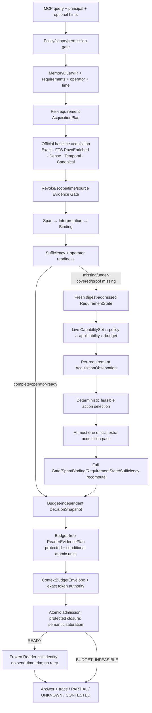

# MiLAi DG13–DG23 讨论总结、当前方法流程与本地项目对比

> 日期：2026-08-29  
> 文档性质：本地架构与实验事实审计；不是生产发布声明，也不是 formal holdout 结果  
> 覆盖范围：DG13–DG19 的迁移背景、当前讨论中的 DG19–DG23、MiLAi 当前源码，以及本地安装的 ReFind、Graphiti、Mem0、Hindsight、OpenViking、ReMe、LongMemEval 与 LongMemEval-V2  
> 事实优先级：冻结架构/实施合同 > terminal receipt > 当前源码 > runbook/Goal > 外部项目本地源码 > README 说明

## 1. 执行摘要

前面全部讨论可以压缩为一条清晰的因果链：

```text
DG19：一次 LLM lexical residual 没有稳定 mediator gain
  ↓ 发现不是“Provider 不够好”，而是状态、能力和执行路径不闭合
DG20：建立 fresh RequirementState + Runtime Capability + 正式 acquisition
  ↓ deterministic recovery 已能解决已知缺失，Provider 不再必要
DG21：尝试类型定向、时间完备性和效率泛化
  ↓ requirement 表达与时间查询通过，但调用成本及 Reader 失败阻止总体 PASS
DG22：把目标收紧为 recall precision 与答案正确性
  ↓ recall/binding 达标，temporal COUNT 未闭合，并出现正确病例回归
DG23：证明决策与上下文预算解耦，取消 512/2048 的架构地位
  ↓ context/decision 通过，剩余问题定位为 Reader semantic non-monotonicity
```

当前最准确的方法名称是：

> **Capability-Constrained Requirement-State Refinding with Budget-Invariant Evidence Rendering**  
> 能力约束、需求状态对齐的再查找，加上预算不改变语义决策的证据渲染。

它不是“让 LLM 多搜几次”，而是：

```text
受治理证据/规范状态
+ Fresh RequirementState
+ Runtime 可执行能力集合
+ 逐 requirement observation
+ deterministic one-pass official acquisition
+ 完整 Binding/Sufficiency 重算
+ budget-free ReaderEvidencePlan
+ atomic、受保护的 Reader render
```

最重要的当前结论有六条：

1. **DG19 的负结果只否定 stale-state、lexical-only、独立 BM25 shadow；没有否定 ReFind，也没有否定 state-aligned refinding。**
2. **DG20 已证明 deterministic、requirement-aligned acquisition 在当前 opened-dev slice 上有效，Residual Provider 因“不需要”而关闭。**
3. **DG22 已把主要 retrieval/binding 问题推进到 PASS，但没有完成最终答案正确性闭环。**
4. **DG23 已证明 512/2048 不应控制决策；它们只应是历史评测臂，不是产品或算法常量。**
5. **剩余主要问题不再是“召回更多”或“给更多 token”，而是 Reader 对相同已接受语义的非单调消费，以及 temporal COUNT 的完备性证明。**
6. **这些能力虽然已经进入源码，但四个关键候选开关默认仍为 `False`，formal holdout 未使用，生产发布未获授权。不能把“实现且在 opened-dev 通过”写成“当前默认产品已启用”。**

## 2. 讨论演进与终态

### 2.1 DG13–DG19 的前置演进

DG13–DG19 的完整迁移记录见 [MiLAi DG13–DG19 架构与方法迁移 Prompt](../MiLAi_DG13-DG19_架构与方法迁移Prompt_2026-08-28.md)。其主要演进为：

| Goal | 主要问题 | 已形成的结论 |
| --- | --- | --- |
| DG13 | MiLA 能否成为本地 MCP 受治理 Memory Service | query-first read、Evidence/Claim 分离、governed lifecycle 和 scoped MCP 链成立 |
| DG14 | LongMemEval adapter 相对 BM25 表现如何 | 小样本与 BM25-T 接近；flat chunk、生命周期成本与 candidate recall 问题暴露 |
| DG15 | 如何降低 ingest/finalize/cleanup 成本 | 形成 batch、persistent worker、incremental projection、watermark 和 namespace cleanup lane |
| DG16 | 如何从 flat chunk 进入语义组合 | Raw Evidence/Canonical State 分离，出现 count/divide 等 operator precursor，但未泛化 |
| DG17 | 如何实现 typed semantic read | 形成 QueryIR、per-slot acquisition、Binding、Sufficiency 和安全 abstention；acquisition 仍不足 |
| DG18 | ReFind-style residual 是否可执行 | packing loss 为 0；原 residual treatment 因 Provider schema/streaming contract 实际未交付 |
| DG19 | 修复 Provider 后 residual 是否有 mediator gain | treatment 真正交付，但 opened-dev 只改善 1 个缺失病例，终态 PARKED |

DG13–DG19 建立了后续工作的基础边界：

- MiLA 是 Memory Service，不是 Agent Runtime。
- Evidence、Proposal、Canonical Claim、projection、Context 是不同层。
- search result、summary、graph 或模型输出只能成为 candidate，不能自己获得 authority。
- Memory query 的成功不是单一 Top-k 指标，而是 access、recall、evidence completeness、state validity 和 Reader utilization 的乘积。
- COUNT、range、multi-session join 需要 completeness proof；“找到一个相关结果”不等于 COMPLETE。
- Reader 在证据不足时返回 UNKNOWN 是安全成功，不应通过 Prompt 强迫其猜测。

### 2.2 DG19：失败对象必须收紧

权威终态为 [DG19 terminal receipt](../../var/dg19/terminal/dg19-terminal-20260828-001/receipt.json)：

```text
PARKED_NO_MEDIATOR_GAIN

eligible opened-dev cases       3
valid / accepted hints          3 / 3
additional acquisition passes   3
new governed candidates         10
missing cases improved          1（门槛为 2）
coverage delta                  +0.043478261
binding delta                   +0.071428571
operator-ready delta            +1
correct-case regression         0/4
automatic retry                 0
```

DG19 真正否定的是：

> 使用可能陈旧的 missing-slot 状态，让模型生成一次 lexical cue，再由实验层独立简化 BM25 执行额外检索，不能稳定改善 required-evidence mediator。

它没有否定：

> 基于当前 requirement state、当前 observation 和真实可执行 acquisition channel 的受限再查找。

因此正确表述是：

```text
Stale-state, lexical-only residual shadow failed to produce mediator gain.
```

不是：

```text
ReFind-style refinding failed.
```

### 2.3 DG20：修复状态、能力与产品执行路径

权威终态为 [DG20 S6 terminal receipt](../../var/dg20/s6/dg20-s6-terminal-20260828-002/receipt.json)：

```text
Core       PASS_REQUIREMENT_STATE_ALIGNED_ACQUISITION
Residual   DISABLED_NOT_NEEDED
Candidate  default OFF
Holdout    not consumed
```

DG20 完成了五项结构修复：

1. 从 archived `missing_slots` 升级为 fresh、digest-addressed `RequirementState`。
2. 把 VALUE、EVENT、SET、CARDINALITY、RANGE、VERSION、CONFLICT、PROVENANCE 纳入统一 requirement 表达。
3. 从 Runtime live capability、policy、applicability 和 budget 的交集生成可执行动作。
4. 让 extra acquisition 复用正式产品 repository、Gate、hydration 和 candidate path。
5. extra pass 后重新运行 Binding、RequirementState、Sufficiency 和 operator readiness，而不是只算 proxy。

结果说明：当前已知缺失病例可由 deterministic official channel 恢复，Residual Provider 在该 slice 上没有增量必要性。这个结果支持“先修 Runtime”，不支持“以后永远不需要模型 cue”。

### 2.4 DG21：表达能力与效率局部通过，总体泛化未成立

权威终态为 [DG21 S9 terminal receipt](../../var/dg21/s9/dg21-s9-terminal-20260829-001/receipt.json)：

| Lane | 终态 |
| --- | --- |
| Preference requirement | `PASS_PREFERENCE_REQUIREMENT_EXPRESSIVITY` |
| Temporal requirement | `PASS_QUERY_TIME_TEMPORAL_COMPLETENESS` |
| Core/Overall | `PARKED_NO_SAFE_GENERALIZED_POLICY` |

DG21 的正向进展：

- target-local anchor 替代全局探测；
- 先按 requirement 类型剪枝，再做 Binding；
- Reader-visible 时间戳稳定化；
- identity-addressed checkpoint 和失败隔离；
- deterministic stage 未引入 Provider、Reader、retry 或 canonical mutation。

独立的 label-free 效率审计显示：

```text
legacy binding evaluations     3311
current binding evaluations     207
reduction                    93.7481%
hydrated candidates              43 ≤ 64
additional acquisition calls     10 > 8
```

因此效率优化是真实的，但没有满足预声明的 acquisition-call ceiling。与此同时，Reader 连续返回截断 JSON，matched correctness 未能封存。DG21 不能判 Full PASS。

### 2.5 DG22：Recall/Binding 通过，答案层失败

权威终态为 [DG22 S10 terminal receipt](../../var/dg22/s10/dg22-s10-terminal-20260829-001/receipt.json)：

| 层 | 终态 |
| --- | --- |
| Reader contract | `PASS_READER_CONFORMANCE` |
| Recall/Binding | `PASS_REQUIREMENT_COMPLETE_RECALL_PRECISION` |
| Temporal | `PARTIAL_EVENT_POINT_ONLY_COUNT_UNRESOLVED` |
| Answer | `FAIL_CORRECT_CASE_REGRESSION` |
| Overall | `FAIL_SAFETY_OR_REGRESSION` |

关键 opened-dev 指标：

```text
safe-oracle normalized recall          0.80
required evidence coverage @2048      19/23
required evidence coverage @512       18/23
accepted Binding precision             1.0
UsefulCandidateRate                    0.3462
additional acquisition calls           6
hydrated candidates                    26
Wrong COMPLETE                          0
correct-case regression                 1
```

DG22 说明了两个不同事实：

- acquisition、Binding precision 和安全 abstention 已显著改善；
- 最终答案不会因为 evidence coverage 增加而自动单调改善。

同时，temporal COUNT 仍是 `0/2 OperatorReady`。这不是再加 lexical alias 能解决的问题，而是 event occurrence、bounded scan 与 completeness proof 的问题。

### 2.6 DG23：预算不再拥有语义决策权

权威终态为 [DG23 S9 terminal receipt](../../var/dg23/s9/dg23-s9-terminal-20260829-001/receipt.json)：

| 层 | 终态 |
| --- | --- |
| Context/Decision | `PASS_BUDGET_INVARIANT_DECISION_AND_CONTEXT` |
| Recall/Binding | `PASS_DG22_RECALL_BINDING_NON_REGRESSION` |
| Safety | `PASS_DG23_SAFETY` |
| Reader semantic | `PARKED_READER_SEMANTIC_NON_MONOTONICITY` |
| Answer | `FAIL_CORRECT_CASE_REGRESSION` |
| Overall | `PARKED_READER_SEMANTIC_NON_MONOTONICITY` |

DG23 用每个 case 自身的 reference render 推导预算：

```text
B_ref              854 tokens
B_safe range       129–854
B_safe p50         319
```

并得到：

```text
safe-oracle recall                  13/15 = 0.8667
accepted Binding precision          1.0
required evidence reference         22
required evidence @ historical 512  18
additional acquisition calls         4
hydrated candidates                 18
UsefulCandidateRate                 1.0
Wrong COMPLETE                       0
```

历史 DG22 的 2048 regression 被修复，但两个 temporal-count case 在两种 primary mode、三个 replicate 中仍产生 12 次正确病例回归。终态因此被准确定位为 Reader semantic non-monotonicity，而不是 retrieval regression。

### 2.7 跨 Goal 的质量与冻结边界

各 Goal 的终态报告还确认了以下工程事实：

| Goal | 终态质量证据摘要 | 未越过的边界 |
| --- | --- | --- |
| DG20 | 557 tests passed；1 个明确 out-of-scope optional OpenWorker composition skip；strict mypy、Ruff、真实 PostgreSQL integration/security 通过 | Candidate 默认关闭；holdout 未使用；无 public MCP/DB/架构修改 |
| DG21 | 454 unit、14 contract、21 DG21 evaluation 通过；PostgreSQL 99 passed/1 skipped；strict mypy、Ruff 通过 | S6 未进入 schema lane；无 Reader/Provider/public MCP/DB/架构修改 |
| DG22 | 458 unit、14 contract、26 DG22 通过；PostgreSQL 99 passed/1 skipped；strict mypy、Ruff 通过 | 正确病例回归未被降级；无 case/gold runtime 特判；holdout 未使用 |
| DG23 | 485 unit、14 contract、50 DG23 targeted、76 DG20–22 behavior regression 通过；PostgreSQL 99 passed/1 skipped | 两个 temporal-count 失败被保留；无 packing/seed/retry/case 特判 |

这些测试计数来自各 Goal 的 terminal/quality 总结；不同组之间可能存在重叠，不能相加为“独立测试总数”。四轮均保持冻结架构 manifest：

```text
ac16f3b7f9413a7b2d8373b6e7d306697df0bc7908572bb3b0344260d8a55d0e
```

## 3. 当前 MiLAi 的真实状态：三层不能混写

“当前方法”必须拆成三层，否则容易把候选实验写成默认产品事实。

| 层 | 当前事实 | 权威边界 |
| --- | --- | --- |
| 冻结产品架构 | Evidence-first、Versioned-state、Governed-write、query-first read、Canonical Gate、minimal ContextCapsule | `architecture/v1.0` 与 [Lean V1 实施合同](../../MiLAi_Lean_V1_实施合同.md) |
| 已实现候选能力 | RequirementState、capability-constrained deterministic recovery、type-directed/accuracy acquisition、budget-invariant atomic context | 已进入 Runtime 源码；opened-dev/contract/quality 有证据 |
| 评测专用边界 | 512/2048 arms、frozen Reader identity、replicate seed、exact preflight registry、matched scorer | DG22/DG23 eval runner；不自动等于部署态 API |

当前配置 [settings.py](../../runtime/src/milai/config/settings.py) 中：

```python
retrieval_evidence_dense_enabled = False
retrieval_deterministic_recovery_enabled = False
retrieval_type_directed_acquisition_enabled = False
budget_invariant_context_v0_1 = False
```

所以准确说法是：

> MiLAi 已实现并验证了候选闭环，但默认产品配置仍走冻结兼容路径；候选能力尚未得到 production release authorization。

实施合同同时把 ReMe、OpenViking、Hindsight、Graphiti 等外部 route 保持为 `PARKED` 的生产替换方案。它们可以作为本地代码参考、隔离 baseline 或候选 projection 实验，但本报告的比较不授权将任何一个项目接入 MiLA canonical write/read 主链。

## 4. 冻结的产品读写主链

### 4.1 Governed write

```text
Interaction / tool result / observation
→ Evidence capture
→ DeriveAndDiagnose
→ OperationProposal
→ invariant validation
→ independent Steward / user review
→ immutable ClaimVersion / ClaimHead / OpenIssue
→ audit + outbox
→ asynchronous projection
```

其不可破坏边界为：

- Evidence 只证明“观察到什么”，不直接证明“当前应该相信什么”。
- Proposal 不等于 Commit。
- 普通 submitter 不能自批；reviewer 不能越权读取其他 proposal。
- FTS、dense、graph、summary 和模型输出都只能产生 candidate。
- 冲突不能用 last-write-wins 掩盖；不能合法解决时保留 OpenIssue/CONTESTED。
- Context 或 Reader 输出不能反向修改 Canonical State。

### 4.2 Query-first read

冻结读链为：

```text
MCP query + optional hints
→ principal / capability / scope gate
→ QueryPlan / MemoryQueryIR
→ exact / FTS / guarded dense / temporal candidate acquisition
→ Canonical or Evidence Applicability Gate
→ Binding / Sufficiency
→ operator result or minimal ContextCapsule
→ answer + trace
```

TaskIdentity 只能是可选 scope、ranking、reuse 或 authorization hint。Task 缺失不等于 memory 不可查询。

## 5. 当前候选方法的详细执行流程

### 5.1 总流程



### 5.2 Step 0：进入 Runtime 前的治理条件

输入不是裸 query，而是：

```yaml
request:
  query:
  principal:
  scope:
  capability:
  optional_task_hint:
  optional_temporal_hint:
```

Runtime 首先确定：

- principal 是否可访问目标 scope；
- evidence 是否被撤销、过期或超出时间/权限范围；
- query 是 Canonical State、Episodic Evidence 还是 Evidence Composition；
- 是否允许 Exact、FTS、Dense、Temporal、Neighbor 等 channel。

未经 Gate 的 candidate 不得进入 Binding，更不能获得 canonical authority。

### 5.3 Step 1：QueryIR 与 requirement contract

Query 被编译为 typed `MemoryQueryIR` 和 per-requirement `AcquisitionPlan`。Requirement 不是简单字符串槽位，而是可执行完成合同。

[requirement_state.py](../../runtime/src/milai/domain/requirement_state.py) 中的主要 kind 包括：

```text
VALUE_SLOT
EVENT_SLOT
SET_MEMBERS
CARDINALITY
RANGE_COMPLETENESS
VERSION_CHAIN
CONFLICT_SIDE
PROVENANCE
```

状态包括：

```text
SATISFIED
MISSING
UNDER_COVERED
COMPLETENESS_PROOF_MISSING
CONTESTED
UNRESOLVED
```

这解决了 DG19 的根本缺陷：`missing_slots=[]` 不再意味着没有 residual work。COUNT、集合成员不足、时间范围扫描未完成或 provenance 缺失都能激活正确诊断。

### 5.4 Step 2：正式 baseline acquisition

Baseline 必须调用正式 `RetrievalRepository` 和产品 acquisition stack，不允许 eval 层复制 BM25、fusion、neighbor expansion 或 temporal filter。

可用 channel 由当前实现与策略决定，包括：

```text
FTS_RAW
FTS_ENRICHED
EVIDENCE_DENSE
SOURCE_OBSERVED_RANGE_SCAN
TEMPORAL_EVENT
CANONICAL_STATE
ADJACENT_TURNS
SAME_EPISODE
```

Baseline acquisition 后再做：

```text
candidate
→ scope/revoke/source/time Gate
→ answer-bearing Span
→ typed Interpretation
→ Requirement Binding
→ SufficiencyDecision
→ operator readiness
```

### 5.5 Step 3：原子重建 Fresh RequirementState

[requirement_state.py](../../runtime/src/milai/application/requirement_state.py) 从同一时刻的以下对象重建状态：

```text
QueryIR digest
AcquisitionPlan digest
Capability digest
Candidate snapshot digest
Binding digest
SufficiencyDecision digest
state_epoch
```

每个 requirement 保存：

- accepted/possible/rejected binding refs；
- accepted evidence refs；
- rejection reason summary；
- required/observed cardinality；
- completeness proof status。

Candidate snapshot 发生变化时 epoch 前进。旧 action 若携带旧 digest/epoch，Runtime 以 `STALE_REQUIREMENT_STATE` 拒绝。已满足 requirement 也不能再次成为 target。

### 5.6 Step 4：从 Runtime 生成 CapabilitySet

[acquisition_capability.py](../../runtime/src/milai/application/acquisition_capability.py) 根据 live repository、配置、projection readiness、time feasibility、policy 和预算派生能力。

```text
FeasibleActions
= RuntimeCapabilities
∩ PolicyAllowedActions
∩ RequirementApplicableActions
∩ RemainingBudget
```

Prompt 不能声明 Runtime 不会执行的 channel。每个 action 都绑定：

```yaml
target_requirement_id:
channel:
requirement_state_digest:
requirement_state_epoch:
capability_digest:
policy_digest:
bounded_cost:
  acquisition_passes: 1
  model_calls: 0
```

当前 policy 的 `max_extra_passes` 为 1，model/provider 调用为 0。

### 5.7 Step 5：逐 requirement observation

[deterministic_recovery.py](../../runtime/src/milai/application/deterministic_recovery.py) 构建的 observation 不再只有“0 candidates”，而是区分：

```text
matched evidence
rejected evidence and reason
seen/exhausted regions
previous acquisition history
available feasible actions
remaining budget
```

例如 temporal case 应能区分：

```text
NO_LEXICAL_HIT
```

与：

```text
TEXT_FOUND_BUT_EVENT_TIME_UNKNOWN
```

二者的下一动作完全不同。

### 5.8 Step 6：确定性 action selection

Runtime 先决定“怎样搜”，而不是把 channel 选择交给模型。

通用映射为：

| Requirement/rejection | 优先动作 |
| --- | --- |
| predicate/entity semantic mismatch | `FTS_ENRICHED` 或 `EVIDENCE_DENSE` |
| `EVENT_TIME_UNKNOWN` | `TEMPORAL_EVENT`；不可用则 typed unavailable |
| anchor 已找到、operand 缺失 | `ADJACENT_TURNS` 或 `SAME_EPISODE` |
| cardinality under-covered | bounded source/range scan |
| range completeness proof missing | deterministic bounded scan；不回退 lexical 猜测 |
| canonical current/history/version | Canonical State lane |

DG22 的 accuracy acquisition 进一步加入 target-local anchor、type-directed candidate pruning 和 bounded target count。它被整合进 deterministic recovery，而不是另起一条可绕过 Gate 的影子路径。

### 5.9 Step 7：一次正式 extra acquisition

动作通过 digest、capability、policy、cost 和 target 状态校验后，执行至多一次正式 acquisition：

```text
FeasibleAction
→ official acquisition plan compiler
→ RetrievalRepository
→ channel-specific retrieval
→ fusion/hydration/neighbor expansion
→ Evidence Gate
```

Shadow 运行只是不把额外结果交给真实用户；它仍应经过同一产品 acquisition 路径。

### 5.10 Step 8：完整重算而非 proxy scoring

Extra evidence 进入后必须重跑：

```text
baseline + extra candidates
→ Gate
→ Span
→ Interpretation
→ Binding
→ RequirementState(epoch + 1)
→ SufficiencyDecision
→ Operator readiness
```

`RequirementState` 只能描述 query-local diagnostic state，不能自己授权 canonical write、停止搜索或替代 Sufficiency。最终 COMPLETE 权仍属于 deterministic Sufficiency/Operator contract。

### 5.11 Step 9：生成预算无关的 DecisionSnapshot

[reader_evidence_plan.py](../../runtime/src/milai/domain/reader_evidence_plan.py) 中的 `DecisionSnapshot` 固定：

- source snapshot；
- QueryIR/Plan；
- candidates/Gate；
- Binding/RequirementState；
- Sufficiency/Operator；
- accepted exact evidence spans。

它不包含 512、2048 或任意 presentation budget。预算不能改变：

```text
哪个 requirement 已满足
哪个 evidence 被接受
Sufficiency 是否 COMPLETE
operator 的确定性值
```

### 5.12 Step 10：先编译 budget-free ReaderEvidencePlan

[memory_context.py](../../runtime/src/milai/application/memory_context.py) 的候选编译器版本为 `runtime-context-compiler-v0.3-dg23-atomic`。它先生成稳定语义单元：

```text
protected units:
  status
  deterministic derived result
  canonical state required by the query
  accepted exact binding spans
  required evidence
  open issue / contested state

conditional units:
  有可证明 query-local 增益的邻接或 provenance

omitted units:
  semantic duplicate
  no-admissible-gain context
```

每个 Reader unit 都是 atomic，不允许中间截断为半条证据。

### 5.13 Step 11：按 ContextBudgetEnvelope 渲染

渲染顺序为：

1. 计算 protected closure 的精确 token 成本。
2. 若 protected closure 超过可用预算，返回 `BUDGET_INFEASIBLE`，不调用 Reader。
3. protected closure 完整进入。
4. conditional unit 只在其完整 activation threshold 达到时整体进入。
5. 所有有增益单元进入后标记 `semantic_saturated`；更大预算不得为了填满而注入无增益噪声。
6. `atomic_unit_truncation_count` 必须为 0。

这个策略与“先拼大文本，再按 token 前缀截断”有本质区别。

### 5.14 Step 12：Reader 边界

DG23 的 [reader_boundary.py](../../evals/dg23/reader_boundary.py) 在评测层固定：

- Reader/provider/model/chat-template/tokenizer 身份；
- exact context digest；
- source snapshot 与 replicate 的 seed；
- exact token preflight；
- overflow 时 provider 前 fail-closed；
- send-time 不再 trim；
- invalid/truncated JSON 不自动 retry；
- 相同 identity 可 checkpoint/reuse。

这里必须保留一个实现边界：

> DG23 已证明评测 Reader boundary 可以做到 exact、identity-addressed 和 fail-closed；当前产品 app wiring 并未因此自动获得同一套部署态 Reader registry。Runtime compiler 支持 exact token counter，但默认 app wiring 是否传入真实 Reader tokenizer 仍需单独发布审计。

## 6. 为什么曾选择 512 和 2048

512/2048 的来源是实验设计，不是架构设计：

- 512 是紧预算臂，用于暴露 packing loss、required closure 缺失和最小上下文行为。
- 2048 是相对宽松预算臂，用于观察更多证据是否带来 coverage/answer gain。
- DG18 已发现二者均保留 `11/23` required evidence，说明当时主要瓶颈在 acquisition，不在 token 上限。
- DG22 的 2048 coverage 为 `19/23`、512 为 `18/23`，但 512 的 EM/F1 反而更高，直接否定“上下文越大，答案必然越好”。
- DG23 因此用 case-specific `B_ref` 与 `B_safe` 替代固定臂的架构地位。

正确使用方式是：

```text
512 / 2048
= historical matched evaluation arms
≠ product default
≠ retrieval slice size
≠ RequirementState size
≠ ReaderEvidencePlan constant
≠ external-project convention
```

以后的核心判断应使用：

```text
B_ref(case)  = 完整 reference semantic plan 的真实 Reader token 成本
B_safe(case) = protected closure + 已授权 conditional threshold 的可行预算
```

512/2048 可以保留为兼容性回归点，但不能再驱动算法、packing 或发布判断。

## 7. 本地参考项目代码审计范围

| 项目 | 本地路径 | 审计身份 |
| --- | --- | --- |
| ReFind | `/cra/memory/mx_memory/ReFind` | `a80175ca0eeb52a938d7cab7a602bc780de8a577` |
| Graphiti | `/cra/memory/mx_memory/graphiti` | `401c59a65bdeb22a44136901ff30231e6998a7fe` |
| Mem0 | `/cra/memory/mx_memory/mem0` | `001c235229be8795e3834520467bd0d661ed8f34` |
| Hindsight | `/cra/memory/mx_memory/hindsight` | 根目录无 `.git`；按本地源码 snapshot 审计 |
| OpenViking | `/cra/memory/mx_memory/OpenViking` | `499995f3ed2e7f551a715179c4053772c51ff819` |
| ReMe | `/cra/memory/mx_memory/ReMe` | 根目录无 `.git`；按本地源码 snapshot 审计 |
| LongMemEval | `/cra/memory/mx_memory/benchmarks/LongMemEval` | `9e0b455f4ef0e2ab8f2e582289761153549043fc` |
| LongMemEval-V2 | `/cra/memory/mx_memory/benchmarks/LongMemEval-V2` | `2cc8c540bdb87fe6761629b585e727e1c4704520` |

本节比较的是当前本地代码，不把论文/README 的概念描述当成已实现事实。项目目标不同，因此“没有 MiLA 的治理合同”不是对外部项目的缺陷判定，只表示不能直接替换 MiLA Core。

## 8. 横向总对比

| 维度 | MiLAi 当前候选 | ReFind | Graphiti | Mem0 | Hindsight | OpenViking | ReMe |
| --- | --- | --- | --- | --- | --- | --- | --- |
| 核心对象 | Evidence、ClaimVersion、Requirement、Binding | chat turn/session/note | episode、entity node、edge、community | extracted memory | fact/observation/link/mental model | VikingFS resource/memory tier | Markdown file/chunk/wikilink |
| 查询控制状态 | 显式 fresh RequirementState | messages、seen IDs、last hits、notes | SearchConfig + graph filters | query + scope filters | recall/reflect state与预算 | session expansion + recall ledger | query + tool context seen chunks |
| 主要检索 | Exact/FTS/Enriched/Dense/Temporal/Neighbor/Canonical | BM25 + session RRF + neighbor | BM25/cosine/BFS，多对象并行 | vector + keyword + reranker | semantic + BM25 + graph + temporal | 多 query、分类 quota、分层读取 | BM25 + optional vector + RRF + link expansion |
| 迭代方式 | 默认 deterministic 至多一次 extra pass | LLM 最多 4 个 action | 单次配置化混合检索 | search 单次；write 可 LLM 推理 | recall 单次多路；reflect 可迭代 | 一次 server assembly，可 query expansion | Agent 可多次 search/read/traverse |
| 时间语义 | source/event/time Gate + completeness proof | absolute date filter | edge valid/invalid/created/expired | metadata filter，非核心完成合同 | temporal arm + time buckets + link spreading | session/event metadata与过滤 | daily path/date filter |
| 完成权 | deterministic Sufficiency/Operator | Agent `finish_search` | 无 query-specific completion contract | 无 requirement completion contract | reflect/LLM 生成答案 | assembler 只返回 context | Agent 决定是否继续 |
| 治理/authority | Evidence≠Claim；reviewed canonical write | raw chat evidence | 图事实抽取/更新 | LLM add/update/delete 或 additive extraction | retain/consolidate/mental model | 文件/记忆生命周期 | 文件为 source of truth |
| Context budget | case-specific protected closure、atomic admission、semantic saturation | top-5 search + local window + notes | result limit，非 Reader budget | top_k，reranker 512 是输入 cap | `max_tokens` 与 search budget 分离 | 默认 1600，whole-tier fallback | 默认 result limit 5，逐步 read |
| 固定 512/2048 Reader 臂 | 仅历史评测 | 无 | 无 | 无；512 仅 HF reranker | 无通用固定双臂 | 无；同数值主要是 embedding/ingest 等其他用途 | 无 |
| 可直接替换 MiLA Core | 不适用 | 否 | 否 | 否 | 否 | 否 | 否 |

## 9. ReFind 对比

本地代码入口：[retriever.py](../../../ReFind/app/retriever.py)、[bm25.py](../../../ReFind/app/bm25.py)、[config.py](../../../ReFind/app/config.py)。

### 9.1 ReFind 的真实流程

```text
question
→ search_chatrecord(keywords, optional absolute dates)
→ BM25 result + session RRF + ±2 local chunks
→ observation
→ take_note(selected result indexes)
→ excluded seen anchors
→ reformulate later search from observation
→ repeat, up to four actions
→ finish_search
→ separate answer stage
```

默认参数为：

```text
agent_max_iterations = 4
search_top_k          = 5
context_window        = 2
session_rrf           = true
```

ReFind 的关键收益不是“一次同义词扩展”，而是 observation 驱动的多轮改写、seen state、notes、session fusion 和 local context。

### 9.2 与 MiLAi 的相同点

- retrieval 与 answer 分离；
- 保留原始 turn、session、timestamp 和邻接；
- 使用跨轮 seen state，避免重复结果；
- 新 observation 会影响后续 acquisition；
- 搜索应围绕仍未解决的问题，而不是固定 global query。

### 9.3 关键差异

| ReFind | MiLAi |
| --- | --- |
| LLM 选择 `search/take_note/finish` | Runtime 选择 capability-valid action，模型无 COMPLETE 权 |
| 隐式任务状态在 messages/notes 中 | 显式 RequirementState、epoch 与 digests |
| BM25/session/local context 是主要执行面 | 多 channel official acquisition + governance Gate |
| notes 由 agent 挑选 | Binding/Sufficiency 确定 accepted evidence |
| 最多四个 action | 当前授权至多一次 deterministic extra pass |
| 无 Evidence/Claim authority 分离 | Evidence、Proposal、ClaimVersion、OpenIssue 分层 |

### 9.4 应吸收与不应吸收

应吸收：

- observation-conditioned next query；
- seen session/region 与 note provenance；
- anchor-local context；
- search/answer 分离；
- 在 deterministic policy 确实存在 semantic expression gap 时，让模型只补 cue。

不应整体移植：

- LLM `finish_search` authority；
- 默认四轮开放式 Agent loop；
- 每次请求独立重建/执行实验 BM25；
- regex/ReAct parser；
- 绕过 scope、revoke、Binding 或 Sufficiency 的 raw note 注入。

结论：DG19 不是 ReFind 复现；DG20–DG23 才逐步实例化了 MiLA 版本的受限闭环，但仍没有授权 ReFind 式多轮搜索。

## 10. Graphiti 对比

本地代码入口：[search_config.py](../../../graphiti/graphiti_core/search/search_config.py)、[search.py](../../../graphiti/graphiti_core/search/search.py)、[search_filters.py](../../../graphiti/graphiti_core/search/search_filters.py)。

Graphiti 的 `SearchConfig` 默认 `limit=10`，可在 edge、node、episode、community 上并行组合：

```text
BM25
cosine similarity
BFS
RRF / MMR / cross-encoder
node distance / episode mentions rerank
```

Edge filter 支持 `valid_at`、`invalid_at`、`created_at`、`expired_at`，并可按 `group_ids` 限定图域。这使 Graphiti 更接近“temporal knowledge graph retrieval”。

与 MiLAi 的关系：

- Graphiti 的 episode/entity/edge 可启发 event projection、version chain 与 neighbor traversal；
- 图搜索适合作为 projection candidate channel；
- `limit=10` 是 result limit，不是 Reader token budget；
- 图上的 fact/edge 不能在 MiLA 中自动获得 canonical authority；
- Graphiti 没有 MiLA 的 per-query RequirementState、Binding、Sufficiency/completeness contract；
- 因此它适合隔离 baseline 或 projection backend，不适合替换 Canonical State/Governed write。

对 temporal COUNT 而言，Graphiti 只能帮助“可达”，不能单独证明“范围已完整扫描、事件已去重、时间轴合法”。

## 11. Mem0 对比

本地代码入口：[memory/main.py](../../../mem0/mem0/memory/main.py)、[HF reranker](../../../mem0/mem0/reranker/huggingface_reranker.py)。

当前本地代码的典型行为：

- `add(..., infer=True)` 使用模型抽取 memory；
- V3 additive flow 读取最近 10 条消息、检索 top-10 existing memories，再抽取带 link 的新 memory；
- 兼容路径存在 ADD/UPDATE/DELETE/NONE memory operation；
- `search` 默认 `top_k=20`；
- 对未过期搜索可 overfetch 到 `max(top_k*4, 60)`；
- 可叠加 keyword、entity boost 和 reranker。

Mem0 的 HuggingFace reranker `max_length=512` 是 query-document pair 的模型输入长度，不是最终 Reader context budget。因此不能将它当作外部项目也采用“512 Reader slice”的证据。

可借鉴：

- provider/vector-store/reranker 的适配层；
- overfetch 后融合、rerank；
- session/user/agent/run 作用域过滤；
- linked memory 作为候选关系。

不能直接移植：

- 让 LLM 直接决定持久 ADD/UPDATE/DELETE；
- 把 extracted memory 当作已治理 truth；
- 用 top_k 代替 requirement completeness；
- 用 reranker 的 512 输入上限决定 MiLA Reader budget。

## 12. Hindsight 对比

本地代码入口：[retrieval.py](../../../hindsight/hindsight-api-slim/hindsight_api/engine/search/retrieval.py)、[fusion.py](../../../hindsight/hindsight-api-slim/hindsight_api/engine/search/fusion.py)、[engine interface](../../../hindsight/hindsight-api-slim/hindsight_api/engine/interface.py)。

Hindsight 的 recall 是当前本地项目中 channel 组合最接近 MiLA oracle 的实现之一：

```text
semantic vector
+ BM25
+ graph expansion
+ temporal retrieval
→ fusion/rerank
```

实现细节包括：

- HNSW semantic overfetch 为 `max(limit*5, 100)` 后再裁剪；
- temporal window 划分为 8 个 bucket，轮流选择 entry points；
- temporal/causal link spreading 有 budget，并以最多 5 次迭代限制；
- fusion 对 semantic、BM25、graph、temporal 各 arm 做平衡，避免一个过扩展 backend 挤掉其他来源；
- recall `max_tokens` 与 low/mid/high search budget 是两个不同概念；
- reflect 是可迭代回答过程，和 recall 原始结果分开。

可借鉴：

- 正式多 channel oracle；
- per-arm candidate floor，防止 channel starvation；
- temporal coverage bucket，而不是只取与区间中点最相似的事件；
- search-depth budget 与返回 token budget 分离；
- graph/temporal spreading 的硬迭代与节点预算。

MiLA 必须额外保留：

- source/scope/revoke Gate；
- RequirementState 和 rejection reason；
- exact requirement Binding；
- range/cardinality completeness proof；
- deterministic COMPLETE/operator authority；
- Evidence 与 Canonical Claim 分离。

因此 Hindsight 更适合作为 acquisition policy 的对照和灵感来源，不是 MiLA governed state backend。

## 13. OpenViking 对比

本地代码入口：[params.py](../../../OpenViking/openviking/retrieve/context_assembler/params.py)、[pipeline.py](../../../OpenViking/openviking/retrieve/context_assembler/pipeline.py)、[budget.py](../../../OpenViking/openviking/retrieve/context_assembler/budget.py)、[ledger.py](../../../OpenViking/openviking/retrieve/context_assembler/ledger.py)。

OpenViking 当前 context assembler 的默认值为：

```text
DEFAULT_MAX_TOKENS       = 1600
DEFAULT_LIMIT            = 10
MAX_PLANNED_QUERIES      = 3
READ_CONCURRENCY         = 8
```

其流程为：

```text
session-aware query expansion
→ cross-turn recall ledger / exclude URIs
→ quota/peer/filter-aware candidate gather
→ L0/L1/L2 or uri/abstract/overview/full tier selection
→ whole-tier budget fallback
→ breadth floor, then depth upgrades
→ optional server rewrite
```

OpenViking 与 DG23 的相似点：

- 先构造候选与层级，再按预算渲染；
- oversized tier 回退到完整的更小 tier，而不是随意截断；
- per-entry cap 避免单个结果吞噬全部预算；
- session ledger 可以跨 turn 去重；
- 宽度优先，再允许深度升级。

关键差异：

- OpenViking 会主动用 leftover budget 做额外 full upgrade；DG23 在 semantic saturation 后停止，避免“为了花完预算”增加无证明增益的内容。
- OpenViking 的 category/tier 是存储与摘要层级；MiLA 的 protected/conditional 是 query requirement 和 Binding 产生的语义闭包。
- OpenViking 没有 MiLA 的 DecisionSnapshot、RequirementState、Sufficiency 和 canonical authority contract。

OpenViking 源码中确实出现 512/2048，但主要是 embedding dimension、embedding input limit 或 Markdown ingestion section 的 `min=512/max=2048`；context assembler 默认是 1600。它不支持“行业普遍用 512/2048 Reader 双臂”的说法。

## 14. ReMe 对比

本地代码入口：[search.py](../../../ReMe/reme/steps/index/search.py)、[default.yaml](../../../ReMe/reme/config/default.yaml)、[Memory Search 文档](../../../ReMe/docs/zh/memory_search.md)。

ReMe 的核心是 file-native、user-owned workspace：

```text
Markdown/frontmatter/wikilink files = source of truth
index/graph/cache                  = rebuildable projection
```

默认搜索实现：

```text
default limit            5
candidate multiplier     5.0
candidate hard cap       200
vector weight            0.7
RRF k                    60
link expansion           enabled
max links/direction      10
```

搜索执行：

```text
query/date/filter
→ parallel vector + BM25（vector 可关闭）
→ RRF
→ min_score
→ tool-context seen-chunk dedup
→ top limit
→ wikilink in/out expansion
→ path + exact line range
```

ReMe 的优势是透明、可读、可编辑、可定位到行，并允许 Agent 渐进 search/read/traverse。它和 MiLA 都强调 source/projection 分离，但“source of truth”的含义不同：

- ReMe 的文件本身是用户真相；
- MiLA 的 raw Evidence 不是 Canonical Claim，Claim 需要 governed proposal/review/version commit。

可借鉴：

- exact path/line provenance；
- 可重建索引；
- tool-context seen ledger；
- 先短结果、再 read/traverse 的渐进获取；
- 用户可审计的本地 artifact。

不能直接替代：

- MiLA 的独立 review、ClaimVersion/OpenIssue；
- query-specific Binding/Sufficiency；
- 权限、撤销和时间适用性 Gate。

ReMe 没有固定 512/2048 Reader slice。其主要控制量是 result limit、candidate multiplier 和 Agent 后续 read 深度。

## 15. LongMemEval 与 LongMemEval-V2 对比

它们是 evaluation harness，不是 memory architecture，但能回答“其他代码怎样切上下文”。

### 15.1 LongMemEval V1

代码入口：[run_generation.py](../../../benchmarks/LongMemEval/src/generation/run_generation.py)。

V1 的策略是：

```text
retrieved chunks
→ 按 retriever 类型取 topk_context
→ 格式化为 history_string
→ max_retrieval_length = model_max_length - generation_length - 1000
→ 超限时按 tokenizer 的 token prefix 截断
```

这是一种动态模型窗口预算，不是固定 512/2048。它允许 `topk_context` 控制候选数量，但最终仍受模型 context window 和 generation reserve 限制。

### 15.2 LongMemEval V2

代码入口：[evaluation/harness.py](../../../benchmarks/LongMemEval-V2/evaluation/harness.py)。

当前本地 V2 默认：

```text
memory_context_max_tokens = 200000
max_completion_tokens     = 20000
```

若 memory context 超限，V2 通过二分搜索保留能够放入预算的**完整 item 前缀**，而不是截断某个 item 的内部文本。

这与 DG23 的 atomic unit 有部分相似，但差异仍然明显：

- V2 保留输入列表的最大完整前缀；
- DG23 先由 requirement/Binding 生成 protected closure，再按 conditional activation threshold 入场；
- V2 的 budget 不提供 MiLA 的 query-specific semantic saturation 或 completion authority。

结论：LongMemEval 也没有把 512/2048 设为通用方法。V1 使用动态 model window，V2 当前默认极高上限并做 whole-item prefix truncation。

## 16. 方法吸收矩阵

| 外部机制 | MiLA 是否吸收 | 正确落点 | 约束 |
| --- | --- | --- | --- |
| ReFind observation-driven reformulation | 条件吸收 | unresolved semantic cue lane | 仅在 deterministic channel 仍有 expression gap；模型无 channel/COMPLETE 权 |
| ReFind seen sessions + notes | 吸收 | AcquisitionObservation/audit | 绑定 requirement 与 provenance，不能成为未审 Evidence authority |
| Graphiti temporal graph | 条件吸收 | projection/temporal candidate channel | 必须经 Gate、Binding、completeness；不直接写 canonical |
| Graphiti BFS/episode rerank | 条件吸收 | neighbor/episode channel | bounded depth/cost；报告新 region 与重复率 |
| Mem0 hybrid/reranker adapters | 条件吸收 | acquisition provider adapter | 不吸收 LLM direct canonical mutation |
| Hindsight four-arm retrieval | 强烈建议吸收为 oracle/policy参考 | Channel Oracle 与 per-arm floor | capability-grounded；避免固定 all-on cost |
| Hindsight temporal buckets | 建议实验 | bounded temporal completeness scan | 必须区分 source observed time 与 event occurrence time |
| OpenViking whole-tier fallback | 已在 DG23 以更严格形式吸收 | atomic ReaderEvidenceUnit | protected closure 优先；禁止无增益填满预算 |
| OpenViking session recall ledger | 建议吸收 | seen/exhausted region state | identity 与 TTL 可审计 |
| ReMe file/line provenance | 建议吸收 | evidence artifact/audit UI | 文件可读性不替代 canonical review |
| LongMemEval V2 whole-item prefix | 部分吸收 | atomic render 的实现参考 | MiLA 必须先保证 requirement closure，不只保留列表前缀 |

## 17. 当前仍存在的问题与冲突

### 17.1 默认产品与候选实现之间存在 activation gap

源码已实现 DG20–DG23 能力，但开关默认关闭。因此当前有两套事实：

```text
implementation exists and passed opened-dev gates
```

不等于：

```text
default product behavior is released
```

后续发布必须单独证明配置组合、真实部署依赖、rollback、运行成本和权限边界，不能只引用 terminal receipt。

### 17.2 Accuracy acquisition 与早期 deterministic selector 叠加

当前 `deterministic_recovery.py` 同时保留早期 capability-constrained selector 和 DG22 accuracy acquisition。虽然都受同一 Gate/Capability/Sufficiency 管理，但逻辑层次已经变复杂：

```text
legacy deterministic policy
+ type-directed semantics
+ type-directed acquisition
+ accuracy acquisition
```

发布前需要形成唯一明确的 policy composition contract：谁选择 target、谁选择 channel、谁拥有 fallback、何时停止。否则功能开关组合可能产生行为漂移。

### 17.3 Evaluation Reader boundary 与产品 Reader integration 尚未完全同构

DG23 的 exact tokenizer、chat-template、identity registry、replicate 和 provider preflight 主要在 eval 层完成。Runtime compiler 已支持 exact token counter，但产品 app wiring 的 Reader token authority 仍需独立核对。

这不是 DG23 结果无效，而是它只证明了：

> 在冻结评测 Reader boundary 中可以消除预算驱动的语义漂移。

它尚未证明所有真实 MCP host/provider 组合都已经获得同样保证。

### 17.4 Temporal COUNT 仍未闭环

两个 temporal-count case 是 DG22/DG23 的持续失败核心。可能的缺口按层拆分为：

```text
event occurrence time 是否存在/可解析
→ bounded interval channel 是否可执行
→ distinct event identity / dedup 是否可靠
→ range completeness proof 是否成立
→ operator COUNT 是否 ready
→ Reader 是否忠实表达 deterministic result
```

在这些层未明确前，不能用 source observed time 替代 event occurrence time，不能把 point hit 扩成 interval completeness，也不能用更大 Top-k 假装完整。

### 17.5 Reader semantic non-monotonicity 尚未解释

DG23 已将问题收缩为：相同或更完整的 accepted semantic context，在固定 Reader 下不保证正确答案单调不降。

候选原因需要逐一隔离，而不是重新调 retrieval：

- deterministic operator result 与 raw evidence 同时出现时产生冲突性阅读；
- temporal-count 表达对 Reader 不够唯一；
- status、provenance 或 audit 字段抢占注意力；
- prompt 要求与 answer form 不一致；
- 相同语义在不同 atomic unit 顺序下产生位置效应；
- Reader 本身对计数、时间或 JSON 结构不稳定。

### 17.6 Formal holdout 仍未使用

DG19–DG23 都明确未消费 formal holdout。当前结论只能写作 synthetic/opened-development engineering evidence，不能写成正式泛化或论文结果。

## 18. 下一阶段的正确问题

当前不应继续做：

- 增加固定 Top-k；
- 把 2048 提高到更大常数；
- 为已知 case 添加关键词/seed/答案特判；
- 重新启用开放式 residual Provider；
- 允许 Reader 覆盖 Sufficiency 或 operator；
- 用 source timestamp 冒充 event occurrence timestamp；
- 因答案回归而删除失败 receipt。

下一阶段应拆成两个独立 lane。

### 18.1 Lane A：Temporal completeness closure

目标是回答：两个 temporal-count case 在 Reader 之前能否形成合法、完整、可去重的 operator result。

建议顺序：

```text
event-time representation audit
→ temporal channel reachability oracle
→ bounded interval scan
→ event identity/dedup contract
→ completeness proof
→ deterministic COUNT
→ Wrong COMPLETE and authority gate
```

只有 operator-ready 后才运行 Reader。

### 18.2 Lane B：Reader evidence consumption conformance

固定 DecisionSnapshot 和 exact Reader identity，做语义而非 token ablation：

```text
operator result only
vs required evidence only
vs operator + minimum citations
vs operator + all accepted evidence
vs reordered but semantically identical units
```

主要指标应是：

```text
CorrectCaseNonRegression
OperatorResultFaithfulness
AnswerSemanticMonotonicity
Wrong COMPLETE
Answer variance across identical identity replicates
```

如果 deterministic operator 已经可以直接产生用户所需值，应测试“operator-native answer projection + citations”，而不是强迫通用 Reader 再推导一次相同运算。这个建议仍需独立实验授权，不能直接绕过现有 answer contract。

## 19. 推荐的稳定方法边界

综合 MiLA 自身结果与本地项目代码，推荐长期边界为：

```text
1. MiLA Runtime owns:
   QueryIR
   RequirementState
   CapabilitySet
   Evidence Gate
   Binding
   Sufficiency
   deterministic operator
   Canonical authority

2. Retrieval channels own:
   candidate generation only
   exact / lexical / dense / temporal / graph / neighbor

3. Optional model controller owns:
   cue expression only
   only after deterministic policy leaves a proven semantic expression gap

4. Context compiler owns:
   budget-free semantic plan
   protected closure
   atomic admission
   semantic saturation

5. Reader owns:
   natural-language realization only
   never completion, authority, Binding or canonical mutation
```

这比 ReFind 多了显式 requirement/governance/completion，比 Graphiti 多了 evidence authority 与 query-specific sufficiency，比 Hindsight 多了 deterministic completion contract，比 OpenViking 多了 requirement-derived protected closure，比 ReMe 多了 governed canonical state。

MiLA 的差异化候选不是“又一个混合检索器”，而是：

> 在权限、撤销、证据来源和版本状态约束下，知道当前究竟缺什么、哪些动作真实可执行、何时证据已经足以完成特定 operator，并只把最小受保护语义交给 Reader。

## 20. 最终判断

截至 2026-08-29，最准确的总体状态为：

```text
Architecture/governance foundation     established and frozen
Fresh RequirementState                 implemented and validated
Capability-grounded acquisition        implemented and validated
Recall/Binding precision               PASS on opened-dev DG22/DG23 path
Budget-invariant context decision       PASS on opened-dev DG23 path
Temporal COUNT completeness             unresolved
Reader semantic monotonicity            PARKED
Default feature activation              OFF
Production release                      not authorized
Formal holdout                          untouched
```

当前不再需要把主要精力投入“修 Provider、加轮数、加 Top-k、加 token”。真正未完成的是：

```text
Temporal completeness proof
→ deterministic operator closure
→ Reader faithfulness / semantic monotonicity
→ product-faithful exact Reader boundary
→ controlled candidate activation and release
```

一句话总结：

> **MiLAi 已经从“检索相关文本”推进到“按当前 requirement、可执行能力和治理规则恢复足够证据”，但尚未证明 Reader 会对这份更正确的证据稳定地产生更正确的答案；512/2048 已完成其诊断使命，不应继续作为架构决策中心。**

## 附录 A：MiLAi 主要权威入口

- [Lean V1 实施合同](../../MiLAi_Lean_V1_实施合同.md)
- [DG13–DG19 架构与方法迁移 Prompt](../MiLAi_DG13-DG19_架构与方法迁移Prompt_2026-08-28.md)
- [DG19 terminal receipt](../../var/dg19/terminal/dg19-terminal-20260828-001/receipt.json)
- [DG20 terminal receipt](../../var/dg20/s6/dg20-s6-terminal-20260828-002/receipt.json)
- [DG21 terminal receipt](../../var/dg21/s9/dg21-s9-terminal-20260829-001/receipt.json)
- [DG22 terminal receipt](../../var/dg22/s10/dg22-s10-terminal-20260829-001/receipt.json)
- [DG23 terminal receipt](../../var/dg23/s9/dg23-s9-terminal-20260829-001/receipt.json)
- [RequirementState domain](../../runtime/src/milai/domain/requirement_state.py)
- [RequirementState resolver](../../runtime/src/milai/application/requirement_state.py)
- [Acquisition Capability domain](../../runtime/src/milai/domain/acquisition_capability.py)
- [Acquisition Capability resolver](../../runtime/src/milai/application/acquisition_capability.py)
- [Deterministic recovery](../../runtime/src/milai/application/deterministic_recovery.py)
- [Accuracy acquisition](../../runtime/src/milai/application/accuracy_acquisition.py)
- [Product retrieval integration](../../runtime/src/milai/application/retrieval.py)
- [Reader evidence plan domain](../../runtime/src/milai/domain/reader_evidence_plan.py)
- [Memory context compiler](../../runtime/src/milai/application/memory_context.py)
- [DG23 Reader boundary](../../evals/dg23/reader_boundary.py)

## 附录 B：结论使用限制

- 所有 DG19–DG23 质量结论均为 synthetic/opened-development 范围。
- formal holdout 未消费，不能声称外部泛化。
- Candidate 默认关闭，不能声称 production default 已改变。
- 外部项目比较是本地安装版本的代码审计；版本升级后需重新核对。
- Hindsight 与 ReMe 根目录缺少 commit identity，本报告只能绑定到当前本地源码 snapshot。
- 本报告没有修改 public MCP schema、数据库 schema、Provider、Reader、冻结架构或任何 feature flag。
