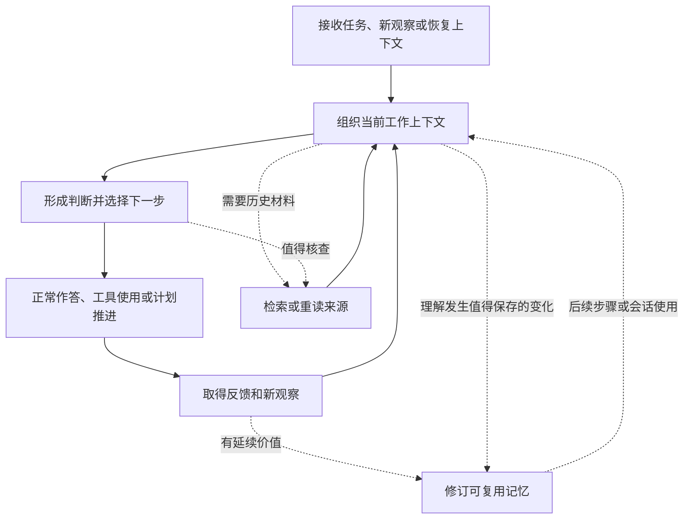

# MiLAi 方案研究规划 v0.2

**按需使用、重新理解与选择性更新 Agent 记忆**

日期：2026-09-05。性质：设计修订与可行性研究规划，尚未实现或运行实验。v0.2 作为后续讨论的主方案；v0.1 中有用的协议见证、实验与统计细节保留为可按需采用的附件，不再全部作为首个原型的前置要求。创新性继续为 **RQ pending**。

实施准备补充：[小型原型执行合同](<C:/Users/Mingx/Documents/ChatGPT/New project 2/MiLAi_v0.2_小型原型执行合同_20260905.md>)。该附件明确条件能力、真实宿主接入和后续重访的不同主张，补充外显观测记录、写回结果与最小公平对照；不改变下文的开放流程，也不表示原型已经运行。

本版优先响应用户提出的“减少刻板性、提高通用性和泛化性、可行性优先”。补充文本作为评估材料，其中固定触发器、路线类别、操作枚举和停止条件不逐条照搬。

## 1. 本次调整的核心

**将 MiLAi 放回 Agent 的正常工作循环：Agent 为当前任务使用记忆；需要时回查来源，调整本轮理解；有延续价值时再更新可复用记忆。**

无 item 的约束遗漏仍是重要失败切片，但不要求所有任务先转换成 requirements、blockers 和固定证据角色。记忆可以是 Markdown 笔记、任务摘要、消息片段或结构化 State。

第一阶段要回答：

> 利用已有历史读取、检索和记忆更新能力，按当前任务需要进行回查与修订，能否以可接受成本改善 Agent 的后续判断和跨会话延续？

这是可行性与效果问题，不是“首次提出回查或重建”的创新声明。具体新机制只有在强简单基线和现有方法之外有证据时再定义。

| v0.1 中容易固定化的内容 | v0.2 的处理 |
|---|---|
| 所有问题先表示为 requirement/item | 使用宿主已有记忆表示，结构化仅在有实际收益处引入 |
| 预先固定三类触发器 | 在宿主已有上下文装配、任务推进和恢复位置提供回查机会；触发策略可替换 |
| Hint 必须属于若干路线类型 | 记录实际查询与来源，路线名称用于分析，不限制生成空间 |
| 每轮必须生成 Hint、检索、重建和写回 | 允许直接使用、直接重读、只调整当前上下文或完全不更新 |
| HISTORY_ONLY 就是历史纠错 | 它只表示未推进事件消费；语义变化原因另行说明 |
| 行动前所有约束必须进入持久 State | 评价当前决策依据、实际行为和跨会话保存，分别计分 |
| 先完成整套平台合同和大矩阵 | 隔离参考原型先验证功能，再补实际接入所需合同 |

通用性不等于取消边界。来源与推断分开、当前权限、可追踪修改、计算有界以及真实结果记录仍然保留。

### 1.1 最高实验方法学原则：策略开放，观测与比较规则明确

> **Agent 的使用策略保持开放；每项比较事先声明观测边界、干预差异和评价规则；将可观察事实、分层诊断与因果结论分开报告。**
>
> Agent 在当前有效权限与资源上限内，自行决定如何使用记忆、是否回查、如何查询、是否调整当前产物及是否持久保存。系统不要求统一状态表示、固定检索路线或必经写回流程。
>
> 对可比较运行，宿主与评测框架按预定规则控制任务和记忆起点、来源条件、工具、模型配置及预算。单因素比较只改变声明的因素；组合方案或多因素实验明确各项差异、相互作用及结论范围。实际查询、取得的材料、行为和资源消耗可以随策略改变，它们也是待观察的结果。
>
> 分别记录机会提供、来源获取、内容呈现、当前行为、持久提交和后续复用。未发生某一步、最终任务成功或写入成功，均不能替代各层的评价。记录不足时保留未知，证据不足时保留归因不确定。

这项原则约束实验设计与结论强度，不建立新的运行时状态机。“固定观测”指事先声明观察位置或调度规则；研究接入时机时，可以把它作为干预因素，并分别报告，不能事后混合不同位置来支持同一机制解释。不同任务拥有各自的版本，配对比较控制的是相同任务的起点。

资源控制区分可用上限与实际消耗，不强迫两组查询次数或返回内容完全一样。固定历史快照也不冻结当前权限：实时撤销仍须生效；真实环境无法保持一致时记录偏差并限制结论。

三类实验记录及分层诊断规则见 [小型原型执行合同](<C:/Users/Mingx/Documents/ChatGPT/New project 2/MiLAi_v0.2_小型原型执行合同_20260905.md>)。该原则属于研究纪律，本身不构成 MiLAi 的技术创新声明。

## 2. 从 Agent 的正常流程出发

“行动”包括工具调用，也包括选择信息、形成建议、完成一段写作、改变计划或宣告完成。因此该流程不以 coding agent 或外部副作用为唯一对象。

### 2.1 组织上下文时

使用当前任务、最新观察和已有记忆视图。材料足够且适用时直接继续。历史依据已经出现在输入里时，可以直接对照，无须再调用检索工具。

### 2.2 选择下一步时

Agent 可以把“是否需要回看依据”作为正常任务推理的一部分，不必每次增加一个模型调用，也不必输出 `memory_sufficient=true` 之类证书。

回查理由可以来自矛盾、不确定、适用条件变化、摘要过粗、关键来源缺失，或者重新考虑一个看似已成立的前提。无需先存在 blocker 或明确的遗漏标记。

### 2.3 取得反馈后

新观察可能支持当前理解，也可能要求修订。反馈首先改变本轮工作上下文；只有值得跨步骤或跨会话保留的内容，再形成记忆更新。

“本轮发现了新内容”“现实刚发生了变化”“过去的摘要有错误”是不同情况，不能默认相等。

## 3. 三种信息角色，不要求新建三套存储

| 角色 | 作用 | 典型载体 |
|---|---|---|
| 可回查的来源 | 确认谁说过什么、当时条件和后续变化 | 用户消息、工具结果、文件版本、允许保存的原始记录 |
| 当前工作上下文 | 支持眼前的判断、搜索和任务推进 | 活跃对话、已取回片段、暂定假设、当前计划 |
| 可复用记忆视图 | 在后续步骤或会话中恢复有用信息 | 摘要、笔记、小节、结构化 State、已有经验记录 |

这些是信息角色，不是必须新增的实体。相同内容可以在不同阶段承担不同角色；来源仍遵守原系统的权限、保留和删除规则，不要求额外无限期复制全部历史。

持久记忆可以精简。一个内容没有进入摘要，不一定是当时的错误：它可能当时无关，后来才变得重要。要把“压缩时错误遗漏”与“当前任务需要更细的信息”分开评价。

Host Cognitive State 仍可以持久、版本化、可错和非 Canonical。一次回查产生的临时工作区不替代它，也不自动建立第二套权威事实。

## 4. 何时回查：开放机会，避免把已知缺口当唯一入口

只在模型明确承认“不知道”时检索，会漏掉它没有意识到的错误。因此宿主应允许在重新组织上下文或作出新判断时，对已有理解进行回看，而不仅在 role-gap 非空时才开放工具。

可利用的信号包括任务恢复、目标或使用条件改变、上下文压缩、新观察与记忆不符、反复失败、来源失效，以及即将依赖某条旧结论。这些是候选信号，不是封闭 enum，也不要求每个信号各建一个模块。

首个接入点按宿主能力选择：

- 如果能取得待执行工具与参数，可以在普通决策流程中提供回查机会。
- 如果拿不到下一步行动，就先接在恢复任务或装配上下文的位置。
- 如果只有历史与摘要，就先做固定 checkpoint 的离线回查；明确它尚未验证自动触发能力。

不能要求运行时先正确识别“首次受遗漏约束影响的行动”再启动检查，因为它可能连遗漏内容都不知道。该标签主要供独立评测使用。

对过度自信的盲点，可以在开发阶段比较通用的来源反查或少量抽样检查。它们依赖当时可见信息，不读取 gold、遗漏位置或参考答案。新增检查也必须与普通 Agent 已有的自检能力比较。

## 5. Hint 的位置：一次可修改的搜索想法

Hint 的作用是帮助 Agent决定“接下来应该看什么、怎样提问”。它不必成为每次操作都单独输出的正式对象。

例如：

> “这个结论是否只在上个项目阶段成立？回看当时的来源和后续修订。”

或者：

> “如果当前选择有问题，可能是哪个没有出现在摘要里的条件？先核对原始任务。”

第一版使用普通查询、来源回读和基于返回结果的查询改写。跨概念、时间回查、结构类比等作为同一接口下的候选策略，不要求每条查询都先归类。

同一条查询可能同时包含时间、来源回溯和反事实；强制六选一会造成不必要的限制。可测性来自可重复配置、实际查询、来源和结果记录，不依赖预设路线标签。

**允许提出候选解释或候选约束。**关键限制是采信资格：没有适用来源支持时，不将其写成已知事实或用户要求。禁止某个字段名并不能保证这一点。

控制搜索主要依靠现有工具权限和累计资源上限。实际次数依据问题和证据反馈调整；“三条路线、两轮检索”可以作为实验参数，不成为产品语义。

搜索停止可以是材料足以支持下一步、重复返回、需要的来源不可得或预算耗尽。一次检索没有找到，不证明相关要求不存在。是否暂缓某个决定，应结合具体缺口及其影响，不让所有猜测都阻断整个任务。

## 6. 调整理解与选择性写回

### 6.1 先处理当前任务需要

根据来源，Agent 可以保留原理解、补足细节、修正错误、重新判断适用条件，或者保留有范围的不确定。只改变本轮回答或上下文也可以是正确结果。

一个记忆辅助系统不应强迫 Agent 先把眼前全部依据复制进持久 State，才允许继续。用户刚提供的信息、已回查的原文和可靠的精简记忆，都可以支持当前判断。

### 6.2 再判断是否值得保存

较适合写回的内容包括：会在之后继续使用的任务进展、需要持续遵守的有效条件、已经确认的旧记忆错误、未完成问题的恢复入口，以及有来源和适用范围的经验。

一次性的搜索猜测、仅用于本轮作答的材料和没有可预见延续用途的细节，可以留在当前上下文。是否保存是待评价策略，不承诺模型能够预知全部未来用途。

### 6.3 使用宿主已有的修改方式

通用结果只需表达：哪份记忆发生了什么变化、依据哪些来源、还有什么具体问题未解决。

目标定位可以使用段落、小节、消息范围、JSON 路径或稳定 item ID。结构化 State 可以把修改映射成 ADD、UPDATE 等；自由文本可以保存新版本和对应差异。不要求先实现七种语义操作或将所有历史 item 化。

希望局部修改，是为了减少连带损坏；局部操作本身也不证明语义安全。若只能生成整份新摘要，应保留旧版本并核对关键内容差异，而不能将保存成功当作未丢信息的证明。

### 6.4 未解决问题如何保留

只有与任务相关、具有具体检查内容的问题才需要延续记录。它可以绑定任务片段、某类使用条件或来源，不必强制绑定 action ID。

最少说明：尚不能确定什么、已知依据是什么、何种新信息出现时值得再查。它可以存在于现有 open question、笔记或恢复摘要里，无需立即建立新数据库对象。

被证据否定的猜测可以关闭；预算耗尽与证据证明不存在要分别表达。保存待查问题不自动创造新的业务约束。

## 7. 固定边界与可替换策略

| 应保留的共同边界 | 原因 |
|---|---|
| 来源、转述和假设可区分 | 避免 Hint 或旧摘要经过重复加工变成虚假证据 |
| 当前权限与任务范围有效 | 回查、提示和日志都不能绕过现有披露边界 |
| 修改可以追踪，重要旧版本可按策略恢复 | 防止一次错误重写不可追溯；恢复仍受删除/保留策略约束 |
| 并发变化不能被静默覆盖 | 真实接入时使用宿主现有版本保护或串行单写者 |
| 计算和等待有上限 | 避免搜索循环，允许给出有范围的未解决结果 |
| 记忆不能创造外部行动权限 | 修订计划不等于获得发送、部署或删除授权 |

可以替换的包括：记忆格式、查询方法、何时额外核查、是否使用 Hint 对象、是否单独复核、如何定位更新、采用哪个现有存储后端。

可替换不意味着无须验证。每次替换都要说明输入、来源资格、结果、失败处理和成本；无需通过同一套大而全的领域 schema 才能接入。

### 7.1 Host 与适配层分工

| 责任方 | 最小职责 |
|---|---|
| 用户 | 正常表达任务、偏好和修订，不维护协议字段 |
| Agent/Host | 使用记忆、形成查询、解释来源、提出必要修改和后续行动 |
| 检索/来源工具 | 按现有权限返回可定位材料，说明截断、不可得或失败 |
| 薄适配层 | 绑定任务和旧版本，记录实际输入与修改结果，调用现有保存接口 |
| 记忆存储 | 保存内容与必要来源、版本，返回明确结果 |
| 离线评测器 | 判断行为、记忆变化和成本，不向运行时泄露标签 |

薄适配层不负责证明所有自然语言要求都满足。首版也不增加常驻 reviewer；是否增加复核调用，依据错误类型及额外检出收益决定。

## 8. MiLAi 特有协议留在适配层

当前 MiLAi 如已使用 Event journal、Basis 和 CAS，继续遵守其合同。没有这些机制的离线参考原型，不虚构水位或宣称已处理现实中的全部变化。

`HISTORY_ONLY` 与 `HYBRID` 仍可作为内部实现模式：前者不推进事件消费水位，后者按完整冻结窗口推进。它们不要求用户或 Agent 每次填写。

必须分开两个维度：

| 维度 | 含义 |
|---|---|
| 处理范围 | 读取了哪些材料，是否消费了新事件，Basis 是否推进 |
| 理解变化 | 纠正旧错误、细化当前需要的信息、改变适用判断、吸收新观察等 |

纯历史回读可能只是因当前任务需要而展开原摘要，不能自动标为“过去理解错误”。HYBRID 也可能同时纠正旧错误并处理新观察，不限定只有一种变化原因。

若工具确实产生一次新的读取记录，可以记录“今天重新读取了旧材料”；材料描述的事实时间仍然是原来的时间，不能把它伪装成今天才发生的新事实。

真实接入后，适配层负责精确窗口、当前资格、版本冲突与回执。历史修复不取消尚未处理的新变化；无变化回执也应绑定被检查版本，不能解除更新版本的使用限制。来源撤销及权限变化与 journal epoch 的恢复问题分别处理。

## 9. 可行性优先的两步原型

### 第一步：离线回查是否真的改善判断

复用一个现有 Host/模型、一份记忆视图、可读历史和普通检索/文件读取。单进程、隔离输出，保存改前改后与使用来源。

输入是正常的任务继续请求或当前问题，不告诉 Agent 遗漏位置。既包含有问题的记忆，也包含正确记忆以及现在只需要更多细节的情况。

最先观察：回查是否找到能影响判断的材料；解释和修订是否正确；是否破坏其他内容；没有必要时是否能直接继续；成本是否值得。

首版不依赖全量 item 化、图数据库、固定触发器、路线学习或真实 PostgreSQL 全部生产合同。参考原型只能证明其受控条件下的能力，不能替真实产品宣称并发、撤销或恢复已验证。

若离线场景显式要求“请检查这份记忆”，应单列为条件修复实验。它不能证明 Agent 自然会决定何时检查。

### 第二步：接回正常任务循环

选择宿主已经存在的上下文装配、任务恢复或工具决策位置接入同一能力。先保持单任务串行更新，使用已有版本保护和来源权限。

记录正常任务中的实际调用、输入、记忆变化、后续输出及失败。无须另造一个完整 planner；如果宿主本身已经会做相同的回查，要直接与该能力比较。

这一步重点验证：是否在需要时使用，是否在不需要时带来成本，正确的当前理解能否在后续会话继续发挥作用。

只有具体失败和收益支持时，再增加触发策略、扩展查询、局部结构、额外复核或离线路径学习。已有模型或检索器本身经过训练并不构成障碍；首版只是优先避免新增训练工程。

## 10. 泛化应怎样检验

泛化不能靠给固定 coding 模板换变量名来证明。主流程、接口和搜索提示尽量保持一致，在不同任务与记忆表示上验证。

| 场景 | 可出现的记忆问题 | 正确结果不要求什么 |
|---|---|---|
| 软件任务 | 测试条件、环境版本或历史约束遗漏 | 不要求所有问题都成为 blocker |
| 研究简报 | 将作者报告的结果误记为团队已验证结果 | 不要求有工具副作用或结构化 State |
| 项目规划 | 当前目标或适用条件改变，旧计划需要重新解释 | 不要求旧计划在当时一定错误 |
| 内容写作 | 受众、用途或来源归属在长讨论中被遗漏 | 不要求每条写作约束都持久 item 化 |
| 跨会话工作 | 摘要保留结论，但丢掉继续工作的条件和未解问题 | 不要求重放全部历史 |

至少包含一种非编码任务，并在未参与开发的新家族上验证。若支持多种记忆表示，先比较文本笔记和一种结构化视图；这是表示泛化测试，不强制同时重建两个产品后端。

任务特定的允许行为与评价规则可以变化，但它们留在离线评测器中，不进入运行时的答案提示。若必须为每个新任务编写新的触发规则或 Hint 模板，应报告这种适配成本，不能称为零配置泛化。

历史长度、语言、来源类型和任务变化逐项扩展。接口可替换只能说明可迁移性，实际泛化能力仍需测量。

## 11. 非编码示例：研究简报 Agent

以下为构造的机制示例。

原始任务消息要求：“区分论文作者报告和我们自己验证的结果。”跨会话笔记只保留“整理三个方法的优缺点”，当前草稿准备写“方法 A 已验证能提升效果”。

Agent 在组织简报上下文时回看原始任务和实验记录，发现数字来自论文，没有团队复现记录，于是：

1. 将当前表述修订为准确的来源归属。
2. 如果该简报还会继续修改，在现有笔记里保存这项需要延续的条件并附来源。
3. 若本轮任务已经结束且没有后续复用需要，也可以只修正当前输出，保留正常记录。

这不需要创建 requirement ID、选择固定路线类别或执行七种条目操作。它仍然完成了基于记忆来源的理解修正。

对照版本应包含团队确有复现记录、用户后来改变用途、原始任务未提出这项要求等情况，检验系统是否只套用固定答案。

## 12. 评测：分别看使用、行为和延续

### 12.1 三个层面

| 层面 | 评价内容 | 不能混同的结论 |
|---|---|---|
| 当前依据 | 需要的历史信息是否在可用记忆或实际输入中被正确呈现，来源与适用性是否一致 | 呈现不等于理解，召回 ID 不等于关键片段可见 |
| 当前行为 | 首次相关判断是否正确，直到预定进展点是否遵守约束并完成任务 | 最后纠正不能抹去先前错误；一直不行动不是成功 |
| 后续延续 | 新会话能否恢复需要的信息、避免同一错误，成本是否合理 | 当前答对不证明持久记忆已改善；没有写回也不自动是失败 |

附件提出的 PreActionConstraintCoverage 可作为有限标注任务的诊断指标，但不要求所有真实世界条件都进入持久 State。应注明覆盖的是哪组已标注关键条件，以及它们出现在当前消息、取回来源还是记忆视图中。

对真正主张“修复持久记忆”的方法，需要额外安排后续重访，检查所保存的变化能否继续支持正确行为。对只改善当前上下文的方法，按其实际能力报告。

### 12.2 最小对照顺序

**基础对照：**宿主原本的 Agent 与记忆流程，保留相同来源、工具和可用预算，不能故意关闭它本来会用的搜索能力。

**第一个候选：**在既有流程中加入通用的来源回查和选择性修订策略。先判断是否比宿主原有行为有可解释改善。

**第二个候选：**在相同入口、反馈机会和预算下，更换查询扩展策略，比较直接多查询与跨概念 Hint。

需要进一步归因时，再使用 v0.1 的“额外检查入口 × 查询扩展”2×2。它是实验工具，不是所有产品必须暴露的四种模式。

同证据包比较不同更新方式，能帮助定位解释差异；双向证据回放只是诊断，不单独证明完整因果归因。全历史处理保持参考地位，不称理论上界。

既有 MemR³、MRAgent、StateMemWrapper 等对照在确定具体机制后选择最直接者。首轮不无限适配所有基线；若准备提出新机制论文主张，必须补齐相应近邻比较。

### 12.3 标签与人工投入

优先使用环境断言、明确原始任务条款、版本记录等可直接核查的依据。Agent 可以独立初标、找反例和解释分歧；一致结果仍是暂定标签，不自动成为 gold。

开发阶段无需默认每个样本全量人工双标。对关键样本、模型一致样本的抽样以及争议结果做针对性人工复核；无法判断的样本在方法分配前标记为不确定并单列，不在看到方法结果后选择性删除。

确认性结论的证据强度取决于标签来源和核验方式，不由“用了三个 Agent”或“有一个 Judge”保证。

### 12.4 小样本和成本

保留小 pilot 来发现流程故障、重复错误和成本分布。原来的 6 家族 × 4 变体是可复用起点，不是固定配额或显著性依据；增加同模板 seed 不等于增加独立任务。

所有回查、阅读、重写、复核和失败重试都计入成本。报告正常无须回查任务的额外负担，以及注入错误、自然错误共同起点、自然端到端三种结果，不能混用分母。

正式研究仍按家族配对、独立留出和事先明确的主要比较进行。具体样本量由预计效应、聚类结构和可接受区间决定，沿用 v0.1 的统计纪律，不把其数字示例当成固定执行计划。

## 13. 正确的继续与停止逻辑

| 观察 | 合理判断 | 下一步 |
|---|---|---|
| 普通回查稳定改善任务且成本可接受 | 简单方案有产品价值 | 保留，验证新家族与真实任务 |
| 普通回查无收益，关键来源未找到 | 可能是取证瓶颈 | 在小预算内测试另一种查询路线，不先否定整个方向 |
| 给出正确证据后仍判断错误 | 主要瓶颈可能是解释、任务定义或执行 | 先修复该环节，避免增加更多搜索 |
| Hint 与普通查询接近且更贵 | 当前 Hint 策略缺少实用增量 | 简化当前实现，不扩大为所有 Hint 均无效 |
| 正常任务没有足够相关错误 | 当前分布可能不需要额外机制 | 降低默认开销；压力测试结果单列 |
| 小 pilot 区间宽、家族少 | 证据不足 | 选择补充独立样本或因资源停止，说明边界 |
| 错误来自日志/截断/权限适配 | 当前效果不可正确归因 | 修复观测或适配，不调整语义假说迎合结果 |

组合方案 D 优于 A 有总效果意义，只是不能单独说明收益来自 Hint。C 无改善不排除调度与搜索的交互，也不证明 D 无价值。

可以因成本停止某条实现路线。该决策应写成“在当前场景、预算和实现下不值得继续”，不扩大成整个 Agent memory 问题被否定。

## 14. 后续演进与当前执行入口

近期只围绕一个实际宿主完成两步：先确认来源回查能改善判断，再验证它在正常 Agent 流程中会被适当地使用和保存。时间按这两个可观察结果安排，不默认跑完八周平台建设。

推荐下一轮准备材料：

1. 选一个已经能读取历史和保存记忆的 Host，明确可取得哪些输入与运行记录。
2. 选少量真实或可回放任务，同时包含正确记忆、过时/遗漏记忆和当前需要展开细节的情况。
3. 使用宿主现有工具做普通回查，保存实际输入、来源、改前改后及后续行为。
4. 与未新增机制的正常宿主流程比较，定位最先发生的失败和真实成本。
5. 仅针对得到证据的瓶颈增加策略或结构，并在未见任务上再测。

后续候选包括更好的查询扩展、特定记忆段落的稳定 ID、风险相关的额外复核、受控来源索引和离线路径策略学习。它们不是默认必做模块，也不受固定路线枚举限制。

路径学习若进入研究，学习的是“在什么条件下怎样取证更有用”，并验证未来任务的迁移。被使用、被引用和任务成功都不能直接证明单条路线有贡献；实际记忆事实与权限不由使用频率改变。

本版完成的是设计修订。没有依据补充文本自动启动 prototype、实验、训练、发布或生产写入。

## 15. 与前序材料的关系

- [v0.1 详细研究规划](<C:/Users/Mingx/Documents/ChatGPT/New project 2/MiLAi_方案研究规划_v0.1_20260905.md>)：保留具体协议、因果对照和统计细节，按实际需要采用。
- [旧讨论吸收与机制整合](<C:/Users/Mingx/Documents/ChatGPT/New project 2/MiLAi_旧讨论吸收与机制整合_20260905.md>)：保留工作区、证据组合、可见性与访问路径学习启发。
- [Hint 与记忆重建评估](<C:/Users/Mingx/Documents/ChatGPT/New project 2/MiLAi_跳跃式Hint与记忆重建评估_20260905.md>)：保留 Hint 为搜索假设、真实来源支持修订及已有近邻的判断。
- [原 MiLAi 详细架构](<C:/Users/Mingx/Downloads/MiLAi_详细架构设计_20260905.md>)：保留 Host/Runtime/Canonical 边界；本版没有核验或改变实际实现。

**v0.2 的落点是一个可嵌入现有 Agent 的能力：为当前任务按需找回和重新理解记忆，必要时留下可追踪、可复用的修改。**固定必要边界，让触发方式、搜索策略和记忆表示通过实际任务竞争，而不预先把某一套 schema 或工作流当成通用答案。
