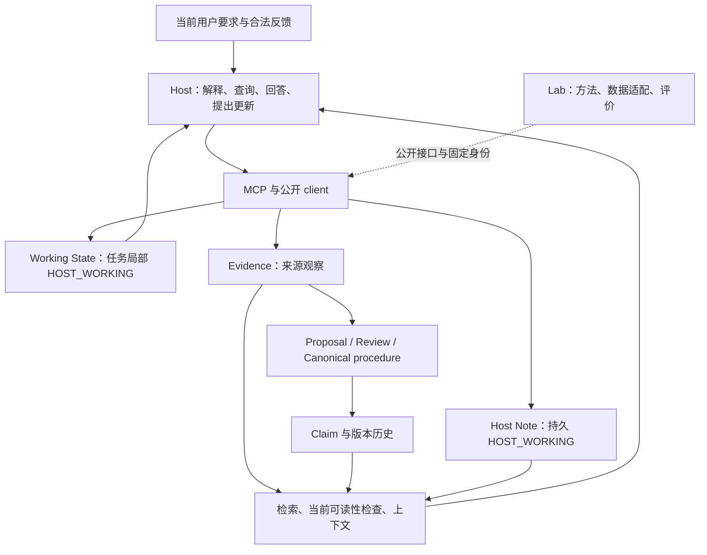

**MiLAi 情境化用户记忆开发计划：源码对照、可行性与创新性评审。**

评审对象为 [开发计划 v1.0](MILA_CONTEXTUAL_USER_MEMORY_DEVELOPMENT_PLAN_v1.0_20260923.md)。结论是：方向值得推进，现有 Product 足以支持一个有用的最小闭环；原计划仍需补齐持久对象、身份、版本依赖、删除和实验干预合同，才能作为完整的实施任务书。工程组合有明确价值，算法新颖性和质量—成本收益尚未建立。建议修改后进入开发，不把整个目标描述为仅增加几个 Lab 文件即可完成。

本次通读计划全部 658 行，核查本地及 GitHub 身份，读取相关架构、公开契约、ADR、Product domain/application/persistence/MCP、Lab Attention/Revision/工作区实现及相邻测试，并复核关键上游源码和论文。属于围绕该方案的定向深入评审，不是全仓逐文件审计，也不是公网部署验收。`git ls-remote` 确认本地 HEAD、远端 HEAD 和 main 同为上述提交；待评审计划在本次开始时是未跟踪文件。

**1. 对当前项目的理解。** MiLAi 已有两个应分别评价的层面：Product 的受治理记忆服务，以及 Lab 的记忆使用方法。Product 的主要积累是来源、权限、版本、事务和公开工具；Lab 已实现部分工作区、Attention 与 Revision 机制，但机制出现不等于收益成立。两者之间有明确的公开接口边界。[仓库职责](../../../SOURCE_OF_TRUTH.md)

这里的 Note 和 Working State 不应因为用途是“长期记忆”或“用户画像”就变成 Canonical。查询结果、模型判断、使用频次也不改变权威等级。冻结架构的 I-01、I-03、I-05、I-08、I-10 与本方案直接相关。[架构不变量](../../architecture/v1.0/INVARIANTS.md)

| 能力 | 当前源码事实 | 对本计划的意义 |
| --- | --- | --- |
| 任务工作状态 | 任意 JSON payload；65,536 字节；最多 1,024 个 Evidence 引用；SESSION/TASK/PROJECT；完整替换式版本追加与 CAS | UserView 与 WorkState 可先放在同一工作状态中，不需要各建一张表 |
| 持久笔记 | 独立 UUID、整数版本、CAS、操作回执、精确读取；无自动 TTL；权威为 HOST_WORKING | ConditionalMemory 最直接的产品落点是 Host Note |
| 来源依赖 | Working State 识别保留字段中的 Evidence UUID；Note source_refs 只支持 EVIDENCE/FILE | 尚没有通用 Note-version → UserView 的机器可检查依赖关系 |
| 笔记检索 | SQL literal substring；按创建时间和 ID 分页；搜索输出 256 字符片段 | 不能把已有 Evidence 的 dense/temporal 能力算作 Note 的现成能力 |
| 统一搜索 | 同时调用 Note search 与 governed resolve；保留独立来源状态；不搜索 Working State | 新投影可复用入口，但需要明确对象分流和完整读取 |
| 披露失效 | 声明的 Evidence 不可读时，Note 内容被隐藏；Working State 整个不透明 payload 被隐藏 | 已有基础可复用；并非语义更正后自动刷新所有视图 |
| 删除 | Note tombstone 阻断所有版本读取；正文物理删除未实现，备份清除未安排 | 原计划“真正删除全部派生个人内容”的目标需要新增工程 |
| 身份与作用域 | Note 按 tenant、actor、principal binding、project 过滤；State 再绑定 scope/ref | 同账号相同绑定可复用不等于跨主体、跨项目自动共享 |
| 研究 Attention | 已获取候选池上的纯决策；状态绑定问题与全池快照；选择依赖调用方声明 | 新的局部依赖语义应有新方法身份，不能悄悄修改旧候选 |
| 研究 Revision/卡片 | Lab 自有工作区、版本与修订评估实现 | 不等价于可部署 Product 卡片 API，也不应由 Product import |

源码依据：[Working State 模型](../../runtime/src/milai/domain/host_cognitive_state.py)、[Note 模型](../../runtime/src/milai/domain/host_note.py)、[Note 持久层](../../runtime/src/milai/persistence/host_note_repository.py)、[统一搜索](../../integrations/mcp/src/milai_mcp/memory_search.py)、[State 披露检查](../../runtime/src/milai/application/host_cognitive_state.py)、[Note 回执与删除](../../runtime/src/milai/application/host_note.py)、[Lab Attention](../../../MiLAi-Lab/src/milai_lab/methods/state_attention.py)、[Lab 工作区](../../../MiLAi-Lab/src/milai_lab/methods/controlled_workspace.py)。

当前源码包版本为 Runtime 0.1.5、MCP 0.1.15、client 0.1.4，迁移链到 0056。它们是源码身份，不是本次验证过的部署版本。产品仍为 CANDIDATE，Schema 为 EXPERIMENTAL / NO-GO FOR SCHEMA FREEZE。

**2. 应保留的设计决定。** 计划最有价值的是把临时适用性与长期改变分开，并承认 Host 理解会出错。Core/Assisted 分表、returned/presented/use 分开、强简单基线、QUERY_ONLY、完整成本、答案隔离以及允许 KEEP_SIMPLE，都应保留。无需因为尚未证明新颖性而推翻这条产品路径。

“无新增服务端生成模型”也适合当前产品方向，但应始终表述为服务快路径的性质。Host 写状态、生成子问题、重读材料仍有 tokens 与延迟，不等于整个生命周期零额外推理成本。

**3. 必须先补齐的实施合同。** 下列优先级针对“该能力可以被声称完成”的条件；不要求所有问题先修完才允许开始局部开发。

| 优先级 | 原计划位置 | 核心问题 | 建议修改与验收证据 |
| --- | --- | --- | --- |
| P0 | §3.3–3.4、§4、§9 | 用户、Host、任务、分支与共享范围未映射到当前绑定 | 明确 owner 与执行 Host 的区别；两个 Host 的局部 State 不互相覆盖；共享只在服务端授权范围内发生 |
| P0 | §4.1、§5.3、§7.3 | 版本依赖失效被概括为可复用能力 | 分开 Evidence 披露失效、Note 版本过期、语义适用性变化；分别定义检测与后续行为 |
| P0 | §7.3、§11.2、§17 | 全面删除目标与 Note 仅逻辑删除不一致 | 明列物理清除、派生内容与备份范围；实现前限制完成声明 |
| P0 | §9.2 | 新模块未明确 Product/Lab 所属；缺少产品改动清单 | 逐项标明 owner、公开接口、是否迁移、实验臂类别；不把 Lab 原型计为产品交付 |
| P1 | §6 | Note 当前检索与“完整小单元返回”存在差距 | 声明 Note/Evidence/Claim 各自路线；搜索后精确读取；完整字节不等于语义充分 |
| P1 | §3.3、§5、§13.5 | 状态何时被读取、写回没有确定的执行责任 | 固定一个 Assisted 接入；沿用已有启动读取能力；自然采用另测 |
| P1 | §5、§7 | 方法主体仍是 host.normal_decision，增量不够可复现 | 固定最小政策、触发条件、可用工具与失败行为；不强制每轮维护 |
| P1 | §10–14 | 端点问答不足以验证持续 State 与后续 Revision | 主问答、顺序回放和真实 Host 使用分开验证；补成本/质量决策规则 |
| P2 | §1、参考资料 | 继承了历史报告，但缺少部分最新负结果与稳定附件定位 | 补当前 Utility 终态、HC-4 不采用结果；将 P5–P8 换成固定仓库链接或归档身份 |

**3.1 身份与共享：先定义能共享的对象，再定义两个 Host。** 当前 `_BINDING` 同时限制 actor、principal binding 和 project；MCP principal digest 又包含认证主体与 scope digest。因此，相同授权账号和绑定下的不同客户端可能访问同一笔记，但不同 principal 或 project 不能只靠“属于同一用户”的模型声明建立共享。[Note 过滤](../../runtime/src/milai/persistence/host_note_repository.py)、[MCP 绑定](../../integrations/mcp/src/milai_mcp/server_governance.py)

另一方面，`_working_state_binding()` 在未配置时把 TASK 回退到 `default-task:{project_id}`。这不足以保证两个同时工作的 Host/分支拥有不同 State。现有 [launcher](../../integrations/mcp/src/milai_mcp/launcher.py) 已支持可信 task_ref；应先利用它明确绑定，而非让模型传任意 user/project/task 值。

建议首个交接范围明确为“同一授权 owner、同一 project、两个可信且不同的 task/branch 绑定”。跨 principal 委派、跨 project 共享单列后续范围；确有需求时再补 ADR、权限及数据库验证。交接对象是来源可复查的副本或显式记录，不是把 A 的私有 State head 交给 B 原地修改。

**3.2 依赖与新鲜度：至少要分成三个不同判定。** 当前 State 的 `extract_evidence_refs()` 只识别 Evidence UUID，没有读取 Note 的当前版本。现有 `_record_envelope()` 也主要针对依赖不可读做整体隐藏；它不会因为 Note v1 变成 v2 就认定某个 UserView 过期。[State 引用提取](../../runtime/src/milai/domain/host_cognitive_state.py)、[State 仓库](../../runtime/src/milai/persistence/host_cognitive_state_repository.py)

建议区分：

- 披露许可：来源被撤销、无权读取或进入不可读保留状态，必须阻断相应内容返回。
- 精确版本：来源仍合法，但依赖版本不再是当前版本，标记视图需要复查；保留合法历史读取。
- 情境适用性：来源与版本都没变，但受众、目标或用户当前要求变了，交给 Host 重新判断。

新鲜度、相关性与权威不能相互替代。建议内部引用采用按类型区分的身份：Evidence UUID 与 digest；Note UUID、version 与 digest；Claim 的准确 version ID。不要给不可变 Evidence 虚构一个与 Note 相同的 revision 字段。

模型声明的依赖不能成为遗漏来源后的披露豁免。服务能保证的只是已记录、可追踪依赖上的机械行为；声明不全时需要保守的派生来源策略。首版可用有限的直接依赖与逐次读取验证，不必建设通用信念图，但必须明确这是 Host 原型保证还是 Product 对所有客户端提供的保证。

**3.3 删除：目标合理，现状不能省略。** `HostNoteService.deletion_status()` 明确返回 `physical_deletion_supported=false`、`primary_storage=NOT_IMPLEMENTED`、`history_retained=YES`。0056 为历史版本设置了不可变约束；仅添加一个 DELETE 工具调用不会清除旧正文。[删除实现](../../runtime/src/milai/application/host_note.py)、[迁移 0056](../../runtime/migrations/versions/0056_host_notes.py)、[ADR-051](../adr/ADR-051-host-notes-and-mcp-contract-repair.md)

因此应补一个明确工作项：保留最小审计元数据的同时清除应删除的内容，覆盖 Note 历史、持久 State、服务端缓存及备份义务；如果涉及存储格式或删除语义变化，新增迁移与真实 PostgreSQL 验证。完整实现以前，可以验收“停止返回/使用”和“逻辑删除”，不能验收“数据已经彻底清除”。已经发送到外部 Host 的副本，也不在纯 MCP 可保证的远端抹除范围内。

隐私评价还应分开“允许读取历史”“允许提炼画像”“允许持久化”“允许用于当前回答”。把全部历史先永久导入 Evidence 再测“不记住”，可能已改变任务含义。数据适配与产品导入应分别说明这些权限。

**3.4 Product 与 Lab：复用概念不等于跨包复用实现。** 当前 `MemoryCard`、`FocusFrame`、`WorkspaceSnapshot` 属于 Lab。Product 长期非 Canonical 记录则是 Host Note。建议替换 §9 的泛化表述，采用以下映射。

| 逻辑对象/职责 | 最小实现归属 | 复用或新增的边界 |
| --- | --- | --- |
| UserView + WorkState + AttentionIntent | 一个 Host 工作对象；通过 Product Working State 保存 | 首版可约定 payload 子结构；稀疏政策更新需在 Host 合并后完整 CAS 替换 |
| ConditionalMemory | Product Host Note | 复用独立版本与 CRUD；明确这是 HOST_WORKING，不是 Canonical |
| SourceRef | Product 公开 typed references + Host 接入来源 | FILE 目前只是 Host 声明，不代表服务器已核验作者、文件权限或语义支持 |
| ChangeRecord | Note 更新回执 + 独立的变更依据约定 | 单条 CAS 已有；原因、跨对象依赖和多对象原子提交不能默认认为已有 |
| contextual_user_state / 方法政策 | `MiLAi-Lab/src/milai_lab/methods/` 初始原型 | 仅研究逻辑；不得 import Product 私有模块或复制整套存储 |
| 稳定的条件完整投影/依赖读取 | 经验证后由 Product application/integrations 持有 | Product 不调用 Lab 模块；迁移归属或必要的最小产品实现须明确 |
| contextual_host_adapter | Lab tools 负责实验；交付适配器进入 Product integrations | 用相同公开接口；分别标注 RESEARCH_PROTOTYPE / PRODUCT_BLACK_BOX |
| personalization_bench、scorer、标签、分区 | Lab | 不进入 Product 依赖或配置 |

`propose_or_commit()` 应拆成两个明确含义：非 Canonical Note 的正常提交，以及需要治理的 Canonical Proposal。compact catalog 没有 Proposal/Review，不应把同一个伪函数写成两种目录都可以完成同一操作。[compact 合同](../../contracts/mcp/compact-memory-v1.md)

**3.5 检索和完整单元：避免把“返回片段”误当作已经实现条件完整性。** Note 目前是 literal substring，不是语义向量搜索；其列表顺序也不是新的情境相关度排序。可以先复用 `note_query` 与精确 ID 读取完成最小路径，或另立 Note 索引扩展；不能在报告里把 Evidence dense 直接算成 Note dense。

§6 的“更短但完整的源段”仍涉及语义判断。无服务端生成模型时，建议由 Host 在写笔记时形成短的条件单元，或按明确的原文段落/消息边界完整返回；超预算就返回预览与读取入口。服务器可证明字节与引用完整，不能证明任意句子已经包含全部例外。

建议输出分开说明 `content_complete`、来源/版本覆盖、预算省略原因，以及语义充分性未知。预算计算应涵盖 MCP 包装、引用和状态；400–800 tokens 的 State 如果频繁生成和注入，也可能抵消少读材料的收益。

**3.6 状态使用责任：这是已有负结果指向的首要产品风险。** Product README 记录 HC4-A0 的 0/8 和 HC4-A1 的 0/4 次自然 Working State 调用，并暂停自维护采用路线；这些是历史结果，不是本次复测。[历史说明及审计入口](../../README.md)

原计划已经提出 Assisted 模式，建议进一步选定一个现有生命周期入口，而非继续保留“LangGraph 或其他边界”的开放选择。已有 launcher 可以保证任务启动时读取 State；它并不自动保证形成有价值的 State，也不保证结束时写回。方案要写清：谁执行启动读取，哪些任务变化触发可选保存，语义内容由谁产生，保存失败如何结束，重试怎样避免重复业务动作。

自然 Core 调用、生命周期确保读取的 Assisted 调用、脚本给定查询的服务测试应分别报告。未调用 State 必须留在主分母；高读取率也不能代替任务收益。

**4. 方法本身应补成可复现的政策。** 目前伪代码把关键判断留给 `host.normal_decision()`，适合说明分工，但不足以说明候选到底比 HOST_TOOL_SIMPLE 多做了什么。建议固定一页政策及其版本，不再扩展大段提示词。

可直接采用的政策草案如下，属于建议，尚非现有 API：

1. 当前用户要求和新反馈进入每次正常 Host 决策，不经过历史焦点过滤。
2. 当前要求足够时直接回答；发现具体历史缺口时才提出一个可识别的查询目的。
3. 受众、任务目标、当前限制或来源解释发生变化时，更新局部 UserView；没有后续价值时不持久化。
4. 本次例外只改变当前采用关系；显式持久更正可更新准确 Note 版本；隐式推断先保留为可错的局部解释。
5. 焦点可在同任务中延续，但问题/目标变化与已知依赖变化触发重新判断；不能只靠 task_id 没变就沿用旧结论。
6. 无关新增来源不强制重发全池；新的用户要求、撤权与实际相关更正也不能被焦点屏蔽。
7. 修订冲突时读取当前版本、重新判断；不按文本差异不重叠自动合并。未知写入结果按原 operation_id 核对，不能换 ID 盲目重写。
8. 可选 State/记忆维护失败不重做已经成功的业务动作；无法安全提供某条记忆时降级该记忆，按实际证据决定是否仍可回答。

内容可以自由文本，但技术外壳至少要明确 schema/policy 版本、可信 task/branch 绑定、State 版本、来源引用和操作 ID。来源真实角色由可信接入保留；模型对“这个偏好属于谁”的判断属于内容解释，不能反过来重写来源身份。

第一条修订路径建议限于一个 Note head。若一次纠正涉及多条独立笔记，当前单条 CAS 不提供跨对象原子性；应选择明确的部分成功合同，或另做事务设计，避免暗示所有对象已经共同提交。

**5. 可行性判断。** 以下为依据现有实现作出的工程评估，不是排期或成功概率。

| 目标 | 判断 | 主要条件 |
| --- | --- | --- |
| 单 Host 查询、原文读取、独立笔记更正 | 高可行性 | 公开工具已具备主要能力；需要一个薄接入与政策 |
| UserView/WorkState 的可关闭保存与恢复 | 高可行性 | 复用 Working State；明确 TTL、完整替换 CAS 与可信绑定 |
| State 驱动后续检索和完整小单元投影 | 可行，需新增方法与接线 | 明确 Note 检索局限、读取成本和真实请求组装位置 |
| 精确依赖版本变化后的视图失效 | 可行，但不能直接宣称已复用完成 | 补 Note/Claim 依赖合同、读取验证及缓存处理 |
| 同 owner 同 project 的明确双 Host 交接 | 可行，身份设计后实现 | 局部状态隔离；相同来源能力的普通笔记对照 |
| 跨 principal/跨 project 共享 | 需要独立权限设计 | 委派、撤销、审计和真实数据库隔离验证 |
| 全面个人内容删除 | 需要实际产品工程 | Note/State/派生物/备份的清除合同与迁移 |
| 自然 Host 自动采用及质量—成本收益 | 尚不能判定 | 存在不采用历史；必须通过新实测建立 |

首版可以分为“可运行原型”和“满足全部生命周期合同的产品候选”。这是明确不同完成层级，不应在第二层尚缺项时把第一层当作原计划完整交付。

**6. Benchmark 总体选型合理，但要修正证明能力。** v1/v2 原生终点问答能测历史到当前回答，不足以单独证明任务内 State 持续和修订后的跨任务收益。原计划已承认这个边界；建议将其变成实际结果结构，而非仅保留一句免责声明。

| 结果系列 | 核心问题 | 必要比较与限制 |
| --- | --- | --- |
| 原生历史问答 | 能否更好利用历史与当前偏好？ | 四个主方法 + QUERY_ONLY；预选可容纳样本加 FULL_HISTORY；每题 State 副本隔离 |
| 顺序回放 | 情境 A→B→A 是否恢复？更正是否只影响有关对象？ | 稳定/切换/更正/无关更新；普通条件笔记；派生协议独立命名，不能混入官方分数 |
| 真实 Host/交接 | 工具与 State 是否被用到？后续任务是否受益？ | Core 与 Assisted 分开；不给普通交接对照剥夺合法历史；未调用、不写回均计入 |

还应作六项具体修改。

第一，§11.4 混用了两个正交维度。`HISTORY_HIDDEN_LABEL / CHOICE_FEEDBACK_REPLAY` 是反馈条件，`CORE / ASSISTED` 是接入条件。建议分别设配置字段，选择少量有意义的组合；这不要求跑满乘积矩阵。

第二，§13.3 要区分“两个数据集上的未见用户测试”与“未见来源迁移”。若政策已使用 v1 DEV 和 v2 train/val 调整，随后在两者测试分区评估是跨数据集测试覆盖，不能再说零样本跨来源迁移。若要后者，应预先指定一个开发来源，固定方法后才在另一来源作确认；仅验证字段格式与使用语义失败调参也要区分。

第三，STATE_LOG_ONLY 必须指明阻断哪条边。如果 State 仍在 Host 上下文中，Host 仍可能据此改写下一条查询；只关闭服务投影不足以实现“State 不改变后续检索”。可分别控制 State→查询或 State→投影，记录实际请求与材料。总方法效果与某条路径的机制诊断应分开解释。

第四，TASK_LOCAL_ONLY 要有真正的后续任务消费机会。各题从同一历史独立拷贝的端点设置，主要测试重新解释历史，无法充分识别“前一任务写入长期更正”的价值。Revision 消融应进入顺序回放，而不是强迫在每道独立选择题中出现修订。

第五，补可执行的数据约束。v1 上游代码实际采用 `context[:int(end_index_in_shared_context)]`，即 Python 排他上界；需覆盖边界为 0、恰好到更新前后、同历史多截止点的测试。v2 需要把选择题选项渲染与答案字段隔离：评价侧可构建未标正确性的选项并打乱，Host 只获得相同任务输入。不得把 `correct_answer` 变为当前题反馈。[v1 推理入口](https://github.com/bowen-upenn/PersonaMem/blob/d07e6ade22e85e0e5d562247323a9c3e07553226/inference_standalone_openai.py)、[v2 数据卡](https://huggingface.co/datasets/bowen-upenn/PersonaMem-v2/blob/main/README.md)

HyperTrace 的适配器确实用标准答案构造 chosen，因此原计划把它限制为另行标注的反馈实验是正确的。[适配器](https://github.com/jiseshen/HyperTrace/blob/main/data/personamem_v2.py) QUERY_ONLY 也应保留：上游 issue 中的无历史高分是使用者报告，本次没有复现，不应当成全数据集无效的定论。[issue #41](https://github.com/bowen-upenn/PersonaMem/issues/41)

第六，补收益判据与指标分母。至少预先选择一种产品可接受的成功形式：同等质量下生命周期成本/延迟下降，或成本受控时质量提高且错误持久化不恶化。质量非劣界、最小有用改善和成本容忍度应根据产品用途与 DEV 方差确定，不能看到 TEST 后选择。

情境例外误持久化、明确更正后旧版沿用、主体误归属、无谓改写，应分别给出机会定义、分母和无机会时的 NA 规则。机会由独立标注或预先固定情境界定，不以“候选是否真的发起修订”定义主样本。按用户/任务簇报告配对区间；同一 persona 的多题与多次重复不能增加独立用户数。

v1 可用独立 persona 数量尤其应先盘点；不能仅看问题总数决定统计功效。中文产品体验还需要少量独立的中英混合工程回归，不能从英文基准分数推出中文召回已解决。现有 resolver 的同义表达和跨语言 exact predicate 两项债务仍为 OPEN，且它们不是本轮已运行的召回质量测试。[当前债务](../TECH_DEBT.md)、[限定范围的修复说明](../revalidation/resolver-language/REMEDIATION.md)

补充前瞻信息：PersonaMem-v3 已公开，时间化跨平台任务更接近部分后续目标，但官方仓库说明其 GistBench 衍生数据含非商业限制。建议列为后续协议研究参考，维持首版 v1/v2，不为了追新自动扩充默认数据或实验范围。[官方仓库及许可说明](https://github.com/bowen-upenn/PersonaMem-v3)

**7. 创新性判断：目前是有价值的系统设计候选，不能称为已证实的新算法。** 以下判断针对已核查的先行工作，不是穷尽文献检索或法律意义上的新颖性结论。

| 设计成分 | 已存在的相关工作 | MiLAi 仍需证明的差异 |
| --- | --- | --- |
| Host 通过工具搜索、创建、更新记忆 | LangMem 的管理和搜索工具 | 仅提供工具或让 Host 写笔记不构成新方法；比较同能力普通 Host |
| 画像与事件、查询相关上下文 | Memobase 的 profile/event 获取、筛选与预算组织 | 必须展示更好的情境适用或成本，而非仅换对象名称 |
| 短期意图与长期偏好分离、自然语言假设 | HyperTrace 已明确提出并实现 | 差异应落在反馈要求、额外推理成本、版本/权限与持久化范围，而非长短期分离本身 |
| 带上下文检索与按层读取 | OpenViking find/search 与 level 参数 | 层级读取和正常 MCP 接入主要是工程取舍 |
| 记忆随新材料演化 | A-MEM 包含链接与记忆表示更新 | “可修订”本身不足；有界影响和局部情境恢复需被具体比较 |
| CAS、版本历史、权限隔离、撤权 | 既有数据库/治理机制，MiLAi Product 已有积累 | 是可靠落地的重要条件，不能单独作为新的认知算法贡献 |

对应原始资料：[LangMem 源码](https://github.com/langchain-ai/langmem/blob/9d033b47d9ce53e37e92c92241b0496c0278932e/src/langmem/knowledge/tools.py)、[Memobase context](https://github.com/memodb-io/memobase/blob/358c16bbc6d687937d79bc2f984a11c3be8da901/src/server/api/memobase_server/controllers/context.py)、[Memobase 模型筛选](https://github.com/memodb-io/memobase/blob/358c16bbc6d687937d79bc2f984a11c3be8da901/src/server/api/memobase_server/controllers/post_process/profile.py)、[HyperTrace 论文](https://arxiv.org/abs/2609.09835)、[OpenViking 检索源码](https://github.com/volcengine/OpenViking/blob/563313ebe10a1b33d0ae736ab8b97ca713ff91f9/openviking/service/search_service.py)、[A-MEM 论文](https://arxiv.org/abs/2502.12110)。

更值得收敛的研究问题是：**在同一黑盒 Host 与可比资源下，把有来源版本的长期记录与任务局部适用关系分离，能否减少把临时要求写成长久偏好的错误，并在情境恢复和后续更正消费中优于普通条件笔记？**

这比 Attention—State—Revision 三个名称的组合更可证伪。可能成立的贡献有三个：局部改变且可返回的适用视图；来源版本变化与任务解释变化分开的失效政策；不要求额外服务端生成模型的工具式实现。它们仍需超过 PROFILE_INCREMENTAL、HOST_TOOL_SIMPLE、APPEND_WITH_CURRENT_VIEW，并控制预算与 Host 生命周期差异。

若只表现为 API 可用、CAS 正确、状态持久化、回执更清楚，应归类为工程收益。若固定政策在未调试用户上降低错误更新并改善质量—成本，才能主张方法收益。若普通条件笔记同样好，保留可靠底座和简单政策就已经是合理产品结果。

**8. 建议调整工作包，而不增加另一套流程平台。**

| 阶段 | 建议的具体完成物 | 与原计划关系 |
| --- | --- | --- |
| W0 | 一页对象/API/owner 映射；可信身份与依赖规则；sources.lock；数据白名单 | 把目前留待实施读取的签名与缺口落实 |
| W1 | 相同 MCP 后端上的普通 Host 工具基线；一个确定的启动/结束接入 | 优先复用现有 Note、State、launcher/client |
| W2 | 一个工作对象、一页固定政策、完整单元投影、事件驱动更新 | 先确认 State 真正改变后续查询/材料，不只增加文字 |
| W3a | 单 Note CAS 更正及后续准确版本消费；明确冲突与未知回执 | 复用现有持久机制，明确 HOST_WORKING 权威 |
| W3b | 若纳入首版承诺：版本依赖、清除、所需共享权限与迁移 | 单独列出 Product 工程，不能藏在“接起来”之中 |
| W4/W5 | v1/v2 薄适配、强简单与外部基线、未调试用户结果、最少消融 | 保留原计划的跨来源工作范围；明确迁移口径 |
| W6 | 同 owner 的一个交接；普通交接笔记对照；删掉无增量维护 | 跨主体协作另定义，不在首版扩成平台 |

必要的接口、数据库与权限正确性测试不以 benchmark 获胜为前提；昂贵的完整实验也不需要反复跑旧研究全部门禁。变更身份、删除、事务语义时遵守现有 ADR/迁移/真实 PostgreSQL 要求。候选关闭后应回到普通路径，已经成功提交的数据不因关闭开关自动回滚。

**9. 可直接写进 v1.1 的四段文字。**

建议放在 §1.1 后：

> 本方案直接复用的 Product 对象是 Working State、Host Note、Evidence 与现有公开工具。Lab MemoryCard/Workspace 为研究对象。Working State 当前只识别 Evidence 引用，Host Note 当前仅提供直接词法发现与逻辑删除；跨 Note 版本依赖、全面物理清除及超出现有 owner/project 的共享均属于待实现项。

建议放在 §3.4 后：

> 首个多 Host 场景限定在同一授权 owner 与 project，两个 Host 使用不同的可信 task/branch 绑定维护局部 State。跨 principal 或跨 project 不自动获得共享权限。交接记录不携带新的权限，也不使接收 Host 自动接受其结论。

建议放在 §5.3 后：

> 关注意愿、来源版本新鲜度、披露许可和语义充分性分别判断。依赖版本变更只触发对应视图复查；撤权阻断受影响内容；当前用户要求不受旧焦点过滤。机械版本核验不证明 Host 声明的依赖完整，也不证明内容真实或充分。

建议放在 §14 后：

> 固定测试前声明质量与成本的最小有用差异。主问答、顺序回放和自然 Host 使用分表，反馈条件与接入模式使用独立配置维度。双方都参与开发时报告跨数据集的未见用户结果；仅在来源未参与政策调试时声称未见来源迁移。候选未采用 State、未触发修订或无呈现确认的任务保留在主结果中。

**10. 文档层面的整理建议。** 原计划已很长，新增内容最好替换重复原则，并以对象/API 映射表、一个最小运行例和明确验收条件集中表达。

- §1 补入最新 [Utility 结果](../../../MiLAi-Lab/docs/UTILITY_PROXY_RESULT.md)：该批仍未建立可重复收益；不要仅依赖 9 月 16 日报告解释当前研究起点。
- §9 的相对路径补全 Product/Lab 前缀；每个承诺写明“现有、适配、新增、未验证”。
- P5–P8 的“本对话附件”对独立读者不可复现，补固定文件、版本和 hash；本次没有得到这些附件原件，未把其细节当独立核实事实。
- sources.lock 应同时锁上游代码与 LICENSE 的同一 commit；HyperTrace 的单个 blob 身份不足以固定整仓执行环境；数据另锁 revision、文件 hash、分区和暴露状态。
- Product README 开头的公网使用入口与末尾旧的未批准远程部署叙述并存；PRODUCT_ARCHITECTURE 仍写迁移到 0050，而源码已到 0056。建议把旧段明确标为历史，更新非冻结的当前实现索引，避免据其估计新计划工作量。[README](../../README.md)、[产品架构说明](../PRODUCT_ARCHITECTURE.md)
- 不原地修改 `architecture/v1.0/` 的冻结规范。新的实现映射与必要 ADR 可单独补充。

**11. 本次验证与交付边界。** 使用现有虚拟环境运行以下窄测试；并通过模块 `__file__` 确认导入当前 MiLAi 主目录的源码，而非同名 sibling checkout。

| 工作目录 | 命令 | 实际结果 |
| --- | --- | --- |
| `MiLAi-Product/runtime` | `.venv/bin/python -m pytest -q tests/unit/test_host_cognitive_state_contract.py tests/unit/test_note_search_presentation.py` | 19 passed |
| `MiLAi-Lab` | `.venv/bin/python -m pytest -q tests/unit/test_state_attention.py tests/unit/test_state_focus.py` | 74 passed |
| `MiLAi-Product/integrations/mcp` | `.venv/bin/python -m pytest -q tests/test_memory_search.py` | 11 passed |
| `MiLAi-Lab` | `.venv/bin/python -m milai_lab.boundary` | PASS，活动包无私有 Product/legacy import |

合计 104 项测试通过。这些验证的是现有结构与局部行为，不是新画像方法收益、真实数据库安全、自然 Host 使用或生产可用性。本次未运行真实 PostgreSQL、全量测试/CI、lint/type/build、公网服务验收或模型 benchmark，未下载正式测试集，未恢复任何暂停实验；没有新增 solver/Judge/embedding 请求。

本次新增本评审文件，原开发计划与实现代码未修改；Schema/API/权限/Canonical 行为无变化，无迁移或部署，无需数据库回滚；如需撤回，仅移除本次新增评审文件。未创建 commit 或 tag，远端只核对读取时的提交。产品继续保持 EXPERIMENTAL / CANDIDATE / NO-GO FOR SCHEMA FREEZE。
