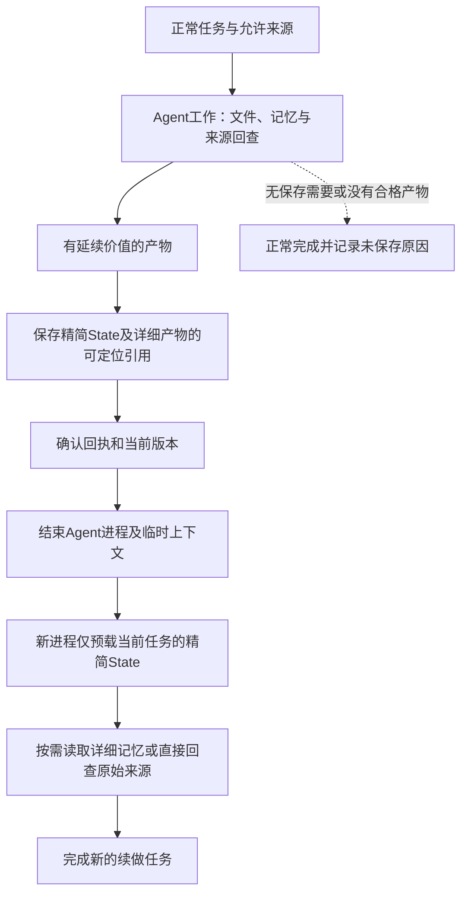

# MiLAi v0.2-05：通用记忆闭环开发与端到端泛化验证

## 1. 目标与成功含义

**v0.26：补齐G工作中主动捕获新来源后的续做分叉。** 真实回执与完整来源核对后，公开
分别保存到独立续做项目，重绑原有声明支持，未被记忆引用的观察也保留可查。脚本G公开链
9Evidence/3State、4冷进程/10完整文件读/7来源全文读及隔离撤权通过；不计模型泛化。
首次GET不提供分类字段导致的适配失败及1State/6Evidence保留，修复由关联捕获回执核对。
Lab514及静态/构建、两套独占服务终态核对通过；新增模型/tokenize/付费0，Product/公网未改。
原D5资料仍须具体变体绑定与执行入口；完整D0/D3、正式D4/D5及旧语义/负载缺口保持。
见[G新增来源分叉工程](../../../MiLAi-Lab/studies/active/MILA_V02_G_SOURCE_FORK_20260907.md)。

**v0.25：五臂变体公开保存与冷Host输入编排完成工程验证。** 可选计划接通A/B/表示/结构
变体独立来源与项目；变体从同一G母本产生，公开捕获全文、保存定位后冷恢复，不只改发送
字符串。四条脚本G工程链覆盖L1/L2包装及四种结构扰动，20State/44Evidence、16冷Host、
32模拟completion核验；真实模型/tokenize/付费0。两个L1键序被消除只属适配稳定，两个L2
结构差异保留到后续请求，不授予模型泛化。首次测试替身启动错误保留，额外已存2State/
9Evidence；本地分配已核实终态。Lab497及静态/构建通过，Product/公网未改，服务清理。
原四条D5资料仍缺结构层/格式/具体字段绑定，下一步补清配置入口；不补造实际G的结构机会。
完整D0/D3及正式D4/D5仍未完成。见[变体编排工程](../../../MiLAi-Lab/studies/active/MILA_V02_VARIANT_BRANCHES_20260907.md)。

**v0.24：G后新增来源接通公开保存与续做文件入口。** 可选阶段配置分别锁定G/续做来源，
G退出并冻结后才向A/B独立捕获新增观察，不改旧文件或H*支持关系；部分失败阻断续做，
不盲重试。独占PG/公开接口的脚本G退出、5份来源及3个State、4冷进程/15次完整文件读回、
A新来源撤权与B不受影响已核验。此G明确为非模型工程fixture，不计真实开发链。
Lab468及静态/构建通过；4份已有任务资料通过新阶段合同，原资料hash保持。
当前只接新增普通文件，未接覆盖/删除或五臂变体编排；下一步补表示/结构公开保存与冷恢复。
新增模型/tokenize/付费0，Product代码/公网服务未改。完整D0/D3、正式D4/D5仍未完成。
详见[阶段来源工程](../../../MiLAi-Lab/studies/active/MILA_V02_POST_G_SOURCES_20260907.md)。

**v0.23：补齐四条后续任务资料，保持不可执行。** 两研究简报和两内容写作任务各有G来源、
续做来源、问题及来源定位判据；两个任务的新决定仅在G后加入。4＋4文件包、4个评价合同/
12项span通过既有验证器，3份指定版本论文摘要原始页面保留。开发者已审阅，不称盲测。
预期L1机会与变体适用性须由真实G验证，不能预先PASS。明确旧协调器缺少G后等同来源更新，
下一步补通用阶段更新及变体编排，不能让旧prepare提前呈现未来决定。资料包不是执行配置，
没有模型分配；正式D0整体/D3/D4/D5仍未完成。Lab451及静态/构建通过，Product与服务未改。
详见[任务资料准备](../../../MiLAi-Lab/studies/active/MILA_V02_D5_TASK_PREPARATION_20260907.md)。

**v0.22：指定客户端边界的私人用户负载及冷恢复补齐。** 真实HTTP MCP/Runtime/PG，两个
签名合成用户在同tenant各自私人项目；普通20读/s、热点80读/s，1000 State。700读取全完成，
普通baseline/hot/recovery P95为14.822/22.129/14.072ms，完整正文和版本一致。新MCP/客户端
恢复六份State；停用后403与普通三次读取另以有限补充链完成，保留旧401错误断言，不重跑
负载。首次SESSION来源装配失败也保留；权限未变。此为2/6客户端在途上限下的局部证据，
不外推无限热点、服务端用户份额或公网TLS。721读取计时关联/清理核对、Lab451及静态/构建
通过，Product未改、无新模型/tokenize/付费。混合导入保存门及正式D4/D5仍未完成。
详见[私人用户HTTP负载](../../../MiLAi-Lab/studies/active/MILA_V02_PRIVATE_HTTP_LOAD_20260907.md)。

**v0.21：有界导入等待完成，当前混合负载仍未通过。** Lab增加默认关闭的有界等待，
新条件冻结为2在途＋1等待/100ms，所有等候保留在原定到达至完成延迟中。baseline三轮
完成，mixed第二轮48/50导入、保存P95约260ms，1次未发送等候超时和1次容量拒绝；
完整配对按原门停止。文件同步381/277ms仍占主要调用时间；独立两设备各60次有限写入
未复现长尾，不由此迁移磁盘或宣称修复。500读取关联及98提交READY、终态清理已核对。
Lab451及静态/构建通过，Product未改，新增模型/tokenize/付费0。下一步补真实私人用户
热点与普通用户负载/恢复缺口，不继续扩队列；当前存储门失败与正式D4/D5未进入保持。
详见[有界导入等待与存储核查](../../../MiLAi-Lab/studies/active/MILA_V02_BOUNDED_IMPORT_QUEUE_20260907.md)。

**v0.20：HTTP阶段关联有效，混合导入失败保留。** 默认SDK新增关闭的可选HTTP阶段计时，
MCP复用已有计时开关；无正文/凭据、不改重试或持久化。独立baseline诊断300/300完成。
随后重新冻结的配对baseline三轮完成，mixed第一轮100/100读取、49/50导入；1次客户端
容量拒绝后停止，完整配对未通过。拒绝时两次文件同步仍在途，分别约205/106ms，数据库
获取连接仅约0.016/0.017ms；不能据此解释旧读取停顿，不取消fsync或扩大池换取通过。
SDK188、MCP265/4跳过、Lab447及各自静态/构建通过。两次终态审计与清理完成，新增模型/
tokenize/付费0。详见[HTTP阶段观测与混合失败](../../../MiLAi-Lab/studies/active/MILA_V02_HTTP_TRANSPORT_TIMING_20260907.md)。
线上登录即私人空间模式已复核；新计时代码未部署。完整D3及正式D4/D5保持未完成。

**v0.19：当前服务确认仍失败，补齐调度观测及私人异步装配检查。** 原负载/资源/停止条件
下，baseline第二轮出现数秒停顿和13次客户端容量拒绝，mixed未进入。新增可选Host调度
采样及独立有限baseline诊断，后者199/200完成、第二轮P95约142ms，仍未过服务门。
最慢调用约313ms中application约4ms，当前证据不足以把HTTP/入口等待归因为PG或GC；
没有改门槛、扩大池、删正文或把未复现5秒停顿称为修复。两个失败及终态清理均保留。
认证私人用户在async State路径中独立推进与绑定检查通过，不外推真实负载公平。
MCP265通过/4默认跳过、Lab447及各自静态/构建通过；新模型/tokenize/付费0，Product实现未改。
详见[服务诊断与私人异步检查](../../../MiLAi-Lab/studies/active/MILA_V02_SERVICE_SCHEDULING_20260907.md)。
完整D3及正式D4/D5仍未完成；下一步定位应用处理之外的等待，保持全部验收范围。

**v0.18：未确认请求中断的两条真实恢复链。** 复用公开HTTP保存/重启检查，分别在请求完整
转发后及上游200到达但客户端未收到时SIGKILL独占API，再重启PG与新API。两条客户端均
保持UNKNOWN；显式同操作恢复分别得到新v3与已有v3回放，再次提交不增加版本。原文首尾、
已确认State和暂停投影任务保持，后者恢复READY并可检索。未将GET内容相等当操作确认。
独占服务均清理，Product未改，新增模型/tokenize/付费0，Lab445及静态/构建通过。
详见[在途请求恢复](../../../MiLAi-Lab/studies/active/MILA_V02_INFLIGHT_RECOVERY_20260907.md)。
本项不证明定点事务内部崩溃或完整混合负载/公平SLO；完整D3、正式D4/D5仍未完成。
下一步回到尚缺的服务负载配对与部署公平边界；SIM12语义负结果及模型累计成本保持。

**v0.17：有界原始来源回查补齐实际输入，保留解释失败。** SIM12复用SIM08真实G与SIM11
运行条件，两组共同增加可选有界原始文件回查。四份13,746字节完整原文及六项来源片段均
实际进入Provider请求，B未预载L2；租户范围解释纠正，但目录同步失败与提交边界仍有
遗漏或相反断言，两组完整任务未通过，不再把此失败归因于材料缺失。新增2请求30,946 raw，
累计69请求1,304,756 raw，付费0、pending0。公开撤权后A不返回正文、B保持正常。
修正未呈现bundle残留context依赖的工程问题，Lab440及静态/构建通过；后修源码与运行pin分开。
报告见[SIM12有界来源回查](../../../MiLAi-Lab/studies/active/MILA_V02_BOUNDED_SOURCE_BACKCHECK_20260907.md)。
批次关闭，服务已清理。完整D3及正式D4/D5仍未完成，下一步补剩余服务工程出口；
不以同一开放题的反复运行替代留出验证，不将完整来源预载设为日常降token默认。

**v0.16：任务与判据对应检查、通用来源要求及输出容量修复。** 旧规划问题未明确要求
计时分析，旧结果不回写；新任务显式加入待判断的计时汇总，六项来源判据原样保留。
复用既有completion_guidance加入通用依据要求，无新增模块或按题目检索路由。
SIM10两组均触及4096输出上限，0动作/0交付，22,545 raw完整结算。独立SIM11按完成优先
将单次上限改为8192，其他运行条件保留；两组完成交付，新增21,740 raw，但仍未满足
全部必要条件，尤其B混淆tenant限额与普通pool等待队列。两组仍未主动补查缺失的ADR-047。
两批均复用SIM08真实G，未重新生成。累计67请求、1,273,810 raw，付费0、pending0；
原失败、完整文件及回执保留，服务清理、批次关闭。正式D3/D4/D5未授予PASS。
详见[任务合同修订](../../../MiLAi-Lab/studies/active/MILA_V02_GROUNDED_TASK_CONTRACT_20260907.md)
与[SIM10/11结果](../../../MiLAi-Lab/studies/active/MILA_V02_GROUNDED_PLANNING_RESULTS_20260907.md)。
下一步针对遗漏来源做有界回查验证，已呈现内容的误解另记；不继续堆提示或无差别扩额。

**v0.15：检查原生Host思考配置，保留新的负结果。** 本地Provider原先固定关闭思考，现
允许严格布尔配置，缺省保留旧行为；tokenize和实际生成使用同一设置，成本及权限边界不变。
SIM09逐字节复用SIM08真实G产物，仅新增A/B两会话并共同启用原生思考；2请求19,680 raw，
模型输出均完整、预约结清，但两组仍未满足规划任务必要条件。原生思考生效不等于理解正确。
先前两个0生成准备失败保留；引用集合排序差异经明确记录后复用原已确认保存，未盲目重写。
累计63请求、1,229,525 raw，付费0。Lab422及静态/类型/构建通过；实验服务已停止，
批次新发送关闭。详见[SIM09结果](../../../MiLAi-Lab/studies/active/MILA_V02_NATIVE_THINKING_20260907.md)。
正式D3、D4/D5仍保持完整未完成范围，不把开放开发重试当留出或调整旧失败判据。

**v0.14：用户重新执行本Goal，继续正常端到端开发。** 复用此前完成优先的本地授权和宽松
异常护栏，执行已准备的SIM08项目规划G/A/B；旧批次没有重跑。真实产物、公开保存、三组
隔离与冷恢复、实际输入取得证据，但两组首次交付均未满足固定必要条件。8次本地请求、
50,518 raw tokens，整批62.720秒，未结算0；累计61请求、1,209,845 raw tokens，付费0。
B本例续做少1,498 raw tokens，但质量未合格，不作为分层收益结论。配置已关闭新发送。
详见[SIM08结果](../../../MiLAi-Lab/studies/active/MILA_V02_PROJECT_PLANNING_EXECUTED_20260907.md)。
正式D3整体、D4及D5仍未完成，不将独立开发例追认为正式阶段通过。

OAuth开发与私人空间部署已在独立HTTP-AIGCIT-AUTH-01中完成，用户报告外网可用；真人
refresh/replay/revoke及新私人模式真人保存恢复尚缺回执。其剩余验收不阻塞本Goal的本地
记忆开发。所有登录用户自动使用自己的空间，以ADR-049及认证Goal v0.3为当前规范。
下面v0.13及更早的认证未实施、暂停或额度描述仅保留历史，不覆盖本次恢复授权与线上事实。

**v0.13：用户选择复用AIGCIT Auth，仿照EKDB的认证分工，并最终要求先生成设计规划文档。**
新主线见[HTTP-AIGCIT-AUTH-01设计与实施规划](HTTP-AIGCIT-AUTH-01_设计与实施规划_20260907.md)：
Auth负责登录/签发，MiLAi负责资源验签、主体准入、工具scope与自有Memory权限。旧本地
enrollment方案保留为历史/兼容模式，不再是后续公网登录主线。本次仅文档和只读核查，
未改代码、DNS、代理、凭据或线上服务；候选资源尚未登记，HTTPS证书与真实登录仍未交付。
记忆工程/实验结果和额度原样保留，下列v0.12及更早段落是历史状态，不覆盖本次认证设计选择。

**v0.12最新状态：按用户完成优先指令放宽额度，SIM07新增Host一次当前任务公开回查后，
两组均完成真实保存—冷恢复—来源呈现—正确续做的本例固定必要条件。该例已打开，不授予
正式D4/D5或泛化通过。SIM01–SIM07共53次本地请求、1,159,327 raw tokens，付费0，
G复用不重复记账。SIM05/06失败保留；组合故障通过，完整D3仍未通过。
本例State-first比详细预载多59.09% raw tokens，不能作为降本默认。**

批次配置已关闭，元数据0表示无正在执行的新分配，不撤销用户继续开发的授权，
也不把旧20k/30秒紧预算恢复为当前开发门槛。OAuth继续暂停。

**v0.11执行顺序覆盖下文旧优先级：用户要求“先完成goal其他任务，不用管oauth了”，
OAuth暂停，不再作为记忆工程/模拟的前置。随后用户要求先正常端到端跑通、放宽紧预算。
因此启动独立SIM03单链：G/A/B各最多一次，每会话100万累计raw tokens、600秒、64请求，
单请求输出4096；总上限300万，仅本地既定模型。此为异常停止护栏，不是20k/30秒成本验收。
沿用完整来源/固定题目/公开保存/冷恢复，禁止重跑旧批次、隐式重试与付费调用。**

按用户要求，设计并实施一条可验证的完整路径：Agent完成正常任务，形成值得延续的内容，
通过公开接口保存；结束原进程；新会话恢复、按需回查完整来源，并正确完成后续任务。
同一套运行逻辑应适用于不同任务家族、文本/JSON记忆及非语义结构变化。

v0.2修订采用用户提出的分层设计：候选路径优先恢复精简State，需要细节时再读取详细记忆
和原始来源。主要比较改为“详细记忆预载”与“State优先、细节按需读取”，取代v0.1的额外
保存F/S比较；不把两种干预混在一起。v0.3吸收设计审阅，补充第9节执行约定。
**v0.4登记已完成的独立本地vLLM模拟，将后续顺序收敛为“非模型补缺→本地小样本→正式确认”。**
保留D0–D5和分层A/B主线；State-first仍是候选，不因实现存在而成为默认。A0保持不变。

**交付目标是有明确适用范围的端到端泛化证据。** 有限实验不能证明任意任务、任意格式、
任意模型均通用。文件读取成功、State版本增加、某个旧案例答对，都不代替此目标。
如果只完成工程测试，最终状态必须保留“端到端效果未验证”。

本文是详细开发与验收合同；当前已部分实现Product边界修复、Lab适配器、轻量Host与控制，
完成一条合成G/A/B模拟及后续非模型工程链；**不等于D1–D3完整通过，也没有进入正式D4/D5。**
v0.4仅同步文档；v0.5登记后续执行Goal产生的非模型工程增量，不增加模型授权。
**v0.8将并发读取、快速持久化、读写加工隔离和服务级性能验收前移到D1/D3。**
保留v0.5–v0.7已完成的工程证据，先优化现有产品关键路径，再考虑本地小样本语义实验。
v0.8当次修订仅更新规划和只读代码核查，不实现新接口、不启动压测、不接入第三方后端。
**外部项目仅作源码机制参考；产品架构、执行代码及服务仍使用MiLAi自有实现。**
本Goal不安排托管/自托管第三方Memory后端接入、SDK转接层或向其上传数据。
“实验模型请求单在途”不约束Memory服务的多用户、多Agent或独立工具调用并发。
**v0.9按当时要求仅将公网OAuth登录写入Goal，没有执行部署。v0.10依据后续“443开不了，
尝试7960–7969并继续实现HTTP MCP登录”的指令，开始端口核验和最小实现。** 不再以443为
前提，当前候选入口为`https://milai.aigcit.com:7960/mcp`。Streamable HTTP是传输方式，
不意味着可在公网明文传输OAuth凭据；非标准端口仍须可信域名证书。
当时第8.0节优先于此前安排；现由v0.11/v0.12的OAuth暂停与记忆完成优先覆盖。
仅MiLAi入口的限定切换在当前范围内，不占用其他服务端口；证书或域名控制缺失时停止切换。
本次完成端口探测、OAuth代理Host修复及本地验证，尚未安装代理、重启共享MCP或完成公网登录。
元数据授权字段表示后续新分配：本地与付费
元数据0表示批次已关闭；已完成本地批次单独记账，不被零值抹去。
旧N5不补齐、不重评分；本轮建立独立基线、配置和结果目录。

设计依据：[v0.2主方案](../MiLAi_方案研究规划_v0.2_通用Agent记忆流程_20260905.md)、
[前序工程结果](../../../MiLAi-Lab/studies/active/MILA_V02_COST_FIRST_RESULTS_20260906.md)、
[本地模拟报告](../../../MiLAi-Lab/studies/active/MILA_V02_LOCAL_VLLM_SIMULATION_20260906.md)、
[结构化结果](../../../MiLAi-Lab/studies/active/MILA_V02_LOCAL_VLLM_SIMULATION_RESULTS.json)、
[Host激活合同](../contracts/MILA_MEMORY_ACTIVATION_POLICY_V1.md)、
[Working State合同](../contracts/MILA_HOST_COGNITIVE_STATE_CONTRACT.md)、
[内容保真ADR](../adr/ADR-040-working-state-payload-fidelity.md)、
[小型原型执行合同](../MiLAi_v0.2_小型原型执行合同_20260905.md)。

## 2. 当前起点与实际缺口

| 已有能力 | 尚需完成的证据或开发 |
|---|---|
| 13个公开MCP工具，任务State预读取 | 同一闭环在未参与调参的新任务中实际成功 |
| State内容保真、CAS、版本回执；本地小链公开保存及冷恢复 | 完整失败语义、派生内容撤权和首次相关行为的正确性 |
| Lab原样笔记checkpoint及配置化L1/L2装配原型 | JSON布局、自然保存/no-op、旧字段保护等通用性与故障覆盖 |
| Python/jq与有界续读，12份历史完整还原 | 模型实际取得、使用所需内容，而非只有工具可调用 |
| 前序6种非模型变体；本地增量交付时203项Lab测试通过 | 真实Agent对等价表示和结构变化是否保持任务正确 |
| 本地请求预约、单在途、未知用量阻断；7次实际用量核对 | 原付费Host完整发送路径、金额、缓存计费与端到端deadline |

SIM01的Product源码基线为`c5561412b0440f84e628d69a7c271c96d66bae7f89d4e3f1db46ede97a1608bf`。
本轮ADR-041修复后的独立pin为`1f49c15194a7a8187a48f321437b024f8a7b12cdb96f5f35e6ce6b5bc2d29c4a`。
公开部署可能与本地源码不同，执行时重新计算pin，不用文件中的旧摘要代替实时校验。

### 2.1 本地模拟已完成，但保留负结果与未验证范围

批次`MILA-V02-05-LOCAL-SIM-01`使用本地`Qwen3.6-35B-A3B-FP8`和
`LOCAL_JSON_ACTION_HOST`，类型为`SIMULATION`；不是原付费Host的等价验收，也不是LME实验。
G按正常文档任务要求生成两份产物，适配器零模型保存，公开回执及GET确认`ABSENT v0→ACTIVE v1`。
A/B在新进程、不同TASK绑定中恢复相同载荷及普通文件快照；不据此声称所有隔离边界通过。

| 会话 | 模型请求 | raw token | 已观察结果 |
|---|---:|---:|---|
| G 生成产物 | 4 | 13096 | L1/L2产生，尚未完整评分所有语义 |
| A FLAT_PREFETCH | 1 | 3287 | 回滚决策字段正确，缺通知及恢复后核验步骤 |
| B STATE_FIRST | 2 | 5497 | 决策字段正确，缺恢复后核验步骤；自主读取L2 |
| 合计 | 7 | 21880 | 3个会话全部收尾，未知请求0，试验付费请求0 |

**本例B比A多用2210 token（+67.23%）**；不能宣称分层降本或完整任务通过。
L1本已包含关键条件是运行后观察，未事前分组，不能补称“L1足够”子组的预注册验证。
首次Docker网络地址池耗尽发生在分配/模型发送之前，0分配、0模型请求，失败记录保留；
修复仅让试验容器复用现有bridge，没有清理其他项目网络。
试验API/worker/临时MCP及PostgreSQL已停止，数据保留，共享vLLM和公网未变。

### 2.2 D0–D5的v0.4历史起点

| 阶段 | 当前状态 | 尚未满足的主要出口 |
|---|---|---|
| D0 | 本地模拟配置、fixture、pin、记录已封存；整体部分完成 | 完整公开能力/权限映射、验收覆盖和正式条件冻结 |
| D1 | 配置化产物保存、文件版本哈希、公开回执/GET、A/B装配已有正常路径 | 通用JSON/no-op/并发head推进/未知提交/L2部分失败矩阵 |
| D2 | 本地轻Host的预约与用量核对已验证该范围；不是正式D2 PASS | 付费Provider/原生Host、金额及缓存合同、全生命周期deadline |
| D3 | 真实PG/MCP正常保存及冷恢复有局部证据 | 双向canary、跨项目/全局搜索隔离、派生撤权、故障和变体；完整工程门未通过 |
| D4 | NOT_ENTERED | 本地合成模拟不占用或替代正式开发链；仍须前置门和新额度 |
| D5 | NOT_ENTERED | 留出家族、表示与结构尚未执行；不能从本例推断泛化 |

本地Host未提供shell/外部检索，13工具目录也不等于原生Host能力等价。本例同一项目不同TASK
只涉及机械State建立及文件读取，未验证有来源导入/索引写入时的跨臂隔离。
203项测试、Ruff、边界、mypy和构建是上一实现增量的交付证据，不是整套T01–T32已通过；
mypy覆盖`src/milai_lab`，不能据此称新增`tools/`实现已经完整类型验证。

### 2.3 v0.5非模型执行增量

已通过真实PG/公开MCP复现并修复撤销引用后的State正文及旧幂等回执泄漏，依据
[ADR-041](../adr/ADR-041-working-state-disclosure-on-stale-references.md)隐藏不可披露的
整个不透明payload，保留历史与版本/CAS。没有迁移、Canonical变更或公网部署。
文本/JSON、旧字段、no-op、操作/head分离、UNKNOWN、L2成功/L1失败及新进程恢复取得
直接证据；受控文件及已呈现来源在后续请求前重新核验。正式D0–D3整体仍未通过。

完整T01–T32映射及证据见
[本轮工程报告](../../../MiLAi-Lab/studies/active/MILA_V02_E2E_ENGINEERING_20260906.md)，
[结构化结果](../../../MiLAi-Lab/studies/active/MILA_V02_E2E_GENERALITY_RESULTS.json)。
第2.2节记录的是v0.4起点，当前逐项覆盖以本轮报告为准，不把任何PARTIAL计作阶段PASS。

SIM01全部7个原始请求与21,880 raw token重新只读核对；B仍比A多67.23%，完整动作仍未通过。
固定选取首条已打开D历史0a995998，保留44个会话/484条事件；仅tokenize的候选首输入为
4,011 token，全历史诊断输入为124,356 token。未证明整会话20k可行，也未完成完整公开分叉。
新增模型分配、生成请求及生成token均为0，另有2次无生成tokenize；不消费SIM02/D4/D5额度。

仍需完成完整来源/表示变换链、请求负控、完整deadline、正式Host/Provider控制合同。
本轮工程证据不证明模型理解、分层收益、保存增量或泛化；Goal保持IN_PROGRESS。

### 2.4 v0.6控制与观测增量

本地Host已将G的尾部保存/确认移回G进程，共用覆盖绑定/恢复/工具/生成/交付/保存的绝对
截止时间。模拟时钟及真实阻塞/强杀子进程验证超时中止、未知预约不释放、迟到有效usage
结算但不执行迟到动作；当前代码不再依赖旧SIM01的每轮180秒检查来覆盖尾部保存。
原SIM01参数与结果保持不变；新机制不是正式Host/Provider或实际模型30秒达标证明。

请求汇总器已实现正文哈希、预约、发送与回执关联，以及消息片段定位；实际JSON-action
Host经mock transport验证A/B装配差异，负控不把取得/待发/未知当作已确认呈现。
16项新增回归通过，Lab完整244项通过，静态/类型/构建检查通过；本增量0生成请求、0新服务。
证据在工程报告的`control-20260906a/`。完整来源分叉、表示变体、真实工具deadline及正式
Host合同仍待完成，D4/D5未进入，所有新增模型额度保持0。

### 2.5 v0.7完整来源与表示链增量

固定首条已打开历史已在G/A/B三个独立项目各公开导入484事件，保留44份完整会话文件；
逐条核对正文、原会话时间、角色、归属、资格及turn链接，再经新进程恢复与文件资格检查。
只重绑定公开声明的引用字段，不替换不透明正文里的UUID。一次固定查询的三臂结果顺序
一致，均受`context_budget`限制返回DEGRADED；不扩大预算，不外推任意查询等价。

以SIM01的真实G产物为母本，完成文本、JSON包装、分字段、键换序和首尾字段删除五条
公开保存/冷恢复/Host mock输入链。前四种可还原母本；删除例仍能保存且完整来源保留，
但不计作等价变体。键序被序列化消除，不能解释成模型位置鲁棒性。新增真实生成仍为0。

MCP现正确区分预算限制提示与组件故障描述，保留DEGRADED状态/原始证据/原预算。
该提示修正后的当前pin为`baf29ec03b264d22fcee0fde238d970ac52a3c106b3ad507159ad991af3a0754`，
此前来源/变体运行仍归属`1f49…`。Lab250测试通过；MCP161通过及1项真实PG补跑通过，
相关静态/类型/构建检查通过。失败回执和完整证据见工程报告的`eng-20260906b/`。

尚需将已验证来源分叉接入受控任务runner并完成剩余编排出口，不能把此工程链当作新的
Agent G/A/B。正式Host/Provider合同与新增模型额度仍未满足，Goal保持IN_PROGRESS。

### 2.6 v0.8并发关键路径核查：已有基础，不等于容量达标

以下来自当前工作区的只读代码核查；没有运行并发实测，不能据此填写P95或吞吐PASS。
未来实现与压测仍须冻结当次源码pin、部署配置和测量范围。

| 已核对入口 | 代码事实 | 下一项最小验证 |
|---|---|---|
| [Runtime入口](../../runtime/src/milai/api/cli.py)、[数据库连接](../../runtime/src/milai/persistence/database.py) | Waitress可配置多线程；PG连接池按事务绑定tenant/actor；pool初始化锁不覆盖整条业务请求 | 实际部署线程/连接配额、连接等待与跨请求身份复用；不得跳过鉴权、RLS或审计以换速度 |
| [Python客户端](../../integrations/python-client/src/milai_client/client.py) | 已有AsyncMilaiClient和可复用的HttpxAsyncTransport；同步MilaiClient的实例RLock覆盖完整run_until_complete | 检查目标入口是否使用异步且复用连接；共享同步实例确会串行执行调用，先做重叠测试，不直接删锁破坏事件循环安全 |
| [MCP入口](../../integrations/mcp/src/milai_mcp/server.py) | Working State GET和UPDATE共用submitter_api同步客户端；不是所有客户端共享一把服务全局锁 | 同一服务下不同合法任务的GET/UPDATE是否排队；验证不同身份、角色和取消行为，再决定最小异步改造 |
| [投影worker](../../runtime/src/milai/workers/main.py)、[投影仓储](../../runtime/src/milai/persistence/projection_repository.py) | 已有outbox投递、批量租约/续租和watermark；客户端已有投影readiness等待入口 | 复用既有机制测试进程退出、重复领取、旧版本晚到和读写资源竞争；不新建一套消息平台 |
| [本地Provider](../../../MiLAi-Lab/tools/v02_local_provider.py) | provider.lock控制实验批次的模型生成请求预约与单在途 | 该锁不应包围Memory请求调度，也不能作为产品服务串行化依据 |

现有异步类、线程数、池大小和outbox仅证明可复用的实现基础；不证明某部署能处理128并发，
也不证明“读取不受导入影响”。首个增量应定位入口→客户端→连接池→数据库/投影的等待位置。
ADR-041的撤权后整条不透明payload拒绝披露、操作/head区分和既有来源分叉均继续保留。

本次文档同步校验：相对链接、代码围栏、零新增额度及历史证据保留检查通过。当前工作区
`uv run pytest -q`为258 passed；`uv run milai-lab-check-boundary`、
`uv run mypy src/milai_lab`（30个源文件）、`uv build`通过。`uv run ruff check src tests tools`
报`tools/run_v02_e2e_generality.py:1`的E501（101 > 100）；本次未修改该代码，未掩盖失败。
这些检查不回写v0.7的历史测试数；本轮仅改文档，未重跑Product Runtime/MCP或服务压测，
无API/Schema/权限/Canonical变更或迁移，新增实验模型调用为0。

### 2.7 恢复执行后的 P1 State 校准增量

已完成共享同步SDK串行点、异步读取重叠/取消和MCP调度/参数绑定三项机制回归；
Product运行源码未改。独占PG经公开SDK保存1,000条无来源引用的合成Working State，
1/8并发各读取288次，正文/版本一致；同步起跑CAS仅一个提交成功，直读/回放版本可关联。
保存客户端P95为25.16ms；1并发各轮读取P95为5.54–6.38ms，8并发为32.02–37.05ms。
这些是短时、暖数据库、客户端边界的诊断，不是网关SLO或完整P1验收。

完整配置、等待点与限制见[本轮P1报告](../../../MiLAi-Lab/studies/active/MILA_V02_P1_SERVICE_CALIBRATION_20260906.md)。
尚缺来源引用/范围检索、真实多主体凭证、MCP持久连接等价对照、混合负载/公平性及P2故障。
服务已停止且数据保留；新增模型请求0，D4/D5未进入，服务性能总状态仍不授予PASS。
本增量Lab 258、SDK 177、MCP 162通过（MCP原PG生命周期1项默认跳过），相关
Ruff/mypy/build通过；第2.6节文档同步时的E501现已修复，保留其历史失败归属。

### 2.8 P1 Working State 异步接入与尾延迟负结果

Working State GET/UPDATE 已接入服务生命周期内复用的异步SDK客户端，保持可信绑定、
CAS/幂等、非Canonical正文和审计；取消写入保留UNKNOWN。其他工具未改为异步。
该增量源码pin为`fd93b919c24965586bf9c71f32b0802fe9349fae4ef568487a1e32fd7908bd12`，
独立锁及报告见[异步State增量](../../../MiLAi-Lab/studies/active/MILA_V02_P1_ASYNC_STATE_20260906.md)。

同一服务、State版本和复用MCP客户端的sync/async诊断共1,161工具调用。8并发完成吞吐
观察为137.45/166.27次每秒，但各轮P95分别59.28–100.16ms、64.66–91.28ms，
尾延迟未稳定改善，均未达候选50ms目标；不增加到32/128。固定顺序且仅预热缓存，
不是网关SLO或严格部署效果估计。完整P1/D3仍未通过。

新增真实PG并发主体/CAS/来源撤权回归最初因缺少SESSION来源元数据被正确拒绝；
保留失败与负控，补齐公开来源元数据后1项完整PG生命周期通过。MCP168通过、
Lab258通过及相应静态/类型/构建检查通过。无Runtime/Schema/权限/Canonical语义改变，
无迁移和部署；本轮服务及补跑PG已停止，新增模型请求0，D4/D5未进入。

### 2.9 P1 逐请求计时与连接池等待诊断

默认关闭的公开只读计时复用OperationTimer和脱敏日志，不增加模型输入、工具、
数据库实体或权限/Canonical语义。该增量源码pin为
`f476001abeb201dc7bfe79b9a209a7851147379a7df659ec04a594fded4d2142`。
配置、合同边界与失败记录见[计时诊断报告](../../../MiLAi-Lab/studies/active/MILA_V02_P1_REQUEST_TIMING_20260906.md)。

同规模sync/async共1,152次计量读取全部唯一关联。async 8并发均值49.39ms，其中
Flask应用5.76ms、连接池获取0.020ms；主要剩余时间位于应用外，但调度/编码/传输/
队列和日志尚未完全分离，不能归因为纯网络或单一队列。客户端P95为82.45ms，
未达候选50ms，不扩大并发或连接池；固定顺序及观测开销未隔离，不授予网关SLO。

Runtime全量首跑972通过、1失败、1跳过；新增测试日志捕获修复后目标PG测试通过，
原可选包跳过项补跑通过，未重复全量。MCP169通过及1项直接PG通过，Lab264通过，
相应静态/构建通过。原失败保留，池耗尽现有通用500不视为背压验收。
本轮服务和补跑PG已停止，新增模型调用/tokenize均0；P1/D3仍PARTIAL，D4/D5未进入。

### 2.10 P2 保存落盘、正文保真与冷恢复

保存路径核查发现Blob重命名后未同步目录，ADR-042补齐文件发布的持久化边界；
同步失败在TX-01之前返回错误。实际直读又发现Evidence正文末尾换行被通用去空白规则
删除，ADR-043在Runtime及typed SDK保留完整正文；旧记录不重写，幂等冲突不放宽。
无需新数据库实体/迁移，权限及Canonical不变。

该增量源码pin为`e5dc1dafc1246153f753f5d6b2a71060a9ef6688ce70948bc0a796dac630a7a7`。
见[保存与冷恢复报告](../../../MiLAi-Lab/studies/active/MILA_V02_P2_DURABLE_SAVE_20260906.md)。
三份512/2048/8192字节Evidence在worker停止时保存并完整直读，索引明确未就绪；
回执后SIGKILL API、正常重启PG，新进程仍恢复完整内容。旧State操作重放为V1，当前
head为V2；worker恢复后对应Evidence可检索且非Canonical。完整链23次公开HTTP调用，
包括前置失败共51次，均无新增模型或Provider tokenize调用。

首尾及换行失败已保留，没有删内容过关。顺序机制检查不证明断电、混合负载/公平性或
SLO，P2仍PARTIAL。相邻Blob/正文18、SDK179、MCP169及直接PG1、Lab264通过；
Runtime完整确认982通过，无失败/跳过；初始计时测试与复用测试数据库导致的失败均保留，
未清空历史或放宽保护。自有服务及回归PG均已停止。D4/D5未进入，Schema仍NO-GO FOR SCHEMA FREEZE。

### 2.11 固定读取与导入：绝对客户端门满足，退化门未通过

两个独占服务分别公开预置相同逻辑的1000条带引用State及三份来源；每臂相同预热后
按20次/s读取，mixed额外10次/s导入，三轮各5秒，客户端在途上限6读+2导入。
冻结候选为客户端计划发送至完成P95≤50ms，且逐轮mixed/baseline≤1.5。
600读取与150导入全完成、正文/版本一致，无拒绝/超时/错误；149次导入与Runtime读处理重叠。
来源实际输入摘要一致，活动State作来源ID映射后相同，catalog相同。

baseline读取P95为14.76/14.27/37.18ms，mixed为23.20/20.93/15.58ms。
第一轮退化57.15%超过50%容限，故仍为`MIXED_DEGRADATION_BOUNDARY_MISSED`，不升档。
600次计时全部关联；尾部可分别出现在连接持有期间及MCP handler之外，不能凭此扩池或
将等待归为单一SQL/网络瓶颈。150个导入目标在轮末达到匹配索引版本，精确逐写索引延迟未测。

详见[固定到达率混合负载报告](../../../MiLAi-Lab/studies/active/MILA_V02_P1_P2_MIXED_LOAD_20260906.md)。
Product源码pin仍为e5dc1daf…，本轮无Product改动、无生成/Provider tokenize；自有服务已停止。
Lab最终268测试、边界/静态/类型/构建均通过；运行后取消控制回归不冒充真实服务取消效果。
这是客户端边界下的有限负载证据，不授予网关SLO、租户公平性或模型通用性PASS。P1/P2仍PARTIAL。

### 2.12 数据库等待有界化与容量错误确认

针对已确认的池获取超时返回通用500，ADR-044复用现有连接池限制等待人数：每池默认32，
允许1–1024，0不再表示无限排队。请求获取连接时区分队列满与等待超时；未由应用层转换的
错误返回503/DATABASE_CAPACITY_EXCEEDED。它不证明整个HTTP请求从未提交；MCP写入仍为
UNKNOWN，当前实验客户端不自动重试。没有新增数据库实体、迁移或权限/CAS规则变化。

该增量源码pin为`14521655c92bc00d5a0867d76b85ef5fc0b9958875fc484d467c5177a413e4d6`。
见[数据库容量边界报告](../../../MiLAi-Lab/studies/active/MILA_V02_DATABASE_CAPACITY_20260906.md)。
Product自身真实PG夹具验证队列满即时拒绝、超时分类、无效凭据先拒绝、独立Steward池可用、
释放后恢复、显式重试/重放不新增版本与Host绑定隔离；两项直接检查通过。
Runtime完整984通过、无跳过/失败；MCP170通过及默认跳过的PG生命周期另跑1通过；Lab268通过。
相关静态、类型、构建及Lab边界检查通过，三个当前配置pin匹配，自有API/worker/PG均停止。

本轮未增加负载、生成或Provider tokenize。仅确认每池准入子集，不能推出网关排队有界、
跨租户公平性或尾延迟改善；第2.11节退化门失败保留，P4仍PARTIAL，D4/D5未进入。

### 2.13 事务退出长尾定位与同上限诊断

复用默认关闭的请求计时，增加嵌在连接持有内的事务进入/退出观测；驱动的提交、回滚、
取消和异常抑制语义保留，退出计时不作为成功提交回执。该增量源码pin为
`38b43df09b2bd872fe6112cb1787b5247cd28d2896ac70fb595c13002536f342`。
见[事务计时诊断报告](../../../MiLAi-Lab/studies/active/MILA_V02_TRANSACTION_TIMING_20260906.md)。

同读取/导入率、同在途上限下600读取/150导入全部完成，600/600关联事务边界；三轮读取
P95比值1.2095/1.0558/1.2826，绝对P95均≤50ms，本次客户端候选门满足。第2.11节失败保留，
不是旧/新实现配对，不证明计时或容量改动提高了性能，也不授予网关SLO或整体P1/P2通过。
最慢173.056ms读取中事务退出164.426ms、池等待0.035ms；另一条67.778ms读取中
MCP handler外56.687ms。前者已定位退出区间，仍不能等同PG磁盘等待或删除读取审计。

局部控制12通过；直接PG初始缺配置导致2失败/1通过，修正夹具后3通过；完整Runtime
997通过/1可选包跳过，该用例修正导入路径后单独1通过。Lab272及相关静态/类型/构建通过。
依赖入口源码核查不作为网关/公平性证明。自有服务全部停止，模型生成/Provider tokenize均0。
不扩大负载，P1/P2/P4仍PARTIAL，D4/D5未进入。

### 2.14 客户端GC观测：基线失守，混合臂未进入

为排查MCP handler外等待，只在Lab负载客户端增加默认关闭、有界的GC回调观测；不改变
GC策略，不从延迟中扣除交集。Product源码pin仍为38b43df0…，服务负载上限不变。
见[客户端GC诊断报告](../../../MiLAi-Lab/studies/active/MILA_V02_CLIENT_GC_DIAGNOSTIC_20260906.md)。

首轮100次计划读取中99完成、1次因已有6条在途而由客户端拒绝；完成请求P95为148.615ms，
基线门失败。按冻结条件停止后续轮次，mixed没有启动，没有自动重跑。
99/99实际读取关联成功；最慢319.975ms工具调用中事务退出309.995ms，客户端GC交集
仅0.301ms。最大handler外等待37.243ms的调用没有客户端GC交集，故本次不能由客户端GC
解释这些长尾，也不追认历史无GC观测轮次的原因。

Lab280及边界/静态/类型/构建通过；自有服务全部停止，模型生成/Provider tokenize均0。
第2.13节单次客户端门满足与本次失败同时保留，不授予稳定性或整体服务验收通过。
完整网关SLO、提交等待根因、MCP前后边界与公平性仍有缺口，D4/D5未进入。

### 2.15 PG容器资源观测：事务退出与I/O压力同窗

Lab既有资源采样增加自有PG容器cgroup读取，绑定容器ID、PID启动时间和成员路径；
不查私有SQL、不改限额或持久化。Product pin仍38b43df0…。
见[PG容器诊断报告](../../../MiLAi-Lab/studies/active/MILA_V02_PG_CGROUP_DIAGNOSTIC_20260906.md)。

同上限600读取/150导入全部完成，本次三轮客户端P95比值1.1694/1.1835/1.2421，绝对P95
均≤50ms；本次门满足与历史失败分别保留。600/600读取均关联完整包围的容器采样窗口。
baseline最长事务退出36.900ms，其窗口I/O压力增加36.653ms，自身CPU限流增量0；mixed
最长退出23.510ms也出现I/O压力增量，但窗口更宽，不能作逐请求独占归因。
另两条handler外41.343/37.000ms等待仍没有客户端GC或PG I/O压力交集证据。

自身限流计数不涵盖所有祖先/调度等待，本机cpu.stat.local缺失；采样实际最大间隔约88ms，
不是无开销的精确探针。不定位具体fsync/WAL语句，不回填历史未采集信息，不宣称性能优化。
Lab288及边界/静态/类型/构建通过；自有服务停止，模型生成/Provider tokenize均0。
网关SLO、公平性、持续负载与语义效果仍缺证，D4/D5未进入。

### 2.16 MCP外部等待分段：长尾位于handler入口前

既有默认关闭的日志增加可选monotonic起止时间戳；只有独立验证同主机/同time namespace
及客户端开始/结束身份一致后，才作跨进程分段。字段不进Memory或工具结果，未知或异常
顺序不填0。当前源码pin为`13999df2432148b9ec9cd2580164f3cae70ee2875b70a2a8dff316f5a0b3ce46`。
见[MCP边界计时报告](../../../MiLAi-Lab/studies/active/MILA_V02_MCP_BOUNDARY_TIMING_20260906.md)。

400读取全部完成并关联：两条最大外部等待在handler前为42.394/46.488ms，handler后仅
1.962/2.313ms；客户端GC交集0。前段仍混合发送、传输、框架派发及参数处理，未证实具体根因。
baseline三轮读取P95达标；mixed首轮100读取完成，50计划导入中48完成、2被客户端上限
拒绝，按合同停止后续两轮，整体门未通过。两臂完整来源/活动State/catalog已单独核对一致。

MCP170及直接PG生命周期1、Lab293通过，相关静态/类型/构建通过；自有服务停止。
无新增模型生成/Provider tokenize，无Schema/权限/事务语义变化，D4/D5未进入。

### 2.17 服务端GC复现：两类长尾分别归因

只读核查实际MCP依赖与适配层，确认现代带参工具调用会先查当前调用者的tools/list作
协议头校验；参数模型在注册时建立。通过标准Python GC回调包装同一公开CLI，未改Product
源码或GC策略，pin仍13999df2…；见[服务端GC报告](../../../MiLAi-Lab/studies/active/MILA_V02_MCP_SERVER_GC_20260906.md)。

基线300计划读取中299完成、1客户端容量拒绝，第三轮P95为218.272ms，mixed未进入。
299/299时间关联成立：一条handler前33.038ms等待中，服务端第二代GC区间30.880ms完全
重叠；另一条348.975ms调用中事务退出330.342ms，并有PG容器I/O压力同窗。
GC对象分配来源和具体磁盘操作仍未定位，不能将两类等待合并或追填历史缺失观测。

Lab295及相关静态/类型/构建通过，自有服务停止，模型生成/Provider tokenize均0。
观测包装不是产品默认，不缓存跨主体catalog、不改变持久化或GC策略，D4/D5未进入。

### 2.18 千条来源范围读取：项目边界成立，单并发延迟未达标

核查目录重复对象构造后，因无分配热点/安全收益证据而未加catalog缓存；转入尚缺的范围读取。
两次各通过公开接口保存1000份完整来源，两个项目各500，20批索引就绪；pin仍13999df2…。
初次把上下文预算提示合并为不可用而停止，失败保留；确认运行前冻结规则修正，预算受限视图
单列计数，其它降级仍停止。没有扩大内容预算、删来源或改300ms阈值。

确认运行的正常召回、外项目标记MISS、伪造scope拒绝成立；24次并发1读取P95为330.880ms，
停止后续轮次及并发8。25个预算受限视图、1个MISS、1个预期拒绝，不授予完整召回或租户隔离PASS。
公开Runtime计时显示主要剩余区间在连接之外，但未定位具体函数；不能直接推成CPU或网络原因。
详见[范围检索报告](../../../MiLAi-Lab/studies/active/MILA_V02_SCOPED_RECALL_20260906.md)。
Lab309及相关静态/类型/构建通过，Product源码未改，自有服务停止，模型生成/tokenize均0。
完整P1/P2/P4和D4/D5仍未完成；后续先核查Runtime检索后处理/装配/预算路径，再按证据修复。

### 2.19 窗口焦点局部复用：单并发达到候选边界，并发8仍失守

Product局部剖析定位到预算二分中的重复正文焦点扫描；只将焦点移至当前适配循环外计算，
不跨请求缓存。50窗口固定输入完整编译结果前后逐字段一致，中位140.307→48.137ms；这是
局部工程证据，不代替服务或模型效果。当前pin为09237fd4…，详见[焦点复用报告](../../../MiLAi-Lab/studies/active/MILA_V02_EXCERPT_FOCUS_20260906.md)。

公开MCP确认继续1000份相同来源，首个响应规范化新ID后相同，范围控制成立；并发1三轮P95
298.531/288.069/296.802ms，并发8首轮P95 1867.128ms，停止后续两轮。来源、预算、300ms
阈值不变；局部提速不扩称服务同比收益。范围resolve仍走同步SDK调用锁，下一步针对该边界。

Runtime真实PG1005通过、1跳过项补齐SDK路径后另跑1通过；相邻37、Lab309及适用静态/类型/
构建通过，自有服务停止，模型/Provider tokenize均0。Schema/权限/Canonical/事务不变，
完整P1/P2/P4及D4/D5仍未完成。

### 2.20 范围resolve异步接入：机械重叠成立，单并发性能仍失守

Codex-full CLI使用lifespan reader异步客户端，逐请求计算认证binding，共用既有resolve
预算/错误/呈现代码；嵌入式未提供factory时保留同步兼容路径。两个认证主体的受控HTTP重叠、
header及续查参数分离、取消不影响peer、跨循环重建均已验证。MCP175及直接真实PG1、Lab309
通过。当前pin f8e378c8…，见[异步范围读取报告](../../../MiLAi-Lab/studies/active/MILA_V02_ASYNC_RESOLVE_20260906.md)。

同条件1000来源输入、完整catalog及规范化首个结果与c一致；范围控制成立，但并发1首轮
24读P95 324.034ms，超过300ms线，后续轮次及并发8未进入。不能据机械异步能力宣布并发
性能改善。Runtime连接外剩余区间仍较大，下一步剖析完整单次resolve，而非直接套用局部50窗口结论。
自有服务已停止，模型生成/Provider tokenize均0，无Schema/权限/Canonical/事务变化。

### 2.21 完整请求日期扫描复用：局部等价，公开确认停在投影就绪

完整Product请求profile定位Evidence解释中的重复日期扫描；只复用同一span已取得的首个
match，独立formation解析和全部原日期规则不变。真实240个span的完整解释和完整Memory
Context逐项相等；交替执行各10次局部解释中位87.761→55.046ms，不作服务SLO收益解释。
见[日期扫描复用报告](../../../MiLAi-Lab/studies/active/MILA_V02_DATE_SCAN_20260906.md)。

Runtime相邻34及完整真实PG1019（无跳过）、Lab309、适用静态/类型/构建通过。
新pin f7382a1b…；公开e运行1000个来源保存回执及输入hash与d一致，但第12批就绪在
5002.133ms超时，水位585/目标602，无dead-letter gap。SDK1013、MCP0；范围控制及
延迟均未进入，不能宣布公开服务提速或继承上一轮通过项。后续AdminShutdown属于清理，
不是已确认的就绪失败根因。失败证据保留，不隐式重试或放宽就绪/延迟门槛。

自有进程不存在、PG停止，模型/Provider tokenize均0。API/schema/权限/Canonical/事务
不变，完整P1/P2/P4及D4/D5未完成；下一步分析已有worker阶段计时与水位推进路径。

### 2.22 worker只在空闲轮次等待：就绪及单并发通过，并发8仍超线

原忙碌轮次之间固定等待1秒，e保留计时中6.90秒轮次约5.87秒为非嵌套阶段耗时；不能
把全部迟延归于等待。worker现只在无处理结果时轮询等待，积压时继续下一有界cycle；
批次/事件上限、顺序、租约、重试时刻与水位规则不变。相邻18、Runtime真实PG1022（无跳过）、
Lab309及适用静态/类型/构建通过。见[worker空闲轮询报告](../../../MiLAi-Lab/studies/active/MILA_V02_WORKER_IDLE_20260906.md)。

pin 0fe5f7cf…；公开f运行20批就绪与范围控制通过，1000来源hash、完整catalog和规范化首个
MCP响应与d一致。单并发三轮P95为271.038/274.508/252.387ms；8并发首轮1724.674ms后
停止后两轮。MCP99、SDK1021、Runtime HTTP1125；各层不相加。d→f之间日期复用与轮询均已
改变，而e未进入读取，不单独归因某一改动带来的公开性能收益。

Runtime自身resolve P95为1540.886ms，连接持有和连接外区间均放大，尚未定位独占根因；
下一步分析保留计时/资源记录，不扩大并发/资源。自有服务停止、数据保留，模型/tokenize均0；
Schema/权限/Canonical/事务不变，完整P1/P2/P4及D4/D5尚未完成。

### 2.23 8并发CPU诊断：计算需求确认，独占根因仍未成立

读取f保留采样，c8内部区间API平均1.019核、worker0.008核；c1 API约0.65核。
Product内部另固定11请求，保留真实认证/PG/来源/预算和2逻辑CPU affinity：单请求线程CPU
141.114ms、墙钟181.522ms；8请求线程CPU合计1290.801ms、整批墙钟1334.481ms。
全部完整Memory Context与预热相同，结果PARTIAL不变，不能升级为模型或语义效果。
见[并发CPU诊断报告](../../../MiLAi-Lab/studies/active/MILA_V02_C8_CPU_20260906.md)。

单请求CPU profile扰动明显（线程CPU356.672ms），只用于定位解释/扫描、绑定、复制与
序列化候选，不作正常成本分摊。数据支持API计算需求为瓶颈之一，不宣称GIL或PG独占原因。
下一步审查普通LOOKUP既有路径与候选复制的实际消费者，证明合同后最小修复，不盲目
开启type-directed或替换浅复制。源码pin未变，未重复/追认上一轮全量回归；原服务未
重启，自有PG再次停止，模型/tokenize均0。完整P1/P2/P4及D4/D5仍未完成。

### 2.24 日期必要信号：完整结果相等，8并发仍未达标

消费者审查未支持直接删除解释或浅复制；采用现有日期规则的必要信号检查，只对确定
不含任何支持日期表达的文本跳过扫描，阳性仍走原规则。Unicode/边界/首尾日期等12项
新增控制及相邻50通过；真实240个span完整解释与Memory Context相等，局部中位
55.525→27.383ms。含日期文本多一次检查，不宣称任意输入更快。
见[日期必要信号报告](../../../MiLAi-Lab/studies/active/MILA_V02_DATE_SIGNAL_20260906.md)。

Runtime真实PG1034（无跳过）、Lab309及适用静态/类型/构建通过；pin 49ed9d3f…。
公开g的20批就绪与范围控制通过，1000来源hash/catalog/规范化首个MCP结果与f相同；
c1三轮P95为226.462/224.900/226.731ms，c8首轮1400.010ms后停止。MCP99、SDK1021、
Runtime HTTP1125，各层不相加。Runtime持有连接P95仍669.168ms；下一步拆解已有
事务进入/退出与连接计时，不把剩余长尾全部归于日期计算。

自有服务停止，数据保留，模型/tokenize均0；API/schema/权限/Canonical/事务不变，
完整P1/P2/P4及D4/D5仍未完成。

### 2.25 事务身份设置合并：隔离不变，并发性能仍未改变数量级

g保留计时逐请求扣除事务进入/退出后，持有区间P95仍507.743ms，不能只归因提交。
每个带context事务的tenant/actor两条设置SQL合成一条，逐事务角色校验及本地GUC语义
保持；见[ADR-045](../adr/ADR-045-transaction-local-context-installation.md)及
[事务身份设置报告](../../../MiLAi-Lab/studies/active/MILA_V02_CONTEXT_BIND_20260906.md)。
真实PG成功/异常/取消、同backend跨身份复用及角色拒绝先于设置的4项控制成立；相邻16、
Runtime真实PG1038（无跳过）、Lab309及适用静态/类型/构建通过。

pin d9a2fd6d…；公开h就绪/范围通过，1000来源hash/catalog/规范化首个MCP结果与g相同。
c1三轮P95为231.571/230.058/227.628ms，c8首轮1306.270ms后停止。MCP99、SDK1021、
Runtime HTTP1125，各层不相加；不把单批差异归为独占因果效果。完整P1仍未通过。

局部优化没有改变并发性能数量级，下一步先列出普通读取的必要工作、事务及输出消费者，
有证据能显著减少总工作量后再修复/复测，不继续微调即重跑。自有服务停止、数据保留，
模型/tokenize均0，无API/schema/权限/Canonical/事务语义变化，完整P1/P2/P4及D4/D5未完成。

### 2.26 普通读取工作量审计：重复获取与主要CPU成本分开处理

复用h保留数据，Product自身通过真实路由/鉴权/PG执行一次预热和一次观测；不是Lab
黑盒实验或服务SLO。pin仍d9a2fd6d…，完整MemoryContext相同，源码及公开配置未改。
见[普通读取审计](../../../MiLAi-Lab/studies/active/MILA_V02_READ_WORK_AUDIT_20260906.md)。

观测请求153.791ms wall / 115.178ms thread CPU，7事务均安装身份并校验角色。全局与
需求槽两个逻辑probe实际搜索SQL及参数hash相同；一次重复获取约15ms wall / 2ms CPU，
不能单独修复此前c8 P95 1306.270ms的缺口。60来源形成240 span及解释、240绑定
（180 REJECTED/60 POSSIBLE），解释/绑定约27.420/22.940ms CPU，快照16.401ms。
14可用窗口呈现8个，不据此删除未呈现材料、Canonical回退、绑定或审计。

下一项先验证请求内纯文本计算复用，保留每条来源身份、时间、说话人、provenance与
完整输出；同时检查不同文本条件，不能由重复文本样本推泛化。该优化尚未实现，须有
等价和实质成本证据后再公开复测，不继续微调即重跑。自有PG停止、客户端关闭、数据
保留；未重启原API/worker/MCP，模型/tokenize均0，完整P1/P2/P4及D4/D5仍未完成。

### 2.27 请求内文本扫描复用：逐来源输出保持，收益限于已测条件

只在一次解释调用内复用重复完整文本的词项/日期/数字/信号扫描；时间归一化、speaker、
provenance、ID与解释对象仍逐span产生，无跨请求缓存。见
[文本复用报告](../../../MiLAi-Lab/studies/active/MILA_V02_TEXT_REUSE_20260906.md)。
第一版保留唯一文本导致不同数字文本峰值增加约3.06MB，改为只保留重复文本后约51KB；
不同长文本及数字文本基本无CPU收益，重复长文本52.174→6.596ms，不推任意任务加速比。

本轮Product内部诊断共3个真实路由/鉴权/PG请求。首次跨请求snapshot比较受不同as-of
影响而失败，记录保留；修正为同一请求相同材料下旧/新解释及绑定构造快照后相等，完整
MemoryContext也相等。实际240 span/65文本的解释CPU中位数27.509→7.455ms，候选
43.146ms离群值保留。该局部测量不是服务SLO，不重跑1000来源公开校准。

新增11项控制、相邻59、Runtime真实PG1049（无跳过）、Lab309及适用静态/类型/构建通过。
当前pin 624e3051…，历史锁和失败保留。无API/schema/权限/Canonical/事务语义变化，
模型/tokenize均0；完整P1/P2/P4及D4/D5未完成。下一步检查绑定阶段对同一需求的重复
计算，保留逐来源兼容性判断，有完整候选总成本证据后再公开复测。

### 2.28 绑定纯计算复用：完整逐来源判断保留，组合成本待验证

实际绑定profile确认主要重复工作为关系文本判断与需求实体词归一化。现每个需求归一化
一次实体约束，一次bind调用内复用相同全文的关系分类；source/role/time等轴和最终绑定
仍逐条计算，没有跨调用缓存。见
[绑定复用报告](../../../MiLAi-Lab/studies/active/MILA_V02_BINDING_REUSE_20260906.md)。

Product内部共2个真实路由/鉴权/PG诊断请求。实际240绑定的交替CPU中位数
22.252→4.726ms；关系判断240→65次，归一化480→241次，最终绑定仍240条。同输入
旧/新绑定、snapshot及完整MemoryContext相等；不同长文本无可见收益，离群值保留。
新增6项、相邻44、Runtime真实PG1055（无跳过）、Lab309及适用静态/类型/构建通过。

当前pin 82e0bf34…；不改API/schema/权限/Canonical/事务语义，无模型/tokenize调用，
不新增公开校准。下一步冻结文本和绑定复用的组合候选，复用保留输入测完整普通读取及
并发CPU需求，再决定公开复测；不能把两个局部加速比直接当作服务收益。完整P1/P2/P4
及D4/D5仍未完成。

### 2.29 组合实现完整CPU测量：成本下降，并发差距仍在

固定82e0bf34…，复用h的完整来源，Product自身执行预热/单请求/c8/独立profile共11请求。
单请求113.925ms wall / 74.031ms CPU；c8整批775.857ms、请求CPU合计774.345ms，
每请求wall为555.618–763.711ms。完整MemoryContext与保留h相同。见
[组合读取CPU报告](../../../MiLAi-Lab/studies/active/MILA_V02_COMBINED_READ_CPU_20260906.md)。

该诊断不是公开SLO。相对历史f总成本下降，但期间多项修改，不能全部归因最新两项。
profile把单请求CPU放大至287.613ms；追加1请求的外层计时显示60次候选复制仅2.195ms、
另一处0.503ms，不采用删除复制或共享可变对象。随后阶段计时的一次类名错误在预热后
终止，修正后完成2请求控制，累计实际15诊断请求。外层计时完整请求71.627ms CPU，
snapshot15.944、span投影9.635、Context7.901ms；嵌套计时不相加。下一步核对快照
规范化和摘要工作，保持完整快照及摘要字节不变。公开校准及模型/tokenize均0，源码未改，
自有PG停止、数据保留；完整P1/P2/P4及D4/D5仍未完成。

### 2.30 快照规范化与进程分配：候选未采用，资源拓扑明确

固定82e0bf34…，快照1个真实请求及离线对照确认binding材料规范化后1057806 bytes，
编码约7.071ms、SHA-256约2.315ms、规范化约2.626ms；完整快照中位CPU14.659ms。
基础值快速返回无收益，批量模型规范化仅节省约0.773ms，均未加入产品；完整材料字节
及快照相等。见[快照/进程分配报告](../../../MiLAi-Lab/studies/active/MILA_V02_SNAPSHOT_LAYOUT_20260906.md)。

额外19请求比较1进程×8线程与2进程×4线程，affinity0–1、总池上限8、总max_waiting32
不变；预热及最小连接总数1/2分别记录。c8执行区间773.678/652.928ms，请求CPU之和
770.125/1100.360ms，各进程峰值RSS之和128380/223596KiB。完整Context相同，未达到
300ms，不改变公开部署。首次设置加载入口错误发生在发送前，修正诊断并保留记录。

系统拓扑报告CPU0/1同package0/core0、thread_siblings0–1；两个逻辑CPU不能解释成两
独立物理核，不自动换核或提高资源。累计20诊断请求，模型/tokenize及公开校准0；源码
未改，子进程/自有PG清理、数据保留。下一步核对快照摘要消费者，仅在保持冻结材料、
完整快照/摘要及回放合同时考虑简单按需派生。完整P1/P2/P4及D4/D5仍未完成。

### 2.31 普通读取摘要按需派生：事实及时校验，完整快照可恢复

旧pin82e0bf34…的1个实际请求只消费lean_recall_mode/evidence_set，不消费摘要。基于
该消费者证据加入请求内延迟派生：先冻结材料、校验事实，Reader规划、Audit及回放仍
取得完整快照，不省略来源、绑定判断或权限检查。自定义序列化别名控制发现冻结失败，
修复为复制自定义输出；错误与修复均保留。见
[按需快照报告](../../../MiLAi-Lab/studies/active/MILA_V02_DEFERRED_SNAPSHOT_20260906.md)。

修复后同输入CPU中位14.743→3.196ms；需要完整快照时14.790ms，所有字段值及摘要
相同。首候选10个真实请求完整Context相同、均未使用摘要，单请求102.280ms，c8各
请求493.635–660.821ms、整批682.563ms，仍未达300ms；修复后另1请求确认完整链路
内容，未重跑c8。本增量12诊断请求、公开校准/模型/tokenize均0，不替代h的SLO失败。

修复语义pin d8a1b462…真实PG1067通过；最终仅E501换行且AST相同，最终pin d6343d4b…
另做静态/单元/构建检查，具体分母见报告。自有PG/客户端清理，资料保留；没有migration、
公开部署或授权变更。下一步审计剩余重复获取及阶段消费者，保持正常来源与完整输出，
不扩资源/负载或靠微调即重跑SLO。完整P1/P2/P4及D4/D5仍未完成。

### 2.32 重复获取与来源投影：权限边界保留，小候选未采用

固定d6343d4b…，两个同SQL/参数probe仍分别检查当前Evidence资格，不能凭静态结果
相等就复用第一次返回值；本次没有合并事务或新增缓存，也未声称完成并发撤权实验。
Product自身另1个真实请求捕获60来源/240 span，完整Context与保留h相同。
见[来源投影诊断](../../../MiLAi-Lab/studies/active/MILA_V02_PROJECTION_DIAGNOSIS_20260906.md)。

带包装的投影CPU12.844ms，其中切分4.892、identity3.235、模型构造2.206、源文核对
0.319ms，嵌套计时不相加。离线无句末标点快速路径通过1011个控制及全部真实span
等价检查，完整投影CPU中位8.954→7.344ms；收益约1.610ms，候选尚未加入Product，
不据此重跑公开负载。源码/pin不变，模型/tokenize/新公开校准0，自有PG/客户端清理。
下一步核查仍被消费的解释、绑定和Context材料中的重复计算，寻找整体工作量减少，
而非省略权限/来源或改资源；完整P1/P2/P4与D4/D5仍未完成。

### 2.33 D1错误回执归属：文字提及不再冒充确定拒绝

复核完整出口发现当前Lab保存适配器在整份错误回执中搜索原因码，7个负控均把未知提交
误记REJECTED。已改为只识别明确code位置/唯一错误文本开头，兼容当前公开MCP包装；
回显payload、详情提及、子串和多文本歧义保持UNKNOWN。见
[操作错误边界报告](../../../MiLAi-Lab/studies/active/MILA_V02_OPERATION_ERROR_BOUNDARY_20260906.md)。

独占真实Runtime/PG/公开MCP完成3任务、11工具调用：提交后回执丢失且head相同、提交后
head再推进均UNKNOWN；真实CAS拒绝仍REJECTED。oracle回执不进入适配器，三项均无
比较机会，不以GET内容相等确认操作。没有隐式重试。Lab320测试及静态/构建通过。
Product源码/pin不变，不重跑历史Product回归；无模型/tokenize。自有API/worker/MCP
退出、PG停止、资料保留。该D1修复不受性能调优等待阻挡，也不代表D1/D3完整出口通过；
服务门、真实Provider成本及正式D4/D5仍未完成。

### 2.34 无候选编排：任务交付保持，不制造保存机会

既有取消路径使用BaseException，已有测试证明写入中断后无GET，本次不改运行逻辑。
新增4个编排控制覆盖缺失L1、空白L1、缺失L2及合格候选正控；实际run_chain/checkpoint
在无候选时保留G交付，只停止比较，不追加G或A/B。见
[无候选编排报告](../../../MiLAi-Lab/studies/active/MILA_V02_NO_SAVE_ORCHESTRATION_20260906.md)。

脚本G配合真实公开MCP/PG完成4工具调用（夹具GET/UPDATE、checkpoint GET、最终GET）：
候选写入0，既有H正文/首尾及版本完全不变，普通report.md和完整来源保留。
夹具保存不冒充Agent自然保存；脚本分支不证明模型判断不保存的质量，亦不填补保存—
冷恢复证据。T04保留该边界。Lab324测试及静态/构建通过，Product/运行代码未改，
无模型/tokenize，独占服务清理。完整服务门、真实Provider与D4/D5仍未完成。

### 2.35 解释/绑定消费者诊断：拒绝空材料替换，按需语义尚未实现

新增1个真实公开路由/认证/PG内部诊断请求，60来源、240span/interpretation/binding
和完整Context保持；实际响应使用原材料。观测到16次构造后访问，operator输入为空
不代表raw binding无行为影响。独立负控中清空raw材料使UNSATISFIED变为PARTIAL，
因此不采用空列表替换。见
[解释/绑定消费者报告](../../../MiLAi-Lab/studies/active/MILA_V02_SEMANTIC_CONSUMERS_20260906.md)。

离线完整编译、冻结输入、来源投影CPU中位分别23.200/3.116/9.095ms，属于独立组件
成本，不是已实现收益。下一候选须保留binding存在性、输入所有权及完整快照/审计消费；
本次无运行源码/pin变化、无新增SLO/模型/tokenize，自有PG停止。原服务失败保留，
完整P1/P2/P4与正式D4/D5未完成。

后续离线raw懒序列候选通过294个有效语义函数控制，保留前述负控判断及完整材料，
调用方变更隔离、8消费者仅计算一次。首轮控制曾绕过span偏移校验，已保留并排除，
修正后重跑。但现有snapshot规范化在10轮中均强制计算语义：相关CPU中位
15.464→19.205ms，完整snapshot/摘要相等，故不采用独立候选。下一步若继续该路线，
必须统一编译输入所有权与snapshot取材时机；本后续无服务/模型调用、无源码/pin变化。

### 2.36 普通读取按需派生语义：编译与snapshot衔接已实现，服务门仍未过

Product pin更新为`130f0f74dd571becb33ea80b1f8e00078eb2fe8826eafba0e514df488ec539f7`。
普通无operator/range/typed/Formation路径可保留待计算raw语义；判断保留真实binding
存在性，完整消费恢复原DTO，snapshot独立冻结输入。审计/回放/确定性恢复沿用完整计算，
来源、首尾、资格检查与Canonical权限均保持。见
[按需语义实现报告](../../../MiLAi-Lab/studies/active/MILA_V02_DEFERRED_RAW_SEMANTICS_20260906.md)。

同pin同输入编译+snapshot facts CPU中位26.939→14.861ms，完整输出/摘要相等。
10个真实公开路由/认证/PG内部请求保持完整Context，各自计时后完整DTO/snapshot
核对相同，请求内未消费raw语义。single wall/CPU89.740/49.675ms，c8整批543.862ms，
仍未达标，不作为公开MCP SLO重测。新增14控制，单元903通过、真实PG全量1081通过无
跳过（99.79s），静态/构建通过。模型/tokenize为0，自有服务已停、数据保留；
完整P1/P2/P4、正式D4/D5仍未完成。继续从剩余完整请求成本解决并发差距，不扩资源/负载。

### 2.37 Context计算复用：完整呈现保持，并发差距仍在

Product pin更新为`10f713352d53d245fa3ad27e6a283b3a09410031fe7149c7e2ee18ed8afbbe86`。
同一owned item序列复用来源视图；窗口拟合只重新计量变化正文的UTF-8字节数，保留原
二分顺序、截取、估算规则、预算与全部字段。见
[Context工作报告](../../../MiLAi-Lab/studies/active/MILA_V02_CONTEXT_WORK_20260906.md)。

采样引用被后续响应整理修改的失败已保存，并以入口持有副本修复；离线固定回执时间/ID，
完整比较而不删除字段。320拟合控制及完整ContextCompilation相等，视图2→1次，
Context组件CPU中位7.796→3.797ms。真实诊断13请求＝观察2＋修复采样1＋候选10；
候选保持完整Context/DTO/snapshot，single wall/CPU89.052/46.537ms，c8整批515.590ms，
仍未达标，不作为公开MCP SLO重测。新增23控制，单元926、最终pin真实PG全量1104通过
无跳过（96.31s），静态/构建通过，无模型/tokenize。完整P1/P2/P4与正式D4/D5仍未完成。

### 2.38 公开读取复测：计时拆分，原门槛保持

当前10f71335…版本执行公开MCP复测i；复用会话与连接池已确认，握手在计时外。
原整体计时包含返回后的实验检查，本轮保留其300ms停止门槛，只增加响应/检查分段。
见[公开读取复测报告](../../../MiLAi-Lab/studies/active/MILA_V02_PUBLIC_RECALL_RECHECK_20260906.md)。

1000条完整来源capture摘要和工具目录与h相同，readiness及项目范围控制通过。
c1三轮整体P95为154.851/157.649/146.607ms；c8首轮815.119ms后停止，收到响应
P95也为776.309ms，仍未达标。分段分位数不能相减，历史h与本轮不能作单因素归因。
MCP99、SDK1021、Runtime1125各按自己的边界记录，不相加；97个预算受限DEGRADED
不记为HIT。Lab328通过、边界/静态/构建通过；Product pin不变，无模型/tokenize。
自有API/worker/MCP已不存在，PG停止、数据保留。完整P1/P2/P4与正式D4/D5仍未完成。

### 2.39 实验范围检查复用：Product不变，剩余延迟仍超标

Lab将1000个禁止标识编译为字面量子串匹配，仍扫描结构化响应全部字段；不删来源、
首尾或判据。i的98个响应及33负控与原实现相同，完整检查CPU中位35.836→6.059ms，
一次编译24.955ms。见[范围检查报告](../../../MiLAi-Lab/studies/active/MILA_V02_DISCLOSURE_SCAN_20260906.md)。

同Product pin公开复测j保持完整来源、资源和原整体300ms门槛：c1三轮P95为
136.091/137.862/119.703ms，c8首轮662.906ms后停止，收到响应P95也为655.972ms。
这是Lab观测开销修复，不归为Product性能提升。j的98个响应用原检查器复核相同；
Lab337通过、静态/边界/构建通过，模型/tokenize为0；自有服务已停、数据保留。
完整P1/P2/P4与正式D4/D5仍未完成，继续定位当前Product剩余完整请求工作量。

### 2.40 当前读取成本复核：排除非空正文存在性快捷判断

当前pin执行3个真实路由/认证/PG内部请求，完整MemoryContext保持；来源投影CPU
10.083ms、snapshot3.943ms（其中隔离复制3.208ms）、Context4.253ms。递归CPU profile
显著放大复制计时，不作为可节省成本。见
[当前读取诊断](../../../MiLAi-Lab/studies/active/MILA_V02_CURRENT_READ_WORK_20260906.md)。

10个离线正文控制发现`?!`及`.`非空但原投影无span；把非空直接当绑定存在会在固定
负控中将PARTIAL改成UNSATISFIED，故未采用。未来延后对象构造须保持原分句条件、机械
校验与输入隔离，再比较净收益。Product源码/pin保持，Lab337通过，静态/构建通过，
模型/tokenize为0，自有PG已停。公开j的失败与完整P1/P2/P4、正式D4/D5未完成结论保持。

### 2.41 共享机械准备与按需span：实现已验证，公开并发仍超标

Product pin更新为`8e345a71f73f69277d68dc0e85016219f53c7a847767593ddc37c48601b5d97f`。
普通延后路径保留原分句及每个来源首个真实span验证，其余对象按需构造；来源准备、
构造和去重共享，完整材料/Context保持。见
[按需span实现报告](../../../MiLAi-Lab/studies/active/MILA_V02_PREPARED_SPANS_20260906.md)。

候选去重顺序及完整列表修改后的布尔值问题均已复现并修复；预检查中止记录保留，不算
全量通过。最终pin真实PG1136通过无跳过（96.40s），Lab337通过，静态/构建通过。
同pin准备阶段CPU14.957→8.972ms，后续完整消费48.022→53.694ms单列；最终10真实
内部请求完整DTO/snapshot相等，c8整批443.655ms，不能当作公开SLO。

公开k保持1000完整来源、原资源及300ms门槛；c1三轮P95为117.652/108.361/109.625ms，
c8首轮574.697ms后停止，收到响应P95为563.730ms。范围控制通过，预算受限DEGRADED
不记HIT。候选＋最终内部诊断20请求；公开MCP99、SDK1021、Runtime1125分层记录。
模型/tokenize为0，自有服务已停、数据保留。完整P1/P2/P4与正式D4/D5仍未完成。

### 2.42 请求内排序特征复用：工程通过，未新增公开性能结论

Product pin更新为`46333e870b7c946a22aa5f6518ac78ace070cac15197835cfbb05a082fa610e0`。
两次真实检索对相同query/完整正文重复排序；每次execute仅复用词覆盖和数量信号，
原repository读取、资格过滤及当前来源元数据保持。见
[排序特征报告](../../../MiLAi-Lab/studies/active/MILA_V02_RANKING_FEATURES_20260906.md)。

新增20测试；真实PG1156通过无跳过（98.96s），Lab337通过（2.84s），静态/构建通过。
最终同pin排序对CPU中位数4.639→2.303ms；10次内部真实请求完整Context、DTO及快照保持，
c8整批427.647ms，不能当作公开P95。原采集1＋最终10请求独立计账，模型/tokenize为0。
本次未新增公开压测；最新公开k的574.697ms仍属于第2.41节旧pin，300ms目标未通过。
资源、完整来源及门槛保持，自有服务已停、数据保留。完整P1/P2/P4与正式D4/D5仍未完成。

### 2.43 晚到投影机械验收与当前读取成本

新增真实PG测试让FTS/vector新版本先完成、有效租约内的旧版本后完成，确认旧新投影身份
分别保留、当前head及公开GET仍为新版本，连续水位等缺口补齐再推进。此证据不同于
旧租约被拒绝，不扩大为任意晚到/重启场景。见
[晚到投影与读取成本报告](../../../MiLAi-Lab/studies/active/MILA_V02_P2_LATE_PROJECTION_20260907.md)。
目标测试1通过（2.13s），全量真实PG1157通过无跳过（102.50s），Runtime静态/构建通过；
运行源码/pin46333e87…保持，Lab复用上一增量337及静态/构建记录，不冒充本轮重跑。

当前3次内部诊断Context保持：排序2.533ms CPU、来源准备5.436ms、retrieve30.598ms、
Context4.315ms，嵌套阶段不相加。配额循环离线候选经240合法plan控制完整输出相等，
CPU2.624→1.767ms；收益有限，未进入产品。初版未校验合成plan的控制另列，不计合法范围。
CPU0/1同核SMT已再核验，没有换核或改变资源。模型/tokenize为0，自有服务已停、数据保留。
最新公开k仍为旧pin结果；完整P1/P2/P4与正式D4/D5未完成。

### 2.44 完整分句按需计算：来源保真，普通读取准备成本下降

Product pin更新为`56a0dab6df6dedd4540d3cc5a59fc1f9013505275e91cb7050b3d8eb56482e0c`。
原分句循环共享为iterator；准备时只取首个真实span，保留完整正文及自有元数据，完整消费
时再计算全部位置，不保存跨请求generator。见
[完整来源分句按需计算报告](../../../MiLAi-Lab/studies/active/MILA_V02_LAZY_SOURCE_OFFSETS_20260907.md)。
1065文本的完整位置/span/冻结副本与保留原实现相等；准备＋冻结CPU6.961→3.170ms，
后续完整消费3.869→7.504ms单列。新测试的标点尾位置误写已对照原实现修正，未删正文。
新增7测试，58相邻通过，真实PG1164无跳过（99.98s），Lab337及静态/构建通过。
10实际内部请求完整Context/DTO/snapshot保持，计时中不完整扫描位置；c8整批416.825ms，
86.235ms CPU高值保留、原因未定。它不是公开P95，本轮未重新公开压测。
固定资源/门槛保持；每池背压不等于租户公平，后者未验证。无模型/tokenize，自有服务已停。
完整P1/P2/P4与正式D4/D5仍未完成，Schema仍NO-GO。

### 2.45 评价来源绑定与续做时间：启动前合同补齐

SIM02原先仅凭评价状态字符串放行，续做提示还遗漏来源问题时间。本轮在prepare启动服务前、
run授权通过后分别核验冻结来源/评价文件摘要、问题/时间及唯一来源span引用，并保留原文件字节。
A/B统一收到原问题与原时间，缺少时间在G启动前停止；G任务保持普通档案整理，评价文件留在
Host工作区之外。既定已打开材料冻结5条断言/7引用及解释范围，语义仍未评价，不冒充独立gold。
见[评价入口报告](../../../MiLAi-Lab/studies/active/MILA_V02_EVALUATION_PREFLIGHT_20260907.md)。
Lab357通过，boundary/Ruff/mypy/build通过；首次测试和离线探测的错误预期及修正均保留。
候选配置实际零授权探测在来源/服务读取前即停止；模型生成/tokenize均0，未启动服务。
Product源码/pin56a0dab6…不变且重新核验。本轮只补SIM02评价前提，完整D0–D3/P1/P2/P4
与服务指标仍未完成，D4/D5未进入，评价就绪不产生新额度或语义效果结论。

### 2.46 当前公开延迟已获用户接受，停止300ms优化主线

当前pin56a0dab6…公开运行l的c1三轮P95为120.206/94.536/108.660ms，c8首轮24次
完整客户端P95为532.502ms、收到响应P95为524.219ms。原300ms规则触发停止，完整来源、
首尾、资源与范围检查保持；SDK1021/MCP99/Runtime1125分别记账，自有服务已停。
见[当前延迟接受报告](../../../MiLAi-Lab/studies/active/MILA_V02_CURRENT_LATENCY_ACCEPTANCE_20260907.md)。

**用户随后明确表示“500多ms可以接受”。当前约532.5ms已被接受，300ms不再是继续
闭环工作的前置阻塞；停止仅为降低该延迟而继续微优化。** 历史配置和失败记录保持，
不追认为原300ms门通过，也不自动设定一个用户未指定的新精确上限。此条是当前性能
要求的显式更新，优先于本文历史段落中的300ms阻塞表述。
下一步转向剩余恢复、隔离、失败处理及Host成本验证；不据此宣布完整P1/P2/P4、D4/D5
或语义效果通过，新增模型额度仍为0。

### 2.47 保留L2文件版本：公开保存与五个冷进程验收

新增Lab有限检查器，通过公开接口保存两份完整独立来源和两个State版本；五个冷进程
覆盖旧head/新文件未引用、新head/旧文件保留、当前文件覆盖、缺失及旧来源撤销。
发现入口、稳定hash分页、完整首尾/Unicode/CRLF、State版本身份和B不预载L2均核验。
旧来源撤销隐藏旧文件，新State及独立新来源继续可用；没有新增历史数据库或Product接口。
见[详细版本恢复报告](../../../MiLAi-Lab/studies/active/MILA_V02_DETAIL_VERSION_RECOVERY_20260907.md)。
首次设施名称碰到旧卷，认证失败、无来源/State写入；旧容器重建后停止，卷保留。
已修复为运行专属名称及启动前占用检查，两个负控验证不会prepare/cleanup既有实例。
成功运行全部进程与PG已停；Lab359及静态/构建通过，Product pin56a0dab6…不变。
T11取得保留普通版本文件映射下的直接证据，不扩称历史State API或语义适用性验证。
模型/tokenize均0，完整D0–D3/P1/P2/P4及D4/D5仍未完成；不恢复300ms微优化主线。

### 2.48 受控Host工具来源跟踪：阻止失去资格后的历史重发

Lab复现精确Claim结果未加入来源依赖的遗漏：撤销后，原Host仍会发送下一次请求。
现补齐`memory-state-view-v0.1.evidence_refs`及捕获/Proposal回执的公开引用位置，
派生文件继承依赖，后续请求复查资格；不从正文或patch推断来源。
见[工具结果披露报告](../../../MiLAi-Lab/studies/active/MILA_V02_TOOL_DISCLOSURE_20260907.md)。
实际Host代码路径的网络外替身验证：合法来源继续，撤销/范围丢失/metadata失败阻止
下一次发送。原失败保留；新增11控制，Lab370及静态/构建通过。Product源码/pin不变，
没有新服务、模型、tokenize或Canonical写入，不外推原生Host或未声明来源覆盖。
T18/T19分项证据增加，完整阶段与语义效果未通过；500多ms仍可接受，模型新额度仍0。

### 2.49 工具来源跟踪：补充真实公开接口验证

独占PG/Runtime/MCP以公开Evidence→Proposal→Review建立一个合成Claim，分别检查Capture、
Proposal单条/列表和精确Claim四条新Host依赖链。合法时登记来源并继承到派生文件；公开撤销后，
旧上下文重发与派生读取均拒绝，独立文件仍可读。见
[真实工具披露报告](../../../MiLAi-Lab/studies/active/MILA_V02_TOOL_DISCLOSURE_LIVE_20260907.md)。
7次显式MCP调用、20次metadata GET分别记录；静态夹具治理仅在专属测试实例，未写共享
Canonical或开放Agent治理权限。新模型/tokenize为0，不将此适配器检查当作模型会话效果。
Lab372及静态/构建通过，Product pin56a0dab6…不变，专属进程/PG已停止。
T18/T19增加实际接口证据，完整阶段、并发撤销及租户公平未据此通过；500多ms继续可接受。

### 2.50 SIM02完整来源已准备：下一批次可审阅，仍未获模型额度

当前pin下完成G/A/B各44文件/484来源的公开导入及逐条正文、时间、角色、资格核验，
共1452回执，三臂ID隔离、State初始ABSENT；未启动G、未生成L1/L2。
prepare增加可选资源override及摘要记录，本批次PG2CPU/1GiB、CPU0/1，准备35.844秒。
模型ID只读检查可用；实际run仍被零授权门阻止，无分配/Provider账本，自有服务已停并保留数据。
详见[SIM02执行说明](../../../MiLAi-Lab/studies/active/MILA_V02_SIM02_PREPARED_20260907.md)。
Lab372及静态/构建通过。当前正式工程门仍有多租户公平、组合故障、混合退化及Host成本缺口。
拟议仅在用户明确同意独立诊断先行并授予G/A/B各1会话、总60k额度后运行；
此提议不是现有授权，也不将SIM02改标正式D4或替代工程门。当前新增额度仍0。

### 2.51 SIM02获授权执行：G触及累计预算，未形成A/B机会

用户明确“授权运行”后，仅开启第2.50节已准备的独立本地诊断3会话/60k上限。
实际只分配G：2次生成，input11,167/output147，共11,314 raw tokens；第三次请求在tokenize后、
预约与发送前因累计预算不足被拒绝。G在线22.828秒，未交付或产生L1/L2；A/B未启动。
完整44文件逐字保持，已发送请求没有未来题目；第二次读取得到的页面未进入后续模型请求。
无UNKNOWN、无超额、无重试/扩样，剩余额度不转移，批次现已关闭。准备时零授权历史保留。
结果是当前Host/任务/模型在冻结预算内未完成G，不能归因为保存失败、记忆无效或合理no-op成功。
详见[SIM02执行结果](../../../MiLAi-Lab/studies/active/MILA_V02_SIM02_EXECUTED_20260907.md)。
正式D4/D5与端到端泛化仍未通过；自有服务已停、数据保留，Lab372及静态/构建通过。

### 2.52 用户要求的MCP CPU与状态测试

SIM02终止后独立恢复既有1000条范围来源，仅调用公开读取，123次resolve（含3范围控制）、
1次catalog；c1读24次、c8读96次，250ms采样47次。PG2CPU/1GiB及CPU0/1亲和性保持。
c8 MCP平均CPU14.62%/采样峰值27.07%，API96.16%/132.99%，worker0.40%，PG平均92.90%；
100%按单逻辑CPU计。CPU0/1为同核SMT；客户端也共享该亲和性，不能当作独占双物理核。
c1 P95为110.101ms，c8为873.883ms，PG采样50周期中5次节流；前后健康200、无OOM。
短测显示API/数据库承担主要CPU消耗，但没有分离实验确认尾延迟的因果归属。
相比此前532.502ms的24次c8运行，本次次数/采样/缓存条件不同；两条结果分别保留。
详见[MCP CPU报告](../../../MiLAi-Lab/studies/active/MILA_V02_MCP_CPU_STATUS_20260907.md)。
所有测试进程退出、自有PG停止，模型/tokenize为0；不追加性能模块或改写正式工程门。

### 2.53 2026-09-07状态复核与OAuth优先级（仅文档）

本次只读核对第2.51/2.52节对应执行报告及既有OAuth部署文档；没有实时探测DNS、
HTTPS、监听端口或进程，也未执行任何OAuth请求。记录中的服务停止状态不等于本次现场检查。

| 项目 | 当前可依据记录确认的状态 |
|---|---|
| SIM01 | 3会话、7次生成、21,880 raw tokens，模拟完成；完整动作有遗漏，B无降本证明 |
| SIM02 | `STOPPED_WITH_FAILURE / G_TOKEN_LIMIT / NO_AB_COMPARISON`；G分配1次、生成2次、11,314 raw tokens；A/B未启动，批次已关闭 |
| 本Goal本地生成总账 | 两批合计4个终态会话（3完成、1失败）、9次生成、33,194 raw tokens；tokenize另计，付费模型请求0，新增模型额度0 |
| 最近MCP CPU检查 | c1 P95 110.101ms、c8 P95 873.883ms；MCP平均CPU14.62%，API/PG承担主要CPU；不是因果归因或新SLO通过 |
| 工程与清理 | 最新报告记载Lab372及相关工程检查通过，专属测试进程退出、PG停止、数据保留；本轮未重跑这些检查 |
| 正式效果 | D4/D5未进入，完整P1/P2/P4及泛化未通过；A0与Schema NO-GO不变，OAuth上线也不能替代这些证据 |
| OAuth实现 | [ADR-038](../adr/ADR-038-oauth-dcr-url-only-mcp-onboarding.md)与[部署说明](../runbooks/oauth-http-mcp.md)记载MiLAi自有OAuth/DCR实现；不是待重建功能，也不是公网已启用证明 |
| 域名/入口 | 用户提供`milai.aigcit.com`，报告现仅HTTP、443未开放；本次未重新探测。443映射、证书、代理与实际OAuth配置均须后续核验 |

历史IP入口和2026-09-04部署阻塞见[原交付单](../runbooks/public-oauth-deployment-handoff.md)，
不把旧IP、旧监听或旧discovery结果当作当前域名的实时结论。后续目标origin统一为
`https://milai.aigcit.com`，用户入口为`https://milai.aigcit.com/mcp`；backend的7968不是
公网HTTPS端口。当前结论只能是`OAUTH_PLANNED / PUBLIC_LOGIN_UNVERIFIED`。

### 2.54 2026-09-07非443入口核验与OAuth代理修复

本节是v0.10的实际执行增量；第2.53节保留为v0.9的历史只读记录，不将其“未探测”扩展到本节。

| 检查项 | 本次结果及边界 |
|---|---|
| 域名 | 本机解析`milai.aigcit.com → 36.140.33.19` |
| 7960–7969 | 7960、7966、7969空闲；7961/7963/7964为Docker映射，7962为MySQL，7965/7967为已有Node服务，7968为共享MiLAi；未抢占占用端口 |
| 候选端口路由 | 三个空闲端口分别临时监听，仅返回随机nonce；从本机经域名和公网地址访问均为200且nonce一致。随后全部关闭；这是同机公网地址回环验证，不冒充独立外网可达性或TLS验证 |
| 当前服务 | 7968的`healthz`、`readyz`通过；Runtime正确健康入口`/health/ready`为ready；OAuth AS discovery为404，线上unit未配置`MILAI_OAUTH_DB`，public base仍为旧HTTP origin |
| 部署差距 | 当前edge以root从开发环境运行，并加载legacy runtime/.env；专用部署环境/凭据与非特权账户仍须按既有模板收口。现有服务未重启、凭据未轮换 |
| TLS | 未找到覆盖域名的可用证书/私钥配置；已请求证书文件路径或DNS验证方式。443不可用不再是必经阻塞；可信证书和后续外网验收仍是硬门槛 |
| OAuth实际缺陷 | 新的非标准HTTPS origin回归中，discovery/DCR/consent/Token成功，但授权后MCP返回421；根因是loopback backend的SDK Host默认允许列表不包含公网origin |
| 最小修复 | MiLAi自有edge从可信resource配置导出精确Host/Origin（包含端口），保持DNS rebinding防护。拒绝错误域名、端口、Origin及伪造转发头；未放宽用户/项目/scope权限，未改Runtime Schema |
| 本地协议验证 | 临时SQLite与ASGI客户端验证loopback及非默认HTTPS origin的DCR、S256、consent、Token、MCP initialize、refresh轮换、旧refresh拒绝及撤销后拒绝。并非真实TLS连接或真人浏览器登录 |
| 实验进度 | 未发现SIM02/本次CPU检查相关实验进程；既有两批总账仍为9次生成、33,194 raw tokens，SIM02的A/B未进入；本次新增生成及tokenize均为0。未重跑Lab372项或扩大实验 |

已准备[7960 Nginx模板](../../examples/codex-mcp/milai-oauth-7960.nginx.conf.example)，
覆盖完整OAuth/MCP surface、固定代理Host和流式响应；**模板未安装、证书路径尚不存在，
不能声称网关配置已通过`nginx -t`或公网readiness。** 实现边界记入
[ADR-038补充](../adr/ADR-038-oauth-dcr-url-only-mcp-onboarding.md)，操作说明见
[OAuth runbook](../runbooks/oauth-http-mcp.md)。本次在`integrations/mcp`执行：

- `uv run --frozen pytest -q`：186 passed、1 skipped（可选真实PG E2E未配置；本次不改变
  Runtime/数据库或撤销语义，不声称该PG检查已通过）。
- `uv run --frozen ruff check src tests`与`uv run --frozen mypy`：通过。
- `uv build --out-dir /tmp/milai-oauth-7960-E6FYFl/dist`：0.1.4 sdist及wheel构建成功，未安装线上。
- 清除本次子进程的出站代理变量后执行`milai-oauth-readiness --base-url
  https://milai.aigcit.com:7960 --timeout 3`：`BLOCKED / Connection refused`，仅尝试无凭据健康
  请求；TLS listener尚未启用，未进行DCR或用户授权。未使用TLS跳过校验。

修改前文件备份保留于`/tmp/milai-oauth-7960-E6FYFl`。本次只有源码、测试、ADR、runbook、
Goal和未安装示例的增量；线上unit/drop-in、TLS、OAuth数据库、凭据、DNS/NAT/防火墙均未改。
无需数据库迁移；回滚只撤销本次增量，不能整仓库还原或覆盖其他工作。修复仍是未部署候选，
Schema继续保持`0.1.x EXPERIMENTAL / NO-GO FOR SCHEMA FREEZE`。

当前状态：`LOCAL_PROTOCOL_VALIDATED / TLS_CERT_PENDING / PUBLIC_LOGIN_UNVERIFIED`。
下一步需要覆盖`milai.aigcit.com`的可信证书及私钥文件路径，或该域名DNS-01验证控制；
不要求开放443，不把“继续”解释为绕过HTTPS、匿名授权或新模型额度。

### 2.55 2026-09-07独立包非root验证与DNS-01签发准备

用户明确要求“dns验证申请”。沿用既有Let's Encrypt账户启动`milai.aigcit.com`的手动DNS-01
签发，不申请开放80/443，不更改现有DNS记录。首次ACME连接在继承出站代理时TLS EOF；
仅为签发子进程移除代理变量后成功进入TXT验证阶段，未跳过证书验证。
当前等待用户在域名DNS控制台添加指定TXT；两台权威NS为`dns3.hichina.com`、
`dns4.hichina.com`，最近查询尚无该记录。验证完成前不提交challenge，不声称证书已签发。
单次手动验证不是自动续期方案；上线前仍需确定可重复的DNS验证与续期安排。

同时完成O0的部署包检查：在`/tmp/milai-oauth-package-stage-20260907a`复制可独立访问的
Python解释器，从当前lock导出带哈希的生产依赖并离线安装，安装新构建MCP0.1.4与
client0.1.0 wheel；进程UID65534，模块实际来自暂存venv/site-packages，不依赖开发源码或/root。
独立测试依赖最初离线缓存缺包，保留失败记录；随后只在单独validation目录复用已安装的
验证依赖并记录文件摘要，没有向生产venv加入pytest。复制现有OAuth、HTTP smoke及readiness
三份测试，非root执行25通过（9.21s），包含真实loopback HTTP与模拟Runtime、ASGI协议负控。
该结果证明暂存包可在非root身份运行，不代替真实Runtime集成、完整systemd sandbox、公网TLS
或真实用户consent。执行摘要为暂存目录的`validation-result.json`，此前准备失败不覆盖。

7968共享进程保持PID62918，7960尚未监听。未安装unit/代理、未轮换线上凭据、未创建公网
enrollment；本轮新增模型/tokenize均0，Runtime/API/schema/Canonical未改。
下一步：权威DNS确认TXT后继续现有Certbot签发会话，验证证书，再按O1–O4完成受控部署。

### 2.56 OAuth暂停，预算可观察性修复与SIM03执行

依据最新用户顺序，已取消等待中的Certbot会话（终态exit1），没有提交DNS验证或签发证书；
精确删除本轮随机HTTP验证探针，7968共享服务未改，OAuth候选包与历史证据保留。
此前探索仅发现本机80返回正确nonce、公网域名/IP80各8秒超时；现有证书不覆盖可信域名。
不再追问DNS权限或阻塞记忆工程。

SIM02暴露的观测缺口已修复：Provider在tokenize前记录尝试，在成功计数、预算拒绝或错误后
记录结果及输入摘要；拒绝计数不再丢失，也不把预算接受记成已发送。生成预约/usage仍独立。
Host新增可选机械预算呈现，每次仅附加一份最新额度说明，明确全量历史重复计费，提示自身
也计入tokenize与实际请求；不删除历史、自动摘要或强制保存。来源资格仍在每次请求前检查。
SIM03启用该候选；SIM01/SIM02的冻结输入和失败结果不变，SIM02第三次实际计数仍未知。
无网络回归覆盖拒绝前记录/无生成、tokenize超时/无伪usage、批次剩余额度、提示不累积，
及实际Host资格拒绝路径。Lab375通过（3.04秒），boundary/Ruff/mypy/build通过；不声称降本收益。

当前SIM03使用`configs/v02-local-sim03-completion-first.json`和新Product锁：
`dca9f0b29ce1ba627ecd7de1a0be16abcd2096466cd326ed0d247574410a4c84`。
相比历史pin，公开MCP接口源码摘要变化来自前述OAuth Host/Origin修复，不能沿用旧锁伪报相同版本。
新目录为`artifacts/v02-e2e-generality/sim03-completion-first-20260907a`，先重新隔离导入同一完整
来源，再只运行该G/A/B链；实际进度与成本以其中账本/回执为准，开始运行不代表闭环完成。
本次不以严格成本目标阻止正常任务，但仍保留完整成本和未解决/失败状态。

### 2.57 SIM03实际输出失败与SIM04原生参数对象

SIM03已经终止：G12次生成、256,853 raw tokens、在线167.369秒，累计额度和600秒未触顶。
第12次write_file输出触及4096输出上限；外层JSON未完成且已输出的内层参数字符串含非法
控制字符，出现2527个制表符，没有执行残缺写入，也没有进入A/B。服务清理和回执保留。
修复Host动作协议的双层JSON编码：候选直接使用arguments对象，保留自由业务payload，
转换只发生在旧dispatch入口，拒绝伪对象/截断输出；不改变公开Memory API或权限检查。
Lab381及静态/构建通过。SIM04以同来源/题目、相同宽预算独立执行，首请求确认新协议，
不将SIM03失败抹掉，也不称为未知请求重试。元数据累计消耗目前只含已关闭SIM01–SIM03；
SIM04仍以实际账本跟踪，终态后更新。
详见[完成优先执行记录](../../../MiLAi-Lab/studies/active/MILA_V02_COMPLETION_FIRST_20260907.md)。

### 2.58 SIM04真实产物、引用容量修复及冷恢复

G正常完成：14请求、337,584 raw tokens、在线196.665604秒；产生8064字节details与
3083字节handoff，完整44文件/484事件来源保留。原公开保存触及256引用上限，MCP通用错误
使操作结果仍记UNKNOWN；不根据GET为空推断失败，也不覆盖原始回执。
ADR-046/迁移0055将API和数据库上限同步到1024，不删来源引用，64 KiB内容界限及逐条
权限/CAS/幂等规则保持。986单元及静态构建通过，真实PG大引用集、跨项目拒绝、末条撤销
隐藏正文和迁移回退再升级通过。新pin为cdccd06328cd07eb77c2fc3956c3df742c30b2c38ae5aa7ee65a7d3c31c30c5c。

修复后仅一次明确重提原operation_id及完全相同请求，公开确认保存和当前head，484引用
全部保留，含MCP启动的保存确认1.617414秒。没有重做G；两组bootstrap界限统一放宽到
64 KiB，已有G消耗仍算在同批总账内。A因L2内容加JSON包装超过8192字节预载界限在模型
调用前停止；0请求，不能计作语义失败。B完成冷恢复/回查/交付，但回答1而固定来源断言
要求2，遗漏换货boots，故语义效果失败。B两请求、50,448 raw tokens、在线93.604747秒。
原批次和修复记录分存，A/B增量、泛化及正式D4/D5仍未取得通过证据。

### 2.59 普通文件搜索与复用原G的SIM05

基于真实漏检，轻量Host增加可选普通文件字面搜索，完整历史保持可查；Agent自己决定
是否及如何查询，两组能力一致。没有gold关键词路由、额外Hint或摘要模型。权限查询复用
HTTP连接但不缓存资格；384 Lab检查及静态/构建通过。预载JSON响应放宽到16 KiB，两组
bootstrap64 KiB，在模型分配前检查实际呈现容纳。SIM05新隔离来源/State、映射原G引用，
复用原details/handoff字节，不重新调用G。仅两个本地A/B续做，共享原冻结问题和来源断言，
运行成本与原G成本分别记账，不将看过失败后的开发增量称作留出泛化或跨批单因素收益。

SIM05终态：A/B各两请求且工程执行完成，公开种子回执与冷恢复版本对应、State身份不同、
文件manifest相同、484引用完整。A输入详细L2，B按需读取；A55,277/B50,273 raw tokens，
在线21.539988/20.307988秒，二者都只读取session-011首页并答1，固定断言要求2。
文件搜索可用但调用均为0，故区分“具备检索能力”和“实际选择全面查证”，不以State保存
成功代替语义覆盖。新增105,550 raw tokens、G请求0；准备36.290195秒，全批81.088161秒。
State-first本对照少5004 raw tokens，但两组均错误，不能据此选为有效或划算的默认方案。
所有自有Agent/API/worker退出，PG停止无OOM，原产物/回执保留，共享服务不变。

当前下一步是针对已观察到的遗漏检查简单的来源覆盖核验是否有效；保留开放策略，
不先引入Hint planner/reviewer，不把失败材料反复调到答对后称为泛化证据。

### 2.60 D1/D3组合故障增量

使用独占服务和公开MCP补齐“worker停止＋并发读/CAS/撤权＋API强杀＋新MCP冷恢复”
这一有限组合：2个项目各16个并发期读取，CAS不同operation ID同步起跑仅一个v2赢家，
另一方明确冲突。13对客户端读/修改区间重叠；撤权确认后发起的A16/B15个读分别保持
正文隐藏和正常同伴保真。旧幂等回执隐藏撤权正文；API离线两MCP均明确失败无缓存正文；
新API/worker/MCP恢复A继续隐藏、B版本/内容和赢家幂等回执相符。

总20.293195秒，51条记录操作及2次capture，0模型调用。389 Lab及静态/构建通过；
所有自有进程退出，PG停止无OOM。配置/脚本/完整结果见
[组合故障报告](../../../MiLAi-Lab/studies/active/MILA_V02_CONCURRENT_FAULTS_20260907.md)。
本项不证明多租户公平、高负载SLO、掉电或API在途请求被杀；不授予整个D3通过。

### 2.61 SIM06：最小来源覆盖提示开发实验

SIM05两组具备普通搜索却未使用。当前仅给两组同样的Host通用完成提示：恢复笔记是选择性
视图；答案依赖历史覆盖时应核验遗漏，不只确认笔记已有项；查找方式自由，不要求读完所有
文件，不能把未发现等同不存在。无案例ID、答案词、来源位置或额外Hint/reviewer。
具体文字在`configs/v02-local-sim06-coverage.json`分配前冻结，真实请求正文另保留。

新独立目录`artifacts/v02-e2e-generality/sim06-coverage-20260907a`，只执行两个新的本地
续做会话；继续复用SIM04原G产物与完整来源，G不重跑，题目/断言/模型/宽预算不变。
这是依据已打开失败材料形成的假设，不称留出确认。无论结果好坏均保留；不能以重复修到
答对的本例代替D4新开发家族或D5冻结留出。以本目录execution-result/terminal-audit为终态。

SIM06终态：两组各2请求，A55,322/B50,648 raw tokens、在线21.916423/20.663686秒；
均仅读取session-011且搜索0次，最终回答1并错误断言没有其他物品，固定断言仍FAIL。
提示确实出现在全部实际请求中；新增105,970 raw tokens，全批82.110907秒，G请求0。
事后普通搜索只用题目原词pick up/return，第一页即能找到被漏掉物品的来源片段；此为
离线可达性诊断，不冒充模型取证/呈现。该负结果保留，不继续本题调提示直至答对。
完整证据见[来源覆盖提示报告](../../../MiLAi-Lab/studies/active/MILA_V02_SOURCE_COVERAGE_GUIDANCE_20260907.md)。

### 2.62 Host当前任务回查：先取得接口证据，再接通触发

对SIM06已有独立来源做一次公开MCP只读诊断：以当前任务完整原文（含题目日期）作为
`milai_memory_resolve` query，不添加答案词、来源位置或重写提示。单次调用0.634785秒，
返回memory-evidence-context-v1，第一条含session-030中遗漏物品的原始用户报告。
结果受context budget限制，保留DEGRADED/warning，不认为来源全集已覆盖；0模型调用、
0记忆写入。完整回执在SIM06目录`public-task-recheck-probe/`，与模型运行记录分开。

据此新增可选Host生命周期模式`CURRENT_TASK_ONCE`：仅A/B续做在首次模型请求前用任务
原文公开查一次；G不触发、不知未来题目；默认OFF，不新增Runtime工具、Hint或隐藏模型。
公开结果进入上下文前及下一次发送前核验当前来源资格，错误和DEGRADED原样保留。
检索回执先标ACQUIRED_ONLY，必须以实际请求+Provider回执确认呈现，不据此推断理解。
该MCP调用耗时纳入会话deadline，返回正文/元数据全计入真实请求及累计token。

400 Lab及静态/构建通过，包括真实Host到mock transport的自动触发、原文query仅一次、
G/默认禁用、撤权/未知资格/发送前撤权阻断以及工具错误不冒充来源成功。未修改Product pin。

SIM07用独立A/B、原G产物和同一完整来源验证该触发增量；以SIM05为配置基线，只增加
该Host模式（不采用SIM06失败的通用完成提示）。这是由明确失败和接口取证驱动的触发修复，
不是本题提示调参或独立泛化；无论是否答对，不能替代D4/D5。详见配置
`configs/v02-local-sim07-host-recheck.json`及独立运行目录`sim07-host-recheck-20260907a`。

SIM07终态：A/B均在首次最终交付正确回答2件，来源条件按冻结断言核验通过。关键遗漏
来源在两组首次实际请求中均出现，正文哈希及Provider回执对应；保存回执、冷恢复版本、
独立State和完整来源manifest关联。A3请求/104,104 raw tokens/31.550509秒；B5请求/
165,624 raw tokens/44.063370秒。公开回查分别0.581348/0.543378秒，属于上述会话时间。
共同G337,584 raw tokens已计历史账，本轮无新G；新增269,728 raw tokens，全批115.606323秒。
B多61,520（59.09%），不宣称分层降本。实际上下文保留检索DEGRADED，不解释成完整历史
已被覆盖。此为明确Host触发下的已打开开发证据，不称自主策略或独立泛化。
见[Host回查报告](../../../MiLAi-Lab/studies/active/MILA_V02_HOST_SOURCE_RECHECK_20260907.md)。

### 2.63 租户连接干扰复现与可选准入

真实PG复现一个租户占满共享连接导致另一租户超时，随后增加可选
`MILAI_DATABASE_POOL_MAX_PER_TENANT`（默认关闭）。上限基于可信tenant身份，
在获取连接前检查，完成/异常/取消/等待失败后归还；不新增队列或自动重试。
该连接配置与模型预算无关，不恢复旧20k/30秒门槛。

Product真实PG五项通过：两租户隔离、同租户actor不能绕过、拒绝不产生版本、释放后
原operation ID可提交和重放、异常及连接超时不泄漏名额。Product单元987通过，静态和构建通过。
启用后公开MCP组合故障链18.581606秒通过：CAS单赢家、撤权后各16次读取分别隐藏/保真、
进程中断不返回缓存正文、冷恢复和幂等重放正确。Lab400通过，静态/边界/构建通过。

新Product pin为`34b63978039b2d0f0aab5fb9f1311138c0e897a62ebee2dd69b27a3835405146`，
历史模型实验锁不覆盖。独占服务已清理，无新增模型调用。它证明指定双租户连接容量隔离，
公开MCP回归仍是同租户双项目；不证明任意租户调度、跨实例份额或完整D3服务负载门。
无需迁移，停用配置即可回退；Schema仍NO-GO。
见[租户准入报告](../../../MiLAi-Lab/studies/active/MILA_V02_TENANT_ADMISSION_20260907.md)。

### 2.64 当前版本混合负载复核与完整出口核对

沿用1000 State、三份完整来源、20读/s＋mixed 10导入/s、6读/2导入在途、线程/池8、
PG2CPU/1GiB，使用§2.63当前pin独立复测。500次读取全部成功，各轮P95 12.306–16.316ms；
mixed第二轮4次导入被客户端容量拒绝（未发送），96次已发送导入成功，第三mixed轮未进入。
结果STOPPED_AT_ARM_FAILURE，未扩额重跑，模型调用0。两个可用轮次不代替完整混合门。

最慢导入475.828ms中应用472.611ms、数据库持有4.198ms；主要等待位于数据库连接之外，
具体落盘/加密/调度原因尚未取证，不提前归因为fsync。96个已提交目标均有对应版本READY；
离线关联仅给出SDK调用开始到轮末READY的保守上界，不伪装精确索引延迟。
两组来源输入hash、活动State和catalog一致；独占服务停止，无OOM。Lab406通过，
boundary/Ruff/mypy/build通过；Product源码未改。

新增[当前出口核对](../../../MiLAi-Lab/studies/active/MILA_V02_CURRENT_GATE_AUDIT_20260907.md)，
逐项保留D0–D3及D4/D5的证据范围与缺口；完整D3、正式D4/D5仍未完成，不把历史不同pin的
局部PASS拼成当前全量PASS。下一步定位真实导入长尾的数据库外路径，不恢复300ms微优化。
见[当前混合负载报告](../../../MiLAi-Lab/studies/active/MILA_V02_CURRENT_DEPLOYMENT_MIXED_20260907.md)。

### 2.65 原文写入可观察性与正常规划材料准备

沿用可选request计时分开blob写入、锁等待、编码、文件/目录fsync及ingest observer。
没有减少同步落盘、鉴权、审计或完整内容。Product局部17、单元988通过；真实PG计时
开/关同步失败均不提交Evidence/outbox，显式重试/重放/直读2通过；静态/构建通过。
新Runtime pin `cb3edf1226376d5fcb17074f6322fa9b5ed4df3e10e1c10184f7b3abc03c167a`。

计时版原配对baseline第三轮长尾，294读完成、6次客户端未发送，mixed未启动，失败保留。
最慢读445.506ms含事务退出435.714ms。随后单独首次执行带计时mixed诊断（不重跑基线、
不拼成通过配对），同资源/完整材料/流量下300读＋150导入全完成；读P95 15.158–16.088ms，
导入P95 23.793–27.157ms。最慢导入45.082ms，blob35.805ms、文件sync24.959ms、目录sync
9.354ms；此前476ms写入长尾未复现，不声称已修复或完整D3通过。

详见[分段计时报告](../../../MiLAi-Lab/studies/active/MILA_V02_BLOB_WRITE_TIMING_20260907.md)。
Lab406通过，边界/静态/构建通过；自有服务均停止、无OOM，模型总账不变，OAuth暂停。
不继续无差别重复同一压力条件，推进正常软件/项目规划材料准备：四份完整现有项目文档
已按字节快照并登记hash，G任务和冷续做必要判据见
[规划开发合同](../../../MiLAi-Lab/studies/active/MILA_V02_PROJECT_PLANNING_CONTRACT_20260907.md)。
状态PREPARED_NOT_RUN，不启动正式D4或D5；下一步补通用文件来源映射，不能用固定LME身份
伪装新任务家族。保持完整Goal出口、服务负结果及当前已打开开发例成功各自归属。

### 2.66 通用文件来源与规划执行准备

新增普通UTF-8文件来源包，保存原URI/观察时间/内容hash，不把项目文档伪装成LME对话。
复用公开Hook/SDK/MCP及原三臂准备器；G/A/B各4条完整文件观察共12回执，全部公开核验。
三个State是明确标记的工程fixture，不是模型产物。五个独立冷进程完成完整分页读取：
G/A/B各四文件一致；撤销A一文件后其State正文隐藏、该文件发现/直接读均拒绝，B仍完整。

Product pin不变，独占服务已停止、无OOM。Lab417通过，边界/Ruff/mypy/build通过。
同时coordinator接入文件路径/URI/span身份评价，未来任务与来源包分开；准备好的
`v02-project-planning-development.json`模型发送关闭，六项来源断言已核验，不自动授予D4。
详见[通用文件来源报告](../../../MiLAi-Lab/studies/active/MILA_V02_GENERIC_FILE_SNAPSHOT_20260907.md)。
下一步正常G规划产物与真实A/B续做；工程fixture不代替模型效果。正式D3/D4/D5仍未完成。

## 3. 运行设计

执行增量见第2.58节：原SIM04保存失败后复用真实G产物修复，不重做G；OAuth继续暂停。

下图是B候选的工作流，不是已获收益证明的产品默认；A仍可预载同一合法L2作对照。



### 3.1 策略与边界

- Agent决定查询、理解、任务产物和后续行动；不要求统一requirements/blockers schema。
- 首版验证Host管理的保存/恢复。Host可以在正常任务完成处检查已约定的产物入口，不能
  根据未来答案生成笔记、填充语义字段或指定应检索哪个片段。
- 产物可以是Markdown或JSON。文件路径是集成配置，不能按案例ID、gold或评分结果选择。
- 没有合格产物、Agent自然已保存、无需延续分别记录；不为获得保存成功率而追加摘要模型。
- 现有来源、普通文件、13工具和自然保存能力完整保留。分页是可用入口，不强迫读完全部
  历史，也不剥夺普通工具读取完整文件的能力。
- 写入State不会将内容升级为Canonical，也不产生外部操作授权。
- 本轮不声称无宿主支持的自主维护已成立；AUTO触发如需验证，另列独立比较。

### 3.2 首尾字段与表示通用性

区分语义内容与协议字段，不能把合法拒绝和脆弱格式依赖混在一起：

| 变化 | 预期行为 |
|---|---|
| 非保留业务键换序、正文位于首/中/尾 | 事实与任务判断不变，不依赖位置取值 |
| 删除明确无语义的可选首尾包装 | 保留内容正常读写及使用；不能因为包装缺失丢弃正文 |
| Markdown/JSON等价表达 | 必要事实、来源、时序和不确定性一致；无需专属任务提示 |
| Unicode、空值、换行、缩进、嵌套结构 | 保存时保持内容，读取无静默规范化或丢失 |
| 删除必要事实、时间条件或依据 | 标为信息改变；回查仍存在的来源，来源也缺失则明确不足 |
| 缺少版本、任务绑定或破坏保留引用协议 | 明确合同错误；不能补造身份或绕过权限 |

原文文件要求逐字节保真；State要求JSON值与键名保真，不要求序列化空格或键顺序一致。
运行时不得先裁剪难处理字段再声称完整输入通过。变体只能从完整母本生成，保留母本、
变换记录、摘要与预先确认的语义等价性。信息删除负控不并入等价变体成功率。

### 3.3 三层记忆：State优先、按需展开

| 层 | 保留内容 | 默认进入模型上下文的方式 |
|---|---|---|
| L1 工作State | 当前目标、进展、仍有效的重要条件、未解决问题、下一步和细节入口 | 恢复当前任务时有界预载；无需每次复制所有项目State |
| L2 详细记忆 | 任务/主题笔记、决策依据、计划细节、阶段记录及来源引用 | 当前任务需要时检索或按引用读取相关片段 |
| L3 原始来源 | 允许保留的消息、工具结果、文件版本等可核查材料 | 要核对归属、时序、矛盾或缺失细节时回查 |

这些是访问与表示层次，不要求三套数据库，也不改变Canonical权威。L1/L2均可错；
从L3取回的是来源材料，也不能把任意来源自动认定为正式事实。L3继续服从保留、删除和权限。

日常续做可以只使用L1；复杂任务可以直接读L3，不强迫逐层遍历。Agent即使没有主动报告
“不知道”，也应在目标改变、来源失效、旧结论即将影响当前判断等情况下有机会回查。
L1不完整或入口缺失时仍保留全局允许范围内的正常搜索，不能把State目录当成唯一可发现空间。

L1的语义内容由Agent形成，格式可用文本或JSON，不要求固定业务键。上述内容是用途举例，
不是每项必填。不能将L2全文不断追加进L1，也不能为了固定长度静默丢弃必要条件。
大小目标在D0/D2按实际请求成本冻结；超限明确处理，任务所需信息仍须能从下层恢复。

更新先作用于当前上下文。阶段推进、决定变化或存在真实延续价值时才保存L1；需要留存的
依据进入L2或引用既有产物，不要求每轮另开模型重写三层。L1关联L2的稳定标识/版本及当前
资格；L2变化后旧L1应显式标为待核对，不能靠摘要自动同步的假设宣称一致。

避免双写破损：先确认详细产物可读及版本，再提交指向它的State；后一步确认未提交时不
覆盖旧State，记录尚未引用的新产物。提交未知时不能假定旧State仍为当前head，按第9节
分别记录操作与当前内容。不能声称跨文件和State天然具有原子事务。若需要新Product持久化
语义，先补公开合同/ADR；Lab原型优先使用现有合法文件和公开接口。

冷启动只向模型预载L1及必要控制元数据，不能把L2藏在developer prompt或工具描述里。
下层读取返回相关内容、来源/版本和可继续读取入口；内容不可得或权限失效时明确报告。
详细材料不必全部提前生成“高级摘要”：首版可直接复用正常任务产物与原始来源。

**降本是假设，不是分层本身的保证。** 实测总成本需包含重复上下文、查询往返、详情读取、
维护写回及固定Host开销。若大多数任务都需要读完L2，分层可能增加往返成本；固定Host
提示过大也不会仅靠精简State消失。分层不能减少正确性、来源覆盖或工具可用性来达标。

### 3.4 产品关键路径：并发读取、快速持久化、异步加工、局部写入协调

本节是待实现/验证的产品合同，不声称现有所有入口已经符合；改动公开语义须先补合同、ADR
及直接回归。外部Agent使用MCP；内部Host可用异步SDK调用同一Memory服务，不强迫确定性
启动恢复再经过一轮模型选工具。这里的MCP、SDK、Memory服务均为MiLAi自有实现，不是
Mem0/Hindsight等外部引擎的代理层。保留现有权限、来源、State和Canonical权威，不推倒存储。
性能优化不自动启用B/State-first。未来A/B采用同一服务/调度条件及等价缓存初态；若改变
调度或读取策略，先登记新运行条件，不只给某一臂增加并发能力后继续声称单因素比较。

| 并发维度 | 必须验证的行为 |
|---|---|
| 多用户、多Agent | 请求绑定可信身份和允许范围；无跨任务全局调用锁，无共享“当前用户/活动空间”串用 |
| 同一Agent的独立工具调用 | 已知互不依赖的查询可同时发出并一次合并；B依赖A结果时保持顺序 |
| 单请求内部的检索 | 仅在确有需要时并行MiLAi词面/向量等独立支路；统一资格过滤、去重和总预算，不默认启动全部检索通道 |
| 并发读写 | 不同State独立协调；同一State按expected_version条件提交，冲突交Host处理，不盲目覆盖 |

协调键沿用完整可信绑定：tenant、actor/principal binding、project、scope type/ref及State身份。
不能仅按task字符串加锁而丢失主体隔离，也不为并发强制新增item schema；只有实测热点冲突才
讨论细化。PG MVCC提供读写并发基础，但不能消除连接池、I/O和锁等待，须实测。
参见[PostgreSQL MVCC](https://www.postgresql.org/docs/current/mvcc-intro.html)。

读取通道完成鉴权、有界State/精确读取或必要检索，直接返回可用片段、来源/版本、
适用的索引新鲜度和继续读取入口，不只返回ID迫使增加一次模型往返。多引用先评估内部
批量读取：逐项鉴权、明确部分失败、限制批量大小及合计正文预算；它不是MCP JSON-RPC batch。
记录acquired与实际presented的版本/span，不能因仅检索返回过就禁止后续呈现遗漏片段。

保存应分别观测以下三件事，而不是一个笼统SUCCESS：

| 观察项（拟议语义，不是已发布的新字段） | 成立条件 |
|---|---|
| durable / operation及committed_version | 原件及必要提交信息在既有持久化合同下已提交；只入内存队列不算保存 |
| direct_read_available | 按合法身份经公开接口可恢复已提交内容；读后写依赖不能误读滞后副本或未经核对的缓存 |
| search_index_status / 对应版本或watermark | 区分pending、ready、failed、unknown；不参与该索引的State记N/A，不假装已经可语义搜索 |

默认保存不等待embedding、可选摘要或图加工；复用已有持久outbox/投影及版本保护。
确有新加工任务时，持久提交与任务交接必须可靠关联，不用进程内create_task冒充可靠交接。
V41任务晚于V42完成时不得把派生head回退；失败可定位/重放，重启后不能静默丢失或重复覆盖。
未经证明不新增Kafka、图数据库或自动语义维护；后台加工不自动获得Canonical写权限。

产品正常保存若公开回执已给出可信操作ID、提交版本及所需内容身份，可直接反馈保存完成；
不能把该提交版本宣称为永久的当前head。结果未知、需要核验最新head或存在读后写依赖时
再GET。D1/第9节的实验操作+GET双观测继续保留，两种路径分开测量，不把实验成本隐藏掉。

资源控制至少区分交互读取、数据库连接、embedding/rerank、后台高成本加工；每类有容量、
有界排队、超时和背压，不用一个Semaphore包住所有调用。按租户保留公平份额，多实例记录
合计资源/外部配额上限；队列满时明确拒绝或降级，不能无限积压或自动触发付费fallback。
缓存键绑定授权域/主体、项目、内容或索引版本及查询条件；撤权需同步拒绝派生披露，不等TTL。
索引/权限版本变化后的cursor须重新核验；资源隔离不能代替资格核验。

MCP版本兼容单独验证，不把协议升级当作并发优化前提。2026-07-28规范已移除协议级会话和
初始化握手，跨调用状态使用显式句柄；实际入口按锁定客户端/服务端版本测试，不能假定旧接入
均已升级，也不能混用两套握手。参见[MCP变更说明](https://modelcontextprotocol.io/specification/2026-07-28/changelog)。

## 4. 分阶段开发任务

以下保留完整出口合同；实际进度以第2.3–2.6节及工程报告为准，下一增量按第8节执行。复用已存在的
实现和测试，不因计划文件名不同重建一套框架，也不把局部正常路径当作阶段全量验收。

### D0：冻结边界和证据入口，不运行模型

1. 复核两仓库AGENTS、公开State/激活合同、当前源码pin及历史总账身份。
2. 新建Lab执行配置与产物目录；锁定模型/Host、工具catalog、提示、镜像、来源清单、
   预算策略和开发/留出分组。旧`v02-*`历史执行配置不覆盖。
3. 创建逐项验收表，区分工具工程、真实闭环、表示鲁棒性、跨家族迁移、成本净收益。
   明确L1/L2/L3的实际存储映射、读取边界、更新归属和失效处理；不先扩建通用平台。
4. 记录实验分配、发送前预约、实际usage、失败和清理；未知字段保持null并说明原因。
   按第9节及小型原型合同冻结每条任务的实际使用边界、可核验必要条件和不评价的质量维度。
5. 单独冻结服务性能配置：硬件/实例数、协议与入口、线程/连接/队列、数据和返回大小、
   缓存状态、检索依赖、负载曲线、重试及资源上限。先校准第6.2节，不以厂商数字承诺容量。

出口：配置可复算且默认禁止模型发送，文档与代码没有案例或答案路由。

### D1：并发读取与通用保存/恢复的最短路径

先核对第2.6节现有Product入口/客户端，按P1/P2修复实证串行点；Lab通过公开MCP做最小适配，
复用`tools/v02_exact_note.py`的回执确认和
`tools/v02_low_cost_public.py`的接口访问思路，不导入Product私有实现。

1. 将读取产物、保存计划、公开调用和结果确认分开；新增版本化适配器，不改旧实验候选。
2. 产物入口由任务集成配置提供。分别处理精简L1与L2产物定位，不把整个详细笔记直接塞入
   常驻State。文本或JSON按不透明内容保真保存，保留不相关旧字段和引用。内部所有权标记
   只管理适配器自己的位置，不规定用户的业务字段。
3. 来源引用来自实际允许材料及公开回执；不得把所有历史自动声明为某条笔记的支持证据。
   映射不足时明确未确认，不能靠正文中是否出现UUID推断完整语义来源。
4. 使用当前State版本和operation ID提交；用可关联的操作回执/版本身份确认本次操作，
   实验另一次公开GET检查当前head与内容，两种结果分开记录，不能凭内容相等归因本次写入。
   产品正常路径不强制每次二次GET；采用第3.4节回执条件时须另测正确性和实际往返开销。
5. 写入超时或结果未知时读取当前状态，但证据不足仍为UNKNOWN，不盲目重写；后续合法
   写入造成head不同不证明本次失败。并发冲突明确返回，任何rebase须重新读取当前版本，
   不自动覆盖他人变化；公开接口无法关联操作时记录能力缺口，不先新建回执平台。
6. 冷启动恢复只接受服务端任务绑定和当前允许的State，保留warning和非Canonical标记。
   超限明确返回，不静默截断；不依靠删除首尾字段满足限制。
7. 增加版本化的State优先装配路径，启动请求只呈现L1；复用现有文件/MCP读取L2/L3。
   原launcher整份State预载逻辑不能直接当作分层已实现。新行为通过公开配置/适配器接入，
   不依赖实验业务字段名称，记录实际预载内容而非只记录服务端GET。
8. 检查L2先保存、L1后提交的部分失败、旧引用、来源撤销和无变化更新；不追加摘要模型。
9. 最小并发增量优先复用AsyncMilaiClient/连接池，验证独立读调用重叠与可信逐请求绑定；
   不直接去掉同步客户端事件循环锁。批量读取先做内部适配，需新增公开工具时再冻结合同。
10. 持久保存与派生加工分开观测；复用已有outbox/readiness，验证保存后立即直读、导入时读取、
    过时投影与后台失败。先做同服务内/现有worker的资源隔离，不预建微服务平台。

建议落点：Lab `tools/v02_e2e_state.py`、相邻测试；若发现公开Product接口缺陷，再修改
`integrations/mcp`或Runtime对应层，附直接回归和必要ADR。没有证据不新建数据库实体。
当前先复用`tools/run_v02_local_vllm.py`中的checkpoint/装配逻辑，只有真实复用需要时再拆分。

出口：上述保真/失败矩阵通过，并取得独立请求可重叠、请求身份不串用、提交与索引状态不混淆
的直接证据；低延迟和吞吐结论还须D3在冻结负载下实测。

### D2：成本可控的执行入口

1. 先评估现有Host能否提供可信完整请求计数和发送控制；只有证据表明不足时，开发一个
   单进程Lab轻宿主，通过公开MCP提供同样13个工具和允许文件能力。
2. 如更换Host或模型，定义新的运行条件；新A/B两臂采用同一条件，仅改变预注册的记忆
   预载/按需展开策略，不能沿用旧N5。
3. 每个实验模型生成请求发送前，将可信输入上界与受支持的输出上界预约进任务和批次预算；
   同一任务最多一个在途模型请求。现有本地批次锁可更保守地限制整个批次的生成请求，
   **不限制Memory服务、多用户或同一响应中的独立工具并发**。工具内新增模型调用仍须
   计入其预算和资源池，不能借工具绕过。执行前验证Provider合同，无可信上界就拒绝发送。
4. 完成后核对usage，分别记raw/cached/uncached/output；异常、未知usage、取消后未知在途
   费用均保留预约并停止后续发送。实验生成路径禁用SDK隐式重试与失败自动换模型；
   产品Memory请求的有界幂等重试另行冻结并计数，不把实验约束固化成全产品禁止重试。
5. deadline涵盖模型、工具、保存和恢复；杀死本地进程不代表远端请求未计费。
6. 先用模拟传输验证边界、重入、超额、断线、未知usage、重试禁用和余额不足；模拟只证明
   本地执行器逻辑，Provider真实约束仍须单独核验。

建议落点：Lab `tools/v02_e2e_host.py`、`tools/v02_e2e_budget.py`及测试。只做一条当前可用路径，
不扩展为多Provider平台。不得在日志中输出认证信息或索取模型私有思维链。
已有本地实现为`tools/v02_local_provider.py`和`tools/run_v02_local_vllm.py`；保留loopback限制，
不以解开该限制的方式直接接入付费Provider。真实付费条件须另行核验和授权。

出口：可审阅的控制证明、完整请求构成、最坏在途上界和明确单任务/批次金额上限。
当前20k提醒、上下文窗口、单次工具输出限制均不能直接作为这项证明。

### D3：真实Product闭环工程门，不运行模型

1. 启动本轮独占的本地Runtime/PG/MCP，经公开接口导入允许来源并保存State。
2. 结束客户端和宿主进程，清空临时home；新客户端以同一合法任务绑定获取已保存版本。
3. 文本/JSON等价内容、首尾/顺序变体、空白、来源警告分别验证，不用fake存储替代PG。
4. 通过不同任务/项目测试隔离；通过公开撤销路径验证当前资格，不直接写Canonical表。
5. 验证来源不再可用时不能泄露被撤销正文；State warning不能当披露许可。
6. 原始历史、普通文件和来源身份前后摘要一致；保存/恢复/错误回执能够逐项关联。
7. 验证分层启动时L2正文没有被意外预载，L2/L3仍可完整读取；旧L1引用及部分提交失败
   有明确结果。检查可发现性，不仅检查已知正确文件路径的读取。
8. 按第6.2节从小规模做MCP与SDK/服务入口并发对照、读写混合及固定到达率测试；不同任务
   的读写不得被同一个客户端实例串行化。加载器有容量上限，不能仅用“启动128协程”验收。
9. 用同步起跑的不同operation ID对同一State/同一expected_version做CAS竞争：仅一个更新
   获准，另一方明确冲突；同operation ID重复提交按幂等合同处理，不算第二次更新胜出。
10. 对照纯读取和相同读取到达率+受限导入，检查连接等待、P95/P99、吞吐、索引滞后及租户
    公平性；重启、断线、撤权、过时任务晚到时仍满足保真和fail-closed。已有工程证据复用，
    并发故障组合另补，不靠减少鉴权、返回内容或来源覆盖获得低延迟。

建议落点：Lab `tools/check_v02_e2e_live.py`；复用现有服务管理器，独立端口和卷。
出口：持久化/隔离与冻结的首版服务负载门均通过，才授予本版`ENGINEERING_E2E_PASS`；
正确性和性能分项保留，未跑性能仍记NOT_BENCHMARKED，不能靠历史单用户回执通过新门。
只要求D0冻结的MiLAi首版部署范围，不要求完成百万条容量研究；没有第三方Memory接入任务，
服务工程通过仍不证明Agent语义收益。

### D4：最小真实Agent开发链

在D1–D3通过、成本可控且有明确模型额度后，先做一个开发链，最多G/A/B各1会话：
符号、保存结果分类与隔离分叉以第9节为唯一解释；F/S仅用于说明另一个未安排的保存比较。

1. G执行正常任务，产出实际文件及真实State H。记录产物缺失、自然保存、失败和用量。
2. G中的正常工作产生L1及可复用详细产物，保存得到同一记忆起点H*和实际回执。缺少L1时
   记录未形成分层机会，不在看到续做任务后补写，也不追加模型生成。维护成本计入共同G；
   另行披露它对不采用分层的正常任务是否属于额外负担。
3. A为`FLAT_PREFETCH`：预载同一L1及该任务已保存的详细笔记L2；B为`STATE_FIRST`：
   仅预载L1，按需读取相同L2/L3。两者从等价H*独立启动新进程，执行同一续做任务。
   全部文件、来源、工具和保存能力相同，区别是初始呈现与按需展开，不是信息访问权限。
   A不预载无限原始历史；L2大小事先冻结并须符合普通任务预算，避免故意制造昂贵基线。
4. 服务端项目/引用重新绑定只通过公开接口完成，记录语义等价映射，不能直接拷贝数据库
   行或丢弃引用。不能继承G的临时对话和模型缓存会话来冒充跨会话恢复。
5. 记录恢复内容实际进入Host请求、模型可见的工具返回、首次相关判断及最终产物。
   不可见的内部过程不推测，不用“调用了GET”代替“正确使用了记忆”。

自然保存/no-op如已形成合法L1/L2，仍可做装配比较；未形成两层材料则记无比较机会，不清空
已有内容制造优势，分配仍计成本。该比较检验分层策略，不估计“额外保存有没有价值”。
开发失败先定位基础设施、信息获取、解释、保存或恢复问题；只修一般原因，不追加重试额度。
出口：真实链正确且成本满足冻结边界，才进入留出验证。

### D5：冻结实现后的端到端泛化验证

开发使用软件任务或既有项目规划材料。留出使用未用于调参的研究简报、内容写作两个家族，
每家族两条独立任务链，共4链；不是同一模板换名字。具体任务与评价在运行前封存。

每链先做G/A/B三会话，再从同一完成点增加一个B表示变体会话：同一组已保存事实分别用
Markdown与JSON表达，只改变表示，不改事实、来源、任务或Host策略。共16会话。
转换使用可检查的确定性编码或预先复核的等价文本，不调用额外模型重写答案。
表示变体改变L1或L2中的哪一层须事先固定并分开报告，不能一次同时重写所有层再作单因素归因。

另外对每条链各做一个新的B结构变体会话，共4会话；分别覆盖：正文前移、正文后移、
非保留键换序、删除无语义的可选首尾包装。原始B是配对参照，单个比较只改声明因素。
结构变体与表示变体分开，不能把多个因素一起改变后归因到某一个因素。
所有变体按第9节经过真实公开保存与冷恢复；保留恢复结果与实际Host输入，区分适配层
消除了差异、模型实际面对差异，以及仅包装变化与信息组织变化，不新增模型分配。

留出矩阵：2家族×2独立任务，每条链都有真实保存、冷恢复、两个表示和一个结构扰动。
它支持该范围的小样本迁移检查；不支持所有格式/语言/长度的统计保证。
语言与历史长度先记录为覆盖属性，不把未交叉控制的差异当作独立因果结果。

每个留出家族一条任务的当前L1已足够，另一条必须展开L2或回查L3才能处理过时/不完整
记忆。分别报告无需展开任务的额外负担与需要详情任务的获取/判断结果，不要求前者绝不
检索，也不通过提示指定后者应该读哪层。必要事实删除和来源缺失先进入D3负控；若要声称Agent层
能够正确处理这些负控，必须另行预注册真实模型任务及额度，不能从D3外推。

所有来源与评判条件在分配前冻结。运行时看不到labels、参考答案、变体类别、难点位置或
“必须调用某工具”的评价提示。开发者若已查看留出答案，就标为已开放材料，不称盲测。
留出失败保留；修改实现后旧留出转为开发材料，不能修到通过后再称独立确认。

## 5. 验收与可声称结论

| 要求 | 最低证据 | 失败时的结论 |
|---|---|---|
| 完整链 | G产物→公开保存回执→进程结束→新会话恢复→续做产物逐项关联 | 未证明端到端 |
| 内容保真与边界 | 必需字段无丢失、无错误覆盖、隔离/撤销/冲突工程检查全通过 | 工程未通过 |
| 并发服务可用 | D0冻结部署/数据/负载下，逐请求隔离、CAS、混合负载SLO、过载与恢复均有证据 | 未测则NOT_BENCHMARKED；失败不声称容量达标，语义结果仍按实际范围单列 |
| 当前任务正确 | 每条B及变体均满足预定必要条件，首次相关实质判断无关键错误 | 当前范围泛化未通过 |
| 来源与适用性 | 时序、归属、已知/推断分开；指定回查任务有实际材料呈现与正确行为 | 只证明保存或偶然答对 |
| 表示与结构 | 四条链的等价变体无新增关键错误或任务损失 | 存在结构/表示依赖 |
| 跨家族迁移 | 两个留出家族各两条独立链，冻结后未加专属提示/路由 | 未证明该迁移范围 |
| 成本可用 | 每会话及批次均在冻结token/时延/金额边界内，所有失败计入 | 功能可用、成本不达标 |
| 比较公平 | A/B完整文件、来源、持久记忆起点、工具、模型和预算一致；仅装配策略不同 | 对照无效 |
| 分层确实生效 | B启动只呈现L1，所需L2/L3实际取得，失效入口有正常查源路径 | 仅有分层名称、没有分层行为 |

上述全部通过，才可写`E2E_GENERALIZATION_SUPPORTED_IN_TESTED_SCOPE`，并列明家族、链数、
表示、结构扰动、模型、Host与成本。工程完成而模型未运行，写`ENGINEERING_COMPLETE_E2E_UNVERIFIED`。
任务失败写`E2E_NOT_SUPPORTED`；控制或预算未满足写`E2E_NOT_RUN`。不能以文档完成代替研究完成。
必要语义项没有可靠判据或关键观测缺失时记`NOT_EVALUABLE`，相关结论为`E2E_INCONCLUSIVE`，
不默认PASS，也不把未判定改写成任务失败。各层结论与分母按第9节分别报告。
独立本地模拟使用`LOCAL_SIMULATION_COMPLETE`等模拟终态并列质量失败；该状态不完成本Goal，
也不授予`ENGINEERING_E2E_PASS`、D4/D5或任何泛化结论。

另行判断分层增量价值：报告A/B各链正确性与配对成本、G共同成本、L1维护/保存及变体成本。
A也全部正确不否定可用性，但不能宣称质量提升；B没有净成本收益也不能宣称分层更划算。
分别报告State已足够与需要展开的任务，实际raw、缓存/非缓存、金额和时延不混算。此配对
共享已生成L1，只估计后续装配收益；常规任务额外生成/维护L1的开销也需计入部署价值判断，
无法单独观察时保留未知，不以共享成本抵消来声称维护免费。
如果只证明Host管理的闭环，结论必须带`HOST_MANAGED`，不称自主触发或自动语义维护成功。
样本小不作普遍成功率或显著性声明，变体不计为独立任务样本。

## 6. 成本与逐阶段执行规则

### 6.1 模型实验预算：本地模拟不等于免费或付费等价

已完成本地批次与后续候选预算分账。SIM-01上限为3会话、每会话20k raw token、
批次60k、每会话最多10请求、单请求输出最多1200；实际消耗21880，全部7请求已结算。
这是已关闭批次，不存在可自动滚入下一批的38120 token或“改代码后再送3会话”的授权。
SIM02后续获授权后也已关闭：仅G消耗11,314 raw tokens，A/B未运行，余量不滚入新批次。
两批总账见第2.53节；OAuth配置和登录验收不需要vLLM或付费生成，不授予新的模型额度。
原SIM-01会话检查为180秒、HTTP超时30秒，不是下面正式目标的端到端30秒证明；
v0.6已补绝对deadline工程控制，但尚无新模型链达标证据。
GPU、电力、占用、开发对话和复核成本未计价；cached明细未返回，不填0，不推算付费账单。

候选工程目标：每会话累计raw input+output≤20000 tokens、在线时间≤30秒。
金额上限、实际Provider约束和允许在途超额在D2冻结；当前未知且未获接受。
第9节规定累计token与在线时间的口径；拟议会话数仍为G/A/B主线的3+16+4，不包含F/S。

| 阶段 | 计划最大新增模型分配 | 按20k/会话计算的候选上界 | 当前授权 |
|---|---:|---:|---|
| D0–D3 | 0 | 0 | 本文不触发实验 |
| D4一个开发链 | 3 | 60000 | 0 |
| D5四条留出链及表示配对 | 16 | 320000 | 0 |
| D5四条结构变体 | 4 | 80000 | 0 |
| 全部计划 | 23 | 460000 | 0 |

此表仅为正式阶段的保留候选，**当前不作为23会话执行队列**；已完成SIM-01不混入其分母。
SIM02关闭后的任何新本地批次均未授权；第8节旧上限仅作历史记录。以上不要求先授予46万，
也不自动允许全部阶段；当前优先完成OAuth规划中的部署与登录验证，不追加G/A/B。
先完成控制和非模型工程，再审阅最多3会话的开发链；开发链合格后才考虑留出额度。
预算不足则保留明确的未验证范围，不缩减到一个案例却维持原泛化结论。
所有启动失败占分配；没有Judge、备用模型、自动重试、追加G或自动扩样。
变体费用计入研究总账，不计入正常使用的单链收益分母；分账不能将它从总费用中删除。
开发对话和工程劳动另列，不把“实验模型为0”写成整个工作免费。

### 6.2 服务级性能门：先零生成工程测试，再逐档扩大

**以下是拟议目标，尚未实测/校准，不是当前性能承诺。** D0先做小规模校准，冻结首版硬件、
实例数、数据/载荷长度分布、来源引用密度、缓存冷暖、索引就绪状态、检索配置、到达率与
并发范围；目标调整须先记理由再封存确认运行，不能看到结果后移动门槛补称达标。
测量已就绪服务从网关接收到完整响应，包含服务排队、鉴权/审计、依赖等待和序列化；
另报客户端网络和初始化/冷启动时间。不能用Agent会话30秒掩盖一次Memory读取的迟延。

| 路径 | 首轮候选P95目标 | 必须包含/说明 |
|---|---:|---|
| L1 / 已知ID精确读取 | ≤50ms | 权限和引用资格核验、数据库/缓存及完整有界正文 |
| 简单范围检索 | 当前约532.5ms已获用户接受（§2.46）；原300ms保留为历史目标 | 实际查询embedding等依赖；纯词面与含embedding配置分开，不能只计数据库时间 |
| 混合检索/有限重排 | ≤800ms | 全部支路、重排和合并；尚未采用的路径记NOT_TESTED，不为凑表新增模块 |
| 必要内容持久化确认 | ≤150ms | 真实提交与可核验回执，不是进入内存队列；实验追加GET耗时另报并计入实验总账 |
| 写入至可检索 | D0按实际投影冻结上限 | 以提交版本为起点，经公开查询确认对应版本可见；逐投影报P50/P95/P99、失败及未就绪 |
| 深度重建/反思/图加工 | 独立记账 | 不进入默认读取路径，也不因放后台而隐去成本或无限排队 |

第一轮只测现有入口；精确读取、State提交和词面路径关闭生成及外部收费依赖。
本地embedding如确需使用，先单列GPU/CPU占用和资源上限，不能与零生成串成“零成本”。
任何收费embedding/rerank或新增生成调用仍需相应授权；不因没有主Agent调用就自动获准。
这些模型依赖的预算规则不构成接入第三方Memory服务的计划，当前工程测试仍使用MiLAi路径。
本次文档修订不启动任何负载。未来每档先封存数据量、请求数/持续时间上限、存储和资源配额、
服务所有权及停止条件，再执行；共享vLLM不得未经确认被压测占满。

按成本逐档升级，不做所有规模×并发×检索配置的全笛卡尔积：

1. **机制检查：** mock传输用受控阻塞验证独立调用重叠、取消和逐请求身份；不把mock延迟当SLO。
   再用独占真实PG/公开MCP做两主体、两个不同State及一个热点State的最小读写/竞争链。
2. **首版小负载：** 确定性合成1千条起步，必要时1万条，覆盖短/中/长及带引用载荷；
   先并发1、8取得稳定基线和混合负载数据。LME完整来源仍保留，合成容量集不冒充LME语义结果。
3. **容量阶梯：** 小档正确且资源有余量后，分别增加到32、128并发；每档先做只读再叠加
   有界导入。不凭加协程数称吞吐，达不到的档位明确失败/未运行，保留已证实的小档可用范围。
4. **固定到达率与扩容：** 在初测拐点下/附近/上方冻结到达率，观测拒绝、排队和恢复；
   到达率运行计时从计划发出时刻开始，不能让慢客户端漏发而隐藏过载。10万/100万条及多实例
   仅在前档证据、数据/磁盘和资源预算允许后另排，不是P1/P2或D4的默认前置成本。

首版必须覆盖的负载/故障组合：

| 场景 | 验收焦点 |
|---|---|
| 多主体同时恢复；同一Agent多个独立读 | 返回逐项对得上可信身份/版本，调用真正重叠；串行点可定位 |
| 固定读取流量 + 批量导入 | 相同数据/缓存/读到达率下对照；读取仍满足已冻结SLO及允许退化比例，投影积压有界 |
| 同State竞争、不同State写入 | 精确CAS无丢失更新；无关State不共享调用锁；冲突不触发无限retry |
| 写后立即读/检索；旧加工任务晚到 | 提交、直读、索引三种时点可关联；索引滞后不伪装无历史；版本不倒退 |
| 热点租户突发 + 普通租户稳定流量 | 普通租户仍满足冻结SLO/公平份额；拒绝和队列等待可见，恢复后不持续饥饿 |
| 中断/重启/撤权与缓存命中并发 | 已确认数据可恢复；未知操作不冒充失败；无派生/缓存越权；持久任务不静默丢失 |

每档输出配置/源码摘要、请求事件及汇总：计划/实发/接纳/完成/拒绝/超时数，P50/P95/P99、
完成吞吐与满足正确性和SLO的有效吞吐、错误率、排队/连接等待、索引滞后、CPU/内存/I/O及
实际使用的GPU。单列成功延迟分布和失败/取消耗时；超时视为未完成和延迟下界，不能从总账
删除或把超时阈值填作真实完成延迟。记录样本数/重复轮次，尾延迟样本不足只报诊断，不报容量PASS。
SDK重试/每个物理尝试均计数；读工具可能引起审计写，必须计入实际负载。Lab只能使用公开接口、
明确发布的只读观测或测试契约取证，不能为计时绕过Product边界读写私有状态。

出现越权、丢失更新、虚假持久化回执立即停止受影响测试；出现资源/队列上限或SLO失守，停止
提高档位，保留失败和可用范围再做单点修复。同配置重跑确认不能覆盖原失败，更不能由加预算、
减少返回内容或关闭鉴权“修复”。服务优化结论与模型质量分开；不同部署网络条件也分别报告。

## 7. 交付文件与检查

已交付的本地模拟资产（均在Lab，不更改旧实验身份）：

- `configs/v02-local-vllm-simulation.json`、`data/fixtures/v02-local-vllm-simulation/release.json`；
- `tools/run_v02_local_vllm.py`、`tools/v02_local_provider.py`及23项相邻模拟测试；
- `tools/containers/v02-local-bridge.compose.yaml`，既有服务准备入口仅增加可选override；
- `studies/active/MILA_V02_LOCAL_VLLM_SIMULATION_20260906.md`及对应结构化结果；
- Git外`artifacts/v02-local-vllm-simulation/local-sim-20260906a/`（零模型基础设施失败）
  与`local-sim-20260906b/`（完成批次），含请求、ledger、产物、回执和运行前代码摘要。

运行后修正了三个未被模型调用的只读MCP白名单名称并补测试；未追加模型运行。
报告保留实际执行代码与运行后修复的区别，不将当前源码冒充当时封存版本。

后续复用已存在的Lab `configs/v02-e2e-generality.json`、运行器`tools/run_v02_e2e_generality.py`、
汇总器`tools/summarize_v02_e2e_generality.py`及相邻测试；D1/D2模块按实际需要保持最小拆分。
机器结果置于`studies/active/MILA_V02_E2E_GENERALITY_RESULTS.json`，报告与逐项验收置于同目录。
这些路径已承载v0.5–v0.7非模型工程工作；正式模型阶段仍未进入，不预置PASS或改标模拟结果。
服务压测优先扩展现有live检查入口，确需独立负载器才在Lab拆分；服务正确性回归属于Product。
性能配置、逐请求记录及资源采样进入Git外产物，Git仅保存配置模板和紧凑结论。

Git外`artifacts/v02-e2e-generality/<run-id>/`保存配置摘要、来源清单、分配记录、实际公开
请求/回执、任务输出、usage、检查和清理回执。原始语料、日志、数据库、认证不入Git。

每个实现增量先跑相邻必要测试，交付前按Lab合同执行：

```bash
uv run milai-lab-check-boundary
uv run pytest
uv run ruff check src tests tools
uv run mypy src/milai_lab
uv build
```

Product有改动则跑对应Runtime/集成检查；状态、权限、撤销或并发改动必须真实PG测试，
语义改变按Product合同补ADR与迁移。只改文档时以文档校验为主；若重跑工程检查，明确它验证
的是当前仓库，而非新增模型效果，不将历史测试数量冒充本轮新执行。

只启动、停止本轮拥有的服务；结束时临时认证/进程清零，保留数据和失败回执。
不提交共享工作区其他修改，不覆盖旧总账，不改变Canonical权限与Schema状态。
v0.9仅更新Goal；v0.10已获限定入口实现指令，但实际仅执行第2.54节所列工作。共享公网
服务切换仍须满足证书、专用部署配置和回滚条件，未满足时不得把代理模板视为上线。

## 8. 执行顺序与最终交付要求

### 8.0 当前认证规划：复用AIGCIT Auth；旧本地OAuth步骤保留

**v0.13以[HTTP-AIGCIT-AUTH-01](HTTP-AIGCIT-AUTH-01_设计与实施规划_20260907.md)作为后续
公网认证设计。当前只生成文档，不启动实施或恢复DNS订单。** 新增外部AS/JWKS、明确owner准入、
逐工具scope、外部JWT撤销时效与分阶段登录门；继续使用MiLAi自身Memory/Runtime代码。
下面O0–O4和enrollment配置为旧本地AS方案的历史设计，不可直接用于AIGCIT模式。特别是
同源AS discovery、`MILAI_OAUTH_DB`和本地签发命令，由新文档中的外部资源服务器方案取代。
公网7960可信HTTPS仍需交付，Auth服务本身不替MiLAi提供TLS入口；其他实验与模型额度不变。

**v0.11：本节保留为后续OAuth交付设计，当前暂停。其优先级、切换步骤与证书需求不再
阻塞8.1记忆工作，也不构成继续操作DNS/代理/线上凭据的指令。**

**v0.10已开始O0与O1的端口检查；O2–O4仍未执行。** 用户明确443不可用，改在7960–7969
范围选空闲端口；当前选7960，7966/7969备用，不占用已有7968或其他服务的监听。
公网切换在用户当前要求内，但缺少证书/域名控制时仍交付精确阻塞与责任边界；
不得用明文OAuth、自签名证书、跳过TLS校验或匿名授权“完成登录”。

目标链路：外部MCP客户端 → `https://milai.aigcit.com:7960` TLS入口 → MiLAi MCP `7968`。
网关同机时后端绑定`127.0.0.1:7968`；网关异机时使用受限私网地址及来源限制，不能把
网关自己的loopback误认为MCP主机。Runtime `127.0.0.1:28180`不直接对公网开放。
继续使用MiLAi自有MCP/OAuth实现及既有角色分离，不引入外部Memory后端或新账户平台。

| 顺序 / 责任边界 | 后续最小工作 | 必须留存的出口证据 |
|---|---|---|
| O0 配置先验 / MiLAi部署维护者 | 核对当前包/lock、服务unit及drop-in、可信任务/project绑定、OAuth开关、专用凭据文件和目录权限；复用现有OAuth测试与隔离loopback验证，先不依赖公网443 | 配置映射/脱敏差异、包版本与测试结果；`OAUTH_CONFIG_VALIDATED`仅说明该范围，不声明公网可登录 |
| O1 HTTPS非标准端口 / 域名、网关及主机维护者 | 确认DNS A/AAAA实际目的地址，获取覆盖域名的可信证书并安排续期；使用已选7960的TLS入口并完整代理到7968。可采用已有证书或DNS-01签发，不再要求公网80/443；端口探针完成，证书待提供 | 外部网络使用系统信任库验证证书链/域名/有效期；7960端到端可达，代理路径正确；同机回环nonce通过不算外网TLS通过 |
| O2 启用OAuth / MiLAi部署维护者 | 在明确切换窗口备份精确unit/drop-in和配置；锁定HTTPS origin、启用既有OAuth DB、最小权限服务账户和专用运行环境；轮换已通过明文使用的legacy Bearer后受控重启 | 新服务健康、持久目录权限和真实配置成立，后端无绕过TLS的公开路径；凭据内容不进日志或Goal；失败按回滚边界处理 |
| O3 无凭据公网验收 / 外部验证客户端 | 运行既有readiness检查，验证两份discovery、issuer/resource/endpoints、S256、public-client认证方法及未认证MCP挑战 | `READY`且`mutating_requests=0`；健康/就绪均通过；所有地址统一HTTPS域名，无旧HTTP/IP/7968泄漏；仍不能据此声称真实登录完成 |
| O4 真实登录 / 管理员与实际用户 | 为限定测试主体签发一次性enrollment，由用户完成DCR→浏览器consent→PKCE交换；验证受权工具目录和一次受控只读调用、refresh轮换、旧refresh重放拒绝及revoke | 注册回调/state/resource精确匹配；授权后合法调用成功，未授权/撤销后拒绝；测试主体撤销，真实使用主体如需开通则单独安全交付并记录用户侧成功 |

**配置应先验证，公网身份不能先伪装可用。** O0可在本地隔离条件验证协议和配置形状；
真实公网切换须等O1后执行O2。以下仅列部署目标值，不是已写入环境的配置：

```text
MILAI_MCP_HTTP_PUBLIC_BASE_URL=https://milai.aigcit.com:7960
MILAI_OAUTH_DB=/var/lib/milai-mcp/oauth.sqlite3
public MCP URL=https://milai.aigcit.com:7960/mcp
same-host backend=http://127.0.0.1:7968
```

复用[服务模板](../../examples/codex-mcp/milai-codex-full-public.service.example)：非登录
`milai-mcp`账户、root-owned不可写部署环境、专用四角色Runtime凭据及LoadCredential。
不将包含数据库凭据的runtime/.env直接加载给公网MCP；OAuth目录0700、数据库0600。
轮换范围先核实并记录对现有客户端的影响；不无范围撤销所有用户或覆盖未知drop-in。
当前scope/角色以核验后的既有授权为准，不把DCR client自动当成已授权用户，不借登录扩大权限。

代理必须覆盖同源完整surface，而不是只代理/mcp：

```text
/mcp
/.well-known/oauth-protected-resource/mcp
/.well-known/oauth-authorization-server
/register  /authorize  /token  /revoke  /oauth/consent
/healthz  /readyz
```

保留认证、OAuth Location/WWW-Authenticate及目标协议版本所需的MCP头；关闭MCP响应缓冲，
Host固定为`milai.aigcit.com:7960`并与edge精确允许列表一致，Origin不得被代理伪造成可信值；
允许SSE长连接，配置有限超时及授权/注册/Token端点速率保护。公网80仅用于受控证书验证或
HTTPS重定向，不接收Token、enrollment或带Bearer的MCP请求。只信任受控代理提供的转发头，
外部origin以固定配置为准；证书挑战方式由实际域名/网关权限决定，不在文档中假定可控制公网80。

O3预期执行命令（本轮未运行）：

```bash
milai-oauth-readiness --base-url https://milai.aigcit.com:7960
```

客户端完成HTTPS部署后使用以下命令；当前仅为预期入口，**尚不可作为已上线命令使用**。
暂用独立名称`milai-oauth`避免覆盖已有`milai`客户端配置；OAuth无需在命令中填写Token。

```bash
codex mcp add milai-oauth --url https://milai.aigcit.com:7960/mcp
codex mcp login milai-oauth --oauth-client-registration dcr
```

若添加时已自动完成授权，第二条无需重复。Codex命令与DCR选项已按
[官方MCP说明](https://learn.chatgpt.com/docs/extend/mcp?surface=cli)及本地CLI help核对；
注册和登录测试不发送模型请求，用户真实consent仍须用户完成。

O4沿用现有一次性enrollment登录，不另建密码/SSO。测试只验证授权链和公开只读能力，
不通过真实Canonical写入、撤销业务Evidence或删除用户数据来证明登录。刷新/撤销负控只作用于
专门测试主体；不能为“自动完成”绕过真实用户consent，也不把enrollment或Token放入链接/报告。
readiness、HTTP200、代码测试、工具目录存在、已打开浏览器分别都不能替代真实登录成功证据。

完成状态分开报告：`OAUTH_CONFIG_VALIDATED`、`PUBLIC_HTTPS_READY`、
`PUBLIC_OAUTH_PREFLIGHT_READY`、`PUBLIC_OAUTH_LOGIN_VERIFIED`。只有O4的端到端链和负控
均有证据才写最后一个状态；实际用户尚未授权则明确`USER_CONSENT_PENDING`，不填已登录。
报告保留测量时间、域名/证书身份、端口路由、脱敏配置摘要、检查结果、测试主体清理和回滚入口；
认证码、Cookie、密码、enrollment、Access/Refresh Token及原始认证日志不得进入Git。

回滚优先保持HTTPS与来源限制，停止失败切换或在现有合同下回退HTTPS+已轮换的受控Bearer；
保留OAuth数据库和审计，不退回可公开传凭据的HTTP，不删除Memory数据、不更改Runtime Schema。
OAuth工作不需要新模型批次，也不以完整性能优化/百万条压测或D4/D5作为前置。
若缺少可信证书，交付`TLS_CERT_PENDING`及证书/DNS-01需求；若候选端口外网不可达，交付
`BLOCKED_PUBLIC_TLS_ROUTE`和具体7960映射需求，不恢复443为固定前提。
暂停对应切换等待维护者处理，不擅自转去增加昂贵实验。

### 8.1 当前记忆工程：保留原增量，正常端到端完成优先

用户已暂停第8.0节；当前继续剩余恢复、隔离、失败处理与Host成本工作，并按明确放宽的
新批次预算完成正常端到端模拟。不重跑旧服务/模型批次，也不把SIM03变成严格成本通过证明。

v0.4的保存失败矩阵、成本复核和开放LME审计已在v0.5–v0.7取得分项证据；不重开已完成
事项，也不将PARTIAL写成全阶段PASS。以下P1–P4是映射到D0–D5的产品增量，不另建实验总账。

| 增量 / 阶段映射 | 最小交付 | 出口与停止条件 |
|---|---|---|
| P1 并发读取 / D0、D1、D3 | 调用锁/身份/连接复用清单；共享同步客户端的重叠回归；按证据接通异步快路径和必要内部批量读；1千条、1/8并发基线 | 多用户和独立读确实重叠，逐请求隔离；精确读与范围检索按冻结SLO验收。无真实瓶颈不重构整个入口 |
| P2 持久保存与加工分离 / D1、D3 | 复用outbox/租约/水位；分开提交、直读、索引状态；同State CAS及读+导入/重启/旧任务测试 | 已确认数据可恢复、版本不倒退；导入中读取满足冻结SLO和退化边界。只测已有加工，不开启自动维护 |
| P3 源码机制对照与自有增量 / D0、D1、D3 | 针对P1/P2实证瓶颈，只读参考相关项目的局部源码；记录机制、限制及MiLAi落点，必要时在MiLAi现有模块独立实现一个增量 | 同配置比较MiLAi修改前后正确性/延迟/吞吐/成本；没有证据收益就保留基线，不引入外部Memory SDK、引擎或数据模型 |
| P4 过载与真实使用 / D3、D2→D4 | 公平份额、有界排队、混合负载阶梯和故障恢复；工程门/额度满足后接既有LME分叉做本地真实续做 | 服务SLO与隔离同时满足；Agent首次动作及全成本另验收。未获模型额度仅交付工程部分 |

主路径为P1→P2→P4；P3是按需穿插P1/P2的源码研究支线，不是后端选型，也不阻塞D3/D4。
P1即做小规模混合负载
与身份隔离，不能等P4才第一次发现读写竞争；P4扩展负载/故障组合而非推迟基础正确性。
默认路径不新增模型调用，不增加Hint、图结构、独立Reviewer或每轮摘要。每次只修一个已定位
的瓶颈，再在同配置复测质量、延迟和资源成本；吞吐提升不能以跨租户披露或返回不完整为代价。

**既有工程交付与历史诊断（不是当前待执行项）：** 第2.7–2.44节已交付入口/异步/落盘、混合负载、准入、长尾、范围读取、扫描复用/必要信号、空闲轮询、CPU诊断、身份设置合并、普通读取工作量审计、请求内文本/绑定复用、组合CPU、快照/进程分配诊断、摘要按需派生、来源投影候选测量、错误回执归属修复、无候选编排验证、按需语义实现、Context计算复用、公开链路复测、实验范围检查复用、投影存在性负控、共享准备/按需span及请求内排序特征复用、晚到投影验证及完整分句按需计算；
最新公开运行k就绪和c1三轮通过，但c8首轮整体P95 574.697ms后停止；历史j为662.906ms、i为815.119ms、h为1306.270ms。
以下内部诊断保留各自历史版本和计时边界，不能当作同版本配对结果：
组合实现内部c8整批仍775.857ms；深复制外层实测约2.7ms，不采用破坏隔离的删除。
snapshot规范化候选收益不足，双进程仍未达标；0/1是同核SMT逻辑CPU，不自动换核。
已按消费者证据实现摘要按需派生、修复自定义序列化别名，完整事实/来源/快照保持；
首候选内部c8整批682.563ms仍未达标，最终所有权修复另作正确性确认。下一步审计剩余
重复获取和阶段消费者。重复SQL的当前资格检查未合并，来源切分候选仅省约1.6ms，
暂不采用；第2.35节已发现raw binding存在性会影响判定，拒绝空材料替换。
第2.36节已联通编译与snapshot的按需语义，保留判定区别、输入所有权与完整快照/审计；
第2.37节进一步复用Context视图和拟合计量，当前pin内部c8整批515.590ms仍未达标；
第2.38节公开链路响应P95也为776.309ms，不能通过扣除实验检查时间宣布达标。
第2.39节减少Lab重复扫描后响应P95仍为655.972ms，Product源码不变，不计为Product收益。
第2.40节当前阶段计时确认投影约10.083ms CPU，非空正文不能替代span存在性。
第2.41节已实现共享机械准备及按需对象构造，完整材料和两类修复控制通过；
该历史pin公开响应P95仍563.730ms。第2.42节新pin仅有内部c8整批427.647ms，未重新公开压测。
第2.43节补充有效租约下的晚到投影证据，当前读取阶段复测及未采用配额候选已记录。
第2.44节进一步按需计算完整分句，保留完整消费与早期资格校验；当前内部c8整批416.825ms，
未新增公开性能或租户公平性结论。
第2.46节当前pin公开复测c8 P95为532.502ms，用户已明确接受500多ms。
下一步转向尚缺的恢复、隔离、失败处理与Host成本证据，停止为300ms目标继续微优化。
不扩负载或计时平台，历史失败保持原归属；该用户接受不替代其他服务与闭环验收。

已固定的LME历史0a995998及44会话/484事件继续使用，不重新挑题；三项目完整来源分叉和
表示链已验证的部分复用，先接入受控runner。首输入4011 token并不证明整会话20k可行；
若需更新`/tokenize`计数，单列无生成调用。超预算或隔离不能确认时交付缺口，不删历史、
换简单题或扩大上下文凑通过。本地vLLM只能模拟执行与成本控制路径，不证明付费模型行为等价。

SIM-02的历史上限为最多G/A/B各1会话、每会话20k raw token、批次60k、每会话10请求、
单请求输出最多1200；已按第2.51节执行并关闭，不再标为待授权候选或自动重启。**当前新增授权为0**。
未来另行设计批次时仍沿用实验生成请求单在途、预约先落盘、未知usage阻断、
无自动retry/fallback/追加G。任何更高上限须另行说明并获授权，不能因为本地模型不收API费而扩量。
G若无合格产物或无比较机会，保留该结果，不自动补写；A/B前记录真实L1足够性与展开需求，
不为满足分组删减L1。安全/隔离或成本控制失效停止批次；语义失败按预注册规则留存，不修到通过再称留出。

### 8.2 正式阶段仍按原工程与额度门进入

公网OAuth是独立产品登录验收；当前仅完成AIGCIT接入设计，实施/部署未开始。其通过不等于
下述语义阶段通过，也不产生运行额度。
正式顺序仍为D0 → D1 → D2/D3 → D4 → D5 → 逐项审计；本地模拟是其中问题定位的独立条件，
不跳过任何正式出口。D2与D3可交替推进，但付费实验须验证实际Host/Provider的完整计费路径、
金额上限和全部相关工程门，并另获明确额度。D4合格前不封装成已可执行的D5批量任务。

最终报告必须回答：改了什么；实际完整链跑了几条；哪些材料是留出；哪些字段/表示变化
已经验证；首次判断与最终任务如何；A/B是否公平；正常使用与实验总成本多少；哪些能力
未验证。失败原因应落到具体环节，不能通过删除字段、隐藏来源或更换题目抹去失败。

交付时产品仍为候选；Schema保持`0.1.x EXPERIMENTAL / NO-GO FOR SCHEMA FREEZE`。

### 8.3 P3源码参考清单：借鉴实现机制，不接入外部Memory后端

本节取代“托管+自托管候选接入”的安排。参考对象是源码中的具体实现与测试，不是产品
架构里的可替换Memory服务。下面是2026-09-06局部只读核查，不是整仓审计或第三方性能实测。

| 参考源码入口 | 已观察机制与限制 | MiLAi自有实现落点 |
|---|---|---|
| [Mem0 AsyncMemoryClient](../../../mem0/mem0/client/main.py) | 复用httpx异步客户端；构造仍含同步鉴权，不可凭Async类名认定全链路非阻塞 | 在既有AsyncMilaiClient/HttpxAsyncTransport中核验连接复用、生命周期和取消；不调用Mem0 API，不引入其客户端 |
| [Hindsight MemoryEngine](../../../hindsight/hindsight-api-slim/hindsight_api/engine/memory_engine.py) | search与retain分别设Semaphore；限额只是局部资源控制，不证明多实例公平或整体无竞争 | MiLAi读取/DB/embedding/worker分开预算，复用现有outbox/租约；不复制bank模型或引入Hindsight引擎 |
| [OpenViking SearchService](../../../OpenViking/openviking/service/search_service.py) | find不接收会话上下文；search按意图配置决定是否取得会话材料，不是每次都必须深度分析 | MiLAi精确读取和必要检索分开，保留Host语义判断，不新增默认意图模型或照搬层号 |
| [OpenViking队列版本判断](../../../OpenViking/openviking/storage/queuefs/semantic_queue.py)、[处理器](../../../OpenViking/openviking/storage/queuefs/semantic_processor.py) | 用coalesce_version识别过时消息；所读版本表为进程内状态，不能直接当跨进程/重启正确性证明 | 用MiLAi持久版本、CAS和投影水位验证过时任务不覆盖新结果，不照搬进程内字典替代持久合同 |

Mem0本地checkout为`001c235229be8795e3834520467bd0d661ed8f34`，OpenViking为
`499995f3ed2e7f551a715179c4053772c51ff819`；它们不是MiLAi依赖pin。Hindsight本地目录无可读取的
Git元数据，不能编造上游commit；实施参考前记录实际文件SHA-256及来源版本，工作区有改动时
以文件摘要为准。本次所读Hindsight MemoryEngine的SHA-256为
`af2787bc4fe34fe69a5226c70644cb043fba37f0711db707f7e3d6a9371894b3`。
这里只读现有源码，不启动其服务、不安装其SDK、不修改参考仓库。

Supermemory目前仅有[官方文档中的队列隔离描述](https://supermemory.ai/docs/self-hosting/configuration)，
本轮未取得对应实现源码，故不标为源码已验证，也不据此安排接入。Graphiti/Cognee仅在实际
关系/时态问题出现时考虑局部源码阅读，不进入当前开发队列；不要求先读完六个项目。

每次P3只交付一条可核验映射：参考文件/符号/版本→机制及限制→MiLAi现有模块→最小自有
实现/测试→同配置修改前后结果。MiLAi已有等价机制就补验证，不再造抽象平台；参考实现更复杂
或不符合权限/持久化合同则拒绝采用。借鉴机制不等于可以任意复制源码；若确需复制或派生
具体代码，先核对锁定版本许可证、兼容性和署名要求，不能默认整文件搬入。

MiLAi继续自行承担MCP/SDK入口、可信身份、读取调度、State持久化、CAS/回执、异步投影及
观测；PostgreSQL Canonical Core仍是唯一正式状态源。现有数据库/通用基础库不因“自有实现”
被重写，但不引入第三方Memory引擎的协议、bank/space schema或自动提取链作为产品依赖。
验收对象始终是MiLAi自有代码：不挂载参考仓库、没有第三方Memory账号/服务/SDK时仍能构建、
启动并完成D1/D3链路；正常产品测试不得导入参考仓库。性能和语义证据仍分别取得，A0不变。

## 9. 执行约定（设计审阅补充）

本节源于v0.3，继续约束定义与结果归属，不改架构或新增State、Hint、reviewer、数据库实体。
当前授权与已完成本地模拟分别见第1、2、6、8节；本节不产生新执行额度。

1. **符号与比较。** G是正常前序任务会话；M是G在预先约定入口实际产生的候选内容；H是G
   结束后、适配器介入前公开可见的State，包含自然保存，也可为ABSENT；H′是基于M在H上
   公开保存后的State，no-op可等于H。G及适配器不知道具体续做题目，不能按未来答案补写。
   当前主线H*是已确认且具有合法L1/L2的共同记忆起点，可来自自然保存H或适配器保存H′。
   A从H*预载L1及该任务L2，B从等价H*只预载L1并按需展开，测的是分层装配增量。
   F从H、S从H′冷启动才是保存增量比较；本轮不执行F/S，不由A/B推断新保存内容的价值。

2. **同源隔离与机会分母。** A/B及其变体从G同一完成点独立分叉，普通文件、允许来源和
   正常工具能力完整相同；各臂可正常写入，但后续写入互不可见。若将来做F/S亦遵守此规则，
   不清空自然State，不删除对照组的checkpoint文件，不增加克隆数据库机制。

   | 观察 | 保存/恢复证据 | 比较机会 |
   |---|---|---|
   | G自然已保存、适配器no-op | 有可关联自然回执与恢复时可验证 | 合法L1/L2可做A/B；无适配器新增内容 |
   | 适配器新增内容且操作确认 | 可验证候选保存与恢复 | 合法L1/L2可做A/B；H/H′有保存比较机会但本轮不运行F/S |
   | 无合格产物或无保存必要 | 任务可成功，不能填补保存链证据 | 按实际已存在材料判定A/B资格；不制造机会 |
   | 尝试保存失败或UNKNOWN | 本次候选保存链未确认 | 不进入成功保存子集，也不以不确定H*启动后续 |
   | H′与H无实质内容变化 | 合理no-op或仅版本变化 | 不声称记忆改善；已有合法L1/L2仍可做A/B |

   分别统计全部已分配运行、已确认保存链、有A/B机会链、实际新增内容子集与配对结果。
   合理不保存不等于任务失败；自然State只有GET而无可关联保存证据，只证明已有状态可恢复。
   D4无机会则保留无机会，不能补写摘要、清空H或自动追加G。

3. **操作与head分开确认。** 分别记录operation结果及证据、关联版本、当前GET版本/内容和
   观察时间。确认操作需要能关联本次operation ID的回执或明确版本身份；GET内容相等本身
   不足以归因。V8提交后响应丢失、其他合法操作写V9时，GET V9不证明V8失败；有V8回执则
   操作成功、当前head已推进，缺少关联证据则操作UNKNOWN。先保留未知和接口缺口，不盲重写。

4. **变体的证据位置。** 每个变体走“等价变换→公开保存→新进程恢复→实际Host输入→续做”。
   L2文件变体保留持久化版本，并通过公开State保存对应定位/引用；不能只在发送前替换字符串。
   比较恢复内容及实际发送内容，控制非语义的会话ID等元数据后记录内容差异，不把输入摘要
   不同直接当作语义差异。序列化消除键换序属于适配稳定性，不计为模型位置鲁棒性证据；
   未观察真实输入则该项未判定。`{"text":"原Markdown"}`只测包装兼容，信息分布到不同字段
   才测该种组织变化，二者标明。四链各一种扰动只覆盖具体配对，不声称完整交叉结构不变性。

5. **实际使用边界与判据。** 沿用小型原型合同：实际工具调用、进入下游使用或最终交付可
   构成首次相关判断；未交付草稿不自动计错，不能事后改称draft避分。D0逐任务冻结边界、
   来源/环境可核验的必要条件及未评价项。例如归属、数字、时间条件检查不等于整篇论证质量。
   使用固定检查器和可追踪来源核验，不追加Judge；无法可靠判断记NOT_EVALUABLE，不填PASS。

6. **成本口径。** 先核验现有Host，证据表明不足才做单进程轻宿主；结论限定实际Host。
   累计token覆盖每次真实请求及重复历史，按选定Provider合同映射input/output与缓存子集，
   不重复加cached，也不漏计单列的其他计费token。未知用量保留预约与未知状态。
   30秒从已就绪服务上开始该会话任务绑定/恢复前计时，至最终交付且该会话必要保存/确认
   完成，失败则至本地停止；必要GET、工具和保存均计入。G后的共同保存计入G闭环，不移出
   其预算。服务初始化、来源导入、变体准备、清理及远端在途未知费用另列且纳入研究总账。
   变体准备不追加模型，但仍记录公开调用和耗时。会话、链与批次不重复计费，未知不填零。
   实验模型生成保留单在途、预约、无隐式重试规则；Memory服务独立并发按第3.4/6.2节控制。
   服务/工具的实际尝试及开销不漏计；冻结预算失败只说明该预算下未通过，不放宽或扩样。

7. **结果分开报告。** 汇总器至少分别给出保存/恢复正确性、任务可用性、A/B分层增量、
   指定家族/表示迁移及完整成本，并列原始计数、分母、未判定与失败。新保存增量本轮为
   NOT_TESTED，不借用A/B或自然保存观察填补；自主保存策略亦未验证。闭环、增量、迁移和
   是否值得使用是独立结论，不能用一个“通用性PASS”遮盖缺失分量。
